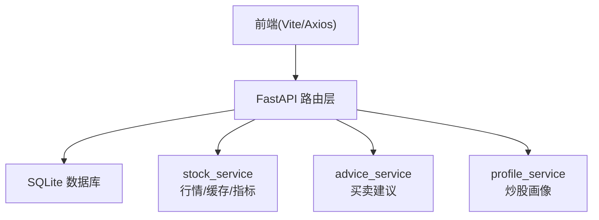
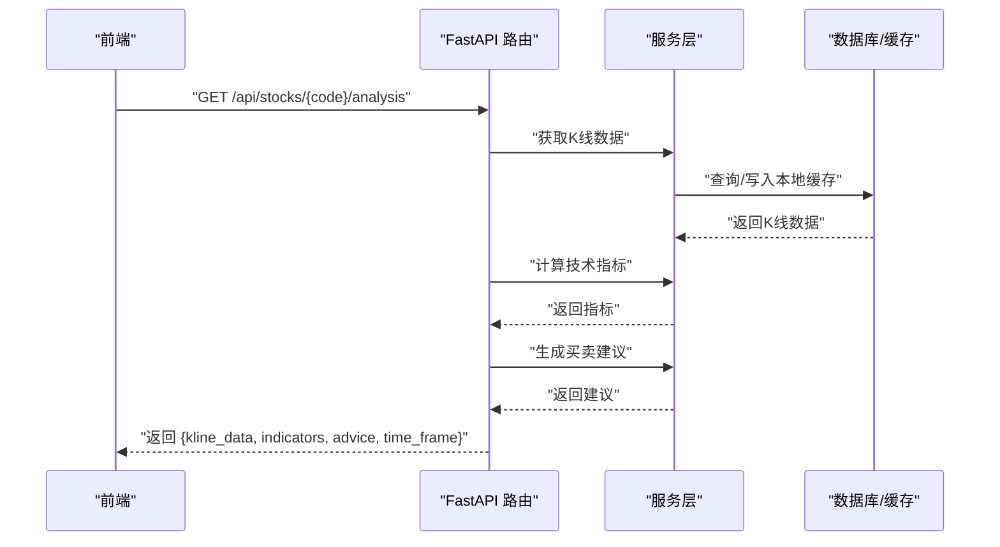
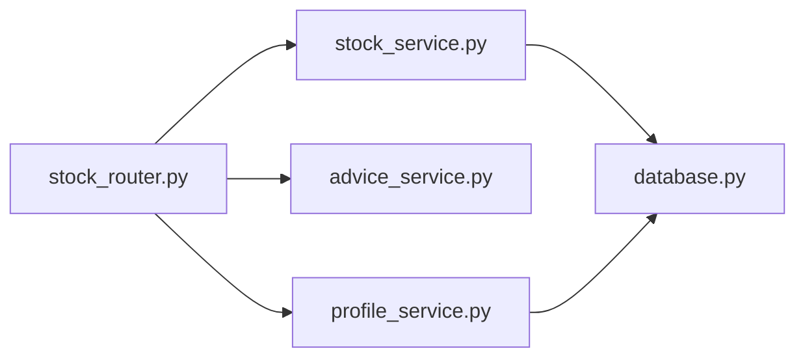

# API接口参考

> **本文引用的文件**
>
> - [backend/app/main.py](file://backend/app/main.py)
> - [backend/app/routers/stock_router.py](file://backend/app/routers/stock_router.py)
> - [backend/app/models/models.py](file://backend/app/models/models.py)
> - [backend/app/models/schemas.py](file://backend/app/models/schemas.py)
> - [backend/app/services/stock_service.py](file://backend/app/services/stock_service.py)
> - [backend/app/services/advice_service.py](file://backend/app/services/advice_service.py)
> - [backend/app/services/profile_service.py](file://backend/app/services/profile_service.py)
> - [backend/app/db/database.py](file://backend/app/db/database.py)
> - [frontend/src/services/api.ts](file://frontend/src/services/api.ts)
> - [frontend/src/types/index.ts](file://frontend/src/types/index.ts)
> - [doc/技术架构文档.md](file://doc/技术架构文档.md)
> - [start.sh](file://start.sh)

## 目录

1. [简介](#简介)

2. [项目结构](#项目结构)

3. [核心组件](#核心组件)

4. [架构总览](#架构总览)

5. [详细组件分析](#详细组件分析)

6. [依赖关系分析](#依赖关系分析)

7. [性能考量](#性能考量)

8. [故障排查指南](#故障排查指南)

9. [结论](#结论)

10. [附录](#附录)

## 简介

本文件为 Stock Foker 应用的完整 API 接口文档,覆盖以下业务域:

- 股票关注：获取/设置当前关注股票、更新时间框架、查询历史关注

- 股票数据：搜索股票、获取K线数据、获取完整分析（K线+技术指标+买卖建议）

- 交易记录：分页查询、新增、更新（补充实际结果）、删除

- 用户画像：基于交易记录生成炒股画像

文档包含：

- 接口清单与规范（HTTP方法、路径、参数、响应）

- 数据模型与类型定义

- 错误码与异常处理

- 认证机制、限流策略与版本管理

- 请求/响应示例与常见使用场景

- 架构与数据流说明

## 项目结构

后端采用 FastAPI + SQLAlchemy + SQLite 架构,前端使用 React + Vite + Axios。API 路由统一前缀为 /api,CORS 允许本地开发环境访问。

图表来源

- [backend/app/main.py:1-28](file://backend/app/main.py#L1-L28)

- [backend/app/routers/stock_router.py:15](file://backend/app/routers/stock_router.py#L15)

章节来源

- [backend/app/main.py:1-28](file://backend/app/main.py#L1-L28)

- [doc/技术架构文档.md:19-67](file://doc/技术架构文档.md#L19-L67)

## 核心组件

- 路由器:集中定义 /api 前缀下的全部 REST 接口,按功能模块组织

- 服务层：

  - stock_service：K线数据获取、本地缓存、技术指标计算

  - advice_service：基于多指标综合评分生成买卖建议

  - profile_service：统计交易画像

- 数据模型与 Schema：定义数据库表结构与请求/响应模型

- 数据库：SQLite，支持本地缓存与唯一约束

章节来源

- [backend/app/routers/stock_router.py:15](file://backend/app/routers/stock_router.py#L15)

- [backend/app/services/stock_service.py:131-327](file://backend/app/services/stock_service.py#L131-L327)

- [backend/app/services/advice_service.py:4-193](file://backend/app/services/advice_service.py#L4-L193)

- [backend/app/services/profile_service.py:6-114](file://backend/app/services/profile_service.py#L6-L114)

- [backend/app/models/models.py:25-75](file://backend/app/models/models.py#L25-L75)

- [backend/app/models/schemas.py:7-118](file://backend/app/models/schemas.py#L7-L118)

- [backend/app/db/database.py:1-24](file://backend/app/db/database.py#L1-L24)

## 架构总览

API 的典型调用链路如下:

- 前端通过 Axios 调用 /api 路由

- FastAPI 路由解析参数并注入数据库会话

- 服务层执行业务逻辑（数据获取/计算/统计）

- 返回标准化的 Pydantic 模型或字典结构

图表来源

- [backend/app/routers/stock_router.py:98-131](file://backend/app/routers/stock_router.py#L98-L131)

- [backend/app/services/stock_service.py:131-253](file://backend/app/services/stock_service.py#L131-L253)

- [backend/app/services/advice_service.py:4-173](file://backend/app/services/advice_service.py#L4-L173)

## 详细组件分析

### 股票关注接口

- 获取当前关注股票

  - 方法与路径：GET /api/focus

  - 功能：返回当前 is_active=1 的关注记录

  - 响应：FocusStockResponse 或 null

  - 状态码：200 成功；404 无关注记录时返回 null

  - 示例：参见“请求/响应示例”小节

- 设置当前关注股票

  - 方法与路径：POST /api/focus

  - 请求体：FocusStockCreate

  - 行为：自动将之前的关注标记为不活跃，并保存新关注

  - 响应：FocusStockResponse

  - 状态码：200 成功；500 远程数据源异常时抛出

- 更新当前关注股票的时间框架

  - 方法与路径：PUT /api/focus/timeframe

  - 请求体：TimeFrameUpdate

  - 行为：更新当前关注股票的时间框架

  - 响应：FocusStockResponse

  - 状态码：200 成功；404 当前无关注股票

- 获取历史关注记录

  - 方法与路径：GET /api/focus/history

  - 响应：FocusStockResponse 列表（最多50条，按创建时间倒序）

章节来源

- [backend/app/routers/stock_router.py:20-65](file://backend/app/routers/stock_router.py#L20-L65)

- [backend/app/models/schemas.py:8-27](file://backend/app/models/schemas.py#L8-L27)

- [backend/app/models/models.py:25-36](file://backend/app/models/models.py#L25-L36)

### 股票搜索与分析接口

- 搜索股票

  - 方法与路径：GET /api/stocks/search?keyword=...

  - 参数：keyword（字符串，必填）

  - 响应：StockSearchResult 数组（最多20条）

  - 状态码：200 成功；500 远程数据源异常

- 获取K线数据

  - 方法与路径：GET /api/stocks/{stock_code}/kline

  - 参数：

    - stock_code（路径参数，必填）

    - period（查询参数，可选，默认 daily；支持 daily/weekly/monthly）

    - start_date（查询参数，可选）

    - end_date（查询参数，可选）

  - 响应：StockKlineResponse（包含 stock_code、stock_name、kline_data、indicators）

  - 状态码：200 成功；500 远程数据源异常

- 获取完整分析（K线+指标+建议）

  - 方法与路径：GET /api/stocks/{stock_code}/analysis

  - 参数同上

  - 响应：对象包含 kline_data、indicators、advice、time_frame

  - advice 结构：signal、confidence、reasoning、indicators_summary

  - 状态码：200 成功；500 远程数据源异常

章节来源

- [backend/app/routers/stock_router.py:70-131](file://backend/app/routers/stock_router.py#L70-L131)

- [backend/app/models/schemas.py:68-95](file://backend/app/models/schemas.py#L68-L95)

- [backend/app/models/schemas.py:112-118](file://backend/app/models/schemas.py#L112-L118)

- [backend/app/services/stock_service.py:131-253](file://backend/app/services/stock_service.py#L131-L253)

- [backend/app/services/advice_service.py:4-173](file://backend/app/services/advice_service.py#L4-L173)

### 交易记录接口

- 列表查询

  - 方法与路径：GET /api/trades

  - 参数：

    - stock_code（查询参数，可选）

    - limit（查询参数，可选，默认50）

  - 响应：TradeRecordResponse 列表（按交易时间倒序）

- 新增交易记录

  - 方法与路径：POST /api/trades

  - 请求体：TradeRecordCreate

  - 响应：TradeRecordResponse

- 更新交易记录（补充实际结果）

  - 方法与路径：PUT /api/trades/{trade_id}

  - 路径参数：trade_id（整数）

  - 请求体：TradeRecordUpdate（可选字段 actual_result、result_note）

  - 响应：TradeRecordResponse

  - 状态码：200 成功；404 未找到记录

- 删除交易记录

  - 方法与路径：DELETE /api/trades/{trade_id}

  - 响应：{"message": "删除成功"}

  - 状态码：200 成功；404 未找到记录

章节来源

- [backend/app/routers/stock_router.py:136-184](file://backend/app/routers/stock_router.py#L136-L184)

- [backend/app/models/schemas.py:30-64](file://backend/app/models/schemas.py#L30-L64)

- [backend/app/models/models.py:38-56](file://backend/app/models/models.py#L38-L56)

### 用户画像接口

- 获取炒股画像

  - 方法与路径：GET /api/profile

  - 参数：

    - stock_code（查询参数，可选）

  - 响应：TradingProfile（包含胜率、平均盈亏、盈亏比、平均持有天数、交易频率、偏好时间框架、情绪准确率、常见买卖理由等）

  - 状态码：200 成功；当无数据时返回空画像

章节来源

- [backend/app/routers/stock_router.py:189-196](file://backend/app/routers/stock_router.py#L189-L196)

- [backend/app/models/schemas.py:97-110](file://backend/app/models/schemas.py#L97-L110)

- [backend/app/services/profile_service.py:6-97](file://backend/app/services/profile_service.py#L6-L97)

## 依赖关系分析

- 路由依赖服务层:分析接口同时依赖 stock_service 和 advice_service

- 服务层依赖数据库：stock_service 使用本地缓存表进行增量更新

- 前端依赖路由：Axios 封装了 /api 前缀的调用

图表来源

- [backend/app/routers/stock_router.py:15](file://backend/app/routers/stock_router.py#L15)

- [backend/app/services/stock_service.py:131-253](file://backend/app/services/stock_service.py#L131-L253)

- [backend/app/services/advice_service.py:4-173](file://backend/app/services/advice_service.py#L4-L173)

- [backend/app/services/profile_service.py:6-97](file://backend/app/services/profile_service.py#L6-L97)

- [backend/app/db/database.py:1-24](file://backend/app/db/database.py#L1-L24)

## 性能考量

- 本地缓存策略:首次从远程获取并写入 SQLite,后续仅增量更新,减少重复网络请求

- 指标计算：使用 pandas-ta 并对 NaN 值进行安全处理

- 数据量限制：历史关注默认限制50条，交易列表默认限制50条

- 失败降级：新浪接口失败时自动切换至 AKShare，保证可用性

章节来源

- [backend/app/services/stock_service.py:153-237](file://backend/app/services/stock_service.py#L153-L237)

- [backend/app/services/stock_service.py:240-253](file://backend/app/services/stock_service.py#L240-L253)

- [doc/技术架构文档.md:153-178](file://doc/技术架构文档.md#L153-L178)

## 故障排查指南

- HTTP 404:常见于交易记录或关注记录不存在

- HTTP 500：通常来自远程数据源异常（如新浪财经/AKShare），服务层已捕获并抛出

- CORS 问题：开发环境下需确保前端运行在允许的源（默认 localhost:5173）

- 数据为空：画像接口在无数据时返回空画像；分析接口在数据不足时建议持有

章节来源

- [backend/app/routers/stock_router.py:48-49](file://backend/app/routers/stock_router.py#L48-L49)

- [backend/app/routers/stock_router.py:167-184](file://backend/app/routers/stock_router.py#L167-L184)

- [backend/app/routers/stock_router.py:76-77](file://backend/app/routers/stock_router.py#L76-L77)

- [backend/app/main.py:9-15](file://backend/app/main.py#L9-L15)

## 结论

本 API 设计遵循 REST 规范,围绕"关注-行情-分析-记录-画像"的主线组织,具备本地缓存、指标计算与建议生成能力,适合个人投资辅助与学习使用。建议在生产环境中增加鉴权、限流与监控机制。

## 附录

### 认证机制

- 默认未启用鉴权,开发阶段通过 CORS 允许本地前端访问

- 生产环境建议引入 JWT/OAuth2 并在 FastAPI 中集成中间件

章节来源

- [backend/app/main.py:9-15](file://backend/app/main.py#L9-L15)

### 限流策略

- 仓库未实现内置限流

- 建议在网关或反向代理层配置限流，或在 FastAPI 中使用第三方扩展

### 版本管理

- API 标题与版本:title="Stock Foker API", version="0.1.0"

- 建议采用语义化版本控制并在路由中体现版本号（如 /api/v1/...）

章节来源

- [backend/app/main.py:7](file://backend/app/main.py#L7)

### 数据模型与类型定义

#### 关注股票模型

- FocusStockCreate:stock_code、stock_name、time_frame(默认 short)

- FocusStockResponse：id、stock_code、stock_name、time_frame、is_active、created_at

章节来源

- [backend/app/models/schemas.py:8-22](file://backend/app/models/schemas.py#L8-L22)

- [backend/app/models/models.py:25-36](file://backend/app/models/models.py#L25-L36)

#### 交易记录模型

- TradeRecordCreate:stock_code、stock_name、trade_type、price、quantity、reason、market_sentiment、target_price、expected_hold_days、traded_at

- TradeRecordUpdate：actual_result、result_note

- TradeRecordResponse：在 Create 基础上增加 actual_result、result_note、created_at

章节来源

- [backend/app/models/schemas.py:30-64](file://backend/app/models/schemas.py#L30-L64)

- [backend/app/models/models.py:38-56](file://backend/app/models/models.py#L38-L56)

#### 技术分析模型

- KlineData:date、open、close、high、low、volume、turnover

- TechnicalIndicators：ma5/ma10/ma20/ma60、macd、kdj、rsi、boll、volumes

- StockKlineResponse：stock_code、stock_name、kline_data、indicators

- TradingAdvice：signal、confidence、reasoning、indicators_summary

章节来源

- [backend/app/models/schemas.py:68-95](file://backend/app/models/schemas.py#L68-L95)

- [backend/app/models/schemas.py:112-118](file://backend/app/models/schemas.py#L112-L118)

#### 用户画像模型

- TradingProfile:total_trades、win_rate、avg_profit、avg_loss、profit_loss_ratio、avg_hold_days、trade_frequency、preferred_time_frame、sentiment_accuracy、common_buy_reasons、common_sell_reasons

章节来源

- [backend/app/models/schemas.py:97-110](file://backend/app/models/schemas.py#L97-L110)

### 请求/响应示例与常见场景

- 获取当前关注股票

  - 请求：GET /api/focus

  - 响应：FocusStockResponse 或 null

  - 场景：进入首页时展示当前关注的股票

- 设置关注股票

  - 请求：POST /api/focus

  - 请求体：FocusStockCreate（包含 stock_code、stock_name、time_frame）

  - 响应：FocusStockResponse

  - 场景：用户选择某只股票作为当前关注

- 更新时间框架

  - 请求：PUT /api/focus/timeframe

  - 请求体：{"time_frame": "short"|"medium"|"long"}

  - 响应：FocusStockResponse

  - 场景：根据市场变化调整关注周期

- 搜索股票

  - 请求：GET /api/stocks/search?keyword=...

  - 响应：StockSearchResult[]

  - 场景：输入关键字快速定位目标股票

- 获取K线与分析

  - 请求：GET /api/stocks/{code}/analysis?period=daily&start_date=&end_date=

  - 响应：包含 kline_data、indicators、advice、time_frame

  - 场景：查看某股票的完整技术分析报告

- 交易记录 CRUD

  - 列表：GET /api/trades?stock_code=&limit=

  - 新增：POST /api/trades

  - 更新：PUT /api/trades/{id}

  - 删除：DELETE /api/trades/{id}

  - 场景：记录买卖行为并补充实际结果

- 获取炒股画像

  - 请求：GET /api/profile?stock_code=

  - 响应：TradingProfile

  - 场景：回顾自己的交易习惯与表现

章节来源

- [frontend/src/services/api.ts:14-64](file://frontend/src/services/api.ts#L14-L64)

- [frontend/src/types/index.ts:1-94](file://frontend/src/types/index.ts#L1-L94)

### 错误码说明

- 200:成功

- 404：资源不存在（交易记录/关注记录）

- 500：服务器内部错误（远程数据源异常）

章节来源

- [backend/app/routers/stock_router.py:48-49](file://backend/app/routers/stock_router.py#L48-L49)

- [backend/app/routers/stock_router.py:167-184](file://backend/app/routers/stock_router.py#L167-L184)

- [backend/app/routers/stock_router.py:76-77](file://backend/app/routers/stock_router.py#L76-L77)

### 启动与访问

- 后端:uvicorn 运行在 <http://127.0.0.1:8000>

- 前端：Vite 运行在 <http://127.0.0.1:5173>

- 前端通过 /api 代理转发到后端

章节来源

- [doc/技术架构文档.md:180-196](file://doc/技术架构文档.md#L180-L196)

- [start.sh:46-87](file://start.sh#L46-L87)
