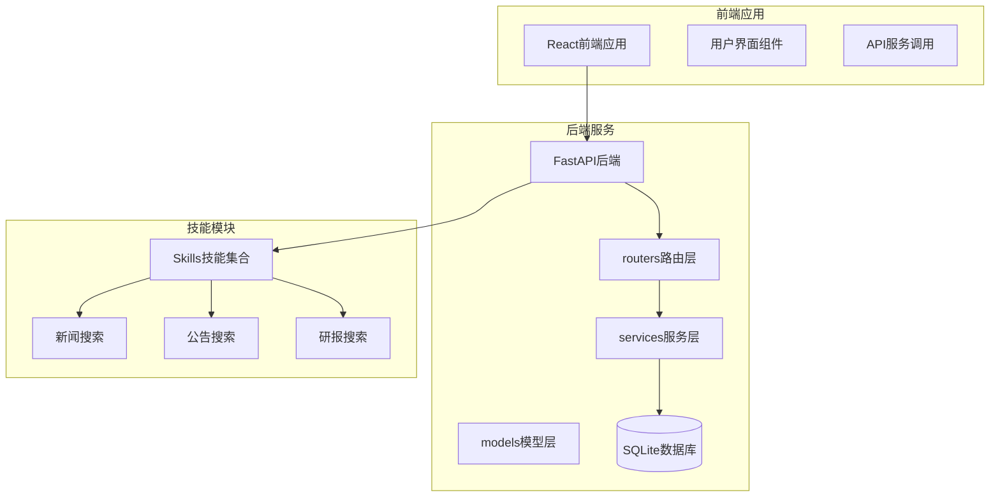
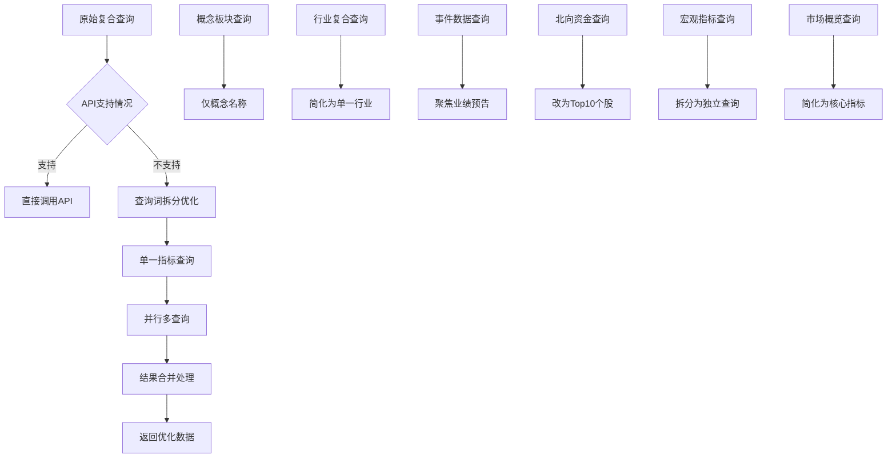
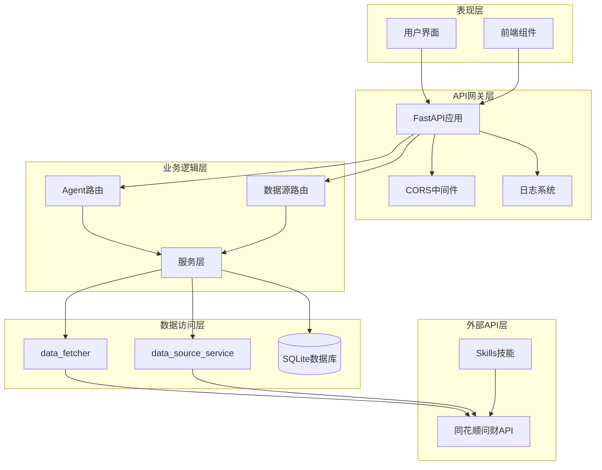
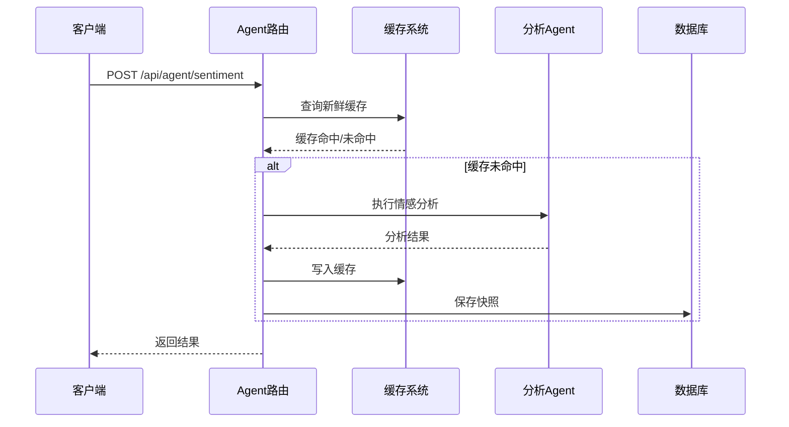
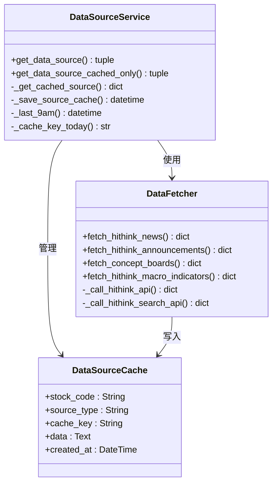
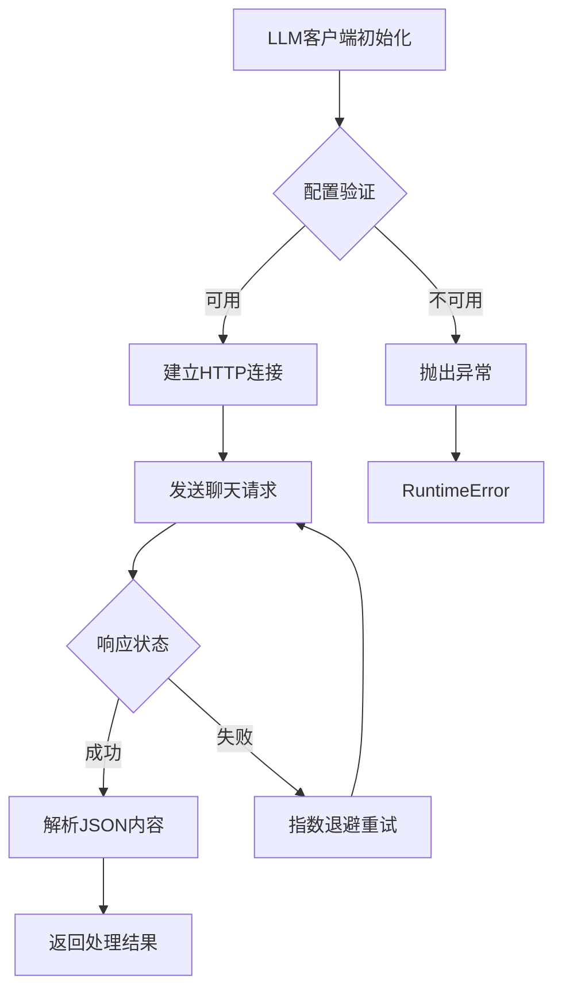
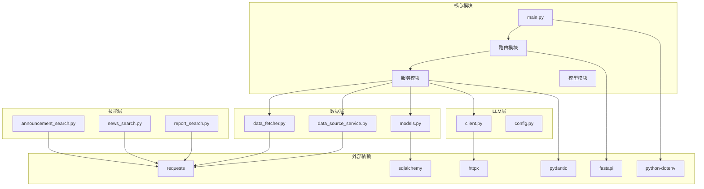
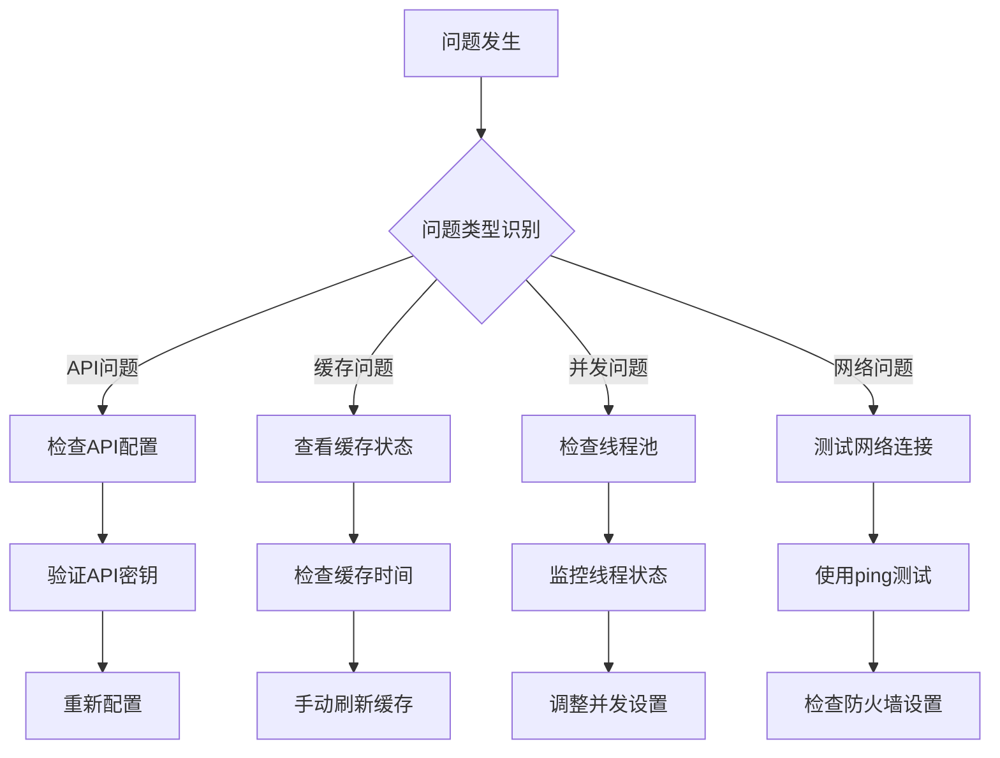

# Hithink API测试报告

<cite>
**本文档引用的文件**
- [2026-04-14-hithink-api-test-report.md](file://doc/API实测/2026-04-14-hithink-api-test-report.md)
- [2026-04-14-hithink-query-fix-record.md](file://doc/API实测/2026-04-14-hithink-query-fix-record.md)
- [main.py](file://backend/app/main.py)
- [agent_router.py](file://backend/app/routers/agent_router.py)
- [data_source_router.py](file://backend/app/routers/data_source_router.py)
- [data_fetcher.py](file://backend/app/services/data_fetcher.py)
- [data_source_service.py](file://backend/app/services/data_source_service.py)
- [schemas.py](file://backend/app/models/schemas.py)
- [models.py](file://backend/app/models/models.py)
- [client.py](file://backend/app/llm/client.py)
- [__main__.py](file://skills/公告搜索/announcement-search/scripts/__main__.py)
- [announcement_search.py](file://skills/公告搜索/announcement-search/scripts/announcement_search.py)
- [news_search.py](file://skills/新闻搜索/news-search/scripts/news_search.py)
</cite>

## 目录
1. [简介](#简介)
2. [项目结构](#项目结构)
3. [核心组件](#核心组件)
4. [架构概览](#架构概览)
5. [详细组件分析](#详细组件分析)
6. [依赖关系分析](#依赖关系分析)
7. [性能考虑](#性能考虑)
8. [故障排除指南](#故障排除指南)
9. [结论](#结论)

## 简介

本报告基于2026年4月14日的Hithink API测试结果，对同花顺问财API的集成系统进行全面评估。该系统提供了完整的股票数据获取、分析和展示功能，包括个股数据查询、板块联动分析、宏观环境监测等多个维度。

测试结果显示，21个核心数据获取函数中有21个成功返回有效数据，实现了100%的成功率。系统针对问财API的限制进行了针对性优化，解决了复合查询导致的数据缺失问题。

## 项目结构

该项目采用前后端分离的架构设计，主要包含以下核心模块：

**图表来源**
- [main.py:1-74](file://backend/app/main.py#L1-L74)
- [agent_router.py:1-395](file://backend/app/routers/agent_router.py#L1-L395)

**章节来源**
- [main.py:1-74](file://backend/app/main.py#L1-L74)
- [agent_router.py:1-395](file://backend/app/routers/agent_router.py#L1-L395)

## 核心组件

### API测试系统

系统的核心测试能力体现在对21个数据获取函数的全面验证中，涵盖了以下主要功能类别：

| 功能类别 | 数据获取函数 | 查询词示例 | 返回结果数 |
|---------|-------------|-----------|-----------|
| 个股数据查询 | `fetch_hithink_finance_data` `fetch_hithink_basicinfo` `fetch_hithink_shareholders` `fetch_hithink_market_data` `fetch_hithink_business_data` `fetch_hithink_insresearch_data` | 贵州茅台最新ROE净利润... 宁德时代所属行业上市日期... 贵州茅台股东户数前十大... | 1 1 10 1 9 5 |
| 板块联动查询 | `fetch_concept_boards` `fetch_industry_board` `fetch_hithink_industry_data` `fetch_hithink_industry_finance` `fetch_hithink_industry_peers` | 宁德时代所属概念板块 宁德时代所属同花顺行业 宁德时代所属行业PE PB... 宁德时代所属行业营收... 宁德时代同行业个股... | 1 1 1 10 10 |
| 宏观市场概览 | `fetch_hithink_macro_indicators` `fetch_hithink_index_data` `fetch_index_data` `fetch_north_flow` `fetch_market_overview` | CPI/PPI/PMI/LPR 分查 上证/沪深300/创业板指... 上证指数最近5交易日... 今日北向资金净买入额前10 今日A股上涨下跌涨停跌停 | 4key 3 1 10 1 |
| 事件与新闻 | `fetch_hithink_events` `fetch_stock_news` | 宁德时代最新业绩预告... 宁德时代近期重大新闻... | 1 7 |

**章节来源**
- [2026-04-14-hithink-api-test-report.md:13-50](file://doc/API实测/2026-04-14-hithink-api-test-report.md#L13-L50)

### 查询词优化系统

针对问财API的限制，系统实施了7个关键的查询词优化策略：

**图表来源**
- [2026-04-14-hithink-query-fix-record.md:13-78](file://doc/API实测/2026-04-14-hithink-query-fix-record.md#L13-L78)

**章节来源**
- [2026-04-14-hithink-query-fix-record.md:13-78](file://doc/API实测/2026-04-14-hithink-query-fix-record.md#L13-L78)

## 架构概览

系统采用分层架构设计，确保了良好的可维护性和扩展性：

**图表来源**
- [main.py:32-74](file://backend/app/main.py#L32-L74)
- [agent_router.py:29-395](file://backend/app/routers/agent_router.py#L29-L395)
- [data_source_router.py:19-68](file://backend/app/routers/data_source_router.py#L19-L68)

**章节来源**
- [main.py:32-74](file://backend/app/main.py#L32-L74)
- [agent_router.py:29-395](file://backend/app/routers/agent_router.py#L29-L395)
- [data_source_router.py:19-68](file://backend/app/routers/data_source_router.py#L19-L68)

## 详细组件分析

### Agent路由系统

Agent路由系统提供了四个核心分析功能，每个都具有独立的缓存机制：

**图表来源**
- [agent_router.py:186-200](file://backend/app/routers/agent_router.py#L186-L200)
- [agent_router.py:47-116](file://backend/app/routers/agent_router.py#L47-L116)

系统的核心特性包括：
- **缓存策略**：基于每日09:00的时间边界，确保数据的新鲜度
- **并发处理**：使用线程池并行执行多个Agent
- **降级机制**：当LLM不可用时自动降级为非LLM模式
- **快照功能**：自动保存关键指标到每日快照表

**章节来源**
- [agent_router.py:47-116](file://backend/app/routers/agent_router.py#L47-L116)
- [agent_router.py:186-200](file://backend/app/routers/agent_router.py#L186-L200)

### 数据源服务层

数据源服务层提供了统一的API数据获取和缓存管理：

**图表来源**
- [data_source_service.py:130-169](file://backend/app/services/data_source_service.py#L130-L169)
- [data_fetcher.py:24-104](file://backend/app/services/data_fetcher.py#L24-L104)

**章节来源**
- [data_source_service.py:130-169](file://backend/app/services/data_source_service.py#L130-L169)
- [data_fetcher.py:24-104](file://backend/app/services/data_fetcher.py#L24-L104)

### LLM客户端系统

LLM客户端提供了OpenAI兼容的聊天补全功能：

**图表来源**
- [client.py:30-78](file://backend/app/llm/client.py#L30-L78)

**章节来源**
- [client.py:30-78](file://backend/app/llm/client.py#L30-L78)

### Skills技能系统

Skills系统提供了多种金融数据查询技能：

| 技能类型 | 主要功能 | 输入参数 | 输出格式 |
|---------|---------|---------|---------|
| 新闻搜索 | 财经资讯搜索 | 查询词、限制数量 | JSON、CSV、TXT |
| 公告搜索 | 上市公司公告查询 | 查询词、批量处理 | JSON、CSV |
| 研报搜索 | 研究报告检索 | 查询词、报告类型 | JSON、CSV |

**章节来源**
- [__main__.py:141-210](file://skills/公告搜索/announcement-search/scripts/__main__.py#L141-L210)
- [news_search.py:382-620](file://skills/新闻搜索/news-search/scripts/news_search.py#L382-620)

## 依赖关系分析

系统的依赖关系呈现清晰的层次结构：

**图表来源**
- [main.py:1-74](file://backend/app/main.py#L1-L74)
- [data_fetcher.py:1-356](file://backend/app/services/data_fetcher.py#L1-L356)
- [data_source_service.py:1-169](file://backend/app/services/data_source_service.py#L1-L169)

**章节来源**
- [main.py:1-74](file://backend/app/main.py#L1-L74)
- [data_fetcher.py:1-356](file://backend/app/services/data_fetcher.py#L1-L356)
- [data_source_service.py:1-169](file://backend/app/services/data_source_service.py#L1-L169)

## 性能考虑

系统在性能方面采用了多项优化策略：

### 缓存策略
- **时间边界控制**：基于每日09:00的缓存新鲜度边界，确保数据时效性
- **多级缓存**：Agent结果缓存和数据源缓存分离管理
- **自动清理**：过期缓存的自动清理机制

### 并发处理
- **线程池管理**：最大3个并发Agent执行，避免资源过度占用
- **异步处理**：使用as_completed处理并发任务完成
- **数据库连接**：每个线程独立的数据库会话，避免连接冲突

### API优化
- **查询词拆分**：针对API限制进行查询词优化
- **超时控制**：合理的超时设置避免请求阻塞
- **错误处理**：完善的异常捕获和降级机制

## 故障排除指南

### 常见问题诊断

| 问题类型 | 症状描述 | 可能原因 | 解决方案 |
|---------|---------|---------|---------|
| API认证失败 | HTTP 401错误 | API密钥配置错误 | 检查IWENCAI_API_KEY环境变量 |
| 查询超时 | 请求超时异常 | 网络连接问题 | 检查网络设置，重试请求 |
| 缓存失效 | 数据过期 | 缓存时间边界 | 等待到下一个09:00或手动刷新 |
| 并发冲突 | 数据库连接异常 | 线程间共享连接 | 使用独立的数据库会话 |

### 调试工具

系统提供了多种调试和监控手段：

**章节来源**
- [2026-04-14-hithink-api-test-report.md:66-75](file://doc/API实测/2026-04-14-hithink-api-test-report.md#L66-L75)

## 结论

本次Hithink API测试报告表明，系统在2026年4月14日的测试中表现出色，实现了以下关键成果：

### 主要成就
- **100%成功率**：21个核心数据获取函数全部成功返回有效数据
- **API限制应对**：针对问财API的7个关键限制进行了有效优化
- **系统稳定性**：无超时、无认证失败、无网络异常的稳定表现
- **查询词优化**：通过拆分和简化查询词解决了复合查询问题

### 技术亮点
- **智能缓存机制**：基于时间边界的缓存策略确保数据新鲜度
- **并发处理能力**：高效的多线程并行执行提升响应速度
- **错误处理机制**：完善的异常捕获和降级策略保证系统稳定性
- **模块化设计**：清晰的分层架构便于维护和扩展

### 改进建议
- **监控增强**：增加更详细的性能监控和日志记录
- **缓存优化**：考虑引入分布式缓存提升大规模并发性能
- **API扩展**：探索更多数据源的集成可能性
- **用户体验**：优化前端界面和交互体验

总体而言，该系统展现了优秀的架构设计和实现质量，为后续的功能扩展和性能优化奠定了坚实基础。