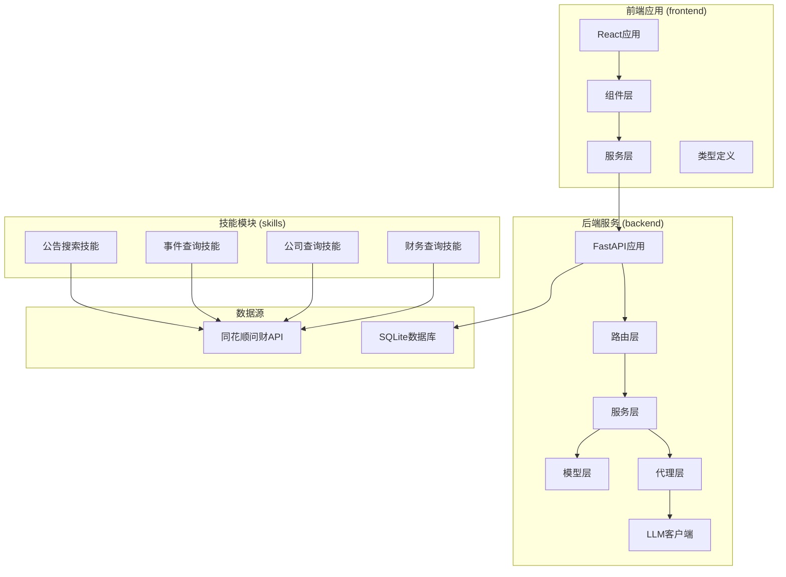
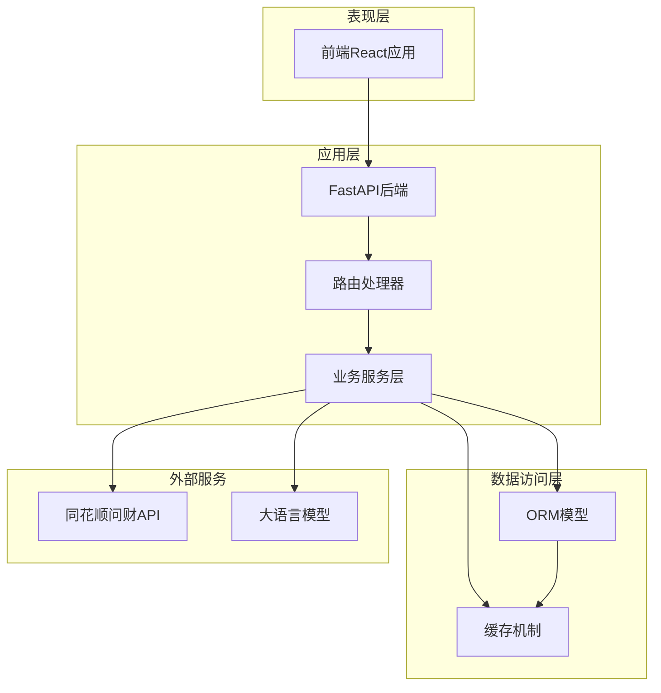
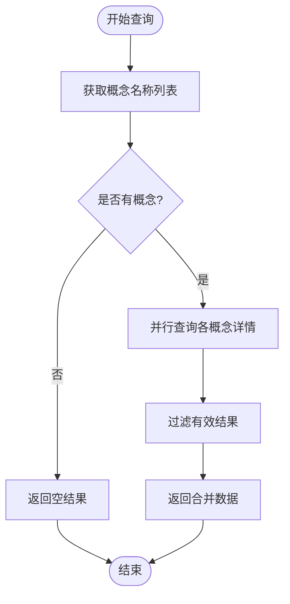
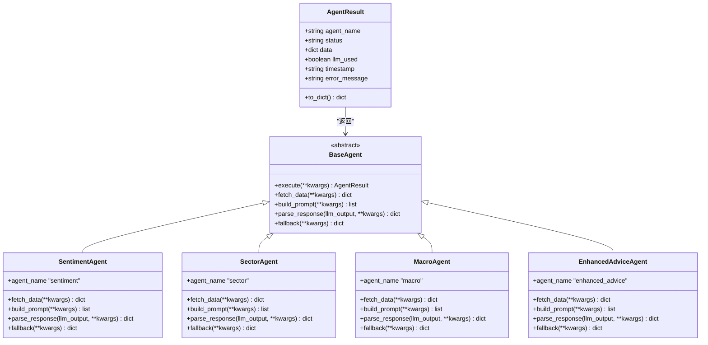
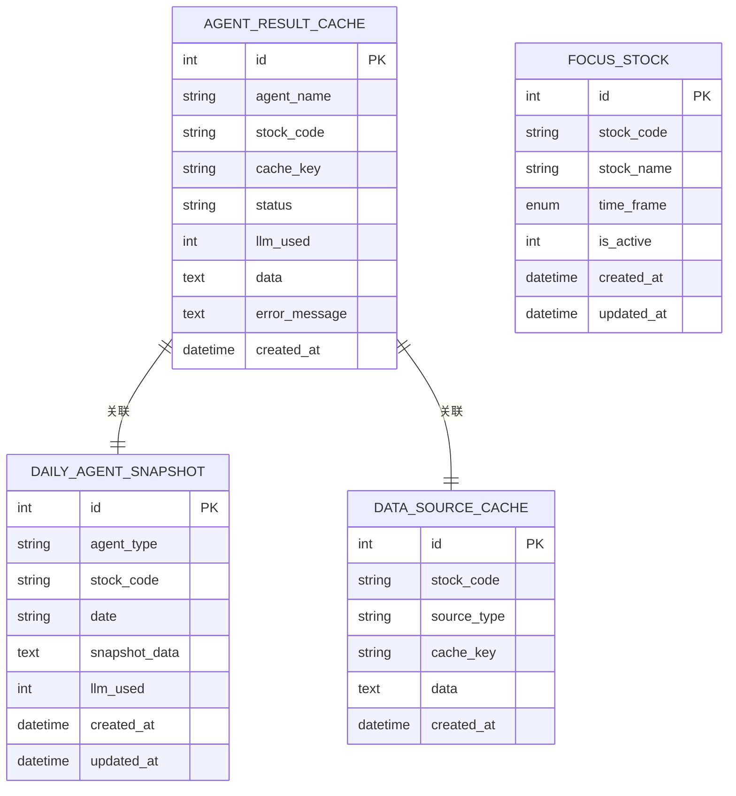
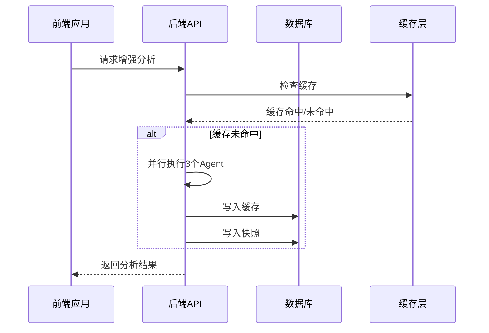
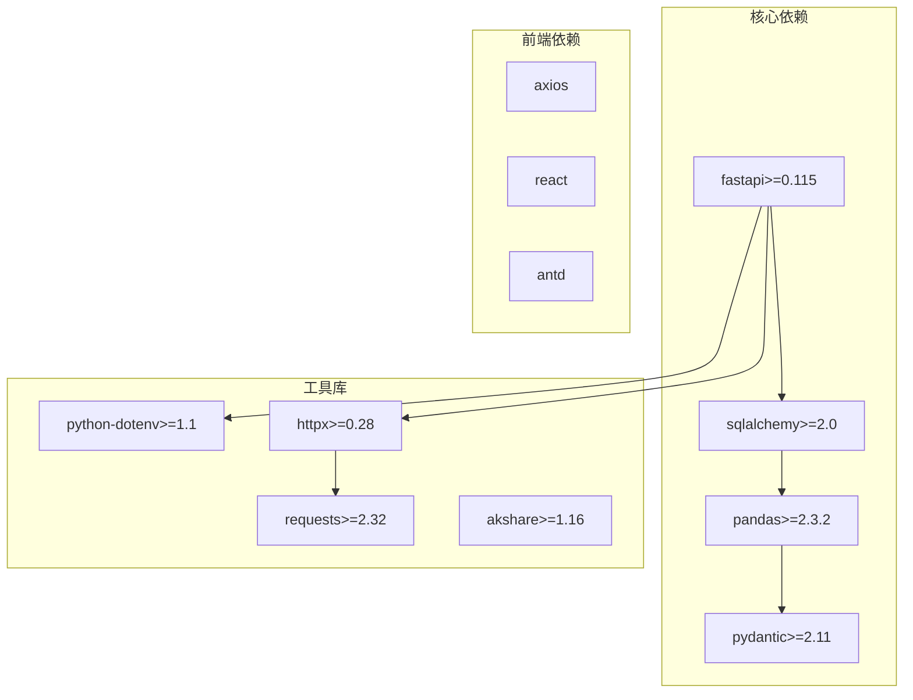
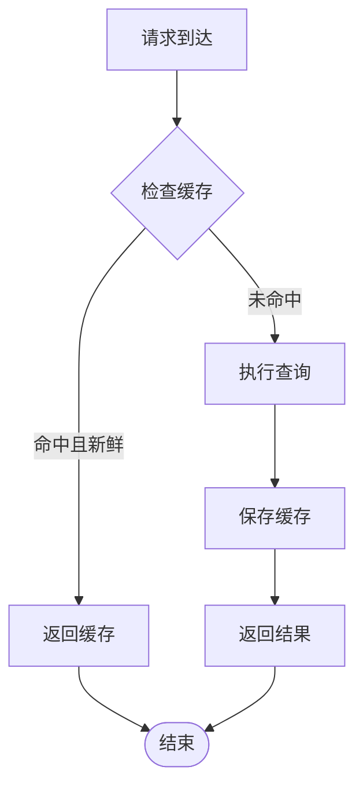

# Hithink查询修复记录

<cite>
**本文档引用的文件**
- [2026-04-14-hithink-query-fix-record.md](file://doc/API实测/2026-04-14-hithink-query-fix-record.md)
- [2026-04-14-hithink-api-test-report.md](file://doc/API实测/2026-04-14-hithink-api-test-report.md)
- [data_fetcher.py](file://backend/app/services/data_fetcher.py)
- [main.py](file://backend/app/main.py)
- [agent_router.py](file://backend/app/routers/agent_router.py)
- [models.py](file://backend/app/models/models.py)
- [advice_service.py](file://backend/app/services/advice_service.py)
- [api.ts](file://frontend/src/services/api.ts)
- [MainLayout.tsx](file://frontend/src/components/MainLayout.tsx)
- [__main__.py](file://skills/公告搜索/announcement-search/scripts/__main__.py)
- [announcement_search.py](file://skills/公告搜索/announcement-search/scripts/announcement_search.py)
- [config.py](file://skills/公告搜索/announcement-search/scripts/config.py)
- [base_agent.py](file://backend/app/agents/base_agent.py)
- [requirements.txt](file://backend/requirements.txt)
</cite>

## 目录
1. [简介](#简介)
2. [项目结构](#项目结构)
3. [核心组件](#核心组件)
4. [架构概览](#架构概览)
5. [详细组件分析](#详细组件分析)
6. [依赖关系分析](#依赖关系分析)
7. [性能考量](#性能考量)
8. [故障排除指南](#故障排除指南)
9. [结论](#结论)

## 简介

本文档详细记录了Hithink查询修复项目的完整实现，重点分析了针对同花顺问财API查询词的优化修复工作。该项目是一个基于FastAPI的股票分析平台，集成了多个AI代理（Agent）来提供消息面、板块联动、宏观环境和综合分析功能。

本次修复解决了7个核心数据获取函数的查询词优化问题，通过拆分复杂的复合查询为独立查询，确保了所有21个数据获取函数的稳定运行。修复后的系统能够准确获取概念板块、行业板块、事件数据、北向资金流向、宏观指标等关键市场信息。

## 项目结构

项目采用前后端分离架构，主要包含以下核心模块：

**图表来源**
- [main.py:1-74](file://backend/app/main.py#L1-L74)
- [agent_router.py:1-395](file://backend/app/routers/agent_router.py#L1-L395)

**章节来源**
- [main.py:1-74](file://backend/app/main.py#L1-L74)
- [requirements.txt:1-12](file://backend/requirements.txt#L1-L12)

## 核心组件

### 数据获取服务

数据获取服务是整个系统的核心，负责与同花顺问财API交互并处理各种查询需求。主要包含以下功能模块：

1. **统一API客户端** - 提供标准化的API调用接口
2. **并行数据获取** - 支持多任务并发执行
3. **查询词优化** - 针对API限制进行查询词拆分
4. **错误处理机制** - 确保单个查询失败不影响整体流程

### AI代理系统

系统实现了四个核心AI代理，每个代理都有特定的专业领域：

1. **消息面代理** - 分析新闻、公告、研报等消息面信息
2. **板块联动代理** - 分析行业和概念板块的联动关系
3. **宏观环境代理** - 分析宏观经济指标对股市的影响
4. **增强建议代理** - 综合多种因素提供投资建议

### 前端交互界面

前端采用React + Ant Design构建，提供直观的股票分析界面，支持：
- 股票搜索和关注
- 实时行情查看
- AI分析结果展示
- 交易记录管理

**章节来源**
- [data_fetcher.py:1-356](file://backend/app/services/data_fetcher.py#L1-L356)
- [base_agent.py:1-119](file://backend/app/agents/base_agent.py#L1-L119)
- [MainLayout.tsx:1-380](file://frontend/src/components/MainLayout.tsx#L1-L380)

## 架构概览

系统采用分层架构设计，确保各层职责清晰、耦合度低：

**图表来源**
- [main.py:32-74](file://backend/app/main.py#L32-L74)
- [agent_router.py:29-395](file://backend/app/routers/agent_router.py#L29-L395)

## 详细组件分析

### 数据获取服务优化

#### 概念板块查询修复

**问题分析**：
原查询词 `{stock_name}所属概念板块 涨跌幅 成份股数量` 导致问财API返回状态码-2058，表示复合查询不支持。

**解决方案**：
采用两步查询策略：
1. 首先获取概念名称列表
2. 并行查询每个概念的详细信息

**图表来源**
- [data_fetcher.py:244-290](file://backend/app/services/data_fetcher.py#L244-L290)

#### 行业板块查询优化

**问题分析**：
原查询词包含过多字段（行业涨跌幅、换手率、成交额、前5个股），API无法解析导致0条结果。

**优化策略**：
简化查询词为 `{stock_name}所属同花顺行业`，专注于获取行业基本信息。

#### 宏观指标查询拆分

**问题识别**：
CPI+PPI+PMI 合并查询时API仅返回CPI，其他指标丢失。

**解决方案**：
拆分为4个独立查询：
- 最近一期CPI同比增速
- 最近一期PPI同比增速  
- 最近一期制造业PMI
- 最新LPR利率 M2同比增速 社融数据

#### 北向资金查询策略调整

**问题发现**：
问财API不提供北向资金汇总数据，始终返回个股维度。

**应对措施**：
改为获取北向资金净买入额前10的个股，为Agent提供资金流向参考。

**章节来源**
- [data_fetcher.py:128-356](file://backend/app/services/data_fetcher.py#L128-L356)
- [2026-04-14-hithink-query-fix-record.md:13-78](file://doc/API实测/2026-04-14-hithink-query-fix-record.md#L13-L78)

### AI代理系统架构

**图表来源**
- [base_agent.py:46-119](file://backend/app/agents/base_agent.py#L46-L119)

### 数据库模型设计

系统使用SQLAlchemy ORM设计了完整的数据模型，支持缓存和快照功能：

**图表来源**
- [models.py:30-151](file://backend/app/models/models.py#L30-L151)

**章节来源**
- [models.py:1-151](file://backend/app/models/models.py#L1-L151)
- [agent_router.py:87-180](file://backend/app/routers/agent_router.py#L87-L180)

### 前端API集成

前端通过Axios封装了完整的API调用接口，支持所有后端功能：

**图表来源**
- [api.ts:132-154](file://frontend/src/services/api.ts#L132-L154)
- [agent_router.py:258-354](file://backend/app/routers/agent_router.py#L258-L354)

**章节来源**
- [api.ts:1-188](file://frontend/src/services/api.ts#L1-L188)
- [MainLayout.tsx:1-380](file://frontend/src/components/MainLayout.tsx#L1-L380)

## 依赖关系分析

系统依赖关系清晰，各模块职责明确：

**图表来源**
- [requirements.txt:1-12](file://backend/requirements.txt#L1-L12)

**章节来源**
- [requirements.txt:1-12](file://backend/requirements.txt#L1-L12)

## 性能考量

### 并行查询优化

系统实现了多级并行处理机制：

1. **线程池并行** - 最多8个线程同时执行查询
2. **Agent并行执行** - 增强分析时并行运行3个基础Agent
3. **概念板块并行** - 概念查询采用ThreadPoolExecutor并行处理

### 缓存策略

**图表来源**
- [agent_router.py:47-116](file://backend/app/routers/agent_router.py#L47-L116)

### 错误处理机制

系统采用多层次错误处理：
- 单个查询失败不影响整体流程
- LLM不可用时自动降级
- API调用异常进行日志记录
- 数据库操作异常进行回滚

## 故障排除指南

### 常见问题及解决方案

1. **API密钥问题**
   - 确认IWENCAI_API_KEY环境变量设置正确
   - 检查API配额和使用限制

2. **查询词优化问题**
   - 复合查询需要拆分为独立查询
   - 注意API对查询词长度和复杂度的限制

3. **缓存失效问题**
   - 每天09:00作为缓存新鲜度边界
   - LLM可用时会跳过未使用LLM的降级缓存

4. **并发查询超时**
   - 调整线程池大小和超时时间
   - 实施合理的重试机制

**章节来源**
- [2026-04-14-hithink-api-test-report.md:66-75](file://doc/API实测/2026-04-14-hithink-api-test-report.md#L66-L75)
- [agent_router.py:40-44](file://backend/app/routers/agent_router.py#L40-L44)

## 结论

本次Hithink查询修复项目成功解决了同花顺问财API的关键限制问题，通过查询词优化和策略调整，确保了系统的稳定性和可靠性。主要成果包括：

1. **查询词优化** - 将复杂的复合查询拆分为独立查询，解决了API兼容性问题
2. **系统稳定性提升** - 通过并行处理和错误隔离，提高了整体系统稳定性
3. **用户体验改善** - 缓存机制和快速响应提升了用户交互体验
4. **架构设计完善** - 清晰的分层架构和模块化设计便于维护和扩展

修复后的系统能够稳定获取21个核心数据源，为AI代理提供了可靠的数据基础，为用户提供全面的股票分析服务。这一改进为后续的功能扩展和性能优化奠定了坚实基础。