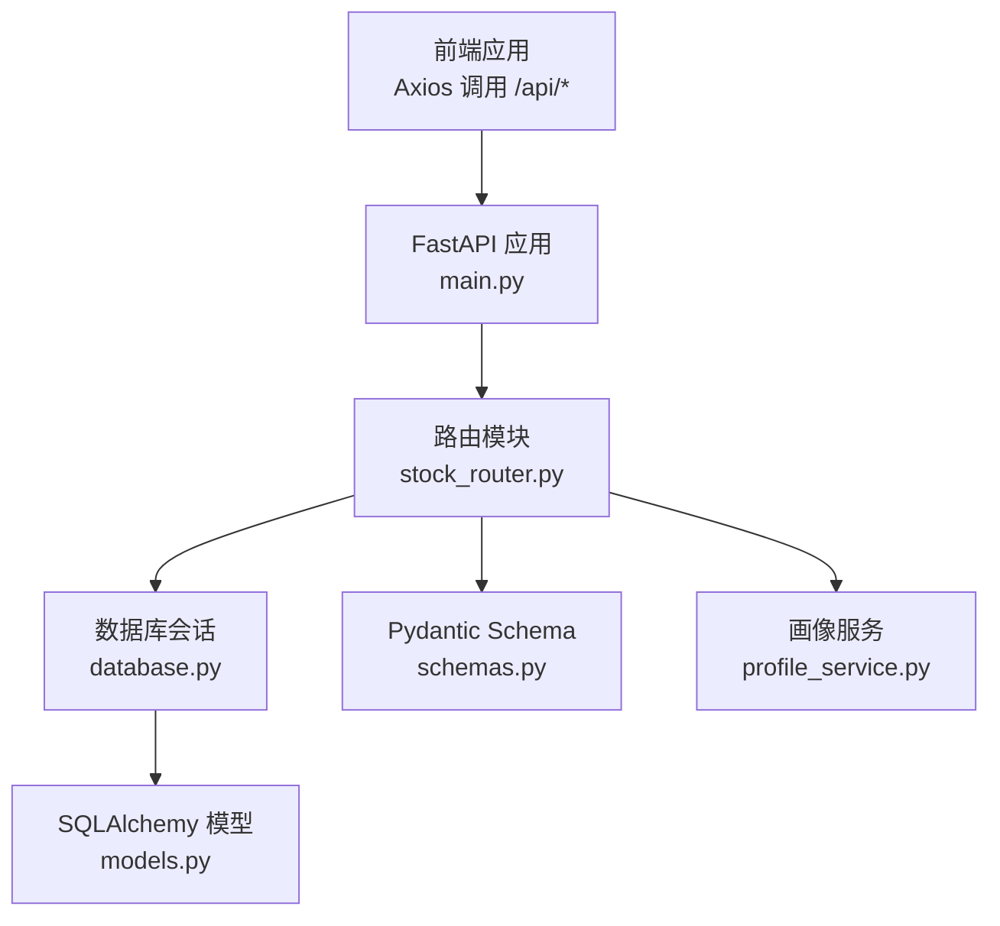
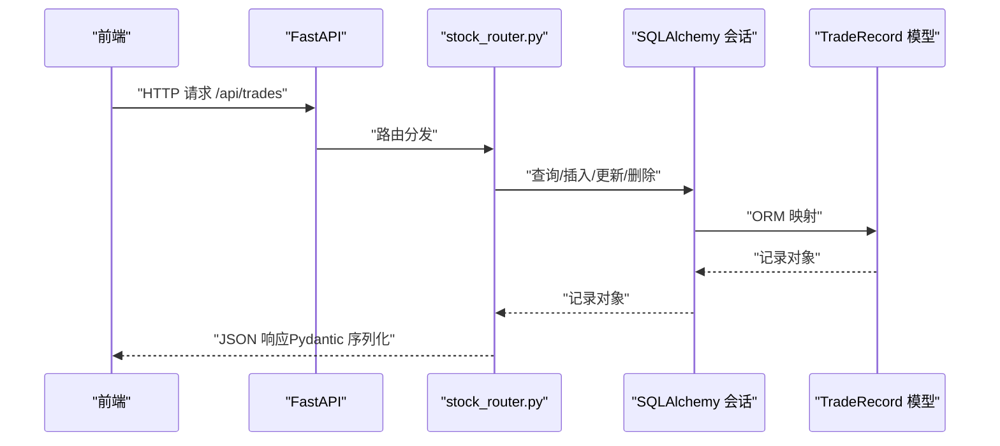
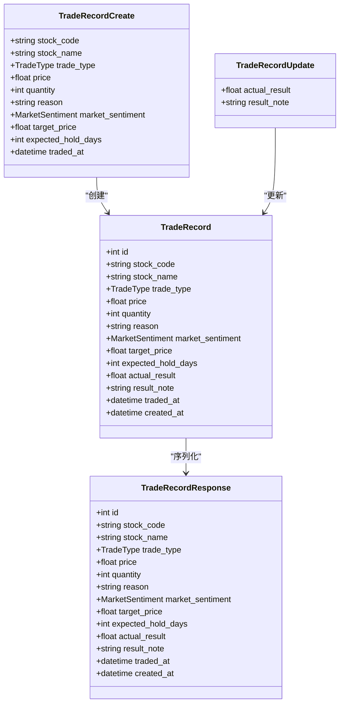
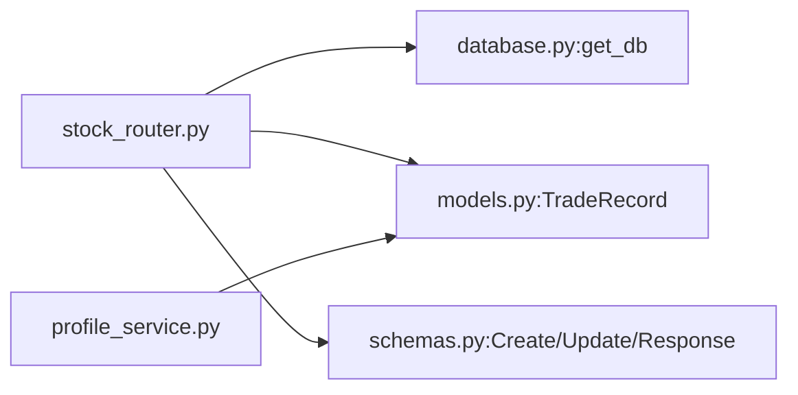

# 交易管理接口

<cite>
**本文引用的文件**
- [backend/app/main.py](file://backend/app/main.py)
- [backend/app/routers/stock_router.py](file://backend/app/routers/stock_router.py)
- [backend/app/models/schemas.py](file://backend/app/models/schemas.py)
- [backend/app/models/models.py](file://backend/app/models/models.py)
- [backend/app/db/database.py](file://backend/app/db/database.py)
- [backend/app/services/profile_service.py](file://backend/app/services/profile_service.py)
- [frontend/src/services/api.ts](file://frontend/src/services/api.ts)
- [frontend/src/types/index.ts](file://frontend/src/types/index.ts)
- [doc/技术架构文档.md](file://doc/技术架构文档.md)
</cite>

## 目录
1. [简介](#简介)
2. [项目结构](#项目结构)
3. [核心组件](#核心组件)
4. [架构总览](#架构总览)
5. [详细组件分析](#详细组件分析)
6. [依赖分析](#依赖分析)
7. [性能考虑](#性能考虑)
8. [故障排除指南](#故障排除指南)
9. [结论](#结论)
10. [附录](#附录)

## 简介
本文件为交易记录管理API的完整接口文档，覆盖交易记录的增删改查操作：
- 获取列表：GET /api/trades
- 创建记录：POST /api/trades
- 更新记录：PUT /api/trades/{trade_id}
- 删除记录：DELETE /api/trades/{trade_id}

同时详细说明数据模型 TradeRecordCreate、TradeRecordUpdate、TradeRecordResponse 的字段含义，解释交易状态字段与时间戳处理方式，并给出业务规则（stock_code 过滤、limit 限制、排序机制）、CRUD 示例与错误处理策略。

## 项目结构
后端采用 FastAPI + SQLAlchemy 架构，数据库使用 SQLite；前端通过 Axios 调用 /api 前缀的后端接口。交易记录相关路由集中在 stock_router.py，数据模型与 Pydantic Schema 在 models.py 与 schemas.py 中定义，数据库连接在 database.py 中初始化。

图表来源
- [backend/app/main.py:1-28](file://backend/app/main.py#L1-L28)
- [backend/app/routers/stock_router.py:1-197](file://backend/app/routers/stock_router.py#L1-L197)
- [backend/app/db/database.py:1-24](file://backend/app/db/database.py#L1-L24)
- [backend/app/models/models.py:1-75](file://backend/app/models/models.py#L1-L75)
- [backend/app/models/schemas.py:1-118](file://backend/app/models/schemas.py#L1-L118)
- [backend/app/services/profile_service.py:1-114](file://backend/app/services/profile_service.py#L1-L114)

章节来源
- [backend/app/main.py:1-28](file://backend/app/main.py#L1-L28)
- [doc/技术架构文档.md:19-67](file://doc/技术架构文档.md#L19-L67)

## 核心组件
- FastAPI 应用入口与 CORS 配置位于 main.py，注册 stock_router 并在启动时初始化数据库。
- 交易记录路由集中于 stock_router.py，提供 GET/POST/PUT/DELETE 四个端点。
- 数据模型 TradeRecord 定义在 models.py，包含交易记录的全部字段及枚举类型。
- Pydantic Schema 在 schemas.py 中定义，用于请求校验与响应序列化。
- 数据库连接与会话管理在 database.py 中完成，使用 SQLite 文件存储。
- 画像服务 profile_service.py 使用 TradeRecord 数据生成炒股画像，体现交易记录的业务价值。

章节来源
- [backend/app/main.py:1-28](file://backend/app/main.py#L1-L28)
- [backend/app/routers/stock_router.py:134-184](file://backend/app/routers/stock_router.py#L134-L184)
- [backend/app/models/models.py:38-56](file://backend/app/models/models.py#L38-L56)
- [backend/app/models/schemas.py:29-64](file://backend/app/models/schemas.py#L29-L64)
- [backend/app/db/database.py:1-24](file://backend/app/db/database.py#L1-L24)
- [backend/app/services/profile_service.py:6-97](file://backend/app/services/profile_service.py#L6-L97)

## 架构总览
交易记录 API 的调用链路如下：
- 前端通过 Axios 调用 /api/trades
- FastAPI 路由解析参数与请求体
- 路由函数使用 SQLAlchemy 会话查询或写入数据库
- 返回 Pydantic 序列化的响应模型

图表来源
- [frontend/src/services/api.ts:46-61](file://frontend/src/services/api.ts#L46-L61)
- [backend/app/routers/stock_router.py:136-184](file://backend/app/routers/stock_router.py#L136-L184)
- [backend/app/models/schemas.py:29-64](file://backend/app/models/schemas.py#L29-L64)
- [backend/app/models/models.py:38-56](file://backend/app/models/models.py#L38-L56)

## 详细组件分析

### 数据模型与字段说明
- TradeRecordCreate：创建交易记录时的输入模型，包含 stock_code、stock_name、trade_type、price、quantity、reason、market_sentiment、target_price、expected_hold_days、traded_at 等字段。
- TradeRecordUpdate：更新交易记录时的输入模型，仅允许更新 actual_result 和 result_note。
- TradeRecordResponse：交易记录的输出模型，包含上述字段以及自动生成的 created_at、id 等。

字段类型与取值范围：
- stock_code：字符串，非空，用于过滤与关联。
- stock_name：字符串，非空。
- trade_type：枚举 buy/sell。
- price：浮点数，非空。
- quantity：整数，非空。
- reason：可选文本。
- market_sentiment：可选枚举 optimistic/neutral/pessimistic。
- target_price：可选浮点数。
- expected_hold_days：可选整数。
- actual_result：可选浮点数，用于记录实际盈亏。
- result_note：可选文本，用于记录结果备注。
- traded_at：必填时间戳，表示交易发生时间。
- created_at：服务器自动生成，表示记录创建时间。

章节来源
- [backend/app/models/schemas.py:29-64](file://backend/app/models/schemas.py#L29-L64)
- [backend/app/models/models.py:38-56](file://backend/app/models/models.py#L38-L56)
- [doc/技术架构文档.md:83-101](file://doc/技术架构文档.md#L83-L101)

### 业务规则与参数说明
- stock_code 过滤：GET /api/trades 支持传入 stock_code 查询条件，仅返回匹配的交易记录。
- limit 限制：GET /api/trades 默认返回最多 50 条记录，可通过 limit 参数调整上限。
- 排序机制：按 traded_at 降序排列，最近的交易排在前面。
- 时间戳处理：traded_at 为必填字段，表示交易发生时间；created_at 由服务器自动生成，表示记录创建时间。

章节来源
- [backend/app/routers/stock_router.py:136-146](file://backend/app/routers/stock_router.py#L136-L146)
- [backend/app/models/models.py:54-55](file://backend/app/models/models.py#L54-L55)

### 接口定义与示例

#### 获取交易记录列表
- 方法与路径：GET /api/trades
- 查询参数：
  - stock_code：可选，按股票代码过滤
  - limit：可选，默认 50，最大限制由后端控制
- 响应：数组，元素为 TradeRecordResponse
- 示例（前端调用）：
  - 列出所有交易记录：调用 getTradeRecords()
  - 按股票过滤：调用 getTradeRecords(stockCode)

章节来源
- [backend/app/routers/stock_router.py:136-146](file://backend/app/routers/stock_router.py#L136-L146)
- [frontend/src/services/api.ts:46-50](file://frontend/src/services/api.ts#L46-L50)

#### 创建交易记录
- 方法与路径：POST /api/trades
- 请求体：TradeRecordCreate
- 响应：TradeRecordResponse
- 示例（前端调用）：createTradeRecord(TradeRecordCreate)

章节来源
- [backend/app/routers/stock_router.py:149-156](file://backend/app/routers/stock_router.py#L149-L156)
- [frontend/src/services/api.ts:52-53](file://frontend/src/services/api.ts#L52-L53)

#### 更新交易记录
- 方法与路径：PUT /api/trades/{trade_id}
- 路径参数：trade_id（整数）
- 请求体：TradeRecordUpdate（actual_result、result_note）
- 响应：TradeRecordResponse
- 错误处理：当记录不存在时返回 404
- 示例（前端调用）：updateTradeRecord(id, { actual_result, result_note })

章节来源
- [backend/app/routers/stock_router.py:159-173](file://backend/app/routers/stock_router.py#L159-L173)
- [frontend/src/services/api.ts:55-58](file://frontend/src/services/api.ts#L55-L58)

#### 删除交易记录
- 方法与路径：DELETE /api/trades/{trade_id}
- 路径参数：trade_id（整数）
- 响应：{"message": "删除成功"}
- 错误处理：当记录不存在时返回 404
- 示例（前端调用）：deleteTradeRecord(id)

章节来源
- [backend/app/routers/stock_router.py:176-184](file://backend/app/routers/stock_router.py#L176-L184)
- [frontend/src/services/api.ts:60-61](file://frontend/src/services/api.ts#L60-L61)

### 错误处理策略
- 404 未找到：当更新或删除的记录不存在时，返回 404 并提示“交易记录不存在”。
- 500 服务端错误：当内部服务异常（如外部数据源不可用）时，返回 500 并携带错误详情。
- 参数校验：请求体与查询参数由 Pydantic 自动校验，不符合 Schema 的请求会被拒绝。

章节来源
- [backend/app/routers/stock_router.py:167-168](file://backend/app/routers/stock_router.py#L167-L168)
- [backend/app/routers/stock_router.py:179-181](file://backend/app/routers/stock_router.py#L179-L181)

### 数据模型类图

图表来源
- [backend/app/models/models.py:38-56](file://backend/app/models/models.py#L38-L56)
- [backend/app/models/schemas.py:29-64](file://backend/app/models/schemas.py#L29-L64)

## 依赖分析
- 路由依赖数据库会话：每个路由函数通过 get_db 提供的 Session 进行数据库操作。
- 模型与 Schema 的映射：SQLAlchemy 模型与 Pydantic Schema 保持字段一致，确保 ORM 对象能被正确序列化为 JSON。
- 服务层集成：画像服务 profile_service.py 直接使用 TradeRecord 模型进行统计分析，体现交易记录在业务中的作用。

图表来源
- [backend/app/routers/stock_router.py:1-13](file://backend/app/routers/stock_router.py#L1-L13)
- [backend/app/db/database.py:14-19](file://backend/app/db/database.py#L14-L19)
- [backend/app/models/models.py:38-56](file://backend/app/models/models.py#L38-L56)
- [backend/app/models/schemas.py:29-64](file://backend/app/models/schemas.py#L29-L64)
- [backend/app/services/profile_service.py:1-3](file://backend/app/services/profile_service.py#L1-L3)

章节来源
- [backend/app/routers/stock_router.py:1-13](file://backend/app/routers/stock_router.py#L1-L13)
- [backend/app/db/database.py:14-19](file://backend/app/db/database.py#L14-L19)
- [backend/app/models/models.py:38-56](file://backend/app/models/models.py#L38-L56)
- [backend/app/models/schemas.py:29-64](file://backend/app/models/schemas.py#L29-L64)
- [backend/app/services/profile_service.py:1-3](file://backend/app/services/profile_service.py#L1-L3)

## 性能考虑
- 查询优化：GET /api/trades 支持 stock_code 过滤与 limit 限制，避免全表扫描；默认按 traded_at 降序返回，利于前端分页展示。
- 数据库连接：SQLite 适合本地开发与轻量场景；若扩展到生产，建议使用更强大的数据库并启用连接池。
- 序列化开销：Pydantic 序列化对响应性能影响较小，但应避免在响应中包含不必要的大字段。

## 故障排除指南
- 404 未找到：确认 trade_id 是否正确，或检查是否存在 stock_code 过滤导致无结果。
- 500 服务端错误：检查后端日志，确认外部数据源可用性与网络连通性。
- 参数错误：确保请求体符合 TradeRecordCreate/TradeRecordUpdate 的字段要求，特别是 traded_at 为必填时间戳。

章节来源
- [backend/app/routers/stock_router.py:167-168](file://backend/app/routers/stock_router.py#L167-L168)
- [backend/app/routers/stock_router.py:179-181](file://backend/app/routers/stock_router.py#L179-L181)

## 结论
交易记录管理 API 提供了完整的 CRUD 能力，结合 stock_code 过滤、limit 限制与按 traded_at 降序排序，满足日常交易记录的查询与维护需求。通过 Pydantic Schema 保证数据一致性，配合 SQLAlchemy ORM 实现稳定的数据访问。前端通过 Axios 封装的 API 方法与后端交互，形成清晰的前后端协作模式。

## 附录

### API 端点一览
- GET /api/trades：获取交易记录列表（支持 stock_code 过滤与 limit 限制）
- POST /api/trades：创建交易记录
- PUT /api/trades/{trade_id}：更新交易记录（补充实际结果）
- DELETE /api/trades/{trade_id}：删除交易记录

章节来源
- [doc/技术架构文档.md:138-145](file://doc/技术架构文档.md#L138-L145)
- [backend/app/routers/stock_router.py:136-184](file://backend/app/routers/stock_router.py#L136-L184)