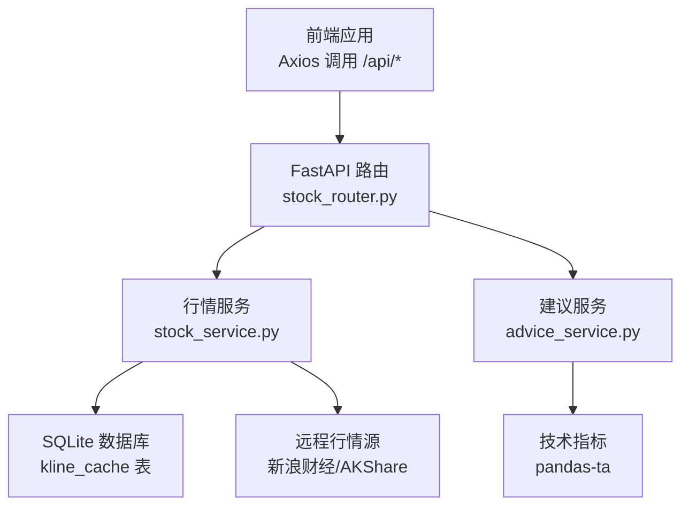
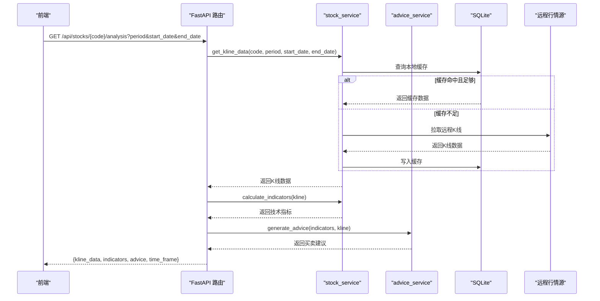
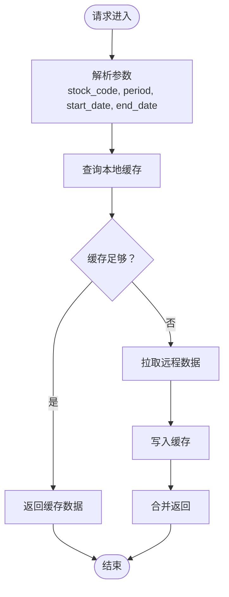
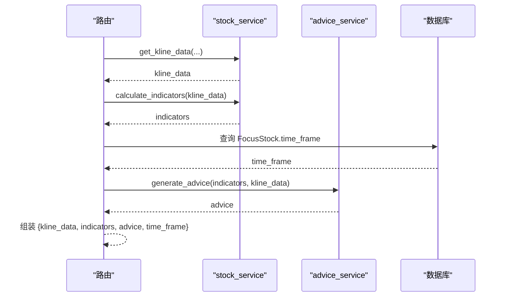
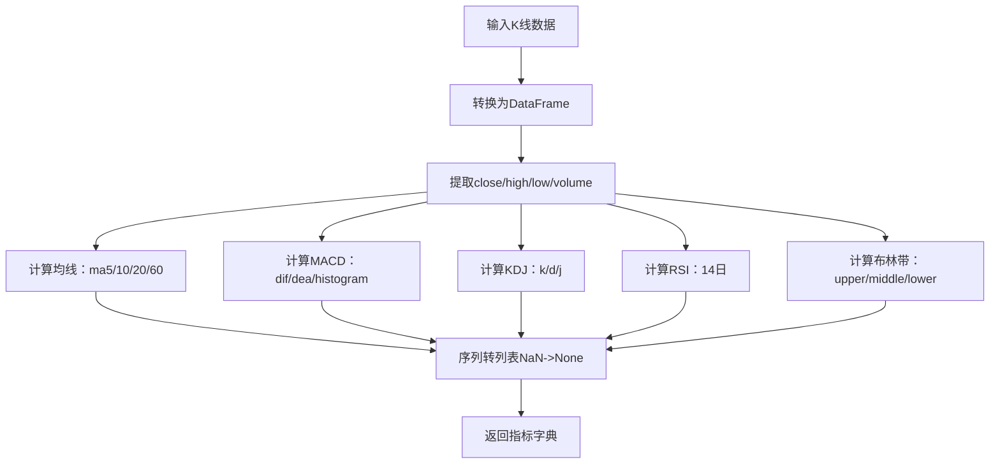
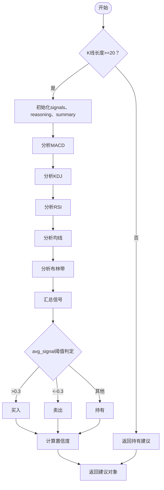
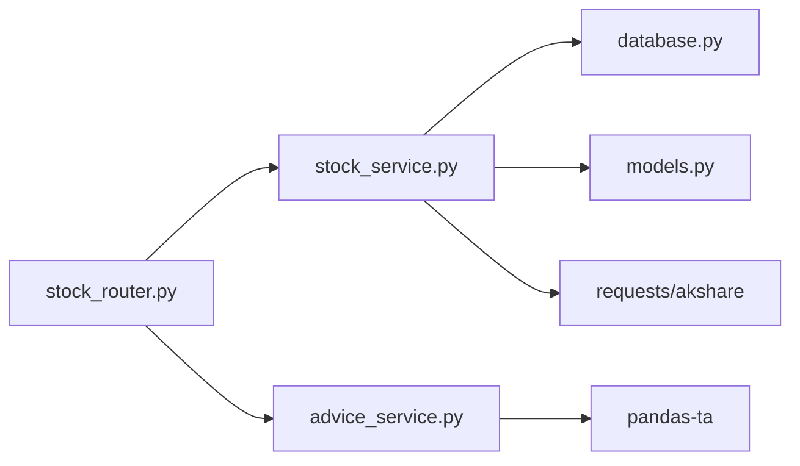

# 技术分析接口

<cite>
**本文引用的文件**

- [stock_router.py](file://backend/app/routers/stock_router.py)

- [stock_service.py](file://backend/app/services/stock_service.py)

- [advice_service.py](file://backend/app/services/advice_service.py)

- [schemas.py](file://backend/app/models/schemas.py)

- [models.py](file://backend/app/models/models.py)

- [database.py](file://backend/app/db/database.py)

- [api.ts](file://frontend/src/services/api.ts)

- [index.ts](file://frontend/src/types/index.ts)

- [技术架构文档.md](file://doc/技术架构文档.md)
</cite>

## 目录
1. [简介](#简介)

2. [项目结构](#项目结构)

3. [核心组件](#核心组件)

4. [架构总览](#架构总览)

5. [详细组件分析](#详细组件分析)

6. [依赖关系分析](#依赖关系分析)

7. [性能考量](#性能考量)

8. [故障排查指南](#故障排查指南)

9. [结论](#结论)

10. [附录](#附录)

## 简介
本文件面向技术分析相关API，聚焦以下两个核心接口：

- 获取K线数据：GET /api/stocks/{stock_code}/kline

- 获取完整分析：GET /api/stocks/{stock_code}/analysis

内容涵盖：

- 参数配置（period、start_date、end_date）

- 技术指标计算流程（均线、MACD、KDJ、RSI、布林带）

- 买卖建议生成机制（AdviceService算法逻辑）

- 时间框架（time_frame）对分析结果的影响

- 完整的数据分析流程示例（K线数据结构、技术指标格式、建议输出格式）

## 项目结构
后端采用FastAPI + SQLAlchemy + SQLite架构，前端使用React + TypeScript + Axios。接口路由集中在stock_router.py，业务逻辑分布在stock_service.py和advice_service.py中，数据模型与数据库连接在models.py和database.py中定义。

图表来源

- [stock_router.py:82-131](file://backend/app/routers/stock_router.py#L82-L131)

- [stock_service.py:131-327](file://backend/app/services/stock_service.py#L131-L327)

- [advice_service.py:4-193](file://backend/app/services/advice_service.py#L4-L193)

- [database.py:1-24](file://backend/app/db/database.py#L1-L24)

章节来源

- [技术架构文档.md:19-67](file://doc/技术架构文档.md#L19-L67)

- [stock_router.py:15-131](file://backend/app/routers/stock_router.py#L15-L131)

## 核心组件
- 路由层（stock_router.py）

  - 提供/kline和/analysis两个核心接口，负责参数解析、调用服务层、异常处理与统一响应。

- 服务层

  - stock_service.py：负责K线数据获取（本地缓存+远程拉取）、技术指标计算（pandas-ta）。

  - advice_service.py：基于多指标综合评分生成买卖建议与推理过程。

- 数据模型与数据库

  - models.py：定义TimeFrame枚举、FocusStock、KlineCache等模型。

  - database.py：SQLite连接与初始化。

- 前端类型与调用

  - frontend/src/types/index.ts：定义KlineData、TechnicalIndicators、TradingAdvice、StockAnalysis等类型。

  - frontend/src/services/api.ts：封装Axios调用，支持传入period、start_date、end_date参数。

章节来源

- [stock_router.py:82-131](file://backend/app/routers/stock_router.py#L82-L131)

- [stock_service.py:131-327](file://backend/app/services/stock_service.py#L131-L327)

- [advice_service.py:4-193](file://backend/app/services/advice_service.py#L4-L193)

- [models.py:8-75](file://backend/app/models/models.py#L8-L75)

- [database.py:1-24](file://backend/app/db/database.py#L1-L24)

- [api.ts:33-44](file://frontend/src/services/api.ts#L33-L44)

- [index.ts:15-49](file://frontend/src/types/index.ts#L15-L49)

## 架构总览
接口调用链路如下：

- 前端通过Axios调用后端接口，传递period、start_date、end_date等查询参数。

- 路由层解析参数并调用服务层。

- stock_service获取K线数据（优先本地缓存，缺失部分增量拉取远程），随后计算技术指标。

- advice_service基于指标生成买卖建议与推理过程。

- 返回包含kline_data、indicators、advice、time_frame的JSON对象。

图表来源

- [stock_router.py:98-131](file://backend/app/routers/stock_router.py#L98-L131)

- [stock_service.py:131-327](file://backend/app/services/stock_service.py#L131-L327)

- [advice_service.py:4-193](file://backend/app/services/advice_service.py#L4-L193)

## 详细组件分析

### 接口一：获取K线数据（GET /api/stocks/{stock_code}/kline）
- 功能概述

  - 获取指定股票的K线数据，支持按周期（daily/weekly/monthly）与日期范围过滤。

  - 优先读取本地SQLite缓存，若缓存不完整则增量拉取远程数据并写回缓存。

- 关键参数

  - stock_code：股票代码（路径参数）

  - period：周期，可选值："daily"、"weekly"、"monthly"

  - start_date：开始日期，格式YYYYMMDD或YYYY-MM-DD（可选）

  - end_date：结束日期，格式YYYYMMDD或YYYY-MM-DD（可选）

- 返回结构

  - K线数据列表，每条记录包含date、open、close、high、low、volume、turnover字段。

- 异常处理

  - 远程拉取失败时，若有缓存则返回缓存；否则抛出HTTP 500错误。

图表来源

- [stock_router.py:82-96](file://backend/app/routers/stock_router.py#L82-L96)

- [stock_service.py:131-237](file://backend/app/services/stock_service.py#L131-L237)

章节来源

- [stock_router.py:82-96](file://backend/app/routers/stock_router.py#L82-L96)

- [stock_service.py:131-237](file://backend/app/services/stock_service.py#L131-L237)

- [database.py:58-75](file://backend/app/models/models.py#L58-L75)

### 接口二：获取完整分析（GET /api/stocks/{stock_code}/analysis）
- 功能概述

  - 返回完整的分析结果：K线数据、技术指标、买卖建议及当前关注股票的时间框架。

- 关键参数

  - stock_code：股票代码（路径参数）

  - period、start_date、end_date：同上

- 处理流程

  - 调用get_kline_data获取K线数据

  - 调用calculate_indicators计算技术指标

  - 从FocusStock表读取当前关注股票的时间框架（time_frame）

  - 调用generate_advice生成买卖建议

  - 返回{kline_data, indicators, advice, time_frame}

- 返回结构

  - kline_data：K线数据数组

  - indicators：技术指标对象

  - advice：买卖建议对象

  - time_frame：字符串，如"short"/"medium"/"long"

图表来源

- [stock_router.py:98-131](file://backend/app/routers/stock_router.py#L98-L131)

- [stock_service.py:255-319](file://backend/app/services/stock_service.py#L255-L319)

- [advice_service.py:4-173](file://backend/app/services/advice_service.py#L4-L173)

- [models.py:25-35](file://backend/app/models/models.py#L25-L35)

章节来源

- [stock_router.py:98-131](file://backend/app/routers/stock_router.py#L98-L131)

- [stock_service.py:255-319](file://backend/app/services/stock_service.py#L255-L319)

- [advice_service.py:4-173](file://backend/app/services/advice_service.py#L4-L173)

- [models.py:25-35](file://backend/app/models/models.py#L25-L35)

### 技术指标计算流程（stock_service.calculate_indicators）
- 输入：K线数据DataFrame（close、high、low、volume）

- 输出：包含以下指标的字典

  - ma5、ma10、ma20、ma60：均线序列（含None占位）

  - macd：包含dif、dea、histogram三列

  - kdj：包含k、d、j三列

  - rsi：RSI序列

  - boll：包含upper、middle、lower三列

  - volumes：成交量序列

- 计算方法

  - 使用pandas_ta库进行标准化计算，序列中的NaN值转换为None以便JSON序列化。

图表来源

- [stock_service.py:255-319](file://backend/app/services/stock_service.py#L255-L319)

章节来源

- [stock_service.py:255-319](file://backend/app/services/stock_service.py#L255-L319)

### 买卖建议生成机制（advice_service.generate_advice）
- 输入：indicators（技术指标字典）、kline_data（K线数据）

- 输出：包含signal、confidence、reasoning、indicators_summary的对象

- 算法要点

  - 数据校验：若K线长度小于20，直接返回持有建议。

  - 指标分析：

    - MACD：金叉/死叉、多头/空头排列

    - KDJ：超买/超卖、偏多/偏空

    - RSI：超买/超卖

    - 均线：多头/空头排列

    - 布林带：触及上下轨

  - 综合评分：对各指标信号加权平均，得到综合评分avg_signal

  - 信号判定：

    - avg_signal > 0.3：买入

    - avg_signal < -0.3：卖出

    - 否则：持有

  - 置信度：confidence = min(abs(avg_signal)/1.5, 1.0)

  - 推理：reasoning包含每项指标的判断依据

图表来源

- [advice_service.py:4-173](file://backend/app/services/advice_service.py#L4-L173)

章节来源

- [advice_service.py:4-173](file://backend/app/services/advice_service.py#L4-L173)

### 时间框架（time_frame）对分析结果的影响
- 当前关注股票的时间框架来自FocusStock表的time_frame字段，接口会将其作为analysis响应的一部分返回。

- 建议：前端可据此调整显示策略或作为后续决策参考，但当前接口未在算法中直接使用该字段进行权重调整。

章节来源

- [stock_router.py:117-131](file://backend/app/routers/stock_router.py#L117-L131)

- [models.py:25-35](file://backend/app/models/models.py#L25-L35)

### 数据结构与格式规范

#### K线数据结构（KlineData）
- 字段

  - date：字符串，日期

  - open/close/high/low：浮点数

  - volume：成交量（浮点数）

  - turnover：换手率（可选，浮点数）

章节来源

- [schemas.py:68-76](file://backend/app/models/schemas.py#L68-L76)

- [index.ts:15-23](file://frontend/src/types/index.ts#L15-L23)

#### 技术指标格式（TechnicalIndicators）
- 字段

  - ma5/ma10/ma20/ma60：数值数组（含None占位）

  - macd：包含dif、dea、histogram三列数组

  - kdj：包含k、d、j三列数组

  - rsi：数值数组（含None占位）

  - boll：包含upper、middle、lower三列数组

  - volumes：成交量数组

章节来源

- [schemas.py:78-88](file://backend/app/models/schemas.py#L78-L88)

- [index.ts:25-35](file://frontend/src/types/index.ts#L25-L35)

#### 买卖建议格式（TradingAdvice）
- 字段

  - signal：字符串，"buy"|"sell"|"hold"

  - confidence：浮点数，0~1

  - reasoning：字符串数组，推理过程

  - indicators_summary：字典，关键指标摘要

章节来源

- [schemas.py:112-118](file://backend/app/models/schemas.py#L112-L118)

- [index.ts:37-42](file://frontend/src/types/index.ts#L37-L42)

#### 完整分析响应格式（StockAnalysis）
- 字段

  - kline_data：K线数据数组

  - indicators：技术指标对象

  - advice：买卖建议对象

  - time_frame：字符串，如"short"/"medium"/"long"

章节来源

- [schemas.py:90-95](file://backend/app/models/schemas.py#L90-L95)

- [index.ts:44-49](file://frontend/src/types/index.ts#L44-L49)

## 依赖关系分析
- 组件耦合

  - 路由层依赖服务层（stock_service、advice_service）

  - 服务层依赖数据库（SQLAlchemy）与外部行情源（requests/akshare）

  - 建议服务独立于数据库，仅依赖指标数据

- 外部依赖

  - pandas-ta：技术指标计算

  - akshare：AKShare行情数据

  - 新浪财经：主数据源，失败时降级至AKShare

- 潜在循环依赖

  - 未发现循环导入

图表来源

- [stock_router.py:1-131](file://backend/app/routers/stock_router.py#L1-L131)

- [stock_service.py:1-327](file://backend/app/services/stock_service.py#L1-L327)

- [advice_service.py:1-193](file://backend/app/services/advice_service.py#L1-L193)

- [database.py:1-24](file://backend/app/db/database.py#L1-L24)

- [models.py:1-75](file://backend/app/models/models.py#L1-L75)

章节来源

- [stock_router.py:1-131](file://backend/app/routers/stock_router.py#L1-L131)

- [stock_service.py:1-327](file://backend/app/services/stock_service.py#L1-L327)

- [advice_service.py:1-193](file://backend/app/services/advice_service.py#L1-L193)

- [database.py:1-24](file://backend/app/db/database.py#L1-L24)

- [models.py:1-75](file://backend/app/models/models.py#L1-L75)

## 性能考量
- 缓存策略

  - 本地SQLite缓存避免重复拉取，仅增量更新缺失日期。

  - 若缓存不足或过期，优先尝试新浪数据源，失败再降级AKShare。

- 指标计算

  - 使用pandas-ta进行向量化计算，性能稳定。

- 并发与重试

  - 远程调用具备重试机制，降低网络波动影响。

- 建议

  - 对高频查询可考虑增加内存缓存或CDN。

  - 合理设置start_date/end_date以减少数据量。

章节来源

- [stock_service.py:153-237](file://backend/app/services/stock_service.py#L153-L237)

- [stock_service.py:22-33](file://backend/app/services/stock_service.py#L22-L33)

- [stock_service.py:240-253](file://backend/app/services/stock_service.py#L240-L253)

## 故障排查指南
- HTTP 500 错误

  - 远程数据拉取失败：检查网络连通性与数据源可用性。

  - 缓存写入失败：检查SQLite权限与磁盘空间。

- 数据不足

  - K线长度小于20：建议延长查询时间范围或放宽start_date/end_date。

- 建议为空

  - 指标数据缺失：确认period与start_date/end_date是否合理。

- 前端调用

  - 确认Axios已正确代理到后端（/api前缀）。

  - 检查参数传递：period、start_date、end_date格式是否符合预期。

章节来源

- [stock_router.py:94-95](file://backend/app/routers/stock_router.py#L94-L95)

- [stock_service.py:240-253](file://backend/app/services/stock_service.py#L240-L253)

- [advice_service.py:9-15](file://backend/app/services/advice_service.py#L9-L15)

- [api.ts:33-44](file://frontend/src/services/api.ts#L33-L44)

## 结论
本接口体系通过“缓存优先+远程降级”的策略保障稳定性，利用pandas-ta高效计算技术指标，并以多指标综合评分的方式生成可解释的买卖建议。时间框架（time_frame）目前作为展示信息返回，未来可扩展为算法权重因子。整体架构清晰、职责分离，便于维护与演进。

## 附录

### API定义与示例

- 获取K线数据

  - 方法：GET

  - 路径：/api/stocks/{stock_code}/kline

  - 查询参数：

    - period：daily/weekly/monthly（默认daily）

    - start_date：YYYYMMDD或YYYY-MM-DD（可选）

    - end_date：YYYYMMDD或YYYY-MM-DD（可选）

  - 示例响应：K线数据数组（KlineData[]）

- 获取完整分析

  - 方法：GET

  - 路径：/api/stocks/{stock_code}/analysis

  - 查询参数：

    - period：daily/weekly/monthly（默认daily）

    - start_date：YYYYMMDD或YYYY-MM-DD（可选）

    - end_date：YYYYMMDD或YYYY-MM-DD（可选）

  - 示例响应：

    - kline_data：K线数据数组

    - indicators：技术指标对象

    - advice：买卖建议对象

    - time_frame：字符串（short/medium/long）

章节来源

- [stock_router.py:82-131](file://backend/app/routers/stock_router.py#L82-L131)

- [schemas.py:68-118](file://backend/app/models/schemas.py#L68-L118)

- [index.ts:15-49](file://frontend/src/types/index.ts#L15-L49)
