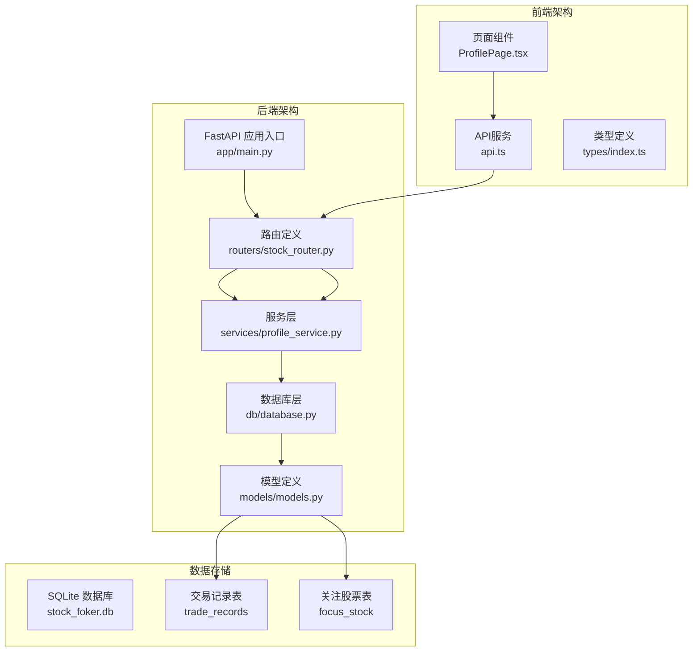
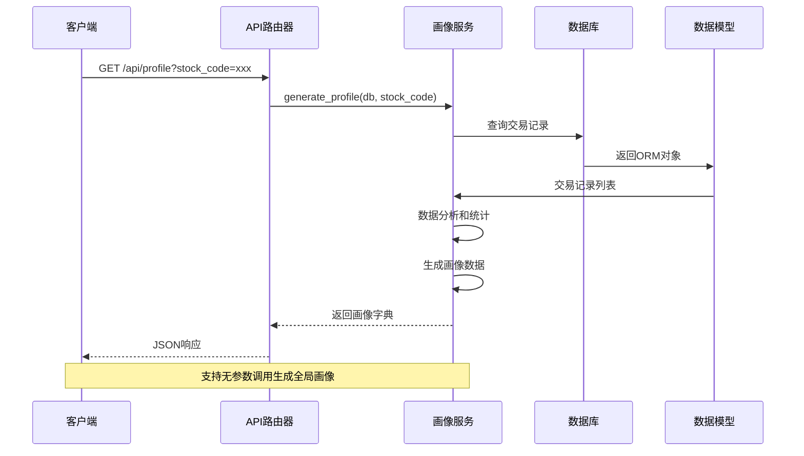
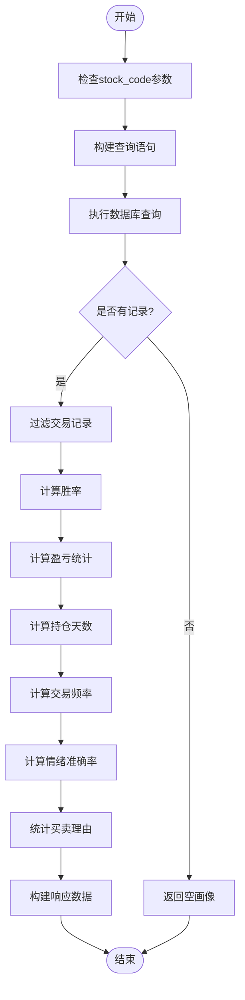
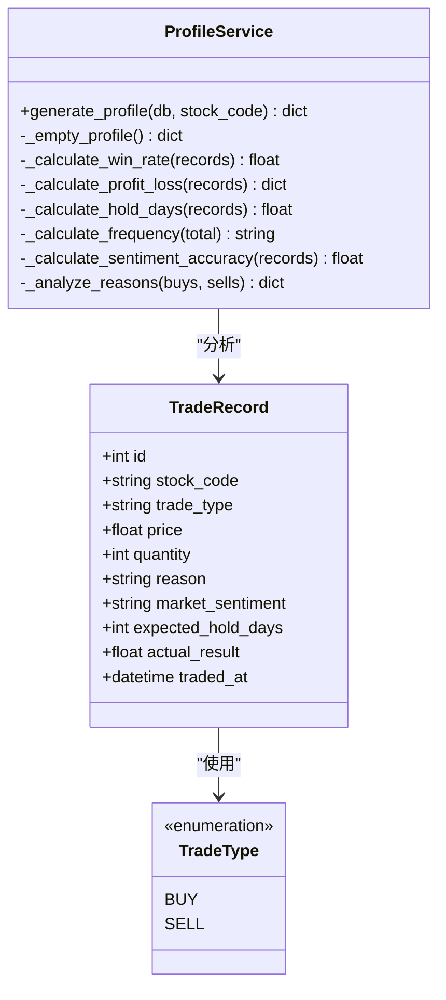
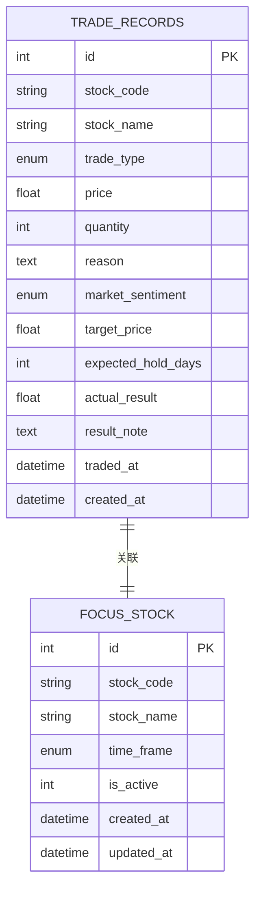
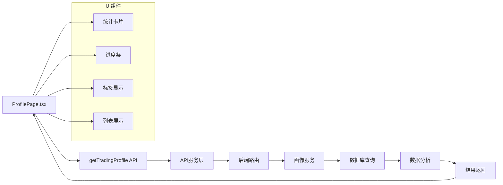
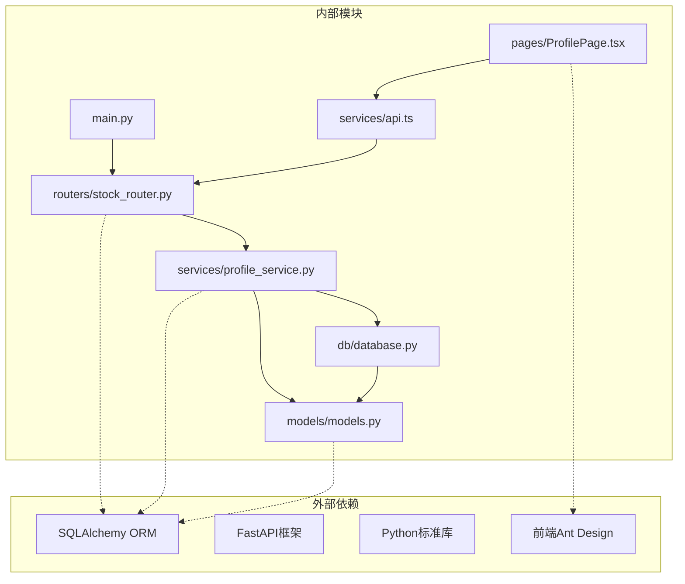
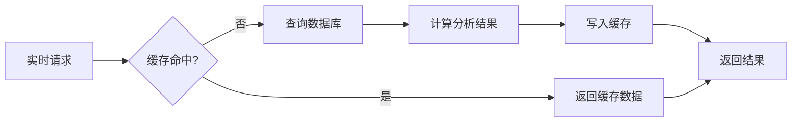

# 炒股画像接口

<cite>
**本文档引用的文件**
- [backend/app/main.py](file://backend/app/main.py)
- [backend/app/routers/stock_router.py](file://backend/app/routers/stock_router.py)
- [backend/app/services/profile_service.py](file://backend/app/services/profile_service.py)
- [backend/app/models/models.py](file://backend/app/models/models.py)
- [backend/app/models/schemas.py](file://backend/app/models/schemas.py)
- [backend/app/db/database.py](file://backend/app/db/database.py)
- [frontend/src/pages/ProfilePage.tsx](file://frontend/src/pages/ProfilePage.tsx)
- [frontend/src/services/api.ts](file://frontend/src/services/api.ts)
- [frontend/src/types/index.ts](file://frontend/src/types/index.ts)
- [doc/技术架构文档.md](file://doc/技术架构文档.md)
</cite>

## 目录
1. [简介](#简介)
2. [项目结构](#项目结构)
3. [核心组件](#核心组件)
4. [架构概览](#架构概览)
5. [详细组件分析](#详细组件分析)
6. [依赖关系分析](#依赖关系分析)
7. [性能考量](#性能考量)
8. [故障排除指南](#故障排除指南)
9. [结论](#结论)
10. [附录](#附录)

## 简介

炒股画像分析API是Stock Foker项目中的核心功能模块，专门用于基于用户的交易历史记录生成个性化的炒股行为分析报告。该接口通过深度分析用户的交易模式、风险偏好、情绪判断能力等维度，为用户提供全面的投资行为画像，帮助用户更好地了解自己的交易习惯并优化投资策略。

本接口支持按股票代码进行筛选，可以生成针对特定股票的交易特征分析，也可以生成全局的交易行为画像。接口设计遵循RESTful原则，提供简洁明了的数据输出格式，便于前端展示和后续的个性化建议生成。

## 项目结构

Stock Foker项目采用前后端分离的架构设计，后端使用FastAPI框架，前端使用React + TypeScript构建现代化的SPA应用。



**图表来源**
- [backend/app/main.py:1-28](file://backend/app/main.py#L1-L28)
- [backend/app/routers/stock_router.py:1-197](file://backend/app/routers/stock_router.py#L1-L197)
- [backend/app/db/database.py:1-24](file://backend/app/db/database.py#L1-L24)

**章节来源**
- [doc/技术架构文档.md:19-67](file://doc/技术架构文档.md#L19-L67)

## 核心组件

炒股画像接口的核心组件包括以下关键部分：

### API路由层
- **路由定义**: 在stock_router.py中定义了`/api/profile`路由，支持GET请求
- **参数处理**: 接受可选的stock_code查询参数，用于筛选特定股票的交易记录
- **依赖注入**: 使用SQLAlchemy Session进行数据库操作

### 服务层
- **画像生成器**: profile_service.py中的generate_profile函数负责核心分析逻辑
- **数据聚合**: 对交易记录进行统计分析，提取关键特征指标
- **智能分类**: 基于阈值规则对交易行为进行分类和评级

### 数据模型层
- **交易记录模型**: TradeRecord模型定义了完整的交易数据结构
- **枚举类型**: 包括交易类型、时间框架、市场情绪等枚举定义
- **数据库映射**: 使用SQLAlchemy ORM进行数据持久化

**章节来源**
- [backend/app/routers/stock_router.py:187-197](file://backend/app/routers/stock_router.py#L187-L197)
- [backend/app/services/profile_service.py:6-114](file://backend/app/services/profile_service.py#L6-L114)
- [backend/app/models/models.py:38-56](file://backend/app/models/models.py#L38-L56)

## 架构概览

炒股画像接口的完整工作流程如下：



**图表来源**
- [backend/app/routers/stock_router.py:189-196](file://backend/app/routers/stock_router.py#L189-L196)
- [backend/app/services/profile_service.py:6-114](file://backend/app/services/profile_service.py#L6-L114)

## 详细组件分析

### GET /api/profile 接口详解

#### 接口定义
- **HTTP方法**: GET
- **路径**: `/api/profile`
- **查询参数**:
  - `stock_code`: 可选，股票代码筛选条件
  - `db`: 依赖注入的数据库会话

#### 功能实现逻辑



**图表来源**
- [backend/app/services/profile_service.py:6-97](file://backend/app/services/profile_service.py#L6-L97)

#### 核心分析维度

##### 1. 交易频率分析
- **高频交易**: ≥20次交易
- **中频交易**: 5-19次交易  
- **低频交易**: <5次交易

##### 2. 风险偏好识别
- **短线偏好**: 平均持仓≤5天
- **中线偏好**: 平均持仓5-30天
- **长线偏好**: 平均持仓>30天

##### 3. 盈亏统计指标
- **胜率**: 获利交易次数/总交易次数
- **平均盈利**: 盈利交易平均收益
- **平均亏损**: 亏损交易平均损失
- **盈亏比**: |平均盈利/平均亏损|

##### 4. 情绪判断能力
- **情绪准确率**: 基于市场情绪预测的正确率
- **乐观情绪**: 预测上涨且实际盈利
- **悲观情绪**: 预测下跌且实际亏损

##### 5. 交易特征统计
- **常见买入理由**: 前5个最频繁的买入原因
- **常见卖出理由**: 前5个最频繁的卖出原因

**章节来源**
- [backend/app/services/profile_service.py:25-97](file://backend/app/services/profile_service.py#L25-L97)

### profile_service 实现分析

#### 数据处理流程



**图表来源**
- [backend/app/services/profile_service.py:6-114](file://backend/app/services/profile_service.py#L6-L114)
- [backend/app/models/models.py:14-16](file://backend/app/models/models.py#L14-L16)

#### 关键算法实现

##### 胜率计算
```python
win_rate = len(wins) / len(closed) if closed else 0
```

##### 盈亏比计算
```python
profit_loss_ratio = abs(avg_profit / avg_loss) if avg_loss != 0 else 0
```

##### 交易频率分类
```python
if total >= 20:
    freq = "高频"
elif total >= 5:
    freq = "中频"
else:
    freq = "低频"
```

##### 时间框架偏好
```python
if avg_hold_days <= 5:
    preferred_tf = "短线"
elif avg_hold_days <= 30:
    preferred_tf = "中线"
else:
    preferred_tf = "长线"
```

**章节来源**
- [backend/app/services/profile_service.py:25-48](file://backend/app/services/profile_service.py#L25-L48)

### 数据模型设计

#### 交易记录模型



**图表来源**
- [backend/app/models/models.py:38-56](file://backend/app/models/models.py#L38-L56)
- [backend/app/models/models.py:25-36](file://backend/app/models/models.py#L25-L36)

#### 枚举类型定义

| 枚举类型 | 可能值 | 用途 |
|---------|--------|------|
| TradeType | buy, sell | 交易类型标识 |
| TimeFrame | short, medium, long | 时间框架偏好 |
| MarketSentiment | optimistic, neutral, pessimistic | 市场情绪判断 |

**章节来源**
- [backend/app/models/models.py:8-23](file://backend/app/models/models.py#L8-L23)

### 前端集成分析

#### 前端页面组件



**图表来源**
- [frontend/src/pages/ProfilePage.tsx:26-172](file://frontend/src/pages/ProfilePage.tsx#L26-L172)
- [frontend/src/services/api.ts:64-67](file://frontend/src/services/api.ts#L64-L67)

#### 响应数据结构

前端接收的TradingProfile类型定义如下：

| 字段名 | 类型 | 描述 | 示例值 |
|--------|------|------|--------|
| total_trades | number | 总交易次数 | 25 |
| win_rate | number | 胜率（0-1） | 0.64 |
| avg_profit | number | 平均盈利 | 1250.50 |
| avg_loss | number | 平均亏损 | -850.25 |
| profit_loss_ratio | number | 盈亏比 | 1.47 |
| avg_hold_days | number | 平均持仓天数 | 12.3 |
| trade_frequency | string | 交易频率 | "中频" |
| preferred_time_frame | string | 偏好时间框架 | "中线" |
| sentiment_accuracy | number | 情绪准确率 | 0.58 |
| common_buy_reasons | Array | 常见买入理由 | [{reason: "技术突破", count: 8}] |
| common_sell_reasons | Array | 常见卖出理由 | [{reason: "达到目标", count: 6}] |

**章节来源**
- [frontend/src/types/index.ts:81-93](file://frontend/src/types/index.ts#L81-L93)

## 依赖关系分析

### 组件耦合度分析



**图表来源**
- [backend/app/main.py:1-28](file://backend/app/main.py#L1-L28)
- [backend/app/routers/stock_router.py:1-197](file://backend/app/routers/stock_router.py#L1-L197)
- [backend/app/services/profile_service.py:1-4](file://backend/app/services/profile_service.py#L1-L4)

### 数据流依赖

| 依赖方向 | 依赖内容 | 作用 |
|---------|----------|------|
| 上游依赖 | SQL数据库 | 提供交易数据存储 |
| 外部依赖 | FastAPI框架 | 提供Web服务基础 |
| 外部依赖 | SQLAlchemy | 提供ORM数据访问 |
| 前端依赖 | Axios | 提供HTTP客户端 |
| 前端依赖 | Ant Design | 提供UI组件库 |

**章节来源**
- [backend/app/db/database.py:1-24](file://backend/app/db/database.py#L1-L24)
- [doc/技术架构文档.md:12-18](file://doc/技术架构文档.md#L12-L18)

## 性能考量

### 查询优化策略

1. **索引设计**: 
   - 交易记录表的stock_code字段已建立索引
   - 关注股票表的stock_code字段已建立索引

2. **查询优化**:
   - 使用分页查询限制返回记录数量
   - 按交易时间倒序排列确保最新记录优先

3. **内存优化**:
   - 使用生成器表达式减少内存占用
   - 及时释放数据库连接

### 缓存策略

虽然炒股画像接口本身不直接使用缓存，但整个系统采用了多层次的数据缓存策略：



### 性能监控建议

1. **数据库查询性能**: 监控慢查询日志
2. **API响应时间**: 使用中间件记录请求耗时
3. **内存使用**: 监控服务内存占用情况
4. **并发处理**: 根据负载调整并发连接数

## 故障排除指南

### 常见问题及解决方案

#### 1. 数据库连接问题
**症状**: API调用时报数据库连接错误
**解决方案**:
- 检查数据库文件是否存在
- 验证数据库连接字符串配置
- 确认SQLite驱动已正确安装

#### 2. 交易记录为空
**症状**: 返回空画像数据
**解决方案**:
- 确认已添加有效的交易记录
- 检查交易记录的状态是否正确
- 验证数据库权限设置

#### 3. 胜率计算异常
**症状**: 胜率显示为NaN或Infinity
**解决方案**:
- 检查交易记录的actual_result字段
- 确认交易记录已完成结算
- 验证数据类型转换是否正确

#### 4. 前端数据显示异常
**症状**: 页面显示空白或数据格式错误
**解决方案**:
- 检查API响应格式是否符合预期
- 验证前端类型定义是否匹配
- 确认网络请求是否成功

**章节来源**
- [backend/app/services/profile_service.py:100-114](file://backend/app/services/profile_service.py#L100-L114)

### 错误处理机制

#### 后端错误处理
- **HTTP状态码**: 正常返回200，异常返回相应错误码
- **错误信息**: 提供清晰的错误描述
- **异常捕获**: 使用try-catch处理数据库操作异常

#### 前端错误处理
- **加载状态**: 显示加载指示器
- **空数据处理**: 提供友好的空状态提示
- **错误恢复**: 支持重新加载和重试机制

## 结论

炒股画像分析API通过简洁而强大的设计，为用户提供了全面的交易行为分析能力。该接口不仅能够准确反映用户的交易特征，还能为后续的个性化建议生成奠定坚实基础。

### 主要优势

1. **功能完整性**: 覆盖交易频率、风险偏好、情绪判断等多个维度
2. **灵活性强**: 支持按股票代码筛选，适应不同使用场景
3. **易于扩展**: 清晰的模块化设计便于功能扩展
4. **用户体验佳**: 前后端配合良好，界面友好直观

### 发展建议

1. **增强个性化**: 基于画像数据生成具体的交易建议
2. **增加对比功能**: 支持多股票间的画像对比分析
3. **扩展分析维度**: 添加更多技术指标和行为特征
4. **优化性能**: 考虑引入缓存机制提升响应速度

## 附录

### API使用示例

#### 基础用法
```
GET /api/profile
```
返回全局交易画像数据

#### 按股票筛选
```
GET /api/profile?stock_code=000001
```
返回特定股票的交易画像数据

#### 响应数据示例
```json
{
  "total_trades": 25,
  "win_rate": 0.64,
  "avg_profit": 1250.50,
  "avg_loss": -850.25,
  "profit_loss_ratio": 1.47,
  "avg_hold_days": 12.3,
  "trade_frequency": "中频",
  "preferred_time_frame": "中线",
  "sentiment_accuracy": 0.58,
  "common_buy_reasons": [
    {"reason": "技术突破", "count": 8}
  ],
  "common_sell_reasons": [
    {"reason": "达到目标", "count": 6}
  ]
}
```

### 数据解读指南

#### 交易频率解读
- **高频交易**: 需要关注交易成本和情绪波动
- **中频交易**: 平衡了收益和风险的典型模式
- **低频交易**: 更注重长期价值投资

#### 风险偏好解读
- **短线偏好**: 风险承受能力强，但需要较强的技术分析能力
- **中线偏好**: 风险适中，适合大多数投资者
- **长线偏好**: 风险较低，适合稳健型投资者

#### 情绪准确率解读
- **≥60%**: 情绪判断能力较强，可作为辅助决策参考
- **40%-60%**: 情绪判断能力一般，需结合其他因素
- **<40%**: 情绪判断能力较弱，建议谨慎投资