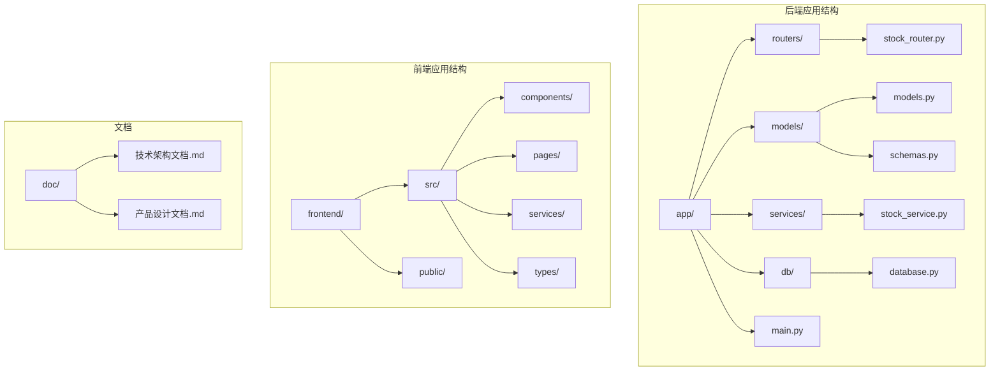
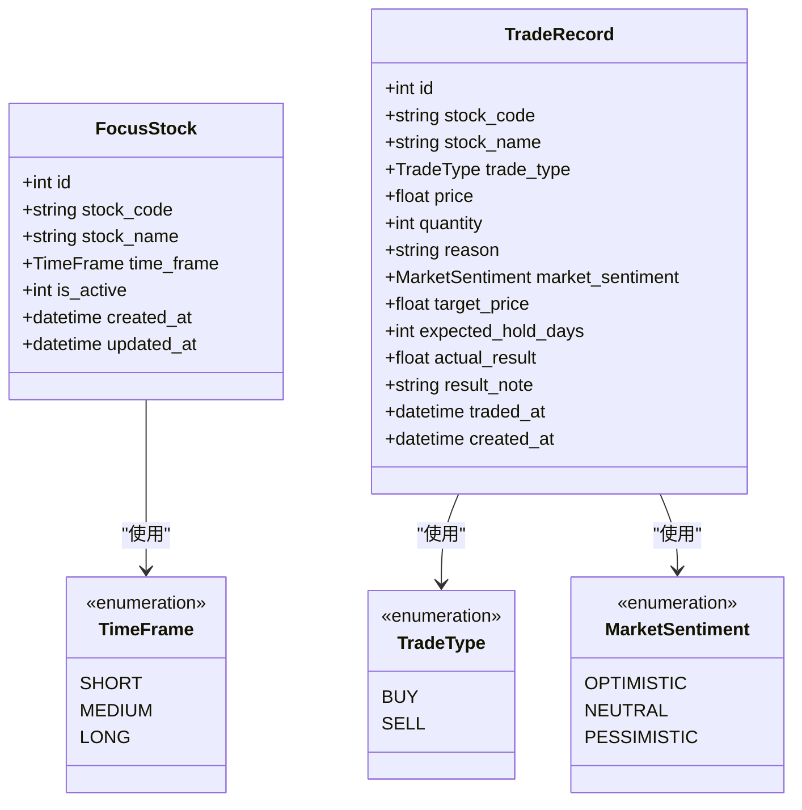
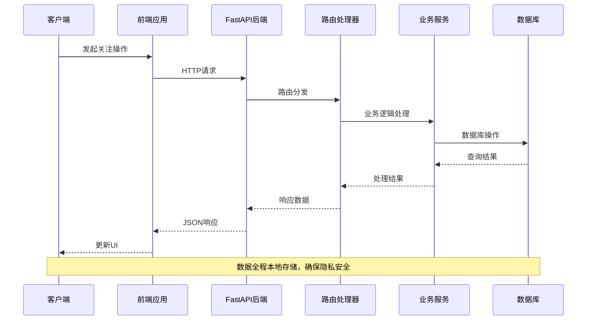
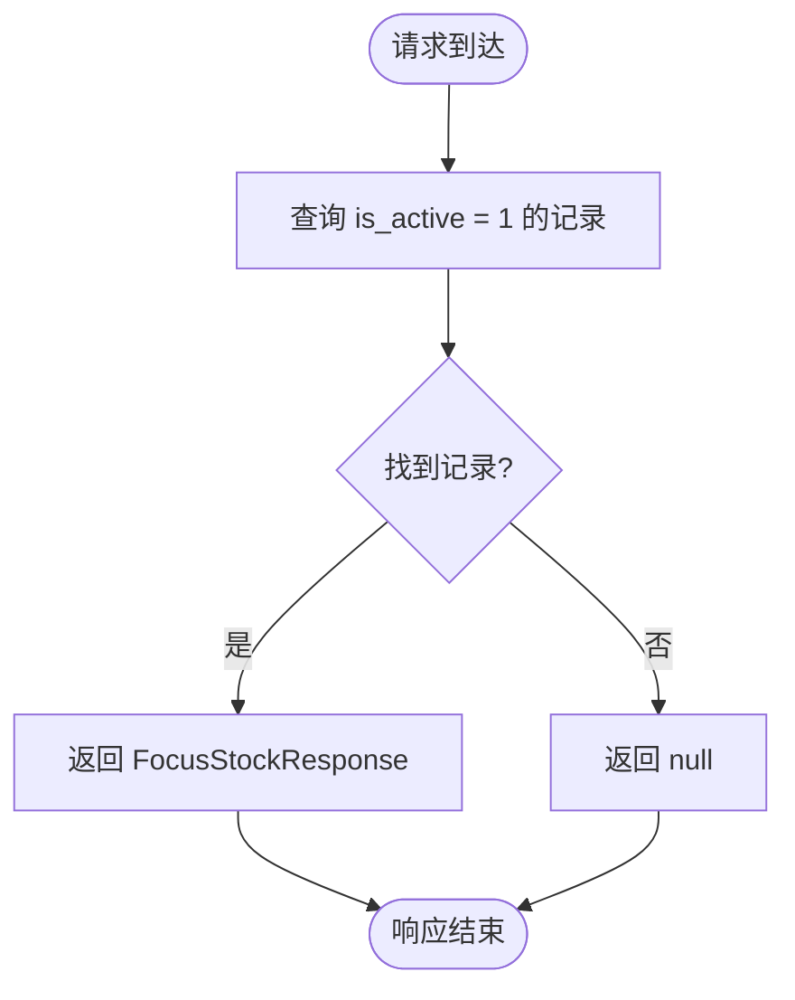
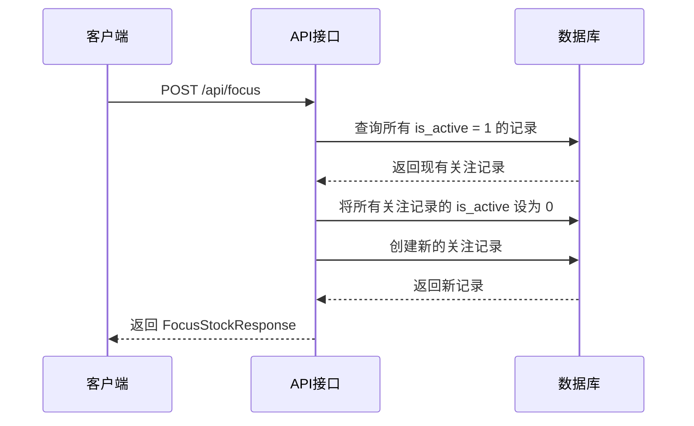
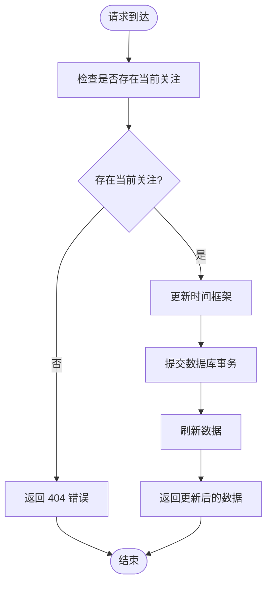
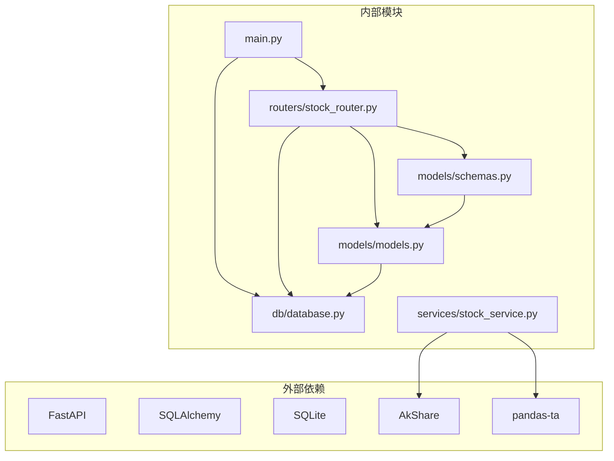

# 股票关注接口

<cite>
**本文档引用的文件**
- [backend/app/routers/stock_router.py](file://backend/app/routers/stock_router.py)
- [backend/app/models/schemas.py](file://backend/app/models/schemas.py)
- [backend/app/models/models.py](file://backend/app/models/models.py)
- [backend/app/db/database.py](file://backend/app/db/database.py)
- [backend/app/main.py](file://backend/app/main.py)
- [doc/技术架构文档.md](file://doc/技术架构文档.md)
- [doc/产品设计文档.md](file://doc/产品设计文档.md)
</cite>

## 目录
1. [简介](#简介)
2. [项目结构](#项目结构)
3. [核心组件](#核心组件)
4. [架构概览](#架构概览)
5. [详细组件分析](#详细组件分析)
6. [依赖分析](#依赖分析)
7. [性能考虑](#性能考虑)
8. [故障排除指南](#故障排除指南)
9. [结论](#结论)

## 简介

Stock Foker 是一款面向个人投资者的股票分析应用，专注于单股票深度聚焦模式。本文档详细说明股票关注相关的API接口，包括获取当前关注股票、设置关注股票、更新时间框架和获取历史关注记录等功能。

该系统采用FastAPI作为后端框架，SQLAlchemy作为ORM，SQLite作为本地数据库存储。所有数据都保存在本地，确保用户隐私安全。

## 项目结构

后端项目采用模块化设计，主要包含以下核心目录：



**图表来源**
- [backend/app/main.py:1-28](file://backend/app/main.py#L1-L28)
- [backend/app/routers/stock_router.py:1-197](file://backend/app/routers/stock_router.py#L1-L197)

**章节来源**
- [backend/app/main.py:1-28](file://backend/app/main.py#L1-L28)
- [doc/技术架构文档.md:19-67](file://doc/技术架构文档.md#L19-L67)

## 核心组件

### 数据模型

系统的核心数据模型包括关注股票和交易记录两个主要实体：



**图表来源**
- [backend/app/models/models.py:25-75](file://backend/app/models/models.py#L25-L75)

### API路由结构

系统采用FastAPI的路由装饰器模式，将关注相关的API统一管理：

```mermaid
graph LR
subgraph "API路由"
A[/api/focus] --> B[GET - 获取当前关注]
A --> C[POST - 设置关注]
D[/api/focus/timeframe] --> E[PUT - 更新时间框架]
F[/api/focus/history] --> G[GET - 获取历史记录]
end
subgraph "数据访问层"
H[SQLAlchemy查询]
I[数据库事务]
end
A --> H
D --> H
F --> H
H --> I
```

**图表来源**
- [backend/app/routers/stock_router.py:18-65](file://backend/app/routers/stock_router.py#L18-L65)

**章节来源**
- [backend/app/models/models.py:8-75](file://backend/app/models/models.py#L8-L75)
- [backend/app/routers/stock_router.py:18-65](file://backend/app/routers/stock_router.py#L18-L65)

## 架构概览

系统采用分层架构设计，从前端到后端的数据流转如下：



**图表来源**
- [backend/app/main.py:1-28](file://backend/app/main.py#L1-L28)
- [backend/app/routers/stock_router.py:18-65](file://backend/app/routers/stock_router.py#L18-L65)

## 详细组件分析

### 获取当前关注股票接口

#### 接口定义
- **HTTP方法**: GET
- **URL路径**: `/api/focus`
- **响应模型**: `FocusStockResponse | None`

#### 业务逻辑
该接口用于获取当前被激活的关注股票。系统通过查询条件 `is_active == 1` 来获取当前有效的关注记录。

#### 请求参数
- 无查询参数

#### 响应格式
成功时返回当前关注的股票信息，如果没有任何关注则返回null。

#### 状态码
- 200: 成功获取关注股票
- 500: 数据库查询异常



**图表来源**
- [backend/app/routers/stock_router.py:20-24](file://backend/app/routers/stock_router.py#L20-L24)

**章节来源**
- [backend/app/routers/stock_router.py:20-24](file://backend/app/routers/stock_router.py#L20-L24)

### 设置关注股票接口

#### 接口定义
- **HTTP方法**: POST
- **URL路径**: `/api/focus`
- **请求体模型**: `FocusStockCreate`
- **响应模型**: `FocusStockResponse`

#### 业务逻辑
该接口用于设置新的关注股票。系统会自动取消之前的所有关注，确保每次只关注一只股票。

#### 请求参数
- `stock_code`: 股票代码 (必填)
- `stock_name`: 股票名称 (必填)  
- `time_frame`: 时间框架 (可选，默认: short)

#### 响应格式
返回新创建的关注股票的完整信息。

#### 状态码
- 201: 成功创建关注
- 400: 请求参数无效
- 500: 数据库操作异常



**图表来源**
- [backend/app/routers/stock_router.py:27-41](file://backend/app/routers/stock_router.py#L27-L41)

**章节来源**
- [backend/app/routers/stock_router.py:27-41](file://backend/app/routers/stock_router.py#L27-L41)

### 更新时间框架接口

#### 接口定义
- **HTTP方法**: PUT
- **URL路径**: `/api/focus/timeframe`
- **请求体模型**: `TimeFrameUpdate`
- **响应模型**: `FocusStockResponse`

#### 业务逻辑
该接口用于更新当前关注股票的时间框架设置。如果当前没有关注的股票，则返回404错误。

#### 请求参数
- `time_frame`: 新的时间框架值 (必填)
  - `short`: 短线 (默认)
  - `medium`: 中线
  - `long`: 长线

#### 响应格式
返回更新后的时间框架信息。

#### 状态码
- 200: 成功更新时间框架
- 404: 当前没有关注的股票
- 500: 数据库操作异常



**图表来源**
- [backend/app/routers/stock_router.py:44-53](file://backend/app/routers/stock_router.py#L44-L53)

**章节来源**
- [backend/app/routers/stock_router.py:44-53](file://backend/app/routers/stock_router.py#L44-L53)

### 获取历史关注记录接口

#### 接口定义
- **HTTP方法**: GET
- **URL路径**: `/api/focus/history`
- **响应模型**: `list[FocusStockResponse]`

#### 业务逻辑
该接口用于获取历史关注记录，最多返回50条最近的历史记录，按创建时间倒序排列。

#### 请求参数
- 无查询参数

#### 响应格式
返回历史关注记录的数组。

#### 状态码
- 200: 成功获取历史记录
- 500: 数据库查询异常

**章节来源**
- [backend/app/routers/stock_router.py:56-65](file://backend/app/routers/stock_router.py#L56-L65)

### 数据模型定义

#### FocusStockCreate
- `stock_code`: string - 股票代码
- `stock_name`: string - 股票名称  
- `time_frame`: TimeFrame - 时间框架，默认为SHORT

#### FocusStockResponse
- `id`: int - 主键ID
- `stock_code`: string - 股票代码
- `stock_name`: string - 股票名称
- `time_frame`: TimeFrame - 时间框架
- `is_active`: int - 是否为当前关注 (1=是, 0=否)
- `created_at`: datetime - 创建时间

#### TimeFrameUpdate
- `time_frame`: TimeFrame - 新的时间框架值

**章节来源**
- [backend/app/models/schemas.py:8-27](file://backend/app/models/schemas.py#L8-L27)
- [backend/app/models/models.py:8-11](file://backend/app/models/models.py#L8-L11)

## 依赖分析

系统各组件之间的依赖关系如下：



**图表来源**
- [backend/app/main.py:1-28](file://backend/app/main.py#L1-L28)
- [backend/app/routers/stock_router.py:1-15](file://backend/app/routers/stock_router.py#L1-L15)

### 组件耦合度分析

- **路由层与模型层**: 通过Pydantic模型进行解耦，便于数据验证和序列化
- **业务逻辑与数据访问**: 通过SQLAlchemy ORM实现数据访问抽象
- **外部服务**: 通过独立的服务模块管理第三方API调用

**章节来源**
- [backend/app/db/database.py:1-24](file://backend/app/db/database.py#L1-L24)
- [backend/app/services/stock_service.py:1-327](file://backend/app/services/stock_service.py#L1-L327)

## 性能考虑

### 数据库优化
- 使用SQLite本地存储，避免网络延迟
- 通过索引优化常用查询（如stock_code）
- 事务批量操作减少数据库往返

### 缓存策略
- K线数据本地缓存，减少重复请求
- 股票列表缓存，提高搜索性能
- 增量更新机制，只同步缺失数据

### API性能
- 异步处理支持Future
- 连接池管理数据库连接
- 合理的超时设置和重试机制

## 故障排除指南

### 常见错误及解决方案

#### 数据库连接问题
- **症状**: API调用返回500错误
- **原因**: 数据库连接失败或表结构不正确
- **解决**: 检查数据库文件权限，运行数据库初始化

#### 无当前关注股票
- **症状**: 更新时间框架接口返回404
- **原因**: 用户尚未设置任何关注股票
- **解决**: 先调用设置关注接口创建关注

#### 参数验证失败
- **症状**: 设置关注接口返回400错误
- **原因**: 请求参数缺失或格式不正确
- **解决**: 确保stock_code和stock_name参数完整

### 调试建议

1. **启用详细日志**: 在开发环境中开启FastAPI的详细日志输出
2. **数据库监控**: 使用SQLite工具检查表结构和数据状态
3. **API测试**: 使用Postman或curl测试各个接口的响应

**章节来源**
- [backend/app/routers/stock_router.py:48-49](file://backend/app/routers/stock_router.py#L48-L49)

## 结论

Stock Foker的股票关注API设计简洁而功能完整，遵循RESTful设计原则，提供了单股票深度聚焦的核心功能。系统采用本地存储确保用户隐私，通过合理的数据模型设计和API接口规范，为用户提供了一套完整的股票关注和管理解决方案。

主要特点包括：
- 单股票聚焦模式，避免信息噪音
- 灵活的时间框架设置，适应不同投资策略
- 完整的历史记录管理，支持回溯分析
- 本地数据库存储，确保数据安全
- 清晰的API设计，易于集成和扩展