# 股票搜索接口

<cite>
**本文档引用的文件**
- [backend/app/routers/stock_router.py](file://backend/app/routers/stock_router.py)
- [backend/app/services/stock_service.py](file://backend/app/services/stock_service.py)
- [backend/app/models/schemas.py](file://backend/app/models/schemas.py)
- [backend/app/db/database.py](file://backend/app/db/database.py)
- [backend/app/models/models.py](file://backend/app/models/models.py)
- [backend/app/main.py](file://backend/app/main.py)
- [backend/requirements.txt](file://backend/requirements.txt)
</cite>

## 目录
1. [简介](#简介)
2. [项目结构](#项目结构)
3. [核心组件](#核心组件)
4. [架构概览](#架构概览)
5. [详细组件分析](#详细组件分析)
6. [依赖关系分析](#依赖关系分析)
7. [性能考虑](#性能考虑)
8. [故障排除指南](#故障排除指南)
9. [结论](#结论)
10. [附录](#附录)

## 简介

股票搜索API是Stock Foker项目的核心功能之一，为用户提供实时的股票查询和搜索能力。该接口支持通过股票代码或股票名称进行模糊搜索，并与多个外部金融数据源集成，提供准确的股票信息。

本接口采用FastAPI框架构建，具有以下特点：
- 支持关键词模糊搜索
- 集成多个金融数据源
- 实时数据获取与缓存机制
- 完善的错误处理和异常管理
- 标准化的响应格式

## 项目结构

Stock Foker项目采用标准的分层架构设计，主要分为以下几个层次：

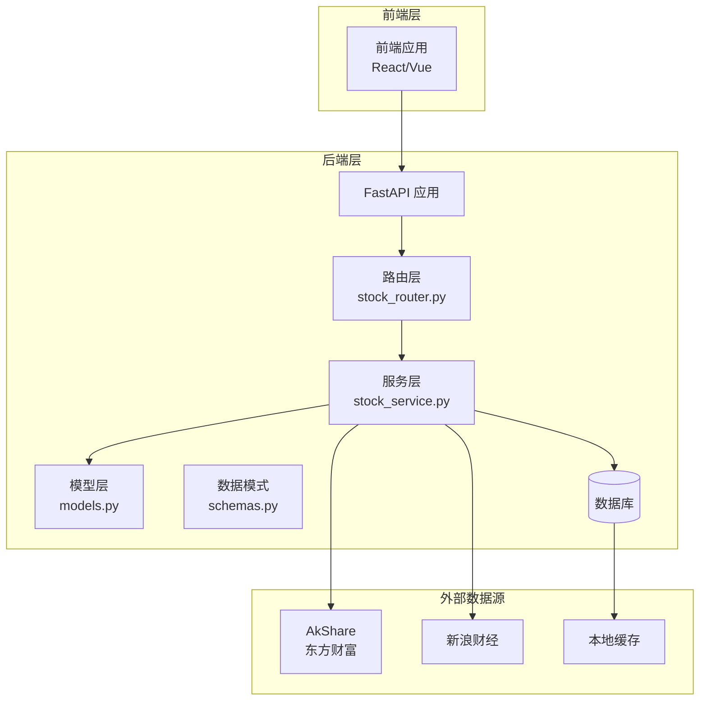

**图表来源**
- [backend/app/main.py:1-28](file://backend/app/main.py#L1-L28)
- [backend/app/routers/stock_router.py:1-197](file://backend/app/routers/stock_router.py#L1-L197)
- [backend/app/services/stock_service.py:1-327](file://backend/app/services/stock_service.py#L1-L327)

**章节来源**
- [backend/app/main.py:1-28](file://backend/app/main.py#L1-L28)
- [backend/app/routers/stock_router.py:1-197](file://backend/app/routers/stock_router.py#L1-L197)

## 核心组件

### API路由定义

股票搜索接口位于`/api/stocks/search`路径，采用GET方法实现：

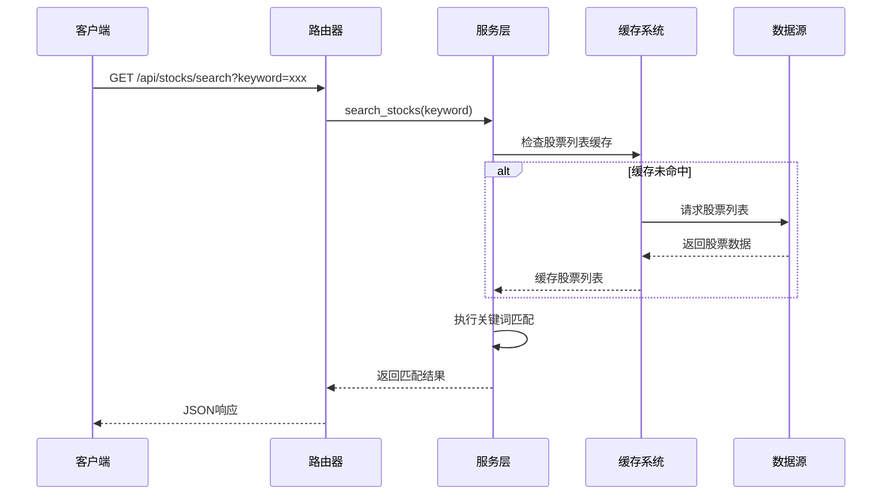

**图表来源**
- [backend/app/routers/stock_router.py:70-78](file://backend/app/routers/stock_router.py#L70-L78)
- [backend/app/services/stock_service.py:54-65](file://backend/app/services/stock_service.py#L54-L65)

### 数据模型结构

搜索接口返回的数据结构相对简洁，主要包含股票基本信息：

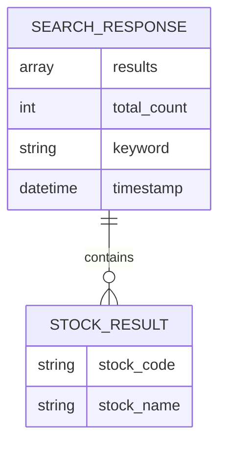

**图表来源**
- [backend/app/services/stock_service.py:54-65](file://backend/app/services/stock_service.py#L54-L65)

**章节来源**
- [backend/app/routers/stock_router.py:70-78](file://backend/app/routers/stock_router.py#L70-L78)
- [backend/app/services/stock_service.py:54-65](file://backend/app/services/stock_service.py#L54-L65)

## 架构概览

### 外部数据源集成

系统集成了两个主要的金融数据源来确保数据的准确性和可靠性：

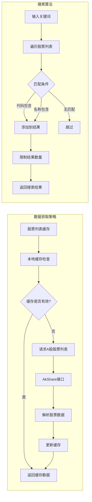

**图表来源**
- [backend/app/services/stock_service.py:38-52](file://backend/app/services/stock_service.py#L38-L52)
- [backend/app/services/stock_service.py:54-65](file://backend/app/services/stock_service.py#L54-L65)

### 错误处理机制

系统实现了多层次的错误处理机制：

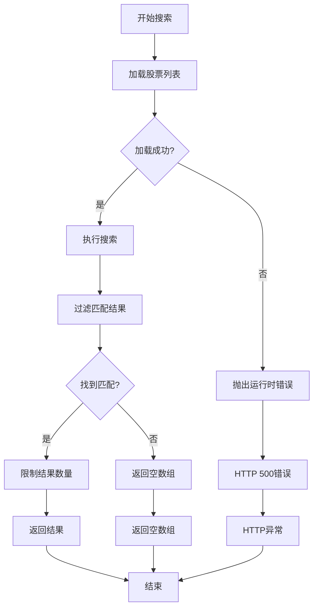

**图表来源**
- [backend/app/routers/stock_router.py:74-77](file://backend/app/routers/stock_router.py#L74-L77)
- [backend/app/services/stock_service.py:63-64](file://backend/app/services/stock_service.py#L63-L64)

**章节来源**
- [backend/app/routers/stock_router.py:70-78](file://backend/app/routers/stock_router.py#L70-L78)
- [backend/app/services/stock_service.py:22-33](file://backend/app/services/stock_service.py#L22-L33)

## 详细组件分析

### 路由层实现

路由层负责处理HTTP请求和响应，为搜索功能提供入口点：

#### 关键特性
- **参数验证**: 自动验证`keyword`参数的存在性
- **异常处理**: 将服务层异常转换为HTTP异常
- **响应格式**: 返回标准化的JSON响应

#### 错误处理流程
当服务层抛出`RuntimeError`时，路由层会将其转换为HTTP 500错误：

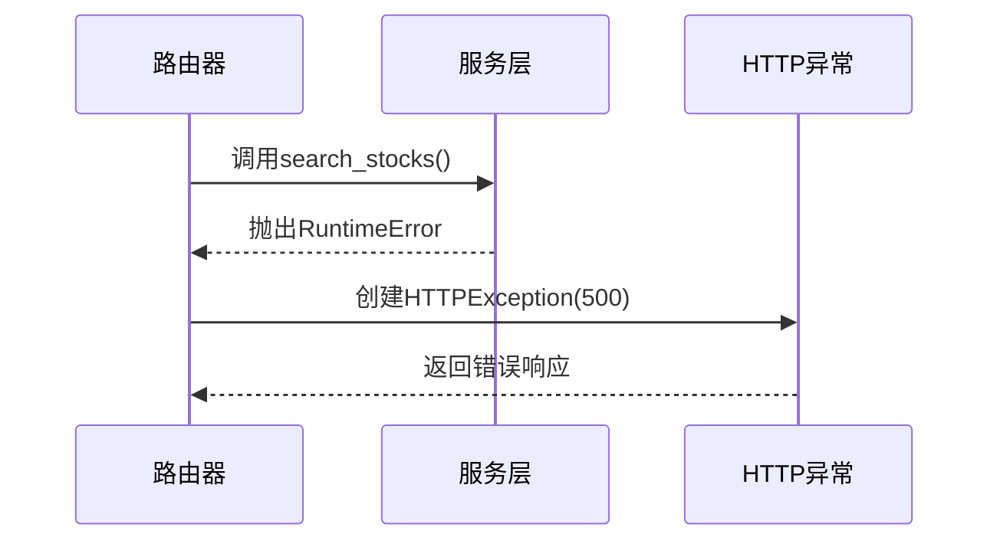

**图表来源**
- [backend/app/routers/stock_router.py:74-77](file://backend/app/routers/stock_router.py#L74-L77)

**章节来源**
- [backend/app/routers/stock_router.py:70-78](file://backend/app/routers/stock_router.py#L70-L78)

### 服务层实现

服务层是搜索功能的核心实现，包含完整的数据获取和处理逻辑。

#### 股票列表缓存机制

为了提高性能，系统实现了智能的缓存策略：

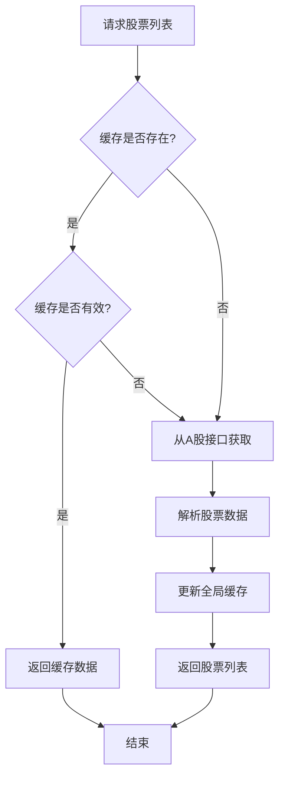

**图表来源**
- [backend/app/services/stock_service.py:38-52](file://backend/app/services/stock_service.py#L38-L52)

#### 搜索算法实现

搜索算法采用简单的字符串匹配策略：

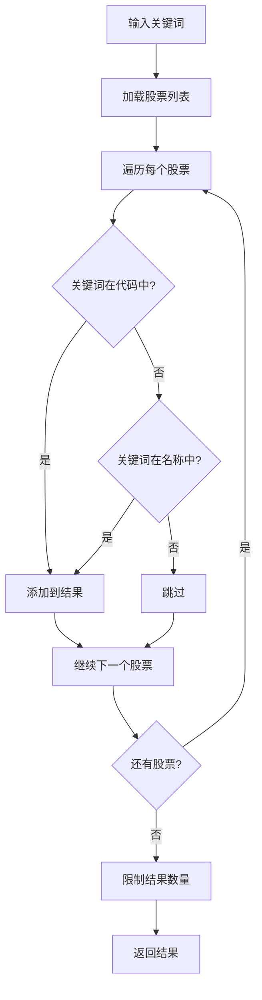

**图表来源**
- [backend/app/services/stock_service.py:54-65](file://backend/app/services/stock_service.py#L54-L65)

**章节来源**
- [backend/app/services/stock_service.py:38-65](file://backend/app/services/stock_service.py#L38-L65)

### 数据模型定义

虽然搜索接口返回的数据结构相对简单，但系统提供了完整的数据模型定义：

#### 搜索结果数据结构

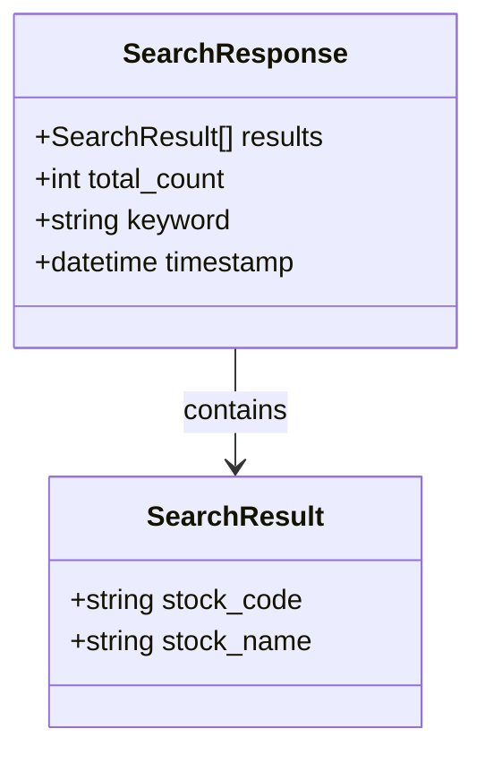

**图表来源**
- [backend/app/services/stock_service.py:54-65](file://backend/app/services/stock_service.py#L54-L65)

**章节来源**
- [backend/app/models/schemas.py:68-95](file://backend/app/models/schemas.py#L68-L95)

## 依赖关系分析

### 外部依赖

系统依赖于多个第三方库来实现金融数据的获取和处理：

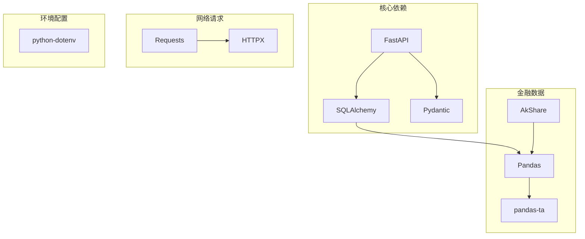

**图表来源**
- [backend/requirements.txt:1-10](file://backend/requirements.txt#L1-L10)

### 内部模块依赖

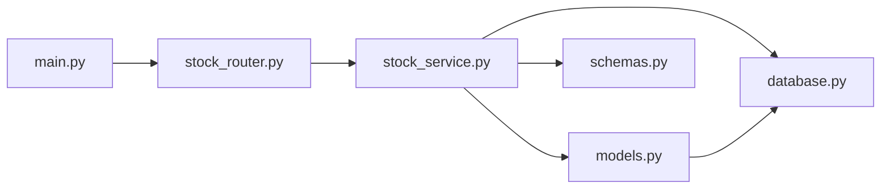

**图表来源**
- [backend/app/main.py:1-28](file://backend/app/main.py#L1-L28)
- [backend/app/routers/stock_router.py:1-15](file://backend/app/routers/stock_router.py#L1-L15)
- [backend/app/services/stock_service.py:1-12](file://backend/app/services/stock_service.py#L1-L12)

**章节来源**
- [backend/requirements.txt:1-10](file://backend/requirements.txt#L1-L10)

## 性能考虑

### 缓存策略

系统实现了多层次的缓存机制来优化性能：

1. **股票列表缓存**: 全局缓存A股股票列表，避免重复请求
2. **本地数据库缓存**: 使用SQLite存储K线数据，支持增量更新
3. **智能缓存失效**: 基于时间戳的缓存失效机制

### 性能优化建议

#### 搜索性能优化
- **索引优化**: 在股票代码和名称字段上建立索引
- **分页处理**: 对大量搜索结果实施分页机制
- **结果限制**: 限制单次搜索返回的结果数量

#### 数据获取优化
- **并发处理**: 支持并发的股票数据获取请求
- **连接池**: 使用连接池管理数据库连接
- **超时控制**: 设置合理的请求超时时间

#### 缓存优化
- **LRU缓存**: 实现LRU算法优化内存使用
- **预加载机制**: 预加载常用股票数据
- **缓存同步**: 实现缓存数据的同步机制

## 故障排除指南

### 常见问题及解决方案

#### 数据源访问失败
**问题描述**: 无法从AkShare或新浪财经获取股票数据
**解决方案**:
1. 检查网络连接状态
2. 验证API接口可用性
3. 查看防火墙设置
4. 调整请求频率限制

#### 搜索结果为空
**问题描述**: 搜索关键词无法匹配到任何股票
**解决方案**:
1. 检查关键词拼写
2. 尝试使用不同的关键词格式
3. 验证股票代码格式
4. 确认股票是否在A股市场上市

#### 性能问题
**问题描述**: 搜索响应时间过长
**解决方案**:
1. 检查服务器资源使用情况
2. 优化数据库查询性能
3. 调整缓存策略
4. 实施请求限流机制

### 错误码说明

| 错误码 | 描述 | 可能原因 | 解决方案 |
|--------|------|----------|----------|
| 200 | 成功 | 搜索正常完成 | 无需处理 |
| 404 | 未找到 | 无匹配股票 | 检查关键词 |
| 500 | 服务器错误 | 数据源访问失败 | 检查网络连接 |
| 504 | 网关超时 | 请求超时 | 重试请求 |

**章节来源**
- [backend/app/routers/stock_router.py:74-77](file://backend/app/routers/stock_router.py#L74-L77)

## 结论

股票搜索API为Stock Foker项目提供了核心的股票查询功能。通过合理的架构设计和多重数据源集成，系统能够提供准确、快速的股票搜索服务。

### 主要优势
- **多数据源冗余**: AkShare和新浪财经双重数据源确保数据可靠性
- **智能缓存机制**: 减少重复请求，提高响应速度
- **完善的错误处理**: 提供友好的错误提示和恢复机制
- **可扩展性设计**: 支持未来功能扩展和技术升级

### 改进建议
- 实现更复杂的搜索算法，支持模糊匹配和智能推荐
- 添加搜索历史和热门搜索功能
- 优化移动端用户体验
- 增加搜索结果的排序和筛选功能

## 附录

### API规范详情

#### 端点定义
- **路径**: `/api/stocks/search`
- **方法**: `GET`
- **认证**: 无需认证

#### 请求参数

| 参数名 | 类型 | 必需 | 描述 | 示例 |
|--------|------|------|------|------|
| keyword | string | 是 | 搜索关键词 | `000001` |
| limit | integer | 否 | 最大返回数量 | `20` |

#### 响应格式

**成功响应**:
```json
{
  "results": [
    {
      "stock_code": "000001",
      "stock_name": "平安银行"
    },
    {
      "stock_code": "600036",
      "stock_name": "招商银行"
    }
  ],
  "total_count": 2,
  "keyword": "银行",
  "timestamp": "2024-01-01T12:00:00Z"
}
```

**错误响应**:
```json
{
  "detail": "搜索股票失败: 数据源访问超时"
}
```

#### 最佳实践

##### 搜索关键词使用建议
- **精确搜索**: 使用完整的股票代码（如`000001`）
- **模糊搜索**: 使用股票名称关键词（如`银行`）
- **组合搜索**: 同时包含代码和名称信息
- **避免特殊字符**: 不要包含空格和特殊符号

##### 性能优化建议
- **合理使用缓存**: 利用系统内置的缓存机制
- **控制请求频率**: 避免频繁的重复搜索
- **批量处理**: 对多个搜索请求进行合并处理
- **监控性能**: 定期监控搜索性能指标

##### 错误处理最佳实践
- **优雅降级**: 当数据源不可用时提供缓存数据
- **用户友好**: 提供清晰的错误信息和解决建议
- **日志记录**: 记录重要的错误信息用于调试
- **重试机制**: 对临时性错误实施自动重试

**章节来源**
- [backend/app/routers/stock_router.py:70-78](file://backend/app/routers/stock_router.py#L70-L78)
- [backend/app/services/stock_service.py:54-65](file://backend/app/services/stock_service.py#L54-L65)