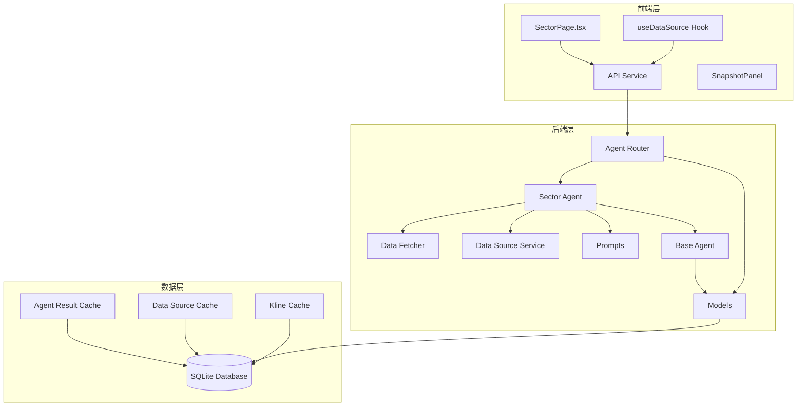
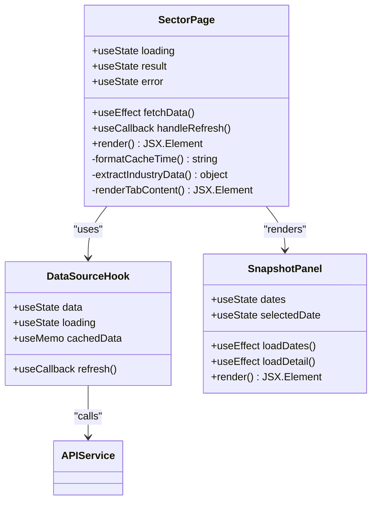
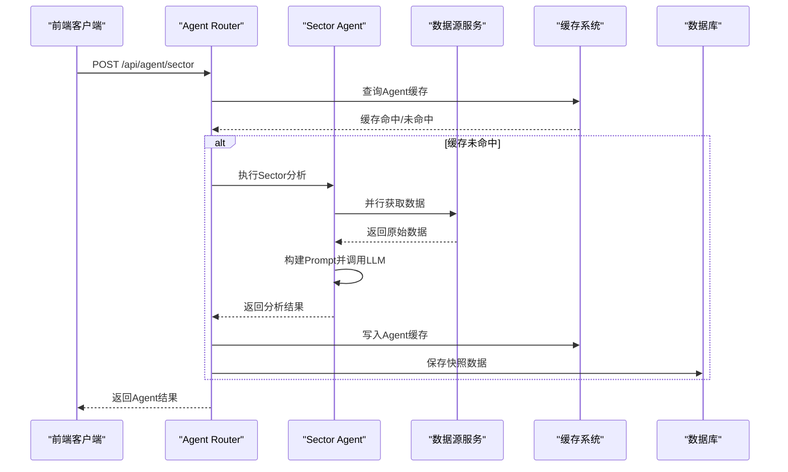
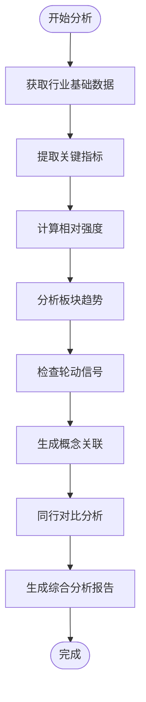
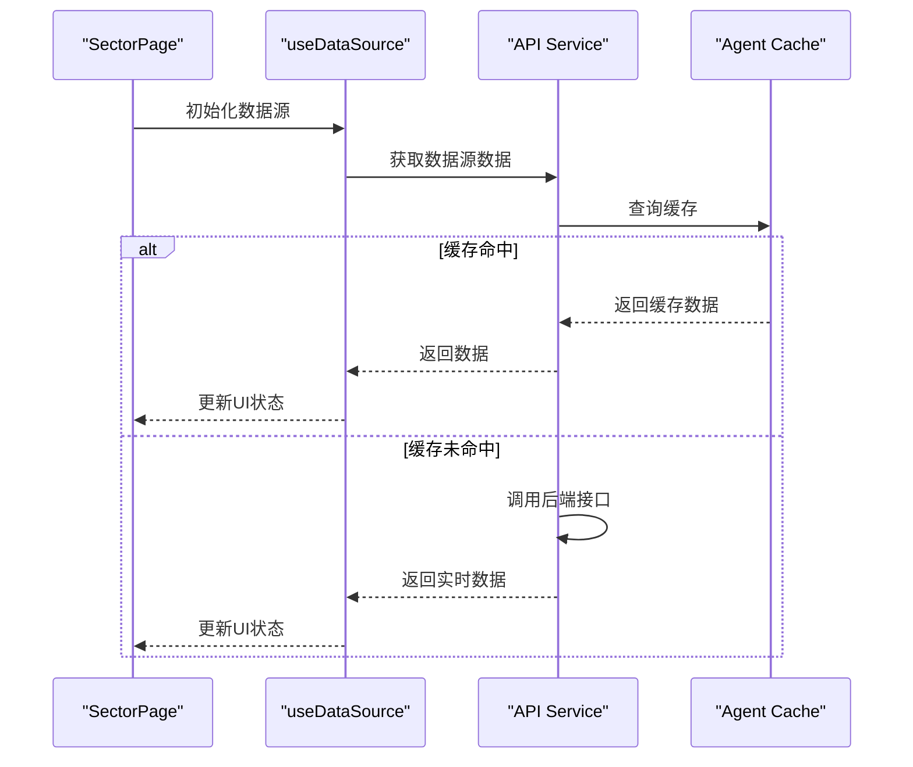
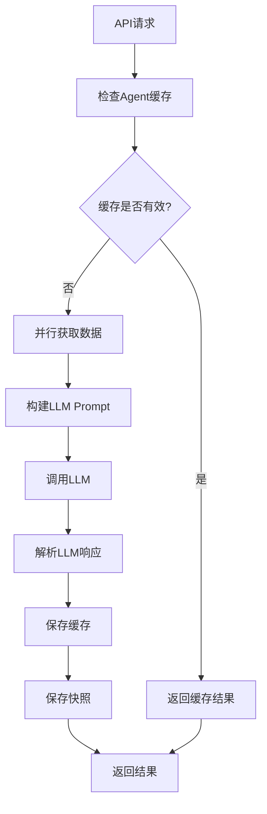
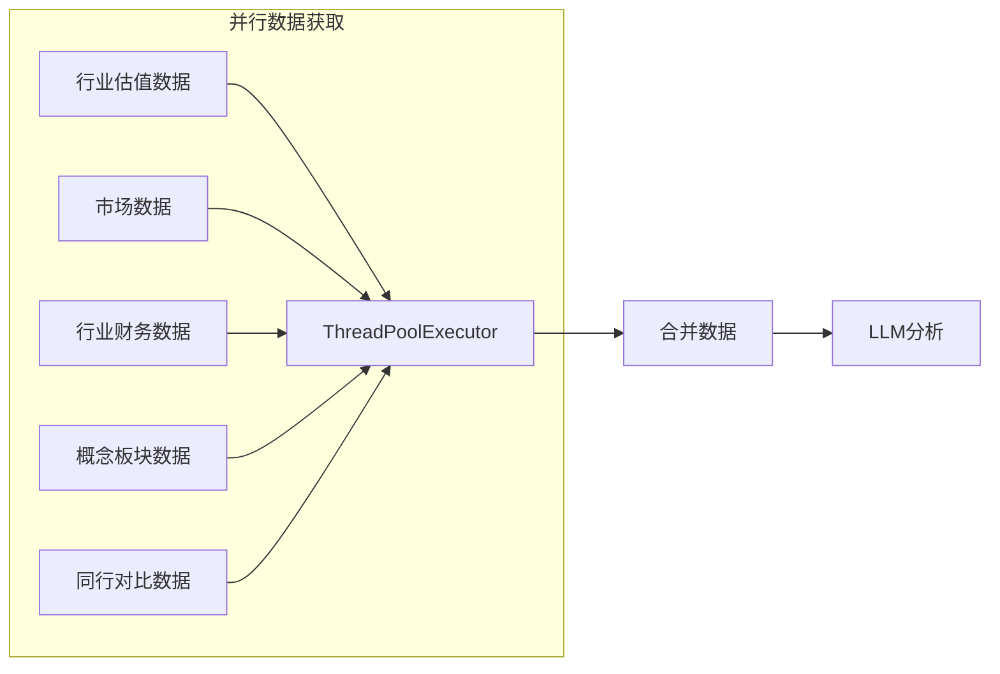
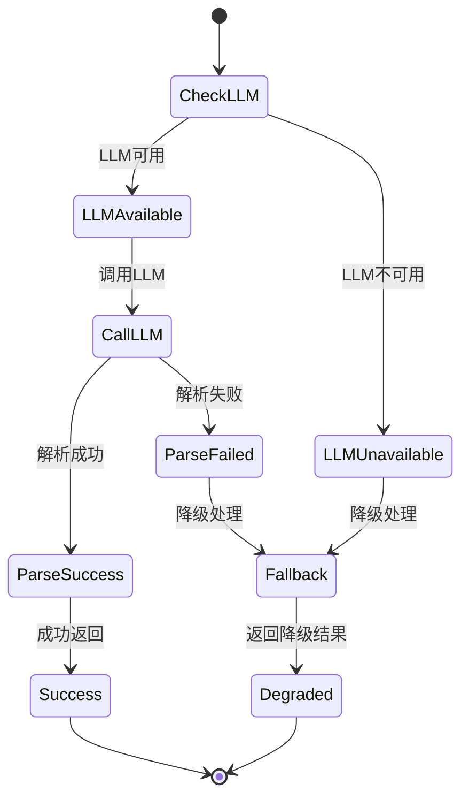
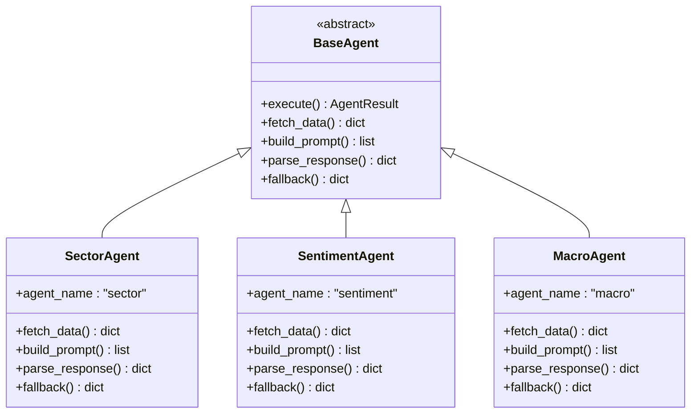

# Sector Page Enhancement

<cite>
**本文档引用的文件**
- [SectorPage.tsx](file://frontend/src/pages/SectorPage.tsx)
- [agent_router.py](file://backend/app/routers/agent_router.py)
- [sector_agent.py](file://backend/app/agents/sector_agent.py)
- [data_source_service.py](file://backend/app/services/data_source_service.py)
- [data_fetcher.py](file://backend/app/services/data_fetcher.py)
- [prompts.py](file://backend/app/llm/prompts.py)
- [base_agent.py](file://backend/app/agents/base_agent.py)
- [models.py](file://backend/app/models/models.py)
- [useDataSource.ts](file://frontend/src/hooks/useDataSource.ts)
- [api.ts](file://frontend/src/services/api.ts)
- [SnapshotPanel.tsx](file://frontend/src/components/SnapshotPanel.tsx)
- [advice_service.py](file://backend/app/services/advice_service.py)
</cite>

## 目录
1. [项目概述](#项目概述)
2. [系统架构](#系统架构)
3. [核心组件分析](#核心组件分析)
4. [Sector Page 功能详解](#sector-page-功能详解)
5. [数据流分析](#数据流分析)
6. [性能优化策略](#性能优化策略)
7. [错误处理机制](#错误处理机制)
8. [扩展性设计](#扩展性设计)
9. [最佳实践建议](#最佳实践建议)
10. [总结](#总结)

## 项目概述

Stock Foker 是一个基于人工智能的股票分析平台，专注于提供多维度的股票分析和投资决策支持。该项目采用前后端分离架构，后端使用FastAPI构建RESTful API，前端使用React + Ant Design开发用户界面。

**核心特性：**
- AI驱动的多维度股票分析
- 实时数据源集成
- 智能缓存机制
- 丰富的可视化组件
- 支持多种分析场景

## 系统架构

**图表来源**
- [SectorPage.tsx:19-470](file://frontend/src/pages/SectorPage.tsx#L19-L470)
- [agent_router.py:29-395](file://backend/app/routers/agent_router.py#L29-L395)
- [sector_agent.py:20-93](file://backend/app/agents/sector_agent.py#L20-L93)

## 核心组件分析

### 1. SectorPage 组件

SectorPage 是行业页面的核心组件，负责展示股票的板块联动分析结果。

**图表来源**
- [SectorPage.tsx:19-470](file://frontend/src/pages/SectorPage.tsx#L19-L470)
- [useDataSource.ts:82-169](file://frontend/src/hooks/useDataSource.ts#L82-L169)
- [SnapshotPanel.tsx:303-438](file://frontend/src/components/SnapshotPanel.tsx#L303-L438)

### 2. Agent 路由系统

后端采用统一的Agent路由系统，支持多种分析类型的并行执行。

**图表来源**
- [agent_router.py:203-217](file://backend/app/routers/agent_router.py#L203-L217)
- [sector_agent.py:23-53](file://backend/app/agents/sector_agent.py#L23-L53)

**Section sources**
- [SectorPage.tsx:19-470](file://frontend/src/pages/SectorPage.tsx#L19-L470)
- [agent_router.py:203-217](file://backend/app/routers/agent_router.py#L203-L217)
- [sector_agent.py:20-93](file://backend/app/agents/sector_agent.py#L20-L93)

## Sector Page 功能详解

### 1. 数据源管理

SectorPage 使用独立的数据源钩子管理不同类型的行业数据：

| 数据源类型 | 描述 | 用途 |
|------------|------|------|
| industry_valuation | 行业估值数据 | PE、PB、ROE等指标 |
| market_data | 市场数据 | 资金流向、成交量等 |
| industry_finance | 行业财务数据 | 营收、利润、毛利率等 |
| industry_peers | 同行对比数据 | 行业龙头股票对比 |
| concept_boards | 概念板块数据 | 相关概念板块活跃度 |

### 2. 核心分析指标

**图表来源**
- [sector_agent.py:62-80](file://backend/app/agents/sector_agent.py#L62-L80)

### 3. 用户界面设计

SectorPage 采用卡片式布局，包含以下主要区域：

1. **头部区域**：显示股票名称和刷新按钮
2. **AI板块总览**：展示核心分析结果
3. **数据详情**：两个标签页分别展示行业概况和资金流向
4. **关联分析**：同行对比和概念板块分析
5. **快照面板**：历史分析记录查看

**Section sources**
- [SectorPage.tsx:147-468](file://frontend/src/pages/SectorPage.tsx#L147-L468)

## 数据流分析

### 1. 前端数据流

**图表来源**
- [useDataSource.ts:108-139](file://frontend/src/hooks/useDataSource.ts#L108-L139)
- [api.ts:125-128](file://frontend/src/services/api.ts#L125-L128)

### 2. 后端数据流

**图表来源**
- [agent_router.py:47-116](file://backend/app/routers/agent_router.py#L47-L116)
- [sector_agent.py:55-80](file://backend/app/agents/sector_agent.py#L55-L80)

**Section sources**
- [useDataSource.ts:82-169](file://frontend/src/hooks/useDataSource.ts#L82-L169)
- [agent_router.py:47-116](file://backend/app/routers/agent_router.py#L47-L116)

## 性能优化策略

### 1. 缓存策略

系统实现了多层次的缓存机制：

| 缓存层级 | 缓存类型 | 新鲜度边界 | 用途 |
|----------|----------|------------|------|
| 前端内存缓存 | 数据源缓存 | 每日09:00 | 快速响应用户操作 |
| 后端Agent缓存 | 分析结果缓存 | 每日09:00 | 避免重复计算 |
| 数据源缓存 | 原始数据缓存 | 每日09:00 | 降低外部API调用 |

### 2. 并行处理

**图表来源**
- [sector_agent.py:34-53](file://backend/app/agents/sector_agent.py#L34-L53)
- [data_source_service.py:250-256](file://backend/app/services/data_source_service.py#L250-L256)

### 3. 内存管理

前端实现了智能的内存缓存管理：

- 最大缓存条目限制：240条
- 自动清理最旧条目
- 按股票代码分组管理
- 每日09:00自动过期

**Section sources**
- [data_source_service.py:224-256](file://backend/app/services/data_source_service.py#L224-L256)
- [useDataSource.ts:31-78](file://frontend/src/hooks/useDataSource.ts#L31-L78)

## 错误处理机制

### 1. LLM降级机制

**图表来源**
- [base_agent.py:62-102](file://backend/app/agents/base_agent.py#L62-L102)

### 2. 数据源容错

系统具备完整的数据源容错能力：

- API调用失败自动降级
- 空数据返回历史缓存
- 熔断机制防止过度调用
- 并行任务独立异常处理

**Section sources**
- [base_agent.py:62-102](file://backend/app/agents/base_agent.py#L62-L102)
- [data_fetcher.py:31-57](file://backend/app/services/data_fetcher.py#L31-L57)

## 扩展性设计

### 1. Agent架构

**图表来源**
- [base_agent.py:46-119](file://backend/app/agents/base_agent.py#L46-L119)
- [sector_agent.py:20-93](file://backend/app/agents/sector_agent.py#L20-L93)

### 2. Prompt模板系统

系统采用灵活的Prompt模板设计：

- 每个Agent独立的Prompt模板
- 支持动态参数注入
- 结构化JSON输出格式
- 可扩展的分析维度

**Section sources**
- [prompts.py:113-180](file://backend/app/llm/prompts.py#L113-L180)
- [base_agent.py:104-118](file://backend/app/agents/base_agent.py#L104-L118)

## 最佳实践建议

### 1. 开发规范

- **组件命名**：使用语义化命名，如 `SectorPage`、`SnapshotPanel`
- **状态管理**：合理使用React Hooks，避免不必要的重渲染
- **错误处理**：统一的错误边界和降级策略
- **性能优化**：使用memoization和懒加载

### 2. 数据管理

- **缓存策略**：合理设置缓存过期时间
- **数据验证**：前端和后端双重数据验证
- **API设计**：RESTful API设计原则
- **错误恢复**：自动降级和手动刷新机制

### 3. 用户体验

- **加载状态**：适当的loading指示器
- **错误提示**：友好的错误信息展示
- **响应式设计**：适配不同屏幕尺寸
- **交互反馈**：及时的操作反馈

## 总结

Stock Foker的Sector Page增强功能展现了现代金融数据分析平台的核心能力：

**技术亮点：**
- 多层次缓存机制确保高性能
- 并行数据获取提升响应速度
- 智能降级保证系统稳定性
- 模块化架构便于扩展维护

**业务价值：**
- 提供全面的行业分析视角
- 支持快速决策制定
- 降低信息获取成本
- 提升投资决策质量

**未来发展方向：**
- 增强AI分析能力
- 扩展数据源覆盖
- 优化用户体验设计
- 加强移动端支持

该系统为金融数据分析应用提供了优秀的参考架构，其设计理念和实现方式值得学习和借鉴。