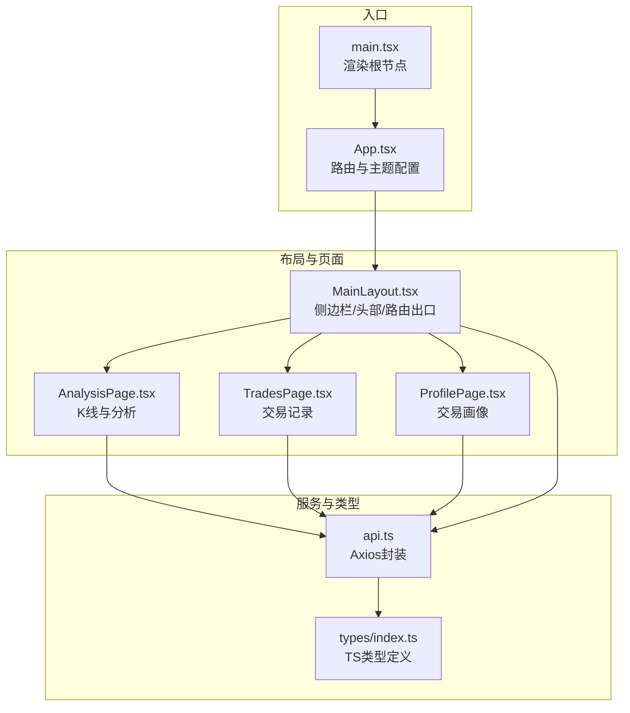
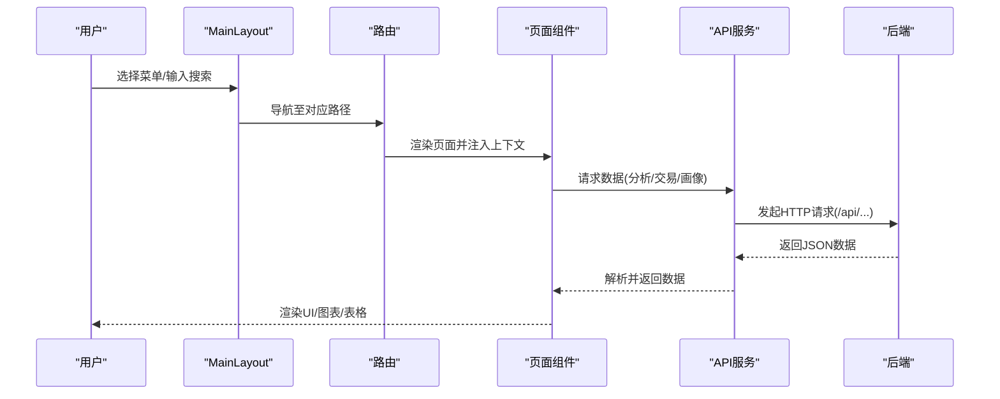
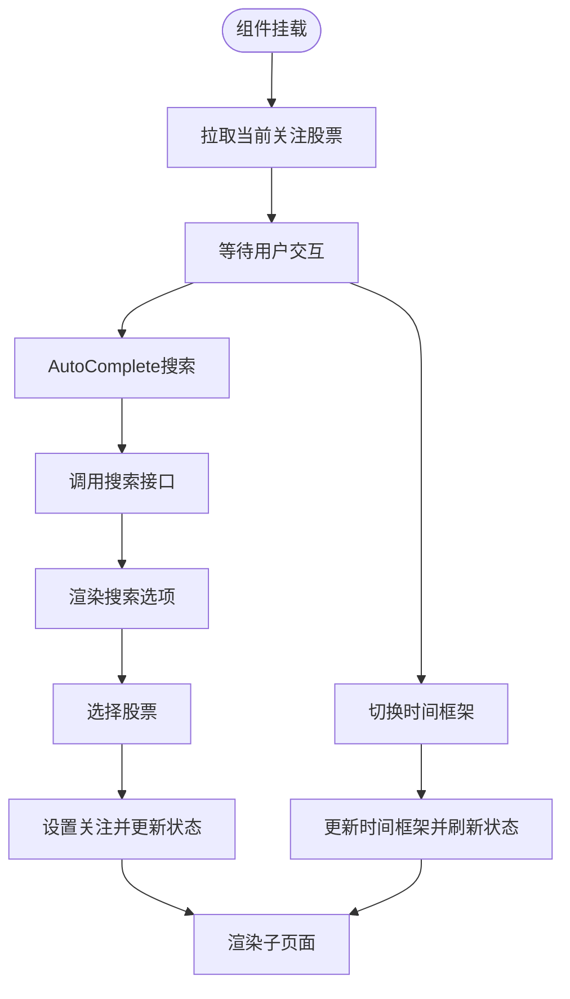
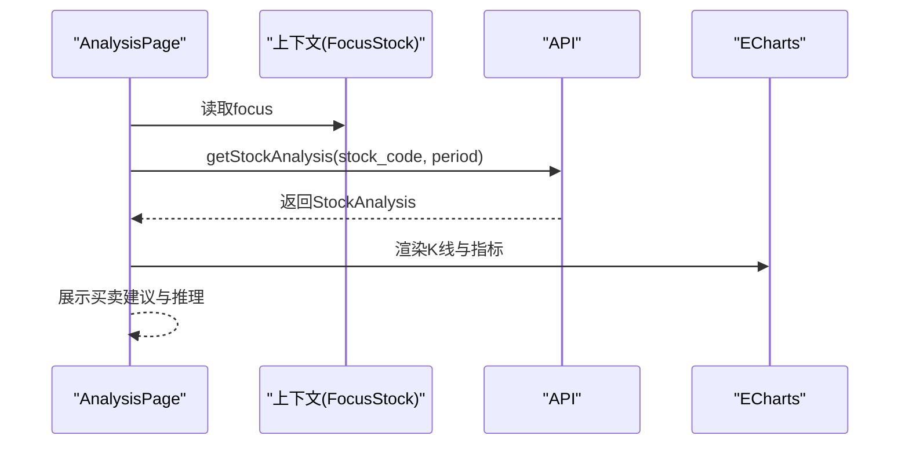
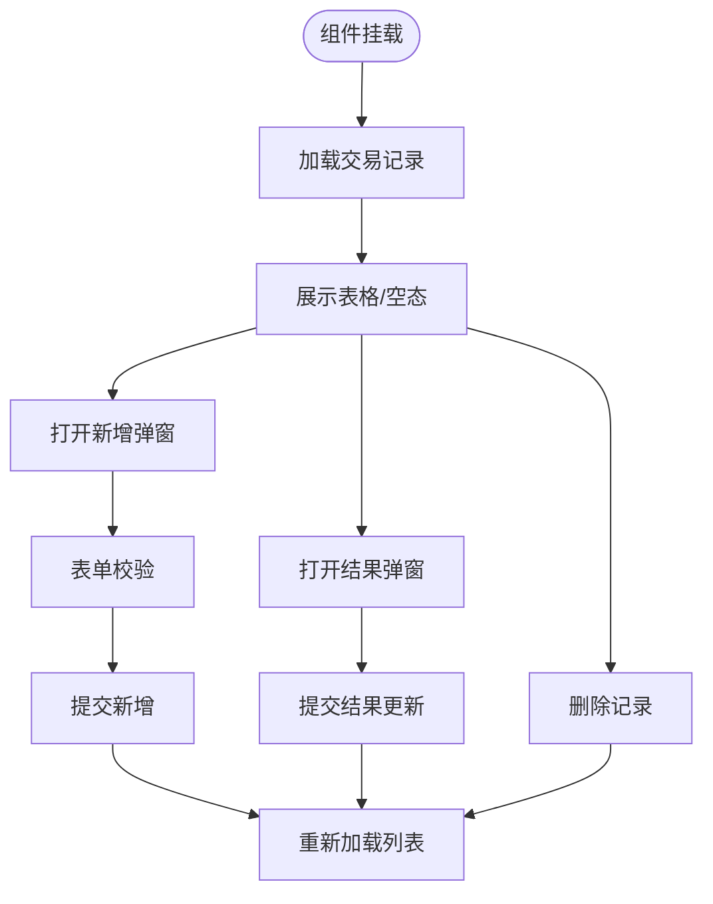
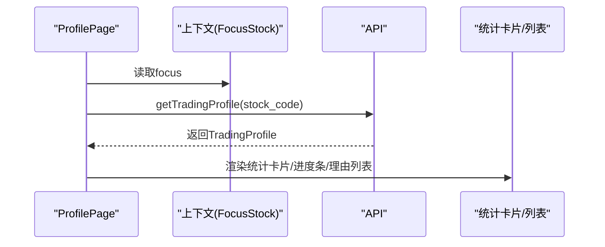
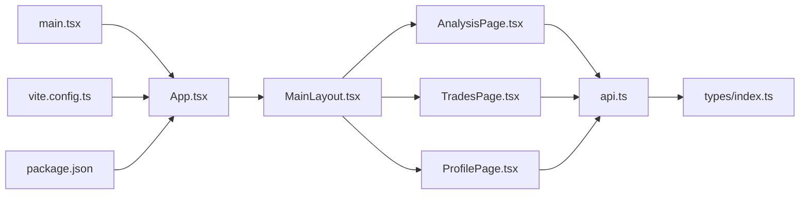

# 前端组件

<cite>
**本文引用的文件**

- [frontend/src/App.tsx](file://frontend/src/App.tsx)

- [frontend/src/main.tsx](file://frontend/src/main.tsx)

- [frontend/src/components/MainLayout.tsx](file://frontend/src/components/MainLayout.tsx)

- [frontend/src/pages/AnalysisPage.tsx](file://frontend/src/pages/AnalysisPage.tsx)

- [frontend/src/pages/TradesPage.tsx](file://frontend/src/pages/TradesPage.tsx)

- [frontend/src/pages/ProfilePage.tsx](file://frontend/src/pages/ProfilePage.tsx)

- [frontend/src/services/api.ts](file://frontend/src/services/api.ts)

- [frontend/src/types/index.ts](file://frontend/src/types/index.ts)

- [frontend/vite.config.ts](file://frontend/vite.config.ts)

- [frontend/tsconfig.json](file://frontend/tsconfig.json)

- [frontend/package.json](file://frontend/package.json)
</cite>

## 目录
1. [简介](#简介)

2. [项目结构](#项目结构)

3. [核心组件](#核心组件)

4. [架构总览](#架构总览)

5. [详细组件分析](#详细组件分析)

6. [依赖关系分析](#依赖关系分析)

7. [性能考量](#性能考量)

8. [故障排查指南](#故障排查指南)

9. [结论](#结论)

10. [附录](#附录)

## 简介
本文件面向Stock Foker前端应用，系统化梳理React组件架构与实现细节，重点覆盖：

- 主布局组件MainLayout：侧边导航、顶部搜索与时间框架切换、路由出口承载

- 分析页面AnalysisPage：K线图与技术指标可视化、买卖建议与推理过程展示

- 交易页面TradesPage：交易记录的增删改查、结果补录与交互表单

- 画像页面ProfilePage：交易画像统计与洞察展示
同时阐述组件间通信模式（通过路由上下文）、数据流（API服务封装）、UI库（Ant Design）使用方式与主题定制，并给出最佳实践与排障建议。

## 项目结构
前端采用Vite + React 19 + TypeScript + Ant Design 5的现代栈，路由基于react-router-dom v7，开发服务器通过Vite代理到后端服务（默认本地8000端口）。组件按功能分层组织在src目录下，类型定义集中于types/index.ts，API封装在services/api.ts。

图表来源

- [frontend/src/main.tsx:1-10](file://frontend/src/main.tsx#L1-L10)

- [frontend/src/App.tsx:1-27](file://frontend/src/App.tsx#L1-L27)

- [frontend/src/components/MainLayout.tsx:1-159](file://frontend/src/components/MainLayout.tsx#L1-L159)

- [frontend/src/pages/AnalysisPage.tsx:1-213](file://frontend/src/pages/AnalysisPage.tsx#L1-L213)

- [frontend/src/pages/TradesPage.tsx:1-260](file://frontend/src/pages/TradesPage.tsx#L1-L260)

- [frontend/src/pages/ProfilePage.tsx:1-173](file://frontend/src/pages/ProfilePage.tsx#L1-L173)

- [frontend/src/services/api.ts:1-65](file://frontend/src/services/api.ts#L1-L65)

- [frontend/src/types/index.ts:1-94](file://frontend/src/types/index.ts#L1-L94)

章节来源

- [frontend/src/main.tsx:1-10](file://frontend/src/main.tsx#L1-L10)

- [frontend/src/App.tsx:1-27](file://frontend/src/App.tsx#L1-L27)

- [frontend/vite.config.ts:1-16](file://frontend/vite.config.ts#L1-L16)

- [frontend/tsconfig.json:1-22](file://frontend/tsconfig.json#L1-L22)

- [frontend/package.json:1-30](file://frontend/package.json#L1-L30)

## 核心组件
- 主布局MainLayout：负责全局导航、顶部搜索与时间框架切换，通过useOutletContext向子页面传递当前关注的股票信息；内部维护搜索选项、关注股票状态与时间框架变更逻辑。

- 分析页面AnalysisPage：根据关注股票与周期参数请求分析数据，渲染ECharts K线图与技术指标，展示买卖建议与推理过程。

- 交易页面TradesPage：提供交易记录的增删改查，支持批量加载、表单校验、结果补录与删除确认。

- 画像页面ProfilePage：基于交易记录生成交易画像，包含胜率、盈亏比、平均持仓天数、情绪准确率等统计与理由TOP展示。

章节来源

- [frontend/src/components/MainLayout.tsx:43-159](file://frontend/src/components/MainLayout.tsx#L43-L159)

- [frontend/src/pages/AnalysisPage.tsx:28-213](file://frontend/src/pages/AnalysisPage.tsx#L28-L213)

- [frontend/src/pages/TradesPage.tsx:28-260](file://frontend/src/pages/TradesPage.tsx#L28-L260)

- [frontend/src/pages/ProfilePage.tsx:26-173](file://frontend/src/pages/ProfilePage.tsx#L26-L173)

## 架构总览
组件间通信与数据流：

- 路由上下文：MainLayout通过<Outlet context={{ focus }}/>向下传递当前关注股票对象；各页面通过useOutletContext读取。

- API服务：统一在services/api.ts中封装HTTP请求，返回Promise化的数据模型，供页面组件消费。

- 类型系统：types/index.ts集中定义FocusStock、StockAnalysis、TradeRecord、TradingProfile等接口，确保组件props与状态的一致性。

- UI库：Ant Design提供布局、表单、表格、图表、通知等组件；App.tsx通过ConfigProvider进行语言与主题配置。

图表来源

- [frontend/src/App.tsx:9-24](file://frontend/src/App.tsx#L9-L24)

- [frontend/src/components/MainLayout.tsx:43-159](file://frontend/src/components/MainLayout.tsx#L43-L159)

- [frontend/src/pages/AnalysisPage.tsx:28-43](file://frontend/src/pages/AnalysisPage.tsx#L28-L43)

- [frontend/src/pages/TradesPage.tsx:28-47](file://frontend/src/pages/TradesPage.tsx#L28-L47)

- [frontend/src/pages/ProfilePage.tsx:26-37](file://frontend/src/pages/ProfilePage.tsx#L26-L37)

- [frontend/src/services/api.ts:13-64](file://frontend/src/services/api.ts#L13-L64)

## 详细组件分析

### MainLayout 组件
职责与实现要点：

- 布局：左侧Sider固定宽度，右侧Layout包含Header与Content；Content通过<Outlet context={{ focus }}/>承载子页面。

- 导航：Menu项与路由路径一一对应，点击触发导航；选中态基于当前location.pathname。

- 搜索：AutoComplete结合onSearch与onSelect实现远程搜索与选择，选择后调用setFocusStock并更新本地focus状态。

- 时间框架：Select切换time_frame，调用updateTimeFrame更新后端状态并刷新focus。

- 状态管理：useState维护focus与搜索选项；useEffect在首次挂载时拉取当前关注股票。

- 事件处理：handleSearch、handleSelect、handleTimeFrameChange分别处理搜索、选择与时间框架变更。

- 生命周期：组件挂载时初始化关注股票；后续由用户交互驱动状态变化。

图表来源

- [frontend/src/components/MainLayout.tsx:51-97](file://frontend/src/components/MainLayout.tsx#L51-L97)

章节来源

- [frontend/src/components/MainLayout.tsx:43-159](file://frontend/src/components/MainLayout.tsx#L43-L159)

- [frontend/src/services/api.ts:13-24](file://frontend/src/services/api.ts#L13-L24)

- [frontend/src/types/index.ts:1-8](file://frontend/src/types/index.ts#L1-L8)

### AnalysisPage 组件
职责与实现要点：

- 数据源：从useOutletContext读取focus；根据focus与period参数请求分析数据。

- 加载与错误：loading与error状态控制空态、加载与错误提示；analysis为空时渲染图表。

- 图表：基于ReactECharts与ECharts配置绘制K线图与多条均线、成交量柱状图，支持缩放与图例。

- 建议与推理：根据advice.signal动态着色，confidence转换为百分比显示；reasoning逐条展示推理过程。

- 指标概览：indicators_summary以键值对形式展示数值型指标。

- 交互：Segmented切换周期，影响请求参数period。

图表来源

- [frontend/src/pages/AnalysisPage.tsx:28-43](file://frontend/src/pages/AnalysisPage.tsx#L28-L43)

- [frontend/src/pages/AnalysisPage.tsx:54-157](file://frontend/src/pages/AnalysisPage.tsx#L54-L157)

- [frontend/src/services/api.ts:30-41](file://frontend/src/services/api.ts#L30-L41)

- [frontend/src/types/index.ts:44-49](file://frontend/src/types/index.ts#L44-L49)

章节来源

- [frontend/src/pages/AnalysisPage.tsx:28-213](file://frontend/src/pages/AnalysisPage.tsx#L28-L213)

- [frontend/src/services/api.ts:30-41](file://frontend/src/services/api.ts#L30-L41)

- [frontend/src/types/index.ts:44-49](file://frontend/src/types/index.ts#L44-L49)

### TradesPage 组件
职责与实现要点：

- 数据加载：useEffect在focus变化时调用getTradeRecords加载列表；loading控制表格加载态。

- 新增记录：Modal内Form收集字段，校验通过后调用createTradeRecord；成功后重置表单并重新加载。

- 更新结果：通过resultModal与resultForm补录actual_result与result_note；调用updateTradeRecord更新。

- 删除记录：Popconfirm二次确认后调用deleteTradeRecord并刷新。

- 列表渲染：日期格式化、类型标签化、情绪判断映射、实际盈亏颜色化、操作列按钮。

- 表单字段：支持手动输入股票信息（当未关注时），或自动使用focus中的stock_code与stock_name。

图表来源

- [frontend/src/pages/TradesPage.tsx:37-85](file://frontend/src/pages/TradesPage.tsx#L37-L85)

- [frontend/src/pages/TradesPage.tsx:87-164](file://frontend/src/pages/TradesPage.tsx#L87-L164)

- [frontend/src/services/api.ts:43-58](file://frontend/src/services/api.ts#L43-L58)

章节来源

- [frontend/src/pages/TradesPage.tsx:28-260](file://frontend/src/pages/TradesPage.tsx#L28-L260)

- [frontend/src/services/api.ts:43-58](file://frontend/src/services/api.ts#L43-L58)

- [frontend/src/types/index.ts:51-79](file://frontend/src/types/index.ts#L51-L79)

### ProfilePage 组件
职责与实现要点：

- 数据加载：useEffect在focus变化时调用getTradingProfile；loading控制加载态；无数据时提示空态。

- 统计卡片：总交易次数、胜率（百分比）、盈亏比、平均持仓天数四个核心指标。

- 交易风格：交易频率、偏好时间框架、平均盈利与平均亏损。

- 准确率：胜率与情绪判断准确率的进度条展示。

- 常见理由：买入与卖出理由的Top统计列表。

- 颜色策略：胜率与盈亏比阈值决定颜色，提升可读性。

图表来源

- [frontend/src/pages/ProfilePage.tsx:31-41](file://frontend/src/pages/ProfilePage.tsx#L31-L41)

- [frontend/src/pages/ProfilePage.tsx:46-170](file://frontend/src/pages/ProfilePage.tsx#L46-L170)

- [frontend/src/services/api.ts:60-64](file://frontend/src/services/api.ts#L60-L64)

- [frontend/src/types/index.ts:81-93](file://frontend/src/types/index.ts#L81-L93)

章节来源

- [frontend/src/pages/ProfilePage.tsx:26-173](file://frontend/src/pages/ProfilePage.tsx#L26-L173)

- [frontend/src/services/api.ts:60-64](file://frontend/src/services/api.ts#L60-L64)

- [frontend/src/types/index.ts:81-93](file://frontend/src/types/index.ts#L81-L93)

## 依赖关系分析
- 组件依赖：App.tsx作为根组件，注册路由与主题；MainLayout承载三类页面；各页面依赖API服务与类型定义。

- 外部依赖：Ant Design、@ant-design/icons、echarts-for-react、axios、dayjs、react-router-dom。

- 构建与代理：Vite插件react，开发服务器端口5173，代理前缀/api到后端8000端口。

- 类型约束：所有组件props与状态均基于types/index.ts中的接口定义，保证前后端契约一致。

图表来源

- [frontend/src/App.tsx:1-27](file://frontend/src/App.tsx#L1-L27)

- [frontend/src/main.tsx:1-10](file://frontend/src/main.tsx#L1-L10)

- [frontend/src/components/MainLayout.tsx:1-26](file://frontend/src/components/MainLayout.tsx#L1-L26)

- [frontend/src/pages/AnalysisPage.tsx:1-18](file://frontend/src/pages/AnalysisPage.tsx#L1-L18)

- [frontend/src/pages/TradesPage.tsx:1-26](file://frontend/src/pages/TradesPage.tsx#L1-L26)

- [frontend/src/pages/ProfilePage.tsx:1-22](file://frontend/src/pages/ProfilePage.tsx#L1-L22)

- [frontend/src/services/api.ts:1-9](file://frontend/src/services/api.ts#L1-L9)

- [frontend/src/types/index.ts:1-94](file://frontend/src/types/index.ts#L1-L94)

- [frontend/vite.config.ts:1-16](file://frontend/vite.config.ts#L1-L16)

- [frontend/package.json:1-30](file://frontend/package.json#L1-L30)

章节来源

- [frontend/src/App.tsx:1-27](file://frontend/src/App.tsx#L1-L27)

- [frontend/src/services/api.ts:1-65](file://frontend/src/services/api.ts#L1-L65)

- [frontend/src/types/index.ts:1-94](file://frontend/src/types/index.ts#L1-L94)

- [frontend/vite.config.ts:1-16](file://frontend/vite.config.ts#L1-L16)

- [frontend/package.json:1-30](file://frontend/package.json#L1-L30)

## 性能考量
- 图表渲染：AnalysisPage的ECharts配置包含多个series与grid，建议在数据量较大时启用dataZoom与平滑曲线的条件渲染，避免不必要的重绘。

- 列表加载：TradesPage表格分页pageSize=20，配合后端分页可减少一次性传输；建议在高频筛选场景增加防抖。

- 搜索优化：MainLayout的搜索接口应考虑关键词长度阈值与去抖，避免频繁网络请求。

- 状态粒度：将关注股票与时间框架拆分为独立状态，减少不必要的重渲染；对复杂表单使用Form.useForm的懒初始化。

- 缓存策略：可在API层引入缓存（如按stock_code+period缓存分析数据），降低重复请求成本。

## 故障排查指南
- 路由与上下文

  - 现象：页面空白或提示“请先搜索并关注”

  - 排查：确认MainLayout是否正确传递context；检查focus是否为空；确认路由路径与菜单项一致。

- API请求

  - 现象：加载失败或空数据

  - 排查：检查/vite.config.ts中的代理配置是否指向正确的后端地址；确认后端接口返回格式与types定义一致。

- 表单与校验

  - 现象：新增/更新失败或无提示

  - 排查：确认Form字段规则与必填项；检查create/update/delete接口返回；查看message提示。

- 图表异常

  - 现象：图表不显示或渲染错误

  - 排查：检查klineOption配置与数据结构；确认dates与ohlc数组长度一致；验证ECharts版本兼容性。

章节来源

- [frontend/src/App.tsx:14-20](file://frontend/src/App.tsx#L14-L20)

- [frontend/src/components/MainLayout.tsx:133-150](file://frontend/src/components/MainLayout.tsx#L133-L150)

- [frontend/src/pages/AnalysisPage.tsx:35-48](file://frontend/src/pages/AnalysisPage.tsx#L35-L48)

- [frontend/src/pages/TradesPage.tsx:49-85](file://frontend/src/pages/TradesPage.tsx#L49-L85)

- [frontend/vite.config.ts:6-14](file://frontend/vite.config.ts#L6-L14)

## 结论
Stock Foker前端采用清晰的分层架构：布局组件负责导航与上下文传递，页面组件聚焦业务功能与数据可视化，API服务统一抽象HTTP请求，类型系统保障契约一致性。通过Ant Design与ECharts的组合，实现了从K线分析到交易画像的全链路体验。建议在性能与可用性方面持续优化，完善错误处理与用户反馈，进一步提升交互效率与稳定性。

## 附录
- 使用示例与最佳实践

  - 在AnalysisPage中切换周期时，建议将period变更与URL查询参数同步，便于分享链接与回溯。

  - TradesPage的新增表单应默认填充focus中的stock_code与stock_name，减少重复输入。

  - ProfilePage在无数据时提供引导性文案，鼓励用户先添加交易记录。

  - 全局主题可通过ConfigProvider的theme.token进行扩展，保持品牌一致性。

- 开发与部署

  - 开发：npm run dev启动Vite开发服务器，默认端口5173；代理/api到后端8000。

  - 构建：npm run build生成生产包；TypeScript编译与Vite打包并行执行。

章节来源

- [frontend/src/App.tsx:11-22](file://frontend/src/App.tsx#L11-L22)

- [frontend/vite.config.ts:4-15](file://frontend/vite.config.ts#L4-L15)

- [frontend/package.json:6-10](file://frontend/package.json#L6-L10)
