# 前端组件

<cite>
**本文引用的文件**
- [frontend/src/App.tsx](file://frontend/src/App.tsx)
- [frontend/src/main.tsx](file://frontend/src/main.tsx)
- [frontend/src/components/MainLayout.tsx](file://frontend/src/components/MainLayout.tsx)
- [frontend/src/components/PositionCard.tsx](file://frontend/src/components/PositionCard.tsx)
- [frontend/src/components/SnapshotPanel.tsx](file://frontend/src/components/SnapshotPanel.tsx)
- [frontend/src/pages/AnalysisPage.tsx](file://frontend/src/pages/AnalysisPage.tsx)
- [frontend/src/pages/MacroPage.tsx](file://frontend/src/pages/MacroPage.tsx)
- [frontend/src/pages/SectorPage.tsx](file://frontend/src/pages/SectorPage.tsx)
- [frontend/src/pages/SentimentPage.tsx](file://frontend/src/pages/SentimentPage.tsx)
- [frontend/src/pages/TradesPage.tsx](file://frontend/src/pages/TradesPage.tsx)
- [frontend/src/pages/ProfilePage.tsx](file://frontend/src/pages/ProfilePage.tsx)
- [frontend/src/services/api.ts](file://frontend/src/services/api.ts)
- [frontend/src/types/index.ts](file://frontend/src/types/index.ts)
- [frontend/src/contexts/AgentCacheContext.tsx](file://frontend/src/contexts/AgentCacheContext.tsx)
- [frontend/src/hooks/useDataSource.ts](file://frontend/src/hooks/useDataSource.ts)
- [frontend/src/constants/indicators.ts](file://frontend/src/constants/indicators.ts)
- [frontend/src/theme/index.ts](file://frontend/src/theme/index.ts)
- [frontend/vite.config.ts](file://frontend/vite.config.ts)
- [frontend/tsconfig.json](file://frontend/tsconfig.json)
- [frontend/package.json](file://frontend/package.json)
</cite>

## 目录
1. [简介](#简介)
2. [项目结构](#项目结构)
3. [核心组件](#核心组件)
4. [架构总览](#架构总览)
5. [详细组件分析](#详细组件分析)
6. [依赖关系分析](#依赖关系分析)
7. [性能考量](#性能考量)
8. [故障排查指南](#故障排查指南)
9. [结论](#结论)
10. [附录](#附录)

## 简介
本文件面向Stock Foker前端应用，系统化梳理React组件架构与实现细节，重点覆盖：
- 主布局组件MainLayout：侧边导航、顶部搜索与时间框架切换、路由出口承载
- 分析页面AnalysisPage：K线图与技术指标可视化、买卖建议与推理过程展示
- 交易页面TradesPage：交易记录的增删改查、批量操作、结果补录与交互表单
- 画像页面ProfilePage：交易画像统计与洞察展示
- 新增组件PositionCard：持仓管理与实时盈亏计算
- 新增组件SnapshotPanel：Agent历史快照面板，支持消息面、板块、宏观、增强分析
- 新增页面MacroPage：宏观环境分析，集成Agent缓存与独立数据源
- 新增页面SectorPage：板块联动分析，多数据源并行管理
- 新增页面SentimentPage：消息面情绪分析，信息流与公司资料整合

同时阐述组件间通信模式（通过路由上下文）、数据流（API服务封装）、UI库（Ant Design）使用方式与主题定制，并给出最佳实践与排障建议。

## 项目结构
前端采用Vite + React 19 + TypeScript + Ant Design 5的现代栈，路由基于react-router-dom v7，开发服务器通过Vite代理到后端服务（默认本地8000端口）。组件按功能分层组织在src目录下，类型定义集中于types/index.ts，API封装在services/api.ts，新增了Agent缓存上下文和数据源钩子。

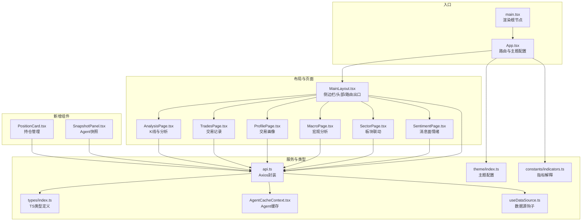

**图表来源**
- [frontend/src/main.tsx:1-10](file://frontend/src/main.tsx#L1-L10)
- [frontend/src/App.tsx:1-39](file://frontend/src/App.tsx#L1-L39)
- [frontend/src/components/MainLayout.tsx:1-380](file://frontend/src/components/MainLayout.tsx#L1-L380)
- [frontend/src/components/PositionCard.tsx:1-312](file://frontend/src/components/PositionCard.tsx#L1-L312)
- [frontend/src/components/SnapshotPanel.tsx:1-436](file://frontend/src/components/SnapshotPanel.tsx#L1-L436)
- [frontend/src/pages/AnalysisPage.tsx:1-213](file://frontend/src/pages/AnalysisPage.tsx#L1-L213)
- [frontend/src/pages/MacroPage.tsx:1-256](file://frontend/src/pages/MacroPage.tsx#L1-L256)
- [frontend/src/pages/SectorPage.tsx:1-468](file://frontend/src/pages/SectorPage.tsx#L1-L468)
- [frontend/src/pages/SentimentPage.tsx:1-464](file://frontend/src/pages/SentimentPage.tsx#L1-L464)
- [frontend/src/pages/TradesPage.tsx:1-481](file://frontend/src/pages/TradesPage.tsx#L1-L481)
- [frontend/src/pages/ProfilePage.tsx:1-173](file://frontend/src/pages/ProfilePage.tsx#L1-L173)
- [frontend/src/services/api.ts:1-188](file://frontend/src/services/api.ts#L1-L188)
- [frontend/src/types/index.ts:1-174](file://frontend/src/types/index.ts#L1-L174)
- [frontend/src/contexts/AgentCacheContext.tsx:1-139](file://frontend/src/contexts/AgentCacheContext.tsx#L1-L139)
- [frontend/src/hooks/useDataSource.ts:1-169](file://frontend/src/hooks/useDataSource.ts#L1-L169)
- [frontend/src/constants/indicators.ts:1-116](file://frontend/src/constants/indicators.ts#L1-L116)
- [frontend/src/theme/index.ts:1-116](file://frontend/src/theme/index.ts#L1-L116)

**章节来源**
- [frontend/src/main.tsx:1-10](file://frontend/src/main.tsx#L1-L10)
- [frontend/src/App.tsx:1-39](file://frontend/src/App.tsx#L1-L39)
- [frontend/vite.config.ts:1-16](file://frontend/vite.config.ts#L1-L16)
- [frontend/tsconfig.json:1-22](file://frontend/tsconfig.json#L1-L22)
- [frontend/package.json:1-30](file://frontend/package.json#L1-L30)

## 核心组件
- 主布局MainLayout：负责全局导航、顶部搜索与时间框架切换，通过useOutletContext向子页面传递当前关注的股票信息；内部维护搜索选项、关注股票状态与时间框架变更逻辑。
- 分析页面AnalysisPage：根据关注股票与周期参数请求分析数据，渲染ECharts K线图与技术指标，展示买卖建议与推理过程。
- 交易页面TradesPage：提供交易记录的增删改查，支持批量加载、表单校验、结果补录、批量删除与批量导入。
- 画像页面ProfilePage：基于交易记录生成交易画像，包含胜率、盈亏比、平均持仓天数、情绪准确率等统计与理由TOP展示。
- 新增组件PositionCard：管理单只股票的持仓信息，支持添加、编辑、删除，实时计算市值、浮动盈亏与持有天数，提供止盈止损预警。
- 新增组件SnapshotPanel：展示Agent历史快照，支持消息面、板块、宏观、增强分析四种类型，左右分栏设计。
- 新增页面MacroPage：宏观环境分析，集成Agent缓存、独立数据源（主要指数行情），支持缓存状态显示与手动刷新。
- 新增页面SectorPage：板块联动分析，管理多个独立数据源（行业估值、市场数据、财务数据、同行对比、概念板块），提供Tab切换与数据刷新。
- 新增页面SentimentPage：消息面情绪分析，整合AI分析、资讯、公告、研报、公司资料等多个数据源，支持时间排序与来源识别。

**章节来源**
- [frontend/src/components/MainLayout.tsx:42-50](file://frontend/src/components/MainLayout.tsx#L42-L50)
- [frontend/src/pages/AnalysisPage.tsx:28-213](file://frontend/src/pages/AnalysisPage.tsx#L28-L213)
- [frontend/src/pages/TradesPage.tsx:28-481](file://frontend/src/pages/TradesPage.tsx#L28-L481)
- [frontend/src/pages/ProfilePage.tsx:26-173](file://frontend/src/pages/ProfilePage.tsx#L26-L173)
- [frontend/src/components/PositionCard.tsx:36-40](file://frontend/src/components/PositionCard.tsx#L36-L40)
- [frontend/src/components/SnapshotPanel.tsx:40-43](file://frontend/src/components/SnapshotPanel.tsx#L40-L43)
- [frontend/src/pages/MacroPage.tsx:19-256](file://frontend/src/pages/MacroPage.tsx#L19-L256)
- [frontend/src/pages/SectorPage.tsx:19-468](file://frontend/src/pages/SectorPage.tsx#L19-L468)
- [frontend/src/pages/SentimentPage.tsx:70-464](file://frontend/src/pages/SentimentPage.tsx#L70-L464)

## 架构总览
组件间通信与数据流：
- 路由上下文：MainLayout通过<Outlet context={{ focus }}/>向下传递当前关注股票对象；各页面通过useOutletContext读取。
- API服务：统一在services/api.ts中封装HTTP请求，返回Promise化的数据模型，供页面组件消费。
- 类型系统：types/index.ts集中定义FocusStock、StockAnalysis、TradeRecord、TradingProfile、Position等接口，确保组件props与状态的一致性。
- UI库：Ant Design提供布局、表单、表格、图表、通知等组件；App.tsx通过ConfigProvider进行语言与主题配置。
- Agent缓存：AgentCacheContext提供前端内存缓存，避免重复调用Agent接口，支持缓存失效与增强分析缓存。
- 数据源钩子：useDataSource提供独立数据源管理，支持内存缓存、刷新与错误处理。

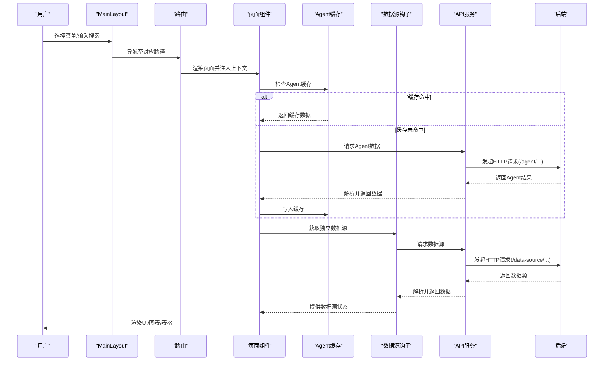

**图表来源**
- [frontend/src/App.tsx:15-36](file://frontend/src/App.tsx#L15-L36)
- [frontend/src/components/MainLayout.tsx:52-380](file://frontend/src/components/MainLayout.tsx#L52-L380)
- [frontend/src/pages/MacroPage.tsx:31-64](file://frontend/src/pages/MacroPage.tsx#L31-L64)
- [frontend/src/pages/SectorPage.tsx:35-72](file://frontend/src/pages/SectorPage.tsx#L35-L72)
- [frontend/src/pages/SentimentPage.tsx:87-127](file://frontend/src/pages/SentimentPage.tsx#L87-L127)
- [frontend/src/contexts/AgentCacheContext.tsx:78-132](file://frontend/src/contexts/AgentCacheContext.tsx#L78-L132)
- [frontend/src/hooks/useDataSource.ts:82-168](file://frontend/src/hooks/useDataSource.ts#L82-L168)
- [frontend/src/services/api.ts:107-188](file://frontend/src/services/api.ts#L107-L188)

## 详细组件分析

### MainLayout 组件
职责与实现要点：
- 布局：左侧Sider固定宽度，右侧Layout包含Header与Content；Content通过<Outlet context={{ focus }}/>承载子页面。
- 导航：Menu项与路由路径一一对应，点击触发导航；选中态基于当前location.pathname。
- 搜索：AutoComplete结合onSearch与onSelect实现远程搜索与选择，选择后调用setFocusStock并更新本地focus状态。
- 时间框架：Select切换time_frame，调用updateTimeFrame更新后端状态并刷新focus。
- 状态管理：useState维护focus与搜索选项；useEffect在首次挂载时拉取当前关注股票。
- 事件处理：handleSearch、handleSelect、handleTimeFrameChange分别处理搜索、选择与时间框架变更。
- 生命周期：组件挂载时初始化关注股票；后续由用户交互驱动状态变化。

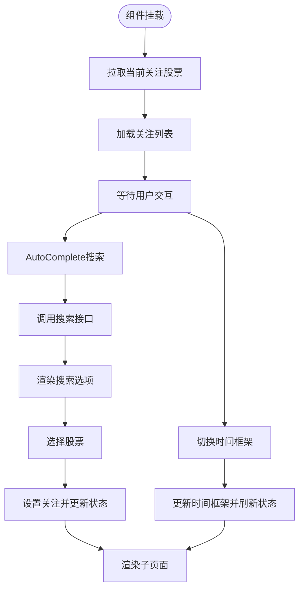

**图表来源**
- [frontend/src/components/MainLayout.tsx:80-85](file://frontend/src/components/MainLayout.tsx#L80-L85)
- [frontend/src/components/MainLayout.tsx:100-124](file://frontend/src/components/MainLayout.tsx#L100-L124)
- [frontend/src/components/MainLayout.tsx:197-204](file://frontend/src/components/MainLayout.tsx#L197-L204)

**章节来源**
- [frontend/src/components/MainLayout.tsx:52-380](file://frontend/src/components/MainLayout.tsx#L52-L380)
- [frontend/src/services/api.ts:21-35](file://frontend/src/services/api.ts#L21-L35)
- [frontend/src/types/index.ts:1-8](file://frontend/src/types/index.ts#L1-L8)

### AnalysisPage 组件
职责与实现要点：
- 数据源：从useOutletContext读取focus；根据focus与period参数请求分析数据。
- 加载与错误：loading与error状态控制空态、加载与错误提示；analysis为空时渲染图表。
- 图表：基于ReactECharts与ECharts配置绘制K线图与多条均线、成交量柱状图，支持缩放与图例。
- 建议与推理：根据advice.signal动态着色，confidence转换为百分比显示；reasoning逐条展示推理过程。
- 指标概览：indicators_summary以键值对形式展示数值型指标。
- 交互：Segmented切换周期，影响请求参数period。

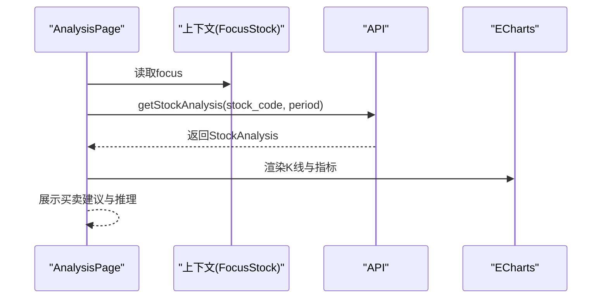

**图表来源**
- [frontend/src/pages/AnalysisPage.tsx:28-43](file://frontend/src/pages/AnalysisPage.tsx#L28-L43)
- [frontend/src/pages/AnalysisPage.tsx:54-157](file://frontend/src/pages/AnalysisPage.tsx#L54-L157)
- [frontend/src/services/api.ts:41-51](file://frontend/src/services/api.ts#L41-L51)
- [frontend/src/types/index.ts:45-50](file://frontend/src/types/index.ts#L45-L50)

**章节来源**
- [frontend/src/pages/AnalysisPage.tsx:28-213](file://frontend/src/pages/AnalysisPage.tsx#L28-L213)
- [frontend/src/services/api.ts:41-51](file://frontend/src/services/api.ts#L41-L51)
- [frontend/src/types/index.ts:45-50](file://frontend/src/types/index.ts#L45-L50)

### TradesPage 组件
职责与实现要点：
- 数据加载：useEffect在focus变化时调用getTradeRecords加载列表；loading控制表格加载态。
- 新增记录：Modal内Form收集字段，校验通过后调用createTradeRecord；成功后重置表单并重新加载。
- 更新结果：通过resultModal与resultForm补录actual_result与result_note；调用updateTradeRecord更新。
- 删除记录：Popconfirm二次确认后调用deleteTradeRecord并刷新。
- **批量操作**：新增Ant Design行选择功能，支持批量删除与批量导入；动态按钮状态控制。
- **批量删除**：handleBatchDelete函数处理批量删除，区分实时交易和历史补录记录，支持反向调整持仓。
- **批量导入**：handleImport函数处理文件导入，支持Excel、CSV等格式，提供详细的导入统计。
- 列表渲染：日期格式化、类型标签化、情绪判断映射、实际盈亏颜色化、操作列按钮。
- 表单字段：支持手动输入股票信息（当未关注时），或自动使用focus中的stock_code与stock_name。

**更新** TrdaesPage组件新增了完整的批量操作功能，包括Ant Design行选择、动态按钮状态管理和批量删除确认流程。

```mermaid
flowchart TD
Init(["组件挂载"]) --> Load["加载交易记录"]
Load --> View["展示表格/空态"]
View --> Add["打开新增弹窗"]
Add --> Validate["表单校验"]
Validate --> Create["提交新增"]
Create --> Reload["重新加载列表"]
View --> Edit["打开结果弹窗"]
Edit --> Update["提交结果更新"]
Update --> Reload
View --> Del["删除记录"]
Del --> Reload
View --> BatchSelect["行选择"]
BatchSelect --> BatchDelete["批量删除"]
BatchDelete --> Confirm["确认删除"]
Confirm --> RealtimeAdjust["实时交易反向调整"]
RealtimeAdjust --> Reload
View --> BatchImport["批量导入"]
BatchImport --> ImportFile["选择文件"]
ImportFile --> ImportProcess["处理导入"]
ImportProcess --> ImportResult["显示导入结果"]
ImportResult --> Reload
```

**图表来源**
- [frontend/src/pages/TradesPage.tsx:37-85](file://frontend/src/pages/TradesPage.tsx#L37-L85)
- [frontend/src/pages/TradesPage.tsx:87-164](file://frontend/src/pages/TradesPage.tsx#L87-L164)
- [frontend/src/pages/TradesPage.tsx:176-211](file://frontend/src/pages/TradesPage.tsx#L176-L211)
- [frontend/src/pages/TradesPage.tsx:144-174](file://frontend/src/pages/TradesPage.tsx#L144-L174)
- [frontend/src/services/api.ts:75-95](file://frontend/src/services/api.ts#L75-L95)

**章节来源**
- [frontend/src/pages/TradesPage.tsx:28-481](file://frontend/src/pages/TradesPage.tsx#L28-L481)
- [frontend/src/services/api.ts:54-68](file://frontend/src/services/api.ts#L54-L68)
- [frontend/src/services/api.ts:75-95](file://frontend/src/services/api.ts#L75-L95)
- [frontend/src/types/index.ts:54-84](file://frontend/src/types/index.ts#L54-L84)

### ProfilePage 组件
职责与实现要点：
- 数据加载：useEffect在focus变化时调用getTradingProfile；loading控制加载态；无数据时提示空态。
- 统计卡片：总交易次数、胜率（百分比）、盈亏比、平均持仓天数四个核心指标。
- 交易风格：交易频率、偏好时间框架、平均盈利与平均亏损。
- 准确率：胜率与情绪判断准确率的进度条展示。
- 常见理由：买入与卖出理由的Top统计列表。
- 颜色策略：胜率与盈亏比阈值决定颜色，提升可读性。

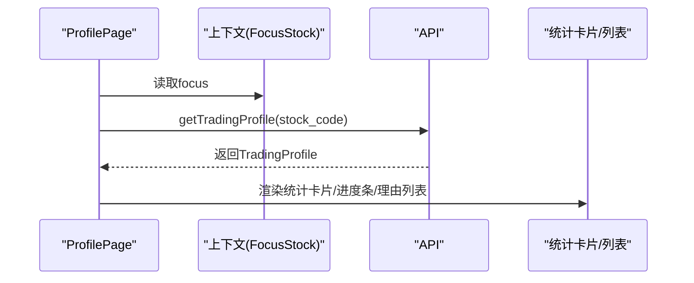

**图表来源**
- [frontend/src/pages/ProfilePage.tsx:31-41](file://frontend/src/pages/ProfilePage.tsx#L31-L41)
- [frontend/src/pages/ProfilePage.tsx:46-170](file://frontend/src/pages/ProfilePage.tsx#L46-L170)
- [frontend/src/services/api.ts:88-91](file://frontend/src/services/api.ts#L88-L91)
- [frontend/src/types/index.ts:86-98](file://frontend/src/types/index.ts#L86-L98)

**章节来源**
- [frontend/src/pages/ProfilePage.tsx:26-173](file://frontend/src/pages/ProfilePage.tsx#L26-L173)
- [frontend/src/services/api.ts:88-91](file://frontend/src/services/api.ts#L88-L91)
- [frontend/src/types/index.ts:86-98](file://frontend/src/types/index.ts#L86-L98)

### PositionCard 组件
职责与实现要点：
- 持仓管理：支持添加、编辑、删除单只股票的持仓信息，实时计算市值、浮动盈亏与持有天数。
- 表单验证：使用Ant Design Form进行字段校验，支持成本价、数量、止盈止损价位等。
- 实时计算：根据当前价格计算浮动盈亏金额与百分比，提供颜色标识。
- 预警提示：当股价触及止盈或止损价位时显示相应标签。
- 状态管理：useState管理加载状态、模态框状态、提交状态与表单实例。
- 错误处理：统一捕获API错误并显示友好提示。

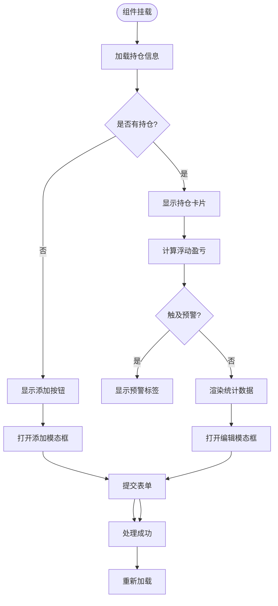

**图表来源**
- [frontend/src/components/PositionCard.tsx:49-61](file://frontend/src/components/PositionCard.tsx#L49-L61)
- [frontend/src/components/PositionCard.tsx:134-150](file://frontend/src/components/PositionCard.tsx#L134-L150)
- [frontend/src/components/PositionCard.tsx:152-157](file://frontend/src/components/PositionCard.tsx#L152-L157)

**章节来源**
- [frontend/src/components/PositionCard.tsx:42-312](file://frontend/src/components/PositionCard.tsx#L42-L312)
- [frontend/src/services/api.ts:94-104](file://frontend/src/services/api.ts#L94-L104)
- [frontend/src/types/index.ts:100-131](file://frontend/src/types/index.ts#L100-L131)

### SnapshotPanel 组件
职责与实现要点：
- 快照管理：支持消息面(sentiment)、板块(sector)、宏观(macro)、增强分析(enhanced_advice)四种Agent类型的历史记录。
- 左右分栏：左侧显示日期列表（降序），右侧显示选中日期的详细内容。
- 动态渲染：根据Agent类型渲染不同的详情组件（情绪、板块、宏观、增强分析）。
- 日期处理：使用本地日期避免UTC时区偏差，过滤当天记录。
- 加载状态：独立的日期列表加载与详情加载状态管理。

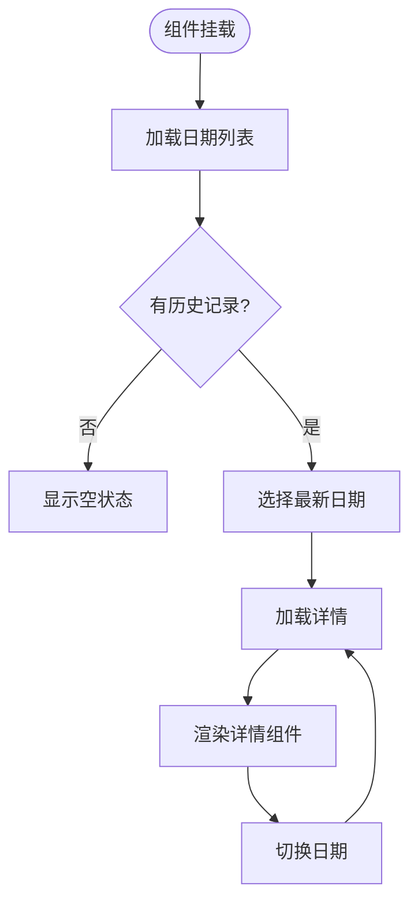

**图表来源**
- [frontend/src/components/SnapshotPanel.tsx:308-352](file://frontend/src/components/SnapshotPanel.tsx#L308-L352)
- [frontend/src/components/SnapshotPanel.tsx:331-342](file://frontend/src/components/SnapshotPanel.tsx#L331-L342)

**章节来源**
- [frontend/src/components/SnapshotPanel.tsx:301-436](file://frontend/src/components/SnapshotPanel.tsx#L301-L436)
- [frontend/src/services/api.ts:169-178](file://frontend/src/services/api.ts#L169-L178)
- [frontend/src/types/index.ts:164-173](file://frontend/src/types/index.ts#L164-L173)

### MacroPage 组件
职责与实现要点：
- Agent集成：调用runMacroAgent获取宏观分析结果，支持Agent缓存与手动刷新。
- 缓存管理：使用useAgentCache上下文，支持缓存状态显示与失效。
- 独立数据源：集成useDataSource钩子获取主要指数行情数据。
- UI设计：卡片式布局展示市场阶段、情绪、风险等级等关键指标。
- 错误处理：支持降级模式（AI分析不可用时显示原始数据）。

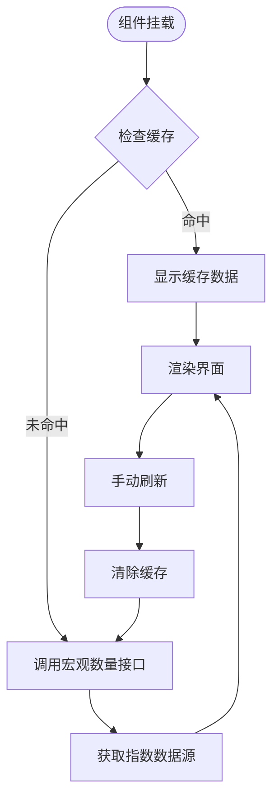

**图表来源**
- [frontend/src/pages/MacroPage.tsx:31-64](file://frontend/src/pages/MacroPage.tsx#L31-L64)
- [frontend/src/pages/MacroPage.tsx:28-30](file://frontend/src/pages/MacroPage.tsx#L28-L30)

**章节来源**
- [frontend/src/pages/MacroPage.tsx:19-256](file://frontend/src/pages/MacroPage.tsx#L19-L256)
- [frontend/src/contexts/AgentCacheContext.tsx:78-132](file://frontend/src/contexts/AgentCacheContext.tsx#L78-L132)
- [frontend/src/hooks/useDataSource.ts:82-168](file://frontend/src/hooks/useDataSource.ts#L82-L168)

### SectorPage 组件
职责与实现要点：
- 多数据源管理：同时管理行业估值、市场数据、财务数据、同行对比、概念板块五个独立数据源。
- Tab切换：使用Ant Design Tabs组织不同数据源的展示。
- 数据处理：提供findVal辅助函数处理模糊键名匹配，支持多种数据格式。
- 排序与筛选：对概念板块按成分股数量排序，对同行对比按排名排序。
- 统计指标：展示相对强度、PE、PB、ROE、主力净流入等关键指标。

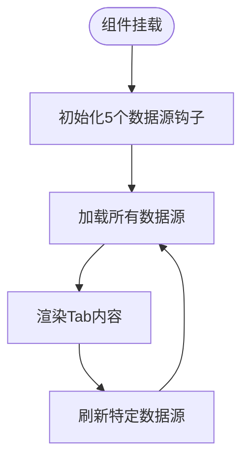

**图表来源**
- [frontend/src/pages/SectorPage.tsx:28-34](file://frontend/src/pages/SectorPage.tsx#L28-L34)
- [frontend/src/pages/SectorPage.tsx:132-143](file://frontend/src/pages/SectorPage.tsx#L132-L143)

**章节来源**
- [frontend/src/pages/SectorPage.tsx:19-468](file://frontend/src/pages/SectorPage.tsx#L19-L468)
- [frontend/src/hooks/useDataSource.ts:82-168](file://frontend/src/hooks/useDataSource.ts#L82-L168)

### SentimentPage 组件
职责与实现要点：
- 信息流整合：整合AI重点新闻、财经资讯、公司公告、研报观点四个信息源。
- 时间处理：提供parsePublishTimeMs与formatPublishTime函数处理多种时间格式。
- 数据源管理：使用useDataSource钩子管理hithink_news、announcements、reports、basicinfo、business、shareholders六个数据源。
- Tab组织：使用Ant Design Tabs组织信息流与公司资料两个主要区域。
- 公司资料：展示公司概况、主营业务构成、股东信息等详细数据。

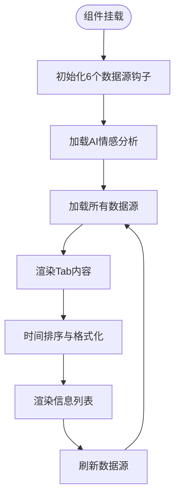

**图表来源**
- [frontend/src/pages/SentimentPage.tsx:79-86](file://frontend/src/pages/SentimentPage.tsx#L79-L86)
- [frontend/src/pages/SentimentPage.tsx:171-208](file://frontend/src/pages/SentimentPage.tsx#L171-L208)

**章节来源**
- [frontend/src/pages/SentimentPage.tsx:70-464](file://frontend/src/pages/SentimentPage.tsx#L70-L464)
- [frontend/src/hooks/useDataSource.ts:82-168](file://frontend/src/hooks/useDataSource.ts#L82-L168)

## 依赖关系分析
- 组件依赖：App.tsx作为根组件，注册路由与主题；MainLayout承载七类页面；各页面依赖API服务、类型定义、Agent缓存上下文与数据源钩子。
- 外部依赖：Ant Design、@ant-design/icons、axios、dayjs、react-router-dom、echarts-for-react。
- 构建与代理：Vite插件react，开发服务器端口5173，代理/api到后端8000端口。
- 类型约束：所有组件props与状态均基于types/index.ts中的接口定义，保证前后端契约一致。
- 新增依赖：AgentCacheContext提供缓存管理，useDataSource提供数据源管理，constants提供指标解释配置。

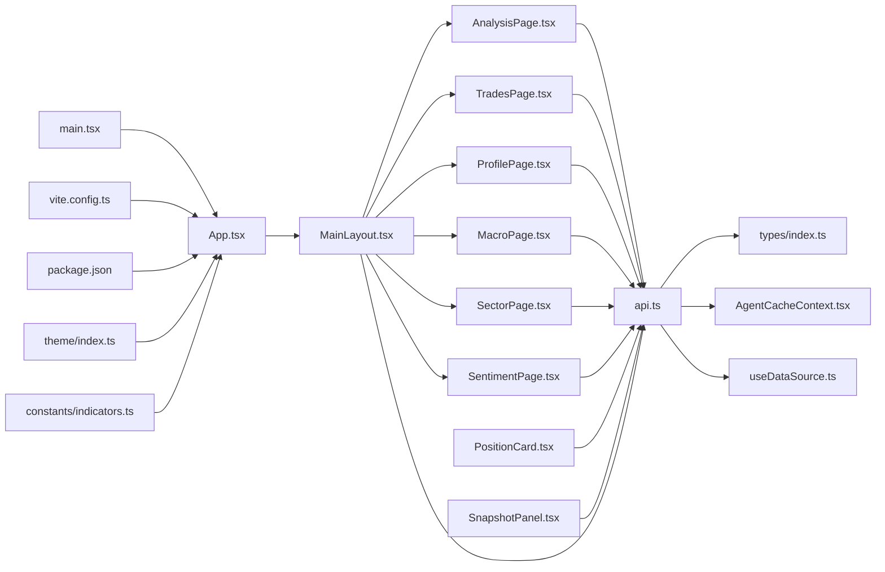

**图表来源**
- [frontend/src/App.tsx:1-39](file://frontend/src/App.tsx#L1-L39)
- [frontend/src/main.tsx:1-10](file://frontend/src/main.tsx#L1-L10)
- [frontend/src/components/MainLayout.tsx:1-380](file://frontend/src/components/MainLayout.tsx#L1-L380)
- [frontend/src/components/PositionCard.tsx:1-312](file://frontend/src/components/PositionCard.tsx#L1-L312)
- [frontend/src/components/SnapshotPanel.tsx:1-436](file://frontend/src/components/SnapshotPanel.tsx#L1-L436)
- [frontend/src/pages/AnalysisPage.tsx:1-213](file://frontend/src/pages/AnalysisPage.tsx#L1-L213)
- [frontend/src/pages/MacroPage.tsx:1-256](file://frontend/src/pages/MacroPage.tsx#L1-L256)
- [frontend/src/pages/SectorPage.tsx:1-468](file://frontend/src/pages/SectorPage.tsx#L1-L468)
- [frontend/src/pages/SentimentPage.tsx:1-464](file://frontend/src/pages/SentimentPage.tsx#L1-L464)
- [frontend/src/pages/TradesPage.tsx:1-481](file://frontend/src/pages/TradesPage.tsx#L1-L481)
- [frontend/src/pages/ProfilePage.tsx:1-173](file://frontend/src/pages/ProfilePage.tsx#L1-L173)
- [frontend/src/services/api.ts:1-188](file://frontend/src/services/api.ts#L1-L188)
- [frontend/src/types/index.ts:1-174](file://frontend/src/types/index.ts#L1-L174)
- [frontend/src/contexts/AgentCacheContext.tsx:1-139](file://frontend/src/contexts/AgentCacheContext.tsx#L1-L139)
- [frontend/src/hooks/useDataSource.ts:1-169](file://frontend/src/hooks/useDataSource.ts#L1-L169)
- [frontend/src/constants/indicators.ts:1-116](file://frontend/src/constants/indicators.ts#L1-L116)
- [frontend/src/theme/index.ts:1-116](file://frontend/src/theme/index.ts#L1-L116)
- [frontend/vite.config.ts:1-16](file://frontend/vite.config.ts#L1-L16)
- [frontend/package.json:1-30](file://frontend/package.json#L1-L30)

**章节来源**
- [frontend/src/App.tsx:1-39](file://frontend/src/App.tsx#L1-L39)
- [frontend/src/services/api.ts:1-188](file://frontend/src/services/api.ts#L1-L188)
- [frontend/src/types/index.ts:1-174](file://frontend/src/types/index.ts#L1-L174)
- [frontend/src/contexts/AgentCacheContext.tsx:1-139](file://frontend/src/contexts/AgentCacheContext.tsx#L1-L139)
- [frontend/src/hooks/useDataSource.ts:1-169](file://frontend/src/hooks/useDataSource.ts#L1-L169)
- [frontend/src/constants/indicators.ts:1-116](file://frontend/src/constants/indicators.ts#L1-L116)
- [frontend/src/theme/index.ts:1-116](file://frontend/src/theme/index.ts#L1-L116)
- [frontend/vite.config.ts:1-16](file://frontend/vite.config.ts#L1-L16)
- [frontend/package.json:1-30](file://frontend/package.json#L1-L30)

## 性能考量
- 图表渲染：AnalysisPage的ECharts配置包含多个series与grid，建议在数据量较大时启用dataZoom与平滑曲线的条件渲染，避免不必要的重绘。
- 列表加载：TradesPage表格分页pageSize=20，配合后端分页可减少一次性传输；建议在高频筛选场景增加防抖。
- 搜索优化：MainLayout的搜索接口应考虑关键词长度阈值与去抖，避免频繁网络请求。
- 状态粒度：将关注股票与时间框架拆分为独立状态，减少不必要的重渲染；对复杂表单使用Form.useForm的懒初始化。
- 缓存策略：AgentCacheContext提供前端内存缓存，避免重复调用Agent接口；useDataSource提供独立数据源缓存，支持缓存失效与批量淘汰。
- 并行数据源：SectorPage和SentimentPage同时管理多个数据源，建议合理设置并发限制与错误处理。
- 组件优化：PositionCard的实时计算应在价格变化时触发，避免每次渲染都重新计算。
- **批量操作优化**：TradesPage的批量删除操作应避免频繁的API调用，建议合并操作并在用户完成选择后再执行。

## 故障排查指南
- 路由与上下文
  - 现象：页面空白或提示"请先搜索并关注"
  - 排查：确认MainLayout是否正确传递context；检查focus是否为空；确认路由路径与菜单项一致。
- API请求
  - 现象：加载失败或空数据
  - 排查：检查/vite.config.ts中的代理配置是否指向正确的后端地址；确认后端接口返回格式与types定义一致。
- 表单与校验
  - 现象：新增/更新失败或无提示
  - 排查：确认Form字段规则与必填项；检查create/update/delete接口返回；查看message提示。
- 图表异常
  - 现象：图表不显示或渲染错误
  - 排查：检查klineOption配置与数据结构；确认dates与ohlc数组长度一致；验证ECharts版本兼容性。
- Agent缓存
  - 现象：Agent数据不更新或显示过期
  - 排查：确认AgentCacheContext的缓存有效性；检查invalidateStock调用；验证缓存时间边界。
- 数据源问题
  - 现象：独立数据源加载失败或显示错误
  - 排查：检查useDataSource钩子的状态管理；确认数据源类型与stockCode匹配；验证内存缓存有效性。
- 新增组件
  - 现象：PositionCard无法添加或编辑持仓
  - 排查：检查API接口调用；确认表单字段验证；验证实时计算逻辑。
  - 现象：SnapshotPanel不显示历史记录
  - 排查：确认Agent类型与stockCode参数；检查日期列表加载；验证详情渲染。
- **批量操作问题**
  - 现象：批量删除无效或按钮无法点击
  - 排查：确认selectedRowKeys状态是否正确更新；检查rowSelection配置；验证handleBatchDelete函数逻辑。
  - 现象：批量导入失败或无响应
  - 排查：检查文件格式支持；确认FormData构建；验证后端导入接口。
  - 现象：批量删除后持仓未正确调整
  - 排查：确认后端批量删除接口的实时交易反向调整逻辑；检查返回的realtime_adjusted计数。

**章节来源**
- [frontend/src/App.tsx:15-36](file://frontend/src/App.tsx#L15-L36)
- [frontend/src/components/MainLayout.tsx:52-380](file://frontend/src/components/MainLayout.tsx#L52-L380)
- [frontend/src/pages/AnalysisPage.tsx:28-213](file://frontend/src/pages/AnalysisPage.tsx#L28-L213)
- [frontend/src/pages/TradesPage.tsx:28-481](file://frontend/src/pages/TradesPage.tsx#L28-L481)
- [frontend/src/contexts/AgentCacheContext.tsx:78-132](file://frontend/src/contexts/AgentCacheContext.tsx#L78-L132)
- [frontend/src/hooks/useDataSource.ts:82-168](file://frontend/src/hooks/useDataSource.ts#L82-L168)

## 结论
Stock Foker前端采用清晰的分层架构：布局组件负责导航与上下文传递，页面组件聚焦业务功能与数据可视化，API服务统一抽象HTTP请求，类型系统保障契约一致性。新增的PositionCard、SnapshotPanel以及MacroPage、SectorPage、SentimentPage等组件进一步丰富了应用的功能矩阵，通过Agent缓存与数据源钩子实现了高效的数据管理。通过Ant Design与ECharts的组合，实现了从K线分析到交易画像再到多维度市场分析的全链路体验。

**更新** TradesPage组件的批量操作功能显著提升了用户体验，包括Ant Design行选择、动态按钮状态管理和批量删除确认流程，使用户能够更高效地管理大量交易记录。新增的批量导入功能也简化了数据迁移和备份工作。建议在性能与可用性方面持续优化，完善错误处理与用户反馈，进一步提升交互效率与稳定性。

## 附录
- 使用示例与最佳实践
  - 在AnalysisPage中切换周期时，建议将period变更与URL查询参数同步，便于分享链接与回溯。
  - TradesPage的新增表单应默认填充focus中的stock_code与stock_name，减少重复输入。
  - **批量操作最佳实践**：在TradesPage中，建议先勾选需要删除的记录，然后点击批量删除按钮；对于包含实时交易的批量删除，系统会自动反向调整持仓，无需用户额外操作。
  - ProfilePage在无数据时提供引导性文案，鼓励用户先添加交易记录。
  - PositionCard的实时计算应结合价格更新频率，避免过于频繁的重计算。
  - SnapshotPanel的Agent类型选择应与用户分析需求匹配，提供清晰的类型标签。
  - MacroPage、SectorPage、SentimentPage应合理设置数据源刷新策略，平衡数据新鲜度与性能。
  - Agent缓存应定期清理过期数据，避免内存占用过大。
  - 全局主题可通过ConfigProvider的theme.token进行扩展，保持品牌一致性。
- 开发与部署
  - 开发：npm run dev启动Vite开发服务器，默认端口5173；代理/api到后端8000。
  - 构建：npm run build生成生产包；TypeScript编译与Vite打包并行执行。
  - 新增组件：遵循现有组件模式，提供完整的类型定义与错误处理。
  - 数据源：使用useDataSource钩子管理独立数据源，确保缓存与刷新机制正确。
  - 缓存：合理设置Agent缓存与数据源缓存的有效期，提供缓存失效接口。
  - **批量操作开发**：在实现类似批量功能时，建议使用rowSelection状态管理选中项，结合Modal确认框提供明确的操作反馈。

**章节来源**
- [frontend/src/App.tsx:15-36](file://frontend/src/App.tsx#L15-L36)
- [frontend/vite.config.ts:4-15](file://frontend/vite.config.ts#L4-L15)
- [frontend/package.json:6-10](file://frontend/package.json#L6-L10)
- [frontend/src/contexts/AgentCacheContext.tsx:78-132](file://frontend/src/contexts/AgentCacheContext.tsx#L78-L132)
- [frontend/src/hooks/useDataSource.ts:82-168](file://frontend/src/hooks/useDataSource.ts#L82-L168)
- [frontend/src/pages/TradesPage.tsx:362-367](file://frontend/src/pages/TradesPage.tsx#L362-L367)
- [frontend/src/pages/TradesPage.tsx:312-324](file://frontend/src/pages/TradesPage.tsx#L312-L324)