# 布局组件

<cite>
**本文档引用的文件**
- [MainLayout.tsx](file://frontend/src/components/MainLayout.tsx)
- [App.tsx](file://frontend/src/App.tsx)
- [main.tsx](file://frontend/src/main.tsx)
- [api.ts](file://frontend/src/services/api.ts)
- [index.ts](file://frontend/src/types/index.ts)
- [AnalysisPage.tsx](file://frontend/src/pages/AnalysisPage.tsx)
- [TradesPage.tsx](file://frontend/src/pages/TradesPage.tsx)
- [ProfilePage.tsx](file://frontend/src/pages/ProfilePage.tsx)
- [package.json](file://frontend/package.json)
- [index.ts](file://frontend/src/theme/index.ts)
</cite>

## 更新摘要
**变更内容**
- 新增Watchlist侧边栏功能，提供股票关注列表管理
- 增强搜索功能，支持搜索结果确认和关注操作
- 更新组件状态管理，增加watchlist状态
- 新增关注列表切换和股票切换功能
- 改进用户交互体验，支持快速切换关注股票

## 目录
1. [简介](#简介)
2. [项目结构](#项目结构)
3. [核心组件](#核心组件)
4. [架构概览](#架构概览)
5. [详细组件分析](#详细组件分析)
6. [Watchlist侧边栏功能](#watchlist侧边栏功能)
7. [依赖关系分析](#依赖关系分析)
8. [性能考虑](#性能考虑)
9. [故障排除指南](#故障排除指南)
10. [结论](#结论)

## 简介

Stock Foker是一个基于React和Ant Design开发的股票分析应用。本项目的核心是MainLayout主布局组件，它提供了统一的应用界面结构，包括侧边栏导航菜单、顶部搜索区域和主要内容区域。该布局组件采用现代化的响应式设计，支持股票搜索、时间框架切换、多页面导航和Watchlist关注列表管理功能。

## 项目结构

前端项目采用模块化架构，主要文件组织如下：

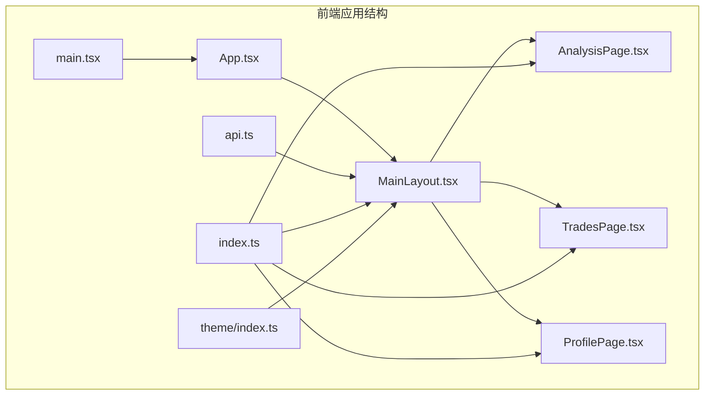

**图表来源**
- [main.tsx:1-10](file://frontend/src/main.tsx#L1-L10)
- [App.tsx:1-27](file://frontend/src/App.tsx#L1-L27)
- [MainLayout.tsx:1-426](file://frontend/src/components/MainLayout.tsx#L1-L426)

**章节来源**
- [main.tsx:1-10](file://frontend/src/main.tsx#L1-L10)
- [App.tsx:1-27](file://frontend/src/App.tsx#L1-L27)
- [package.json:1-30](file://frontend/package.json#L1-L30)

## 核心组件

### MainLayout主布局组件

MainLayout是应用的核心布局组件，负责管理整个应用的界面结构和状态。它集成了Ant Design的布局系统，提供了完整的用户界面框架。

#### 主要特性

1. **响应式布局**：使用Ant Design的Layout组件实现灵活的布局结构
2. **状态管理**：管理股票关注状态、搜索选项状态和Watchlist关注列表
3. **导航控制**：集成路由导航和侧边栏菜单
4. **实时搜索**：提供智能股票搜索功能
5. **时间框架管理**：支持短期、中期、长期三种分析周期
6. **Watchlist管理**：提供股票关注列表的展示和管理功能

#### 组件状态

组件维护三个核心状态：
- `focus`: 当前关注的股票信息，包含股票代码、名称和时间框架
- `watchlist`: 关注的股票列表，用于侧边栏展示
- `searchOptions`: 搜索结果选项列表

**章节来源**
- [MainLayout.tsx:52-85](file://frontend/src/components/MainLayout.tsx#L52-L85)

## 架构概览

应用采用分层架构设计，从底层到顶层的结构如下：

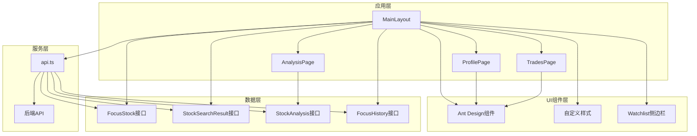

**图表来源**
- [MainLayout.tsx:1-426](file://frontend/src/components/MainLayout.tsx#L1-L426)
- [api.ts:1-191](file://frontend/src/services/api.ts#L1-L191)
- [index.ts:1-174](file://frontend/src/types/index.ts#L1-L174)

## 详细组件分析

### MainLayout组件架构

MainLayout组件采用了现代React Hooks模式，结合Ant Design的UI组件库，实现了高度可复用的布局解决方案。

#### 组件结构图

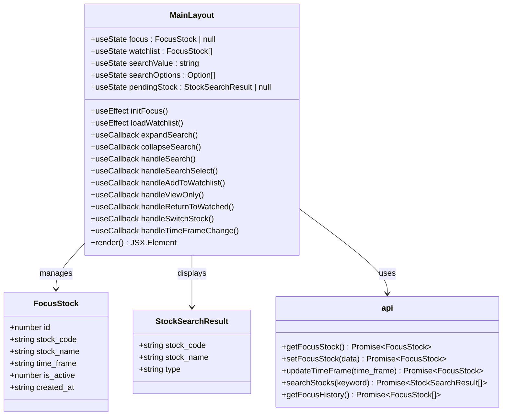

**图表来源**
- [MainLayout.tsx:52-209](file://frontend/src/components/MainLayout.tsx#L52-L209)
- [index.ts:1-14](file://frontend/src/types/index.ts#L1-L14)
- [api.ts:24-37](file://frontend/src/services/api.ts#L24-L37)

#### 状态管理机制

组件使用React的useState和useEffect Hook来管理状态：

1. **初始化状态**：在组件挂载时获取当前关注的股票信息和加载Watchlist
2. **搜索状态**：维护搜索结果的下拉选项和搜索值状态
3. **待确认状态**：处理用户搜索后但未确认的关注股票
4. **异步状态**：处理API调用的加载状态

#### 事件处理流程

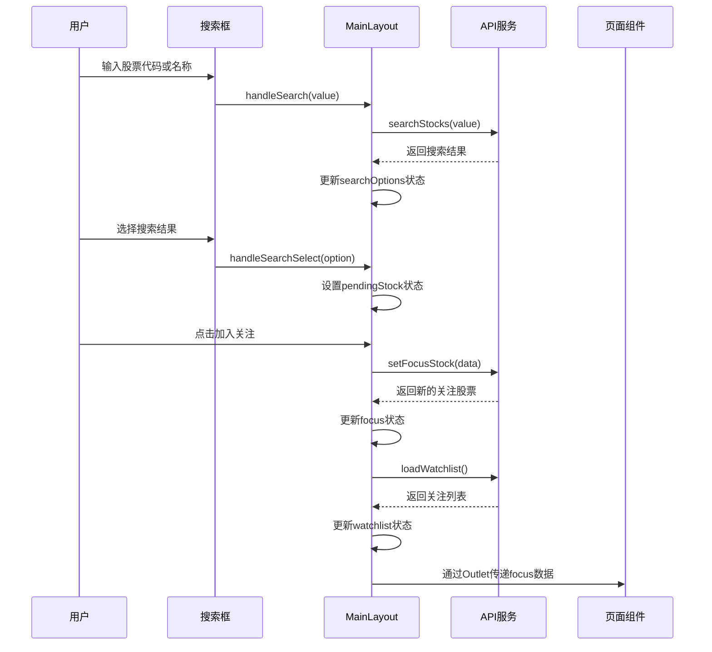

**图表来源**
- [MainLayout.tsx:100-159](file://frontend/src/components/MainLayout.tsx#L100-L159)
- [api.ts:27-37](file://frontend/src/services/api.ts#L27-L37)

#### 数据流分析

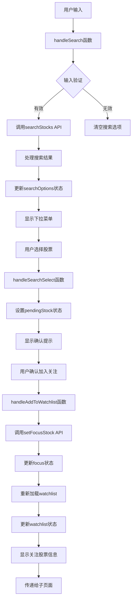

**图表来源**
- [MainLayout.tsx:100-159](file://frontend/src/components/MainLayout.tsx#L100-L159)
- [api.ts:27-31](file://frontend/src/services/api.ts#L27-L31)

**章节来源**
- [MainLayout.tsx:1-426](file://frontend/src/components/MainLayout.tsx#L1-L426)

### Ant Design布局组件使用

MainLayout充分利用了Ant Design提供的布局组件，实现了专业的用户界面设计。

#### 布局组件层次结构

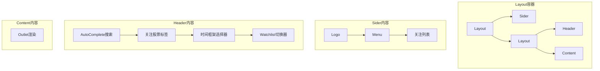

**图表来源**
- [MainLayout.tsx:212-424](file://frontend/src/components/MainLayout.tsx#L212-L424)

#### 自定义样式方案

组件采用了简洁而实用的样式设计：

1. **侧边栏宽度**：固定180px宽度，深色主题设计
2. **头部样式**：白色背景，带底部边框，支持响应式布局
3. **内容区域**：圆角边框，浅色背景，适配深色主题
4. **Watchlist样式**：悬停效果，激活状态高亮显示
5. **响应式设计**：适配不同屏幕尺寸

**章节来源**
- [MainLayout.tsx:212-424](file://frontend/src/components/MainLayout.tsx#L212-L424)

### 组件间数据传递模式

应用采用多种数据传递模式确保组件间的松耦合和高内聚：

#### 上下文共享机制

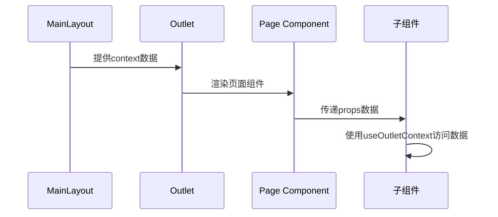

**图表来源**
- [MainLayout.tsx:420](file://frontend/src/components/MainLayout.tsx#L420)
- [AnalysisPage.tsx:62](file://frontend/src/pages/AnalysisPage.tsx#L62)

#### API服务集成

组件通过专门的API服务模块进行数据交互：

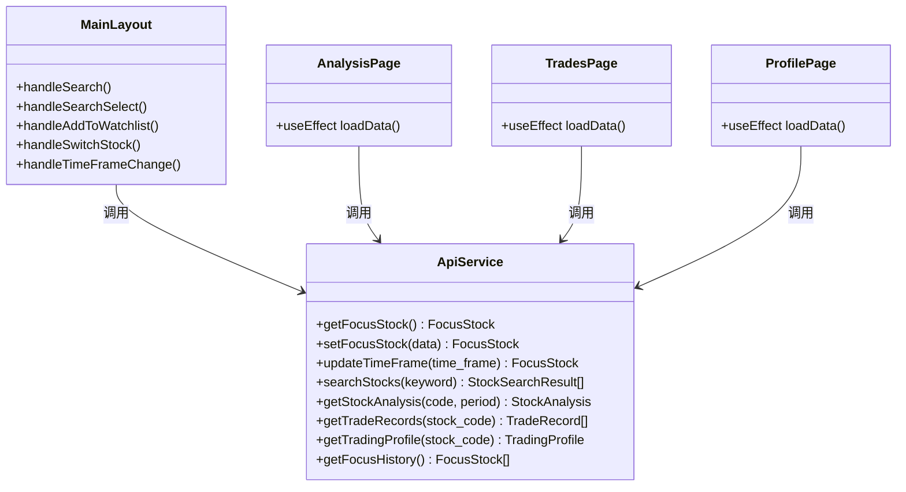

**图表来源**
- [api.ts:1-191](file://frontend/src/services/api.ts#L1-L191)
- [MainLayout.tsx:100-209](file://frontend/src/components/MainLayout.tsx#L100-L209)

**章节来源**
- [api.ts:1-191](file://frontend/src/services/api.ts#L1-L191)

## Watchlist侧边栏功能

### 功能概述

Watchlist侧边栏是MainLayout组件的重要增强功能，提供了股票关注列表的集中管理。该功能允许用户快速查看和切换关注的股票，提升用户体验和操作效率。

### 核心功能

1. **关注列表展示**：在侧边栏顶部显示所有关注的股票
2. **实时状态高亮**：当前正在分析的股票会高亮显示
3. **快速切换**：点击任意关注股票即可快速切换
4. **滚动浏览**：支持大量关注股票的滚动浏览
5. **激活状态指示**：通过边框和颜色区分激活状态

### 技术实现

#### Watchlist数据加载

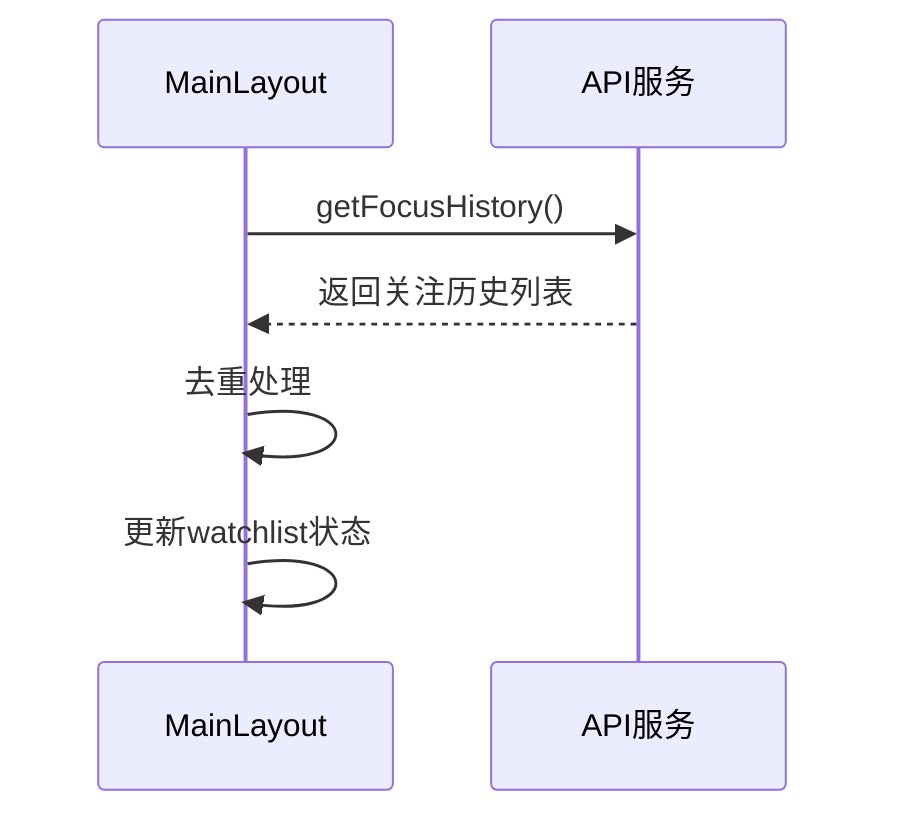

**图表来源**
- [MainLayout.tsx:65-78](file://frontend/src/components/MainLayout.tsx#L65-L78)
- [api.ts:36](file://frontend/src/services/api.ts#L36)

#### Watchlist渲染逻辑

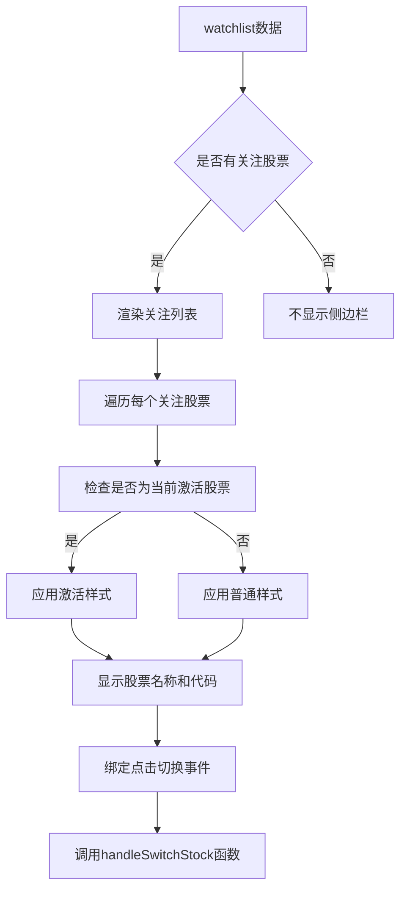

**图表来源**
- [MainLayout.tsx:225-269](file://frontend/src/components/MainLayout.tsx#L225-L269)

### 用户交互流程

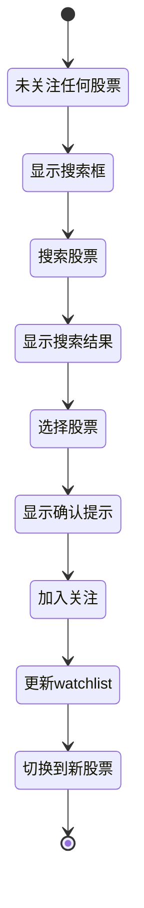

**图表来源**
- [MainLayout.tsx:119-159](file://frontend/src/components/MainLayout.tsx#L119-L159)

**章节来源**
- [MainLayout.tsx:65-269](file://frontend/src/components/MainLayout.tsx#L65-L269)

## 依赖关系分析

### 外部依赖

应用的主要外部依赖包括：

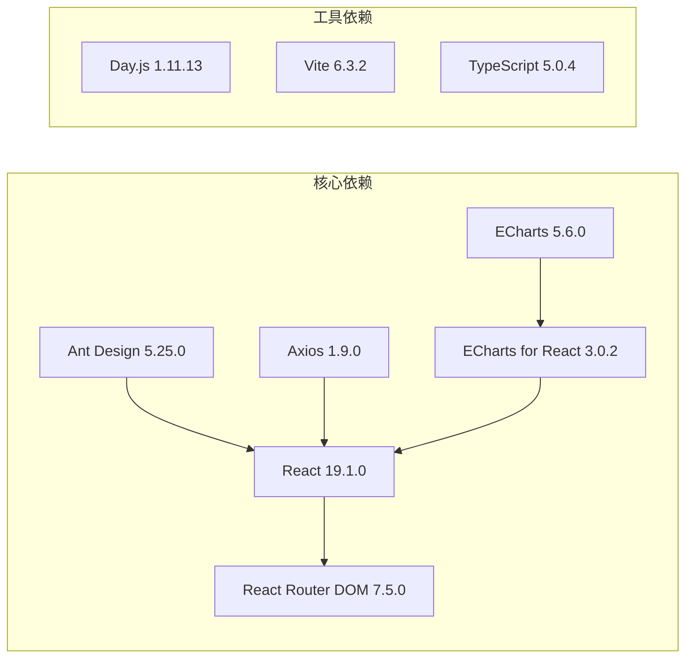

**图表来源**
- [package.json:11-28](file://frontend/package.json#L11-L28)

### 内部依赖关系

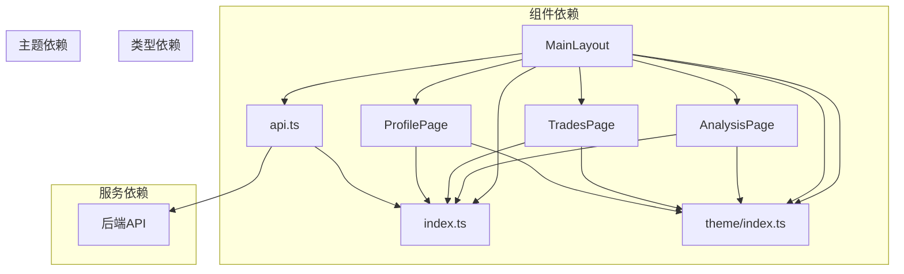

**图表来源**
- [MainLayout.tsx:28-37](file://frontend/src/components/MainLayout.tsx#L28-L37)
- [AnalysisPage.tsx:22-28](file://frontend/src/pages/AnalysisPage.tsx#L22-L28)
- [TradesPage.tsx:29-31](file://frontend/src/pages/TradesPage.tsx#L29-L31)
- [ProfilePage.tsx:21-23](file://frontend/src/pages/ProfilePage.tsx#L21-L23)

**章节来源**
- [package.json:1-30](file://frontend/package.json#L1-L30)

## 性能考虑

### 状态优化

1. **状态分离**：将关注状态、Watchlist状态和搜索状态分离，避免不必要的重渲染
2. **回调缓存**：使用useCallback缓存事件处理函数
3. **条件渲染**：根据状态条件渲染不同的UI元素
4. **去重处理**：Watchlist加载时自动去重，避免重复显示

### API调用优化

1. **防抖处理**：搜索功能自动防抖，减少API调用频率
2. **错误处理**：完善的错误处理机制，提升用户体验
3. **加载状态**：为每个异步操作提供明确的加载状态
4. **缓存策略**：Watchlist数据加载时进行去重处理

### 内存管理

1. **清理函数**：在useEffect中返回清理函数，防止内存泄漏
2. **依赖数组**：合理设置依赖数组，避免无限循环
3. **状态重置**：搜索框折叠时重置相关状态

## 故障排除指南

### 常见问题及解决方案

#### Watchlist显示异常

**问题描述**：Watchlist侧边栏不显示或显示异常
**可能原因**：
- API服务不可用
- 网络连接问题
- Watchlist数据格式错误

**解决步骤**：
1. 检查网络连接状态
2. 验证API服务是否正常运行
3. 确认getFocusHistory接口返回数据格式正确

#### 搜索功能异常

**问题描述**：搜索框无法显示搜索结果
**可能原因**：
- API服务不可用
- 网络连接问题
- 输入参数格式错误

**解决步骤**：
1. 检查网络连接状态
2. 验证API服务是否正常运行
3. 确认输入参数格式正确

#### 时间框架切换失败

**问题描述**：时间框架切换后状态未更新
**可能原因**：
- API调用失败
- 状态更新逻辑错误
- 组件重新渲染问题

**解决步骤**：
1. 检查API响应数据
2. 验证状态更新逻辑
3. 确认组件重新渲染

#### 导航菜单不响应

**问题描述**：点击侧边栏菜单无反应
**可能原因**：
- 路由配置错误
- 导航函数未正确绑定
- 路由参数问题

**解决步骤**：
1. 检查路由配置
2. 验证导航函数绑定
3. 确认路由参数正确

#### 股票切换功能异常

**问题描述**：点击Watchlist中的股票无法切换
**可能原因**：
- handleSwitchStock函数逻辑错误
- API调用失败
- 状态更新问题

**解决步骤**：
1. 检查handleSwitchStock函数实现
2. 验证setFocusStock API调用
3. 确认状态更新逻辑

**章节来源**
- [MainLayout.tsx:100-209](file://frontend/src/components/MainLayout.tsx#L100-L209)

## 结论

Stock Foker的MainLayout主布局组件展现了现代React应用的最佳实践。通过合理使用Ant Design组件库、精心设计的状态管理和清晰的组件间通信机制，构建了一个功能完整、用户体验优秀的股票分析平台。

该布局组件的主要优势包括：

1. **模块化设计**：清晰的组件职责划分
2. **状态管理**：高效的React Hooks使用
3. **Watchlist功能**：新增的关注列表管理功能提升了用户体验
4. **响应式设计**：流畅的交互和适应不同屏幕尺寸
5. **可扩展性**：良好的架构便于功能扩展
6. **代码质量**：类型安全和错误处理机制

通过本文档的详细分析，开发者可以深入理解MainLayout组件的设计理念和实现细节，特别是新增的Watchlist侧边栏功能，为后续的功能扩展和维护工作提供坚实的基础。