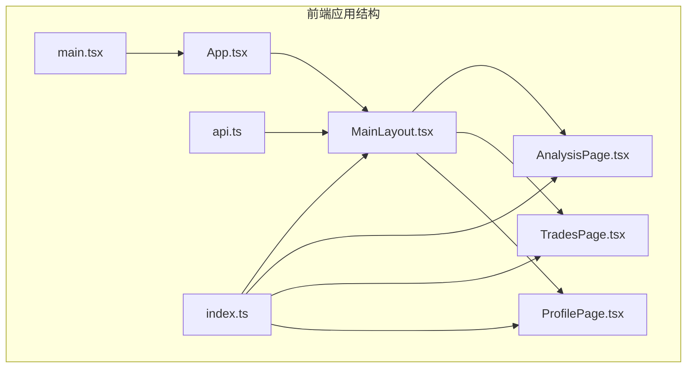
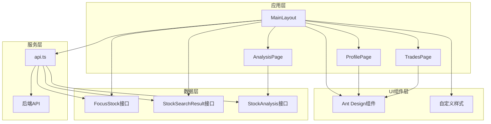
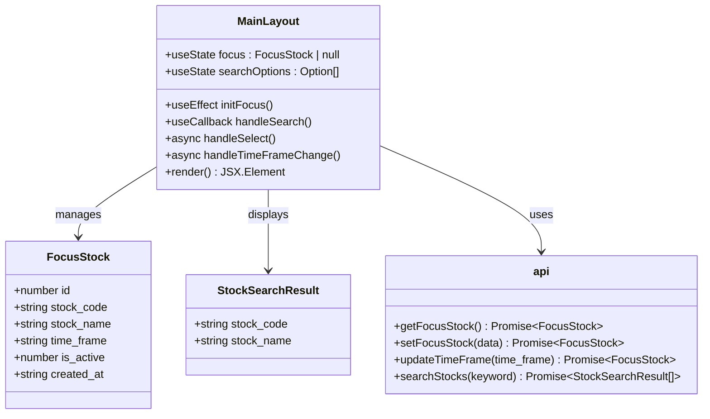
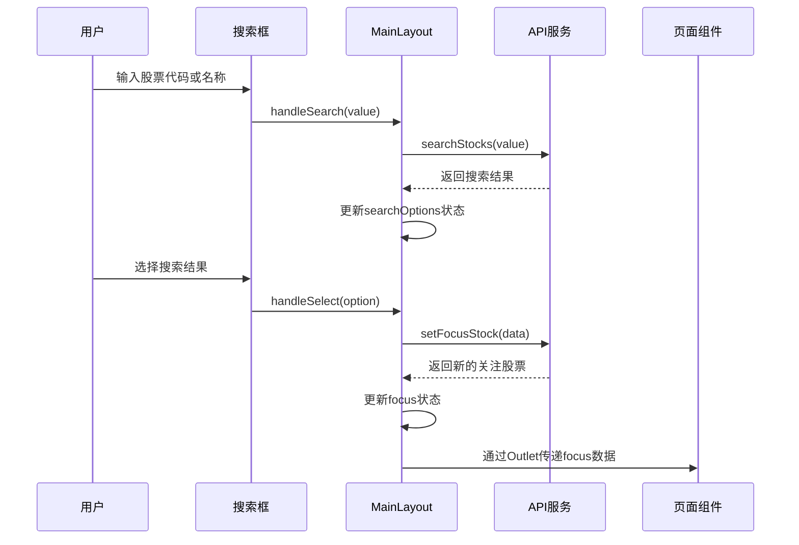
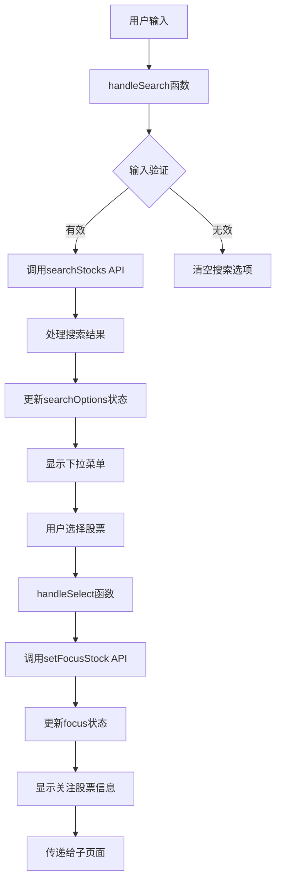
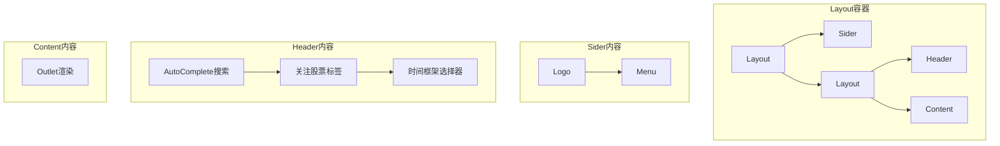
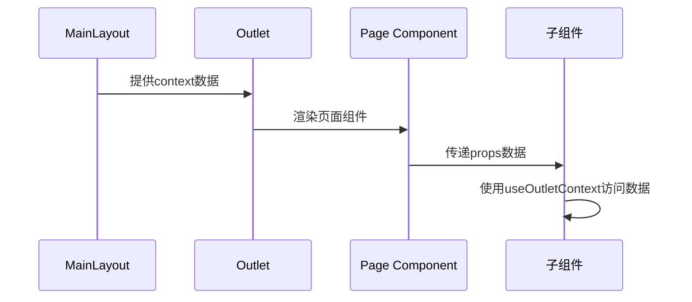
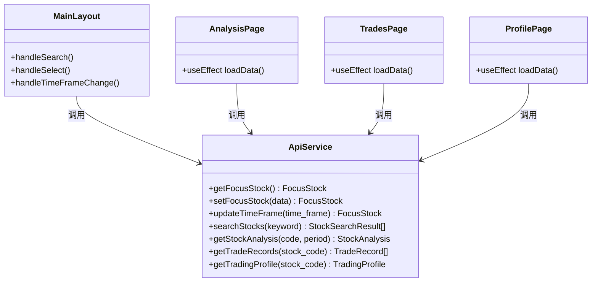
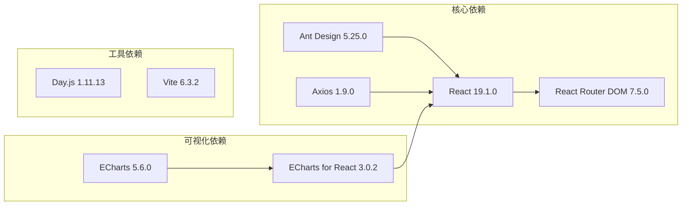
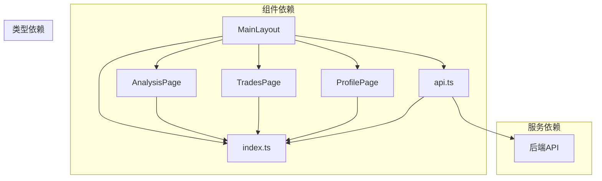

# 布局组件

<cite>
**本文档引用的文件**

- [MainLayout.tsx](file://frontend/src/components/MainLayout.tsx)

- [App.tsx](file://frontend/src/App.tsx)

- [main.tsx](file://frontend/src/main.tsx)

- [api.ts](file://frontend/src/services/api.ts)

- [index.ts](file://frontend/src/types/index.ts)

- [AnalysisPage.tsx](file://frontend/src/pages/AnalysisPage.tsx)

- [TradesPage.tsx](file://frontend/src/pages/TradesPage.tsx)

- [ProfilePage.tsx](file://frontend/src/pages/ProfilePage.tsx)

- [package.json](file://frontend/package.json)
</cite>

## 目录
1. [简介](#简介)

2. [项目结构](#项目结构)

3. [核心组件](#核心组件)

4. [架构概览](#架构概览)

5. [详细组件分析](#详细组件分析)

6. [依赖关系分析](#依赖关系分析)

7. [性能考虑](#性能考虑)

8. [故障排除指南](#故障排除指南)

9. [结论](#结论)

## 简介

Stock Foker是一个基于React和Ant Design开发的股票分析应用。本项目的核心是MainLayout主布局组件，它提供了统一的应用界面结构，包括侧边栏导航菜单、顶部搜索区域和主要内容区域。该布局组件采用现代化的响应式设计，支持股票搜索、时间框架切换和多页面导航功能。

## 项目结构

前端项目采用模块化架构，主要文件组织如下：

**图表来源**

- [main.tsx:1-10](file://frontend/src/main.tsx#L1-L10)

- [App.tsx:1-27](file://frontend/src/App.tsx#L1-L27)

- [MainLayout.tsx:1-159](file://frontend/src/components/MainLayout.tsx#L1-L159)

**章节来源**

- [main.tsx:1-10](file://frontend/src/main.tsx#L1-L10)

- [App.tsx:1-27](file://frontend/src/App.tsx#L1-L27)

- [package.json:1-30](file://frontend/package.json#L1-L30)

## 核心组件

### MainLayout主布局组件

MainLayout是应用的核心布局组件，负责管理整个应用的界面结构和状态。它集成了Ant Design的布局系统，提供了完整的用户界面框架。

#### 主要特性

1. **响应式布局**：使用Ant Design的Layout组件实现灵活的布局结构

2. **状态管理**：管理股票关注状态和搜索选项状态

3. **导航控制**：集成路由导航和侧边栏菜单

4. **实时搜索**：提供智能股票搜索功能

5. **时间框架管理**：支持短期、中期、长期三种分析周期

#### 组件状态

组件维护两个核心状态：

- `focus`: 当前关注的股票信息，包含股票代码、名称和时间框架

- `searchOptions`: 搜索结果选项列表

**章节来源**

- [MainLayout.tsx:43-159](file://frontend/src/components/MainLayout.tsx#L43-L159)

## 架构概览

应用采用分层架构设计，从底层到顶层的结构如下：

**图表来源**

- [MainLayout.tsx:1-159](file://frontend/src/components/MainLayout.tsx#L1-L159)

- [api.ts:1-68](file://frontend/src/services/api.ts#L1-L68)

- [index.ts:1-94](file://frontend/src/types/index.ts#L1-L94)

## 详细组件分析

### MainLayout组件架构

MainLayout组件采用了现代React Hooks模式，结合Ant Design的UI组件库，实现了高度可复用的布局解决方案。

#### 组件结构图

**图表来源**

- [MainLayout.tsx:43-159](file://frontend/src/components/MainLayout.tsx#L43-L159)

- [index.ts:1-13](file://frontend/src/types/index.ts#L1-L13)

- [api.ts:14-31](file://frontend/src/services/api.ts#L14-L31)

#### 状态管理机制

组件使用React的useState和useEffect Hook来管理状态：

1. **初始化状态**：在组件挂载时获取当前关注的股票信息

2. **搜索状态**：维护搜索结果的下拉选项

3. **异步状态**：处理API调用的加载状态

#### 事件处理流程

**图表来源**

- [MainLayout.tsx:57-88](file://frontend/src/components/MainLayout.tsx#L57-L88)

- [api.ts:14-24](file://frontend/src/services/api.ts#L14-L24)

#### 数据流分析

**图表来源**

- [MainLayout.tsx:57-88](file://frontend/src/components/MainLayout.tsx#L57-L88)

- [api.ts:29-31](file://frontend/src/services/api.ts#L29-L31)

**章节来源**

- [MainLayout.tsx:1-159](file://frontend/src/components/MainLayout.tsx#L1-L159)

### Ant Design布局组件使用

MainLayout充分利用了Ant Design提供的布局组件，实现了专业的用户界面设计。

#### 布局组件层次结构

**图表来源**

- [MainLayout.tsx:99-157](file://frontend/src/components/MainLayout.tsx#L99-L157)

#### 自定义样式方案

组件采用了简洁而实用的样式设计：

1. **侧边栏宽度**：固定180px宽度

2. **头部样式**：白色背景，带底部边框

3. **内容区域**：圆角边框，浅色背景

4. **响应式设计**：适配不同屏幕尺寸

**章节来源**

- [MainLayout.tsx:100-157](file://frontend/src/components/MainLayout.tsx#L100-L157)

### 组件间数据传递模式

应用采用多种数据传递模式确保组件间的松耦合和高内聚：

#### 上下文共享机制

**图表来源**

- [MainLayout.tsx:153](file://frontend/src/components/MainLayout.tsx#L153)

- [AnalysisPage.tsx:29](file://frontend/src/pages/AnalysisPage.tsx#L29)

#### API服务集成

组件通过专门的API服务模块进行数据交互：

**图表来源**

- [api.ts:1-68](file://frontend/src/services/api.ts#L1-L68)

- [MainLayout.tsx:20-25](file://frontend/src/components/MainLayout.tsx#L20-L25)

**章节来源**

- [api.ts:1-68](file://frontend/src/services/api.ts#L1-L68)

## 依赖关系分析

### 外部依赖

应用的主要外部依赖包括：

**图表来源**

- [package.json:11-28](file://frontend/package.json#L11-L28)

### 内部依赖关系

**图表来源**

- [MainLayout.tsx:19-26](file://frontend/src/components/MainLayout.tsx#L19-L26)

- [AnalysisPage.tsx:17-18](file://frontend/src/pages/AnalysisPage.tsx#L17-L18)

- [TradesPage.tsx:25-26](file://frontend/src/pages/TradesPage.tsx#L25-L26)

- [ProfilePage.tsx:21-22](file://frontend/src/pages/ProfilePage.tsx#L21-L22)

**章节来源**

- [package.json:1-30](file://frontend/package.json#L1-L30)

## 性能考虑

### 状态优化

1. **状态分离**：将关注状态和搜索状态分离，避免不必要的重渲染

2. **回调缓存**：使用useCallback缓存事件处理函数

3. **条件渲染**：根据状态条件渲染不同的UI元素

### API调用优化

1. **防抖处理**：搜索功能自动防抖，减少API调用频率

2. **错误处理**：完善的错误处理机制，提升用户体验

3. **加载状态**：为每个异步操作提供明确的加载状态

### 内存管理

1. **清理函数**：在useEffect中返回清理函数，防止内存泄漏

2. **依赖数组**：合理设置依赖数组，避免无限循环

## 故障排除指南

### 常见问题及解决方案

#### 搜索功能异常

**问题描述**：搜索框无法显示搜索结果
**可能原因**：

- API服务不可用

- 网络连接问题

- 输入参数格式错误

**解决步骤**：

1. 检查网络连接状态

2. 验证API服务是否正常运行

3. 确认输入参数格式正确

#### 时间框架切换失败

**问题描述**：时间框架切换后状态未更新
**可能原因**：

- API调用失败

- 状态更新逻辑错误

- 组件重新渲染问题

**解决步骤**：

1. 检查API响应数据

2. 验证状态更新逻辑

3. 确认组件重新渲染

#### 导航菜单不响应

**问题描述**：点击侧边栏菜单无反应
**可能原因**：

- 路由配置错误

- 导航函数未正确绑定

- 路由参数问题

**解决步骤**：

1. 检查路由配置

2. 验证导航函数绑定

3. 确认路由参数正确

**章节来源**

- [MainLayout.tsx:57-97](file://frontend/src/components/MainLayout.tsx#L57-L97)

## 结论

Stock Foker的MainLayout主布局组件展现了现代React应用的最佳实践。通过合理使用Ant Design组件库、精心设计的状态管理和清晰的组件间通信机制，构建了一个功能完整、用户体验优秀的股票分析平台。

该布局组件的主要优势包括：

1. **模块化设计**：清晰的组件职责划分

2. **状态管理**：高效的React Hooks使用

3. **用户体验**：流畅的交互和响应式设计

4. **可扩展性**：良好的架构便于功能扩展

5. **代码质量**：类型安全和错误处理机制

通过本文档的详细分析，开发者可以深入理解MainLayout组件的设计理念和实现细节，为后续的功能扩展和维护工作提供坚实的基础。
