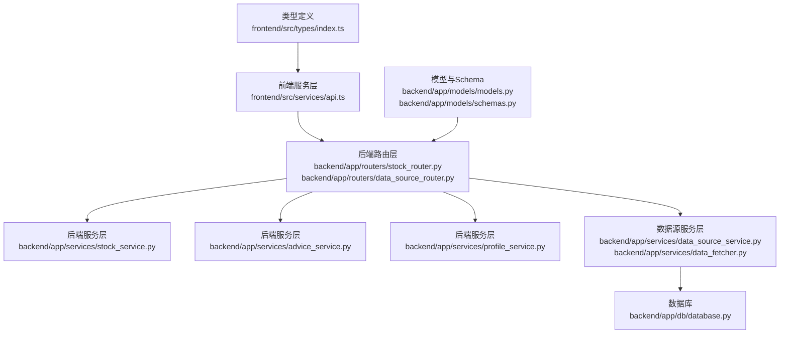
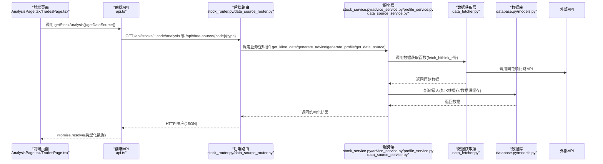
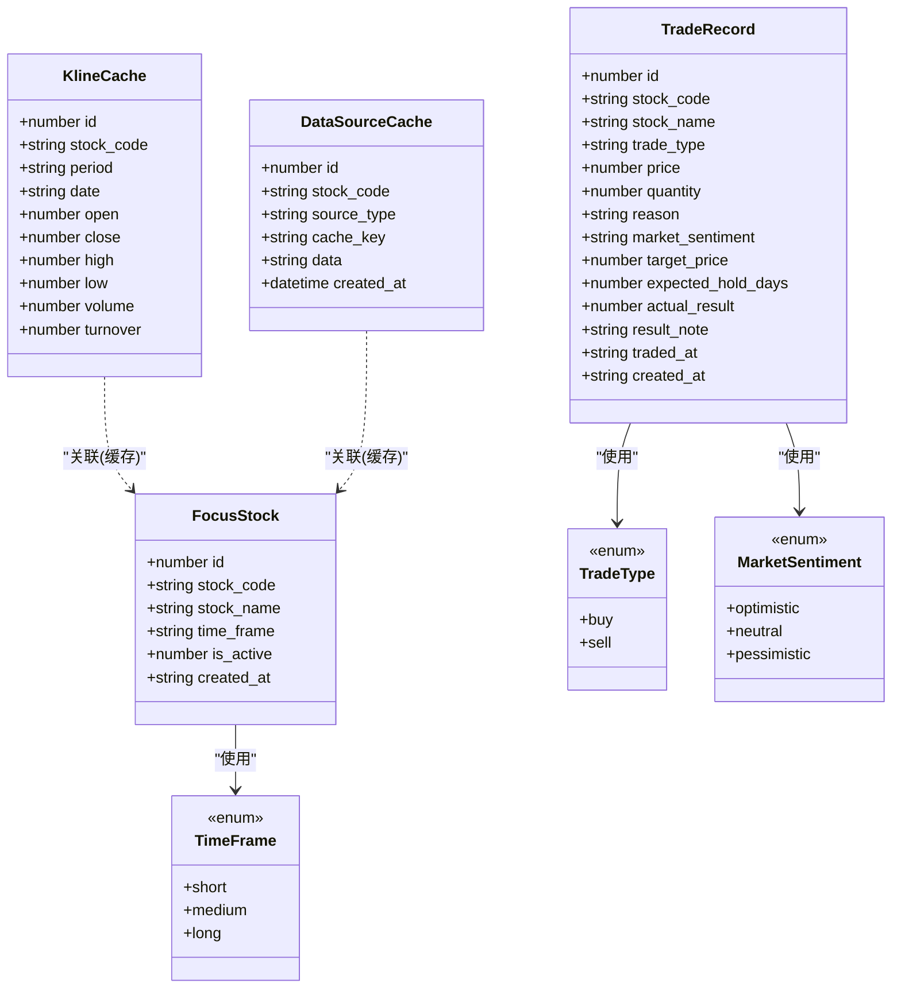
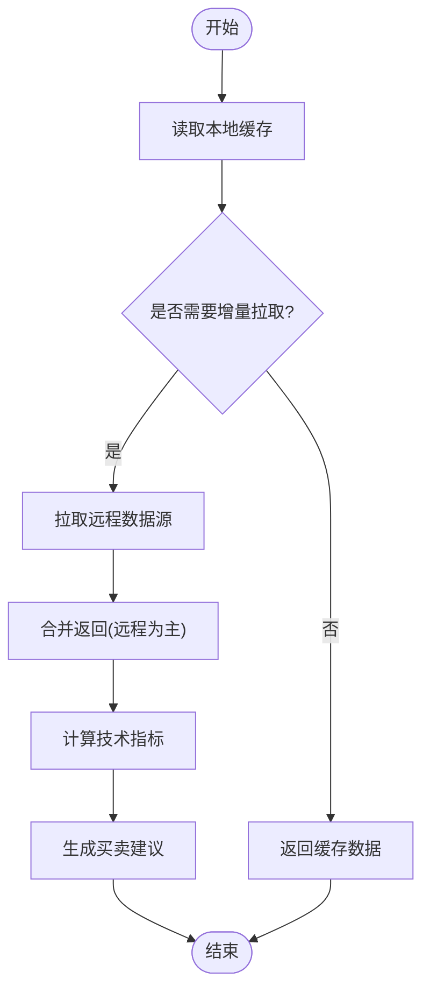
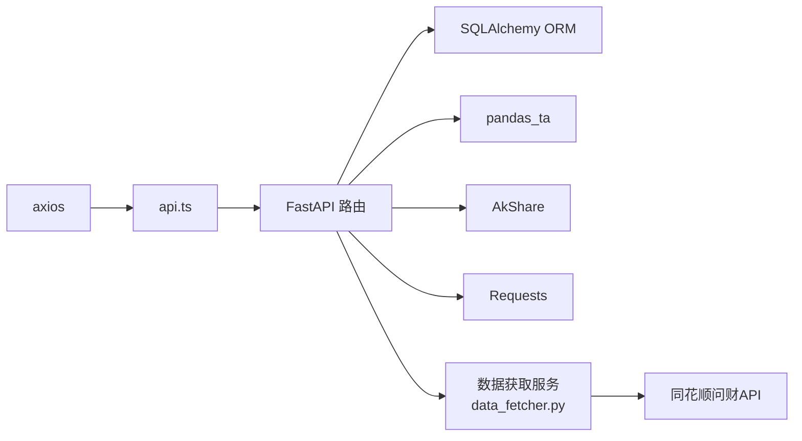

# 服务层

<cite>
**本文引用的文件**
- [api.ts](file://frontend/src/services/api.ts)
- [index.ts](file://frontend/src/types/index.ts)
- [main.py](file://backend/app/main.py)
- [stock_router.py](file://backend/app/routers/stock_router.py)
- [data_source_router.py](file://backend/app/routers/data_source_router.py)
- [schemas.py](file://backend/app/models/schemas.py)
- [models.py](file://backend/app/models/models.py)
- [stock_service.py](file://backend/app/services/stock_service.py)
- [advice_service.py](file://backend/app/services/advice_service.py)
- [profile_service.py](file://backend/app/services/profile_service.py)
- [data_source_service.py](file://backend/app/services/data_source_service.py)
- [data_fetcher.py](file://backend/app/services/data_fetcher.py)
- [database.py](file://backend/app/db/database.py)
- [AnalysisPage.tsx](file://frontend/src/pages/AnalysisPage.tsx)
- [TradesPage.tsx](file://frontend/src/pages/TradesPage.tsx)
</cite>

## 更新摘要
**所做更改**
- 新增数据源服务层章节，详细介绍数据源缓存服务、数据获取服务等核心组件
- 添加数据源路由层说明，包含统一的数据访问接口
- 更新架构总览图，反映新增的数据源服务层
- 新增数据源类型注册表和缓存策略说明
- 添加熔断机制和降级策略的详细说明
- 更新API接口一览，包含新的数据源接口

## 目录
1. [简介](#简介)
2. [项目结构](#项目结构)
3. [核心组件](#核心组件)
4. [架构总览](#架构总览)
5. [详细组件分析](#详细组件分析)
6. [依赖分析](#依赖分析)
7. [性能考量](#性能考量)
8. [故障排查指南](#故障排查指南)
9. [结论](#结论)
10. [附录](#附录)

## 简介
本文件聚焦于 Stock Foker 应用的服务层，系统性梳理前端 API 封装与后端服务层的交互设计与实现细节。内容涵盖：
- HTTP 请求封装与错误处理机制
- 数据模型与类型定义体系
- API 接口调用方式、参数格式与返回值结构
- 与后端 API 的通信协议与数据同步机制
- 错误处理策略与重试机制
- **新增**：数据源服务层的统一数据访问接口
- **新增**：数据源缓存策略与熔断机制
- 使用示例与最佳实践

## 项目结构
服务层由四层组成：
- 前端服务层：以 axios 封装 HTTP 请求，统一暴露业务 API 方法，并与类型定义协同工作
- 后端路由层：FastAPI 路由定义，负责请求校验、参数解析与响应模型
- 后端服务层：具体业务逻辑（K线与指标计算、买卖建议生成、画像统计、**新增数据源管理**）
- 数据库：SQLite 引擎与 SQLAlchemy ORM，提供会话管理与表结构定义

**图表来源**
- [api.ts:1-68](file://frontend/src/services/api.ts#L1-L68)
- [stock_router.py:1-197](file://backend/app/routers/stock_router.py#L1-L197)
- [data_source_router.py:1-68](file://backend/app/routers/data_source_router.py#L1-L68)
- [stock_service.py:1-327](file://backend/app/services/stock_service.py#L1-L327)
- [advice_service.py:1-193](file://backend/app/services/advice_service.py#L1-L193)
- [profile_service.py:1-114](file://backend/app/services/profile_service.py#L1-L114)
- [data_source_service.py:1-273](file://backend/app/services/data_source_service.py#L1-L273)
- [data_fetcher.py:1-590](file://backend/app/services/data_fetcher.py#L1-L590)
- [database.py:1-24](file://backend/app/db/database.py#L1-L24)
- [index.ts:1-94](file://frontend/src/types/index.ts#L1-L94)
- [models.py:1-75](file://backend/app/models/models.py#L1-L75)
- [schemas.py:1-118](file://backend/app/models/schemas.py#L1-L118)

**章节来源**
- [api.ts:1-68](file://frontend/src/services/api.ts#L1-L68)
- [stock_router.py:1-197](file://backend/app/routers/stock_router.py#L1-L197)
- [data_source_router.py:1-68](file://backend/app/routers/data_source_router.py#L1-L68)
- [database.py:1-24](file://backend/app/db/database.py#L1-L24)

## 核心组件
- 前端 API 服务：对后端 /api 路由进行统一封装，提供关注股票、搜索、K线与分析、交易记录、画像等方法
- 类型系统：在前端定义强类型接口，确保前后端数据契约一致
- 后端路由：定义各业务接口，绑定 Pydantic Schema 进行输入输出校验
- 服务层：实现 K 线数据获取与缓存、技术指标计算、买卖建议生成、交易画像统计、**新增数据源统一管理**
- **新增**：数据源服务层：统一管理各类数据源的获取、缓存与降级策略
- **新增**：数据获取服务：封装同花顺问财 API 调用，实现熔断机制与并行处理
- 数据库：SQLite 引擎与 SQLAlchemy ORM，提供会话管理与表结构定义

**章节来源**
- [api.ts:1-68](file://frontend/src/services/api.ts#L1-L68)
- [index.ts:1-94](file://frontend/src/types/index.ts#L1-L94)
- [stock_router.py:1-197](file://backend/app/routers/stock_router.py#L1-L197)
- [data_source_router.py:1-68](file://backend/app/routers/data_source_router.py#L1-L68)
- [schemas.py:1-118](file://backend/app/models/schemas.py#L1-L118)
- [models.py:1-75](file://backend/app/models/models.py#L1-L75)
- [stock_service.py:1-327](file://backend/app/services/stock_service.py#L1-L327)
- [advice_service.py:1-193](file://backend/app/services/advice_service.py#L1-L193)
- [profile_service.py:1-114](file://backend/app/services/profile_service.py#L1-L114)
- [data_source_service.py:1-273](file://backend/app/services/data_source_service.py#L1-L273)
- [data_fetcher.py:1-590](file://backend/app/services/data_fetcher.py#L1-L590)
- [database.py:1-24](file://backend/app/db/database.py#L1-L24)

## 架构总览
服务层采用"前端 API 封装 + 后端 FastAPI 路由 + 服务层业务逻辑"的分层设计。前端通过 axios 发起 HTTP 请求，后端路由层完成参数解析与响应模型校验，服务层执行具体算法与数据处理，数据库持久化存储。

**图表来源**
- [AnalysisPage.tsx:1-213](file://frontend/src/pages/AnalysisPage.tsx#L1-L213)
- [TradesPage.tsx:1-260](file://frontend/src/pages/TradesPage.tsx#L1-L260)
- [api.ts:1-68](file://frontend/src/services/api.ts#L1-L68)
- [stock_router.py:1-197](file://backend/app/routers/stock_router.py#L1-L197)
- [data_source_router.py:1-68](file://backend/app/routers/data_source_router.py#L1-L68)
- [stock_service.py:1-327](file://backend/app/services/stock_service.py#L1-L327)
- [advice_service.py:1-193](file://backend/app/services/advice_service.py#L1-L193)
- [profile_service.py:1-114](file://backend/app/services/profile_service.py#L1-L114)
- [data_source_service.py:1-273](file://backend/app/services/data_source_service.py#L1-L273)
- [data_fetcher.py:1-590](file://backend/app/services/data_fetcher.py#L1-L590)
- [database.py:1-24](file://backend/app/db/database.py#L1-L24)

## 详细组件分析

### 前端 API 服务层（axios 封装）
- 基础配置：创建 axios 实例，baseURL 指向 /api；统一导出各业务方法
- 关注股票：获取当前关注、设置关注、更新时间框架、查询历史
- 搜索：关键词搜索股票，返回股票代码与名称
- K线与分析：按周期与可选日期范围获取分析结果（K线、指标、建议、时间框架）
- 交易记录：列出、创建、更新（补充实际结果）、删除
- 画像：按可选股票过滤生成交易画像
- **新增**：数据源获取：按股票代码和数据源类型获取原始数据

**章节来源**
- [api.ts:1-68](file://frontend/src/services/api.ts#L1-L68)

### 类型定义系统与数据模型
- 前端类型：FocusStock、StockSearchResult、KlineData、TechnicalIndicators、TradingAdvice、StockAnalysis、TradeRecord、TradeRecordCreate、TradingProfile
- 后端模型：TimeFrame、TradeType、MarketSentiment、FocusStock、TradeRecord、KlineCache、**新增 DataSourceCache**
- 后端 Schema：FocusStockCreate/Response、TimeFrameUpdate、TradeRecordCreate/Update/Response、KlineData、TechnicalIndicators、StockKlineResponse、TradingProfile、TradingAdvice

**图表来源**
- [models.py:1-75](file://backend/app/models/models.py#L1-L75)
- [schemas.py:1-118](file://backend/app/models/schemas.py#L1-L118)
- [index.ts:1-94](file://frontend/src/types/index.ts#L1-L94)

**章节来源**
- [index.ts:1-94](file://frontend/src/types/index.ts#L1-L94)
- [models.py:1-75](file://backend/app/models/models.py#L1-L75)
- [schemas.py:1-118](file://backend/app/models/schemas.py#L1-L118)

### 后端路由层（FastAPI）
- 路由前缀：/api，标签：stocks、**新增 data-source**
- 关注股票：GET/POST/PUT/GET 历史
- 搜索：GET /stocks/search
- K线与分析：GET /stocks/:stock_code/kline、GET /stocks/:stock_code/analysis
- 交易记录：GET /trades、POST /trades、PUT /trades/:trade_id、DELETE /trades/:trade_id
- 画像：GET /profile
- **新增**：数据源：GET /data-source/{stock_code}/{source_type}、POST /data-source/{stock_code}/{source_type}/refresh

**章节来源**
- [stock_router.py:1-197](file://backend/app/routers/stock_router.py#L1-L197)
- [data_source_router.py:1-68](file://backend/app/routers/data_source_router.py#L1-L68)

### 服务层（业务逻辑）
- K线与缓存：优先读取本地缓存，必要时增量拉取远程数据，支持新浪与 AKShare 双通道
- 技术指标：基于 pandas_ta 计算 MA、MACD、KDJ、RSI、布林带
- 买卖建议：综合多指标生成信号与置信度，并附推理过程
- 交易画像：统计胜率、平均盈亏、持仓周期、交易频率、情绪准确率、常见买卖理由
- **新增**：数据源管理：统一管理各类数据源的获取、缓存与降级策略
- **新增**：数据获取服务：封装同花顺问财 API 调用，实现熔断机制与并行处理

**图表来源**
- [stock_service.py:131-253](file://backend/app/services/stock_service.py#L131-L253)
- [advice_service.py:4-173](file://backend/app/services/advice_service.py#L4-L173)

**章节来源**
- [stock_service.py:1-327](file://backend/app/services/stock_service.py#L1-L327)
- [advice_service.py:1-193](file://backend/app/services/advice_service.py#L1-L193)
- [profile_service.py:1-114](file://backend/app/services/profile_service.py#L1-L114)
- [data_source_service.py:1-273](file://backend/app/services/data_source_service.py#L1-L273)
- [data_fetcher.py:1-590](file://backend/app/services/data_fetcher.py#L1-L590)

### 数据库与会话管理
- SQLite 引擎与会话工厂
- 初始化：启动时创建所有表
- 依赖注入：每个路由处理函数通过 get_db 提供数据库会话
- **新增**：数据源缓存表：存储原始数据源响应，支持按日期和类型查询

**章节来源**
- [database.py:1-24](file://backend/app/db/database.py#L1-L24)
- [models.py:117-130](file://backend/app/models/models.py#L117-L130)

## 依赖分析
- 前端依赖 axios，统一在 api.ts 中封装请求
- 后端依赖 FastAPI、SQLAlchemy、pandas_ta、AkShare、Requests
- **新增**：数据源服务依赖外部 API（同花顺问财），实现熔断保护
- 前后端通过 /api 前缀对接，CORS 允许本地开发源

**图表来源**
- [api.ts:1-11](file://frontend/src/services/api.ts#L1-L11)
- [stock_router.py:1-197](file://backend/app/routers/stock_router.py#L1-L197)
- [data_source_router.py:1-68](file://backend/app/routers/data_source_router.py#L1-L68)
- [stock_service.py:1-10](file://backend/app/services/stock_service.py#L1-L10)
- [data_fetcher.py:1-590](file://backend/app/services/data_fetcher.py#L1-L590)

**章节来源**
- [api.ts:1-11](file://frontend/src/services/api.ts#L1-L11)
- [stock_router.py:1-197](file://backend/app/routers/stock_router.py#L1-L197)
- [data_source_router.py:1-68](file://backend/app/routers/data_source_router.py#L1-L68)
- [stock_service.py:1-10](file://backend/app/services/stock_service.py#L1-L10)
- [data_fetcher.py:1-590](file://backend/app/services/data_fetcher.py#L1-L590)

## 性能考量
- 缓存策略：本地 SQLite 缓存 K 线和数据源，避免重复拉取；仅增量更新，减少网络与计算开销
- 指标计算：使用 pandas_ta 并对 Series 转换为列表，避免复杂对象传输
- 重试机制：对远程接口调用进行指数退避重试，提升稳定性
- **新增**：并行处理：数据源获取支持多线程并行，提高响应速度
- **新增**：熔断机制：外部 API 调用失败时自动熔断，避免雪崩效应
- 前端渲染：按需加载与懒渲染，避免一次性渲染大量数据

**章节来源**
- [stock_service.py:22-32](file://backend/app/services/stock_service.py#L22-L32)
- [stock_service.py:153-237](file://backend/app/services/stock_service.py#L153-L237)
- [data_source_service.py:232-273](file://backend/app/services/data_source_service.py#L232-L273)
- [data_fetcher.py:31-66](file://backend/app/services/data_fetcher.py#L31-L66)

## 故障排查指南
- 前端错误处理
  - 在页面中捕获 Promise 拒绝，展示错误信息或空状态
  - 示例：分析页加载失败时显示错误提示
- 后端错误处理
  - 路由层对业务异常抛出 HTTPException，包含明确 detail
  - 服务层对外部接口失败抛出 RuntimeError，由路由层转换为 500
- **新增**：数据源错误处理
  - 熔断机制：当外部 API 返回 403 user limit 时自动熔断
  - 降级策略：API 失败时返回历史缓存数据
  - 并行错误：单个数据源失败不影响其他数据源获取
- 常见问题
  - 未关注股票：更新时间框架接口返回 404
  - 交易记录不存在：更新/删除接口返回 404
  - 外部数据源不可用：K线获取失败，优先返回缓存，否则抛出错误
  - **新增**：数据源类型无效：返回 400 错误

**章节来源**
- [AnalysisPage.tsx:35-43](file://frontend/src/pages/AnalysisPage.tsx#L35-L43)
- [stock_router.py:44-53](file://backend/app/routers/stock_router.py#L44-L53)
- [stock_router.py:159-173](file://backend/app/routers/stock_router.py#L159-L173)
- [stock_router.py:70-78](file://backend/app/routers/stock_router.py#L70-L78)
- [stock_router.py:82-95](file://backend/app/routers/stock_router.py#L82-L95)
- [stock_service.py:240-252](file://backend/app/services/stock_service.py#L240-L252)
- [data_source_router.py:30-43](file://backend/app/routers/data_source_router.py#L30-L43)
- [data_fetcher.py:31-66](file://backend/app/services/data_fetcher.py#L31-L66)

## 结论
服务层通过清晰的分层设计实现了从前端请求到后端业务逻辑与数据持久化的完整闭环。前端 API 服务以强类型契约保障数据一致性，后端路由与服务层分别承担参数校验与业务实现，配合本地缓存与重试机制提升了性能与稳定性。**新增的数据源服务层进一步增强了系统的数据获取能力，通过统一的缓存策略、熔断机制和降级策略，确保了系统的稳定性和可靠性。** 建议在后续迭代中进一步完善错误码与日志追踪，增强可观测性与可维护性。

## 附录

### API 接口一览与调用方式
- 关注股票
  - GET /api/focus：获取当前关注股票
  - POST /api/focus：设置当前关注股票（自动取消之前的关注）
  - PUT /api/focus/timeframe：更新当前关注股票的时间框架
  - GET /api/focus/history：获取历史关注记录
- 搜索
  - GET /api/stocks/search?keyword=...：搜索股票
- K线与分析
  - GET /api/stocks/:stock_code/kline?period=&start_date=&end_date=
  - GET /api/stocks/:stock_code/analysis?period=&start_date=&end_date=
- 交易记录
  - GET /api/trades?stock_code=
  - POST /api/trades
  - PUT /api/trades/:id
  - DELETE /api/trades/:id
- 画像
  - GET /api/profile?stock_code=
- **新增**：数据源
  - GET /api/data-source/{stock_code}/{source_type}：获取数据源
  - POST /api/data-source/{stock_code}/{source_type}/refresh：强制刷新数据源

**章节来源**
- [stock_router.py:18-196](file://backend/app/routers/stock_router.py#L18-L196)
- [data_source_router.py:22-67](file://backend/app/routers/data_source_router.py#L22-L67)
- [api.ts:14-67](file://frontend/src/services/api.ts#L14-L67)

### 参数与返回值结构
- 关注股票
  - POST /api/focus：请求体包含 stock_code、stock_name、time_frame；返回 FocusStockResponse
  - PUT /api/focus/timeframe：请求体包含 time_frame；返回 FocusStockResponse
  - GET /api/focus：返回 FocusStockResponse 或 null
  - GET /api/focus/history：返回 FocusStockResponse 数组
- 搜索
  - GET /api/stocks/search：返回 StockSearchResult 数组
- K线与分析
  - GET /api/stocks/:stock_code/analysis：返回 StockAnalysis（含 kline_data、indicators、advice、time_frame）
- 交易记录
  - GET /api/trades：返回 TradeRecord 数组
  - POST /api/trades：请求体为 TradeRecordCreate；返回 TradeRecord
  - PUT /api/trades/:id：请求体为 TradeRecordUpdate；返回 TradeRecord
  - DELETE /api/trades/:id：返回成功消息
- 画像
  - GET /api/profile：返回 TradingProfile
- **新增**：数据源
  - GET /api/data-source/{stock_code}/{source_type}：返回 {source_type, stock_code, data, timestamp, from_cache}
  - POST /api/data-source/{stock_code}/{source_type}/refresh：返回 {source_type, stock_code, data, timestamp, from_cache=false}

**章节来源**
- [stock_router.py:20-196](file://backend/app/routers/stock_router.py#L20-L196)
- [data_source_router.py:22-67](file://backend/app/routers/data_source_router.py#L22-L67)
- [schemas.py:7-118](file://backend/app/models/schemas.py#L7-L118)
- [index.ts:1-94](file://frontend/src/types/index.ts#L1-L94)

### 数据源类型与缓存策略
- **数据源类型注册表**
  - 综合搜索 API：hithink_news、announcements、reports（优先级 0）
  - 兜底数据源：north_flow、market_overview、hithink_index、hithink_macro（优先级 1）
  - query2data API：stock_news、hithink_events、basicinfo、business、shareholders、industry_valuation、market_data、industry_finance、industry_peers、concept_boards（优先级 2）
- **缓存策略**
  - 新鲜度边界：每天 09:00
  - 优先级：当日新鲜缓存 → API 实时调用 → 历史缓存回退
  - 空数据处理：API 返回空数据时回退到最近有效历史缓存
- **熔断机制**
  - 检测到用户限额（HTTP 403 user limit）时触发熔断
  - 熔断状态下跳过所有问财 API 调用
  - 支持手动重置熔断状态

**章节来源**
- [data_source_service.py:49-70](file://backend/app/services/data_source_service.py#L49-L70)
- [data_source_service.py:85-220](file://backend/app/services/data_source_service.py#L85-L220)
- [data_fetcher.py:31-66](file://backend/app/services/data_fetcher.py#L31-L66)

### 使用示例与最佳实践
- 页面使用
  - 分析页：监听关注状态变化，调用 getStockAnalysis 获取分析数据
  - 交易页：加载交易记录，支持新增、更新结果、删除
  - **新增**：数据源页：按需调用 getDataSources 获取多种数据源
- 最佳实践
  - 前端：统一错误处理与加载状态，避免阻塞 UI
  - 后端：对远程接口失败进行降级与缓存回退，保证可用性
  - 数据：严格使用 Pydantic Schema 校验输入输出，保持前后端契约一致
  - **新增**：数据源：合理使用并行获取，注意熔断状态监控
  - **新增**：缓存：遵循每日 09:00 边界，避免使用过期数据

**章节来源**
- [AnalysisPage.tsx:28-43](file://frontend/src/pages/AnalysisPage.tsx#L28-L43)
- [TradesPage.tsx:28-85](file://frontend/src/pages/TradesPage.tsx#L28-L85)
- [api.ts:14-67](file://frontend/src/services/api.ts#L14-L67)
- [data_source_service.py:232-273](file://backend/app/services/data_source_service.py#L232-L273)
- [data_fetcher.py:156-175](file://backend/app/services/data_fetcher.py#L156-L175)