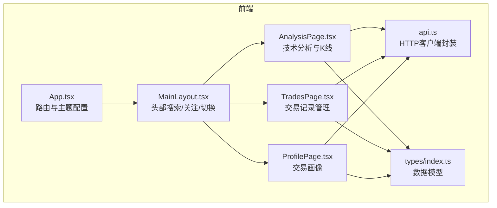
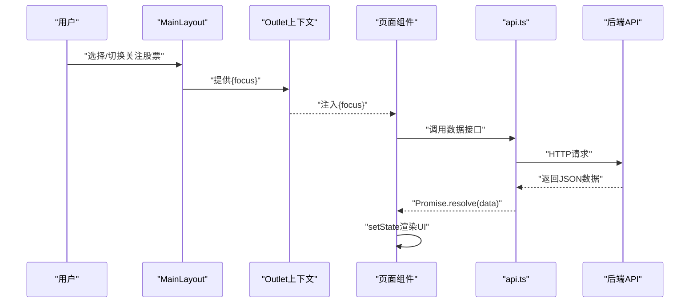
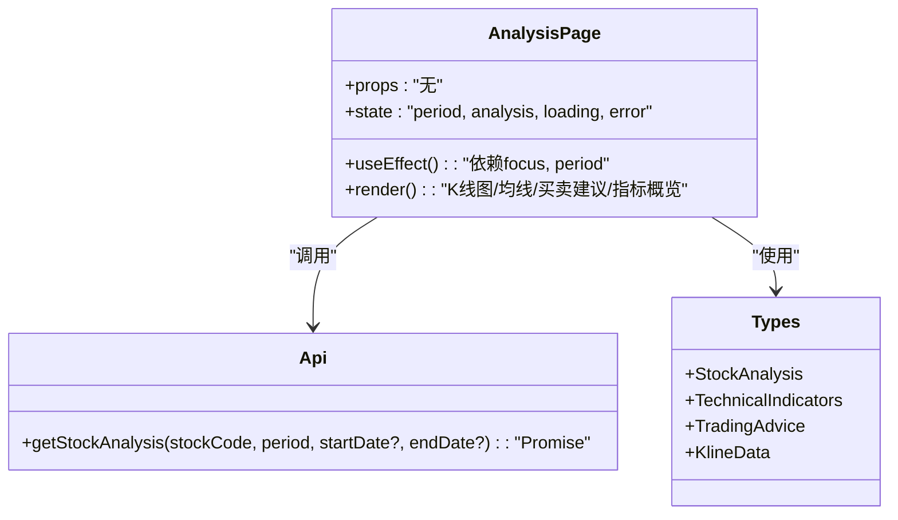
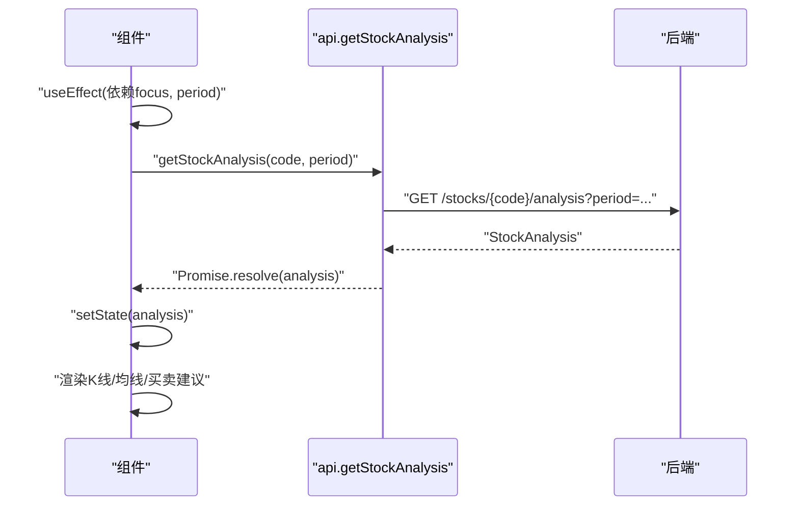
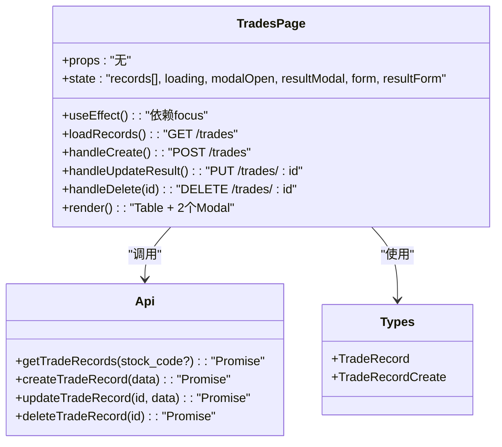
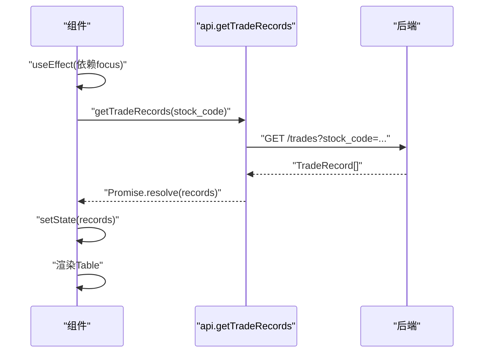
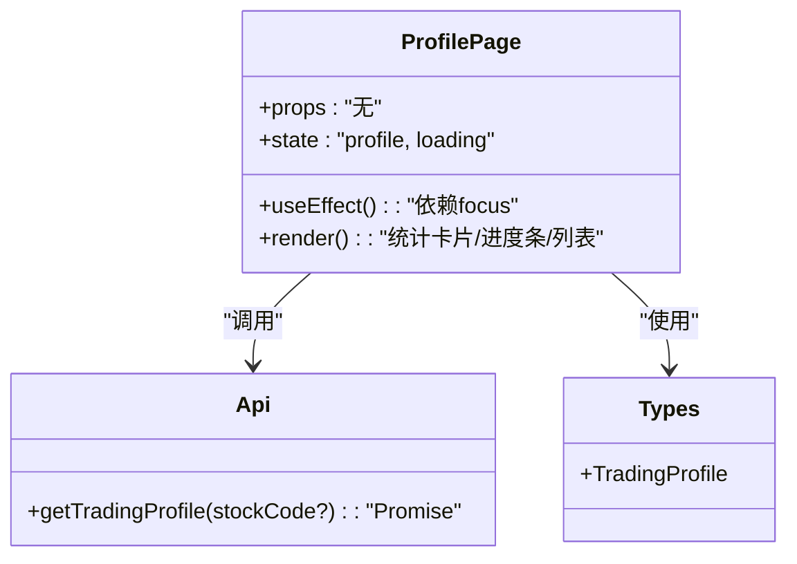
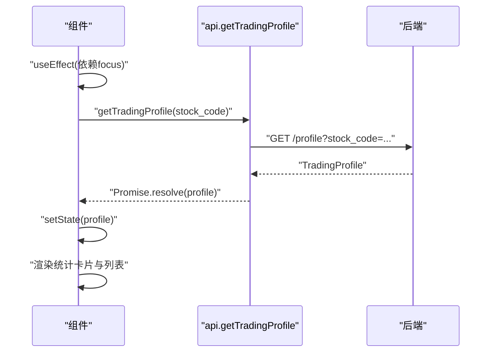
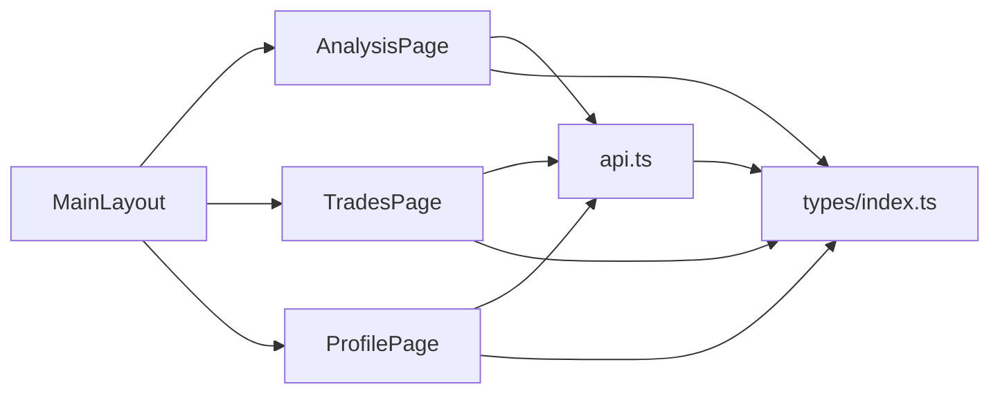

# 页面组件

<cite>
**本文引用的文件**
- [AnalysisPage.tsx](file://frontend/src/pages/AnalysisPage.tsx)
- [TradesPage.tsx](file://frontend/src/pages/TradesPage.tsx)
- [ProfilePage.tsx](file://frontend/src/pages/ProfilePage.tsx)
- [MainLayout.tsx](file://frontend/src/components/MainLayout.tsx)
- [api.ts](file://frontend/src/services/api.ts)
- [index.ts](file://frontend/src/types/index.ts)
- [App.tsx](file://frontend/src/App.tsx)
</cite>

## 目录
1. [简介](#简介)
2. [项目结构](#项目结构)
3. [核心组件](#核心组件)
4. [架构总览](#架构总览)
5. [详细组件分析](#详细组件分析)
6. [依赖关系分析](#依赖关系分析)
7. [性能考虑](#性能考虑)
8. [故障排查指南](#故障排查指南)
9. [结论](#结论)
10. [附录](#附录)

## 简介
本文件面向Stock Foker应用的前端页面组件，系统化梳理三个核心页面的实现架构与交互流程：
- AnalysisPage 分析页面：基于技术分析数据绘制K线图与均线，并展示买卖建议与推理过程
- TradesPage 交易页面：维护交易操作记录的增删改查，支持结果回填与统计
- ProfilePage 画像页面：聚合交易画像指标，输出交易风格、胜率与常见理由等可视化洞察

文档从props接口、状态管理、数据获取与渲染逻辑入手，解释页面与服务层的交互模式与数据流，阐述生命周期管理与性能优化策略，并提供使用示例与开发指导。

## 项目结构
页面组件位于前端目录，采用按功能分层组织：
- 页面组件：AnalysisPage.tsx、TradesPage.tsx、ProfilePage.tsx
- 布局与导航：MainLayout.tsx
- 服务层封装：api.ts
- 类型定义：types/index.ts
- 路由入口：App.tsx

图表来源
- [App.tsx:1-27](file://frontend/src/App.tsx#L1-L27)
- [MainLayout.tsx:1-281](file://frontend/src/components/MainLayout.tsx#L1-L281)
- [AnalysisPage.tsx:1-213](file://frontend/src/pages/AnalysisPage.tsx#L1-L213)
- [TradesPage.tsx:1-260](file://frontend/src/pages/TradesPage.tsx#L1-L260)
- [ProfilePage.tsx:1-173](file://frontend/src/pages/ProfilePage.tsx#L1-L173)
- [api.ts:1-68](file://frontend/src/services/api.ts#L1-L68)
- [index.ts:1-94](file://frontend/src/types/index.ts#L1-L94)

章节来源
- [App.tsx:1-27](file://frontend/src/App.tsx#L1-L27)
- [MainLayout.tsx:1-281](file://frontend/src/components/MainLayout.tsx#L1-L281)

## 核心组件
本节概述三个页面组件的职责边界与关键特性：
- AnalysisPage：接收当前关注股票上下文，拉取技术分析数据，渲染K线图与均线、买卖建议与推理过程
- TradesPage：维护交易记录列表，支持新增、编辑结果、删除；通过表单校验与消息反馈提升可用性
- ProfilePage：根据交易记录聚合画像指标，展示交易风格、胜率、盈亏比、常见理由等

章节来源
- [AnalysisPage.tsx:28-213](file://frontend/src/pages/AnalysisPage.tsx#L28-L213)
- [TradesPage.tsx:28-260](file://frontend/src/pages/TradesPage.tsx#L28-L260)
- [ProfilePage.tsx:26-173](file://frontend/src/pages/ProfilePage.tsx#L26-L173)

## 架构总览
页面组件通过useOutletContext从MainLayout传递的上下文接收当前关注股票信息，再调用api.ts封装的HTTP方法获取数据。数据模型在types/index.ts中统一定义，确保前后端一致。

图表来源
- [MainLayout.tsx:274-276](file://frontend/src/components/MainLayout.tsx#L274-L276)
- [AnalysisPage.tsx:29](file://frontend/src/pages/AnalysisPage.tsx#L29)
- [TradesPage.tsx:29](file://frontend/src/pages/TradesPage.tsx#L29)
- [ProfilePage.tsx:27](file://frontend/src/pages/ProfilePage.tsx#L27)
- [api.ts:14-67](file://frontend/src/services/api.ts#L14-L67)

## 详细组件分析

### AnalysisPage 分析页面
- 组件职责
  - 展示K线图与均线（MA5/10/20/60）与成交量柱状图
  - 呈买卖建议信号、置信度与推理过程
  - 支持周期切换（日K/周K/月K）

- Props与上下文
  - 通过useOutletContext接收{ focus: FocusStock | null }，作为数据源与筛选条件

- 状态管理
  - period：当前周期选择
  - analysis：技术分析结果
  - loading/error：加载与错误状态

- 数据获取与渲染
  - 依赖getStockAnalysis(stock_code, period)返回的数据结构
  - 渲染K线图与均线系列，成交量颜色区分涨跌
  - 买卖建议卡片展示信号、置信度与推理过程
  - 指标概览以键值对形式展示

- 生命周期与副作用
  - 当focus或period变化时触发数据拉取
  - 使用loading与error分支处理空数据、加载与异常场景

- 性能优化
  - 仅在依赖变化时发起请求，避免重复拉取
  - 图表选项按需拼装（如存在指标才渲染对应均线）

- 使用示例
  - 在分析页点击“日K/周K/月K”切换周期，观察K线与均线变化
  - 查看买卖建议与推理过程，辅助决策

章节来源
- [AnalysisPage.tsx:28-213](file://frontend/src/pages/AnalysisPage.tsx#L28-L213)
- [api.ts:34-44](file://frontend/src/services/api.ts#L34-L44)
- [index.ts:44-49](file://frontend/src/types/index.ts#L44-L49)

#### AnalysisPage类图

图表来源
- [AnalysisPage.tsx:28-213](file://frontend/src/pages/AnalysisPage.tsx#L28-L213)
- [api.ts:34-44](file://frontend/src/services/api.ts#L34-L44)
- [index.ts:15-49](file://frontend/src/types/index.ts#L15-L49)

#### AnalysisPage调用序列

图表来源
- [AnalysisPage.tsx:35-43](file://frontend/src/pages/AnalysisPage.tsx#L35-L43)
- [api.ts:34-44](file://frontend/src/services/api.ts#L34-L44)

### TradesPage 交易页面
- 组件职责
  - 列表展示交易记录，支持新增、编辑结果、删除
  - 提供表单校验与消息反馈，保证数据质量

- Props与上下文
  - 通过useOutletContext接收{ focus: FocusStock | null }，用于自动填充股票信息

- 状态管理
  - records：交易记录数组
  - modalOpen/resultModal：新增/结果编辑弹窗开关
  - form/resultForm：表单实例，用于字段校验与提交
  - loading：表格加载状态

- 数据获取与渲染
  - 依赖getTradeRecords(stock_code?)获取列表
  - columns定义列渲染规则，包含日期格式化、类型标签、情绪判断、实际盈亏标签等
  - 操作列提供“结果”与“删除”按钮

- 生命周期与副作用
  - 首次挂载与focus变化时加载记录
  - 新增/更新/删除后重新拉取列表

- 交互细节
  - 新增弹窗：当未关注股票时要求手动输入股票代码/名称
  - 结果弹窗：仅填写实际盈亏与备注，支持回填
  - 删除采用二次确认

- 性能优化
  - 表格分页pageSize=20，减少一次性渲染量
  - 弹窗内表单字段按需渲染，避免不必要的重渲染

- 使用示例
  - 点击“新增记录”，填写必要字段后保存，观察列表刷新
  - 对未结算记录点击“结果”，填写盈亏与备注后保存

章节来源
- [TradesPage.tsx:28-260](file://frontend/src/pages/TradesPage.tsx#L28-L260)
- [api.ts:47-61](file://frontend/src/services/api.ts#L47-L61)
- [index.ts:51-79](file://frontend/src/types/index.ts#L51-L79)

#### TradesPage类图

图表来源
- [TradesPage.tsx:28-260](file://frontend/src/pages/TradesPage.tsx#L28-L260)
- [api.ts:47-61](file://frontend/src/services/api.ts#L47-L61)
- [index.ts:51-79](file://frontend/src/types/index.ts#L51-L79)

#### TradesPage调用序列

图表来源
- [TradesPage.tsx:37-47](file://frontend/src/pages/TradesPage.tsx#L37-L47)
- [api.ts:47-50](file://frontend/src/services/api.ts#L47-L50)

### ProfilePage 画像页面
- 组件职责
  - 聚合交易画像指标，输出交易风格、胜率、盈亏比、平均持仓天数、常见买卖理由等

- Props与上下文
  - 通过useOutletContext接收{ focus: FocusStock | null }，作为画像维度筛选

- 状态管理
  - profile：交易画像聚合结果
  - loading：加载状态

- 数据获取与渲染
  - 依赖getTradingProfile(stock_code?)获取画像数据
  - 使用统计卡片、进度条、列表等组件呈现多维指标
  - 当无交易数据或total_trades为0时提示“暂无交易数据”

- 生命周期与副作用
  - focus变化时触发画像拉取
  - 加载态与空态分别渲染

- 性能优化
  - 仅在有有效数据时渲染，避免空渲染
  - 指标百分比计算在渲染前完成，减少重复计算

- 使用示例
  - 在交易记录完善后进入画像页，查看胜率与情绪准确率趋势
  - 查看常见买卖理由TOP，辅助复盘与优化交易策略

章节来源
- [ProfilePage.tsx:26-173](file://frontend/src/pages/ProfilePage.tsx#L26-L173)
- [api.ts:63-67](file://frontend/src/services/api.ts#L63-L67)
- [index.ts:81-93](file://frontend/src/types/index.ts#L81-L93)

#### ProfilePage类图

图表来源
- [ProfilePage.tsx:26-173](file://frontend/src/pages/ProfilePage.tsx#L26-L173)
- [api.ts:63-67](file://frontend/src/services/api.ts#L63-L67)
- [index.ts:81-93](file://frontend/src/types/index.ts#L81-L93)

#### ProfilePage调用序列

图表来源
- [ProfilePage.tsx:31-37](file://frontend/src/pages/ProfilePage.tsx#L31-L37)
- [api.ts:63-67](file://frontend/src/services/api.ts#L63-L67)

## 依赖关系分析
- 组件间耦合
  - 三个页面均依赖MainLayout提供的上下文{ focus }，保持数据一致性
  - 三个页面均依赖api.ts封装的HTTP方法，形成统一的服务层抽象
- 外部依赖
  - Ant Design组件库提供UI能力
  - ECharts-for-React用于K线图渲染
  - dayjs用于日期格式化
- 类型依赖
  - 所有页面共享types/index.ts中的数据模型，确保前后端契约一致

图表来源
- [AnalysisPage.tsx:17-18](file://frontend/src/pages/AnalysisPage.tsx#L17-L18)
- [TradesPage.tsx:20-25](file://frontend/src/pages/TradesPage.tsx#L20-L25)
- [ProfilePage.tsx:21](file://frontend/src/pages/ProfilePage.tsx#L21)
- [api.ts:1-9](file://frontend/src/services/api.ts#L1-L9)
- [index.ts:1-94](file://frontend/src/types/index.ts#L1-L94)
- [MainLayout.tsx:274-276](file://frontend/src/components/MainLayout.tsx#L274-L276)

章节来源
- [AnalysisPage.tsx:17-18](file://frontend/src/pages/AnalysisPage.tsx#L17-L18)
- [TradesPage.tsx:20-25](file://frontend/src/pages/TradesPage.tsx#L20-L25)
- [ProfilePage.tsx:21](file://frontend/src/pages/ProfilePage.tsx#L21)
- [api.ts:1-9](file://frontend/src/services/api.ts#L1-L9)
- [index.ts:1-94](file://frontend/src/types/index.ts#L1-L94)
- [MainLayout.tsx:274-276](file://frontend/src/components/MainLayout.tsx#L274-L276)

## 性能考虑
- 请求去抖与防抖
  - AnalysisPage与ProfilePage在focus变化时触发请求，建议在布局层对频繁切换进行节流
- 渲染优化
  - TradesPage表格分页pageSize=20，减少DOM节点数量
  - AnalysisPage按需渲染均线系列，避免空指标导致的无效渲染
- 图表性能
  - ECharts渲染大量K线数据时，建议限制数据点数量或启用大数据优化参数
- 网络优化
  - 合理设置axios超时与重试策略，避免阻塞UI
- 内存管理
  - 页面卸载时及时清理定时器与订阅，避免内存泄漏

## 故障排查指南
- 无关注股票
  - AnalysisPage会显示“请先搜索并关注一支股票”的占位提示
  - TradesPage/ProfilePage会在无数据时显示“暂无交易数据”
- 加载失败
  - AnalysisPage捕获错误并显示错误提示
  - TradesPage/ProfilePage在请求失败时静默处理或提示
- 表单校验失败
  - TradesPage在新增/更新时通过表单校验，校验失败不会提交
- 删除确认
  - TradesPage删除采用二次确认，避免误操作

章节来源
- [AnalysisPage.tsx:45-48](file://frontend/src/pages/AnalysisPage.tsx#L45-L48)
- [TradesPage.tsx:49-85](file://frontend/src/pages/TradesPage.tsx#L49-L85)
- [ProfilePage.tsx:39-41](file://frontend/src/pages/ProfilePage.tsx#L39-L41)

## 结论
三个页面组件围绕“关注股票上下文”构建，通过统一的服务层与类型定义实现高内聚低耦合。AnalysisPage强调可视化与推理过程，TradesPage强调可操作性与数据完整性，ProfilePage强调洞察与复盘。建议在后续迭代中引入缓存策略、图表大数据优化与更完善的错误边界处理，进一步提升用户体验与系统稳定性。

## 附录
- 开发指导
  - 新增页面时遵循相同模式：useOutletContext接收上下文、api.ts封装请求、types.ts统一类型
  - 表单与列表组件优先使用Ant Design，确保一致性与可维护性
  - 对于复杂图表，建议拆分为独立子组件并提供默认配置与可选参数
- 使用示例
  - 在分析页切换周期观察K线变化
  - 在交易页完善交易记录并回填结果
  - 在画像页查看胜率与常见理由，指导策略优化