# 宏观页面增强功能

<cite>
**本文档引用的文件**
- [backend/app/main.py](file://backend/app/main.py)
- [frontend/src/pages/MacroPage.tsx](file://frontend/src/pages/MacroPage.tsx)
- [backend/app/agents/macro_agent.py](file://backend/app/agents/macro_agent.py)
- [backend/app/routers/agent_router.py](file://backend/app/routers/agent_router.py)
- [backend/app/services/data_fetcher.py](file://backend/app/services/data_fetcher.py)
- [backend/app/services/data_source_service.py](file://backend/app/services/data_source_service.py)
- [frontend/src/hooks/useDataSource.ts](file://frontend/src/hooks/useDataSource.ts)
- [backend/app/llm/prompts.py](file://backend/app/llm/prompts.py)
- [doc/产品设计文档.md](file://doc/产品设计文档.md)
- [doc/迭代记录/2026-04-14-data-display-enhancement.md](file://doc/迭代记录/2026-04-14-data-display-enhancement.md)
- [frontend/src/services/api.ts](file://frontend/src/services/api.ts)
- [backend/app/models/models.py](file://backend/app/models/models.py)
- [backend/app/llm/client.py](file://backend/app/llm/client.py)
- [skills/宏观数据查询/hithink-macro-query/scripts/cli.py](file://skills/宏观数据查询/hithink-macro-query/scripts/cli.py)
- [frontend/src/components/SnapshotPanel.tsx](file://frontend/src/components/SnapshotPanel.tsx)
- [backend/app/routers/snapshot_router.py](file://backend/app/routers/snapshot_router.py)
- [backend/app/services/stock_service.py](file://backend/app/services/stock_service.py)
- [backend/app/routers/stock_router.py](file://backend/app/routers/stock_router.py)
- [frontend/src/pages/AnalysisPage.tsx](file://frontend/src/pages/AnalysisPage.tsx)
</cite>

## 更新摘要
**变更内容**
- 新增基准比较功能，包括 get_benchmark_comparison() 函数实现
- 前端 AnalysisPage 中集成基准比较卡片，支持时间窗口调整
- 新增基准比较图表和统计摘要面板
- 支持沪深300和上证指数两个基准对比
- 实现超额收益计算和可视化展示

## 目录
1. [简介](#简介)
2. [项目结构](#项目结构)
3. [核心组件](#核心组件)
4. [架构概览](#架构概览)
5. [详细组件分析](#详细组件分析)
6. [依赖关系分析](#依赖关系分析)
7. [性能考量](#性能考量)
8. [故障排除指南](#故障排除指南)
9. [结论](#结论)

## 简介

Stock Foker 是一款面向个人投资者的股票分析应用，专注于"深度聚焦、数据驱动、自我进化"的理念。该项目的核心价值在于通过单股票聚焦模式，融合技术面、基本面、消息面数据，结合用户个人交易画像，提供个性化的辅助决策建议。

宏观页面增强功能是项目第二阶段的重要组成部分，旨在为用户提供全面的宏观经济环境分析能力。该功能通过集成多个数据源，包括主要指数行情、市场涨跌概况、北向资金流向和宏观经济指标，为用户的投资决策提供重要的宏观层面参考。

**更新** 新增基准比较功能，通过 get_benchmark_comparison() 函数实现个股与主要指数的对比分析，包括时间窗口调整、超额收益计算和可视化展示。前端 AnalysisPage 中集成基准比较卡片，支持近一月、近三月、近半年、近一年等时间窗口选择。

## 项目结构

项目采用前后端分离的架构设计，主要分为以下几个核心部分：

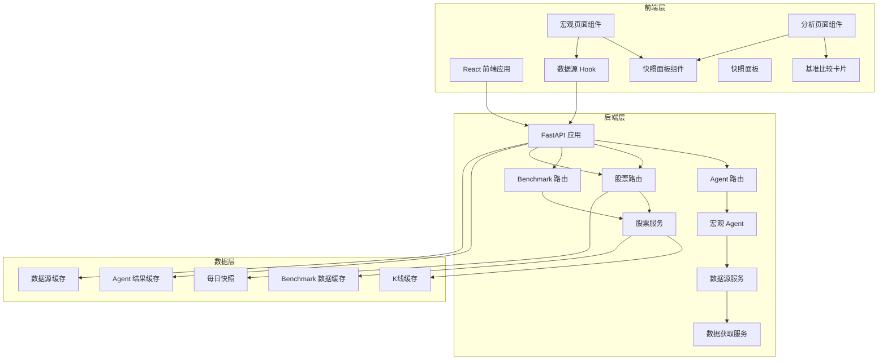

**图表来源**
- [backend/app/main.py:50-74](file://backend/app/main.py#L50-L74)
- [frontend/src/pages/MacroPage.tsx:52-107](file://frontend/src/pages/MacroPage.tsx#L52-L107)
- [frontend/src/pages/AnalysisPage.tsx:605-731](file://frontend/src/pages/AnalysisPage.tsx#L605-L731)
- [backend/app/routers/snapshot_router.py:17-19](file://backend/app/routers/snapshot_router.py#L17-L19)

项目的主要特点包括：

- **前后端分离**：前端使用 React + Ant Design，后端使用 Python + FastAPI
- **模块化设计**：Agent、数据源、服务层职责清晰分离
- **缓存机制**：双重缓存策略（Agent 结果缓存 + 数据源缓存）
- **快照系统**：每日快照记录，支持历史回溯分析
- **LLM 集成**：支持 OpenAI 兼容的大型语言模型
- **可扩展性**：支持多种数据源和分析维度
- **基准比较**：**新增** 支持个股与主要指数的对比分析

**章节来源**
- [backend/app/main.py:32-74](file://backend/app/main.py#L32-L74)
- [doc/产品设计文档.md:201-235](file://doc/产品设计文档.md#L201-L235)

## 核心组件

宏观页面增强功能的核心组件包括：

### 1. 宏观页面组件 (MacroPage)
负责展示宏观经济分析结果的前端组件，集成了多个数据面板和交互功能。**更新** 布局重构为 flex 一行居中，提升了视觉效果和用户体验。**新增** 集成 SnapshotPanel 历史记录面板，支持自动刷新机制。

### 2. 分析页面组件 (AnalysisPage)
**新增** 集成基准比较功能的前端组件，包含基准比较卡片、时间窗口选择器和统计摘要面板。

### 3. 快照面板组件 (SnapshotPanel)
**新增** 独立的历史记录面板组件，支持左栏日期列表和右栏详情展示，通过 `refreshKey` 参数实现自动刷新。

### 4. 宏观 Agent
后端的核心分析组件，负责收集和处理宏观经济数据，生成结构化的分析结果。

### 5. 股票服务 (StockService)
**新增** 包含 get_benchmark_comparison() 函数，负责计算个股与基准指数的对比分析。

### 6. 数据源服务
提供独立的数据获取和缓存管理功能，支持多种数据源类型的统一访问。

### 7. 缓存系统
实现双重缓存机制，确保数据的高效访问和系统的稳定性。

### 8. LLM 集成
通过大型语言模型提供智能分析能力，支持降级模式以保证系统可靠性。

**章节来源**
- [frontend/src/pages/MacroPage.tsx:52-506](file://frontend/src/pages/MacroPage.tsx#L52-L506)
- [frontend/src/pages/AnalysisPage.tsx:605-731](file://frontend/src/pages/AnalysisPage.tsx#L605-L731)
- [frontend/src/components/SnapshotPanel.tsx:303-348](file://frontend/src/components/SnapshotPanel.tsx#L303-L348)
- [backend/app/agents/macro_agent.py:12-81](file://backend/app/agents/macro_agent.py#L12-L81)
- [backend/app/services/data_source_service.py:130-169](file://backend/app/services/data_source_service.py#L130-L169)
- [backend/app/services/stock_service.py:373-460](file://backend/app/services/stock_service.py#L373-L460)

## 架构概览

宏观页面增强功能采用分层架构设计，确保各组件之间的松耦合和高内聚：

```mermaid
sequenceDiagram
participant U as 用户界面
participant AP as 分析页面组件
BC as 基准比较卡片
API as 后端 API
SS as 股票服务
KC as K线缓存
BR as 基准路由
U->>AP : 访问分析页面
AP->>API : 请求基准比较数据
API->>BR : 调用基准比较端点
BR->>SS : 执行 get_benchmark_comparison
SS->>KC : 获取个股 K线数据
SS->>KC : 获取基准指数 K线数据
SS->>SS : 计算对比分析
SS-->>BR : 返回基准比较结果
BR-->>API : 返回前端数据
API-->>AP : 返回基准数据
AP->>BC : 渲染基准比较卡片
BC->>BC : 时间窗口调整
BC-->>U : 展示对比图表
```

**图表来源**
- [frontend/src/pages/AnalysisPage.tsx:105-113](file://frontend/src/pages/AnalysisPage.tsx#L105-L113)
- [backend/app/routers/stock_router.py:146-166](file://backend/app/routers/stock_router.py#L146-L166)
- [backend/app/services/stock_service.py:373-460](file://backend/app/services/stock_service.py#L373-L460)

该架构的主要优势包括：

- **异步数据获取**：支持并行数据源获取，提高响应速度
- **智能缓存策略**：双重缓存机制确保数据新鲜度和系统性能
- **基准比较计算**：**新增** 支持个股与主要指数的对比分析
- **时间窗口灵活**：支持不同时间范围的对比分析
- **快照持久化**：每日快照记录支持历史回溯分析
- **LLM 集成**：提供强大的自然语言处理能力
- **降级机制**：当 LLM 不可用时，系统仍能正常运行

## 详细组件分析

### 宏观页面组件分析

宏观页面组件是整个功能的核心前端实现，具有以下关键特性：

#### 数据获取与缓存机制

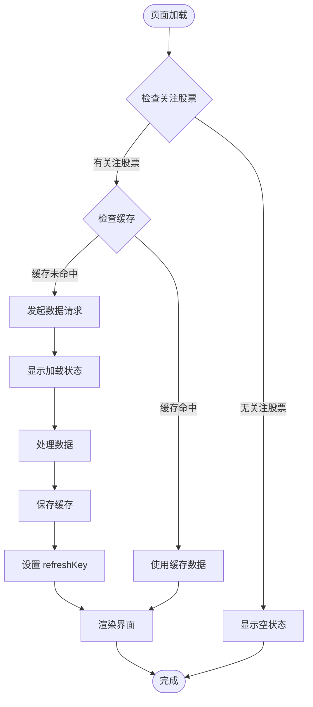

**图表来源**
- [frontend/src/pages/MacroPage.tsx:67-107](file://frontend/src/pages/MacroPage.tsx#L67-L107)

#### 数据源管理

页面集成了四个主要的数据源：

1. **主要指数行情** (`hithink_index`)
2. **涨跌概况** (`market_overview`)
3. **北向资金** (`north_flow`)
4. **宏观经济指标** (`hithink_macro`) - **更新** 新增 LPR、M2、Shibor 指标

每个数据源都有独立的缓存管理和刷新机制。

#### 快照面板集成

**新增** 宏观页面底部集成了 SnapshotPanel 组件，支持历史记录查看：

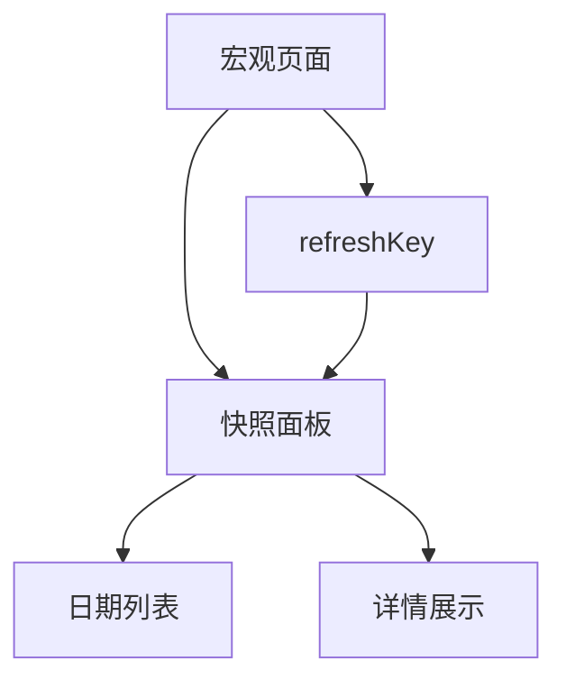

**图表来源**
- [frontend/src/pages/MacroPage.tsx:503-505](file://frontend/src/pages/MacroPage.tsx#L503-L505)
- [frontend/src/components/SnapshotPanel.tsx:303-348](file://frontend/src/components/SnapshotPanel.tsx#L303-L348)

#### UI 组件设计

页面采用响应式布局设计，包含以下主要组件：

- **AI 概览卡片**：展示市场阶段、市场情绪和风险等级
- **指数行情面板**：显示主要指数的实时行情数据
- **涨跌概况统计**：提供市场整体涨跌情况的统计信息
- **宏观经济指标**：**更新** 展示关键宏观经济数据，包括 CPI、PPI、PMI、LPR、M2、Shibor
- **北向资金 Top10**：显示主力资金流向情况
- **AI 综合分析**：提供完整的分析报告
- **快照面板**：**新增** 展示历史记录和回溯分析

**更新** 宏观经济指标面板采用 flex 一行居中布局，每个指标卡片自动居中对齐，提升了视觉效果和用户体验。

**章节来源**
- [frontend/src/pages/MacroPage.tsx:113-506](file://frontend/src/pages/MacroPage.tsx#L113-L506)

### 分析页面组件分析

**新增** 分析页面组件集成了基准比较功能：

#### 基准比较卡片

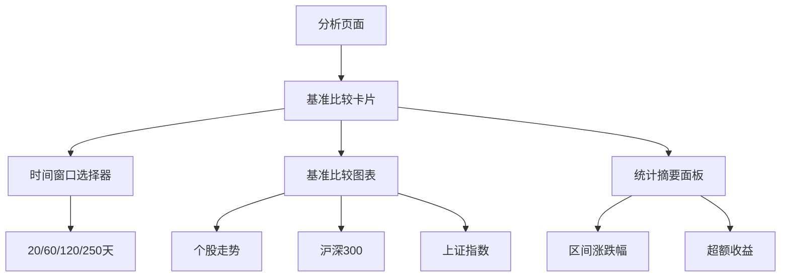

**图表来源**
- [frontend/src/pages/AnalysisPage.tsx:605-731](file://frontend/src/pages/AnalysisPage.tsx#L605-L731)

#### 时间窗口调整功能

基准比较卡片包含 Segmented 控件，支持以下时间窗口：

- **近一月** (20天)
- **近三月** (60天)  
- **近半年** (120天)
- **近一年** (250天)

用户可以通过点击选择不同的时间范围，实时调整对比分析的显示范围。

#### 基准比较图表

使用 ECharts 实现的对比图表具有以下特性：

- **双轴设计**：左侧显示日期，右侧显示百分比变化
- **多系列对比**：显示个股走势和两个基准指数走势
- **动态提示框**：悬停显示详细的对比信息
- **暗色主题**：支持深色模式显示

#### 统计摘要面板

包含两个主要统计区域：

**区间涨跌幅**
- 个股累计涨幅
- 沪深300 指数涨幅  
- 上证指数涨幅

**超额收益**
- vs 沪深300 超额收益
- vs 上证指数 超额收益

**章节来源**
- [frontend/src/pages/AnalysisPage.tsx:605-731](file://frontend/src/pages/AnalysisPage.tsx#L605-L731)

### 快照面板组件分析

**新增** 快照面板组件是独立的历史记录展示组件：

#### 自动刷新机制

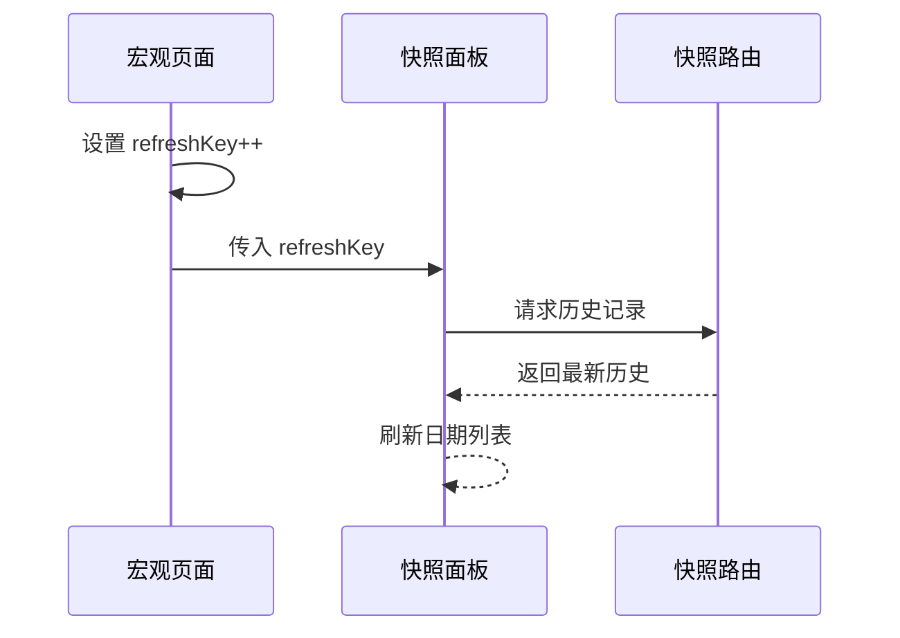

**图表来源**
- [frontend/src/pages/MacroPage.tsx:87](file://frontend/src/pages/MacroPage.tsx#L87)
- [frontend/src/components/SnapshotPanel.tsx:346-348](file://frontend/src/components/SnapshotPanel.tsx#L346-L348)

#### 历史记录展示

快照面板支持三种 Agent 类型的历史记录：

- **消息面**：情绪评分、新闻数量、噪音比例
- **板块联动**：行业名称、趋势、相对强度
- **宏观环境**：市场阶段、市场情绪、风险等级

#### 日期管理

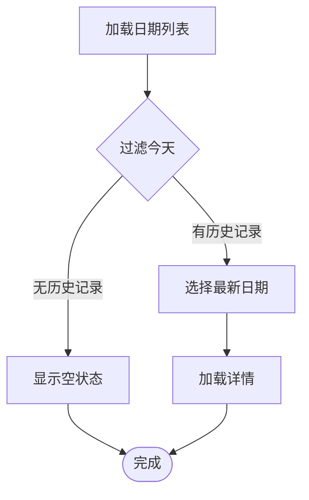

**图表来源**
- [frontend/src/components/SnapshotPanel.tsx:310-331](file://frontend/src/components/SnapshotPanel.tsx#L310-L331)

**章节来源**
- [frontend/src/components/SnapshotPanel.tsx:303-348](file://frontend/src/components/SnapshotPanel.tsx#L303-L348)

### 宏观 Agent 分析

宏观 Agent 是后端的核心分析组件，负责整合和分析各种宏观经济数据：

#### 数据收集流程

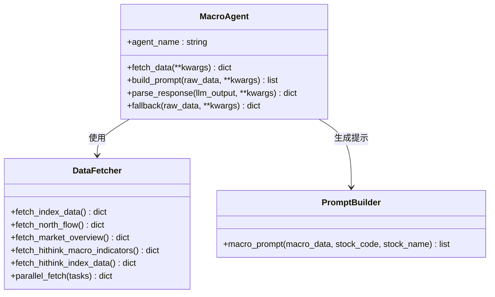

**图表来源**
- [backend/app/agents/macro_agent.py:12-81](file://backend/app/agents/macro_agent.py#L12-L81)
- [backend/app/services/data_fetcher.py:106-125](file://backend/app/services/data_fetcher.py#L106-L125)

#### 数据处理逻辑

MacroAgent 的数据处理遵循以下流程：

1. **并行数据获取**：同时获取多个数据源的数据
2. **数据源缓存集成**：使用数据源缓存服务获取指数行情数据
3. **提示词构建**：根据收集的数据构建 LLM 提示词
4. **结果解析**：将 LLM 输出解析为结构化数据
5. **降级处理**：当 LLM 不可用时，提供原始数据展示
6. **快照保存**：**新增** 将关键指标保存到每日快照表

**更新** 宏观数据获取支持独立查询多个指标，包括 CPI、PPI、PMI、LPR、M2、Shibor，避免问财 API 多指标合并时丢数据的问题。

**章节来源**
- [backend/app/agents/macro_agent.py:15-81](file://backend/app/agents/macro_agent.py#L15-L81)

### 股票服务分析

**新增** 股票服务包含基准比较功能的核心实现：

#### get_benchmark_comparison() 函数

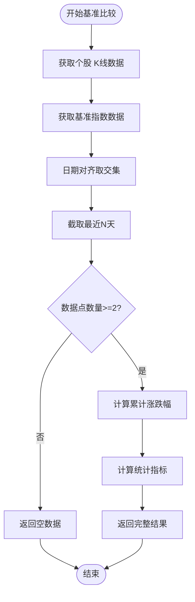

**图表来源**
- [backend/app/services/stock_service.py:373-460](file://backend/app/services/stock_service.py#L373-L460)

#### 基准指数配置

系统默认支持以下两个基准指数：

| 指数代码 | 指数名称 | 用途 |
|---------|---------|------|
| 000300 | 沪深300 | 跨行业宽基指数 |
| 000001 | 上证指数 | 上交所主要指数 |

#### 统计指标计算

基准比较结果包含以下统计指标：

- **区间涨跌幅**：个股、沪深300、上证指数的累计涨幅
- **超额收益**：个股相对基准的超额表现

**章节来源**
- [backend/app/services/stock_service.py:368-460](file://backend/app/services/stock_service.py#L368-L460)

### 数据源服务分析

数据源服务提供了统一的数据获取和缓存管理接口：

#### 缓存策略

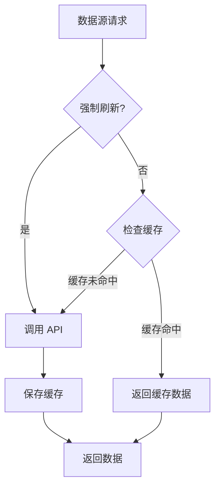

**图表来源**
- [backend/app/services/data_source_service.py:130-169](file://backend/app/services/data_source_service.py#L130-L169)

#### 支持的数据源类型

数据源服务支持以下数据源类型：

| 数据源类型 | 获取函数 | 是否需要股票名称 |
|-----------|---------|----------------|
| hithink_news | fetch_hithink_news | 是 |
| announcements | fetch_hithink_announcements | 是 |
| industry_valuation | fetch_hithink_industry_data | 是 |
| market_data | fetch_hithink_market_data | 是 |
| hithink_index | fetch_hithink_index_data | 否 |
| reports | fetch_hithink_reports | 是 |
| basicinfo | fetch_hithink_basicinfo | 是 |
| business | fetch_hithink_business_data | 是 |
| north_flow | fetch_north_flow | 否 |
| market_overview | fetch_market_overview | 否 |
| hithink_macro | fetch_hithink_macro_indicators | 否 |

**更新** 新增 `hithink_macro` 数据源，支持获取 CPI、PPI、PMI、LPR、M2、Shibor 等宏观经济指标。

**章节来源**
- [backend/app/services/data_source_service.py:44-61](file://backend/app/services/data_source_service.py#L44-L61)
- [backend/app/services/data_source_service.py:130-169](file://backend/app/services/data_source_service.py#L130-L169)

### 前端数据钩子分析

useDataSource 钩子提供了灵活的数据获取和缓存管理功能：

#### 内存缓存机制

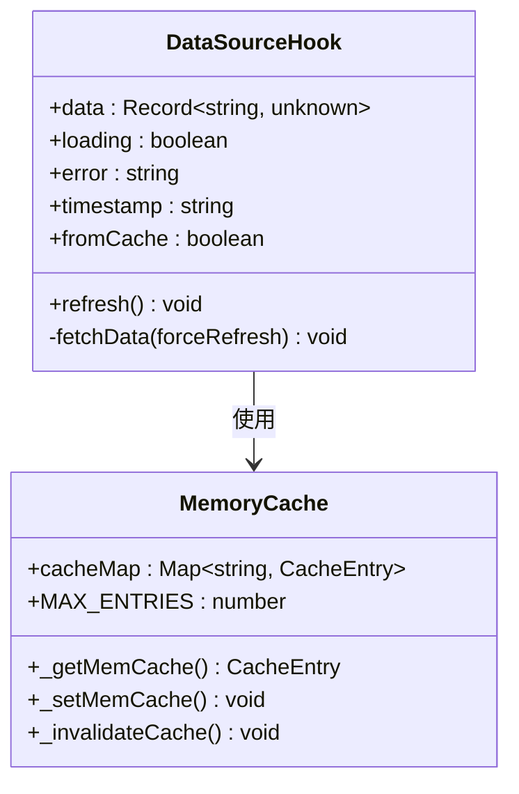

**图表来源**
- [frontend/src/hooks/useDataSource.ts:82-169](file://frontend/src/hooks/useDataSource.ts#L82-L169)

#### 缓存管理策略

前端实现了两级缓存机制：

1. **内存缓存**：跨组件共享的轻量级缓存
2. **组件缓存**：每个组件独立的状态管理

缓存的新鲜度边界与后端保持一致，每天 09:00 作为缓存边界。

**章节来源**
- [frontend/src/hooks/useDataSource.ts:23-79](file://frontend/src/hooks/useDataSource.ts#L23-L79)

## 依赖关系分析

宏观页面增强功能涉及多个层次的依赖关系：

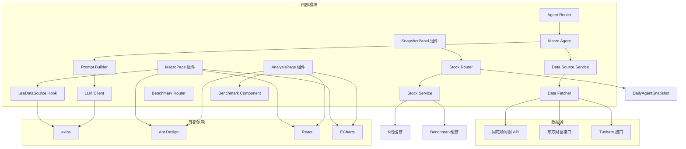

**图表来源**
- [frontend/src/pages/MacroPage.tsx:1-17](file://frontend/src/pages/MacroPage.tsx#L1-L17)
- [frontend/src/pages/AnalysisPage.tsx:1-32](file://frontend/src/pages/AnalysisPage.tsx#L1-L32)
- [backend/app/routers/agent_router.py:21-26](file://backend/app/routers/agent_router.py#L21-L26)
- [backend/app/routers/stock_router.py:146-166](file://backend/app/routers/stock_router.py#L146-L166)
- [backend/app/routers/snapshot_router.py:17-19](file://backend/app/routers/snapshot_router.py#L17-L19)

### 关键依赖关系

1. **前端依赖**：主要依赖 React 生态系统和 Ant Design 组件库
2. **后端依赖**：依赖 FastAPI 框架和 SQLAlchemy ORM
3. **数据源依赖**：主要依赖同花顺问财 API，备选方案包括东方财富和 Tushare
4. **LLM 依赖**：支持 OpenAI 兼容的多种大模型服务
5. **数据库依赖**：依赖 DailyAgentSnapshot 表存储快照数据
6. **基准比较依赖**：**新增** 依赖 K线缓存和基准数据缓存

### 循环依赖检测

经过分析，项目中不存在循环依赖关系：

- 前端组件不依赖后端模块
- 后端模块之间通过明确的接口进行通信
- 数据源服务独立于具体的数据获取实现
- 快照面板组件通过 API 路由访问数据库
- **新增** 基准比较功能通过独立的服务层提供

**章节来源**
- [backend/app/main.py:32-69](file://backend/app/main.py#L32-L69)
- [frontend/src/services/api.ts:1-188](file://frontend/src/services/api.ts#L1-L188)

## 性能考量

宏观页面增强功能在设计时充分考虑了性能优化：

### 缓存策略优化

1. **双重缓存机制**：Agent 结果缓存 + 数据源缓存，减少重复请求
2. **缓存新鲜度控制**：每天 09:00 作为缓存边界，确保数据时效性
3. **内存缓存优化**：前端实现 LRU 缓存淘汰策略，限制缓存大小
4. **快照缓存**：**新增** 每日快照表减少重复计算
5. **基准数据缓存**：**新增** 基准比较结果缓存，避免重复计算

### 并行处理优化

1. **数据源并行获取**：使用 ThreadPoolExecutor 并行获取多个数据源
2. **Agent 并行执行**：在综合分析中并行执行多个 Agent
3. **前端异步加载**：支持渐进式数据加载，提升用户体验
4. **快照异步保存**：Agent 分析完成后异步保存快照
5. **基准比较并行计算**：**新增** K线数据获取和基准指数获取并行执行

### LLM 性能优化

1. **降级机制**：当 LLM 不可用时，系统自动降级到纯规则引擎
2. **缓存利用**：充分利用 Agent 结果缓存，减少 LLM 调用次数
3. **错误重试**：实现指数退避重试机制，提高成功率

**更新** 宏观数据获取采用独立查询策略，避免问财 API 多指标合并时丢数据的问题，提高了数据获取的可靠性和准确性。

**更新** 快照面板通过 `refreshKey` 参数实现自动刷新，确保历史记录与当前分析结果保持同步。

**更新** 基准比较功能实现高效的日期对齐和数据截取算法，支持大规模时间序列数据的快速处理。

## 故障排除指南

### 常见问题及解决方案

#### 1. 数据获取失败

**症状**：页面显示"获取数据失败"或空白状态

**可能原因**：
- API 密钥配置错误
- 网络连接问题
- 数据源服务异常

**解决步骤**：
1. 检查 `.env` 文件中的 API 密钥配置
2. 验证网络连接状态
3. 查看后端日志获取详细错误信息
4. 使用 `clearAgentCache` 端点清除缓存后重试

#### 2. LLM 调用失败

**症状**：AI 分析不可用，显示降级提示

**可能原因**：
- LLM 配置未正确设置
- API Key 无效或过期
- LLM 服务不可用

**解决步骤**：
1. 检查 LLM 相关环境变量配置
2. 验证 API Key 的有效性
3. 使用 `/api/agent/reload-config` 端点重新加载配置
4. 检查 LLM 服务的可用性

#### 3. 缓存问题

**症状**：数据显示过期或缓存异常

**可能原因**：
- 缓存边界设置不当
- 缓存数据损坏
- 缓存清理不及时

**解决步骤**：
1. 使用 `/api/agent/cache/{stock_code}` 端点清除特定股票的缓存
2. 检查缓存时间戳和新鲜度
3. 重启应用以清理内存缓存
4. 验证数据库缓存表的状态

#### 4. 快照面板刷新问题

**症状**：快照面板不显示最新历史记录

**可能原因**：
- `refreshKey` 参数未正确传递
- 快照数据保存失败
- API 调用异常

**解决步骤**：
1. 检查 MacroPage 中 `refreshKey` 的设置逻辑
2. 验证快照数据是否正确保存到数据库
3. 查看快照路由 API 的响应状态
4. 清除快照缓存后重新加载

#### 5. 宏观指标显示异常

**症状**：LPR、M2、Shibor 等指标不显示或显示错误

**可能原因**：
- 问财 API 查询词配置错误
- 指标数据格式不匹配
- 缓存数据过期

**解决步骤**：
1. 检查 `fetch_hithink_macro_indicators` 函数中的查询词配置
2. 验证返回数据的字段格式是否符合预期
3. 清除 hithink_macro 缓存后重新获取数据
4. 检查后端日志获取具体的 API 错误信息

#### 6. 基准比较功能异常

**症状**：基准比较卡片显示空白或错误

**可能原因**：
- 基准指数数据获取失败
- K线数据为空或不足
- 日期对齐算法异常
- 前端图表渲染错误

**解决步骤**：
1. 检查 `/api/stocks/{stock_code}/benchmark` 端点的响应
2. 验证个股和基准指数的 K线数据获取
3. 确认日期对齐和数据截取逻辑
4. 检查前端 ECharts 配置和数据格式
5. 清除基准数据缓存后重新加载

### 调试工具和方法

#### 后端调试

1. **日志查看**：检查后端日志获取详细的错误信息
2. **数据库检查**：验证缓存表和快照表的状态和数据完整性
3. **API 测试**：使用 Postman 或 curl 测试各个 API 端点

#### 前端调试

1. **浏览器开发者工具**：检查网络请求和响应
2. **React DevTools**：分析组件状态和 props
3. **Redux DevTools**：如果使用状态管理，检查状态变化
4. **快照面板调试**：监控 `refreshKey` 参数的变化
5. **基准比较调试**：检查 benchDays 状态和图表渲染

**章节来源**
- [backend/app/routers/agent_router.py:384-395](file://backend/app/routers/agent_router.py#L384-L395)
- [backend/app/llm/client.py:30-78](file://backend/app/llm/client.py#L30-L78)

## 结论

宏观页面增强功能是 Stock Foker 项目的重要组成部分，它通过集成多个数据源和智能分析能力，为用户提供全面的宏观经济环境分析。该功能的设计体现了以下核心价值：

### 技术优势

1. **模块化设计**：清晰的组件分离和职责划分
2. **高性能架构**：双缓存机制和并行处理优化
3. **可靠性保障**：完善的降级机制和错误处理
4. **可扩展性**：支持多种数据源和分析维度
5. **历史追踪**：**新增** 快照系统支持历史记录回溯分析
6. **实时同步**：**新增** 自动刷新机制确保数据一致性
7. **基准比较**：**新增** 支持个股与主要指数的对比分析

**更新** 新增的 LPR、M2、Shibor 三个关键宏观经济指标显著增强了数据展示能力和分析深度，flex 布局重构提升了用户体验和视觉效果。**新增** 快照面板刷新机制和历史记录面板为用户提供了更好的数据分析体验。

**更新** 基准比较功能通过 get_benchmark_comparison() 函数实现，支持沪深300和上证指数的对比分析，包含时间窗口调整、超额收益计算和可视化展示，为用户提供更全面的投资决策参考。

### 业务价值

1. **决策支持**：为投资决策提供重要的宏观层面参考
2. **用户体验**：直观的界面设计和流畅的交互体验
3. **数据驱动**：基于真实数据的分析和建议
4. **个性化**：结合用户画像提供定制化建议
5. **历史分析**：**新增** 支持历史数据回溯和趋势分析
6. **对比分析**：**新增** 支持个股与基准指数的横向对比

### 发展方向

根据项目规划，宏观页面增强功能将继续演进：

1. **副图指标面板**：实现 MACD/KDJ/RSI 等技术指标的独立显示
2. **数据源优化**：改进北向资金数据源和宏观经济指标获取
3. **性能提升**：进一步优化缓存策略和数据加载性能
4. **功能扩展**：增加更多宏观经济指标和分析维度
5. **智能分析**：**新增** 基于历史快照的智能趋势预测
6. **基准扩展**：**新增** 支持更多基准指数和自定义对比组合

**更新** 布局重构和指标增强为后续的功能扩展奠定了良好基础，flex 一行居中布局为未来更多的指标展示提供了良好的视觉基础。**新增** 的快照面板刷新机制、历史记录面板和基准比较功能为后续的智能分析功能提供了数据基础。

**更新** 基准比较功能的成功集成为 Stock Foker 项目提供了更强大的分析能力，通过时间窗口调整和统计摘要面板，用户可以深入分析个股的表现和市场环境的关系。

该功能的成功实施为 Stock Foker 项目奠定了坚实的技术基础，为后续的功能扩展和优化提供了良好的起点。