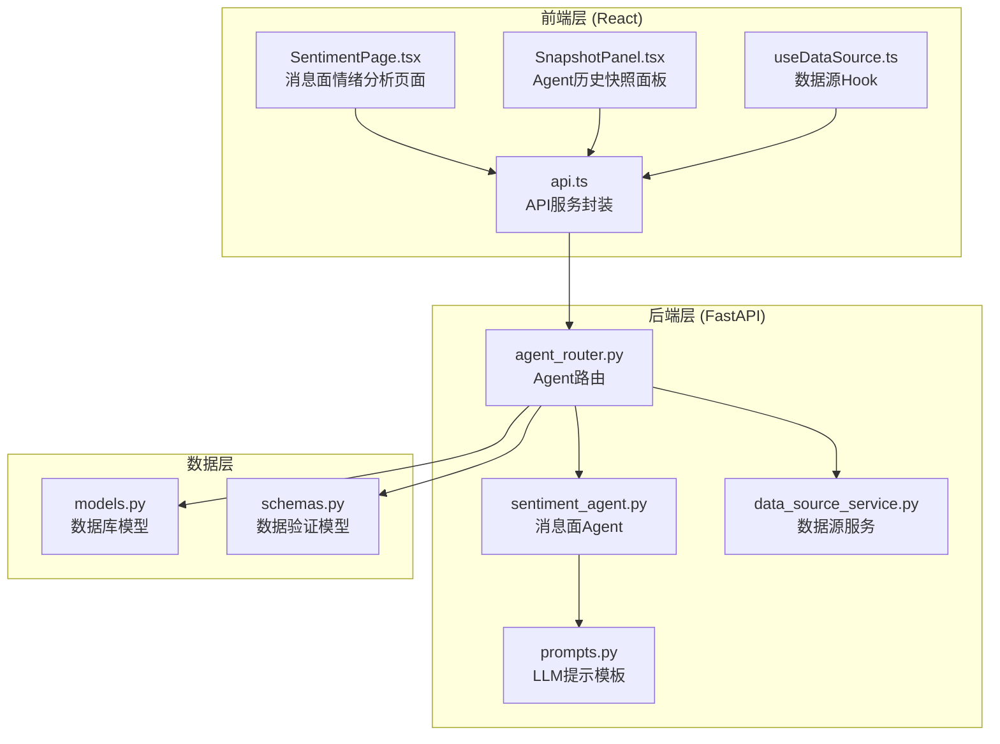
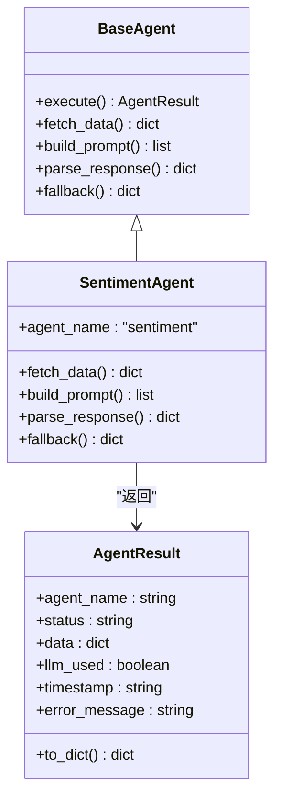
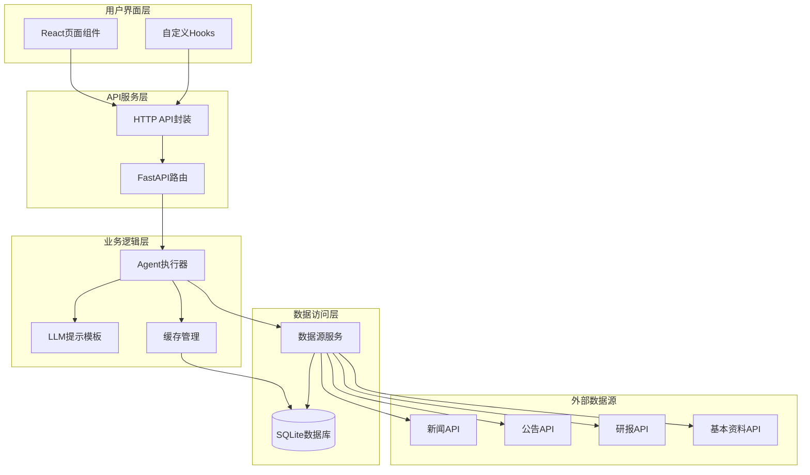
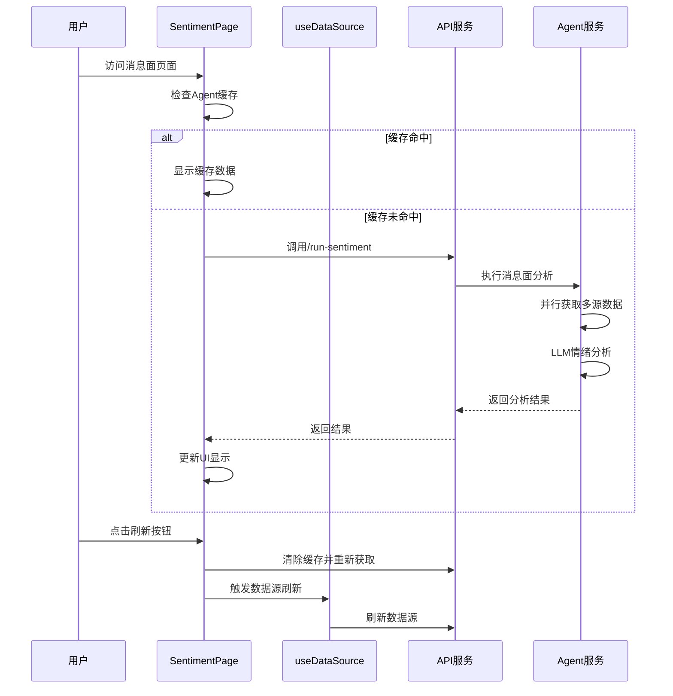
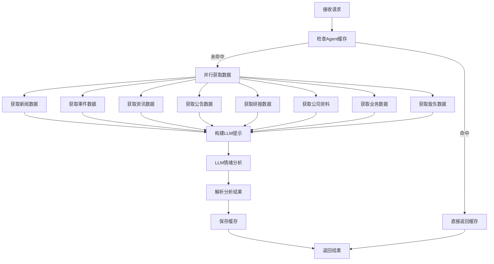
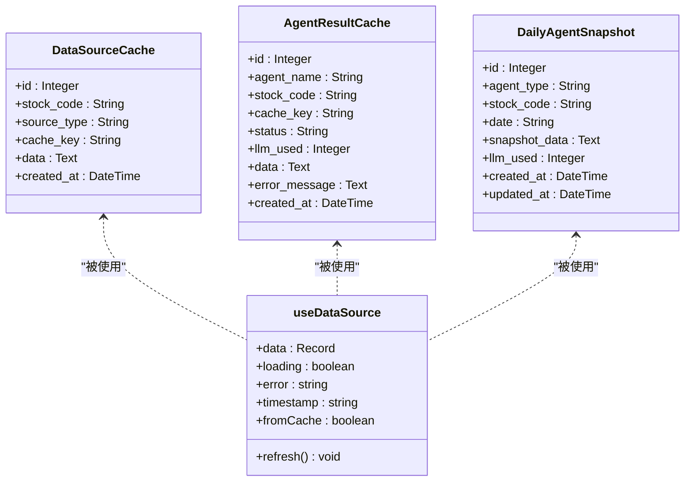
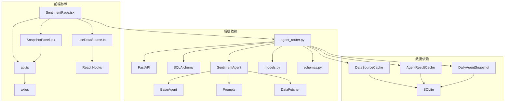

# 情绪页面增强功能

<cite>
**本文档引用的文件**
- [SentimentPage.tsx](file://frontend/src/pages/SentimentPage.tsx)
- [sentiment_agent.py](file://backend/app/agents/sentiment_agent.py)
- [agent_router.py](file://backend/app/routers/agent_router.py)
- [prompts.py](file://backend/app/llm/prompts.py)
- [useDataSource.ts](file://frontend/src/hooks/useDataSource.ts)
- [api.ts](file://frontend/src/services/api.ts)
- [data_source_service.py](file://backend/app/services/data_source_service.py)
- [base_agent.py](file://backend/app/agents/base_agent.py)
- [models.py](file://backend/app/models/models.py)
- [schemas.py](file://backend/app/models/schemas.py)
- [SnapshotPanel.tsx](file://frontend/src/components/SnapshotPanel.tsx)
- [README.md](file://README.md)
- [产品设计文档.md](file://doc/产品设计文档.md)
- [MVP实现说明.md](file://doc/MVP实现说明.md)
</cite>

## 目录
1. [简介](#简介)
2. [项目结构](#项目结构)
3. [核心组件](#核心组件)
4. [架构概览](#架构概览)
5. [详细组件分析](#详细组件分析)
6. [依赖关系分析](#依赖关系分析)
7. [性能考虑](#性能考虑)
8. [故障排除指南](#故障排除指南)
9. [结论](#结论)

## 简介

Stock Foker 是一款个人A股分析辅助应用，专注于消息面情绪分析功能。该项目集成了K线行情、技术指标、AI多维度分析与交易记录管理，特别强化了消息面情绪分析能力，通过LLM对个股新闻进行深度分析，提供可解释性的投资决策支持。

消息面情绪分析是该项目的核心特色功能，它能够：
- 自动抓取和分析个股相关新闻、公告、研报
- 识别有效信息与噪音，提供多空情绪评分
- 生成结构化的分析报告和投资建议
- 支持实时刷新和历史数据回溯

## 项目结构

该项目采用前后端分离的架构设计，主要分为以下几个核心模块：



**图表来源**
- [SentimentPage.tsx:1-575](file://frontend/src/pages/SentimentPage.tsx#L1-L575)
- [agent_router.py:1-395](file://backend/app/routers/agent_router.py#L1-L395)
- [sentiment_agent.py:1-91](file://backend/app/agents/sentiment_agent.py#L1-L91)

**章节来源**
- [README.md:1-128](file://README.md#L1-L128)
- [产品设计文档.md:1-446](file://doc/产品设计文档.md#L1-L446)

## 核心组件

### 消息面情绪分析Agent

消息面情绪分析Agent是整个系统的核心组件，负责整合多源数据并进行AI分析：



**图表来源**
- [base_agent.py:1-119](file://backend/app/agents/base_agent.py#L1-L119)
- [sentiment_agent.py:1-91](file://backend/app/agents/sentiment_agent.py#L1-L91)

### 数据源管理系统

系统实现了多层次的数据缓存机制，确保数据获取的高效性和可靠性：

```mermaid
flowchart TD
A[前端请求) --> B{检查Agent缓存}
B --> |命中| C[返回缓存数据]
B --> |未命中| D[调用后端API]
D --> E[检查Agent结果缓存]
E --> |命中| F[返回缓存结果]
E --> |未命中| G[执行Agent分析]
G --> H[并行获取多源数据]
H --> I[LLM情绪分析]
I --> J[保存Agent缓存]
J --> K[返回分析结果]
subgraph "数据源层次"
L[Agent缓存]
M[数据源缓存]
N[原始API数据]
end
```

**图表来源**
- [agent_router.py:47-116](file://backend/app/routers/agent_router.py#L47-L116)
- [data_source_service.py:84-169](file://backend/app/services/data_source_service.py#L84-L169)

**章节来源**
- [sentiment_agent.py:15-80](file://backend/app/agents/sentiment_agent.py#L15-L80)
- [data_source_service.py:1-169](file://backend/app/services/data_source_service.py#L1-L169)

## 架构概览

消息面情绪分析系统的整体架构采用了分层设计，确保了系统的可扩展性和可维护性：



**图表来源**
- [api.ts:117-154](file://frontend/src/services/api.ts#L117-L154)
- [agent_router.py:186-201](file://backend/app/routers/agent_router.py#L186-L201)
- [prompts.py:12-106](file://backend/app/llm/prompts.py#L12-L106)

## 详细组件分析

### 前端消息面页面组件

消息面情绪分析页面是用户交互的核心界面，提供了丰富的数据展示和交互功能：



**图表来源**
- [SentimentPage.tsx:89-134](file://frontend/src/pages/SentimentPage.tsx#L89-L134)
- [api.ts:117-120](file://frontend/src/services/api.ts#L117-L120)

页面的主要功能包括：

1. **实时数据展示**：显示当前股票的消息面情绪分析结果
2. **多源数据整合**：整合新闻、公告、研报、公司资料等多源数据
3. **交互式刷新**：支持一键刷新和独立数据源刷新
4. **历史数据回溯**：通过快照面板查看历史分析结果

**章节来源**
- [SentimentPage.tsx:70-575](file://frontend/src/pages/SentimentPage.tsx#L70-L575)

### Agent执行流程

消息面Agent的执行流程体现了完整的AI分析管道：



**图表来源**
- [sentiment_agent.py:15-80](file://backend/app/agents/sentiment_agent.py#L15-L80)
- [prompts.py:12-106](file://backend/app/llm/prompts.py#L12-L106)

**章节来源**
- [base_agent.py:62-102](file://backend/app/agents/base_agent.py#L62-L102)
- [agent_router.py:186-201](file://backend/app/routers/agent_router.py#L186-L201)

### 数据源缓存机制

系统实现了多层次的缓存机制，确保数据获取的高效性：



**图表来源**
- [models.py:118-151](file://backend/app/models/models.py#L118-L151)
- [useDataSource.ts:14-21](file://frontend/src/hooks/useDataSource.ts#L14-L21)

**章节来源**
- [data_source_service.py:84-169](file://backend/app/services/data_source_service.py#L84-L169)
- [useDataSource.ts:1-169](file://frontend/src/hooks/useDataSource.ts#L1-L169)

## 依赖关系分析

系统各组件之间的依赖关系体现了清晰的分层架构：



**图表来源**
- [api.ts:1-188](file://frontend/src/services/api.ts#L1-L188)
- [agent_router.py:1-395](file://backend/app/routers/agent_router.py#L1-L395)
- [models.py:1-151](file://backend/app/models/models.py#L1-L151)

**章节来源**
- [schemas.py:1-213](file://backend/app/models/schemas.py#L1-L213)
- [README.md:33-41](file://README.md#L33-L41)

## 性能考虑

系统在设计时充分考虑了性能优化，采用了多种策略来提升用户体验：

### 缓存策略
- **Agent结果缓存**：每日09:00边界缓存，避免重复LLM调用
- **数据源缓存**：独立的数据源缓存，支持强制刷新
- **前端内存缓存**：模块级内存缓存，跨组件共享

### 并行处理
- **多源数据并行获取**：使用ThreadPoolExecutor并行执行多个数据源请求
- **Agent并行执行**：在综合分析中并行执行多个Agent

### 数据优化
- **增量更新**：K线数据采用增量更新策略
- **数据压缩**：JSON序列化存储，减少数据库占用

## 故障排除指南

### 常见问题及解决方案

1. **LLM配置问题**
   - 检查.env文件中的LLM配置
   - 确认API密钥和基础URL正确
   - 使用`/api/agent/reload-config`重新加载配置

2. **数据获取失败**
   - 检查网络连接和API密钥
   - 查看后端日志获取详细错误信息
   - 验证股票代码和名称的准确性

3. **缓存问题**
   - 使用`/api/agent/cache/{stock_code}`清除缓存
   - 检查数据库连接状态
   - 验证缓存键的正确性

**章节来源**
- [agent_router.py:384-395](file://backend/app/routers/agent_router.py#L384-L395)
- [MVP实现说明.md:85-92](file://doc/MVP实现说明.md#L85-L92)

## 结论

Stock Foker的消息面情绪分析功能通过精心设计的架构和实现，为用户提供了一个强大而易用的投资决策辅助工具。系统的主要优势包括：

1. **完整的数据整合**：支持多源数据的统一管理和分析
2. **高效的缓存机制**：多层次缓存确保快速响应
3. **可解释的AI分析**：提供详细的分析过程和推理依据
4. **灵活的交互设计**：支持实时刷新和历史数据回溯
5. **可靠的错误处理**：完善的降级策略确保系统稳定性

该系统不仅满足了当前的功能需求，还为未来的扩展奠定了良好的基础。通过持续的优化和改进，相信能够为个人投资者提供更加精准和实用的投资决策支持。