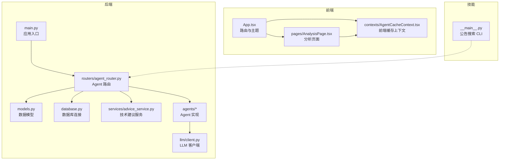
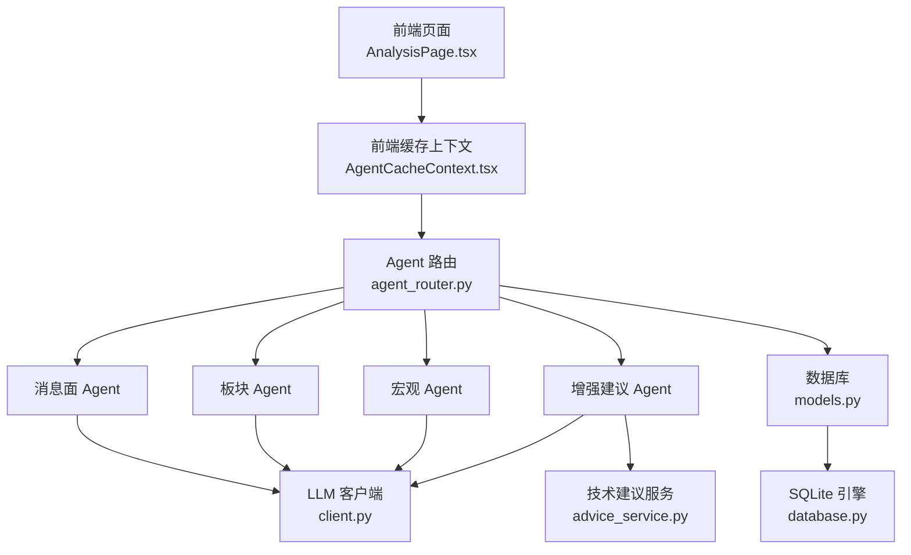
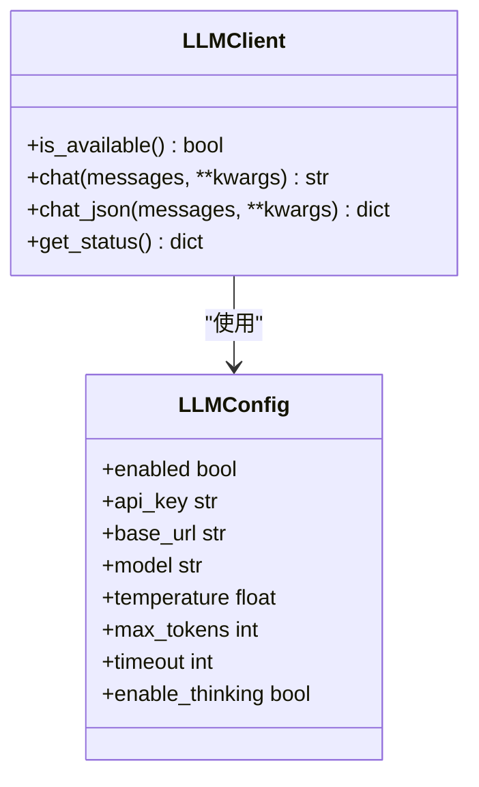
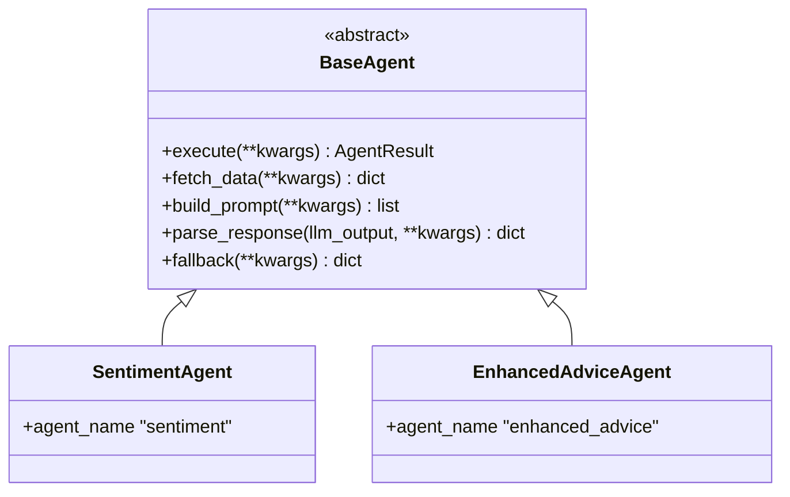
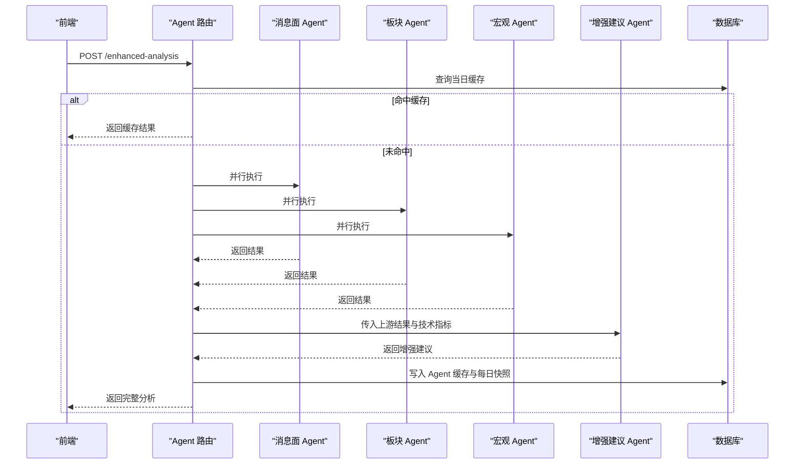
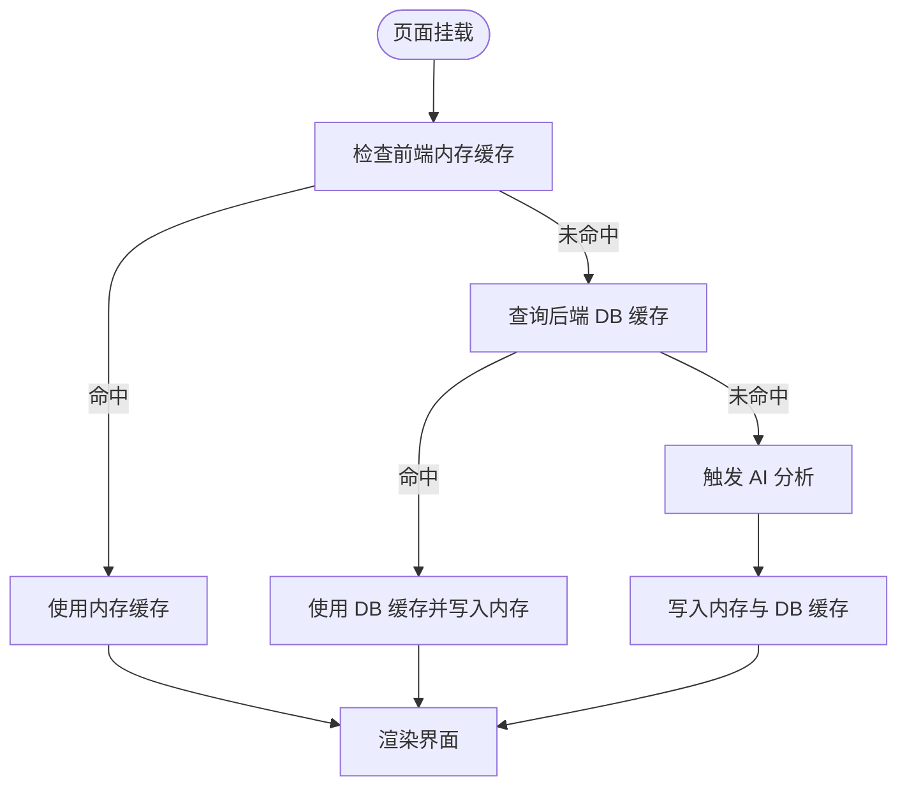
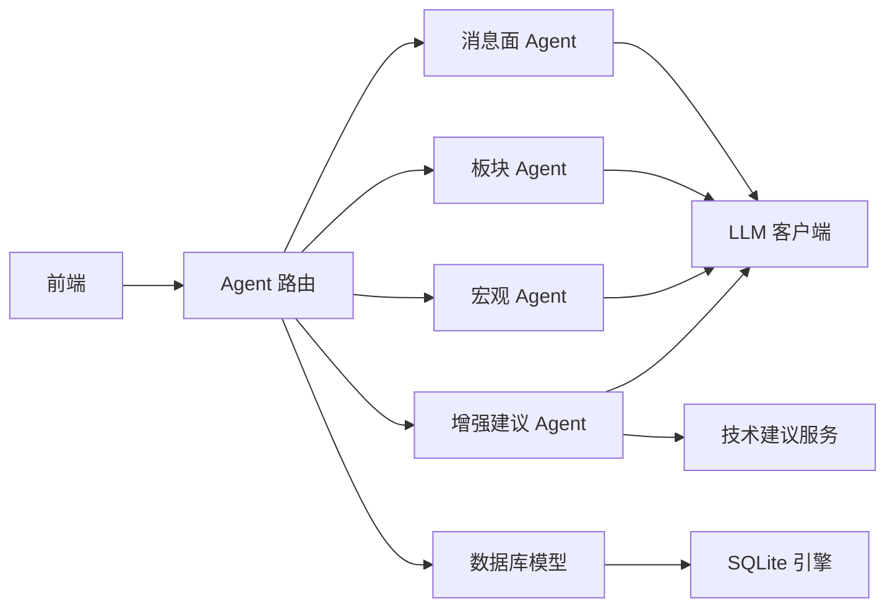

# 代码审查文档

<cite>
**本文档引用的文件**
- [backend/app/main.py](file://backend/app/main.py)
- [backend/app/db/database.py](file://backend/app/db/database.py)
- [backend/app/models/models.py](file://backend/app/models/models.py)
- [backend/app/llm/client.py](file://backend/app/llm/client.py)
- [backend/app/llm/prompts.py](file://backend/app/llm/prompts.py)
- [backend/app/agents/base_agent.py](file://backend/app/agents/base_agent.py)
- [backend/app/agents/sentiment_agent.py](file://backend/app/agents/sentiment_agent.py)
- [backend/app/agents/enhanced_advice_agent.py](file://backend/app/agents/enhanced_advice_agent.py)
- [backend/app/routers/agent_router.py](file://backend/app/routers/agent_router.py)
- [backend/app/services/advice_service.py](file://backend/app/services/advice_service.py)
- [frontend/src/App.tsx](file://frontend/src/App.tsx)
- [frontend/src/contexts/AgentCacheContext.tsx](file://frontend/src/contexts/AgentCacheContext.tsx)
- [frontend/src/pages/AnalysisPage.tsx](file://frontend/src/pages/AnalysisPage.tsx)
- [doc/产品设计文档.md](file://doc/产品设计文档.md)
- [skills/公告搜索/announcement-search/scripts/__main__.py](file://skills/公告搜索/announcement-search/scripts/__main__.py)
</cite>

## 目录
1. [简介](#简介)
2. [项目结构](#项目结构)
3. [核心组件](#核心组件)
4. [架构总览](#架构总览)
5. [详细组件分析](#详细组件分析)
6. [依赖关系分析](#依赖关系分析)
7. [性能考量](#性能考量)
8. [故障排查指南](#故障排查指南)
9. [结论](#结论)
10. [附录](#附录)

## 简介
本项目是一个面向个人投资者的股票分析应用，采用前后端分离架构，后端基于 FastAPI + SQLAlchemy，前端基于 React + Ant Design，通过 LLM Agent 链路融合技术面、消息面、板块联动与宏观环境四个维度，提供可解释性的增强版买卖建议。系统强调数据驱动、可解释性和自我进化，并通过本地 SQLite 数据库存储用户操作记录、K线缓存与 Agent 结果。

## 项目结构
项目采用按功能域划分的目录组织方式：
- backend：后端应用，包含路由、服务、模型、数据库、LLM 客户端与 Agent 实现
- frontend：前端应用，包含页面、组件、上下文与服务封装
- skills：外部技能脚本集合，提供公告搜索等数据源能力
- doc：产品设计文档与评审记录

**图表来源**
- [backend/app/main.py:1-74](file://backend/app/main.py#L1-L74)
- [backend/app/routers/agent_router.py:1-395](file://backend/app/routers/agent_router.py#L1-L395)
- [backend/app/models/models.py:1-151](file://backend/app/models/models.py#L1-L151)
- [backend/app/db/database.py:1-34](file://backend/app/db/database.py#L1-L34)
- [backend/app/llm/client.py:1-146](file://backend/app/llm/client.py#L1-L146)
- [frontend/src/App.tsx:1-39](file://frontend/src/App.tsx#L1-L39)
- [frontend/src/contexts/AgentCacheContext.tsx:1-139](file://frontend/src/contexts/AgentCacheContext.tsx#L1-L139)
- [frontend/src/pages/AnalysisPage.tsx:1-691](file://frontend/src/pages/AnalysisPage.tsx#L1-L691)
- [skills/公告搜索/announcement-search/scripts/__main__.py:1-223](file://skills/公告搜索/announcement-search/scripts/__main__.py#L1-L223)

**章节来源**
- [backend/app/main.py:1-74](file://backend/app/main.py#L1-L74)
- [doc/产品设计文档.md:1-446](file://doc/产品设计文档.md#L1-L446)

## 核心组件
- 应用入口与生命周期：统一日志格式、CORS 配置、数据库初始化、路由注册
- 数据库与模型：SQLite 引擎、WAL 模式、ORM 基类与会话管理；定义关注股票、交易记录、K线缓存、Agent 结果缓存、每日快照、数据源缓存、持仓信息等表
- LLM 客户端：OpenAI 兼容 API 封装，支持重试、JSON 解析容错、配置热重载
- Agent 抽象与实现：模板方法模式，定义统一执行流程；消息面、板块、宏观、增强建议 Agent
- 路由与缓存：并行执行上游 Agent，按 09:00 边界缓存，写入 Agent 结果缓存与每日快照
- 前端缓存与页面：前端内存缓存对齐后端缓存新鲜度，分析页面集成图表与 AI 分析面板

**章节来源**
- [backend/app/main.py:1-74](file://backend/app/main.py#L1-L74)
- [backend/app/db/database.py:1-34](file://backend/app/db/database.py#L1-L34)
- [backend/app/models/models.py:1-151](file://backend/app/models/models.py#L1-L151)
- [backend/app/llm/client.py:1-146](file://backend/app/llm/client.py#L1-L146)
- [backend/app/agents/base_agent.py:1-119](file://backend/app/agents/base_agent.py#L1-L119)
- [backend/app/routers/agent_router.py:1-395](file://backend/app/routers/agent_router.py#L1-L395)
- [frontend/src/contexts/AgentCacheContext.tsx:1-139](file://frontend/src/contexts/AgentCacheContext.tsx#L1-L139)

## 架构总览
系统采用“前端页面 + 后端 API + LLM Agent + 本地缓存”的分层架构。后端通过 FastAPI 提供 REST 接口，Agent 路由负责编排上游 Agent 并聚合增强建议；前端通过上下文缓存与页面组件实现交互体验与缓存一致性。

**图表来源**
- [frontend/src/pages/AnalysisPage.tsx:1-691](file://frontend/src/pages/AnalysisPage.tsx#L1-L691)
- [frontend/src/contexts/AgentCacheContext.tsx:1-139](file://frontend/src/contexts/AgentCacheContext.tsx#L1-L139)
- [backend/app/routers/agent_router.py:1-395](file://backend/app/routers/agent_router.py#L1-L395)
- [backend/app/agents/sentiment_agent.py:1-91](file://backend/app/agents/sentiment_agent.py#L1-L91)
- [backend/app/agents/enhanced_advice_agent.py:1-129](file://backend/app/agents/enhanced_advice_agent.py#L1-L129)
- [backend/app/services/advice_service.py:1-193](file://backend/app/services/advice_service.py#L1-L193)
- [backend/app/llm/client.py:1-146](file://backend/app/llm/client.py#L1-L146)
- [backend/app/models/models.py:1-151](file://backend/app/models/models.py#L1-L151)
- [backend/app/db/database.py:1-34](file://backend/app/db/database.py#L1-L34)

## 详细组件分析

### 应用入口与生命周期
- 统一日志格式与 uvicorn 日志格式统一，确保所有日志包含时间戳
- CORS 允许本地开发环境访问
- 数据库初始化与会话管理
- 路由注册：股票、Agent、快照、数据源

**章节来源**
- [backend/app/main.py:1-74](file://backend/app/main.py#L1-L74)

### 数据库与模型
- SQLite 引擎与 WAL 模式提升并发读写性能
- ORM 基类与会话工厂
- 关注股票、交易记录、K线缓存、Agent 结果缓存、每日快照、数据源缓存、持仓信息等模型
- 缓存表使用唯一约束保证幂等

**章节来源**
- [backend/app/db/database.py:1-34](file://backend/app/db/database.py#L1-L34)
- [backend/app/models/models.py:1-151](file://backend/app/models/models.py#L1-L151)

### LLM 客户端
- OpenAI 兼容 Chat Completions API 封装
- 支持超时、重试（指数退避）、JSON 解析容错
- 配置状态脱敏展示，支持热重载
- 通过模块级单例与全局刷新机制保证配置变更生效

**图表来源**
- [backend/app/llm/client.py:1-146](file://backend/app/llm/client.py#L1-L146)

**章节来源**
- [backend/app/llm/client.py:1-146](file://backend/app/llm/client.py#L1-L146)

### Agent 抽象与模板方法
- 统一执行流程：获取数据 → LLM 分析（失败则降级）→ 返回 AgentResult
- AgentResult 结构化输出，包含状态、LLM 使用标记、时间戳与错误信息
- 子类需实现：数据获取、Prompt 构建、响应解析、降级逻辑

**图表来源**
- [backend/app/agents/base_agent.py:1-119](file://backend/app/agents/base_agent.py#L1-L119)
- [backend/app/agents/sentiment_agent.py:1-91](file://backend/app/agents/sentiment_agent.py#L1-L91)
- [backend/app/agents/enhanced_advice_agent.py:1-129](file://backend/app/agents/enhanced_advice_agent.py#L1-L129)

**章节来源**
- [backend/app/agents/base_agent.py:1-119](file://backend/app/agents/base_agent.py#L1-L119)
- [backend/app/agents/sentiment_agent.py:1-91](file://backend/app/agents/sentiment_agent.py#L1-L91)
- [backend/app/agents/enhanced_advice_agent.py:1-129](file://backend/app/agents/enhanced_advice_agent.py#L1-L129)

### Agent 路由与缓存策略
- 按 09:00 作为缓存新鲜度边界，LLM 可用时跳过降级缓存
- 并行执行上游 Agent，主线程写入缓存与快照
- 每日快照表按 agent_type + stock_code + date 唯一，保留当日最新记录
- 支持清理指定股票的 Agent 缓存与数据源缓存

**图表来源**
- [backend/app/routers/agent_router.py:258-354](file://backend/app/routers/agent_router.py#L258-L354)

**章节来源**
- [backend/app/routers/agent_router.py:1-395](file://backend/app/routers/agent_router.py#L1-L395)

### 技术建议服务
- 基于 MACD、KDJ、RSI、均线、布林带等指标生成买卖建议
- 综合评分归一化到 [-1,1]，计算置信度
- 数据不足时返回持有建议与理由

**章节来源**
- [backend/app/services/advice_service.py:1-193](file://backend/app/services/advice_service.py#L1-L193)

### 前端缓存与页面
- 前端内存缓存对齐后端 09:00 边界，支持淘汰策略
- AnalysisPage 首次渲染优先使用内存缓存，随后可查询后端 DB 缓存或触发 AI 分析
- 图表交互与 AI 分析雷达图展示维度评分

**图表来源**
- [frontend/src/pages/AnalysisPage.tsx:95-125](file://frontend/src/pages/AnalysisPage.tsx#L95-L125)
- [frontend/src/contexts/AgentCacheContext.tsx:40-72](file://frontend/src/contexts/AgentCacheContext.tsx#L40-L72)

**章节来源**
- [frontend/src/contexts/AgentCacheContext.tsx:1-139](file://frontend/src/contexts/AgentCacheContext.tsx#L1-L139)
- [frontend/src/pages/AnalysisPage.tsx:1-691](file://frontend/src/pages/AnalysisPage.tsx#L1-L691)

### LLM Prompt 模板
- 消息面情绪分析、板块联动分析、宏观环境感知、增强建议四个 Prompt 模板
- 统一 JSON 输出约束，便于 LLM 结构化输出与解析

**章节来源**
- [backend/app/llm/prompts.py:1-358](file://backend/app/llm/prompts.py#L1-L358)

### 技能脚本（公告搜索）
- CLI 工具支持关键词搜索、批量查询、CSV/JSON/TXT 输出
- 参数校验、结果保存、执行时间统计与详细输出模式

**章节来源**
- [skills/公告搜索/announcement-search/scripts/__main__.py:1-223](file://skills/公告搜索/announcement-search/scripts/__main__.py#L1-L223)

## 依赖关系分析
- 后端模块耦合：路由依赖 Agent、服务与模型；Agent 依赖 LLM 客户端与数据源服务；服务依赖数据库与外部数据源
- 前后端耦合：前端通过 API 路由与后端交互，缓存策略与后端对齐
- 外部依赖：LLM API、SQLite、HTTP 客户端、Ant Design 组件库

**图表来源**
- [backend/app/routers/agent_router.py:1-395](file://backend/app/routers/agent_router.py#L1-L395)
- [backend/app/agents/sentiment_agent.py:1-91](file://backend/app/agents/sentiment_agent.py#L1-L91)
- [backend/app/agents/enhanced_advice_agent.py:1-129](file://backend/app/agents/enhanced_advice_agent.py#L1-L129)
- [backend/app/services/advice_service.py:1-193](file://backend/app/services/advice_service.py#L1-L193)
- [backend/app/llm/client.py:1-146](file://backend/app/llm/client.py#L1-L146)
- [backend/app/models/models.py:1-151](file://backend/app/models/models.py#L1-L151)
- [backend/app/db/database.py:1-34](file://backend/app/db/database.py#L1-L34)

**章节来源**
- [backend/app/routers/agent_router.py:1-395](file://backend/app/routers/agent_router.py#L1-L395)
- [frontend/src/App.tsx:1-39](file://frontend/src/App.tsx#L1-L39)

## 性能考量
- 数据库并发：SQLite 启用 WAL 模式，提升并发读写
- 缓存策略：按 09:00 边界与 Agent 类型分别缓存，避免重复 LLM 调用
- 并行执行：上游 Agent 并行，缩短总响应时间
- 前端缓存：内存缓存减少重复请求，淘汰策略控制内存占用
- 图表性能：ECharts 选项优化，数据压缩与按需渲染

[本节为通用性能讨论，无需具体文件分析]

## 故障排查指南
- LLM 不可用：检查配置状态端点与热重载端点；确认 API Key 与 base_url；查看降级输出
- 缓存异常：使用清理缓存端点清除指定股票的 Agent 与数据源缓存；检查缓存新鲜度边界
- 数据库问题：确认数据库初始化与连接参数；检查唯一约束冲突
- 前端缓存不一致：确认前端缓存边界与后端一致；必要时手动刷新

**章节来源**
- [backend/app/routers/agent_router.py:360-395](file://backend/app/routers/agent_router.py#L360-L395)
- [backend/app/llm/client.py:104-126](file://backend/app/llm/client.py#L104-L126)

## 结论
该项目在架构设计上实现了清晰的分层与职责分离，后端通过 Agent 链路将多维度数据融合为可解释的增强建议，前端通过缓存与交互优化提升了用户体验。SQLite 与 WAL 模式、缓存策略与并行执行等手段有效平衡了性能与可维护性。建议后续关注配置热重载的健壮性、缓存一致性的监控与告警，以及前端缓存淘汰策略的可观测性。

[本节为总结性内容，无需具体文件分析]

## 附录
- 产品设计文档明确了功能模块、数据架构、技术选型与版本规划，为代码实现提供了指导
- 技能脚本补充了公告搜索等外部数据源能力

**章节来源**
- [doc/产品设计文档.md:1-446](file://doc/产品设计文档.md#L1-L446)
- [skills/公告搜索/announcement-search/scripts/__main__.py:1-223](file://skills/公告搜索/announcement-search/scripts/__main__.py#L1-L223)