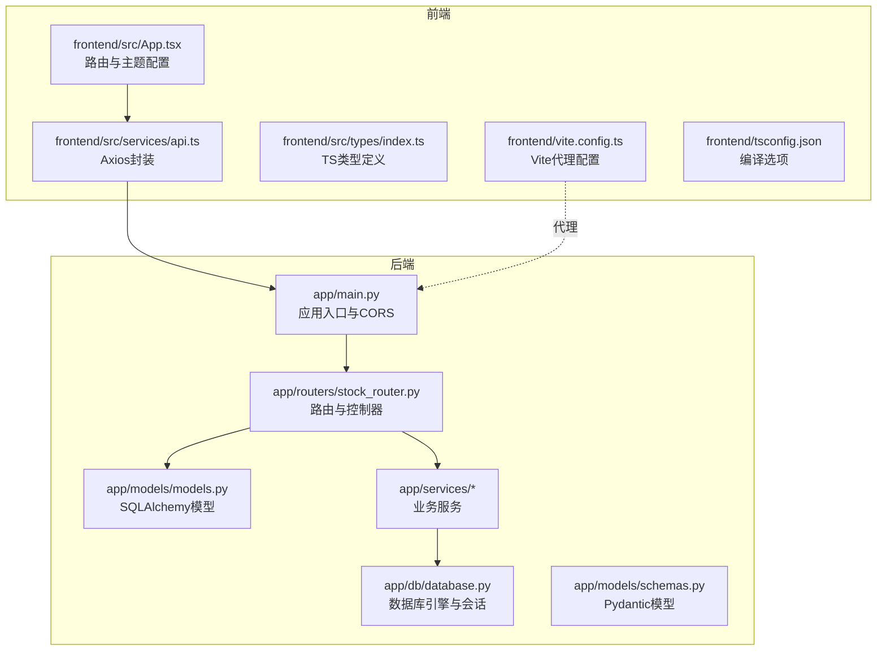
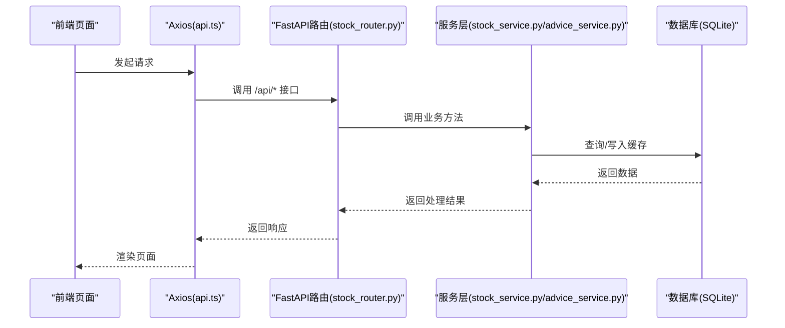
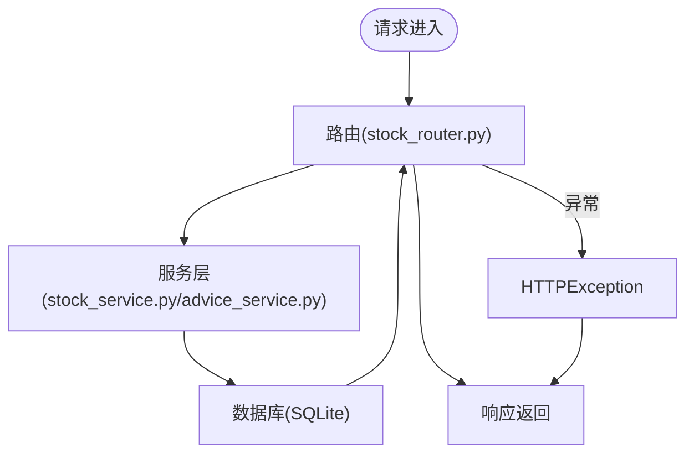
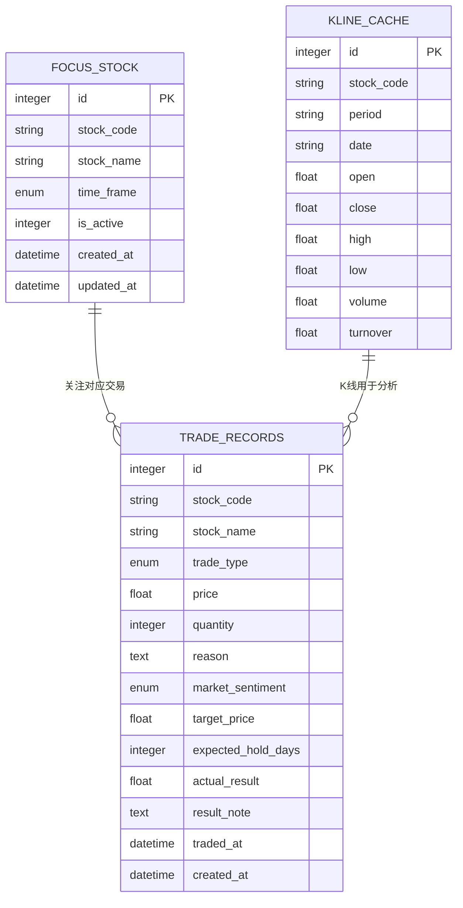
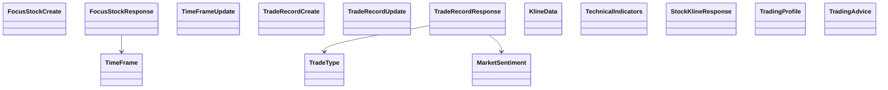
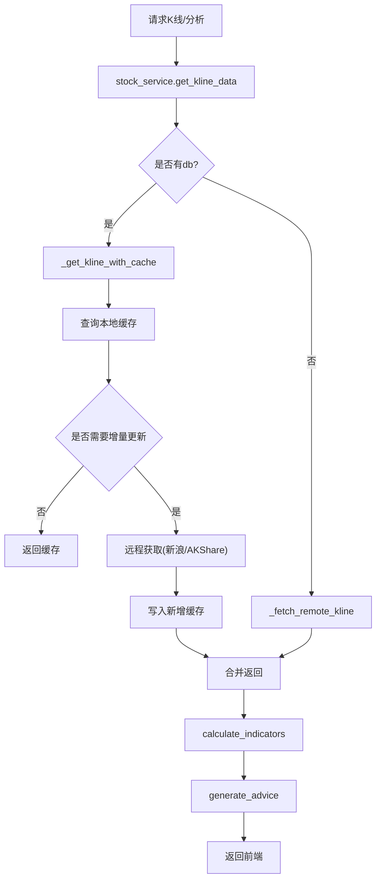
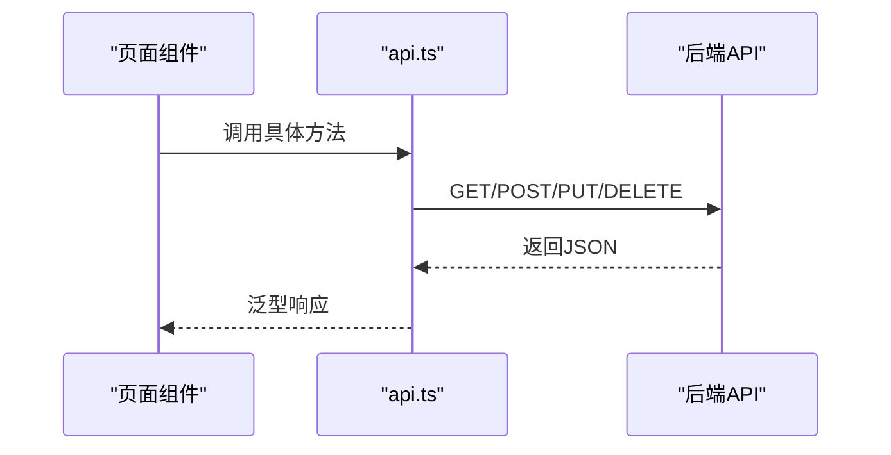
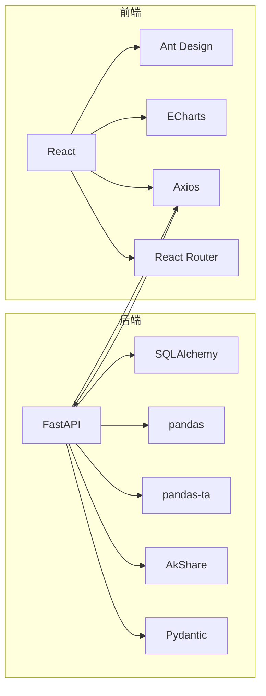

# 代码规范

<cite>
**本文引用的文件**

- [backend/app/main.py](file://backend/app/main.py)

- [backend/app/db/database.py](file://backend/app/db/database.py)

- [backend/app/models/models.py](file://backend/app/models/models.py)

- [backend/app/models/schemas.py](file://backend/app/models/schemas.py)

- [backend/app/routers/stock_router.py](file://backend/app/routers/stock_router.py)

- [backend/app/services/stock_service.py](file://backend/app/services/stock_service.py)

- [backend/app/services/advice_service.py](file://backend/app/services/advice_service.py)

- [backend/requirements.txt](file://backend/requirements.txt)

- [frontend/src/App.tsx](file://frontend/src/App.tsx)

- [frontend/src/services/api.ts](file://frontend/src/services/api.ts)

- [frontend/src/types/index.ts](file://frontend/src/types/index.ts)

- [frontend/vite.config.ts](file://frontend/vite.config.ts)

- [frontend/tsconfig.json](file://frontend/tsconfig.json)

- [frontend/package.json](file://frontend/package.json)

- [doc/技术架构文档.md](file://doc/技术架构文档.md)

- [doc/产品设计文档.md](file://doc/产品设计文档.md)
</cite>

## 目录
1. [简介](#简介)

2. [项目结构](#项目结构)

3. [核心组件](#核心组件)

4. [架构总览](#架构总览)

5. [详细组件分析](#详细组件分析)

6. [依赖分析](#依赖分析)

7. [性能考虑](#性能考虑)

8. [故障排查指南](#故障排查指南)

9. [结论](#结论)

10. [附录](#附录)

## 简介
本文件为 Stock Foker 项目的统一代码规范标准，覆盖后端 Python 与前端 TypeScript 的编码风格、命名约定、注释规范、文件组织结构、数据库模型设计、API 接口命名、错误处理与格式化工具配置，并提供代码审查清单与最佳实践建议。目标是确保团队协作一致性、可维护性与可扩展性。

## 项目结构
项目采用前后端分离架构，后端基于 FastAPI + SQLAlchemy，前端基于 React + Vite + TypeScript。文档中提供了清晰的目录结构与职责划分，便于建立一致的代码规范。

**图示来源**

- [backend/app/main.py:1-28](file://backend/app/main.py#L1-L28)

- [backend/app/db/database.py:1-24](file://backend/app/db/database.py#L1-L24)

- [backend/app/models/models.py:1-75](file://backend/app/models/models.py#L1-L75)

- [backend/app/models/schemas.py:1-118](file://backend/app/models/schemas.py#L1-L118)

- [backend/app/routers/stock_router.py:1-197](file://backend/app/routers/stock_router.py#L1-L197)

- [backend/app/services/stock_service.py:1-327](file://backend/app/services/stock_service.py#L1-L327)

- [backend/app/services/advice_service.py:1-193](file://backend/app/services/advice_service.py#L1-L193)

- [frontend/src/App.tsx:1-27](file://frontend/src/App.tsx#L1-L27)

- [frontend/src/services/api.ts:1-68](file://frontend/src/services/api.ts#L1-L68)

- [frontend/src/types/index.ts:1-94](file://frontend/src/types/index.ts#L1-L94)

- [frontend/vite.config.ts:1-16](file://frontend/vite.config.ts#L1-L16)

- [frontend/tsconfig.json:1-22](file://frontend/tsconfig.json#L1-L22)

**章节来源**

- [doc/技术架构文档.md:19-67](file://doc/技术架构文档.md#L19-L67)

## 核心组件
- 后端应用入口负责注册中间件、挂载路由与数据库初始化。

- 数据库层提供引擎、会话工厂与基础模型基类，统一依赖注入。

- 模型层定义 SQLAlchemy 数据模型与枚举类型，保证数据一致性。

- 路由层集中定义 API 接口，遵循统一的路径与响应模型。

- 服务层封装业务逻辑，如行情数据获取、技术指标计算与买卖建议生成。

- 前端应用负责路由、主题与国际化配置，API 封装统一调用后端接口。

**章节来源**

- [backend/app/main.py:1-28](file://backend/app/main.py#L1-L28)

- [backend/app/db/database.py:1-24](file://backend/app/db/database.py#L1-L24)

- [backend/app/models/models.py:1-75](file://backend/app/models/models.py#L1-L75)

- [backend/app/routers/stock_router.py:1-197](file://backend/app/routers/stock_router.py#L1-L197)

- [backend/app/services/stock_service.py:1-327](file://backend/app/services/stock_service.py#L1-L327)

- [backend/app/services/advice_service.py:1-193](file://backend/app/services/advice_service.py#L1-L193)

- [frontend/src/App.tsx:1-27](file://frontend/src/App.tsx#L1-L27)

- [frontend/src/services/api.ts:1-68](file://frontend/src/services/api.ts#L1-L68)

## 架构总览
后端采用 FastAPI + SQLAlchemy，前端采用 React + Vite + TypeScript。数据流从前端发起，经 Axios 调用后端 API，后端路由处理请求，调用服务层完成数据获取与计算，最终返回给前端渲染。

**图示来源**

- [frontend/src/services/api.ts:1-68](file://frontend/src/services/api.ts#L1-L68)

- [backend/app/routers/stock_router.py:1-197](file://backend/app/routers/stock_router.py#L1-L197)

- [backend/app/services/stock_service.py:131-237](file://backend/app/services/stock_service.py#L131-L237)

- [backend/app/services/advice_service.py:4-173](file://backend/app/services/advice_service.py#L4-L173)

- [backend/app/db/database.py:1-24](file://backend/app/db/database.py#L1-L24)

## 详细组件分析

### 后端：FastAPI 应用与路由
- 应用入口负责 CORS 配置、挂载路由与启动事件初始化数据库。

- 路由模块集中定义关注、搜索、K线与分析、交易记录、炒股画像等接口，统一前缀与标签。

- 错误处理：捕获业务异常并转换为 HTTP 异常，返回统一错误码与消息。

**图示来源**

- [backend/app/main.py:1-28](file://backend/app/main.py#L1-L28)

- [backend/app/routers/stock_router.py:1-197](file://backend/app/routers/stock_router.py#L1-L197)

- [backend/app/services/stock_service.py:1-327](file://backend/app/services/stock_service.py#L1-L327)

- [backend/app/services/advice_service.py:1-193](file://backend/app/services/advice_service.py#L1-L193)

**章节来源**

- [backend/app/main.py:1-28](file://backend/app/main.py#L1-L28)

- [backend/app/routers/stock_router.py:1-197](file://backend/app/routers/stock_router.py#L1-L197)

### 后端：数据库模型与枚举
- 使用 SQLAlchemy 2.0 DeclarativeBase，定义关注股票、交易记录、K线缓存三张表。

- 枚举类型 TimeFrame、TradeType、MarketSentiment 统一在模型层定义，保证一致性。

- K线缓存表设置唯一约束，避免重复数据。

**图示来源**

- [backend/app/models/models.py:25-75](file://backend/app/models/models.py#L25-L75)

**章节来源**

- [backend/app/models/models.py:1-75](file://backend/app/models/models.py#L1-L75)

### 后端：Pydantic 模型与接口响应
- 使用 Pydantic 定义请求/响应模型，确保数据校验与序列化一致性。

- 响应模型启用 from_attributes，兼容 SQLAlchemy 查询结果。

- 技术指标与分析结果以结构化对象返回，前端类型定义保持一致。

**图示来源**

- [backend/app/models/schemas.py:1-118](file://backend/app/models/schemas.py#L1-L118)

- [backend/app/models/models.py:8-23](file://backend/app/models/models.py#L8-L23)

**章节来源**

- [backend/app/models/schemas.py:1-118](file://backend/app/models/schemas.py#L1-L118)

- [frontend/src/types/index.ts:1-94](file://frontend/src/types/index.ts#L1-L94)

### 后端：服务层（行情与建议）
- 行情服务：优先使用新浪接口，失败则降级至 AKShare；支持增量缓存与本地写入。

- 技术指标：基于 pandas-ta 计算 MA、MACD、KDJ、RSI、布林带等。

- 建议服务：综合多指标给出买卖建议与置信度，附带推理过程。

**图示来源**

- [backend/app/services/stock_service.py:131-237](file://backend/app/services/stock_service.py#L131-L237)

- [backend/app/services/stock_service.py:255-327](file://backend/app/services/stock_service.py#L255-L327)

- [backend/app/services/advice_service.py:4-173](file://backend/app/services/advice_service.py#L4-L173)

**章节来源**

- [backend/app/services/stock_service.py:1-327](file://backend/app/services/stock_service.py#L1-L327)

- [backend/app/services/advice_service.py:1-193](file://backend/app/services/advice_service.py#L1-L193)

### 前端：React + Vite + TypeScript
- 应用入口配置路由、主题与语言包，统一颜色与尺寸令牌。

- API 封装使用 Axios，统一 base URL 与泛型响应类型。

- 类型定义与后端模型保持一致，确保强类型约束。

**图示来源**

- [frontend/src/App.tsx:1-27](file://frontend/src/App.tsx#L1-L27)

- [frontend/src/services/api.ts:1-68](file://frontend/src/services/api.ts#L1-L68)

- [frontend/vite.config.ts:1-16](file://frontend/vite.config.ts#L1-L16)

- [frontend/tsconfig.json:1-22](file://frontend/tsconfig.json#L1-L22)

**章节来源**

- [frontend/src/App.tsx:1-27](file://frontend/src/App.tsx#L1-L27)

- [frontend/src/services/api.ts:1-68](file://frontend/src/services/api.ts#L1-L68)

- [frontend/src/types/index.ts:1-94](file://frontend/src/types/index.ts#L1-L94)

- [frontend/vite.config.ts:1-16](file://frontend/vite.config.ts#L1-L16)

- [frontend/tsconfig.json:1-22](file://frontend/tsconfig.json#L1-L22)

## 依赖分析
- 后端依赖：FastAPI、Uvicorn、SQLAlchemy、AkShare、Pandas、pandas-ta、Pydantic、HTTPX 等。

- 前端依赖：React、Ant Design、ECharts、Axios、React Router、Day.js 等。

- 代理与构建：Vite 代理将 /api 转发到后端，前端构建产物由后端托管或静态部署。

**图示来源**

- [backend/requirements.txt:1-10](file://backend/requirements.txt#L1-L10)

- [frontend/package.json:1-30](file://frontend/package.json#L1-L30)

**章节来源**

- [backend/requirements.txt:1-10](file://backend/requirements.txt#L1-L10)

- [frontend/package.json:1-30](file://frontend/package.json#L1-L30)

## 性能考虑
- 前端：严格开启 TypeScript 严格模式与未使用检查，减少运行时错误；合理拆分组件，避免不必要的重渲染。

- 后端：K线缓存策略减少重复请求；技术指标计算使用向量化库 pandas-ta；接口层尽量短路异常，避免无效计算。

- 代理与跨域：前端 Vite 代理到后端，减少跨域复杂度；后端 FastAPI 配置 CORS 时限定来源与方法。

[本节为通用指导，无需特定文件引用]

## 故障排查指南
- 后端异常：路由层捕获业务异常并抛出 HTTP 异常，返回统一错误码与消息，便于前端统一处理。

- 数据库连接：确认数据库初始化在启动事件中执行，会话工厂正确注入。

- 前端代理：确认 Vite 代理配置指向后端地址，避免 404 或跨域问题。

**章节来源**

- [backend/app/routers/stock_router.py:70-96](file://backend/app/routers/stock_router.py#L70-L96)

- [backend/app/main.py:20-22](file://backend/app/main.py#L20-L22)

- [frontend/vite.config.ts:8-13](file://frontend/vite.config.ts#L8-L13)

## 结论
通过统一的代码规范与工具链配置，Stock Foker 项目能够在前后端协同开发中保持一致性、可维护性与可扩展性。建议在团队内推广本规范，并结合 CI/CD 在提交前强制执行格式化与类型检查。

[本节为总结，无需特定文件引用]

## 附录

### Python 后端代码规范（PEP8 及项目约定）
- 命名约定

  - 模块与包：小写下划线命名（如 routers、services）。

  - 类：PascalCase（如 FocusStock、TradeRecord）。

  - 函数与方法：snake_case（如 get_kline_data、calculate_indicators）。

  - 常量：大写下划线（如 DATABASE_URL）。

  - 私有成员：下划线前缀（如 _get_kline_sina）。

- 注释规范

  - 模块与类：使用文档字符串描述用途与行为。

  - 函数：参数、返回值与异常明确标注；复杂逻辑添加简要说明。

  - 行内注释：仅在必要处解释“为什么”而非“做什么”。

- 文件组织

  - 按功能分层：routers、services、models、db。

  - 依赖导入：标准库、第三方库、项目内部模块分组，组间空行分隔。

- 错误处理

  - 业务异常捕获后转换为 HTTPException，统一状态码与消息。

  - 数据库事务：try/finally 确保关闭会话。

- 数据库模型

  - 字段类型与长度：VARCHAR(N)、INTEGER、DATETIME 等明确指定。

  - 枚举：在模型层定义并在 Pydantic 模型中复用。

  - 唯一约束：如 KlineCache 的 (stock_code, period, date)。

- API 接口命名

  - 路由前缀：/api，标签：stocks。

  - 动词与路径：GET/POST/PUT/DELETE 与资源路径一致。

  - 响应模型：统一使用 Pydantic 模型，启用 from_attributes。

- 格式化工具

  - Black：统一 Python 代码风格，建议在 pre-commit 钩子中执行。

  - Flake8/Pyflakes：静态检查，结合类型检查器。

  - mypy：类型检查（可选，配合 Pydantic）。

- 代码审查清单

  - 是否遵循命名约定与注释规范？

  - 是否存在硬编码字符串？是否抽取为常量或配置？

  - 是否处理了所有异常路径并返回统一错误格式？

  - 是否使用 Pydantic 校验输入输出？

  - 是否有必要的日志记录与错误追踪？

**章节来源**

- [backend/app/models/models.py:1-75](file://backend/app/models/models.py#L1-L75)

- [backend/app/models/schemas.py:1-118](file://backend/app/models/schemas.py#L1-L118)

- [backend/app/routers/stock_router.py:1-197](file://backend/app/routers/stock_router.py#L1-L197)

- [backend/app/services/stock_service.py:1-327](file://backend/app/services/stock_service.py#L1-L327)

- [backend/app/services/advice_service.py:1-193](file://backend/app/services/advice_service.py#L1-L193)

### TypeScript 前端代码风格指南
- 命名约定

  - 组件：PascalCase（如 AnalysisPage、TradesPage）。

  - 类型：PascalCase（如 FocusStock、TradeRecord）。

  - 变量与函数：camelCase（如 getStockAnalysis、updateTradeRecord）。

  - 常量：大写下划线（如 API_BASE_URL）。

- 组件命名规范

  - 页面组件：以 Page 结尾（如 AnalysisPage.tsx）。

  - 布局组件：以 Layout 结尾（如 MainLayout.tsx）。

  - 工具组件：语义化命名（如 SearchBar、ChartContainer）。

- 接口定义规范

  - 类型与后端模型一一对应，可选字段使用 ?。

  - 数组与嵌套对象明确类型，避免 any。

  - 与后端枚举保持字符串字面量联合类型一致。

- 状态管理规范

  - 简单状态：在组件内 useState 管理。

  - 共享状态：使用 Context 或轻量状态库（如 Zustand）。

  - 异步状态：统一使用 Promise 与错误边界处理。

- 格式化工具

  - Prettier：统一代码风格，与 ESLint 配合。

  - ESLint：禁用危险规则（如 no-explicit-any），启用 React Hooks 规则。

  - TypeScript 编译选项：严格模式、未使用变量/参数检查。

- 代码审查清单

  - 是否使用 TypeScript 类型约束？

  - 是否处理了所有异步错误与空值？

  - 是否避免了深层嵌套与重复逻辑？

  - 是否使用语义化组件命名与目录结构？

  - 是否在组件中集中处理副作用（如 useEffect）？

**章节来源**

- [frontend/src/App.tsx:1-27](file://frontend/src/App.tsx#L1-L27)

- [frontend/src/services/api.ts:1-68](file://frontend/src/services/api.ts#L1-L68)

- [frontend/src/types/index.ts:1-94](file://frontend/src/types/index.ts#L1-L94)

- [frontend/vite.config.ts:1-16](file://frontend/vite.config.ts#L1-L16)

- [frontend/tsconfig.json:1-22](file://frontend/tsconfig.json#L1-L22)

### 数据库模型设计规范
- 字段类型与长度：VARCHAR(N)、INTEGER、DATETIME、TEXT、FLOAT 明确指定。

- 枚举：在模型层定义枚举并在相关字段使用。

- 约束：主键、唯一约束、索引（如 stock_code）。

- 默认值：created_at 使用 server_default，updated_at 使用 onupdate。

- 唯一约束：KlineCache 的 (stock_code, period, date)。

**章节来源**

- [backend/app/models/models.py:25-75](file://backend/app/models/models.py#L25-L75)

### API 接口命名规范
- 路由前缀：/api，标签：stocks。

- 资源路径：复数形式（如 /api/trades），更新与删除使用资源 ID。

- 动作语义：GET 列表/详情，POST 创建，PUT 更新，DELETE 删除。

- 响应模型：统一使用 Pydantic 模型，确保 from_attributes。

**章节来源**

- [backend/app/routers/stock_router.py:15-197](file://backend/app/routers/stock_router.py#L15-L197)

- [doc/技术架构文档.md:119-152](file://doc/技术架构文档.md#L119-L152)

### 错误处理规范
- 后端：捕获业务异常并抛出 HTTPException，返回统一状态码与消息。

- 前端：Axios 拦截器统一处理错误，提示用户或记录日志。

- 日志：关键流程与异常路径记录日志，便于排查。

**章节来源**

- [backend/app/routers/stock_router.py:70-96](file://backend/app/routers/stock_router.py#L70-L96)

- [frontend/src/services/api.ts:1-68](file://frontend/src/services/api.ts#L1-L68)

### 代码格式化工具配置示例
- Black（Python）

  - 安装：pip install black

  - 使用：black backend/

  - 集成：pre-commit 钩子执行 black

- Prettier（TypeScript/前端）

  - 安装：npm install -D prettier

  - 使用：npx prettier --write frontend/src/

  - 集成：pre-commit 钩子执行 prettier

- ESLint（TypeScript/前端）

  - 安装：npm install -D eslint @typescript-eslint/eslint-plugin @typescript-eslint/parser

  - 使用：npx eslint frontend/src/ --fix

  - 配置要点：禁用 no-explicit-any，启用 react-hooks 规则

**章节来源**

- [frontend/package.json:22-28](file://frontend/package.json#L22-L28)

### 代码审查检查清单
- Python

  - 命名与注释是否符合规范？

  - 是否使用 Pydantic 校验输入输出？

  - 是否处理了所有异常路径？

  - 是否使用 SQLAlchemy 会话并正确关闭？

  - 是否有必要的日志与错误追踪？

- TypeScript

  - 类型定义是否与后端一致？

  - 是否处理了所有异步错误与空值？

  - 是否避免了深层嵌套与重复逻辑？

  - 是否使用语义化组件命名与目录结构？

  - 是否在组件中集中处理副作用？

**章节来源**

- [backend/app/models/schemas.py:1-118](file://backend/app/models/schemas.py#L1-L118)

- [frontend/src/types/index.ts:1-94](file://frontend/src/types/index.ts#L1-L94)
