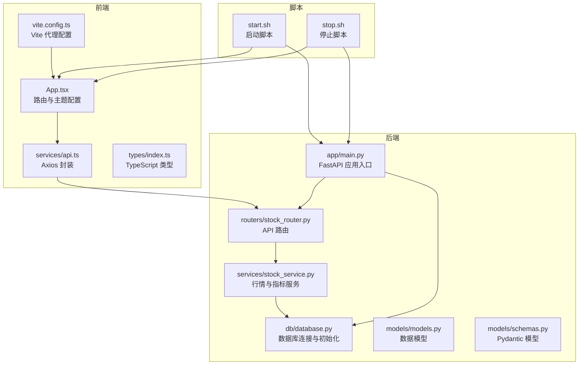
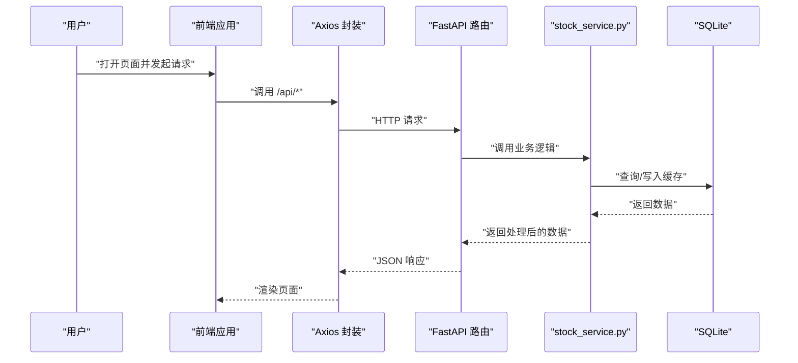
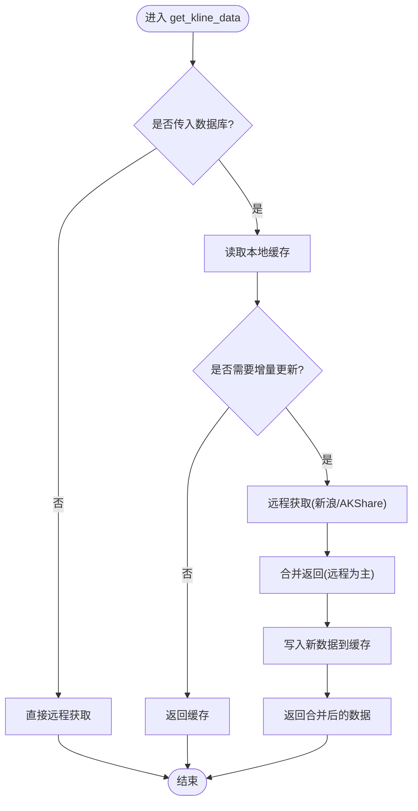
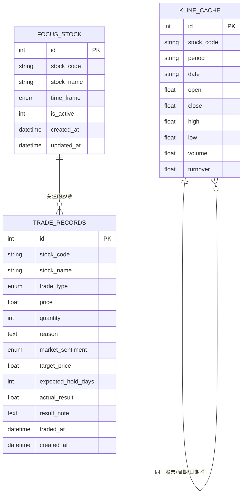
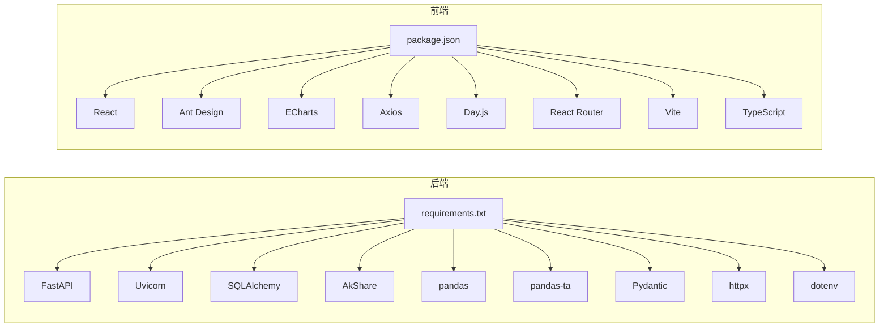

# 开发指南

<cite>
**本文引用的文件**

- [backend/app/main.py](file://backend/app/main.py)

- [backend/app/routers/stock_router.py](file://backend/app/routers/stock_router.py)

- [backend/app/services/stock_service.py](file://backend/app/services/stock_service.py)

- [backend/app/db/database.py](file://backend/app/db/database.py)

- [backend/app/models/models.py](file://backend/app/models/models.py)

- [backend/app/models/schemas.py](file://backend/app/models/schemas.py)

- [backend/requirements.txt](file://backend/requirements.txt)

- [frontend/src/App.tsx](file://frontend/src/App.tsx)

- [frontend/src/services/api.ts](file://frontend/src/services/api.ts)

- [frontend/src/types/index.ts](file://frontend/src/types/index.ts)

- [frontend/vite.config.ts](file://frontend/vite.config.ts)

- [frontend/package.json](file://frontend/package.json)

- [frontend/tsconfig.json](file://frontend/tsconfig.json)

- [start.sh](file://start.sh)

- [stop.sh](file://stop.sh)

- [doc/技术架构文档.md](file://doc/技术架构文档.md)
</cite>

## 目录
1. [简介](#简介)

2. [项目结构](#项目结构)

3. [核心组件](#核心组件)

4. [架构总览](#架构总览)

5. [详细组件分析](#详细组件分析)

6. [依赖分析](#依赖分析)

7. [性能考虑](#性能考虑)

8. [测试策略与用例编写](#测试策略与用例编写)

9. [Git 工作流程与分支管理](#git-工作流程与分支管理)

10. [构建、打包与部署](#构建打包与部署)

11. [常见问题与排障](#常见问题与排障)

12. [结论](#结论)

## 简介
Stock Foker 是一个前后端分离的股票分析与交易记录管理应用，采用 Python FastAPI 作为后端，React + Vite + TypeScript 作为前端，使用 SQLite 本地存储与 pandas-ta 进行技术指标计算，并通过 AkShare 与新浪财经接口获取行情数据。系统提供“股票关注”“K线与技术指标”“买卖建议”“交易记录管理”“炒股画像”等功能模块。

## 项目结构
- 后端位于 backend/，包含数据库连接、模型、路由与服务层。

- 前端位于 frontend/，包含页面、组件、类型定义与 API 封装。

- 启动与停止脚本位于根目录，用于一键启动/停止前后端服务。

- 文档位于 doc/，包含技术架构与产品设计说明。

图表来源

- [backend/app/main.py:1-28](file://backend/app/main.py#L1-L28)

- [backend/app/routers/stock_router.py:1-197](file://backend/app/routers/stock_router.py#L1-L197)

- [backend/app/services/stock_service.py:1-327](file://backend/app/services/stock_service.py#L1-L327)

- [backend/app/db/database.py:1-24](file://backend/app/db/database.py#L1-L24)

- [backend/app/models/models.py:1-75](file://backend/app/models/models.py#L1-L75)

- [backend/app/models/schemas.py:1-118](file://backend/app/models/schemas.py#L1-L118)

- [frontend/src/App.tsx:1-27](file://frontend/src/App.tsx#L1-L27)

- [frontend/src/services/api.ts:1-65](file://frontend/src/services/api.ts#L1-L65)

- [frontend/src/types/index.ts:1-94](file://frontend/src/types/index.ts#L1-L94)

- [frontend/vite.config.ts:1-16](file://frontend/vite.config.ts#L1-L16)

- [start.sh:1-113](file://start.sh#L1-L113)

- [stop.sh:1-56](file://stop.sh#L1-L56)

章节来源

- [doc/技术架构文档.md:19-67](file://doc/技术架构文档.md#L19-L67)

## 核心组件
- 后端应用入口与中间件：在应用入口中启用 CORS 并挂载路由；在启动事件中初始化数据库。

- 路由层：集中定义股票关注、搜索、K线与分析、交易记录、炒股画像等 API。

- 服务层：负责股票数据获取、本地缓存、技术指标计算与买卖建议生成。

- 数据层：基于 SQLAlchemy 的模型与数据库初始化，SQLite 本地存储。

- 前端应用：基于 React Router 的 SPA 路由，Ant Design 主题与国际化，ECharts 可视化。

- 前端 API 封装：统一的 Axios 实例，基于 TypeScript 类型进行参数与返回值约束。

- 构建与代理：Vite 提供开发服务器与代理，将 /api 代理至后端。

章节来源

- [backend/app/main.py:1-28](file://backend/app/main.py#L1-L28)

- [backend/app/routers/stock_router.py:1-197](file://backend/app/routers/stock_router.py#L1-L197)

- [backend/app/services/stock_service.py:1-327](file://backend/app/services/stock_service.py#L1-L327)

- [backend/app/db/database.py:1-24](file://backend/app/db/database.py#L1-L24)

- [backend/app/models/models.py:1-75](file://backend/app/models/models.py#L1-L75)

- [backend/app/models/schemas.py:1-118](file://backend/app/models/schemas.py#L1-L118)

- [frontend/src/App.tsx:1-27](file://frontend/src/App.tsx#L1-L27)

- [frontend/src/services/api.ts:1-65](file://frontend/src/services/api.ts#L1-L65)

- [frontend/src/types/index.ts:1-94](file://frontend/src/types/index.ts#L1-L94)

- [frontend/vite.config.ts:1-16](file://frontend/vite.config.ts#L1-L16)

## 架构总览
系统采用“前端 SPA + 后端 API + 本地数据库”的三层架构。前端通过 Axios 发起请求，Vite 在开发时将 /api 代理到后端；后端通过 FastAPI 路由接收请求，调用服务层进行数据获取与计算，最终返回 JSON 响应。

图表来源

- [frontend/src/services/api.ts:1-65](file://frontend/src/services/api.ts#L1-L65)

- [backend/app/routers/stock_router.py:1-197](file://backend/app/routers/stock_router.py#L1-L197)

- [backend/app/services/stock_service.py:1-327](file://backend/app/services/stock_service.py#L1-L327)

- [backend/app/db/database.py:1-24](file://backend/app/db/database.py#L1-L24)

## 详细组件分析

### 后端应用入口与中间件
- 初始化 FastAPI 应用，配置 CORS 允许前端地址访问。

- 包含启动事件，初始化数据库。

- 挂载股票相关路由。

章节来源

- [backend/app/main.py:1-28](file://backend/app/main.py#L1-L28)

### 路由与控制器
- 股票关注：获取当前关注、设置关注（自动取消旧关注）、更新时间框架、获取历史关注。

- 股票搜索：按关键字搜索股票。

- K线与分析：获取 K 线、计算技术指标、生成买卖建议并返回组合数据。

- 交易记录：列出、新增、更新、删除交易记录。

- 炒股画像：按条件生成交易画像。

章节来源

- [backend/app/routers/stock_router.py:1-197](file://backend/app/routers/stock_router.py#L1-L197)

### 服务层：股票数据与技术指标
- 股票搜索：从本地缓存或远程接口加载股票列表并过滤。

- K线获取：优先使用本地缓存，缺失部分增量拉取远程；支持新浪与 AKShare 双数据源。

- 技术指标：基于 pandas-ta 计算均线、MACD、KDJ、RSI、布林带等。

- 错误处理：统一捕获异常并抛出 HTTP 异常。

图表来源

- [backend/app/services/stock_service.py:131-238](file://backend/app/services/stock_service.py#L131-L238)

章节来源

- [backend/app/services/stock_service.py:1-327](file://backend/app/services/stock_service.py#L1-L327)

### 数据模型与数据库
- 模型：FocusStock、TradeRecord、KlineCache。

- 枚举：TimeFrame、TradeType、MarketSentiment。

- 数据库：SQLite，初始化时创建所有表；提供会话工厂与依赖注入。

图表来源

- [backend/app/models/models.py:25-75](file://backend/app/models/models.py#L25-L75)

- [backend/app/db/database.py:1-24](file://backend/app/db/database.py#L1-L24)

章节来源

- [backend/app/models/models.py:1-75](file://backend/app/models/models.py#L1-L75)

- [backend/app/db/database.py:1-24](file://backend/app/db/database.py#L1-L24)

### 前端应用与类型系统
- 路由：基于 React Router 的 SPA，配置 Ant Design 国际化与主题色。

- API 封装：统一 baseURL 为 /api，对各接口进行类型化封装。

- 类型定义：涵盖关注股票、搜索结果、K线、指标、买卖建议、交易记录、画像等。

章节来源

- [frontend/src/App.tsx:1-27](file://frontend/src/App.tsx#L1-L27)

- [frontend/src/services/api.ts:1-65](file://frontend/src/services/api.ts#L1-L65)

- [frontend/src/types/index.ts:1-94](file://frontend/src/types/index.ts#L1-L94)

### Vite 代理与开发服务器
- Vite 配置将 /api 代理到后端 127.0.0.1:8000，便于前后端联调。

- 前端默认端口 5173，后端默认端口 8000。

章节来源

- [frontend/vite.config.ts:1-16](file://frontend/vite.config.ts#L1-L16)

## 依赖分析
- 后端依赖：FastAPI、Uvicorn、SQLAlchemy、AkShare、pandas、pandas-ta、Pydantic、httpx、dotenv。

- 前端依赖：React、React DOM、Ant Design、ECharts、Axios、Day.js、React Router、Vite、TypeScript。

- 依赖版本与安装方式见 requirements.txt 与 package.json。

图表来源

- [backend/requirements.txt:1-10](file://backend/requirements.txt#L1-L10)

- [frontend/package.json:1-30](file://frontend/package.json#L1-L30)

章节来源

- [backend/requirements.txt:1-10](file://backend/requirements.txt#L1-L10)

- [frontend/package.json:1-30](file://frontend/package.json#L1-L30)

## 性能考虑
- 数据缓存：后端对 K 线数据进行本地缓存，减少重复网络请求与计算开销。

- 增量更新：仅拉取缺失日期的数据并写入缓存，避免全量下载。

- 指标计算：使用 pandas-ta 进行批量化计算，避免逐条循环。

- 前端渲染：使用 ECharts 渲染 K 线与指标，合理分页与懒加载可降低首屏压力。

- 代理与并发：Vite 代理简化跨域，生产环境建议使用反向代理统一处理跨域与静态资源。

## 测试策略与用例编写
- 单元测试

  - 路由层：针对每个 API 路由构造请求，验证响应结构与状态码。

  - 服务层：对股票搜索、K线获取、技术指标计算进行输入输出断言。

  - 数据层：对模型与数据库初始化进行单元测试，确保表结构与约束正确。

- 集成测试

  - 端到端：从前端调用到后端路由与服务，再到数据库，验证完整链路。

  - 数据一致性：验证缓存写入、更新与查询的一致性。

- 前端测试

  - 组件测试：对页面与组件进行快照与交互测试。

  - 类型安全：确保 API 返回值与类型定义一致。

- 测试工具建议

  - 后端：pytest + httpx 或 FastAPI TestClient。

  - 前端：Vitest/Jest + React Testing Library。

- 测试用例示例思路

  - 路由：GET /api/focus、POST /api/focus、PUT /api/focus/timeframe、GET /api/focus/history。

  - 服务：搜索关键词命中、空结果、异常降级（新浪失败时回退 AKShare）。

  - 数据：交易记录 CRUD、画像聚合统计。

## Git 工作流程与分支管理
- 分支策略

  - main：稳定发布分支。

  - develop：日常开发分支，从 main 分支切出，定期同步。

  - feature/*：功能开发分支，完成后合并至 develop。

  - hotfix/*：线上紧急修复分支，从 main 切出，修复后同时合并至 develop 与 main。

- 提交规范

  - 类型：feat、fix、docs、style、refactor、test、chore。

  - 示例：feat(router): 添加股票搜索接口。

- 合并与审查

  - Pull Request：功能完成后提交 PR，至少一名同事审查。

  - 代码风格：遵循后端 Python 与前端 TypeScript 规范。

- 日志与版本

  - 使用语义化版本，变更日志记录主要改动。

## 构建、打包与部署
- 开发启动

  - 使用启动脚本一键安装依赖并启动后端与前端服务。

  - 后端端口：8000；前端端口：5173；Vite 代理 /api 至后端。

- 生产构建

  - 前端：执行构建脚本生成静态资源，部署至 Web 服务器或 CDN。

  - 后端：打包为可执行应用或容器镜像，配合反向代理暴露端口。

- 部署建议

  - 反向代理：Nginx/Apache，开启 gzip、缓存静态资源。

  - HTTPS：为域名配置证书。

  - 数据备份：定期备份 SQLite 数据库文件。

  - 监控与日志：记录访问日志与错误日志，设置告警。

章节来源

- [start.sh:1-113](file://start.sh#L1-L113)

- [stop.sh:1-56](file://stop.sh#L1-L56)

- [doc/技术架构文档.md:180-197](file://doc/技术架构文档.md#L180-L197)

## 常见问题与排障
- 启动失败

  - 检查端口占用：8000 与 5173；脚本提供兜底清理。

  - 依赖安装：后端使用清华源安装，前端使用国内镜像源。

- CORS 问题

  - 确认前端代理与后端允许的源一致。

- 数据获取失败

  - 新浪接口不可用时自动降级至 AKShare；若仍失败，检查网络与超时设置。

- 缓存不生效

  - 确认 SQLite 数据库文件存在且权限正确；检查唯一约束与日期格式。

- 前端路由

  - 确保 Vite 代理配置正确，避免 404。

章节来源

- [start.sh:40-87](file://start.sh#L40-L87)

- [stop.sh:40-48](file://stop.sh#L40-L48)

- [backend/app/services/stock_service.py:240-253](file://backend/app/services/stock_service.py#L240-L253)

- [frontend/vite.config.ts:8-14](file://frontend/vite.config.ts#L8-L14)

## 结论
本指南提供了 Stock Foker 从环境搭建、开发规范、测试策略、Git 工作流到构建部署的全流程说明。建议团队在开发过程中严格遵循类型与模型约束，保持前后端接口契约稳定，并持续优化数据缓存与指标计算性能，以提升用户体验与系统稳定性。
