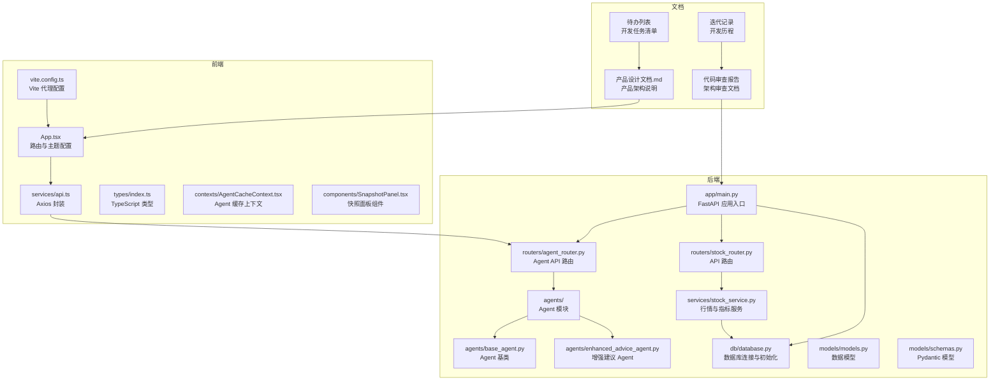
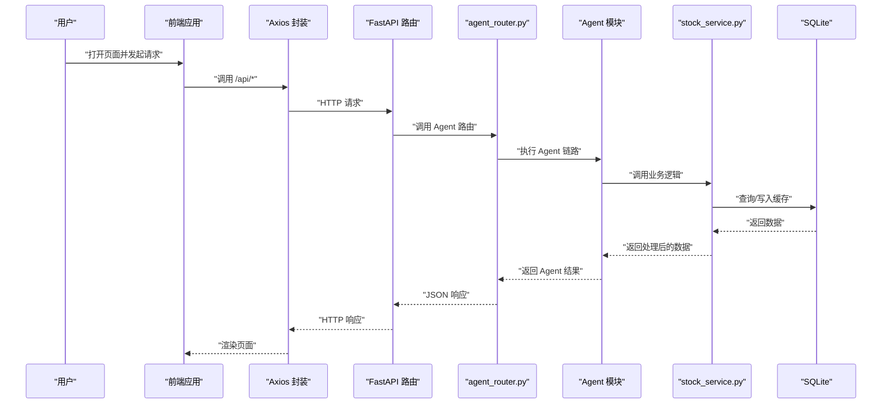
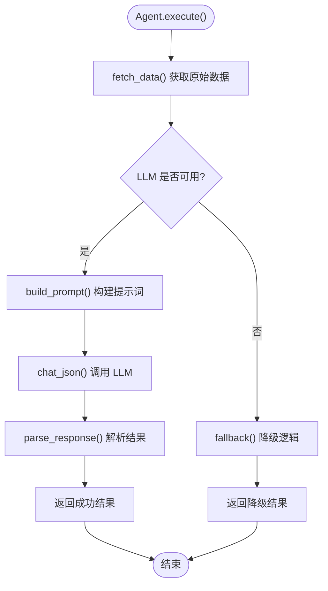
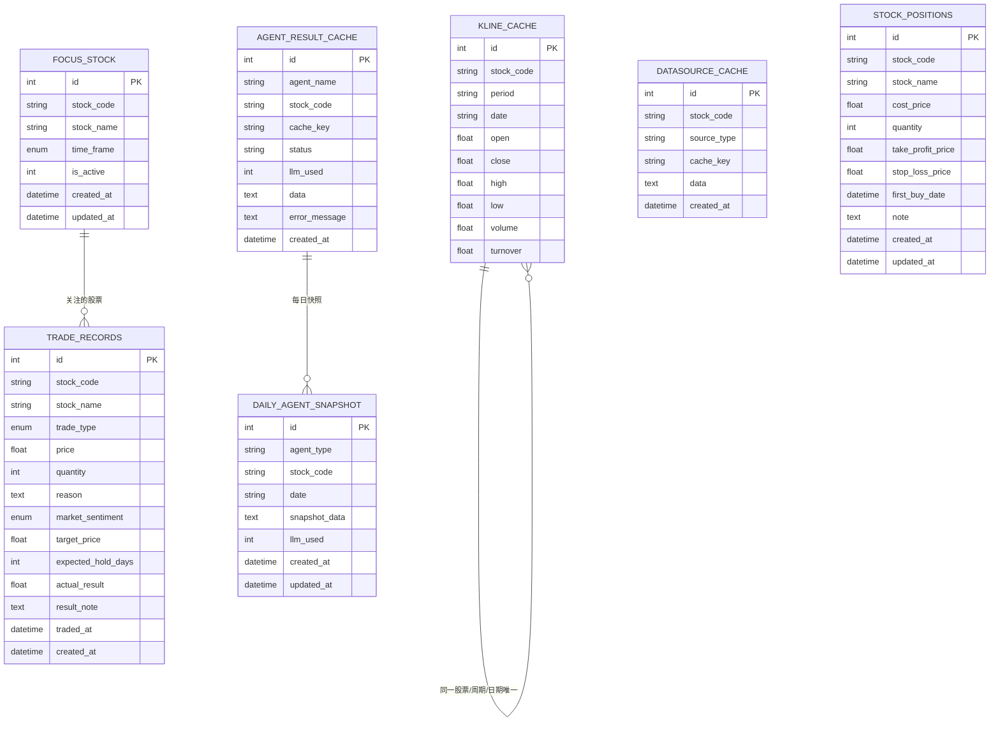
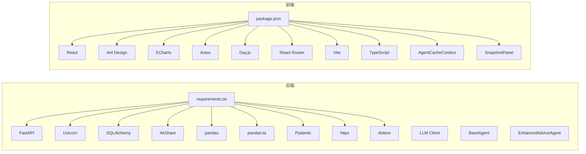

# 开发指南

<cite>
**本文引用的文件**
- [backend/app/main.py](file://backend/app/main.py)
- [backend/app/routers/stock_router.py](file://backend/app/routers/stock_router.py)
- [backend/app/services/stock_service.py](file://backend/app/services/stock_service.py)
- [backend/app/db/database.py](file://backend/app/db/database.py)
- [backend/app/models/models.py](file://backend/app/models/models.py)
- [backend/app/models/schemas.py](file://backend/app/models/schemas.py)
- [backend/app/agents/base_agent.py](file://backend/app/agents/base_agent.py)
- [backend/app/agents/enhanced_advice_agent.py](file://backend/app/agents/enhanced_advice_agent.py)
- [backend/app/routers/agent_router.py](file://backend/app/routers/agent_router.py)
- [frontend/src/App.tsx](file://frontend/src/App.tsx)
- [frontend/src/services/api.ts](file://frontend/src/services/api.ts)
- [frontend/src/types/index.ts](file://frontend/src/types/index.ts)
- [frontend/src/contexts/AgentCacheContext.tsx](file://frontend/src/contexts/AgentCacheContext.tsx)
- [frontend/src/components/SnapshotPanel.tsx](file://frontend/src/components/SnapshotPanel.tsx)
- [frontend/vite.config.ts](file://frontend/vite.config.ts)
- [frontend/package.json](file://frontend/package.json)
- [frontend/tsconfig.json](file://frontend/tsconfig.json)
- [start.sh](file://start.sh)
- [stop.sh](file://stop.sh)
- [doc/产品设计文档.md](file://doc/产品设计文档.md)
- [doc/代码审查/2026-04-11-phase1-architecture-review.md](file://doc/代码审查/2026-04-11-phase1-architecture-review.md)
- [doc/代码审查/2026-04-11-phase1-fix-report.md](file://doc/代码审查/2026-04-11-phase1-fix-report.md)
- [doc/待办列表/2026-04-06-phase2-agent.md](file://doc/待办列表/2026-04-06-phase2-agent.md)
- [doc/待办列表/2026-04-09-agent-cache.md](file://doc/待办列表/2026-04-09-agent-cache.md)
- [doc/待办列表/2026-04-11-skill-agent-integration.md](file://doc/待办列表/2026-04-11-skill-agent-integration.md)
- [doc/迭代记录/2026-04-06-phase2-agent.md](file://doc/迭代记录/2026-04-06-phase2-agent.md)
- [doc/迭代记录/2026-04-09-agent-cache.md](file://doc/迭代记录/2026-04-09-agent-cache.md)
</cite>

## 更新摘要
**变更内容**
- 新增架构审查文档章节，包含代码审查发现的问题与修复方案
- 新增待办列表章节，涵盖 Agent 链路、缓存机制、技能集成等开发任务
- 新增迭代记录章节，详细记录 Agent 实现和缓存机制的开发历程
- 更新核心组件分析，增加 Agent 模块和缓存系统的详细说明
- 新增 Agent 缓存上下文和快照面板的前端实现分析
- 更新性能考虑章节，增加 Agent 响应时间和缓存优化策略
- 新增测试策略章节，包含 Agent 单元测试和缓存测试方案

## 目录
1. [简介](#简介)
2. [项目结构](#项目结构)
3. [核心组件](#核心组件)
4. [架构总览](#架构总览)
5. [详细组件分析](#详细组件分析)
6. [架构审查与修复](#架构审查与修复)
7. [待办列表与开发计划](#待办列表与开发计划)
8. [依赖分析](#依赖分析)
9. [性能考虑](#性能考虑)
10. [测试策略与用例编写](#测试策略与用例编写)
11. [Git 工作流程与分支管理](#git-工作流程与分支管理)
12. [构建、打包与部署](#构建打包与部署)
13. [常见问题与排障](#常见问题与排障)
14. [结论](#结论)

## 简介
Stock Foker 是一个前后端分离的股票分析与交易记录管理应用，采用 Python FastAPI 作为后端，React + Vite + TypeScript 作为前端，使用 SQLite 本地存储与 pandas-ta 进行技术指标计算，并通过 AkShare 与新浪财经接口获取行情数据。系统提供"股票关注""K线与技术指标""买卖建议""交易记录管理""炒股画像"等功能模块。项目已实现第二阶段核心功能：LLM Agent 链路全栈实现，包括消息面情绪分析、板块联动分析、宏观环境感知、增强版综合建议四个 Agent，以及对应的前端页面和 AI 设置页。

## 项目结构
- 后端位于 backend/，包含数据库连接、模型、路由与服务层，以及新增的 Agent 模块
- 前端位于 frontend/，包含页面、组件、类型定义与 API 封装，新增 Agent 缓存上下文和快照面板
- 文档位于 doc/，包含产品设计、架构审查、待办列表、迭代记录等技术文档
- 技能位于 skills/，包含各种金融数据查询技能

**图表来源**
- [backend/app/main.py:1-28](file://backend/app/main.py#L1-L28)
- [backend/app/routers/agent_router.py:1-395](file://backend/app/routers/agent_router.py#L1-L395)
- [backend/app/agents/base_agent.py:1-119](file://backend/app/agents/base_agent.py#L1-L119)
- [backend/app/agents/enhanced_advice_agent.py:1-129](file://backend/app/agents/enhanced_advice_agent.py#L1-L129)
- [frontend/src/contexts/AgentCacheContext.tsx:1-139](file://frontend/src/contexts/AgentCacheContext.tsx#L1-L139)
- [frontend/src/components/SnapshotPanel.tsx:1-436](file://frontend/src/components/SnapshotPanel.tsx#L1-L436)

**章节来源**
- [doc/产品设计文档.md:19-67](file://doc/产品设计文档.md#L19-L67)
- [doc/产品设计文档.md:248-268](file://doc/产品设计文档.md#L248-L268)

## 核心组件
- 后端应用入口与中间件：在应用入口中启用 CORS 并挂载路由；在启动事件中初始化数据库。
- 路由层：集中定义股票关注、搜索、K线与分析、交易记录、炒股画像、Agent API 等 API。
- Agent 模块：实现消息面、板块联动、宏观环境、增强建议四个 Agent，采用模板方法模式。
- 服务层：负责股票数据获取、本地缓存、技术指标计算与买卖建议生成。
- 数据层：基于 SQLAlchemy 的模型与数据库初始化，SQLite 本地存储，新增 Agent 缓存和快照表。
- 前端应用：基于 React Router 的 SPA 路由，Ant Design 主题与国际化，ECharts 可视化。
- 前端缓存系统：Agent 缓存上下文提供前端内存缓存，支持 9点边界对齐和LRU淘汰。
- 前端快照面板：展示 Agent 每日关键指标快照，支持历史记录查看和联动刷新。

**章节来源**
- [backend/app/main.py:1-28](file://backend/app/main.py#L1-L28)
- [backend/app/routers/agent_router.py:1-395](file://backend/app/routers/agent_router.py#L1-L395)
- [backend/app/agents/base_agent.py:1-119](file://backend/app/agents/base_agent.py#L1-L119)
- [backend/app/agents/enhanced_advice_agent.py:1-129](file://backend/app/agents/enhanced_advice_agent.py#L1-L129)
- [frontend/src/contexts/AgentCacheContext.tsx:1-139](file://frontend/src/contexts/AgentCacheContext.tsx#L1-L139)
- [frontend/src/components/SnapshotPanel.tsx:1-436](file://frontend/src/components/SnapshotPanel.tsx#L1-L436)

## 架构总览
系统采用"前端 SPA + 后端 API + 本地数据库"的三层架构。前端通过 Axios 发起请求，Vite 在开发时将 /api 代理到后端；后端通过 FastAPI 路由接收请求，调用服务层进行数据获取与计算，最终返回 JSON 响应。新增的 Agent 模块通过模板方法模式实现，支持并行执行和降级策略。

**图表来源**
- [frontend/src/services/api.ts:1-65](file://frontend/src/services/api.ts#L1-L65)
- [backend/app/routers/agent_router.py:258-354](file://backend/app/routers/agent_router.py#L258-L354)
- [backend/app/agents/base_agent.py:62-102](file://backend/app/agents/base_agent.py#L62-L102)

## 详细组件分析

### 后端应用入口与中间件
- 初始化 FastAPI 应用，配置 CORS 允许前端地址访问。
- 包含启动事件，初始化数据库。
- 挂载股票相关路由和 Agent 路由。

**章节来源**
- [backend/app/main.py:1-28](file://backend/app/main.py#L1-L28)

### 路由与控制器
- 股票关注：获取当前关注、设置关注（自动取消旧关注）、更新时间框架、获取历史关注。
- 股票搜索：按关键字搜索股票。
- K线与分析：获取 K 线、计算技术指标、生成买卖建议并返回组合数据。
- 交易记录：列出、新增、更新、删除交易记录。
- 炒股画像：按条件生成交易画像。
- Agent API：消息面、板块、宏观、增强建议分析，以及 LLM 状态查询和缓存管理。

**章节来源**
- [backend/app/routers/stock_router.py:1-197](file://backend/app/routers/stock_router.py#L1-L197)
- [backend/app/routers/agent_router.py:186-395](file://backend/app/routers/agent_router.py#L186-L395)

### Agent 模块：模板方法模式实现
- Agent 基类：定义统一的执行流程，包括数据获取、LLM 分析、降级处理。
- 增强建议 Agent：融合技术面、消息面、板块联动、宏观环境四个维度。
- 并行执行：使用 ThreadPoolExecutor 并行执行三个上游 Agent。
- 缓存机制：支持前端内存缓存和后端数据库缓存，9点边界对齐。

**图表来源**
- [backend/app/agents/base_agent.py:62-102](file://backend/app/agents/base_agent.py#L62-L102)

**章节来源**
- [backend/app/agents/base_agent.py:1-119](file://backend/app/agents/base_agent.py#L1-L119)
- [backend/app/agents/enhanced_advice_agent.py:1-129](file://backend/app/agents/enhanced_advice_agent.py#L1-L129)

### 服务层：股票数据与技术指标
- 股票搜索：从本地缓存或远程接口加载股票列表并过滤。
- K线获取：优先使用本地缓存，缺失部分增量拉取远程；支持新浪与 AKShare 双数据源。
- 技术指标：基于 pandas-ta 计算均线、MACD、KDJ、RSI、布林带等。
- 错误处理：统一捕获异常并抛出 HTTP 异常。

**章节来源**
- [backend/app/services/stock_service.py:1-327](file://backend/app/services/stock_service.py#L1-L327)

### 数据模型与数据库
- 模型：FocusStock、TradeRecord、KlineCache、AgentResultCache、DailyAgentSnapshot、DataSourceCache、StockPosition。
- 枚举：TimeFrame、TradeType、MarketSentiment、RecordMode。
- 数据库：SQLite，初始化时创建所有表；提供会话工厂与依赖注入。
- 新增缓存表：AgentResultCache 和 DailyAgentSnapshot 支持 Agent 结果缓存和快照功能。

**图表来源**
- [backend/app/models/models.py:30-151](file://backend/app/models/models.py#L30-L151)

**章节来源**
- [backend/app/models/models.py:1-151](file://backend/app/models/models.py#L1-L151)

### 前端应用与类型系统
- 路由：基于 React Router 的 SPA，配置 Ant Design 国际化与主题色。
- API 封装：统一 baseURL 为 /api，对各接口进行类型化封装。
- 类型定义：涵盖关注股票、搜索结果、K线、指标、买卖建议、交易记录、画像、Agent 结果等。
- 缓存上下文：AgentCacheContext 提供前端内存缓存，支持 9点边界对齐和LRU淘汰。
- 快照面板：SnapshotPanel 组件展示 Agent 每日关键指标快照，支持历史记录查看。

**章节来源**
- [frontend/src/App.tsx:1-27](file://frontend/src/App.tsx#L1-L27)
- [frontend/src/services/api.ts:1-65](file://frontend/src/services/api.ts#L1-L65)
- [frontend/src/types/index.ts:1-94](file://frontend/src/types/index.ts#L1-L94)
- [frontend/src/contexts/AgentCacheContext.tsx:1-139](file://frontend/src/contexts/AgentCacheContext.tsx#L1-L139)
- [frontend/src/components/SnapshotPanel.tsx:1-436](file://frontend/src/components/SnapshotPanel.tsx#L1-L436)

### Vite 代理与开发服务器
- Vite 配置将 /api 代理到后端 127.0.0.1:8000，便于前后端联调。
- 前端默认端口 5173，后端默认端口 8000。

**章节来源**
- [frontend/vite.config.ts:1-16](file://frontend/vite.config.ts#L1-L16)

## 架构审查与修复

### 代码审查发现问题
根据 2026-04-11 的架构审查报告，发现了以下问题：

**严重问题（P0）**
- SQLite Session 跨线程共享：ThreadPoolExecutor 并行 3 个 Agent，同一 db Session 被传入所有线程
- SectorAgent 降级路径签名不匹配：else 分支调用 `fetch_concept_boards()` 不传 stock_name

**中等问题（P1）**
- LLM 重试无退避间隔：3 次重试无 sleep，对限流 API 无帮助
- 数据源缓存双重查询：先查 data 再查 created_at，合计 2 次 SQL
- 快照校验错误消息不完整：错误消息写死，未包含 enhanced_advice
- 删除交易记录未回滚持仓：删除 realtime 记录时未反向更新持仓
- K 线缓存盘中更新遗漏 turnover：当日数据 `.update()` 遗漏 turnover 字段
- 前端内存缓存无上限：Map 缓存随浏览股票持续增长，无淘汰机制
- FocusStock 并发设置竞态：并发请求可能产生两条 is_active=1 记录

**轻微问题（P2）**
- 缺少数据库索引：focus_stock、trade_records 表缺少索引
- on_event startup 已弃用：FastAPI 0.95+ 推荐 lifespan 替代 on_event
- stock_service 全局列表缓存无过期：模块级全局变量，进程内不更新
- 数据库 WAL 模式未启用：SQLite 默认 journal 模式，并发性能较差
- CORS 仅限开发地址：allow_origins 硬编码为 localhost:5173
- httpx SSL 证书验证：同花顺 API 禁用了 SSL 验证
- K 线缓存无清理机制：K 线缓存持续追加，无过期删除逻辑

### 修复方案实施
根据修复报告，已实施以下修复：

**P0 严重问题修复**
- 新增 `_run_agent_in_thread()` 函数，在独立线程中创建独立 Session，用完关闭
- 修复 SectorAgent 降级路径，调用 `fetch_concept_boards(stock_name)`

**P1 中等问题修复**
- LLM 重试添加指数退避：`time.sleep(2 ** attempt)`
- 数据源缓存优化：`_get_cached_source` 返回 `(data, created_at)` 元组
- 快照校验错误消息动态拼接：使用 `_VALID_AGENT_TYPES`
- 删除交易记录回滚持仓：删除买入记录减少持仓，删除卖出记录恢复持仓
- K 线缓存补充 turnover 字段：`.update()` 包含 turnover 字段
- 前端缓存淘汰机制：两处缓存均添加基于数量的淘汰机制
- FocusStock 并发设置优化：`set_focus_stock` 中添加 `db.flush()`

**P2 轻微问题修复**
- 新增数据库索引：`FocusStock.stock_code`、`FocusStock.is_active`、`TradeRecord.stock_code`
- 迁移至 lifespan 上下文管理器模式
- 新增全局列表缓存 TTL 机制：4小时过期
- 启用数据库 WAL 模式：通过 SQLAlchemy event listener
- CORS 配置从环境变量读取
- K 线缓存清理机制：删除 400 天前的旧缓存记录

**章节来源**
- [doc/代码审查/2026-04-11-phase1-architecture-review.md:17-245](file://doc/代码审查/2026-04-11-phase1-architecture-review.md#L17-L245)
- [doc/代码审查/2026-04-11-phase1-fix-report.md:18-200](file://doc/代码审查/2026-04-11-phase1-fix-report.md#L18-L200)

## 待办列表与开发计划

### 第二阶段 Agent 链路待办
根据 2026-04-06 的待办列表，当前遗留问题和开发任务包括：

**遗留问题**
- 副图指标面板未实现：MACD/KDJ/RSI 数值已计算传至前端，但 K 线图仅展示均线叠加
- Agent 全链路响应较慢：增强分析全链路约 20-30s，有优化空间
- Agent 页面每次重复调用：消息面、板块联动等页面每次进入都重新调用 Agent
- 缺少大盘整体数据展示：宏观环境页仅有 LLM 分析结论，缺少直观数据展示
- 缺少 Web Search 能力：消息面分析仅依赖 AKShare 新闻接口

**待开发事项**
- 智能选股推荐：基于画像筛选标的，覆盖个股和 ETF
- 复盘模块：单笔复盘 + 周期性报告（周报/月报）
- 回测功能：策略历史数据回测
- 通知与提醒：价格触达、公告、指标信号、止盈止损提醒

**优化建议**
- Agent 响应时间：考虑流式返回（SSE），先展示已完成的 Agent 结果
- LLM 调用优化：精简 Prompt 长度，减少 token 消耗
- 数据抓取并行：data_fetcher 内多个 AKShare 调用可并行化

### Agent 缓存机制待办
根据 2026-04-09 的待办列表，当前开发重点：

**遗留问题**
- 副图指标面板未实现：MACD/KDJ/RSI 独立子图待实现
- 缺少大盘整体数据展示：宏观环境页缺直观数据看板
- 快照面板需手动刷新日期列表：Agent 刷新后快照面板不会自动更新

**待开发事项**
- 大盘数据看板：上证指数、涨跌分布、成交额、北向资金等直观数据
- Web Search 集成：引入搜索能力，消息面分析可关联研报、公告原文
- 产业链关联分析：分析当前股票的上下游公司、供应商、客户、竞争对手

**优化建议**
- localStorage 持久化缓存：应用刷新后可恢复当日缓存
- 多模型切换：Settings 页直接切换不同 LLM 模型
- Prompt 版本管理：Agent Prompt 模板可外置为配置文件

### 技能集成待办
根据 2026-04-11 的待办列表，当前开发重点：

**遗留问题**
- 同花顺 API 实际运行验证：需配置 KEY 后实测各接口返回格式
- Agent 全链路响应时间：已并行化，需实测验证提升效果

**待开发事项**
- 智能选股推荐：基于画像筛选标的
- 复盘模块：单笔复盘 + 周期性报告
- 回测功能：策略历史数据回测
- 通知与提醒：价格触达、公告、止盈止损

**优化建议**
- SSE 流式返回：先展示已完成 Agent，再展示综合建议
- LLM Prompt 截断：数据过长时需精细截断策略

**章节来源**
- [doc/待办列表/2026-04-06-phase2-agent.md:1-66](file://doc/待办列表/2026-04-06-phase2-agent.md#L1-L66)
- [doc/待办列表/2026-04-09-agent-cache.md:1-77](file://doc/待办列表/2026-04-09-agent-cache.md#L1-L77)
- [doc/待办列表/2026-04-11-skill-agent-integration.md:1-63](file://doc/待办列表/2026-04-11-skill-agent-integration.md#L1-L63)

## 依赖分析
- 后端依赖：FastAPI、Uvicorn、SQLAlchemy、AkShare、pandas、pandas-ta、Pydantic、httpx、dotenv。
- 前端依赖：React、React DOM、Ant Design、ECharts、Axios、Day.js、React Router、Vite、TypeScript。
- Agent 依赖：新增 LLM 客户端、Agent 基类、数据抓取服务等模块。
- 技能依赖：aime-skillhub-cli、各种金融数据查询技能。

**图表来源**
- [backend/requirements.txt:1-10](file://backend/requirements.txt#L1-L10)
- [frontend/package.json:1-30](file://frontend/package.json#L1-L30)

**章节来源**
- [backend/requirements.txt:1-10](file://backend/requirements.txt#L1-L10)
- [frontend/package.json:1-30](file://frontend/package.json#L1-L30)

## 性能考虑
- 数据缓存：后端对 K 线数据进行本地缓存，减少重复网络请求与计算开销。
- 增量更新：仅拉取缺失日期的数据并写入缓存，避免全量下载。
- 指标计算：使用 pandas-ta 进行批量化计算，避免逐条循环。
- Agent 并行执行：使用 ThreadPoolExecutor 并行执行三个上游 Agent，减少总响应时间。
- 前端缓存优化：AgentCacheContext 提供前端内存缓存，支持 9点边界对齐和LRU淘汰。
- 缓存边界对齐：前后端缓存均以 09:00 为边界，确保数据新鲜度一致性。
- 数据库优化：新增索引提高查询性能，启用 WAL 模式提升并发性能。
- 前端渲染：使用 ECharts 渲染 K 线与指标，合理分页与懒加载可降低首屏压力。
- 代理与并发：Vite 代理简化跨域，生产环境建议使用反向代理统一处理跨域与静态资源。

**章节来源**
- [backend/app/routers/agent_router.py:294-322](file://backend/app/routers/agent_router.py#L294-L322)
- [frontend/src/contexts/AgentCacheContext.tsx:58-72](file://frontend/src/contexts/AgentCacheContext.tsx#L58-L72)
- [backend/app/models/models.py:122-127](file://backend/app/models/models.py#L122-L127)

## 测试策略与用例编写
- 单元测试
  - 路由层：针对每个 API 路由构造请求，验证响应结构与状态码。
  - Agent 层：对 BaseAgent.execute()、具体 Agent 的 fetch_data、build_prompt、parse_response、fallback 方法进行测试。
  - 服务层：对股票搜索、K线获取、技术指标计算进行输入输出断言。
  - 数据层：对模型与数据库初始化进行单元测试，确保表结构与约束正确。
  - 缓存层：测试 Agent 缓存的读写、过期、淘汰机制。
- 集成测试
  - 端到端：从前端调用到后端路由与服务，再到数据库，验证完整链路。
  - Agent 链路：测试消息面、板块、宏观、增强建议的完整执行流程。
  - 数据一致性：验证缓存写入、更新与查询的一致性。
  - 并发测试：测试多线程环境下 SQLite Session 的正确使用。
- 前端测试
  - 组件测试：对页面与组件进行快照与交互测试。
  - 缓存测试：测试 AgentCacheContext 的缓存读写、过期判断、LRU 淘汰。
  - 类型安全：确保 API 返回值与类型定义一致。
- 性能测试
  - Agent 响应时间：测量并行执行和串行执行的性能差异。
  - 缓存命中率：测试前端和后端缓存的命中率和性能影响。
  - 数据库性能：测试索引优化前后的查询性能对比。
- 测试工具建议
  - 后端：pytest + httpx 或 FastAPI TestClient。
  - 前端：Vitest/Jest + React Testing Library。
  - 性能：Apache JMeter、Artillery。
- 测试用例示例思路
  - 路由：GET /api/focus、POST /api/focus、PUT /api/focus/timeframe、GET /api/focus/history。
  - Agent：消息面情绪分析、板块联动分析、宏观环境分析、增强建议的完整链路测试。
  - 缓存：前端内存缓存、后端数据库缓存、快照功能的测试。
  - 数据：交易记录 CRUD、画像聚合统计、并发设置的关注股票测试。

**章节来源**
- [doc/待办列表/2026-04-06-phase2-agent.md:48-53](file://doc/待办列表/2026-04-06-phase2-agent.md#L48-L53)
- [doc/待办列表/2026-04-09-agent-cache.md:56-61](file://doc/待办列表/2026-04-09-agent-cache.md#L56-L61)

## Git 工作流程与分支管理
- 分支策略
  - main：稳定发布分支。
  - develop：日常开发分支，从 main 分支切出，定期同步。
  - feature/*：功能开发分支，完成后合并至 develop。
  - hotfix/*：线上紧急修复分支，从 main 切出，修复后同时合并至 develop 与 main。
- 提交规范
  - 类型：feat、fix、docs、style、refactor、test、chore。
  - 示例：feat(router): 添加股票搜索接口。
- 合并与审查
  - Pull Request：功能完成后提交 PR，至少一名同事审查。
  - 代码风格：遵循后端 Python 与前端 TypeScript 规范。
- 日志与版本
  - 使用语义化版本，变更日志记录主要改动。
- 文档管理
  - 架构审查文档：每次代码审查后更新。
  - 待办列表：根据开发进展定期更新。
  - 迭代记录：每个开发阶段结束后更新。

**章节来源**
- [doc/代码审查/2026-04-11-phase1-fix-report.md:177-200](file://doc/代码审查/2026-04-11-phase1-fix-report.md#L177-L200)
- [doc/待办列表/2026-04-06-phase2-agent.md:60-66](file://doc/待办列表/2026-04-06-phase2-agent.md#L60-L66)

## 构建、打包与部署
- 开发启动
  - 使用启动脚本一键安装依赖并启动后端与前端服务。
  - 后端端口：8000；前端端口：5173；Vite 代理 /api 至后端。
- 生产构建
  - 前端：执行构建脚本生成静态资源，部署至 Web 服务器或 CDN。
  - 后端：打包为可执行应用或容器镜像，配合反向代理暴露端口。
- 部署建议
  - 反向代理：Nginx/Apache，开启 gzip、缓存静态资源。
  - HTTPS：为域名配置证书。
  - 数据备份：定期备份 SQLite 数据库文件。
  - 监控与日志：记录访问日志与错误日志，设置告警。
  - Agent 配置：通过 .env 文件管理 LLM 配置，支持热重载。

**章节来源**
- [start.sh:1-113](file://start.sh#L1-L113)
- [stop.sh:1-56](file://stop.sh#L1-L56)
- [doc/产品设计文档.md:336-358](file://doc/产品设计文档.md#L336-L358)

## 常见问题与排障
- 启动失败
  - 检查端口占用：8000 与 5173；脚本提供兜底清理。
  - 依赖安装：后端使用清华源安装，前端使用国内镜像源。
- CORS 问题
  - 确认前端代理与后端允许的源一致。
- 数据获取失败
  - 新浪接口不可用时自动降级至 AKShare；若仍失败，检查网络与超时设置。
- 缓存不生效
  - 确认 SQLite 数据库文件存在且权限正确；检查唯一约束与日期格式。
- Agent 并发问题
  - 确认使用 `_run_agent_in_thread()` 创建独立数据库 Session。
- 前端缓存问题
  - 检查 AgentCacheContext 的 9点边界对齐和 LRU 淘汰机制。
- 快照面板问题
  - 确认 `todayStr()` 使用本地时间而非 UTC。
- 前端路由
  - 确保 Vite 代理配置正确，避免 404。

**章节来源**
- [start.sh:40-87](file://start.sh#L40-L87)
- [stop.sh:40-48](file://stop.sh#L40-L48)
- [backend/app/services/stock_service.py:240-253](file://backend/app/services/stock_service.py#L240-L253)
- [frontend/vite.config.ts:8-14](file://frontend/vite.config.ts#L8-L14)
- [doc/代码审查/2026-04-11-phase1-fix-report.md:20-36](file://doc/代码审查/2026-04-11-phase1-fix-report.md#L20-L36)

## 结论
本指南提供了 Stock Foker 从环境搭建、开发规范、测试策略、Git 工作流到构建部署的全流程说明。项目已实现第二阶段核心功能：LLM Agent 链路全栈实现，包括消息面情绪分析、板块联动分析、宏观环境感知、增强版综合建议四个 Agent，以及对应的前端页面和 AI 设置页。通过架构审查和修复，系统在并发处理、缓存机制、错误处理等方面得到显著改进。建议团队在开发过程中严格遵循类型与模型约束，保持前后端接口契约稳定，并持续优化数据缓存与指标计算性能，以提升用户体验与系统稳定性。同时，按照待办列表的开发计划持续推进功能完善和性能优化。

**章节来源**
- [doc/产品设计文档.md:248-268](file://doc/产品设计文档.md#L248-L268)
- [doc/迭代记录/2026-04-06-phase2-agent.md:1-94](file://doc/迭代记录/2026-04-06-phase2-agent.md#L1-L94)
- [doc/迭代记录/2026-04-09-agent-cache.md:1-112](file://doc/迭代记录/2026-04-09-agent-cache.md#L1-L112)