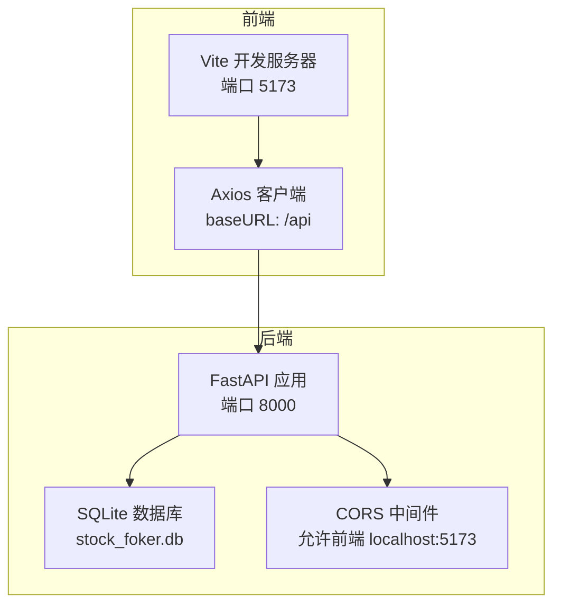
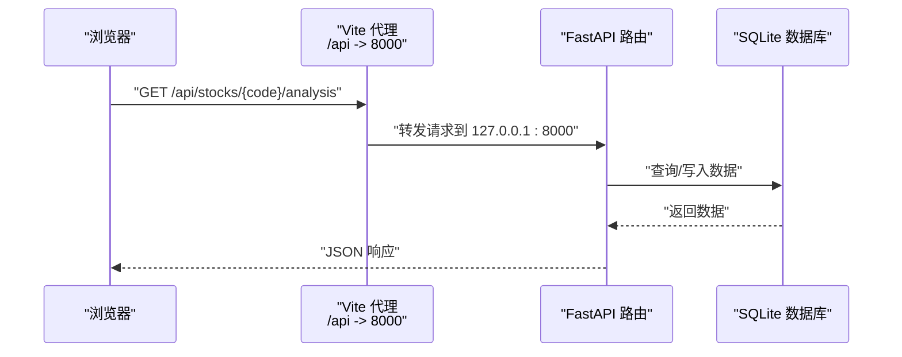
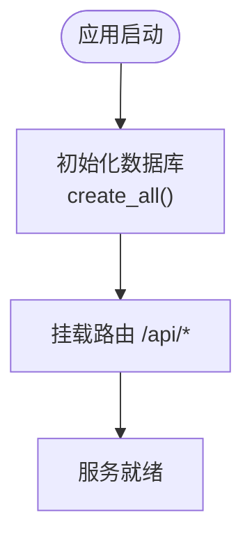
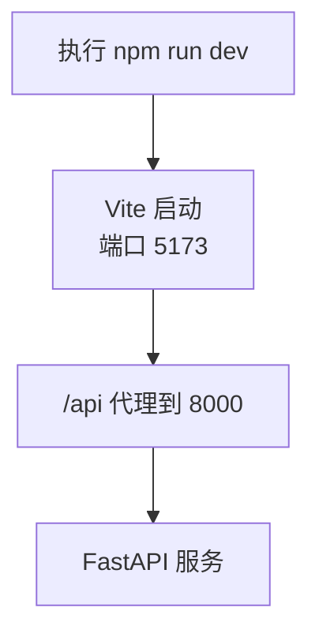
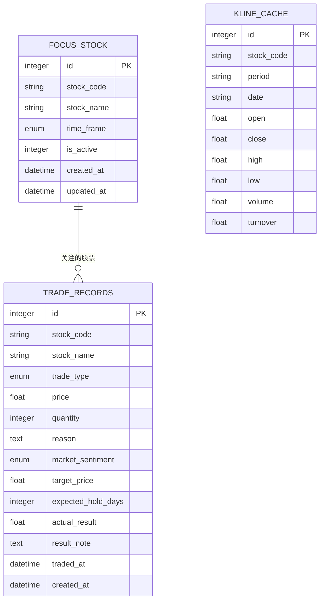
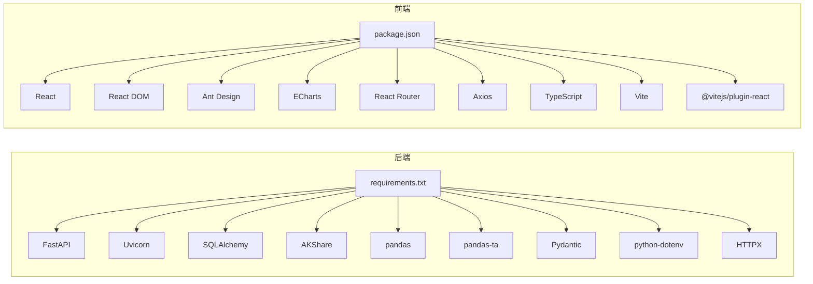

# 开发环境搭建

<cite>
**本文引用的文件**
- [backend/requirements.txt](file://backend/requirements.txt)
- [frontend/package.json](file://frontend/package.json)
- [backend/app/main.py](file://backend/app/main.py)
- [frontend/vite.config.ts](file://frontend/vite.config.ts)
- [start.sh](file://start.sh)
- [stop.sh](file://stop.sh)
- [backend/app/db/database.py](file://backend/app/db/database.py)
- [backend/app/routers/stock_router.py](file://backend/app/routers/stock_router.py)
- [frontend/src/services/api.ts](file://frontend/src/services/api.ts)
- [frontend/tsconfig.json](file://frontend/tsconfig.json)
- [backend/app/models/models.py](file://backend/app/models/models.py)
- [backend/app/models/schemas.py](file://backend/app/models/schemas.py)
- [doc/技术架构文档.md](file://doc/技术架构文档.md)
</cite>

## 目录
1. [简介](#简介)
2. [项目结构](#项目结构)
3. [核心组件](#核心组件)
4. [架构总览](#架构总览)
5. [详细组件分析](#详细组件分析)
6. [依赖关系分析](#依赖关系分析)
7. [性能考虑](#性能考虑)
8. [故障排除指南](#故障排除指南)
9. [结论](#结论)
10. [附录](#附录)

## 简介
本指南面向首次参与 Stock Foker 项目的开发者，提供从零开始的开发环境搭建步骤，涵盖：
- Python 后端环境配置（版本要求、虚拟环境、依赖安装）
- Node.js 与 npm/yarn 的安装与配置
- IDE 推荐配置（VS Code 插件与语言设置）
- 开发服务器启动（后端 FastAPI 与前端 Vite）
- 代理与跨域配置说明
- 常见环境问题排查与解决方案

## 项目结构
项目采用前后端分离架构：
- 后端使用 Python FastAPI，提供 RESTful API，数据库为 SQLite，ORM 使用 SQLAlchemy
- 前端使用 React + Vite + TypeScript，通过 Axios 调用后端 API，并在 Vite 中配置了 /api 代理
- 提供一键启动/停止脚本，自动检测并安装依赖，分别启动后端（8000）与前端（5173）

图表来源
- [backend/app/main.py:1-28](file://backend/app/main.py#L1-L28)
- [frontend/vite.config.ts:1-16](file://frontend/vite.config.ts#L1-L16)
- [backend/app/db/database.py:1-24](file://backend/app/db/database.py#L1-L24)

章节来源
- [doc/技术架构文档.md:19-67](file://doc/技术架构文档.md#L19-L67)

## 核心组件
- 后端依赖清单：包含 FastAPI、Uvicorn、SQLAlchemy、AKShare、pandas、pandas-ta、Pydantic、python-dotenv、HTTPX 等
- 前端依赖清单：包含 React、React DOM、Ant Design、ECharts、React Router、Axios、TypeScript、Vite、@vitejs/plugin-react 等
- CORS 配置：允许前端 localhost:5173 访问后端
- Vite 代理：将 /api 前缀转发至后端 127.0.0.1:8000
- 数据库：SQLite，本地文件存储，启动时自动建表

章节来源
- [backend/requirements.txt:1-10](file://backend/requirements.txt#L1-L10)
- [frontend/package.json:1-30](file://frontend/package.json#L1-L30)
- [backend/app/main.py:9-15](file://backend/app/main.py#L9-L15)
- [frontend/vite.config.ts:6-14](file://frontend/vite.config.ts#L6-L14)
- [backend/app/db/database.py:4-24](file://backend/app/db/database.py#L4-L24)

## 架构总览
下图展示了前端请求如何经由 Vite 代理转发到后端，后端通过 SQLAlchemy 访问 SQLite 数据库，并结合技术指标计算与买卖建议生成器返回数据。

图表来源
- [frontend/vite.config.ts:8-13](file://frontend/vite.config.ts#L8-L13)
- [backend/app/routers/stock_router.py:98-131](file://backend/app/routers/stock_router.py#L98-L131)
- [backend/app/db/database.py:14-23](file://backend/app/db/database.py#L14-L23)

## 详细组件分析

### 后端 FastAPI 服务
- 应用入口：创建 FastAPI 实例，注册 CORS 中间件，挂载路由，启动事件中初始化数据库
- 路由模块：集中于 stock_router.py，提供关注股票、搜索、K线与分析、交易记录、炒股画像等接口
- 数据库：SQLite，启动时自动建表；提供 get_db 依赖注入

图表来源
- [backend/app/main.py:20-27](file://backend/app/main.py#L20-L27)
- [backend/app/db/database.py:22-24](file://backend/app/db/database.py#L22-L24)

章节来源
- [backend/app/main.py:1-28](file://backend/app/main.py#L1-L28)
- [backend/app/routers/stock_router.py:1-197](file://backend/app/routers/stock_router.py#L1-L197)
- [backend/app/db/database.py:1-24](file://backend/app/db/database.py#L1-L24)

### 前端 Vite 开发服务器
- 开发端口：5173
- 代理配置：将 /api 前缀代理到后端 127.0.0.1:8000
- Axios 客户端：baseURL 设为 /api，统一调用后端接口
- TypeScript 配置：严格模式、ESNext 模块解析、bundler 检测等

图表来源
- [frontend/vite.config.ts:6-14](file://frontend/vite.config.ts#L6-L14)
- [frontend/src/services/api.ts:11](file://frontend/src/services/api.ts#L11)
- [frontend/tsconfig.json:1-22](file://frontend/tsconfig.json#L1-L22)

章节来源
- [frontend/package.json:6-10](file://frontend/package.json#L6-L10)
- [frontend/vite.config.ts:1-16](file://frontend/vite.config.ts#L1-L16)
- [frontend/src/services/api.ts:1-68](file://frontend/src/services/api.ts#L1-L68)
- [frontend/tsconfig.json:1-22](file://frontend/tsconfig.json#L1-L22)

### 数据模型与接口
- 数据模型：FocusStock、TradeRecord、KlineCache，定义字段、枚举类型与唯一约束
- 请求/响应模型：Pydantic 定义，用于接口参数校验与序列化
- 接口规范：集中在 stock_router.py，前缀 /api，覆盖关注、搜索、K线、分析、交易、画像

图表来源
- [backend/app/models/models.py:25-75](file://backend/app/models/models.py#L25-L75)
- [backend/app/models/schemas.py:8-118](file://backend/app/models/schemas.py#L8-L118)

章节来源
- [backend/app/models/models.py:1-75](file://backend/app/models/models.py#L1-L75)
- [backend/app/models/schemas.py:1-118](file://backend/app/models/schemas.py#L1-L118)
- [backend/app/routers/stock_router.py:15-197](file://backend/app/routers/stock_router.py#L15-L197)

## 依赖关系分析
- 后端依赖：FastAPI、Uvicorn、SQLAlchemy、AKShare、pandas、pandas-ta、Pydantic、python-dotenv、HTTPX
- 前端依赖：React、React DOM、Ant Design、ECharts、React Router、Axios、TypeScript、Vite、@vitejs/plugin-react
- 代理与跨域：前端 Vite 代理 /api 到后端；后端 CORS 允许前端 localhost:5173

图表来源
- [backend/requirements.txt:1-10](file://backend/requirements.txt#L1-L10)
- [frontend/package.json:11-28](file://frontend/package.json#L11-L28)

章节来源
- [backend/requirements.txt:1-10](file://backend/requirements.txt#L1-L10)
- [frontend/package.json:1-30](file://frontend/package.json#L1-L30)

## 性能考虑
- 数据库：SQLite 适合本地开发与小规模数据；如需更高并发，可考虑迁移至 PostgreSQL/MySQL
- 代理与跨域：Vite 代理仅在开发阶段生效；生产环境需在反向代理层配置 CORS
- 依赖镜像：启动脚本默认使用清华源加速安装，网络不佳时可切换回官方源
- 日志与 PID：启动/停止脚本会输出日志文件路径，便于定位问题

[本节为通用指导，无需特定文件来源]

## 故障排除指南
- 端口占用
  - 后端默认端口 8000，前端默认端口 5173
  - 停止脚本会尝试按 PID 终止进程，并兜底清理残留端口占用
- CORS 错误
  - 确认前端 Vite 代理目标为 127.0.0.1:8000
  - 确认后端 CORS 中间件允许前端地址
- 依赖安装失败
  - 启动脚本会自动检测 requirements.txt/package.json 变更并重装依赖
  - 可手动执行后端 pip 安装与前端 npm install
- 数据库初始化
  - 启动事件会自动建表；若未生效，检查数据库文件权限与路径

章节来源
- [start.sh:46-50](file://start.sh#L46-L50)
- [start.sh:83-87](file://start.sh#L83-L87)
- [stop.sh:40-48](file://stop.sh#L40-L48)
- [backend/app/main.py:9-15](file://backend/app/main.py#L9-L15)
- [frontend/vite.config.ts:8-13](file://frontend/vite.config.ts#L8-L13)
- [backend/app/db/database.py:22-24](file://backend/app/db/database.py#L22-L24)

## 结论
通过本指南，您可以快速完成 Stock Foker 的开发环境搭建与日常开发流程。建议在本地开发时遵循以下顺序：
1) 安装 Python 与 Node.js
2) 使用启动脚本一键安装依赖并启动后端与前端
3) 如需手动启动，参考各目录下的启动命令
4) 遇到问题优先查看日志与 PID 文件，必要时使用停止脚本清理残留

[本节为总结性内容，无需特定文件来源]

## 附录

### A. Python 后端环境配置
- Python 版本要求
  - 项目未显式声明最低 Python 版本，建议使用 Python 3.10 或以上
- 虚拟环境
  - 启动脚本会自动创建并激活虚拟环境
  - 也可手动创建：在 backend 目录执行 venv 创建
- 依赖安装
  - 启动脚本会根据 requirements.txt 安装依赖
  - 可使用国内镜像源加速安装
- 启动方式
  - 使用启动脚本自动启动后端服务
  - 或手动进入 backend 目录，激活虚拟环境后启动 Uvicorn

章节来源
- [start.sh:15-34](file://start.sh#L15-L34)
- [backend/requirements.txt:1-10](file://backend/requirements.txt#L1-L10)
- [doc/技术架构文档.md:180-192](file://doc/技术架构文档.md#L180-L192)

### B. Node.js 与 npm/yarn 配置
- Node.js 版本
  - 项目使用现代前端技术栈，建议使用 Node.js 18 或以上
- 包管理工具
  - 项目使用 npm；如需使用 yarn，可自行安装并替换相应命令
- 依赖安装
  - 启动脚本会自动安装前端依赖
  - 可使用国内镜像源加速安装
- 启动方式
  - 使用启动脚本自动启动前端 Vite
  - 或在 frontend 目录执行 npm run dev

章节来源
- [start.sh:54-71](file://start.sh#L54-L71)
- [frontend/package.json:6-10](file://frontend/package.json#L6-L10)
- [doc/技术架构文档.md:180-192](file://doc/技术架构文档.md#L180-L192)

### C. IDE 推荐配置（VS Code）
- 插件推荐
  - Python：用于后端开发与调试
  - ES7+ React/Redux：用于前端 React/TS 开发
  - ESLint/Prettier：代码格式化与质量检查
  - EditorConfig：统一团队编码风格
- Python 配置
  - 选择虚拟环境中解释器
  - 建议启用 linting、formatting、type checking
- TypeScript 配置
  - 使用项目内 tsconfig.json
  - 建议启用严格模式与相关检查项

[本节为通用配置建议，无需特定文件来源]

### D. 开发服务器启动步骤
- 一键启动
  - 执行根目录启动脚本，自动安装依赖并启动后端（8000）与前端（5173）
- 手动启动
  - 后端：进入 backend 目录，激活虚拟环境，启动 Uvicorn
  - 前端：进入 frontend 目录，执行 npm run dev

章节来源
- [start.sh:13-51](file://start.sh#L13-L51)
- [start.sh:52-87](file://start.sh#L52-L87)
- [doc/技术架构文档.md:180-192](file://doc/技术架构文档.md#L180-L192)

### E. 代理配置与跨域处理
- 前端代理
  - Vite 将 /api 代理到后端 127.0.0.1:8000
- 后端跨域
  - CORS 中间件允许前端 localhost:5173 访问
- 生产环境
  - 建议在反向代理层统一处理 CORS 与静态资源

章节来源
- [frontend/vite.config.ts:8-13](file://frontend/vite.config.ts#L8-L13)
- [backend/app/main.py:9-15](file://backend/app/main.py#L9-L15)

### F. 常见环境问题排查
- 端口被占用
  - 使用停止脚本终止服务或手动清理端口占用
- CORS 失败
  - 检查前端代理与后端 CORS 配置
- 依赖安装失败
  - 更换镜像源或检查网络
- 数据库无法初始化
  - 检查数据库文件权限与路径

章节来源
- [stop.sh:10-23](file://stop.sh#L10-L23)
- [stop.sh:25-38](file://stop.sh#L25-L38)
- [frontend/vite.config.ts:8-13](file://frontend/vite.config.ts#L8-L13)
- [backend/app/main.py:9-15](file://backend/app/main.py#L9-L15)
- [backend/app/db/database.py:4-24](file://backend/app/db/database.py#L4-L24)