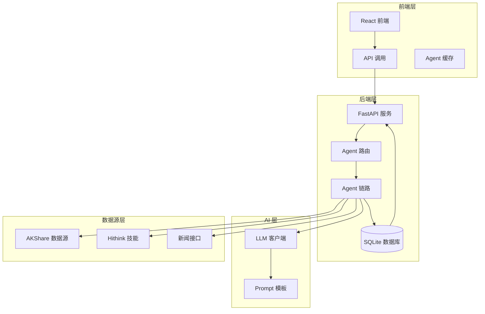
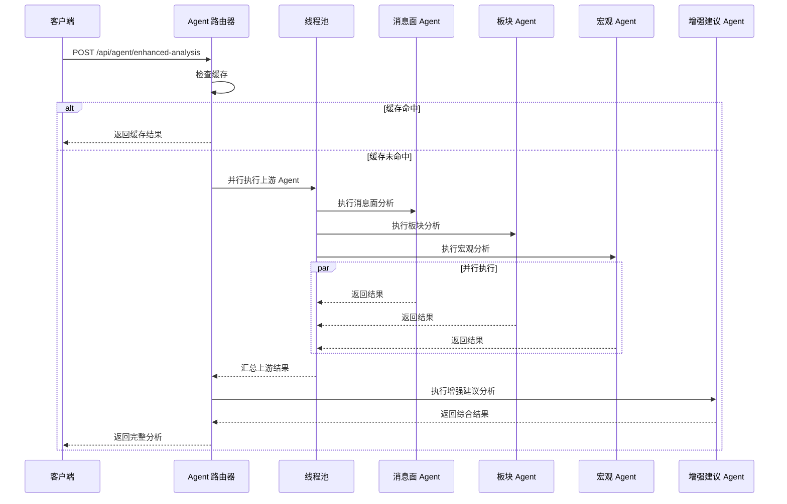
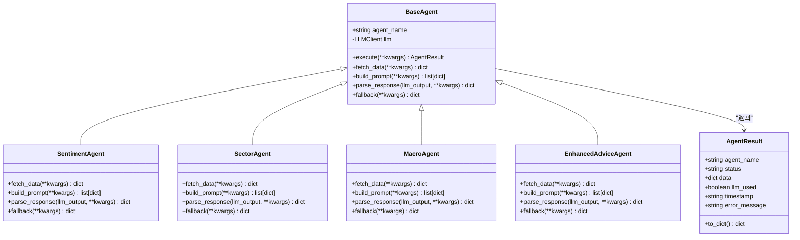
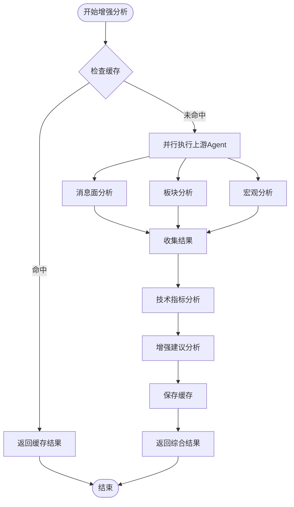
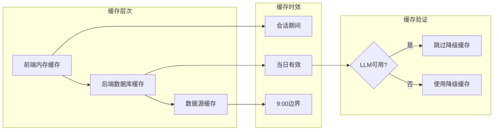
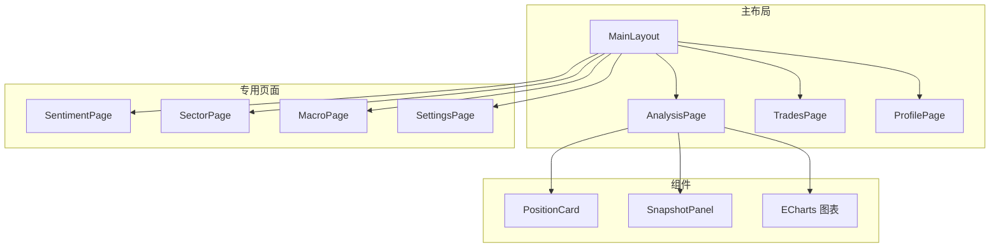
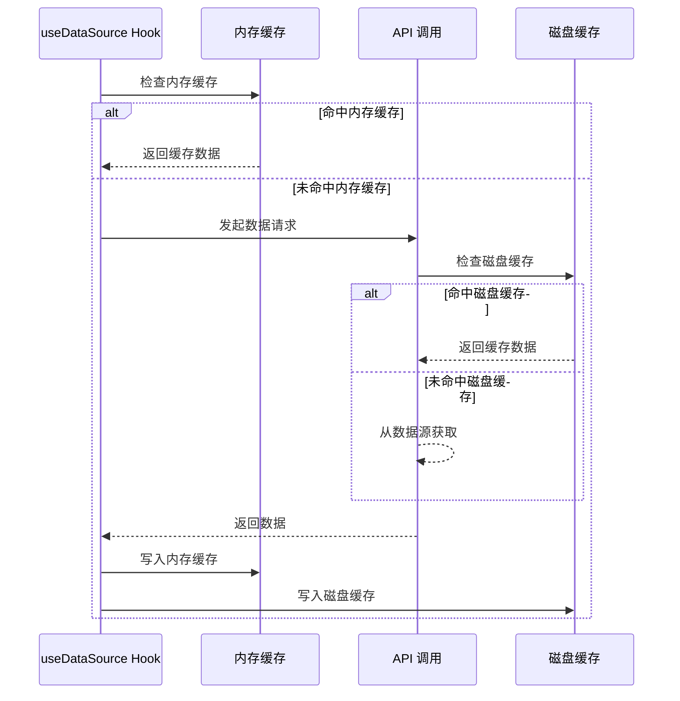
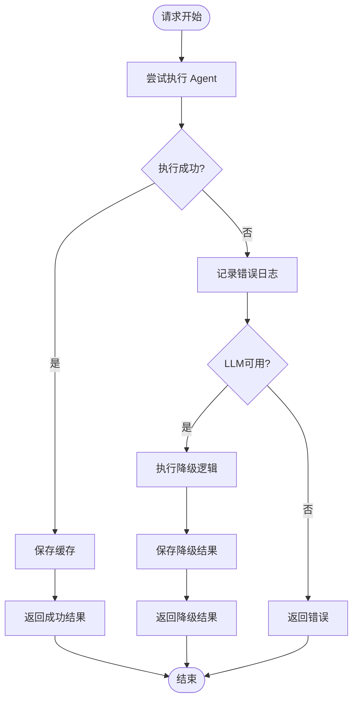

# 开发路线图文档

<cite>
**本文档引用的文件**
- [backend/app/main.py](file://backend/app/main.py)
- [backend/app/routers/agent_router.py](file://backend/app/routers/agent_router.py)
- [backend/app/agents/base_agent.py](file://backend/app/agents/base_agent.py)
- [backend/app/agents/sentiment_agent.py](file://backend/app/agents/sentiment_agent.py)
- [backend/app/agents/sector_agent.py](file://backend/app/agents/sector_agent.py)
- [backend/app/agents/macro_agent.py](file://backend/app/agents/macro_agent.py)
- [backend/app/agents/enhanced_advice_agent.py](file://backend/app/agents/enhanced_advice_agent.py)
- [backend/app/services/advice_service.py](file://backend/app/services/advice_service.py)
- [frontend/src/App.tsx](file://frontend/src/App.tsx)
- [frontend/src/pages/AnalysisPage.tsx](file://frontend/src/pages/AnalysisPage.tsx)
- [frontend/src/hooks/useDataSource.ts](file://frontend/src/hooks/useDataSource.ts)
- [doc/产品设计文档.md](file://doc/产品设计文档.md)
- [doc/迭代记录/2026-04-06-phase2-agent.md](file://doc/迭代记录/2026-04-06-phase2-agent.md)
- [doc/待办列表/2026-04-06-phase2-agent.md](file://doc/待办列表/2026-04-06-phase2-agent.md)
- [README.md](file://README.md)
- [skills/.skills_store_lock.json](file://skills/.skills_store_lock.json)
</cite>

## 目录
1. [项目概述](#项目概述)
2. [版本规划](#版本规划)
3. [核心架构](#核心架构)
4. [Agent 链路设计](#agent-链路设计)
5. [技术实现细节](#技术实现细节)
6. [性能优化策略](#性能优化策略)
7. [前端集成方案](#前端集成方案)
8. [数据缓存机制](#数据缓存机制)
9. [风险控制与监控](#风险控制与监控)
10. [开发进度跟踪](#开发进度跟踪)
11. [总结与展望](#总结与展望)

## 项目概述

Stock Foker 是一款面向个人投资者的自用股票分析应用，采用"深度聚焦、数据驱动、自我进化"的核心理念。该应用通过单股票聚焦模式，融合技术面、基本面、消息面数据，结合用户个人交易画像，提供个性化的辅助决策建议。

### 核心特性

- **多维度分析**：技术指标 + 板块联动 + 消息面的全方位数据融合
- **智能决策**：基于LLM Agent的四维度综合分析
- **自我认知**：通过操作记录与炒股画像，帮助用户认识自己的交易风格
- **闭环决策**：数据输入 → 用户画像 → 智能决策辅助 → 复盘优化

## 版本规划

### 第一阶段（MVP）
核心目标：跑通基础数据展示 + 操作记录闭环

- 单股票关注设置（含时间框架选择）
- 基础 K 线与核心技术指标展示
- 操作记录（结构化录入）
- 基础炒股画像生成
- 简单买卖建议（基于技术指标，附推理说明）

### 第二阶段
核心目标：补全数据维度 + 风险控制

- 板块联动分析
- 消息面数据整合 + 情绪分析
- 宏观环境感知
- 风险控制模块（仓位管理、止盈止损、风险预警）
- 对比基准分析
- 通知提醒机制

### 第三阶段
核心目标：智能化升级 + 自我进化

- 量化策略优化（多因子模型）
- 智能选股推荐（个股 + ETF）
- 回测功能
- 复盘模块（单笔复盘 + 周期报告）
- 历史关注记录与归档

## 核心架构

### 系统架构图

**架构图来源**
- [backend/app/main.py:50-74](file://backend/app/main.py#L50-L74)
- [backend/app/routers/agent_router.py:29-395](file://backend/app/routers/agent_router.py#L29-L395)

### 数据流架构

**架构图来源**
- [backend/app/routers/agent_router.py:258-354](file://backend/app/routers/agent_router.py#L258-L354)

## Agent 链路设计

### Agent 抽象基类

所有 Agent 遵循模板方法模式，确保一致的执行流程：

**类图来源**
- [backend/app/agents/base_agent.py:46-119](file://backend/app/agents/base_agent.py#L46-L119)
- [backend/app/agents/sentiment_agent.py:12-91](file://backend/app/agents/sentiment_agent.py#L12-L91)
- [backend/app/agents/sector_agent.py:12-85](file://backend/app/agents/sector_agent.py#L12-L85)
- [backend/app/agents/macro_agent.py:12-81](file://backend/app/agents/macro_agent.py#L12-L81)
- [backend/app/agents/enhanced_advice_agent.py:11-129](file://backend/app/agents/enhanced_advice_agent.py#L11-L129)

### Agent 协作流程

**流程图来源**
- [backend/app/routers/agent_router.py:258-354](file://backend/app/routers/agent_router.py#L258-L354)

## 技术实现细节

### LLM 客户端配置

系统采用统一的 OpenAI 兼容 API 接口，支持多种国产大模型：

| 配置项 | 说明 | 默认值 |
|--------|------|--------|
| LLM_ENABLED | AI 功能总开关 | false |
| LLM_API_KEY | API 密钥 | (用户填写) |
| LLM_BASE_URL | API 基地址 | https://api.openai.com/v1 |
| LLM_MODEL | 模型名称 | gpt-3.5-turbo |
| LLM_TEMPERATURE | 温度参数 | 0.3 |
| LLM_MAX_TOKENS | 最大输出 token | 2048 |
| LLM_TIMEOUT | 请求超时(秒) | 60 |
| LLM_ENABLE_THINKING | 模型思考模式开关 | false |

### Agent 数据处理流程

每个 Agent 都实现了标准化的数据处理流程：

1. **数据获取**：从多个数据源获取原始数据
2. **数据预处理**：清洗和格式化原始数据
3. **Prompt 构建**：根据业务需求构建 LLM Prompt
4. **LLM 调用**：调用大语言模型获取分析结果
5. **结果解析**：解析 LLM 输出并转换为标准格式
6. **降级处理**：当 LLM 不可用时执行降级逻辑

## 性能优化策略

### 缓存策略

系统实现了多层次的缓存机制：

**缓存图来源**
- [backend/app/routers/agent_router.py:47-116](file://backend/app/routers/agent_router.py#L47-L116)

### 并行执行优化

- **上游 Agent 并行**：消息面、板块、宏观三个 Agent 并行执行
- **线程池管理**：使用 ThreadPoolExecutor 控制并发数量
- **独立数据库连接**：每个线程使用独立的数据库连接
- **错误隔离**：单个 Agent 失败不影响其他 Agent

### 前端性能优化

- **内存缓存**：前端实现模块级内存缓存
- **懒加载**：数据源按需加载
- **状态管理**：使用 React Hooks 管理组件状态
- **渲染优化**：ECharts 图表按需更新

## 前端集成方案

### 页面架构

**页面图来源**
- [frontend/src/App.tsx:15-41](file://frontend/src/App.tsx#L15-L41)
- [frontend/src/pages/AnalysisPage.tsx:61-780](file://frontend/src/pages/AnalysisPage.tsx#L61-L780)

### 数据源管理

前端实现了独立的数据源管理 Hook：

**Hook 图来源**
- [frontend/src/hooks/useDataSource.ts:82-169](file://frontend/src/hooks/useDataSource.ts#L82-L169)

## 数据缓存机制

### 缓存表设计

系统使用 SQLite 数据库存储缓存数据：

| 表名 | 用途 | 字段说明 |
|------|------|----------|
| AgentResultCache | Agent 结果缓存 | agent_name, stock_code, cache_key, data, llm_used, created_at |
| DailyAgentSnapshot | 每日快照 | agent_type, stock_code, date, snapshot_data, llm_used |
| DataSourceCache | 数据源缓存 | stock_code, source_type, data, timestamp |

### 缓存策略

- **Agent 结果缓存**：当日有效，LLM 可用时自动跳过降级缓存
- **数据源缓存**：每天 09:00 边界，跨组件共享
- **前端内存缓存**：会话期间有效，避免重复请求

## 风险控制与监控

### 错误处理机制

**错误处理图来源**
- [backend/app/agents/base_agent.py:62-102](file://backend/app/agents/base_agent.py#L62-L102)

### 监控指标

- **响应时间**：Agent 全链路响应时间监控
- **错误率**：各 Agent 执行成功率统计
- **缓存命中率**：缓存使用效率分析
- **LLM 使用率**：大模型调用频率和成本分析

## 开发进度跟踪

### 已完成里程碑

1. **MVP 功能实现**：基础 K 线展示 + 技术指标分析
2. **Agent 链路实现**：消息面、板块、宏观、增强建议四个 Agent
3. **前端页面开发**：AnalysisPage、SentimentPage、SectorPage、MacroPage、SettingsPage
4. **缓存机制完善**：多层缓存策略实现
5. **数据源集成**：AKShare + Hithink 技能集成

### 当前开发状态

根据最新迭代记录，第二阶段 Agent 链路已完全实现：

- LLM 抽象层：OpenAI 兼容 API 客户端
- Agent 基类：模板方法模式实现
- 四个核心 Agent：消息面、板块、宏观、增强建议
- 前端页面：对应四个分析页面
- API 路由：完整的 Agent API 端点

### 待办事项优先级

| 优先级 | 功能 | 说明 |
|--------|------|------|
| 高 | 副图指标面板 | MACD/KDJ/RSI 独立子图实现 |
| 中 | 性能优化 | SSE 流式返回、LLM 调用优化 |
| 中 | 大盘数据看板 | 宏观环境页增加直观数据展示 |
| 低 | 历史关注列表 | 前端展示入口开发 |

## 总结与展望

Stock Foker 项目已经完成了第二阶段的核心功能开发，实现了基于 LLM 的四维度智能分析能力。项目采用现代化的技术栈，具有良好的扩展性和维护性。

### 技术优势

- **模块化设计**：清晰的分层架构，便于功能扩展
- **缓存优化**：多层缓存策略，提升用户体验
- **错误处理**：完善的降级机制，保证系统稳定性
- **前端工程化**：TypeScript + React + Ant Design，开发体验良好

### 未来发展方向

1. **性能优化**：实现 SSE 流式返回，提升响应速度
2. **功能扩展**：智能选股、复盘模块、回测功能
3. **监控完善**：增加错误监控和性能分析
4. **测试覆盖**：补充自动化测试，提升代码质量

该项目为个人投资者提供了强大的决策辅助工具，通过持续的迭代优化，将成为一个功能完备的智能投顾平台。