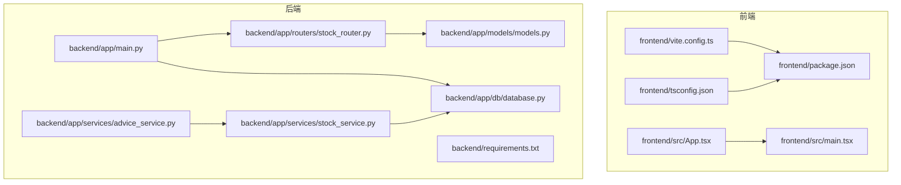
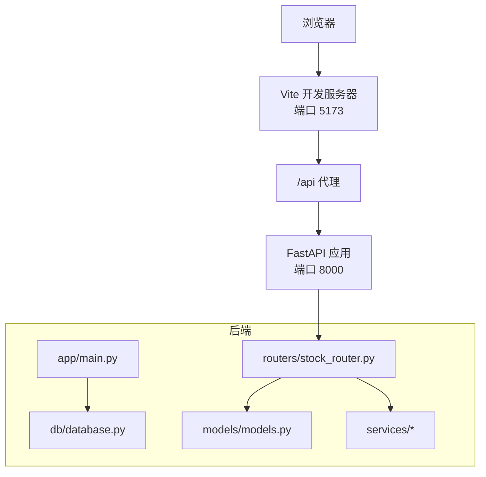
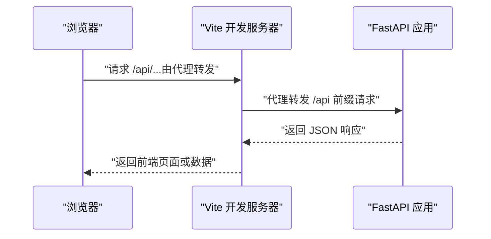
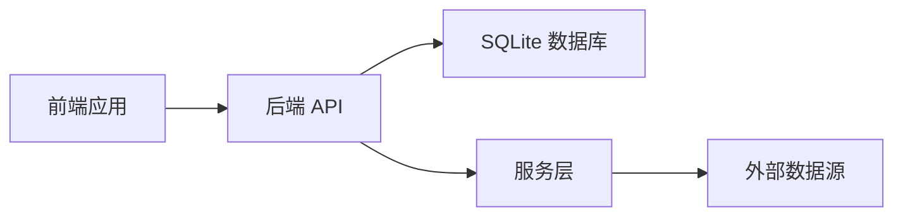

# 构建与部署

<cite>
**本文引用的文件**

- [frontend/package.json](file://frontend/package.json)

- [frontend/vite.config.ts](file://frontend/vite.config.ts)

- [frontend/tsconfig.json](file://frontend/tsconfig.json)

- [frontend/src/main.tsx](file://frontend/src/main.tsx)

- [frontend/src/App.tsx](file://frontend/src/App.tsx)

- [backend/app/main.py](file://backend/app/main.py)

- [backend/requirements.txt](file://backend/requirements.txt)

- [backend/app/db/database.py](file://backend/app/db/database.py)

- [backend/app/routers/stock_router.py](file://backend/app/routers/stock_router.py)

- [backend/app/models/models.py](file://backend/app/models/models.py)

- [backend/app/services/stock_service.py](file://backend/app/services/stock_service.py)

- [backend/app/services/advice_service.py](file://backend/app/services/advice_service.py)

- [start.sh](file://start.sh)

- [stop.sh](file://stop.sh)
</cite>

## 目录
1. [简介](#简介)

2. [项目结构](#项目结构)

3. [核心组件](#核心组件)

4. [架构总览](#架构总览)

5. [详细组件分析](#详细组件分析)

6. [依赖关系分析](#依赖关系分析)

7. [性能考量](#性能考量)

8. [故障排查指南](#故障排查指南)

9. [结论](#结论)

10. [附录](#附录)

## 简介
本指南面向 Stock Foker 项目的构建与部署，覆盖前端应用的 Vite 构建配置、静态资源优化与产物输出；后端应用的打包与部署方案（依赖管理、环境变量、进程管理）；自动化部署脚本 start.sh 与 stop.sh 的使用方法；以及生产环境部署最佳实践（Nginx 反向代理、SSL 证书、日志管理）。同时提供版本发布流程与回滚策略建议。

## 项目结构
项目采用前后端分离架构，前端使用 Vite + React + TypeScript，后端使用 FastAPI + Uvicorn，数据库为 SQLite（开发/演示用途），并通过本地缓存机制优化 K 线数据访问。

图表来源

- [frontend/src/App.tsx:1-27](file://frontend/src/App.tsx#L1-L27)

- [frontend/src/main.tsx:1-10](file://frontend/src/main.tsx#L1-L10)

- [frontend/vite.config.ts:1-16](file://frontend/vite.config.ts#L1-L16)

- [frontend/tsconfig.json:1-22](file://frontend/tsconfig.json#L1-L22)

- [backend/app/main.py:1-28](file://backend/app/main.py#L1-L28)

- [backend/app/routers/stock_router.py:1-197](file://backend/app/routers/stock_router.py#L1-L197)

- [backend/app/db/database.py:1-24](file://backend/app/db/database.py#L1-L24)

- [backend/app/models/models.py:1-75](file://backend/app/models/models.py#L1-L75)

- [backend/app/services/stock_service.py:1-327](file://backend/app/services/stock_service.py#L1-L327)

- [backend/app/services/advice_service.py:1-193](file://backend/app/services/advice_service.py#L1-L193)

章节来源

- [frontend/package.json:1-30](file://frontend/package.json#L1-L30)

- [frontend/vite.config.ts:1-16](file://frontend/vite.config.ts#L1-L16)

- [frontend/tsconfig.json:1-22](file://frontend/tsconfig.json#L1-L22)

- [frontend/src/main.tsx:1-10](file://frontend/src/main.tsx#L1-L10)

- [frontend/src/App.tsx:1-27](file://frontend/src/App.tsx#L1-L27)

- [backend/app/main.py:1-28](file://backend/app/main.py#L1-L28)

- [backend/requirements.txt:1-10](file://backend/requirements.txt#L1-L10)

- [backend/app/db/database.py:1-24](file://backend/app/db/database.py#L1-L24)

- [backend/app/routers/stock_router.py:1-197](file://backend/app/routers/stock_router.py#L1-L197)

- [backend/app/models/models.py:1-75](file://backend/app/models/models.py#L1-L75)

- [backend/app/services/stock_service.py:1-327](file://backend/app/services/stock_service.py#L1-L327)

- [backend/app/services/advice_service.py:1-193](file://backend/app/services/advice_service.py#L1-L193)

## 核心组件
- 前端应用

  - 构建工具链：Vite + React + TypeScript

  - 开发服务器：内置热更新与代理（前端端口 5173，后端代理到 8000）

  - 产物输出：标准 Vite 生产构建目录

- 后端应用

  - Web 框架：FastAPI

  - ASGI 服务器：Uvicorn

  - 数据库：SQLite（本地文件型数据库）

  - 依赖管理：requirements.txt

- 自动化脚本

  - start.sh：创建/激活虚拟环境、安装依赖、启动后端与前端、健康检查

  - stop.sh：按 PID 终止进程、兜底清理端口占用

章节来源

- [frontend/package.json:6-10](file://frontend/package.json#L6-L10)

- [frontend/vite.config.ts:4-15](file://frontend/vite.config.ts#L4-L15)

- [backend/app/main.py:1-28](file://backend/app/main.py#L1-L28)

- [backend/requirements.txt:1-10](file://backend/requirements.txt#L1-L10)

- [backend/app/db/database.py:4](file://backend/app/db/database.py#L4)

- [start.sh:15-50](file://start.sh#L15-L50)

- [start.sh:52-87](file://start.sh#L52-L87)

- [stop.sh:10-38](file://stop.sh#L10-L38)

## 架构总览
前端通过 Vite 开发服务器提供页面与 API 代理；后端以 FastAPI 提供 REST 接口，并在启动事件中初始化数据库。前端与后端通过本地环回地址通信，开发阶段通过 Vite 代理转发 /api 请求至后端。

图表来源

- [frontend/vite.config.ts:6-14](file://frontend/vite.config.ts#L6-L14)

- [backend/app/main.py:1-28](file://backend/app/main.py#L1-L28)

- [backend/app/db/database.py:1-24](file://backend/app/db/database.py#L1-L24)

- [backend/app/routers/stock_router.py:1-197](file://backend/app/routers/stock_router.py#L1-L197)

- [backend/app/models/models.py:1-75](file://backend/app/models/models.py#L1-L75)

- [backend/app/services/stock_service.py:1-327](file://backend/app/services/stock_service.py#L1-L327)

## 详细组件分析

### 前端构建与优化
- 构建命令

  - 使用 TypeScript 编译器与 Vite 执行生产构建

  - 构建脚本路径参考：[frontend/package.json:8](file://frontend/package.json#L8)

- 开发服务器与代理

  - Vite 开发服务器默认端口与代理配置

  - 代理规则将 /api 转发至后端地址

  - 配置参考：[frontend/vite.config.ts:6-14](file://frontend/vite.config.ts#L6-L14)

- 类型与模块系统

  - TypeScript 编译选项与模块解析策略

  - 参考：[frontend/tsconfig.json:2-19](file://frontend/tsconfig.json#L2-L19)

- 应用入口与路由

  - React 根节点挂载与路由配置

  - 参考：[frontend/src/main.tsx:1-10](file://frontend/src/main.tsx#L1-L10)、[frontend/src/App.tsx:1-27](file://frontend/src/App.tsx#L1-L27)

- 产物输出

  - Vite 默认生产构建输出目录（遵循 Vite 约定）

  - 参考：[frontend/package.json:8](file://frontend/package.json#L8)

章节来源

- [frontend/package.json:6-10](file://frontend/package.json#L6-L10)

- [frontend/vite.config.ts:4-15](file://frontend/vite.config.ts#L4-L15)

- [frontend/tsconfig.json:1-22](file://frontend/tsconfig.json#L1-L22)

- [frontend/src/main.tsx:1-10](file://frontend/src/main.tsx#L1-L10)

- [frontend/src/App.tsx:1-27](file://frontend/src/App.tsx#L1-L27)

### 后端打包与部署
- 依赖管理

  - 使用 requirements.txt 管理 Python 依赖

  - 参考：[backend/requirements.txt:1-10](file://backend/requirements.txt#L1-L10)

- 应用入口与中间件

  - FastAPI 应用初始化、CORS 中间件与根路由

  - 参考：[backend/app/main.py:1-28](file://backend/app/main.py#L1-L28)

- 数据库初始化

  - SQLite 连接与表结构初始化

  - 参考：[backend/app/db/database.py:4](file://backend/app/db/database.py#L4)、[backend/app/db/database.py:23](file://backend/app/db/database.py#L23)

- 路由与服务

  - 股票相关 API 路由与服务层（K 线、技术指标、买卖建议、交易记录、画像）

  - 参考：[backend/app/routers/stock_router.py:1-197](file://backend/app/routers/stock_router.py#L1-L197)

  - K 线与缓存：本地缓存优先、远程增量拉取

  - 参考：[backend/app/services/stock_service.py:131-238](file://backend/app/services/stock_service.py#L131-L238)

  - 买卖建议：基于技术指标综合打分

  - 参考：[backend/app/services/advice_service.py:4-173](file://backend/app/services/advice_service.py#L4-L173)

- 进程管理

  - 使用 Uvicorn 在本地回环地址监听

  - 参考：[start.sh:46-50](file://start.sh#L46-L50)

章节来源

- [backend/requirements.txt:1-10](file://backend/requirements.txt#L1-L10)

- [backend/app/main.py:1-28](file://backend/app/main.py#L1-L28)

- [backend/app/db/database.py:1-24](file://backend/app/db/database.py#L1-L24)

- [backend/app/routers/stock_router.py:1-197](file://backend/app/routers/stock_router.py#L1-L197)

- [backend/app/services/stock_service.py:131-238](file://backend/app/services/stock_service.py#L131-L238)

- [backend/app/services/advice_service.py:4-173](file://backend/app/services/advice_service.py#L4-L173)

- [start.sh:46-50](file://start.sh#L46-L50)

### 自动化部署脚本
- start.sh 功能

  - 创建并激活 Python 虚拟环境

  - 比对 requirements.txt 哈希决定是否安装/更新依赖

  - 终止旧后端进程，启动新进程并记录 PID 与日志

  - 检查 package.json 哈希决定是否重新安装前端依赖

  - 终止旧前端进程，启动 Vite 开发服务器并记录 PID 与日志

  - 健康检查：轮询后端与前端就绪状态

  - 参考：[start.sh:15-50](file://start.sh#L15-L50)、[start.sh:52-87](file://start.sh#L52-L87)、[start.sh:89-107](file://start.sh#L89-L107)

- stop.sh 功能

  - 读取 PID 文件并终止对应进程

  - 若无 PID 文件，兜底扫描端口并强制终止

  - 参考：[stop.sh:10-38](file://stop.sh#L10-L38)、[stop.sh:40-48](file://stop.sh#L40-L48)

章节来源

- [start.sh:15-50](file://start.sh#L15-L50)

- [start.sh:52-87](file://start.sh#L52-L87)

- [start.sh:89-107](file://start.sh#L89-L107)

- [stop.sh:10-38](file://stop.sh#L10-L38)

- [stop.sh:40-48](file://stop.sh#L40-L48)

### API 调用序列（开发环境）

图表来源

- [frontend/vite.config.ts:8-13](file://frontend/vite.config.ts#L8-L13)

- [backend/app/main.py:1-28](file://backend/app/main.py#L1-L28)

## 依赖关系分析
- 前端依赖

  - React、Ant Design、ECharts、路由与 HTTP 客户端等

  - 参考：[frontend/package.json:11-21](file://frontend/package.json#L11-L21)

- 后端依赖

  - FastAPI、Uvicorn、SQLAlchemy、数据处理与网络库

  - 参考：[backend/requirements.txt:1-10](file://backend/requirements.txt#L1-L10)

- 组件耦合

  - 路由层依赖模型层与服务层

  - 服务层依赖数据库会话与外部数据源

  - 参考：[backend/app/routers/stock_router.py:1-197](file://backend/app/routers/stock_router.py#L1-L197)、[backend/app/services/stock_service.py:1-327](file://backend/app/services/stock_service.py#L1-L327)

图表来源

- [backend/app/routers/stock_router.py:1-197](file://backend/app/routers/stock_router.py#L1-L197)

- [backend/app/services/stock_service.py:1-327](file://backend/app/services/stock_service.py#L1-L327)

- [backend/app/db/database.py:1-24](file://backend/app/db/database.py#L1-L24)

章节来源

- [frontend/package.json:11-21](file://frontend/package.json#L11-L21)

- [backend/requirements.txt:1-10](file://backend/requirements.txt#L1-L10)

- [backend/app/routers/stock_router.py:1-197](file://backend/app/routers/stock_router.py#L1-L197)

- [backend/app/services/stock_service.py:1-327](file://backend/app/services/stock_service.py#L1-L327)

- [backend/app/db/database.py:1-24](file://backend/app/db/database.py#L1-L24)

## 性能考量
- 前端

  - 使用 Vite 的原生 ESM 与按需打包，减少首屏体积

  - 通过代理避免跨域，降低开发阶段的额外开销

- 后端

  - SQLite 适合小规模数据与开发演示；生产建议迁移到 PostgreSQL/MySQL 并启用连接池

  - K 线数据本地缓存与增量拉取可显著降低外部接口压力

- 服务层

  - 外部接口调用具备重试机制，提升稳定性

  - 技术指标计算基于 pandas/pandas-ta，建议在生产环境限制并发与批大小

章节来源

- [backend/app/services/stock_service.py:22-33](file://backend/app/services/stock_service.py#L22-L33)

- [backend/app/services/stock_service.py:131-238](file://backend/app/services/stock_service.py#L131-L238)

## 故障排查指南
- 启动失败

  - 检查虚拟环境与依赖安装是否成功

  - 查看后端与前端日志文件位置

  - 参考：[start.sh:28-34](file://start.sh#L28-L34)、[start.sh:48](file://start.sh#L48)、[start.sh:85](file://start.sh#L85)

- 进程未停止

  - 使用 stop.sh 清理 PID 文件与残留进程

  - 参考：[stop.sh:10-38](file://stop.sh#L10-L38)、[stop.sh:40-48](file://stop.sh#L40-L48)

- CORS 或代理问题

  - 确认前端代理目标与后端允许的来源

  - 参考：[frontend/vite.config.ts:8-13](file://frontend/vite.config.ts#L8-L13)、[backend/app/main.py:9-15](file://backend/app/main.py#L9-L15)

- 数据库初始化

  - 确认数据库文件存在且权限正确

  - 参考：[backend/app/db/database.py:4](file://backend/app/db/database.py#L4)、[backend/app/db/database.py:23](file://backend/app/db/database.py#L23)

章节来源

- [start.sh:28-34](file://start.sh#L28-L34)

- [start.sh:48](file://start.sh#L48)

- [start.sh:85](file://start.sh#L85)

- [stop.sh:10-38](file://stop.sh#L10-L38)

- [stop.sh:40-48](file://stop.sh#L40-L48)

- [frontend/vite.config.ts:8-13](file://frontend/vite.config.ts#L8-L13)

- [backend/app/main.py:9-15](file://backend/app/main.py#L9-L15)

- [backend/app/db/database.py:4](file://backend/app/db/database.py#L4)

- [backend/app/db/database.py:23](file://backend/app/db/database.py#L23)

## 结论
本指南提供了从开发到生产的全流程实践：前端基于 Vite 的快速构建与代理，后端基于 FastAPI/Uvicorn 的轻量部署，配合自动化脚本实现一键启动与优雅停止。生产环境中建议替换 SQLite、引入 Nginx 反代与 SSL、完善日志与监控，并制定版本发布与回滚策略以保障稳定性。

## 附录

### 生产环境部署最佳实践
- Nginx 反向代理

  - 将静态资源交由 Nginx 提供，后端通过反向代理转发 /api

  - 参考：[frontend/vite.config.ts:8-13](file://frontend/vite.config.ts#L8-L13)、[backend/app/main.py:1-28](file://backend/app/main.py#L1-L28)

- SSL 证书

  - 使用 Let’s Encrypt 或商业证书，开启 HTTPS 强制跳转

- 日志管理

  - 后端日志输出到文件并定期轮转

  - 参考：[start.sh:48](file://start.sh#L48)、[start.sh:85](file://start.sh#L85)

- 进程与守护

  - 使用 systemd 或 PM2 管理进程，自动重启与健康检查

- 数据库迁移

  - 从 SQLite 迁移至 PostgreSQL/MySQL，启用连接池与备份策略

  - 参考：[backend/app/db/database.py:4](file://backend/app/db/database.py#L4)

章节来源

- [frontend/vite.config.ts:8-13](file://frontend/vite.config.ts#L8-L13)

- [backend/app/main.py:1-28](file://backend/app/main.py#L1-L28)

- [start.sh:48](file://start.sh#L48)

- [start.sh:85](file://start.sh#L85)

- [backend/app/db/database.py:4](file://backend/app/db/database.py#L4)

### 版本发布流程与回滚策略
- 发布流程

  - 前端：执行构建 → 上传静态资源 → 更新 Nginx 配置 → 重启 Nginx

  - 后端：构建镜像/包 → 停止旧进程 → 部署新版本 → 启动新进程 → 健康检查

  - 参考：[frontend/package.json:8](file://frontend/package.json#L8)、[start.sh:36-50](file://start.sh#L36-L50)、[start.sh:73-87](file://start.sh#L73-L87)

- 回滚策略

  - 保留上一版本产物与配置，一键切换

  - 使用 stop.sh 终止当前进程，再启动上一版本进程

  - 参考：[stop.sh:10-38](file://stop.sh#L10-L38)

章节来源

- [frontend/package.json:8](file://frontend/package.json#L8)

- [start.sh:36-50](file://start.sh#L36-L50)

- [start.sh:73-87](file://start.sh#L73-L87)

- [stop.sh:10-38](file://stop.sh#L10-L38)
