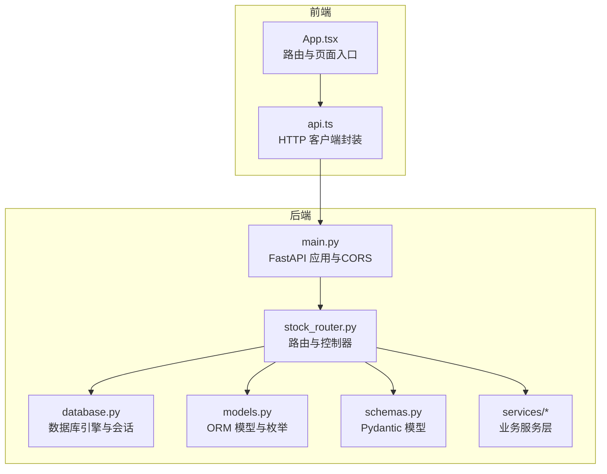
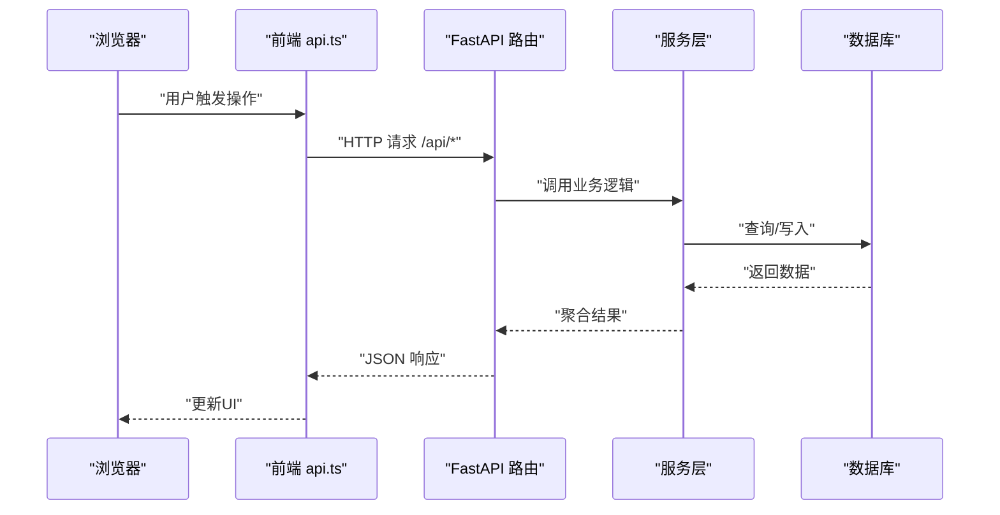
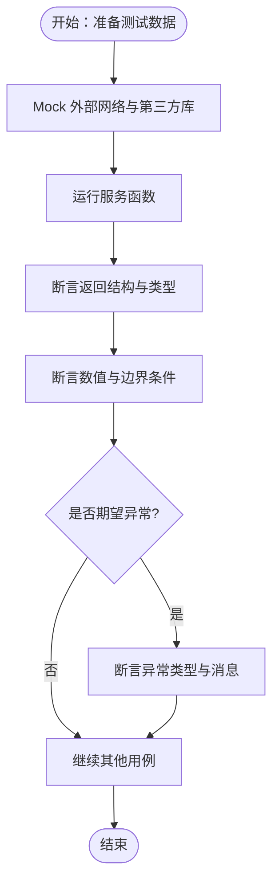
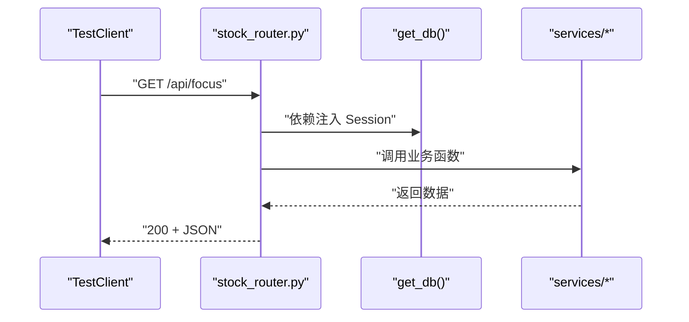
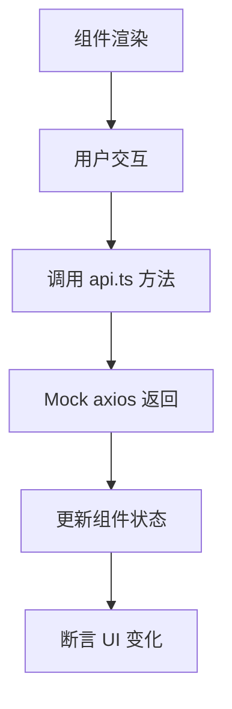

# 测试指南

<cite>
**本文引用的文件**
- [backend/app/main.py](file://backend/app/main.py)
- [backend/app/routers/stock_router.py](file://backend/app/routers/stock_router.py)
- [backend/app/services/stock_service.py](file://backend/app/services/stock_service.py)
- [backend/app/services/advice_service.py](file://backend/app/services/advice_service.py)
- [backend/app/services/profile_service.py](file://backend/app/services/profile_service.py)
- [backend/app/models/models.py](file://backend/app/models/models.py)
- [backend/app/models/schemas.py](file://backend/app/models/schemas.py)
- [backend/app/db/database.py](file://backend/app/db/database.py)
- [frontend/src/App.tsx](file://frontend/src/App.tsx)
- [frontend/src/services/api.ts](file://frontend/src/services/api.ts)
- [frontend/package.json](file://frontend/package.json)
- [backend/requirements.txt](file://backend/requirements.txt)
</cite>

## 目录
1. [引言](#引言)
2. [项目结构](#项目结构)
3. [核心组件](#核心组件)
4. [架构总览](#架构总览)
5. [详细组件分析](#详细组件分析)
6. [依赖分析](#依赖分析)
7. [性能考量](#性能考量)
8. [故障排查指南](#故障排查指南)
9. [结论](#结论)
10. [附录](#附录)

## 引言
本测试指南面向 Stock Foker 项目，目标是建立系统化的测试策略与实施方法，覆盖 Python 后端服务层、前端组件与 API 接口测试，并扩展到集成测试与端到端测试。文档同时明确测试框架选择与配置要点、测试用例编写规范（含测试数据准备、Mock 使用与断言策略）、测试覆盖率要求以及在持续集成中执行测试的流程。

## 项目结构
项目采用前后端分离架构：
- 后端基于 FastAPI，使用 SQLAlchemy 进行数据库访问，服务层封装业务逻辑（K线、指标、买卖建议、画像）。
- 前端基于 React + TypeScript，使用 Ant Design 与 ECharts，通过 axios 访问后端 /api 前缀接口。
- 数据库为 SQLite，启动时初始化表结构。

图表来源
- [backend/app/main.py:1-28](file://backend/app/main.py#L1-L28)
- [backend/app/routers/stock_router.py:1-197](file://backend/app/routers/stock_router.py#L1-L197)
- [backend/app/db/database.py:1-24](file://backend/app/db/database.py#L1-L24)
- [backend/app/models/models.py:1-75](file://backend/app/models/models.py#L1-L75)
- [backend/app/models/schemas.py:1-118](file://backend/app/models/schemas.py#L1-L118)
- [frontend/src/App.tsx:1-27](file://frontend/src/App.tsx#L1-L27)
- [frontend/src/services/api.ts:1-68](file://frontend/src/services/api.ts#L1-L68)

章节来源
- [backend/app/main.py:1-28](file://backend/app/main.py#L1-L28)
- [backend/app/routers/stock_router.py:1-197](file://backend/app/routers/stock_router.py#L1-L197)
- [backend/app/db/database.py:1-24](file://backend/app/db/database.py#L1-L24)
- [frontend/src/App.tsx:1-27](file://frontend/src/App.tsx#L1-L27)
- [frontend/src/services/api.ts:1-68](file://frontend/src/services/api.ts#L1-L68)

## 核心组件
- 后端应用与中间件：CORS 配置允许前端开发服务器访问；启动事件初始化数据库。
- 路由器：统一前缀 /api，提供关注股票、搜索、K线与分析、交易记录、画像等接口。
- 服务层：
  - 股票服务：K线数据获取与缓存、技术指标计算。
  - 买卖建议服务：基于指标生成买卖建议与推理。
  - 画像服务：基于交易记录生成交易画像。
- 数据模型与模式：定义枚举、ORM 表结构与 Pydantic 模型。
- 前端应用：路由与页面组件，通过 api.ts 封装对 /api 的调用。

章节来源
- [backend/app/main.py:1-28](file://backend/app/main.py#L1-L28)
- [backend/app/routers/stock_router.py:1-197](file://backend/app/routers/stock_router.py#L1-L197)
- [backend/app/services/stock_service.py:1-327](file://backend/app/services/stock_service.py#L1-L327)
- [backend/app/services/advice_service.py:1-193](file://backend/app/services/advice_service.py#L1-L193)
- [backend/app/services/profile_service.py:1-114](file://backend/app/services/profile_service.py#L1-L114)
- [backend/app/models/models.py:1-75](file://backend/app/models/models.py#L1-L75)
- [backend/app/models/schemas.py:1-118](file://backend/app/models/schemas.py#L1-L118)
- [frontend/src/App.tsx:1-27](file://frontend/src/App.tsx#L1-L27)
- [frontend/src/services/api.ts:1-68](file://frontend/src/services/api.ts#L1-L68)

## 架构总览
后端以 FastAPI 为核心，通过依赖注入获取数据库会话，路由层调用服务层完成业务处理。前端通过 axios 发起请求，后端返回 JSON 结构，前端渲染图表与页面。

图表来源
- [frontend/src/services/api.ts:1-68](file://frontend/src/services/api.ts#L1-L68)
- [backend/app/routers/stock_router.py:1-197](file://backend/app/routers/stock_router.py#L1-L197)
- [backend/app/services/stock_service.py:1-327](file://backend/app/services/stock_service.py#L1-L327)
- [backend/app/db/database.py:1-24](file://backend/app/db/database.py#L1-L24)

## 详细组件分析

### 后端服务层测试策略
- 单元测试范围
  - 股票服务：K线数据获取、缓存合并、指标计算、错误回退。
  - 买卖建议服务：多指标综合打分、置信度计算、推理链输出。
  - 画像服务：胜率、盈亏比、持仓周期、情绪准确率、常用理由统计。
- 测试数据准备
  - 使用小型 K 线样本与已知指标序列，确保可重复性与可验证性。
  - 准备交易记录样本，覆盖不同交易类型、结果与情绪标签。
- Mock 对象使用
  - Mock 外部依赖（网络请求、第三方库）以隔离测试环境。
  - 使用内存数据库或临时文件数据库，避免持久化副作用。
- 断言策略
  - 对数值型指标进行容差断言（如技术指标序列）。
  - 对结构化响应进行字段存在性与类型断言。
  - 对异常路径进行异常类型与错误信息断言。

图表来源
- [backend/app/services/stock_service.py:1-327](file://backend/app/services/stock_service.py#L1-L327)
- [backend/app/services/advice_service.py:1-193](file://backend/app/services/advice_service.py#L1-L193)
- [backend/app/services/profile_service.py:1-114](file://backend/app/services/profile_service.py#L1-L114)

章节来源
- [backend/app/services/stock_service.py:1-327](file://backend/app/services/stock_service.py#L1-L327)
- [backend/app/services/advice_service.py:1-193](file://backend/app/services/advice_service.py#L1-L193)
- [backend/app/services/profile_service.py:1-114](file://backend/app/services/profile_service.py#L1-L114)

### 路由与 API 接口测试策略
- 单元测试范围
  - FastAPI 路由：参数校验、依赖注入、响应模型、异常处理。
  - 数据库交互：查询、插入、更新、删除的正确性与事务一致性。
- 测试框架与配置
  - 使用 FastAPI TestClient 进行端到端测试，模拟 HTTP 请求。
  - 使用 pytest 参数化与 fixtures 管理测试数据库与会话。
- Mock 对象使用
  - Mock 服务层函数以控制返回值与异常路径。
  - Mock 数据库会话以避免真实写入。
- 断言策略
  - 对状态码、响应体结构与字段进行断言。
  - 对错误场景断言 HTTP 异常与错误详情。

图表来源
- [backend/app/routers/stock_router.py:1-197](file://backend/app/routers/stock_router.py#L1-L197)
- [backend/app/db/database.py:1-24](file://backend/app/db/database.py#L1-L24)

章节来源
- [backend/app/routers/stock_router.py:1-197](file://backend/app/routers/stock_router.py#L1-L197)
- [backend/app/db/database.py:1-24](file://backend/app/db/database.py#L1-L24)

### 前端组件测试策略
- 单元测试范围
  - 页面组件：渲染、状态管理、用户交互。
  - 服务模块：api.ts 中的 HTTP 方法封装，参数传递与响应处理。
- 测试框架与配置
  - 使用 Vite + React + TypeScript 工程，结合 Jest 或 Vitest 进行单元测试。
  - 使用 @testing-library/react 进行组件渲染与交互测试。
- Mock 对象使用
  - Mock axios 实现稳定的网络层测试。
  - 使用 React Testing Library 的 render 与 fireEvent 进行交互模拟。
- 断言策略
  - 对 DOM 文本、属性与可见性断言。
  - 对异步行为断言（加载态、错误态、成功态）。

图表来源
- [frontend/src/services/api.ts:1-68](file://frontend/src/services/api.ts#L1-L68)
- [frontend/src/App.tsx:1-27](file://frontend/src/App.tsx#L1-L27)

章节来源
- [frontend/src/services/api.ts:1-68](file://frontend/src/services/api.ts#L1-L68)
- [frontend/src/App.tsx:1-27](file://frontend/src/App.tsx#L1-L27)

### 集成测试与端到端测试
- 集成测试
  - 覆盖路由到服务层再到数据库的完整链路。
  - 使用独立测试数据库实例，确保测试隔离与可重复。
- 端到端测试
  - 使用 Playwright 或 Cypress 在真实浏览器中执行。
  - 覆盖关键用户旅程：搜索股票、查看分析、创建交易记录、查看画像。
- 测试数据与清理
  - 使用事务回滚或测试专用数据库，保证测试间无污染。
  - 提供测试数据工厂，快速生成关注股票、交易记录等样本。

章节来源
- [backend/app/routers/stock_router.py:1-197](file://backend/app/routers/stock_router.py#L1-L197)
- [backend/app/db/database.py:1-24](file://backend/app/db/database.py#L1-L24)

## 依赖分析
- 后端依赖
  - FastAPI、SQLAlchemy、Pydantic：Web 框架、ORM、数据校验。
  - pandas、pandas-ta、akshare：技术分析与数据获取。
  - httpx：HTTP 客户端（用于测试中的替代方案）。
- 前端依赖
  - axios：HTTP 客户端。
  - react-router-dom、antd、echarts：路由、UI 与可视化。
- 测试相关依赖
  - pytest、httpx、fastapi.testclient：后端测试。
  - jest/vitest、@testing-library/react：前端测试。
  - playwright/cypress：端到端测试。

章节来源
- [backend/requirements.txt:1-10](file://backend/requirements.txt#L1-L10)
- [frontend/package.json:1-30](file://frontend/package.json#L1-L30)

## 性能考量
- 测试执行性能
  - 使用并发测试运行器（pytest-xdist）提升后端测试速度。
  - 前端测试使用并行与缓存机制（Vitest 默认支持）。
- 数据与 I/O
  - 将外部网络请求替换为本地 Mock，减少测试耗时与不确定性。
  - 对数据库操作进行批量插入与事务回滚，避免真实 I/O。
- 指标计算稳定性
  - 对技术指标计算使用固定种子或确定性输入，确保断言稳定。

## 故障排查指南
- 常见问题
  - CORS 错误：确认后端允许前端开发服务器地址。
  - 数据库连接：检查 SQLite 文件权限与路径。
  - 外部接口失败：确认 Mock 配置与超时设置。
- 排查步骤
  - 后端：使用 TestClient 手动构造最小请求，逐步定位依赖。
  - 前端：使用浏览器开发者工具查看网络请求与响应。
  - 集成测试：启用详细日志，观察数据库变更与服务层调用。

章节来源
- [backend/app/main.py:1-28](file://backend/app/main.py#L1-L28)
- [backend/app/db/database.py:1-24](file://backend/app/db/database.py#L1-L24)

## 结论
通过分层测试策略（单元、集成、端到端），结合合理的 Mock 与测试数据准备，Stock Foker 项目可在保证质量的同时提升开发效率。建议在 CI 中执行全量测试并报告覆盖率，持续改进测试覆盖面与稳定性。

## 附录

### 测试框架与配置要点
- 后端
  - 框架：pytest + fastapi.testclient
  - 配置：使用 fixtures 初始化数据库与会话；参数化测试用例。
- 前端
  - 框架：Jest/Vitest + @testing-library/react
  - 配置：Mock axios；使用 React Testing Library 渲染与断言。
- 端到端
  - 框架：Playwright/Cypress
  - 配置：在 CI 中启动后端与前端服务，执行关键用户旅程。

### 测试用例编写指南
- 测试数据准备
  - 使用小而精的样本数据，覆盖正常、边界与异常场景。
  - 对外部依赖进行 Mock，确保测试可重复。
- Mock 对象使用
  - 明确 Mock 范围与粒度，避免过度 Mock 导致测试失去价值。
- 断言策略
  - 结构化断言：字段存在性、类型与范围。
  - 数值断言：使用容差比较技术指标序列。
  - 异常断言：HTTP 状态码与错误详情。

### 测试覆盖率要求
- 建议目标
  - 服务层：≥80%
  - 路由层：≥90%
  - 前端服务模块：≥85%
  - 关键业务流程：100%（搜索、分析、交易、画像）

### 持续集成中的测试执行流程
- 触发条件：Push/PR 触发流水线
- 步骤
  - 安装依赖（后端 pip、前端 npm）
  - 启动测试数据库（SQLite 内存或临时文件）
  - 运行后端测试（pytest）
  - 运行前端测试（jest/vitest）
  - 运行端到端测试（playwright/cypress）
  - 上传覆盖率报告
- 结果判定：全部通过且覆盖率达标