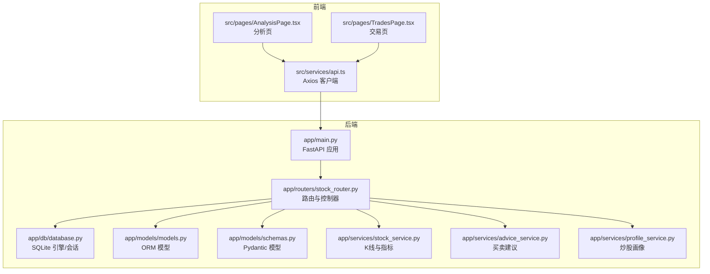
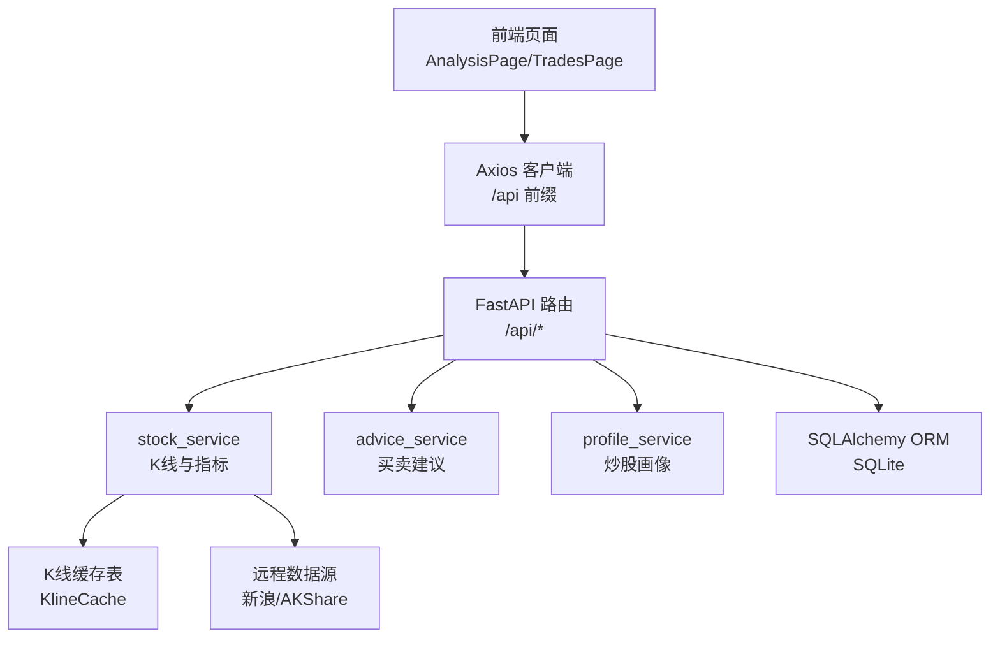
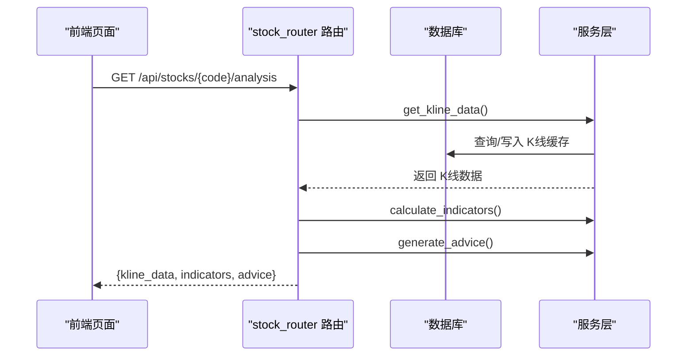
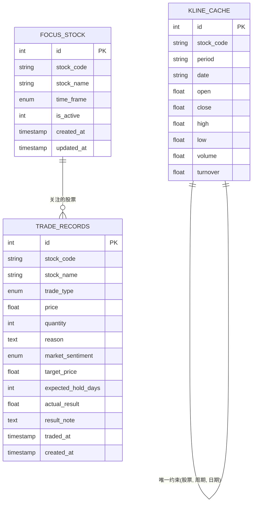
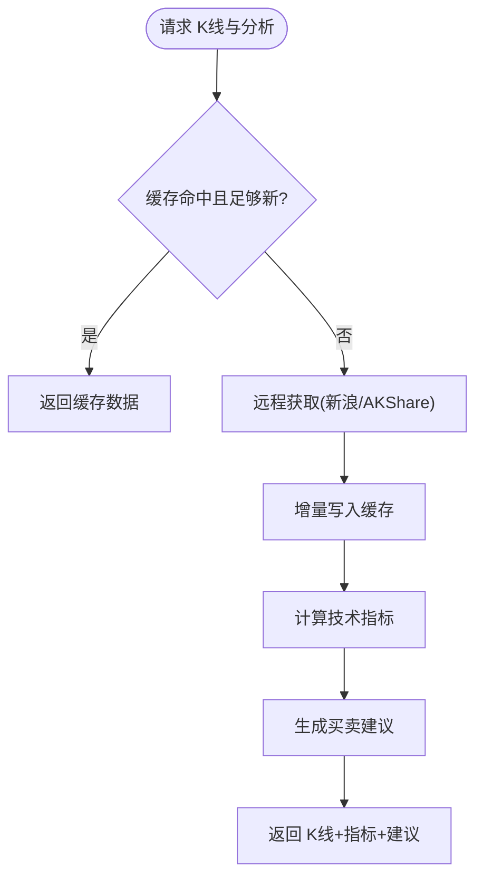
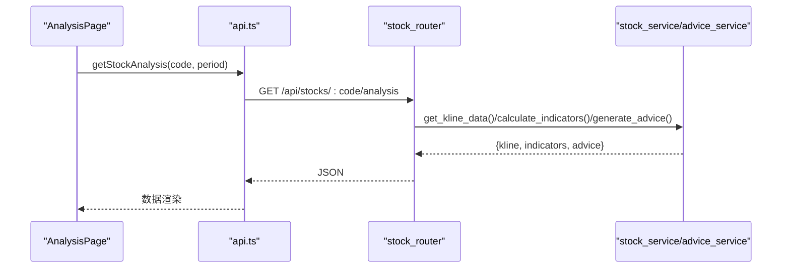
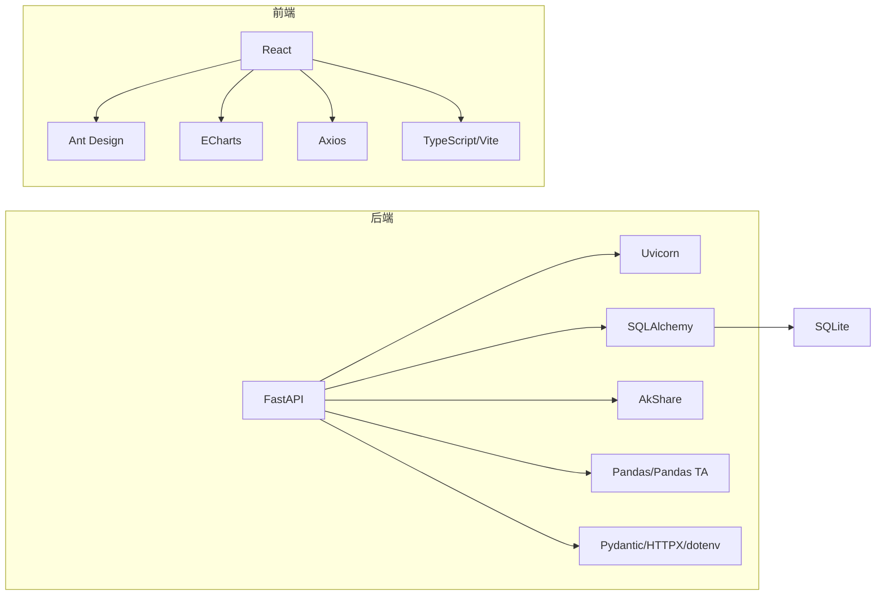

# 快速开始

<cite>
**本文引用的文件**
- [start.sh](file://start.sh)
- [stop.sh](file://stop.sh)
- [backend/requirements.txt](file://backend/requirements.txt)
- [frontend/package.json](file://frontend/package.json)
- [backend/app/main.py](file://backend/app/main.py)
- [backend/app/routers/stock_router.py](file://backend/app/routers/stock_router.py)
- [backend/app/db/database.py](file://backend/app/db/database.py)
- [backend/app/models/models.py](file://backend/app/models/models.py)
- [backend/app/models/schemas.py](file://backend/app/models/schemas.py)
- [backend/app/services/stock_service.py](file://backend/app/services/stock_service.py)
- [backend/app/services/advice_service.py](file://backend/app/services/advice_service.py)
- [backend/app/services/profile_service.py](file://backend/app/services/profile_service.py)
- [frontend/src/services/api.ts](file://frontend/src/services/api.ts)
- [frontend/src/pages/AnalysisPage.tsx](file://frontend/src/pages/AnalysisPage.tsx)
- [frontend/src/pages/TradesPage.tsx](file://frontend/src/pages/TradesPage.tsx)
- [doc/MVP实现说明.md](file://doc/MVP实现说明.md)
</cite>

## 目录
1. [简介](#简介)
2. [项目结构](#项目结构)
3. [核心组件](#核心组件)
4. [架构总览](#架构总览)
5. [详细组件分析](#详细组件分析)
6. [依赖关系分析](#依赖关系分析)
7. [性能注意事项](#性能注意事项)
8. [故障排除指南](#故障排除指南)
9. [结论](#结论)
10. [附录](#附录)

## 简介
Stock Foker 是一个前后端分离的股票分析与交易记录管理应用，提供股票搜索、K线与技术指标展示、买卖建议生成、交易记录管理与炒股画像统计等功能。后端基于 FastAPI + SQLAlchemy，前端基于 React + Ant Design + ECharts，支持本地 SQLite 缓存与多数据源容灾。

## 项目结构
- 后端 backend
  - 应用入口与路由：app/main.py、app/routers/stock_router.py
  - 数据库与模型：app/db/database.py、app/models/models.py、app/models/schemas.py
  - 服务层：app/services/stock_service.py、app/services/advice_service.py、app/services/profile_service.py
  - 依赖清单：backend/requirements.txt
- 前端 frontend
  - 页面与服务：src/pages/AnalysisPage.tsx、src/pages/TradesPage.tsx、src/services/api.ts
  - 包管理：frontend/package.json
- 运维脚本
  - 启动：start.sh
  - 停止：stop.sh
- 文档
  - doc/MVP实现说明.md

**图表来源**
- [backend/app/main.py:1-28](file://backend/app/main.py#L1-L28)
- [backend/app/routers/stock_router.py:1-197](file://backend/app/routers/stock_router.py#L1-L197)
- [backend/app/db/database.py:1-24](file://backend/app/db/database.py#L1-L24)
- [backend/app/models/models.py:1-75](file://backend/app/models/models.py#L1-L75)
- [backend/app/models/schemas.py:1-118](file://backend/app/models/schemas.py#L1-L118)
- [backend/app/services/stock_service.py:1-327](file://backend/app/services/stock_service.py#L1-L327)
- [backend/app/services/advice_service.py:1-193](file://backend/app/services/advice_service.py#L1-L193)
- [backend/app/services/profile_service.py:1-114](file://backend/app/services/profile_service.py#L1-L114)
- [frontend/src/services/api.ts:1-65](file://frontend/src/services/api.ts#L1-L65)
- [frontend/src/pages/AnalysisPage.tsx:1-213](file://frontend/src/pages/AnalysisPage.tsx#L1-L213)
- [frontend/src/pages/TradesPage.tsx:1-260](file://frontend/src/pages/TradesPage.tsx#L1-L260)

**章节来源**
- [backend/app/main.py:1-28](file://backend/app/main.py#L1-L28)
- [backend/app/routers/stock_router.py:1-197](file://backend/app/routers/stock_router.py#L1-L197)
- [backend/app/db/database.py:1-24](file://backend/app/db/database.py#L1-L24)
- [backend/app/models/models.py:1-75](file://backend/app/models/models.py#L1-L75)
- [backend/app/models/schemas.py:1-118](file://backend/app/models/schemas.py#L1-L118)
- [backend/app/services/stock_service.py:1-327](file://backend/app/services/stock_service.py#L1-L327)
- [backend/app/services/advice_service.py:1-193](file://backend/app/services/advice_service.py#L1-L193)
- [backend/app/services/profile_service.py:1-114](file://backend/app/services/profile_service.py#L1-L114)
- [frontend/src/services/api.ts:1-65](file://frontend/src/services/api.ts#L1-L65)
- [frontend/src/pages/AnalysisPage.tsx:1-213](file://frontend/src/pages/AnalysisPage.tsx#L1-L213)
- [frontend/src/pages/TradesPage.tsx:1-260](file://frontend/src/pages/TradesPage.tsx#L1-L260)

## 核心组件
- 后端应用与路由
  - 应用入口：注册 CORS、挂载路由、启动初始化数据库
  - 路由：关注股票、搜索、K线与分析、交易记录、炒股画像
- 数据库与模型
  - SQLite 引擎与会话；关注股票、交易记录、K线缓存表
- 服务层
  - K线与指标：本地缓存优先、远程降级、指标计算
  - 买卖建议：多指标综合评分与推理过程
  - 炒股画像：胜率、盈亏比、持仓偏好、交易频率、情绪准确率、常见理由
- 前端页面与服务
  - 分析页：K线蜡烛图、均线、成交量、买卖建议与推理
  - 交易页：增删改查、结果补录、情绪与预期参数
  - API 客户端：统一前缀 /api 的请求封装

**章节来源**
- [backend/app/main.py:1-28](file://backend/app/main.py#L1-L28)
- [backend/app/routers/stock_router.py:1-197](file://backend/app/routers/stock_router.py#L1-L197)
- [backend/app/db/database.py:1-24](file://backend/app/db/database.py#L1-L24)
- [backend/app/models/models.py:1-75](file://backend/app/models/models.py#L1-L75)
- [backend/app/services/stock_service.py:131-238](file://backend/app/services/stock_service.py#L131-L238)
- [backend/app/services/advice_service.py:4-173](file://backend/app/services/advice_service.py#L4-L173)
- [backend/app/services/profile_service.py:6-97](file://backend/app/services/profile_service.py#L6-L97)
- [frontend/src/pages/AnalysisPage.tsx:28-213](file://frontend/src/pages/AnalysisPage.tsx#L28-L213)
- [frontend/src/pages/TradesPage.tsx:28-260](file://frontend/src/pages/TradesPage.tsx#L28-L260)
- [frontend/src/services/api.ts:1-65](file://frontend/src/services/api.ts#L1-L65)

## 架构总览
应用采用“前端页面 + Axios 客户端 + 后端 API + 本地缓存”的分层架构。前端通过 /api 前缀访问后端路由，后端使用 SQLAlchemy 访问 SQLite，并在需要时调用外部数据源（新浪/AKShare）进行 K 线数据获取与指标计算，同时将缺失数据增量写入本地缓存。

**图表来源**
- [frontend/src/pages/AnalysisPage.tsx:1-213](file://frontend/src/pages/AnalysisPage.tsx#L1-L213)
- [frontend/src/pages/TradesPage.tsx:1-260](file://frontend/src/pages/TradesPage.tsx#L1-L260)
- [frontend/src/services/api.ts:1-65](file://frontend/src/services/api.ts#L1-L65)
- [backend/app/routers/stock_router.py:1-197](file://backend/app/routers/stock_router.py#L1-L197)
- [backend/app/services/stock_service.py:131-238](file://backend/app/services/stock_service.py#L131-L238)
- [backend/app/services/advice_service.py:4-173](file://backend/app/services/advice_service.py#L4-L173)
- [backend/app/services/profile_service.py:6-97](file://backend/app/services/profile_service.py#L6-L97)
- [backend/app/db/database.py:1-24](file://backend/app/db/database.py#L1-L24)
- [backend/app/models/models.py:58-75](file://backend/app/models/models.py#L58-L75)

## 详细组件分析

### 后端应用与路由
- 应用入口负责跨域配置、挂载路由与数据库初始化
- 路由模块提供关注股票、搜索、K线与分析、交易记录、炒股画像的接口
- 交易记录支持查询、创建、更新（补录结果）、删除

**图表来源**
- [backend/app/routers/stock_router.py:98-131](file://backend/app/routers/stock_router.py#L98-L131)
- [backend/app/services/stock_service.py:131-238](file://backend/app/services/stock_service.py#L131-L238)
- [backend/app/services/advice_service.py:4-173](file://backend/app/services/advice_service.py#L4-L173)

**章节来源**
- [backend/app/main.py:1-28](file://backend/app/main.py#L1-L28)
- [backend/app/routers/stock_router.py:1-197](file://backend/app/routers/stock_router.py#L1-L197)

### 数据库与模型
- 关注股票：唯一激活的关注，含时间框架
- 交易记录：买入/卖出、价格数量、理由、情绪、目标价、持有周期、实际盈亏与备注
- K线缓存：按股票+周期+日期去重，支持增量更新与当日覆盖

**图表来源**
- [backend/app/models/models.py:25-75](file://backend/app/models/models.py#L25-L75)

**章节来源**
- [backend/app/db/database.py:1-24](file://backend/app/db/database.py#L1-L24)
- [backend/app/models/models.py:1-75](file://backend/app/models/models.py#L1-L75)
- [backend/app/models/schemas.py:1-118](file://backend/app/models/schemas.py#L1-L118)

### 服务层：K线与指标、买卖建议、炒股画像
- K线与指标
  - 本地缓存优先，远程降级（新浪优先，AKShare 作为备用）
  - 增量更新：仅写入缺失日期，当日允许覆盖
  - 指标计算：MA、MACD、KDJ、RSI、布林带、成交量
- 买卖建议
  - 综合评分阈值：>0.3 买入，<-0.3 卖出，否则持有
  - 推理过程包含各指标数值与判断逻辑
- 炒股画像
  - 胜率、盈亏比、平均盈亏、平均持仓天数、交易频率、时间框架偏好、情绪准确率、常见理由

**图表来源**
- [backend/app/services/stock_service.py:131-238](file://backend/app/services/stock_service.py#L131-L238)
- [backend/app/services/advice_service.py:4-173](file://backend/app/services/advice_service.py#L4-L173)

**章节来源**
- [backend/app/services/stock_service.py:1-327](file://backend/app/services/stock_service.py#L1-L327)
- [backend/app/services/advice_service.py:1-193](file://backend/app/services/advice_service.py#L1-L193)
- [backend/app/services/profile_service.py:1-114](file://backend/app/services/profile_service.py#L1-L114)

### 前端页面与 API 客户端
- AnalysisPage
  - 依据关注股票与周期加载分析数据，渲染 K线蜡烛图、均线、成交量与买卖建议卡片
- TradesPage
  - 支持新增、编辑、删除交易记录，补充实际盈亏与备注
- API 客户端
  - 统一 baseURL 为 /api，封装关注、搜索、分析、交易、画像等接口

**图表来源**
- [frontend/src/pages/AnalysisPage.tsx:28-48](file://frontend/src/pages/AnalysisPage.tsx#L28-L48)
- [frontend/src/services/api.ts:31-41](file://frontend/src/services/api.ts#L31-L41)
- [backend/app/routers/stock_router.py:98-131](file://backend/app/routers/stock_router.py#L98-L131)
- [backend/app/services/stock_service.py:131-238](file://backend/app/services/stock_service.py#L131-L238)
- [backend/app/services/advice_service.py:4-173](file://backend/app/services/advice_service.py#L4-L173)

**章节来源**
- [frontend/src/pages/AnalysisPage.tsx:1-213](file://frontend/src/pages/AnalysisPage.tsx#L1-L213)
- [frontend/src/pages/TradesPage.tsx:1-260](file://frontend/src/pages/TradesPage.tsx#L1-L260)
- [frontend/src/services/api.ts:1-65](file://frontend/src/services/api.ts#L1-L65)

## 依赖关系分析
- 后端依赖
  - Web 框架与 ASGI 服务器：FastAPI、Uvicorn
  - 数据库与 ORM：SQLAlchemy
  - 数据与指标：AkShare、Pandas、Pandas TA
  - 类型校验与网络：Pydantic、HTTPX、python-dotenv
- 前端依赖
  - React 生态：React、React DOM、React Router
  - UI 组件：Ant Design、图标
  - 图表：ECharts、ECharts for React
  - 网络与工具：Axios、Day.js、TypeScript、Vite

**图表来源**
- [backend/requirements.txt:1-10](file://backend/requirements.txt#L1-L10)
- [frontend/package.json:11-28](file://frontend/package.json#L11-L28)

**章节来源**
- [backend/requirements.txt:1-10](file://backend/requirements.txt#L1-L10)
- [frontend/package.json:1-30](file://frontend/package.json#L1-L30)

## 性能注意事项
- K线缓存策略
  - 按股票+周期+日期去重，仅增量写入缺失日期，当日允许覆盖更新
  - 缓存命中时响应迅速，降低远程依赖
- 指标计算
  - 使用 Pandas/Pandas TA 批量计算，避免循环开销
- 前端渲染
  - ECharts 渲染蜡烛图与副图，建议控制数据长度与缩放范围以提升交互流畅度

**章节来源**
- [backend/app/services/stock_service.py:153-238](file://backend/app/services/stock_service.py#L153-L238)
- [doc/MVP实现说明.md:57-62](file://doc/MVP实现说明.md#L57-L62)

## 故障排除指南
- 启动后端 8000 端口占用
  - 使用停止脚本清理残留进程，或手动终止对应 PID
  - 若仍占用，脚本会尝试 lsof 清理端口
- 启动前端 5173 端口占用
  - 同上，停止脚本会清理并提示兜底处理
- Python 虚拟环境与依赖
  - 启动脚本会自动创建 venv 并安装 requirements.txt
  - 若 requirements 变更，会重新安装依赖
- Node 依赖
  - 若 package.json 变更，会重新安装依赖
- CORS 与跨域
  - 后端已允许前端开发地址 127.0.0.1:5173 的跨域请求
- 数据源异常
  - 远程失败时优先回退到本地缓存；若无缓存则抛出错误
- 常见症状与解决
  - “加载失败”：检查后端日志与网络连通性
  - “无数据”：确认已设置关注股票并选择合适周期
  - “图表空白”：检查前端控制台是否有网络错误

**章节来源**
- [start.sh:36-50](file://start.sh#L36-L50)
- [start.sh:73-87](file://start.sh#L73-L87)
- [stop.sh:40-48](file://stop.sh#L40-L48)
- [backend/app/main.py:9-15](file://backend/app/main.py#L9-L15)
- [backend/app/services/stock_service.py:240-253](file://backend/app/services/stock_service.py#L240-L253)

## 结论
Stock Foker 提供了从股票搜索、K线与技术分析、买卖建议到交易记录与炒股画像的完整闭环。通过本地缓存与多数据源容灾，兼顾离线可用与数据稳定性。按照本文的环境准备、依赖安装与启动流程，可快速运行应用并体验核心功能。

## 附录

### 环境准备与前置条件
- Python 3.x
  - 建议使用 Python 3.10 或以上版本
  - 启动脚本会自动创建并激活虚拟环境
- Node.js 与 npm
  - 前端依赖通过 npm 安装，使用国内镜像源加速
- 其他系统工具
  - macOS/Linux：支持 md5sum/md5 命令用于依赖哈希校验
  - 通用：curl 用于服务就绪检测

**章节来源**
- [start.sh:15-19](file://start.sh#L15-L19)
- [start.sh:54-59](file://start.sh#L54-L59)
- [start.sh:92-106](file://start.sh#L92-L106)

### 依赖安装步骤
- 后端 Python 包
  - 进入 backend 目录，启动脚本会自动创建虚拟环境并安装 requirements.txt
  - 若 requirements 变更，会重新安装
- 前端 Node.js 包
  - 进入 frontend 目录，启动脚本会安装 package.json 中的依赖
  - 若 package.json 变更，会重新安装

**章节来源**
- [backend/requirements.txt:1-10](file://backend/requirements.txt#L1-L10)
- [frontend/package.json:11-28](file://frontend/package.json#L11-L28)
- [start.sh:23-34](file://start.sh#L23-L34)
- [start.sh:61-71](file://start.sh#L61-L71)

### 项目启动流程
- 方式一：一键启动
  - 在仓库根目录执行启动脚本，自动完成后端与前端的依赖检查、安装与启动
  - 默认后端监听 127.0.0.1:8000，前端监听 127.0.0.1:5173
- 方式二：分别启动
  - 后端：进入 backend，创建并激活虚拟环境，安装依赖，启动 Uvicorn
  - 前端：进入 frontend，安装依赖，启动 Vite 开发服务器
- 服务就绪检测
  - 启动脚本会轮询后端与前端端口，确保页面可访问

**章节来源**
- [start.sh:1-113](file://start.sh#L1-L113)
- [backend/app/main.py:47-50](file://backend/app/main.py#L47-L50)
- [frontend/index.html](file://frontend/index.html)

### 项目停止流程
- 使用停止脚本
  - 自动读取 PID 文件并终止后端与前端进程
  - 若无 PID 文件或进程不存在，会提示相应信息
  - 最后兜底清理 8000 与 5173 端口残留进程

**章节来源**
- [stop.sh:1-56](file://stop.sh#L1-L56)

### 基本使用示例
- 股票搜索与关注
  - 在前端使用搜索功能查找股票，点击设置关注
  - 关注成功后，分析页将显示对应 K 线与技术指标
- 技术分析
  - 在分析页切换日K/周K/月K，查看均线、MACD、KDJ、RSI、布林带与成交量
  - 查看买卖建议与推理过程
- 交易记录管理
  - 在交易页新增记录，填写交易类型、价格、数量、日期、理由与情绪
  - 补充实际盈亏与备注，支持删除记录
- 炒股画像
  - 在交易页或画像相关入口查看胜率、盈亏比、持仓偏好、交易频率与常见理由

**章节来源**
- [frontend/src/pages/AnalysisPage.tsx:28-213](file://frontend/src/pages/AnalysisPage.tsx#L28-L213)
- [frontend/src/pages/TradesPage.tsx:28-260](file://frontend/src/pages/TradesPage.tsx#L28-L260)
- [backend/app/routers/stock_router.py:68-131](file://backend/app/routers/stock_router.py#L68-L131)
- [doc/MVP实现说明.md:1-86](file://doc/MVP实现说明.md#L1-L86)