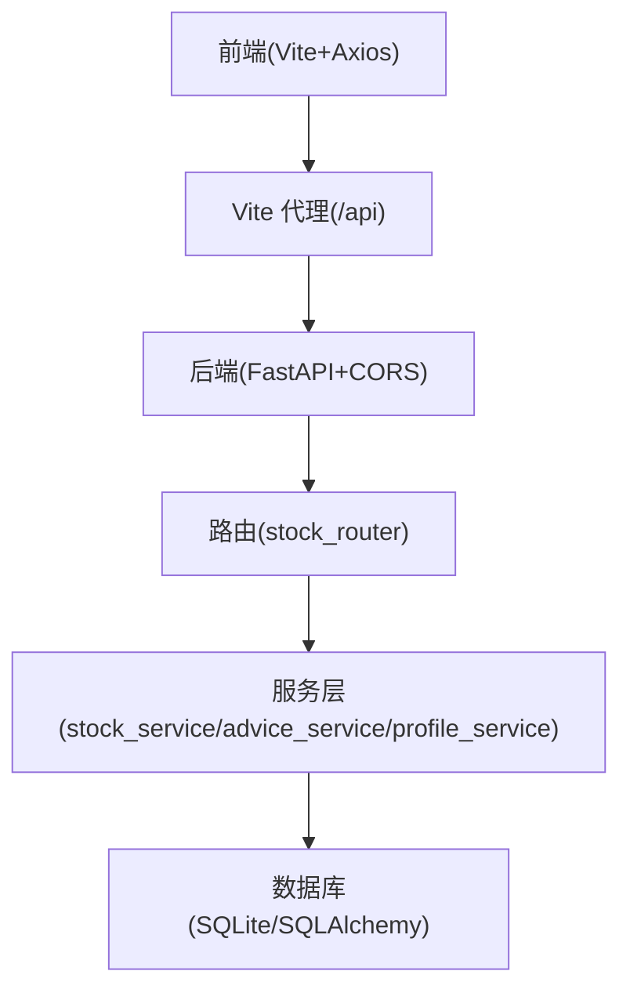
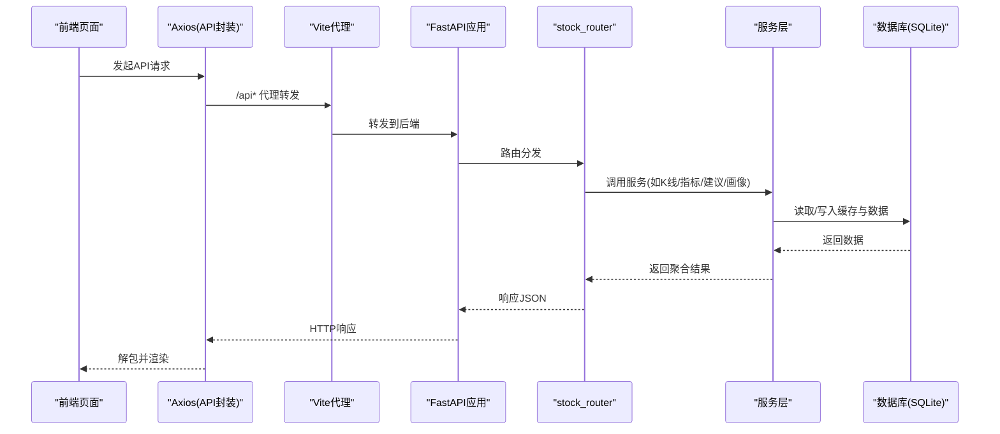
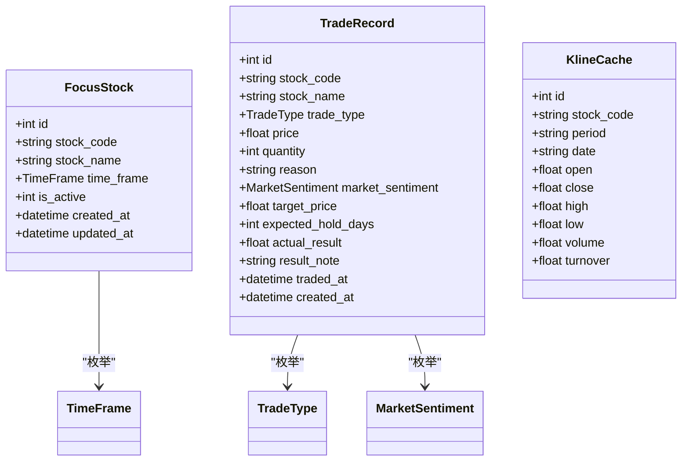
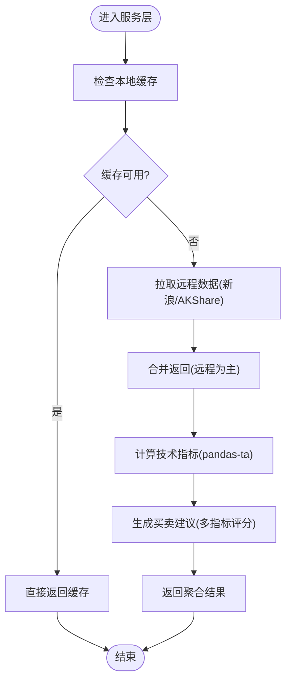
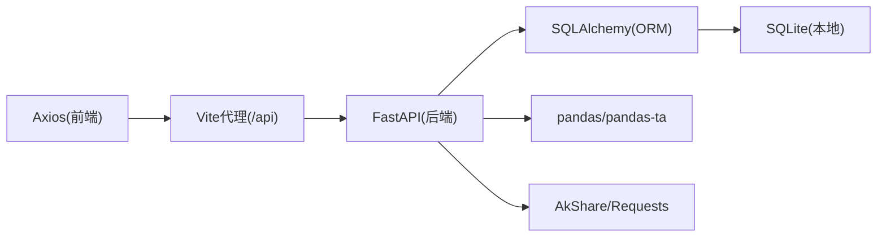

# API调用错误

<cite>
**本文引用的文件**

- [backend/app/main.py](file://backend/app/main.py)

- [backend/app/routers/stock_router.py](file://backend/app/routers/stock_router.py)

- [backend/app/services/stock_service.py](file://backend/app/services/stock_service.py)

- [backend/app/services/advice_service.py](file://backend/app/services/advice_service.py)

- [backend/app/services/profile_service.py](file://backend/app/services/profile_service.py)

- [backend/app/models/schemas.py](file://backend/app/models/schemas.py)

- [backend/app/models/models.py](file://backend/app/models/models.py)

- [backend/app/db/database.py](file://backend/app/db/database.py)

- [frontend/src/services/api.ts](file://frontend/src/services/api.ts)

- [frontend/src/types/index.ts](file://frontend/src/types/index.ts)

- [frontend/vite.config.ts](file://frontend/vite.config.ts)

- [backend/requirements.txt](file://backend/requirements.txt)

- [frontend/package.json](file://frontend/package.json)

- [doc/技术架构文档.md](file://doc/技术架构文档.md)
</cite>

## 目录
1. [简介](#简介)

2. [项目结构](#项目结构)

3. [核心组件](#核心组件)

4. [架构总览](#架构总览)

5. [详细组件分析](#详细组件分析)

6. [依赖分析](#依赖分析)

7. [性能考量](#性能考量)

8. [故障排除指南](#故障排除指南)

9. [结论](#结论)

10. [附录](#附录)

## 简介
本指南聚焦Stock Foker应用的API调用错误排查，覆盖HTTP状态码错误、请求参数验证失败、响应数据格式异常、跨域请求失败、网络超时、服务端异常、前端调试技巧与后端接口测试方法，并说明API版本兼容性与向后兼容性问题的处理方式。读者可据此快速定位问题根因并采取针对性修复措施。

## 项目结构
- 前端采用React + Vite + Axios，通过Vite代理将/api前缀转发至后端服务，便于开发环境联调。

- 后端基于FastAPI，启用CORS中间件允许指定来源访问；路由集中于stock_router，业务逻辑拆分在service层。

- 数据层使用SQLAlchemy + SQLite，提供本地持久化与K线缓存能力。

**图表来源**

- [frontend/vite.config.ts:1-16](file://frontend/vite.config.ts#L1-L16)

- [backend/app/main.py:1-28](file://backend/app/main.py#L1-L28)

- [backend/app/routers/stock_router.py:1-197](file://backend/app/routers/stock_router.py#L1-L197)

**章节来源**

- [doc/技术架构文档.md:19-67](file://doc/技术架构文档.md#L19-L67)

- [frontend/vite.config.ts:1-16](file://frontend/vite.config.ts#L1-L16)

- [backend/app/main.py:1-28](file://backend/app/main.py#L1-L28)

## 核心组件
- CORS与路由

  - 后端在启动时注册CORS中间件，允许前端开发地址访问；根路径提供健康检查。

- 路由与控制器

  - 股票关注、搜索、K线与分析、交易记录、炒股画像等接口集中在stock_router中，统一前缀/api。

- 服务层

  - 行情数据获取与缓存、技术指标计算、买卖建议生成、炒股画像生成。

- 数据模型与Schema

  - 使用Pydantic模型定义请求/响应结构，SQLAlchemy模型定义数据库表结构。

- 前端API封装

  - Axios实例以/baseURL="/api"封装各业务调用，统一参数传递与响应解包。

**章节来源**

- [backend/app/main.py:1-28](file://backend/app/main.py#L1-L28)

- [backend/app/routers/stock_router.py:1-197](file://backend/app/routers/stock_router.py#L1-L197)

- [backend/app/services/stock_service.py:1-327](file://backend/app/services/stock_service.py#L1-L327)

- [backend/app/models/schemas.py:1-118](file://backend/app/models/schemas.py#L1-L118)

- [backend/app/models/models.py:1-75](file://backend/app/models/models.py#L1-L75)

- [frontend/src/services/api.ts:1-68](file://frontend/src/services/api.ts#L1-L68)

## 架构总览
下图展示了从前端到后端的关键调用链路与数据流：

**图表来源**

- [frontend/src/services/api.ts:1-68](file://frontend/src/services/api.ts#L1-L68)

- [frontend/vite.config.ts:1-16](file://frontend/vite.config.ts#L1-L16)

- [backend/app/main.py:1-28](file://backend/app/main.py#L1-L28)

- [backend/app/routers/stock_router.py:1-197](file://backend/app/routers/stock_router.py#L1-L197)

- [backend/app/services/stock_service.py:1-327](file://backend/app/services/stock_service.py#L1-L327)

- [backend/app/db/database.py:1-24](file://backend/app/db/database.py#L1-L24)

## 详细组件分析

### 路由与接口清单
- 股票关注

  - GET /api/focus：获取当前关注股票

  - POST /api/focus：设置当前关注股票（自动取消旧关注）

  - PUT /api/focus/timeframe：更新当前关注股票的时间框架

  - GET /api/focus/history：获取历史关注记录

- 股票搜索与分析

  - GET /api/stocks/search?keyword=xxx：搜索股票

  - GET /api/stocks/{code}/kline：获取K线数据（带缓存）

  - GET /api/stocks/{code}/analysis：完整分析（K线+指标+建议）

- 交易记录

  - GET /api/trades：交易记录列表

  - POST /api/trades：新增交易记录

  - PUT /api/trades/{id}：更新交易结果

  - DELETE /api/trades/{id}：删除交易记录

- 炒股画像

  - GET /api/profile：获取炒股画像

**章节来源**

- [doc/技术架构文档.md:119-152](file://doc/技术架构文档.md#L119-L152)

- [backend/app/routers/stock_router.py:18-197](file://backend/app/routers/stock_router.py#L18-L197)

### 数据模型与Schema
- 请求/响应模型

  - FocusStockCreate/FocusStockResponse/TimeFrameUpdate

  - TradeRecordCreate/TradeRecordUpdate/TradeRecordResponse

  - KlineData/TechnicalIndicators/StockKlineResponse

  - TradingProfile/TradingAdvice

- 数据库模型

  - FocusStock、TradeRecord、KlineCache（含唯一约束）

**图表来源**

- [backend/app/models/models.py:25-75](file://backend/app/models/models.py#L25-L75)

- [backend/app/models/schemas.py:8-118](file://backend/app/models/schemas.py#L8-L118)

**章节来源**

- [backend/app/models/models.py:1-75](file://backend/app/models/models.py#L1-L75)

- [backend/app/models/schemas.py:1-118](file://backend/app/models/schemas.py#L1-L118)

### 服务层流程
- K线与技术指标

  - 优先读取本地缓存，缺失部分增量拉取远程数据，合并返回；支持新浪/AKShare双源降级。

  - 使用pandas-ta计算MA、MACD、KDJ、RSI、布林带等指标。

- 买卖建议

  - 综合多指标评分与推理过程，输出信号、置信度与理由。

- 炒股画像

  - 基于交易记录统计胜率、盈亏比、持有周期、交易频率、情绪准确率等维度。

**图表来源**

- [backend/app/services/stock_service.py:131-253](file://backend/app/services/stock_service.py#L131-L253)

- [backend/app/services/advice_service.py:4-173](file://backend/app/services/advice_service.py#L4-L173)

**章节来源**

- [backend/app/services/stock_service.py:1-327](file://backend/app/services/stock_service.py#L1-L327)

- [backend/app/services/advice_service.py:1-193](file://backend/app/services/advice_service.py#L1-L193)

- [backend/app/services/profile_service.py:1-114](file://backend/app/services/profile_service.py#L1-L114)

## 依赖分析
- 前端依赖

  - Axios用于HTTP请求封装，Vite提供开发服务器与代理配置。

- 后端依赖

  - FastAPI、SQLAlchemy、pandas、pandas-ta、AkShare等，支撑高性能API与数据处理。

- 跨域与代理

  - 后端CORS允许前端开发地址；Vite代理将/api转发至后端。

**图表来源**

- [frontend/package.json:1-30](file://frontend/package.json#L1-L30)

- [backend/requirements.txt:1-10](file://backend/requirements.txt#L1-L10)

- [frontend/vite.config.ts:1-16](file://frontend/vite.config.ts#L1-L16)

- [backend/app/main.py:1-28](file://backend/app/main.py#L1-L28)

**章节来源**

- [frontend/package.json:1-30](file://frontend/package.json#L1-L30)

- [backend/requirements.txt:1-10](file://backend/requirements.txt#L1-L10)

- [frontend/vite.config.ts:1-16](file://frontend/vite.config.ts#L1-L16)

- [backend/app/main.py:1-28](file://backend/app/main.py#L1-L28)

## 性能考量
- K线缓存与增量更新：优先使用本地缓存，仅拉取缺失日期，减少远程依赖与延迟。

- 指标计算：pandas-ta批量计算，避免逐条处理；NaN值处理与序列转换保证稳定性。

- 超时与重试：远程接口设置合理超时与重试策略，失败时回退至可用数据。

- 前端代理：Vite代理简化跨域，避免生产环境复杂CORS配置。

**章节来源**

- [backend/app/services/stock_service.py:131-253](file://backend/app/services/stock_service.py#L131-L253)

- [doc/技术架构文档.md:153-178](file://doc/技术架构文档.md#L153-L178)

## 故障排除指南

### 一、HTTP状态码错误
- 404 未找到

  - 场景：更新/删除交易记录时记录不存在；查询当前关注股票但无关注。

  - 排查要点：确认资源ID是否存在；确认关注状态是否正确。

  - 解决方案：先查询再操作；确保前端传入正确的ID与stock_code。

- 500 服务器内部错误

  - 场景：搜索/获取K线/生成分析时发生运行时异常。

  - 排查要点：查看后端异常堆栈；检查远程数据源可用性与返回格式。

  - 解决方案：增加降级逻辑（如缓存兜底）；完善异常捕获与错误详情返回。

**章节来源**

- [backend/app/routers/stock_router.py:48-50](file://backend/app/routers/stock_router.py#L48-L50)

- [backend/app/routers/stock_router.py:167-184](file://backend/app/routers/stock_router.py#L167-L184)

- [backend/app/routers/stock_router.py:76-78](file://backend/app/routers/stock_router.py#L76-L78)

- [backend/app/routers/stock_router.py:94-96](file://backend/app/routers/stock_router.py#L94-L96)

### 二、请求参数验证失败
- 常见问题

  - 缺少必填字段（如stock_code、price、quantity、traded_at）。

  - 参数类型不符（如price为字符串而非数值）。

  - 枚举值不在允许集合（如time_frame非short/medium/long）。

- 排查步骤

  - 检查前端调用处是否按类型定义传参；核对请求体结构。

  - 查看后端Pydantic模型字段与默认值；确认数据库枚举定义。

- 解决方案

  - 在前端类型系统中严格约束；在调用处做必要校验与转换。

  - 后端保持现有Schema不变，避免破坏向后兼容。

**章节来源**

- [frontend/src/types/index.ts:1-94](file://frontend/src/types/index.ts#L1-L94)

- [backend/app/models/schemas.py:8-118](file://backend/app/models/schemas.py#L8-L118)

- [backend/app/models/models.py:8-23](file://backend/app/models/models.py#L8-L23)

### 三、响应数据格式异常
- 症状

  - 前端类型断言失败；图表渲染报错。

- 根因

  - 后端返回字段与前端类型不一致；空值处理差异（如NaN vs null）。

- 排查与解决

  - 对齐前后端类型定义；确保后端序列化遵循Pydantic配置。

  - 前端对可选字段做好兜底处理；对数组/对象字段做存在性判断。

**章节来源**

- [backend/app/models/schemas.py:68-118](file://backend/app/models/schemas.py#L68-L118)

- [frontend/src/types/index.ts:15-94](file://frontend/src/types/index.ts#L15-L94)

### 四、跨域请求失败
- 现象

  - 浏览器控制台出现CORS错误；预检请求失败。

- 根因

  - 后端CORS允许的origins未包含前端地址；或headers/methods限制过严。

- 排查与解决

  - 确认后端CORS配置中的allow_origins包含"<http://localhost:5173"。>

  - 确认Vite代理已启用并正确转发"/api"。

  - 生产环境建议仅允许特定域名，避免"*"。

**章节来源**

- [backend/app/main.py:9-15](file://backend/app/main.py#L9-L15)

- [frontend/vite.config.ts:8-14](file://frontend/vite.config.ts#L8-L14)

### 五、网络超时与不稳定
- 症状

  - 请求长时间无响应；部分K线或搜索接口偶发失败。

- 根因

  - 远程数据源（新浪/AKShare）不稳定或超时。

- 排查与解决

  - 检查stock_service中的超时与重试策略；确认缓存可用时优先使用。

  - 前端对关键接口增加超时与重试包装；提供降级提示。

**章节来源**

- [backend/app/services/stock_service.py:83-84](file://backend/app/services/stock_service.py#L83-L84)

- [backend/app/services/stock_service.py:22-32](file://backend/app/services/stock_service.py#L22-L32)

### 六、服务端异常与日志
- 建议

  - 在路由层捕获运行时异常并返回明确错误信息。

  - 记录关键请求参数与异常堆栈，便于定位。

- 前端配合

  - 对所有API调用添加统一错误处理与用户提示。

**章节来源**

- [backend/app/routers/stock_router.py:76-78](file://backend/app/routers/stock_router.py#L76-L78)

- [backend/app/routers/stock_router.py:94-96](file://backend/app/routers/stock_router.py#L94-L96)

### 七、前端API调用调试技巧
- 使用浏览器开发者工具Network面板观察请求/响应；核对状态码与Headers。

- 在Vite代理配置下，确认/api前缀已正确转发至后端。

- 对关键接口增加try/catch与错误提示；对必填参数做前端校验。

- 使用类型定义约束请求体，避免类型不匹配导致的后端校验失败。

**章节来源**

- [frontend/src/services/api.ts:1-68](file://frontend/src/services/api.ts#L1-L68)

- [frontend/vite.config.ts:1-16](file://frontend/vite.config.ts#L1-L16)

- [frontend/src/types/index.ts:1-94](file://frontend/src/types/index.ts#L1-L94)

### 八、后端接口测试方法
- 单元测试

  - 针对服务层函数（如指标计算、建议生成）编写测试用例，覆盖边界与异常分支。

- 集成测试

  - 使用FastAPI TestClient发起HTTP请求，验证路由行为与响应结构。

- 数据一致性

  - 通过SQLAlchemy会话模拟真实事务，验证增删改查与缓存写入逻辑。

**章节来源**

- [backend/app/services/advice_service.py:1-193](file://backend/app/services/advice_service.py#L1-L193)

- [backend/app/services/stock_service.py:1-327](file://backend/app/services/stock_service.py#L1-L327)

### 九、API版本兼容性与向后兼容
- 版本标识

  - 后端应用声明版本号，可用于客户端识别与兼容策略制定。

- 向后兼容

  - 保持现有Schema与接口签名稳定；新增字段采用可选或默认值。

  - 对枚举与常量扩展时，确保旧客户端仍能正常工作。

- 前后端协作

  - 前端在类型系统中对可选字段做兼容处理；后端在响应中保留历史字段。

**章节来源**

- [backend/app/main.py:7](file://backend/app/main.py#L7)

- [backend/app/models/schemas.py:14-64](file://backend/app/models/schemas.py#L14-L64)

- [backend/app/models/models.py:25-56](file://backend/app/models/models.py#L25-L56)

## 结论
通过明确的路由与服务分层、严格的Schema校验、完善的CORS与代理配置，以及针对超时与异常的降级策略，Stock Foker的API具备较好的稳定性与可维护性。遇到问题时，建议按“参数校验—跨域—网络—服务—响应格式”的顺序逐项排查，并结合前后端类型与版本信息进行兼容性处理。

## 附录
- 常用排查清单

  - 确认前端代理与CORS配置正确

  - 核对请求参数类型与必填字段

  - 检查后端异常捕获与错误详情

  - 验证K线缓存与远程数据源可用性

  - 对比前后端类型定义，确保字段一致
