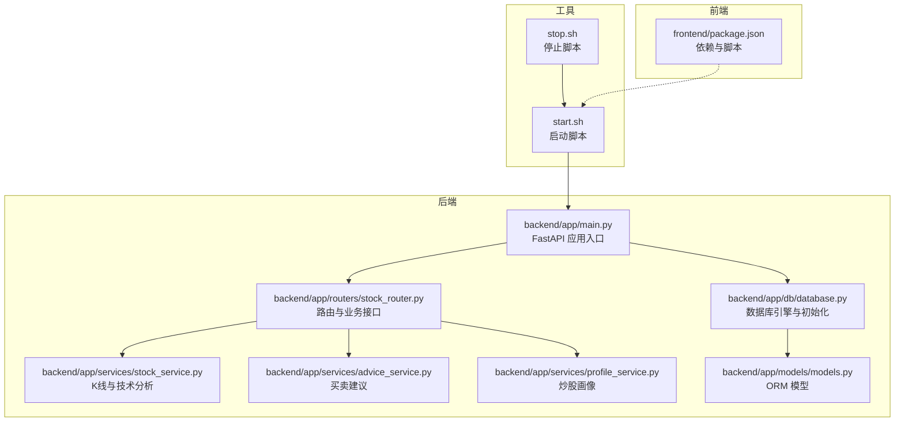
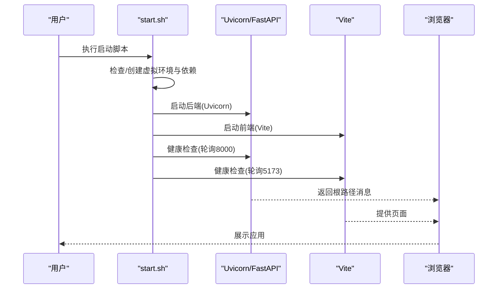
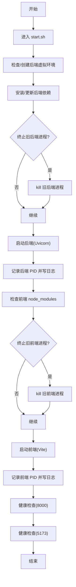
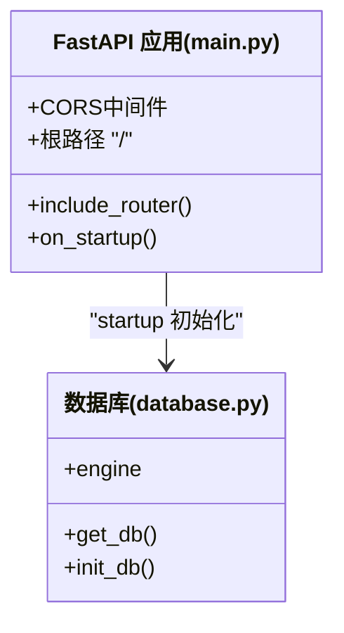
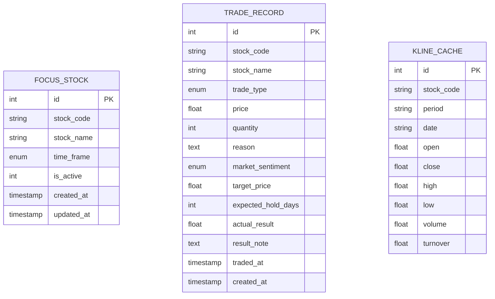
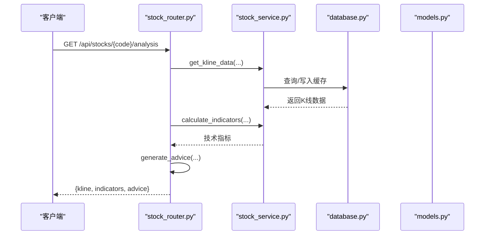
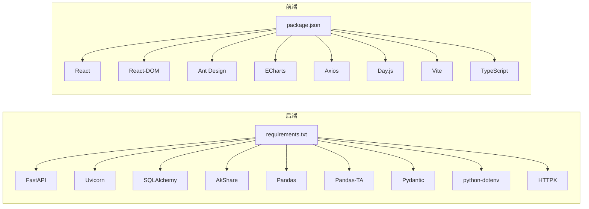

# 启动问题

<cite>
**本文引用的文件**

- [start.sh](file://start.sh)

- [stop.sh](file://stop.sh)

- [backend/app/main.py](file://backend/app/main.py)

- [backend/app/db/database.py](file://backend/app/db/database.py)

- [backend/requirements.txt](file://backend/requirements.txt)

- [backend/app/routers/stock_router.py](file://backend/app/routers/stock_router.py)

- [backend/app/models/models.py](file://backend/app/models/models.py)

- [backend/app/services/stock_service.py](file://backend/app/services/stock_service.py)

- [backend/app/services/advice_service.py](file://backend/app/services/advice_service.py)

- [backend/app/services/profile_service.py](file://backend/app/services/profile_service.py)

- [frontend/package.json](file://frontend/package.json)
</cite>

## 目录
1. [简介](#简介)

2. [项目结构](#项目结构)

3. [核心组件](#核心组件)

4. [架构总览](#架构总览)

5. [详细组件分析](#详细组件分析)

6. [依赖分析](#依赖分析)

7. [性能考量](#性能考量)

8. [故障排除指南](#故障排除指南)

9. [结论](#结论)

10. [附录](#附录)

## 简介
本指南聚焦于 Stock Foker 应用的启动问题排查，覆盖 FastAPI 应用启动失败、CORS 配置错误、数据库初始化异常等常见问题。内容包括启动脚本执行流程、端口占用检查、依赖版本冲突排查、环境变量配置要点、启动日志分析方法与错误代码解读，并提供系统化的问题定位流程与预防措施。

## 项目结构
应用采用前后端分离结构：

- 后端使用 FastAPI + Uvicorn，SQLite 作为本地存储，通过 SQLAlchemy ORM 管理模型与会话。

- 前端使用 Vite 开发服务器，React 生态组件与图表库。

- 启动脚本负责创建/激活虚拟环境、安装依赖、启动后端与前端服务，并进行健康检查。

**图示来源**

- [backend/app/main.py:1-28](file://backend/app/main.py#L1-L28)

- [backend/app/db/database.py:1-24](file://backend/app/db/database.py#L1-L24)

- [backend/app/routers/stock_router.py:1-197](file://backend/app/routers/stock_router.py#L1-L197)

- [backend/app/services/stock_service.py:1-327](file://backend/app/services/stock_service.py#L1-L327)

- [backend/app/services/advice_service.py:1-193](file://backend/app/services/advice_service.py#L1-L193)

- [backend/app/services/profile_service.py:1-114](file://backend/app/services/profile_service.py#L1-L114)

- [backend/app/models/models.py:1-75](file://backend/app/models/models.py#L1-L75)

- [start.sh:1-113](file://start.sh#L1-L113)

- [stop.sh:1-56](file://stop.sh#L1-L56)

- [frontend/package.json:1-30](file://frontend/package.json#L1-L30)

**章节来源**

- [start.sh:1-113](file://start.sh#L1-L113)

- [stop.sh:1-56](file://stop.sh#L1-L56)

- [backend/app/main.py:1-28](file://backend/app/main.py#L1-L28)

- [backend/app/db/database.py:1-24](file://backend/app/db/database.py#L1-L24)

- [backend/app/routers/stock_router.py:1-197](file://backend/app/routers/stock_router.py#L1-L197)

- [backend/app/models/models.py:1-75](file://backend/app/models/models.py#L1-L75)

- [backend/app/services/stock_service.py:1-327](file://backend/app/services/stock_service.py#L1-L327)

- [backend/app/services/advice_service.py:1-193](file://backend/app/services/advice_service.py#L1-L193)

- [backend/app/services/profile_service.py:1-114](file://backend/app/services/profile_service.py#L1-L114)

- [frontend/package.json:1-30](file://frontend/package.json#L1-L30)

## 核心组件
- 启动脚本：负责虚拟环境与依赖管理、后端/前端进程启动、健康检查与日志输出。

- FastAPI 应用：注册 CORS 中间件、挂载路由、在 startup 事件中初始化数据库。

- 数据库模块：定义 SQLite 引擎、会话工厂、基础模型类与数据库初始化函数。

- 路由与服务：提供股票关注、交易记录、K线与技术分析、买卖建议与炒股画像等接口。

- 前端依赖：Vite、React、Ant Design、ECharts 等，用于开发与构建。

**章节来源**

- [start.sh:1-113](file://start.sh#L1-L113)

- [backend/app/main.py:1-28](file://backend/app/main.py#L1-L28)

- [backend/app/db/database.py:1-24](file://backend/app/db/database.py#L1-L24)

- [backend/app/routers/stock_router.py:1-197](file://backend/app/routers/stock_router.py#L1-L197)

- [backend/app/services/stock_service.py:1-327](file://backend/app/services/stock_service.py#L1-L327)

- [frontend/package.json:1-30](file://frontend/package.json#L1-L30)

## 架构总览
后端通过 Uvicorn 在 127.0.0.1:8000 提供 API；前端通过 Vite 在 127.0.0.1:5173 提供开发界面。启动脚本在启动后端与前端后，分别对两个端口进行轮询健康检查，确保服务可用。

**图示来源**

- [start.sh:46-106](file://start.sh#L46-L106)

- [backend/app/main.py:25-28](file://backend/app/main.py#L25-L28)

**章节来源**

- [start.sh:46-106](file://start.sh#L46-L106)

- [backend/app/main.py:25-28](file://backend/app/main.py#L25-L28)

## 详细组件分析

### 启动脚本执行流程
- 虚拟环境与依赖：检测后端 venv 是否存在，不存在则创建；比较 requirements.txt 的哈希值决定是否安装/更新依赖。

- 后端启动：终止旧后端进程（若存在），在后台启动 Uvicorn，绑定 127.0.0.1:8000，输出日志至 .pids/backend.log，并记录 PID。

- 前端启动：检测 node_modules，不存在则安装；比较 package.json 哈希值决定是否重新安装；终止旧前端进程，启动 Vite，绑定 127.0.0.1:5173，输出日志至 .pids/frontend.log，并记录 PID。

- 健康检查：对 8000 与 5173 端口进行最多 10 秒的轮询检查，确认服务就绪。

**图示来源**

- [start.sh:15-106](file://start.sh#L15-L106)

**章节来源**

- [start.sh:15-106](file://start.sh#L15-L106)

### FastAPI 应用与 CORS
- 应用在 startup 事件中调用数据库初始化函数，确保表结构存在。

- CORS 中间件允许来自前端地址的跨域请求，支持凭据与所有方法/头。

**图示来源**

- [backend/app/main.py:1-28](file://backend/app/main.py#L1-L28)

- [backend/app/db/database.py:1-24](file://backend/app/db/database.py#L1-L24)

**章节来源**

- [backend/app/main.py:9-22](file://backend/app/main.py#L9-L22)

- [backend/app/db/database.py:22-24](file://backend/app/db/database.py#L22-L24)

### 数据库初始化与模型
- 使用 SQLite，连接字符串指向本地文件。

- 初始化函数创建所有模型对应的表。

- 会话工厂提供依赖注入，确保每个请求的数据库会话正确关闭。

**图示来源**

- [backend/app/models/models.py:25-75](file://backend/app/models/models.py#L25-L75)

- [backend/app/db/database.py:1-24](file://backend/app/db/database.py#L1-L24)

**章节来源**

- [backend/app/db/database.py:4-24](file://backend/app/db/database.py#L4-L24)

- [backend/app/models/models.py:25-75](file://backend/app/models/models.py#L25-L75)

### 接口与服务层
- 路由层提供关注股票、交易记录、K线与分析、炒股画像等接口。

- 服务层封装 K 线获取与技术指标计算、买卖建议生成、炒股画像统计逻辑。

- 路由层对异常进行捕获并转换为 HTTP 异常，便于前端处理。

**图示来源**

- [backend/app/routers/stock_router.py:98-131](file://backend/app/routers/stock_router.py#L98-L131)

- [backend/app/services/stock_service.py:131-237](file://backend/app/services/stock_service.py#L131-L237)

- [backend/app/db/database.py:14-24](file://backend/app/db/database.py#L14-L24)

- [backend/app/models/models.py:58-75](file://backend/app/models/models.py#L58-L75)

**章节来源**

- [backend/app/routers/stock_router.py:70-131](file://backend/app/routers/stock_router.py#L70-L131)

- [backend/app/services/stock_service.py:131-237](file://backend/app/services/stock_service.py#L131-L237)

## 依赖分析
- 后端依赖：FastAPI、Uvicorn、SQLAlchemy、AkShare、Pandas、Pandas-TA、Pydantic、python-dotenv、HTTPX。

- 前端依赖：React、React DOM、Ant Design、ECharts、Axios、Day.js、Vite、TypeScript。

**图示来源**

- [backend/requirements.txt:1-10](file://backend/requirements.txt#L1-L10)

- [frontend/package.json:1-30](file://frontend/package.json#L1-L30)

**章节来源**

- [backend/requirements.txt:1-10](file://backend/requirements.txt#L1-L10)

- [frontend/package.json:1-30](file://frontend/package.json#L1-L30)

## 性能考量
- 启动阶段的依赖安装与哈希校验会带来一定开销，建议在稳定环境下复用虚拟环境与 node_modules。

- 健康检查轮询间隔较短，通常可在 10 秒内完成就绪判定。

- 数据库初始化仅在应用启动时执行一次，后续通过会话管理保证资源释放。

[本节为通用指导，无需特定文件来源]

## 故障排除指南

### 一、FastAPI 应用启动失败
常见症状

- 后端进程启动后立即退出或无法访问 127.0.0.1:8000。

- 启动日志显示 ImportError 或 ModuleNotFoundError。

排查步骤

1. 检查虚拟环境与依赖

   - 确认后端 venv 是否存在且激活成功。

   - 对比 requirements.txt 的哈希值，确认依赖已安装/更新。

   - 参考路径：[start.sh:15-34](file://start.sh#L15-L34)

2. 查看后端日志

   - 日志文件位置：.pids/backend.log。

   - 关注启动时的导入错误、端口占用、CORS 配置、数据库初始化异常等信息。

   - 参考路径：[start.sh:48-50](file://start.sh#L48-L50)

3. 端口占用检查

   - 使用 lsof 或 netstat 检查 8000 端口是否被占用。

   - 若占用，可使用 stop.sh 进行清理，或手动 kill 占用进程。

   - 参考路径：[stop.sh:40-48](file://stop.sh#L40-L48)

4. CORS 配置验证

   - 确认前端地址已在 allow_origins 列表中。

   - 参考路径：[backend/app/main.py:9-15](file://backend/app/main.py#L9-L15)

5. 数据库初始化异常

   - 确认 SQLite 文件权限与磁盘空间充足。

   - 检查 init_db() 是否抛出异常，查看 .pids/backend.log。

   - 参考路径：[backend/app/db/database.py:22-24](file://backend/app/db/database.py#L22-L24)

错误代码与解读

- ImportError/ModuleNotFoundError：依赖未安装或版本不兼容。

- OSError: [Errno 98] Address already in use：端口 8000 已被占用。

- SQLAlchemy 错误：如数据库文件不可写、连接参数错误等。

**章节来源**

- [start.sh:15-50](file://start.sh#L15-L50)

- [stop.sh:40-48](file://stop.sh#L40-L48)

- [backend/app/main.py:9-15](file://backend/app/main.py#L9-L15)

- [backend/app/db/database.py:22-24](file://backend/app/db/database.py#L22-L24)

### 二、CORS 配置错误
常见症状

- 前端发起跨域请求被浏览器拦截，控制台出现 CORS 相关错误。

排查步骤

1. 确认前端地址与协议一致（http/https）。

2. 检查 allow_origins 是否包含前端地址。

3. 如需本地多机或多域名访问，扩展 allow_origins 列表。

4. 参考路径：[backend/app/main.py:9-15](file://backend/app/main.py#L9-L15)

**章节来源**

- [backend/app/main.py:9-15](file://backend/app/main.py#L9-L15)

### 三、数据库初始化异常
常见症状

- 应用启动时报错与表创建相关，或首次访问接口时报错。

排查步骤

1. 确认 SQLite 文件路径与权限正常。

2. 检查 init_db() 调用是否在 startup 事件中执行。

3. 查看 .pids/backend.log 中的 SQLAlchemy 报错详情。

4. 参考路径：

   - [backend/app/main.py:20-22](file://backend/app/main.py#L20-L22)

   - [backend/app/db/database.py:22-24](file://backend/app/db/database.py#L22-L24)

**章节来源**

- [backend/app/main.py:20-22](file://backend/app/main.py#L20-L22)

- [backend/app/db/database.py:22-24](file://backend/app/db/database.py#L22-L24)

### 四、启动脚本执行问题
常见症状

- 启动后仅启动了部分组件，或健康检查失败。

- 依赖安装卡住或失败。

排查步骤

1. 检查 start.sh 的输出与 .pids 下的日志文件。

2. 确认 Python 与 Node 版本满足 requirements.txt 与 package.json 的要求。

3. 若依赖安装失败，尝试更换镜像源或离线安装。

4. 参考路径：

   - [start.sh:23-34](file://start.sh#L23-L34)

   - [start.sh:54-71](file://start.sh#L54-L71)

   - [backend/requirements.txt:1-10](file://backend/requirements.txt#L1-L10)

   - [frontend/package.json:1-30](file://frontend/package.json#L1-L30)

**章节来源**

- [start.sh:23-34](file://start.sh#L23-L34)

- [start.sh:54-71](file://start.sh#L54-L71)

- [backend/requirements.txt:1-10](file://backend/requirements.txt#L1-L10)

- [frontend/package.json:1-30](file://frontend/package.json#L1-L30)

### 五、端口占用检查与清理
- 使用 stop.sh 清理残留进程与 PID 文件。

- 若仍占用，使用 lsof -ti:PORT 强制终止对应 PID。

- 参考路径：[stop.sh:40-48](file://stop.sh#L40-L48)

**章节来源**

- [stop.sh:40-48](file://stop.sh#L40-L48)

### 六、依赖包版本冲突
- 后端：核对 FastAPI/Uvicorn/SQLAlchemy/Pandas 等版本范围，避免不兼容。

- 前端：核对 React/Vite/TypeScript 版本，确保与现有工程配置一致。

- 参考路径：

   - [backend/requirements.txt:1-10](file://backend/requirements.txt#L1-L10)

   - [frontend/package.json:1-30](file://frontend/package.json#L1-L30)

**章节来源**

- [backend/requirements.txt:1-10](file://backend/requirements.txt#L1-L10)

- [frontend/package.json:1-30](file://frontend/package.json#L1-L30)

### 七、环境变量配置
- 如需使用 .env，请在启动前确保已加载，或在启动脚本中显式设置。

- 注意 python-dotenv 的使用场景与加载顺序。

- 参考路径：[backend/requirements.txt:8-8](file://backend/requirements.txt#L8-L8)

**章节来源**

- [backend/requirements.txt:8-8](file://backend/requirements.txt#L8-L8)

### 八、启动日志分析方法
- 后端日志：.pids/backend.log，关注 ImportError、端口绑定、CORS 注册、数据库初始化、路由加载等信息。

- 前端日志：.pids/frontend.log，关注依赖安装、端口绑定、热更新等信息。

- 健康检查：start.sh 对 8000/5173 的轮询输出，确认服务可用。

**章节来源**

- [start.sh:48-50](file://start.sh#L48-L50)

- [start.sh:84-87](file://start.sh#L84-L87)

- [start.sh:92-106](file://start.sh#L92-L106)

### 九、系统性问题定位流程
- 第一步：确认虚拟环境与依赖安装状态。

- 第二步：检查端口占用并清理。

- 第三步：查看后端日志，定位 ImportError/CORS/数据库初始化问题。

- 第四步：验证前端依赖与 Vite 启动状态。

- 第五步：进行健康检查，确认服务就绪。

- 第六步：如仍失败，逐步回退到最小可运行配置，缩小问题范围。

**章节来源**

- [start.sh:15-106](file://start.sh#L15-L106)

- [stop.sh:40-48](file://stop.sh#L40-L48)

### 十、预防措施
- 在 CI/CD 中固定依赖版本，避免上游变更导致的不稳定。

- 使用独立的虚拟环境与 node_modules，减少全局污染。

- 在启动脚本中增加更细粒度的错误处理与重试机制。

- 对外暴露的 CORS 配置应遵循最小授权原则，避免过度放行。

[本节为通用指导，无需特定文件来源]

## 结论
通过系统化的启动脚本执行流程、端口占用检查、依赖版本核对与日志分析，大多数启动问题均可快速定位与修复。建议在开发与部署环境中固化依赖版本、规范 CORS 配置与数据库初始化流程，并建立完善的日志与健康检查机制，以提升系统的稳定性与可观测性。

[本节为总结性内容，无需特定文件来源]

## 附录

### A. 常见错误与解决方案速查
- 启动后 8000 端口无响应

  - 检查端口占用与防火墙设置；参考 [stop.sh:40-48](file://stop.sh#L40-L48)

- CORS 跨域失败

  - 核对 allow_origins；参考 [backend/app/main.py:9-15](file://backend/app/main.py#L9-L15)

- 数据库初始化失败

  - 检查 SQLite 权限与磁盘空间；参考 [backend/app/db/database.py:22-24](file://backend/app/db/database.py#L22-L24)

- 依赖安装失败

  - 更换镜像源或离线安装；参考 [start.sh:23-34](file://start.sh#L23-L34)

**章节来源**

- [stop.sh:40-48](file://stop.sh#L40-L48)

- [backend/app/main.py:9-15](file://backend/app/main.py#L9-L15)

- [backend/app/db/database.py:22-24](file://backend/app/db/database.py#L22-L24)

- [start.sh:23-34](file://start.sh#L23-L34)
