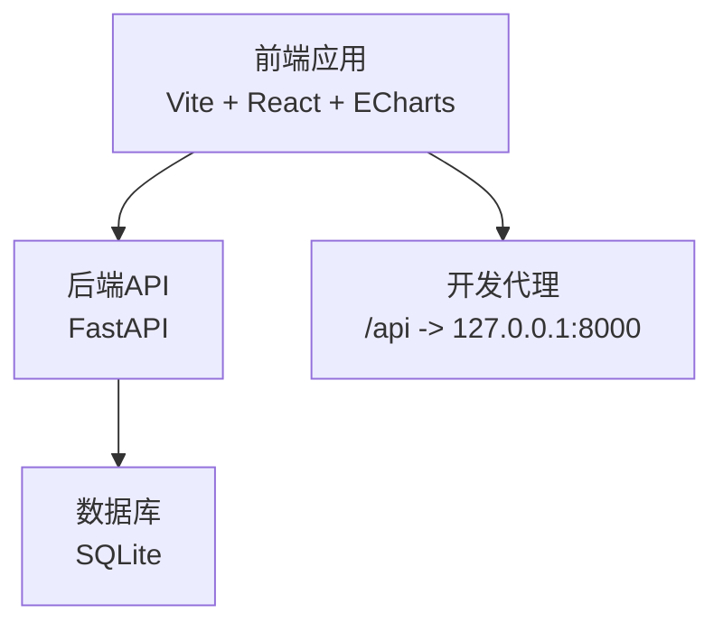
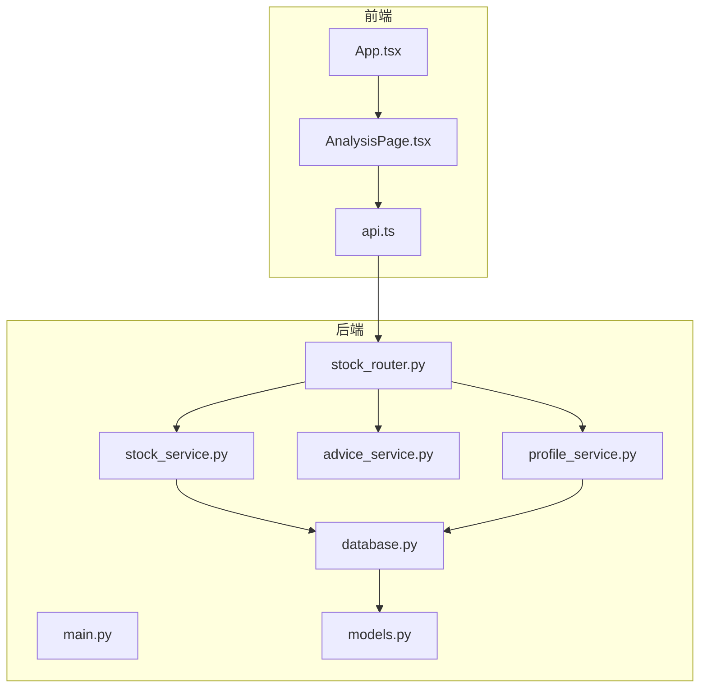
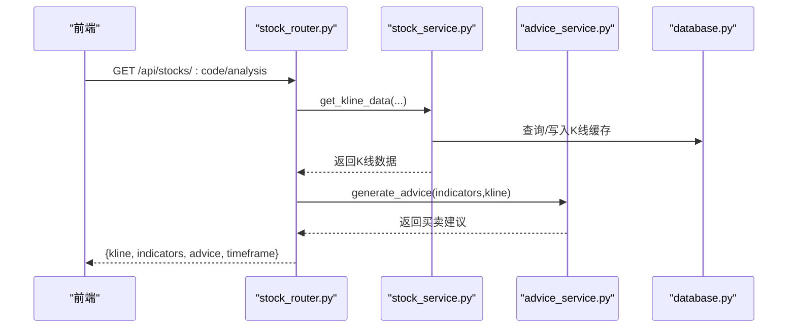
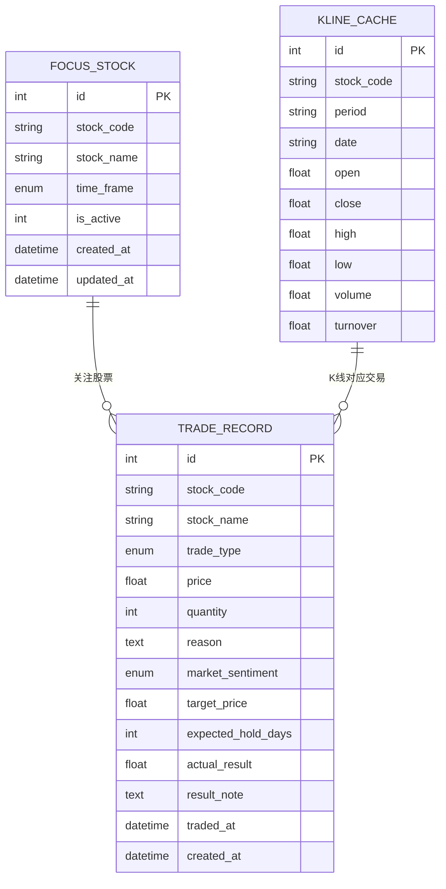
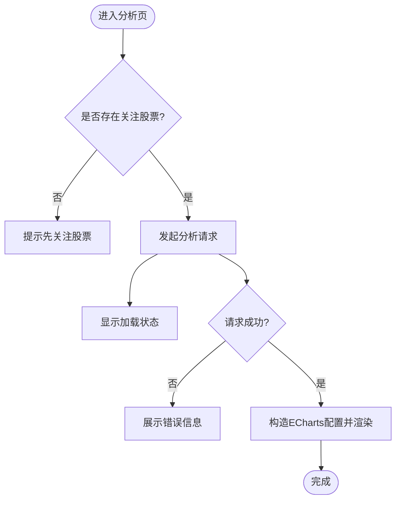
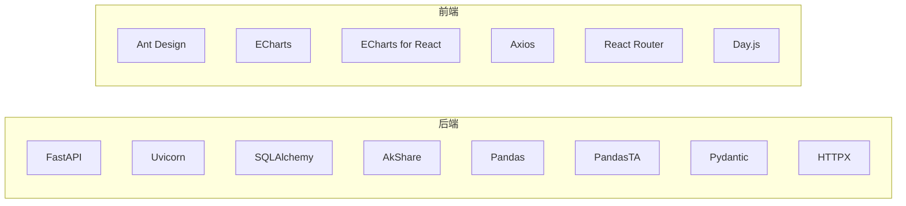

# 性能问题诊断

<cite>
**本文引用的文件**

- [backend/app/main.py](file://backend/app/main.py)

- [backend/app/routers/stock_router.py](file://backend/app/routers/stock_router.py)

- [backend/app/services/stock_service.py](file://backend/app/services/stock_service.py)

- [backend/app/services/advice_service.py](file://backend/app/services/advice_service.py)

- [backend/app/services/profile_service.py](file://backend/app/services/profile_service.py)

- [backend/app/db/database.py](file://backend/app/db/database.py)

- [backend/app/models/models.py](file://backend/app/models/models.py)

- [backend/requirements.txt](file://backend/requirements.txt)

- [frontend/src/App.tsx](file://frontend/src/App.tsx)

- [frontend/src/pages/AnalysisPage.tsx](file://frontend/src/pages/AnalysisPage.tsx)

- [frontend/src/services/api.ts](file://frontend/src/services/api.ts)

- [frontend/vite.config.ts](file://frontend/vite.config.ts)

- [frontend/package.json](file://frontend/package.json)

- [start.sh](file://start.sh)

- [stop.sh](file://stop.sh)
</cite>

## 目录
1. [简介](#简介)

2. [项目结构](#项目结构)

3. [核心组件](#核心组件)

4. [架构总览](#架构总览)

5. [详细组件分析](#详细组件分析)

6. [依赖分析](#依赖分析)

7. [性能考量](#性能考量)

8. [故障排除指南](#故障排除指南)

9. [结论](#结论)

10. [附录](#附录)

## 简介
本指南面向Stock Foker应用的性能问题排查，聚焦以下方面：

- 响应时间过长：后端API延迟、前端渲染卡顿、图表绘制阻塞

- 内存泄漏：前后端未释放的资源、缓存增长

- CPU占用过高：指标计算、图表渲染、数据库查询

- 并发请求处理异常：连接池耗尽、锁竞争、超时

- 前端组件渲染性能与图表优化

- 后端API响应优化

- 性能监控指标与基准测试

- 数据库查询优化、缓存策略调整、资源使用分析

- 性能瓶颈定位与系统扩容策略

## 项目结构
项目采用前后端分离架构：前端使用Vite+React+ECharts，后端使用FastAPI+SQLAlchemy+SQLite。开发阶段通过代理将前端请求转发至后端。

**图示来源**

- [frontend/vite.config.ts:1-16](file://frontend/vite.config.ts#L1-L16)

- [backend/app/main.py:1-28](file://backend/app/main.py#L1-L28)

- [backend/app/db/database.py:1-24](file://backend/app/db/database.py#L1-L24)

**章节来源**

- [frontend/vite.config.ts:1-16](file://frontend/vite.config.ts#L1-L16)

- [backend/app/main.py:1-28](file://backend/app/main.py#L1-L28)

- [backend/app/db/database.py:1-24](file://backend/app/db/database.py#L1-L24)

## 核心组件
- 后端入口与中间件：初始化数据库、CORS配置、根路径健康检查

- 路由层：股票关注、搜索、K线与分析、交易记录、炒股画像

- 服务层：K线数据获取与缓存、技术指标计算、买卖建议生成、炒股画像统计

- 数据模型：关注股票、交易记录、K线缓存表

- 前端页面：分析页（K线+ECharts）、路由与API封装

**章节来源**

- [backend/app/main.py:1-28](file://backend/app/main.py#L1-L28)

- [backend/app/routers/stock_router.py:1-197](file://backend/app/routers/stock_router.py#L1-L197)

- [backend/app/services/stock_service.py:1-327](file://backend/app/services/stock_service.py#L1-L327)

- [backend/app/services/advice_service.py:1-193](file://backend/app/services/advice_service.py#L1-L193)

- [backend/app/services/profile_service.py:1-114](file://backend/app/services/profile_service.py#L1-L114)

- [backend/app/models/models.py:1-75](file://backend/app/models/models.py#L1-L75)

- [frontend/src/pages/AnalysisPage.tsx:1-229](file://frontend/src/pages/AnalysisPage.tsx#L1-L229)

- [frontend/src/services/api.ts:1-68](file://frontend/src/services/api.ts#L1-L68)

## 架构总览
后端以FastAPI提供REST接口，使用SQLAlchemy ORM访问SQLite；前端通过Axios调用后端接口，ECharts负责K线与指标可视化。

**图示来源**

- [frontend/src/App.tsx:1-27](file://frontend/src/App.tsx#L1-L27)

- [frontend/src/pages/AnalysisPage.tsx:1-229](file://frontend/src/pages/AnalysisPage.tsx#L1-L229)

- [frontend/src/services/api.ts:1-68](file://frontend/src/services/api.ts#L1-L68)

- [backend/app/main.py:1-28](file://backend/app/main.py#L1-L28)

- [backend/app/routers/stock_router.py:1-197](file://backend/app/routers/stock_router.py#L1-L197)

- [backend/app/db/database.py:1-24](file://backend/app/db/database.py#L1-L24)

- [backend/app/models/models.py:1-75](file://backend/app/models/models.py#L1-L75)

- [backend/app/services/stock_service.py:1-327](file://backend/app/services/stock_service.py#L1-L327)

- [backend/app/services/advice_service.py:1-193](file://backend/app/services/advice_service.py#L1-L193)

- [backend/app/services/profile_service.py:1-114](file://backend/app/services/profile_service.py#L1-L114)

## 详细组件分析

### 后端API与数据流
- 路由聚合了关注、搜索、K线、分析、交易、画像等接口，统一通过依赖注入获取数据库会话

- K线分析流程：先获取K线数据（本地缓存+远程增量），再计算指标，最后生成买卖建议

- 图像服务直接调用画像服务进行统计

**图示来源**

- [backend/app/routers/stock_router.py:98-131](file://backend/app/routers/stock_router.py#L98-L131)

- [backend/app/services/stock_service.py:131-253](file://backend/app/services/stock_service.py#L131-L253)

- [backend/app/services/advice_service.py:4-173](file://backend/app/services/advice_service.py#L4-L173)

- [backend/app/db/database.py:14-19](file://backend/app/db/database.py#L14-L19)

**章节来源**

- [backend/app/routers/stock_router.py:1-197](file://backend/app/routers/stock_router.py#L1-L197)

- [backend/app/services/stock_service.py:1-327](file://backend/app/services/stock_service.py#L1-L327)

- [backend/app/services/advice_service.py:1-193](file://backend/app/services/advice_service.py#L1-L193)

- [backend/app/db/database.py:1-24](file://backend/app/db/database.py#L1-L24)

### 数据模型与索引
- 关注股票、交易记录、K线缓存三张表，K线缓存对stock_code+period+date建立唯一约束，提高去重与查询效率

- 关注股票与交易记录字段丰富，便于画像统计

**图示来源**

- [backend/app/models/models.py:25-75](file://backend/app/models/models.py#L25-L75)

**章节来源**

- [backend/app/models/models.py:1-75](file://backend/app/models/models.py#L1-L75)

### 前端组件与图表渲染
- 分析页在关注股票或周期变化时触发分析请求，加载完成后渲染ECharts K线图与指标

- 图表配置包含双坐标轴、数据缩放、均线叠加、成交量柱状图等，数据量较大时易造成渲染压力

**图示来源**

- [frontend/src/pages/AnalysisPage.tsx:28-48](file://frontend/src/pages/AnalysisPage.tsx#L28-L48)

**章节来源**

- [frontend/src/pages/AnalysisPage.tsx:1-229](file://frontend/src/pages/AnalysisPage.tsx#L1-L229)

- [frontend/src/services/api.ts:1-68](file://frontend/src/services/api.ts#L1-L68)

## 依赖分析
- 后端依赖：FastAPI、Uvicorn、SQLAlchemy、AkShare、Pandas、PandasTA、Pydantic、HTTPX

- 前端依赖：Ant Design、ECharts、ECharts for React、Axios、React Router、Day.js

**图示来源**

- [backend/requirements.txt:1-10](file://backend/requirements.txt#L1-L10)

- [frontend/package.json:11-21](file://frontend/package.json#L11-L21)

**章节来源**

- [backend/requirements.txt:1-10](file://backend/requirements.txt#L1-L10)

- [frontend/package.json:1-30](file://frontend/package.json#L1-L30)

## 性能考量

### 后端性能特性
- 数据库：SQLite单进程写入，适合开发/小规模场景；并发写入可能成为瓶颈

- 缓存：K线缓存按天增量写入，避免重复拉取远程数据

- 指标计算：Pandas+PandasTA在内存中进行向量化计算，数据量大时CPU占用上升

- 外部接口：新浪与AKShare作为备用源，网络不稳定时回退逻辑保障可用性

**章节来源**

- [backend/app/services/stock_service.py:153-237](file://backend/app/services/stock_service.py#L153-L237)

- [backend/app/services/stock_service.py:255-327](file://backend/app/services/stock_service.py#L255-L327)

- [backend/app/db/database.py:1-24](file://backend/app/db/database.py#L1-L24)

### 前端性能特性
- ECharts渲染：K线+均线+成交量多系列叠加，数据量大时渲染开销显著

- 组件更新：周期切换与关注变化触发重新请求与渲染，需避免频繁重绘

- 图表交互：数据缩放、滑块、内部缩放等交互在大数据集下可能卡顿

**章节来源**

- [frontend/src/pages/AnalysisPage.tsx:54-173](file://frontend/src/pages/AnalysisPage.tsx#L54-L173)

## 故障排除指南

### 响应时间过长
- 后端接口

  - 排查点：K线数据拉取、指标计算、数据库事务

  - 优化建议：

    - 限制分析数据长度，避免一次性计算过长周期

    - 对指标计算结果做缓存（按stock_code+period+length组合）

    - 使用分页与上限参数控制返回数据量

    - 为数据库查询添加索引（如按stock_code、date范围查询）

- 前端渲染

  - 排查点：ECharts渲染、组件重绘、请求并发

  - 优化建议：

    - 对图表数据进行采样或分段加载

    - 使用React.memo与useMemo减少无效渲染

    - 避免在渲染期间进行复杂计算

    - 控制同时发起的请求数量

**章节来源**

- [backend/app/routers/stock_router.py:98-131](file://backend/app/routers/stock_router.py#L98-L131)

- [backend/app/services/stock_service.py:131-253](file://backend/app/services/stock_service.py#L131-L253)

- [frontend/src/pages/AnalysisPage.tsx:28-48](file://frontend/src/pages/AnalysisPage.tsx#L28-L48)

### 内存泄漏
- 后端

  - 注意：K线缓存全局变量在模块级缓存股票列表，长时间运行可能累积

  - 建议：定期清理或替换为进程外缓存（Redis/Memcached）

- 前端

  - 注意：ECharts实例生命周期管理、事件监听器注册与解绑

  - 建议：在组件卸载时销毁图表实例；避免闭包持有大对象

**章节来源**

- [backend/app/services/stock_service.py:35-52](file://backend/app/services/stock_service.py#L35-L52)

- [frontend/src/pages/AnalysisPage.tsx:184-186](file://frontend/src/pages/AnalysisPage.tsx#L184-L186)

### CPU占用过高
- 后端

  - 指标计算密集：Pandas TA计算在大数据集上CPU飙升

  - 建议：降低计算窗口、缓存中间结果、异步化计算

- 前端

  - 图表渲染：大量Series叠加导致主线程阻塞

  - 建议：启用ECharts的渐进式渲染、降低Series数量、延迟渲染

**章节来源**

- [backend/app/services/stock_service.py:255-327](file://backend/app/services/stock_service.py#L255-L327)

- [frontend/src/pages/AnalysisPage.tsx:54-173](file://frontend/src/pages/AnalysisPage.tsx#L54-L173)

### 并发请求处理异常
- 后端

  - SQLite并发写入限制：多用户同时写入可能导致锁争用

  - 建议：引入连接池配置、写操作合并、读写分离（开发阶段可考虑PostgreSQL）

- 前端

  - 请求竞态：周期切换导致的请求覆盖

  - 建议：为每个请求附加标识并在新请求到来时取消旧请求（AbortController）

**章节来源**

- [backend/app/db/database.py:1-24](file://backend/app/db/database.py#L1-L24)

- [frontend/src/pages/AnalysisPage.tsx:35-43](file://frontend/src/pages/AnalysisPage.tsx#L35-L43)

### 前端组件渲染性能
- 减少重绘：将K线与指标拆分为独立组件，使用浅比较

- 懒加载：图表组件按需渲染，首次进入页面时不立即绘制

- 数据预处理：在请求完成后进行数据裁剪与采样

**章节来源**

- [frontend/src/pages/AnalysisPage.tsx:184-227](file://frontend/src/pages/AnalysisPage.tsx#L184-L227)

### 图表绘制优化
- 采样与分页：对K线数据进行降采样或分页展示

- 渐进渲染：开启ECharts的渐进式渲染与动画阈值

- Series优化：隐藏不必要线条、禁用平滑曲线、减少symbol点

**章节来源**

- [frontend/src/pages/AnalysisPage.tsx:54-173](file://frontend/src/pages/AnalysisPage.tsx#L54-L173)

### 后端API响应优化
- 缓存策略：对搜索、K线、分析结果进行短期缓存

- 批处理：合并多次写入为事务批处理

- 超时与重试：对外部接口增加合理超时与指数退避重试

**章节来源**

- [backend/app/services/stock_service.py:22-33](file://backend/app/services/stock_service.py#L22-L33)

- [backend/app/routers/stock_router.py:70-78](file://backend/app/routers/stock_router.py#L70-L78)

### 性能监控指标与基准测试
- 指标建议

  - 后端：请求延迟（P50/P90/P99）、吞吐量、错误率、数据库查询耗时、CPU/内存使用

  - 前端：首屏渲染时间、交互响应时间、图表绘制耗时、内存峰值

- 基准测试

  - 使用Locust/JMeter模拟并发请求，覆盖搜索、K线、分析、交易等关键路径

  - 对比不同数据长度与Series数量下的性能表现

**章节来源**

- [backend/app/routers/stock_router.py:1-197](file://backend/app/routers/stock_router.py#L1-L197)

- [frontend/src/services/api.ts:1-68](file://frontend/src/services/api.ts#L1-L68)

### 数据库查询优化
- 索引与约束：K线缓存已具备唯一约束，建议在stock_code、date、period上建立复合索引

- 查询限制：对历史记录与分析结果设置上限与分页

- 事务优化：批量插入与更新使用add_all与批量commit

**章节来源**

- [backend/app/models/models.py:58-75](file://backend/app/models/models.py#L58-L75)

- [backend/app/services/stock_service.py:202-234](file://backend/app/services/stock_service.py#L202-L234)

### 缓存策略调整
- 近期策略：K线缓存按天增量更新，避免重复拉取

- 远期策略：引入Redis缓存搜索结果、分析中间结果、画像统计

- 失效策略：基于时间与版本号的缓存失效机制

**章节来源**

- [backend/app/services/stock_service.py:153-237](file://backend/app/services/stock_service.py#L153-L237)

### 资源使用分析
- 后端：监控Uvicorn进程CPU/内存，识别慢查询与长耗时请求

- 前端：浏览器开发者工具分析主线程占用、内存增长、GC行为

**章节来源**

- [start.sh:46-50](file://start.sh#L46-L50)

- [frontend/vite.config.ts:6-15](file://frontend/vite.config.ts#L6-L15)

### 性能瓶颈定位与系统扩容
- 定位手段

  - 后端：火焰图、慢查询日志、数据库执行计划

  - 前端：Performance面板、Memory快照、Network面板

- 扩容策略

  - 后端：从SQLite迁移到PostgreSQL，引入连接池与读副本；对热点接口做分布式缓存

  - 前端：CDN静态资源、服务端渲染（SSR）降低首屏时间

**章节来源**

- [backend/app/db/database.py:1-24](file://backend/app/db/database.py#L1-L24)

- [backend/requirements.txt:1-10](file://backend/requirements.txt#L1-L10)

## 结论
Stock Foker的性能问题主要集中在后端指标计算与前端图表渲染两个环节。通过合理的缓存、索引、采样与异步化，以及前端组件与图表的优化，可显著降低响应时间与资源占用。生产环境建议引入高性能数据库与分布式缓存，并配合完善的监控与压测体系持续优化。

## 附录

### 快速检查清单
- 后端

  - 是否对K线与分析结果做了缓存？

  - 数据库查询是否使用了合适索引？

  - 指标计算是否限制了数据长度？

- 前端

  - 图表是否启用了渐进式渲染？

  - 组件是否避免了不必要的重渲染？

  - 是否对请求进行了竞态控制？

### 启停脚本参考
- 后端：通过脚本启动Uvicorn并输出日志文件，便于定位启动与运行问题

- 前端：通过Vite代理将/api转发至后端，便于联调

**章节来源**

- [start.sh:46-87](file://start.sh#L46-L87)

- [frontend/vite.config.ts:8-13](file://frontend/vite.config.ts#L8-L13)
