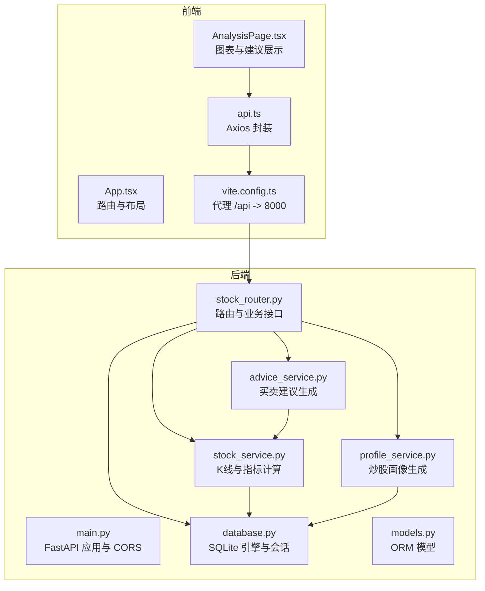
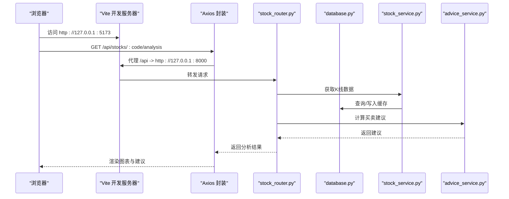
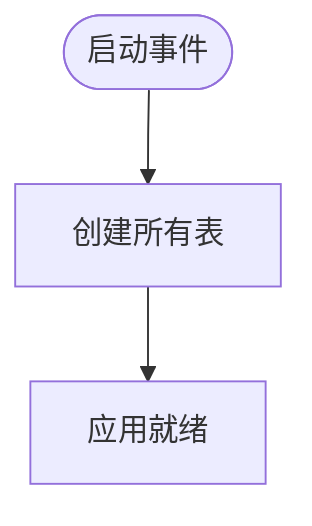
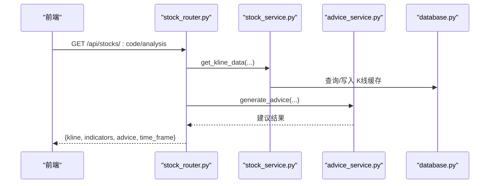
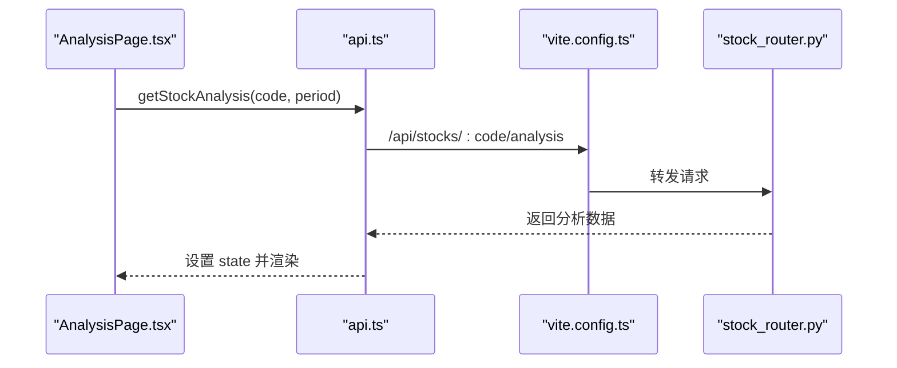
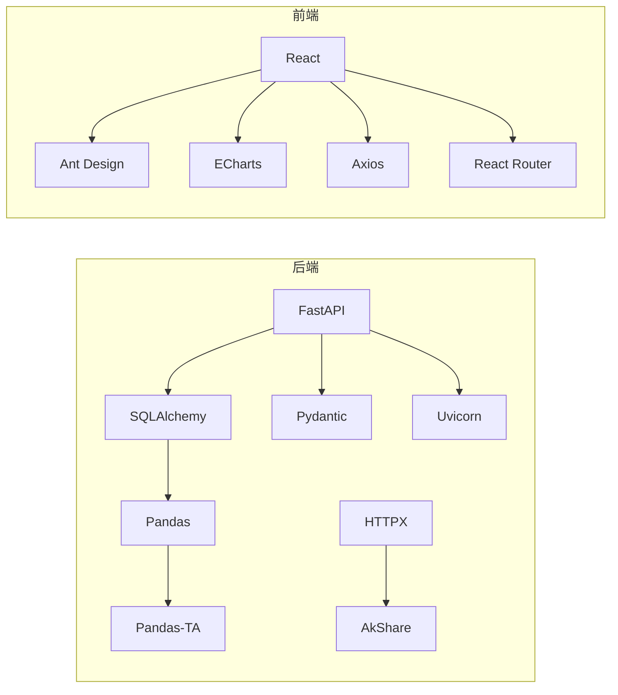

# 故障排除

<cite>
**本文引用的文件**

- [backend/app/main.py](file://backend/app/main.py)

- [backend/app/db/database.py](file://backend/app/db/database.py)

- [backend/app/routers/stock_router.py](file://backend/app/routers/stock_router.py)

- [backend/app/services/stock_service.py](file://backend/app/services/stock_service.py)

- [backend/app/services/advice_service.py](file://backend/app/services/advice_service.py)

- [backend/app/services/profile_service.py](file://backend/app/services/profile_service.py)

- [backend/app/models/models.py](file://backend/app/models/models.py)

- [frontend/src/services/api.ts](file://frontend/src/services/api.ts)

- [frontend/src/pages/AnalysisPage.tsx](file://frontend/src/pages/AnalysisPage.tsx)

- [frontend/src/App.tsx](file://frontend/src/App.tsx)

- [frontend/vite.config.ts](file://frontend/vite.config.ts)

- [backend/requirements.txt](file://backend/requirements.txt)

- [frontend/package.json](file://frontend/package.json)

- [start.sh](file://start.sh)

- [stop.sh](file://stop.sh)
</cite>

## 目录
1. [简介](#简介)

2. [项目结构](#项目结构)

3. [核心组件](#核心组件)

4. [架构总览](#架构总览)

5. [详细组件分析](#详细组件分析)

6. [依赖分析](#依赖分析)

7. [性能考虑](#性能考虑)

8. [故障排除指南](#故障排除指南)

9. [结论](#结论)

10. [附录](#附录)

## 简介
本指南面向 Stock Foker 应用的使用者与维护者，提供系统化的问题诊断与修复方法，覆盖启动失败、API 调用错误、数据加载异常、数据库连接问题、网络请求失败、前端组件渲染异常、性能瓶颈以及日志分析与错误定位策略，并给出问题反馈与升级流程建议。

## 项目结构
应用采用前后端分离架构：

- 后端使用 FastAPI 提供 REST 接口，SQLite 作为本地存储，SQLAlchemy ORM 映射模型。

- 前端使用 Vite + React + Ant Design，通过代理将 /api 请求转发至后端。

- 启停脚本负责虚拟环境、依赖安装、进程管理与健康检查。

**图示来源**

- [frontend/src/App.tsx:1-27](file://frontend/src/App.tsx#L1-L27)

- [frontend/src/services/api.ts:1-65](file://frontend/src/services/api.ts#L1-L65)

- [frontend/src/pages/AnalysisPage.tsx:1-213](file://frontend/src/pages/AnalysisPage.tsx#L1-L213)

- [frontend/vite.config.ts:1-16](file://frontend/vite.config.ts#L1-L16)

- [backend/app/main.py:1-28](file://backend/app/main.py#L1-L28)

- [backend/app/db/database.py:1-24](file://backend/app/db/database.py#L1-L24)

- [backend/app/routers/stock_router.py:1-197](file://backend/app/routers/stock_router.py#L1-L197)

- [backend/app/services/stock_service.py:1-327](file://backend/app/services/stock_service.py#L1-L327)

- [backend/app/services/advice_service.py:1-193](file://backend/app/services/advice_service.py#L1-L193)

- [backend/app/services/profile_service.py:1-114](file://backend/app/services/profile_service.py#L1-L114)

- [backend/app/models/models.py:1-75](file://backend/app/models/models.py#L1-L75)

**章节来源**

- [backend/app/main.py:1-28](file://backend/app/main.py#L1-L28)

- [frontend/vite.config.ts:1-16](file://frontend/vite.config.ts#L1-L16)

## 核心组件
- 后端应用与中间件：CORS 配置允许前端开发服务器访问；启动事件初始化数据库。

- 数据库层：SQLite 引擎、会话工厂、基础模型类与依赖注入。

- 路由层：统一前缀 /api，提供关注股票、搜索、K线与分析、交易记录、炒股画像等接口。

- 服务层：K线数据获取与缓存、技术指标计算、买卖建议生成、炒股画像统计。

- 前端：Axios 封装 /api 基地址；Vite 代理；页面组件负责渲染与错误提示。

**章节来源**

- [backend/app/main.py:1-28](file://backend/app/main.py#L1-L28)

- [backend/app/db/database.py:1-24](file://backend/app/db/database.py#L1-L24)

- [backend/app/routers/stock_router.py:1-197](file://backend/app/routers/stock_router.py#L1-L197)

- [backend/app/services/stock_service.py:1-327](file://backend/app/services/stock_service.py#L1-L327)

- [backend/app/services/advice_service.py:1-193](file://backend/app/services/advice_service.py#L1-L193)

- [backend/app/services/profile_service.py:1-114](file://backend/app/services/profile_service.py#L1-L114)

- [frontend/src/services/api.ts:1-65](file://frontend/src/services/api.ts#L1-L65)

- [frontend/vite.config.ts:1-16](file://frontend/vite.config.ts#L1-L16)

## 架构总览
后端通过 Uvicorn 在 127.0.0.1:8000 提供服务，前端 Vite 在 127.0.0.1:5173 提供开发服务，Vite 将 /api 前缀的请求代理到后端。前端通过 Axios 发起 /api 请求，后端路由处理请求并调用服务层与数据库层。

**图示来源**

- [frontend/vite.config.ts:1-16](file://frontend/vite.config.ts#L1-L16)

- [frontend/src/services/api.ts:1-65](file://frontend/src/services/api.ts#L1-L65)

- [backend/app/routers/stock_router.py:98-131](file://backend/app/routers/stock_router.py#L98-L131)

- [backend/app/services/stock_service.py:131-253](file://backend/app/services/stock_service.py#L131-L253)

- [backend/app/db/database.py:14-23](file://backend/app/db/database.py#L14-L23)

- [backend/app/services/advice_service.py:4-173](file://backend/app/services/advice_service.py#L4-L173)

## 详细组件分析

### 后端应用与数据库
- 应用初始化：注册 CORS、包含路由、启动事件创建表。

- 数据库：SQLite 文件路径固定，会话工厂按需创建，依赖注入 get_db。

- 错误处理：路由层对服务抛出的运行时错误转换为 HTTP 500。

**图示来源**

- [backend/app/main.py:20-27](file://backend/app/main.py#L20-L27)

- [backend/app/db/database.py:22-23](file://backend/app/db/database.py#L22-L23)

**章节来源**

- [backend/app/main.py:1-28](file://backend/app/main.py#L1-L28)

- [backend/app/db/database.py:1-24](file://backend/app/db/database.py#L1-L24)

### 股票分析接口链路
- 接口：GET /api/stocks/:stock_code/analysis

- 流程：获取 K 线 -> 计算指标 -> 读取关注时间框架 -> 生成建议 -> 返回组合结果

- 异常：服务层抛出运行时错误时，路由层捕获并返回 500

**图示来源**

- [backend/app/routers/stock_router.py:98-131](file://backend/app/routers/stock_router.py#L98-L131)

- [backend/app/services/stock_service.py:131-253](file://backend/app/services/stock_service.py#L131-L253)

- [backend/app/services/advice_service.py:4-173](file://backend/app/services/advice_service.py#L4-L173)

- [backend/app/db/database.py:14-23](file://backend/app/db/database.py#L14-L23)

**章节来源**

- [backend/app/routers/stock_router.py:98-131](file://backend/app/routers/stock_router.py#L98-L131)

- [backend/app/services/stock_service.py:131-253](file://backend/app/services/stock_service.py#L131-L253)

- [backend/app/services/advice_service.py:1-193](file://backend/app/services/advice_service.py#L1-L193)

### 前端请求与渲染
- Axios 基地址为 /api，Vite 代理到后端 8000 端口。

- AnalysisPage 在有关注股票时发起分析请求，错误时显示错误信息，加载时显示加载状态。

- 图表使用 ECharts 渲染 K 线与指标，建议卡片展示推理过程与置信度。

**图示来源**

- [frontend/src/pages/AnalysisPage.tsx:35-43](file://frontend/src/pages/AnalysisPage.tsx#L35-L43)

- [frontend/src/services/api.ts:31-41](file://frontend/src/services/api.ts#L31-L41)

- [frontend/vite.config.ts:8-13](file://frontend/vite.config.ts#L8-L13)

- [backend/app/routers/stock_router.py:98-131](file://backend/app/routers/stock_router.py#L98-L131)

**章节来源**

- [frontend/src/services/api.ts:1-65](file://frontend/src/services/api.ts#L1-L65)

- [frontend/vite.config.ts:1-16](file://frontend/vite.config.ts#L1-L16)

- [frontend/src/pages/AnalysisPage.tsx:1-213](file://frontend/src/pages/AnalysisPage.tsx#L1-L213)

## 依赖分析
- 后端依赖：FastAPI、Uvicorn、SQLAlchemy、AkShare、Pandas、PandasTA、Pydantic、HTTPX。

- 前端依赖：React、Ant Design、ECharts、Axios、React Router。

**图示来源**

- [backend/requirements.txt:1-10](file://backend/requirements.txt#L1-L10)

- [frontend/package.json:11-21](file://frontend/package.json#L11-L21)

**章节来源**

- [backend/requirements.txt:1-10](file://backend/requirements.txt#L1-L10)

- [frontend/package.json:1-30](file://frontend/package.json#L1-L30)

## 性能考虑
- K线缓存：优先读取本地缓存，仅增量拉取缺失日期，减少远程调用与计算开销。

- 指标计算：使用向量化库进行批量计算，避免逐条循环。

- 前端渲染：图表按需渲染，建议卡片分步展示，降低首屏压力。

- 网络重试：对远程接口进行有限次数重试，提升稳定性。

**章节来源**

- [backend/app/services/stock_service.py:153-237](file://backend/app/services/stock_service.py#L153-L237)

- [backend/app/services/stock_service.py:255-326](file://backend/app/services/stock_service.py#L255-L326)

## 故障排除指南

### 一、启动失败
- 症状：启动脚本执行后未看到服务就绪或端口占用。

- 诊断步骤：
  1) 检查后端虚拟环境与依赖是否安装成功，确认 requirements.txt 版本。
  2) 查看后端日志文件是否存在，确认 Uvicorn 是否正常启动。
  3) 使用 curl 检查后端根路径是否可达。
  4) 检查前端 node_modules 是否存在，Vite 是否监听 5173 端口。
  5) 如端口被占用，使用停止脚本清理残留进程或手动释放端口。

- 处理建议：

  - 重新执行启动脚本，确保依赖哈希未变更导致重复安装。

  - 若依赖安装缓慢，可参考启动脚本中的镜像源参数。

  - 停止脚本会尝试清理残留进程，必要时手动清理 lsof 占用。

**章节来源**

- [start.sh:1-113](file://start.sh#L1-L113)

- [stop.sh:1-56](file://stop.sh#L1-L56)

- [backend/requirements.txt:1-10](file://backend/requirements.txt#L1-L10)

- [frontend/package.json:1-30](file://frontend/package.json#L1-L30)

### 二、API 调用错误
- 症状：前端报错“加载失败”或后端返回 500。

- 诊断步骤：
  1) 打开浏览器开发者工具 Network 面板，确认 /api 请求是否被代理到 8000。
  2) 检查后端路由是否正确挂载，CORS 是否允许前端源。
  3) 在后端查看日志，定位异常堆栈；若服务层抛出运行时错误，路由层会返回 500。
  4) 对于分析接口，确认已设置关注股票且股票代码有效。

- 处理建议：

  - 确保前端 Axios baseURL 与后端路由一致。

  - 在 stock_router 中增加更详细的异常信息以便定位。

  - 对外部接口调用增加超时与重试策略。

**章节来源**

- [frontend/vite.config.ts:8-13](file://frontend/vite.config.ts#L8-L13)

- [frontend/src/services/api.ts](file://frontend/src/services/api.ts#L11)

- [backend/app/main.py:9-15](file://backend/app/main.py#L9-L15)

- [backend/app/routers/stock_router.py:70-78](file://backend/app/routers/stock_router.py#L70-L78)

- [backend/app/routers/stock_router.py:92-95](file://backend/app/routers/stock_router.py#L92-L95)

### 三、数据加载异常
- 症状：K线为空、指标缺失、建议为空。

- 诊断步骤：
  1) 检查 K线缓存表是否存在，查询条件是否正确。
  2) 确认远程数据源可用，新浪或 AKShare 是否返回有效数据。
  3) 若远程失败但有缓存，系统会回退使用缓存；若无缓存则抛出错误。
  4) 检查前端传参 period、start_date、end_date 是否合理。

- 处理建议：

  - 增加缓存命中率统计与告警。

  - 对指标计算增加边界检查，避免数据不足时报错。

  - 前端在数据不足时提示用户或默认展示占位内容。

**章节来源**

- [backend/app/services/stock_service.py:153-237](file://backend/app/services/stock_service.py#L153-L237)

- [backend/app/services/stock_service.py:240-252](file://backend/app/services/stock_service.py#L240-L252)

- [backend/app/services/advice_service.py:9-15](file://backend/app/services/advice_service.py#L9-L15)

### 四、数据库连接问题
- 症状：应用启动即报数据库相关错误。

- 诊断步骤：
  1) 确认 SQLite 文件路径存在且可写。
  2) 检查会话工厂是否正确绑定引擎。
  3) 查看依赖注入 get_db 是否在请求生命周期内正确关闭连接。

- 处理建议：

  - 在启动事件中显式创建表，确保表结构与模型一致。

  - 对并发访问场景评估 SQLite 的适用性，必要时迁移至更健壮的数据库。

**章节来源**

- [backend/app/db/database.py:4-19](file://backend/app/db/database.py#L4-L19)

- [backend/app/db/database.py:22-23](file://backend/app/db/database.py#L22-L23)

- [backend/app/main.py:20-22](file://backend/app/main.py#L20-L22)

### 五、网络请求失败
- 症状：搜索、K线获取、建议生成超时或失败。

- 诊断步骤：
  1) 检查外网连通性与 DNS 解析。
  2) 确认请求头与超时设置是否合理。
  3) 查看重试逻辑是否生效，必要时调整重试次数与延迟。

- 处理建议：

  - 对外部接口增加熔断与降级策略。

  - 前端对网络错误进行友好提示与重试引导。

**章节来源**

- [backend/app/services/stock_service.py:22-32](file://backend/app/services/stock_service.py#L22-L32)

- [backend/app/services/stock_service.py:74-103](file://backend/app/services/stock_service.py#L74-L103)

- [backend/app/services/stock_service.py:106-128](file://backend/app/services/stock_service.py#L106-L128)

### 六、前端组件渲染异常
- 症状：图表不显示、建议卡片空白、路由跳转异常。

- 诊断步骤：
  1) 检查路由配置与页面组件是否正确导入。
  2) 确认 Axios 返回的数据结构与类型定义一致。
  3) 检查图表库初始化参数与数据格式。

- 处理建议：

  - 在页面组件中增加空数据与错误状态的可视化提示。

  - 对图表渲染增加兜底逻辑，避免 NaN 导致渲染崩溃。

**章节来源**

- [frontend/src/App.tsx:1-27](file://frontend/src/App.tsx#L1-L27)

- [frontend/src/pages/AnalysisPage.tsx:35-48](file://frontend/src/pages/AnalysisPage.tsx#L35-L48)

- [frontend/src/pages/AnalysisPage.tsx:54-157](file://frontend/src/pages/AnalysisPage.tsx#L54-L157)

### 七、日志分析与错误定位
- 后端日志：启动脚本将 Uvicorn 输出重定向到日志文件，便于定位启动与运行期错误。

- 前端日志：浏览器控制台 Network 与 Console 可快速定位请求与渲染问题。

- 建议：

  - 在关键路径增加结构化日志，包含请求 ID、参数与耗时。

  - 对外部调用增加超时与重试日志，便于追踪失败原因。

**章节来源**

- [start.sh:48-50](file://start.sh#L48-L50)

- [start.sh:85-87](file://start.sh#L85-L87)

### 八、性能问题识别与优化
- 识别：

  - K线请求响应慢：检查缓存命中率与远程调用耗时。

  - 图表渲染卡顿：检查数据量与渲染复杂度。

  - 建议生成耗时：评估指标计算与建议算法复杂度。

- 优化：

  - 增加缓存预热与失效策略。

  - 对大数据集进行分页或采样。

  - 将计算密集型任务异步化或拆分。

**章节来源**

- [backend/app/services/stock_service.py:153-237](file://backend/app/services/stock_service.py#L153-L237)

- [frontend/src/pages/AnalysisPage.tsx:54-157](file://frontend/src/pages/AnalysisPage.tsx#L54-L157)

### 九、问题反馈与升级流程
- 收集信息：

  - 系统版本、依赖版本、操作系统与浏览器版本。

  - 复现步骤、期望结果与实际结果。

  - 日志片段与截图。

- 提交流程：

  - 通过仓库 Issue 或内部工单提交，附带上述信息。

  - 维护者验证后分配优先级并制定修复计划。

  - 修复完成后发布新版本并通知用户回归测试。

[本节为通用流程说明，无需特定文件引用]

## 结论
通过系统化的启动检查、API 调用验证、数据加载与缓存策略、数据库与网络问题排查、前端渲染与性能优化，以及完善的日志与反馈机制，可以高效定位并解决 Stock Foker 应用中的各类问题。建议在生产环境中进一步增强监控、日志与告警能力，以提升稳定性与可观测性。

## 附录

### A. 关键文件与职责速览
- 后端入口与中间件：[backend/app/main.py:1-28](file://backend/app/main.py#L1-L28)

- 数据库与会话：[backend/app/db/database.py:1-24](file://backend/app/db/database.py#L1-L24)

- 路由与接口：[backend/app/routers/stock_router.py:1-197](file://backend/app/routers/stock_router.py#L1-L197)

- 服务层（K线/指标/建议）：[backend/app/services/stock_service.py:1-327](file://backend/app/services/stock_service.py#L1-L327)、[backend/app/services/advice_service.py:1-193](file://backend/app/services/advice_service.py#L1-L193)

- 画像统计：[backend/app/services/profile_service.py:1-114](file://backend/app/services/profile_service.py#L1-L114)

- 前端 API 封装与代理：[frontend/src/services/api.ts:1-65](file://frontend/src/services/api.ts#L1-L65)、[frontend/vite.config.ts:1-16](file://frontend/vite.config.ts#L1-L16)

- 启停脚本：[start.sh:1-113](file://start.sh#L1-L113)、[stop.sh:1-56](file://stop.sh#L1-L56)
