# 数据加载异常

> ## 本文引用的文件
>
> - [backend/app/main.py](file://backend/app/main.py)
>
> - [backend/app/db/database.py](file://backend/app/db/database.py)
>
> - [backend/app/models/models.py](file://backend/app/models/models.py)
>
> - [backend/app/routers/stock_router.py](file://backend/app/routers/stock_router.py)
>
> - [backend/app/services/stock_service.py](file://backend/app/services/stock_service.py)
>
> - [backend/app/services/advice_service.py](file://backend/app/services/advice_service.py)
>
> - [backend/app/services/profile_service.py](file://backend/app/services/profile_service.py)
>
> - [backend/app/models/schemas.py](file://backend/app/models/schemas.py)
>
> - [doc/技术架构文档.md](file://doc/技术架构文档.md)
>
> - [doc/产品设计文档.md](file://doc/产品设计文档.md)
>
> - [backend/requirements.txt](file://backend/requirements.txt)

## 目录

1. [简介](#简介)

2. [项目结构](#项目结构)

3. [核心组件](#核心组件)

4. [架构概览](#架构概览)

5. [详细组件分析](#详细组件分析)

6. [依赖关系分析](#依赖关系分析)

7. [性能考量](#性能考量)

8. [故障排除指南](#故障排除指南)

9. [结论](#结论)

## 简介

Stock Foker 是一款面向个人投资者的股票分析应用，采用数据驱动的方式提供技术面分析、买卖建议和交易画像生成功能。该应用的核心挑战在于确保数据加载的稳定性和可靠性，特别是在K线数据获取、技术指标计算和缓存一致性方面。

本文档专注于数据加载异常的专业故障排除，涵盖K线数据获取失败、技术指标计算异常、缓存数据不一致等问题的诊断和修复方法。我们将深入分析系统的数据流架构，提供针对各种异常场景的解决方案，并建立数据质量监控和异常处理机制。

## 项目结构

Stock Foker 采用前后端分离的架构设计，后端基于FastAPI框架，使用SQLAlchemy进行数据库操作，pandas和pandas-ta进行数据处理和技术指标计算。

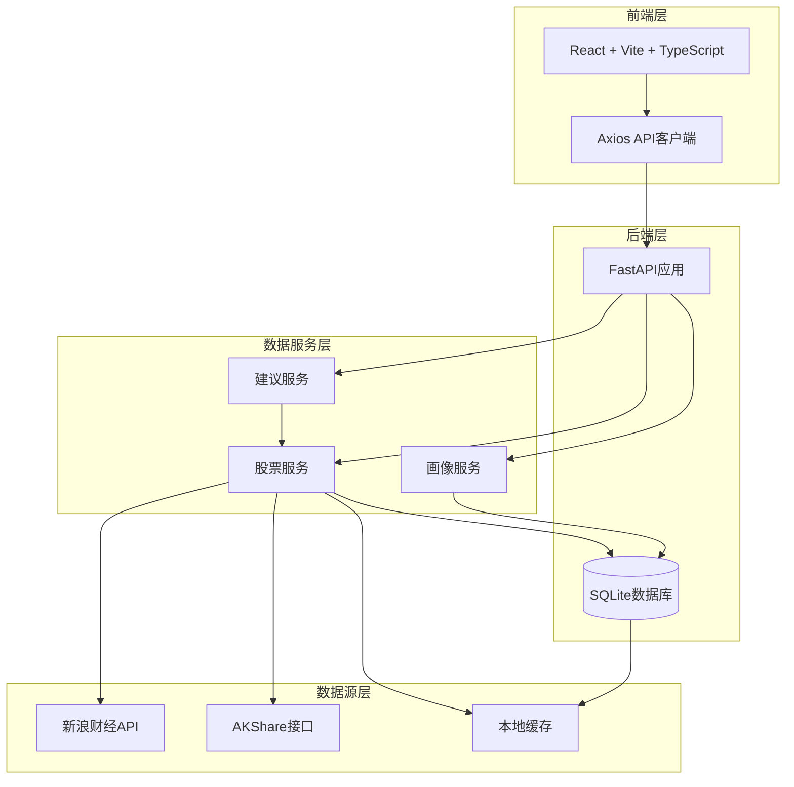

### 项目结构-图表来源

- [backend/app/main.py:1-28](file://backend/app/main.py#L1-L28)

- [backend/app/routers/stock_router.py:1-197](file://backend/app/routers/stock_router.py#L1-L197)

- [doc/技术架构文档.md:153-178](file://doc/技术架构文档.md#L153-L178)

### 项目结构-章节来源

- [backend/app/main.py:1-28](file://backend/app/main.py#L1-L28)

- [doc/技术架构文档.md:19-67](file://doc/技术架构文档.md#L19-L67)

## 核心组件

### 数据模型架构

系统采用SQLAlchemy ORM设计，包含三个核心数据模型：关注股票、交易记录和K线缓存。

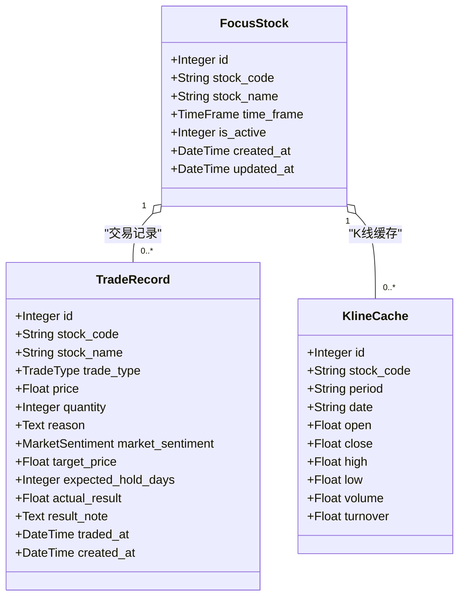

### 数据模型架构 - 图表来源

- [backend/app/models/models.py:25-75](file://backend/app/models/models.py#L25-L75)

### API路由架构

后端提供RESTful API接口,涵盖股票关注、数据查询、交易管理和画像生成等功能。

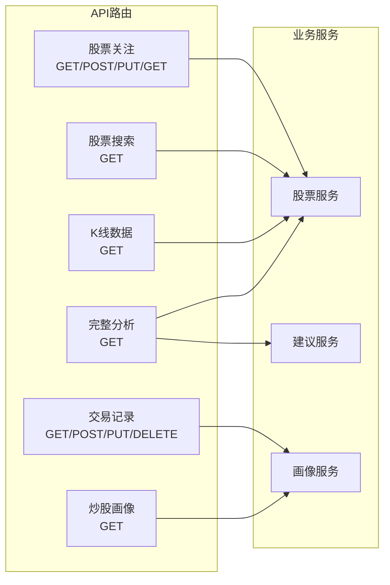

### API路由架构 - 图表来源

- [backend/app/routers/stock_router.py:15-197](file://backend/app/routers/stock_router.py#L15-L197)

### 核心组件 - 章节来源

- [backend/app/models/models.py:1-75](file://backend/app/models/models.py#L1-L75)
- [backend/app/routers/stock_router.py:1-197](file://backend/app/routers/stock_router.py#L1-L197)

## 架构概览

Stock Foker 的数据流架构采用"本地缓存优先，远程数据降级"的设计原则，确保在各种网络条件下都能提供稳定的服务。

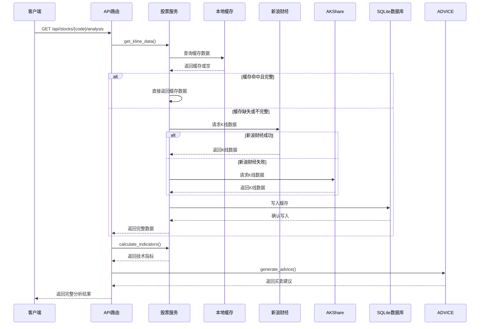

### 架构概览 - 图表来源

- [doc/技术架构文档.md:153-178](file://doc/技术架构文档.md#L153-L178)
- [backend/app/services/stock_service.py:131-237](file://backend/app/services/stock_service.py#L131-L237)

## 详细组件分析

### 股票服务组件

股票服务是数据加载的核心组件，负责K线数据获取、缓存管理和技术指标计算。

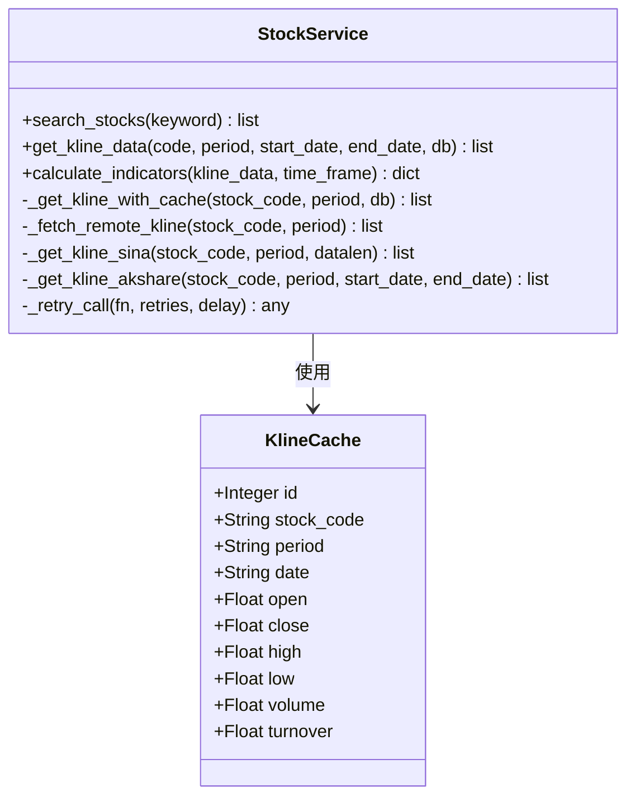

### 股票服务组件 - 图表来源

- [backend/app/services/stock_service.py:131-327](file://backend/app/services/stock_service.py#L131-L327)
- [backend/app/models/models.py:58-75](file://backend/app/models/models.py#L58-L75)

### 数据获取策略

股票服务采用"缓存优先"的策略,通过以下步骤确保数据的完整性和时效性:

1. **缓存查询**:首先查询本地SQLite缓存
2. **完整性检查**:验证缓存数据是否覆盖到最近交易日
3. **增量更新**:仅拉取缺失的数据并写入缓存
4. **数据合并**:返回完整的数据集

### 股票服务组件 - 章节来源

- [backend/app/services/stock_service.py:131-237](file://backend/app/services/stock_service.py#L131-L237)

### 技术指标计算组件

技术指标计算组件基于pandas-ta库，提供多种技术分析指标的计算能力。

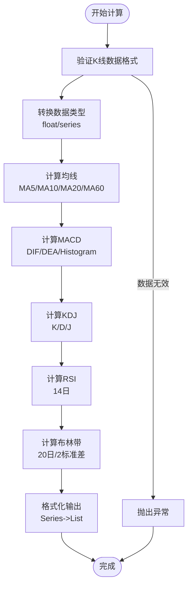

### 技术指标计算组件 - 图表来源

- [backend/app/services/stock_service.py:255-319](file://backend/app/services/stock_service.py#L255-L319)

### 技术指标计算组件 - 章节来源

- [backend/app/services/stock_service.py:255-327](file://backend/app/services/stock_service.py#L255-L327)

### 建议生成组件

建议生成组件基于多指标综合分析，提供可解释的买卖建议。

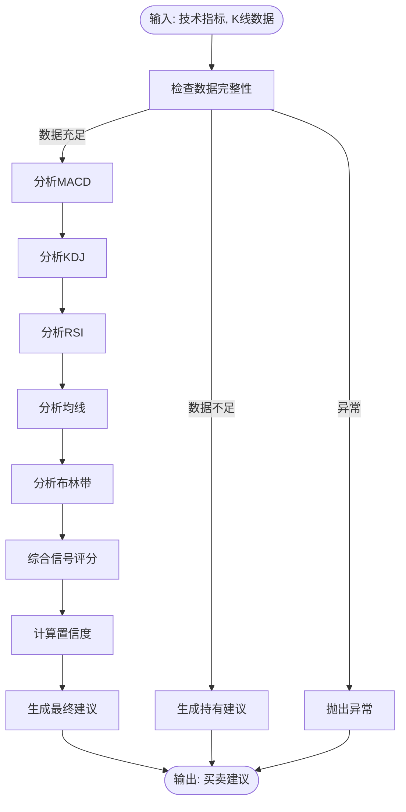

### 建议生成组件 - 图表来源

- [backend/app/services/advice_service.py:4-173](file://backend/app/services/advice_service.py#L4-L173)

### 建议生成组件 - 章节来源

- [backend/app/services/advice_service.py:1-193](file://backend/app/services/advice_service.py#L1-L193)

## 依赖关系分析

系统的技术栈和依赖关系如下所示：

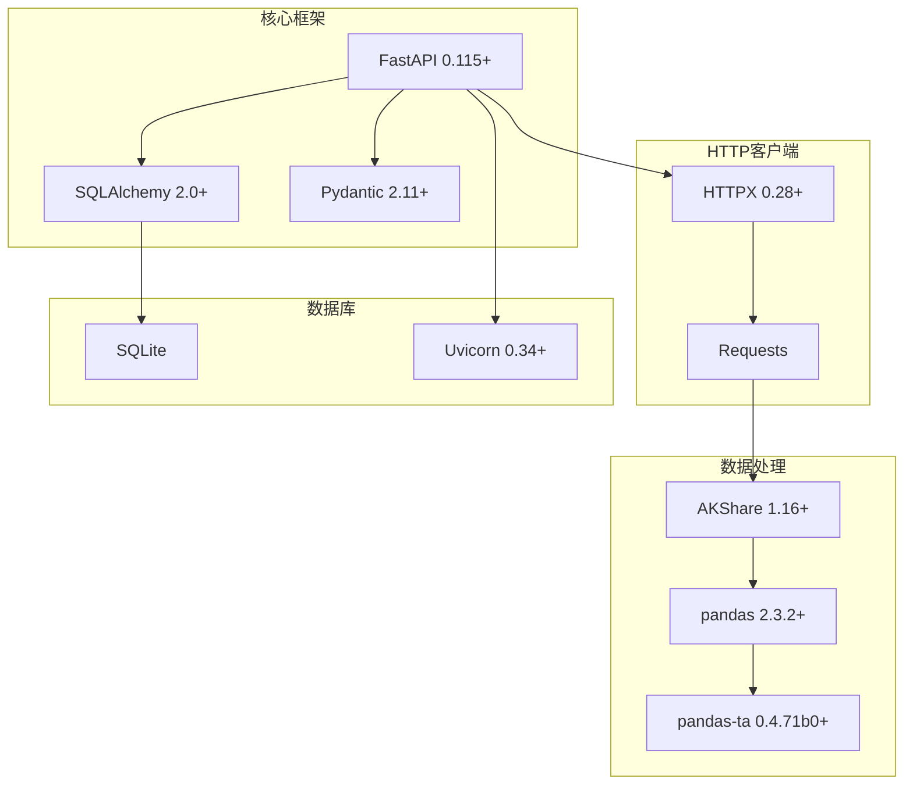

### 依赖关系分析 - 图表来源

- [backend/requirements.txt:1-10](file://backend/requirements.txt#L1-L10)

### 依赖关系分析 - 章节来源

- [backend/requirements.txt:1-10](file://backend/requirements.txt#L1-L10)

## 性能考量

### 缓存策略优化

系统采用多层次的缓存策略来优化性能：

1. **内存缓存**：股票列表的内存缓存，避免重复查询

2. **数据库缓存**：K线数据的本地SQLite缓存

3. **增量更新**：仅拉取缺失的历史数据

4. **盘中更新**：实时更新当天的最新数据

### 数据类型转换优化

技术指标计算中的数据类型转换采用批量处理方式，避免逐元素转换的性能开销。

### 性能考量 - 章节来源

- [backend/app/services/stock_service.py:35-52](file://backend/app/services/stock_service.py#L35-L52)
- [backend/app/services/stock_service.py:255-327](file://backend/app/services/stock_service.py#L255-L327)

## 故障排除指南

### K线数据获取失败

#### K线数据获取失败-问题症状

- API返回500错误

- 前端显示"数据加载失败"

- 控制台出现网络连接异常

#### K线数据获取失败-诊断步骤

1. **检查网络连接**

   ```mermaid
   flowchart TD
   Start([开始诊断]) --> CheckNetwork["检查网络连接"]
   CheckNetwork --> TestSina["测试新浪财经API"]
   TestSina --> TestAkshare["测试AKShare接口"]
   TestAkshare --> CheckTimeout["检查超时设置"]
   CheckTimeout --> CheckRateLimit["检查限流限制"]
   CheckRateLimit --> End([诊断完成])
   ```

2. **验证数据源可用性**

   - 检查新浪财经API是否正常响应
   - 验证AKShare接口的可用性
   - 确认IP地址未被封禁

3. **检查缓存状态**

   - 验证SQLite数据库连接
   - 检查KlineCache表结构
   - 确认缓存数据完整性

##### 方法一：重试机制

```python
def _retry_call(fn, retries=3, delay=2.0):
    """带重试的函数调用"""
    last_err = None
    for i in range(retries):
        try:
            return fn()
        except Exception as e:
            last_err = e
            if i < retries - 1:
                time.sleep(delay * (i + 1))
    raise last_err
```

##### 方法二：降级策略

```python
def _fetch_remote_kline(stock_code, period):
    """从远程获取K线数据，新浪优先，AKShare降级"""
    try:
        return _retry_call(lambda: _get_kline_sina(stock_code, period))
    except Exception:
        pass

    start_date = (datetime.now() - timedelta(days=365)).strftime("%Y%m%d")
    end_date = datetime.now().strftime("%Y%m%d")
    try:
        return _get_kline_akshare(stock_code, period, start_date, end_date)
    except Exception as e:
        raise RuntimeError(f"获取K线数据失败: {e}")
```

##### 方法三：缓存回退

```python
try:
    remote_data = _fetch_remote_kline(stock_code, period)
except Exception:
    # 远程失败但有缓存，用缓存
    if cached_data:
        return cached_data
    raise
```

#### K线数据获取失败-章节来源

- [backend/app/services/stock_service.py:22-33](file://backend/app/services/stock_service.py#L22-L33)
- [backend/app/services/stock_service.py:240-253](file://backend/app/services/stock_service.py#L240-L253)

### 技术指标计算异常

#### 技术指标计算异常-问题症状

- 技术指标返回空值或异常值
- 前端图表显示异常
- 计算过程中抛出异常

#### 技术指标计算异常-诊断步骤

1. **验证数据格式**

   - 检查K线数据的完整性
   - 验证数据类型转换
   - 确认数据范围合理性

2. **检查pandas-ta安装**

   ```bash
   pip install pandas-ta==0.4.71b0
   ```

3. **验证数据预处理**

   ```python
   def calculate_indicators(
       kline_data: list[dict],
       time_frame: str = "short"
   ) -> dict:
       df = pd.DataFrame(kline_data)
       df["close"] = df["close"].astype(float)
       df["high"] = df["high"].astype(float)
       df["low"] = df["low"].astype(float)
       df["volume"] = df["volume"].astype(float)
   ```

##### 方法一：数据验证

```python
def calculate_indicators(
    kline_data: list[dict],
    time_frame: str = "short"
) -> dict:
    if not kline_data:
        return {}

    # 验证数据完整性
    required_fields = [
        "date", "open", "close", "high", "low", "volume"
    ]
    for item in kline_data:
        for field in required_fields:
            if field not in item:
                raise ValueError(f"缺少必需字段: {field}")

    # 数据类型转换
    df = pd.DataFrame(kline_data)
    numeric_columns = ["close", "high", "low", "volume"]
    for col in numeric_columns:
        df[col] = pd.to_numeric(df[col], errors='coerce')

    # 处理NaN值
    df = df.dropna()
    if len(df) < 20:
        raise ValueError("数据量不足，至少需要20个数据点")
```

##### 方法二：异常处理

```python
def _series_to_list(s: Optional[pd.Series]) -> list:
    """将 pandas Series 转为 list，NaN 转 None"""
    if s is None:
        return []
    return [
        None if pd.isna(v) else round(float(v), 4)
        for v in s
    ]
```

#### 技术指标计算异常-章节来源

- [backend/app/services/stock_service.py:255-327](file://backend/app/services/stock_service.py#L255-L327)

### 缓存数据不一致

#### 缓存数据不一致-问题症状

- 同一股票在不同时间查询显示不同的数据
- 盘中数据更新延迟
- 缓存数据过期但未刷新

#### 缓存数据不一致-诊断步骤

1. **检查缓存更新策略**

   ```python
   def _get_kline_with_cache(
       stock_code: str, period: str, db
   ) -> list[dict]:
       # 1. 读取本地缓存
       cached_rows = db.query(KlineCache).filter(
           KlineCache.stock_code == stock_code,
           KlineCache.period == period
       ).order_by(KlineCache.date.asc()).all()

       # 2. 判断是否需要增量更新
       last_cached_date = cached_rows[-1].date if cached_rows else None
       today = datetime.now().strftime("%Y-%m-%d")

       need_fetch = True
       if last_cached_date:
           # 如果最后缓存日期是今天或者昨天
           # (非交易日也算)，不需要更新
           days_gap = (
               datetime.now() - datetime.strptime(
                   last_cached_date, "%Y-%m-%d"
               )
           ).days
           if days_gap <= 1:
               need_fetch = False
   ```

2. **验证唯一约束**

   - 检查`(stock_code, period, date)`唯一约束
   - 确认日期格式一致性
   - 验证数据去重逻辑

##### 方法一：强制刷新缓存

```python
def force_refresh_cache(
    stock_code: str, period: str, db
):
    """强制刷新缓存数据"""
    # 清除过期数据
    cutoff_date = (
        datetime.now() - timedelta(days=365)
    ).strftime("%Y-%m-%d")
    db.query(KlineCache).filter(
        KlineCache.stock_code == stock_code,
        KlineCache.period == period,
        KlineCache.date < cutoff_date
    ).delete(synchronize_session=False)

    # 重新获取完整数据
    db.commit()
    return get_kline_data(stock_code, period, db=db)
```

##### 方法二：缓存一致性检查

```python
def check_cache_consistency(
    stock_code: str, period: str, db
):
    """检查缓存一致性"""
    cached_rows = db.query(KlineCache).filter(
        KlineCache.stock_code == stock_code,
        KlineCache.period == period
    ).order_by(KlineCache.date.asc()).all()

    if len(cached_rows) < 2:
        return True

    # 检查日期连续性
    dates = [row.date for row in cached_rows]
    expected_dates = pd.date_range(
        start=dates[0], end=dates[-1], freq='D'
    ).strftime('%Y-%m-%d')

    return set(dates) >= set(expected_dates)
```

#### 缓存数据不一致-章节来源

- [backend/app/services/stock_service.py:153-237](file://backend/app/services/stock_service.py#L153-L237)
- [backend/app/models/models.py:61-63](file://backend/app/models/models.py#L61-L63)

### 外部数据源连接问题

#### 外部数据源连接问题-问题症状

- 远程API请求超时
- HTTP状态码异常
- 数据格式解析失败

#### 外部数据源连接问题-诊断步骤

1. **检查API端点**

   - 验证新浪财经API端点
   - 确认AKShare接口参数
   - 检查请求头设置

2. **网络连通性测试**

   ```python
   import requests

   def test_api_connection(url, headers, timeout=15):
       try:
           response = requests.get(
               url, headers=headers, timeout=timeout
           )
           return response.status_code == 200
       except Exception as e:
           return False
   ```

3. **IP限制检查**

   - 确认IP未被封禁
   - 检查请求频率限制
   - 验证User-Agent设置

##### 方法一：请求头优化

```python
_SINA_HEADERS = {
    "User-Agent": (
        "Mozilla/5.0 (Macintosh; Intel Mac OS X 10_15_7) "
        "AppleWebKit/537.36"
    ),
    "Referer": "https://finance.sina.com.cn",
    "Accept": (
        "text/html,application/xhtml+xml,"
        "application/xml;q=0.9,*/*;q=0.8"
    ),
    "Accept-Language": (
        "zh-CN,zh;q=0.8,en-US;q=0.5,en;q=0.3"
    ),
    "Accept-Encoding": "gzip, deflate",
    "Connection": "keep-alive",
}
```

##### 方法二：超时和重试配置

```python
def _get_kline_sina(
    stock_code: str, period: str, datalen: int = 300
) -> list[dict]:
    url = (
        "https://quotes.sina.cn/cn/api/"
        "jsonp_v2.php/var%20_data=/"
        "CN_MarketDataService.getKLineData"
    )
    params = {
        "symbol": _sina_symbol(stock_code),
        "scale": _PERIOD_SCALE.get(period, 240),
        "ma": "no",
        "datalen": datalen
    }

    resp = _requests.get(
        url, headers=_SINA_HEADERS,
        params=params, timeout=15
    )
    resp.raise_for_status()
```

#### 外部数据源连接问题-章节来源

- [backend/app/services/stock_service.py:13-16](file://backend/app/services/stock_service.py#L13-L16)
- [backend/app/services/stock_service.py:74-103](file://backend/app/services/stock_service.py#L74-L103)

### 数据格式转换错误

#### 数据格式转换错误-问题症状

- 数值转换异常
- NaN值处理不当
- 数据类型不匹配

#### 数据格式转换错误-诊断步骤

1. **检查数据类型**

   - 验证浮点数转换
   - 检查字符串格式
   - 确认日期格式

2. **NaN值检测**

   ```python
   def validate_kline_data(data):
       for item in data:
           for key, value in item.items():
               if pd.isna(value):
                   print(f"发现NaN值: {key} in {item}")
   ```

##### 方法一：健壮的数据转换

```python
def robust_float_conversion(value, default=0.0):
    """健壮的浮点数转换"""
    if pd.isna(value) or value is None:
        return default
    try:
        return float(value)
    except (ValueError, TypeError):
        return default

def robust_date_conversion(
    date_string, default="1900-01-01"
):
    """健壮的日期转换"""
    if not date_string or pd.isna(date_string):
        return default
    try:
        return pd.to_datetime(
            date_string
        ).strftime("%Y-%m-%d")
    except (ValueError, TypeError):
        return default
```

##### 方法二：数据验证装饰器

```python
def validate_kline_format(func):
    """K线数据格式验证装饰器"""
    def wrapper(*args, **kwargs):
        result = func(*args, **kwargs)

        if not isinstance(result, list):
            raise TypeError("K线数据必须是列表格式")

        required_fields = [
            "date", "open", "close",
            "high", "low", "volume"
        ]
        for i, item in enumerate(result):
            if not isinstance(item, dict):
                raise TypeError(
                    f"第{i}个元素必须是字典格式"
                )

            for field in required_fields:
                if field not in item:
                    raise KeyError(
                        f"缺少必需字段: {field}"
                    )

                if field in [
                    "open", "close", "high",
                    "low", "volume"
                ]:
                    try:
                        float(item[field])
                    except (ValueError, TypeError):
                        raise ValueError(
                            f"字段{field}必须是数值类型"
                        )

        return result
    return wrapper
```

#### 数据格式转换错误-章节来源

- [backend/app/services/stock_service.py:92-103](file://backend/app/services/stock_service.py#L92-L103)
- [backend/app/services/stock_service.py:322-327](file://backend/app/services/stock_service.py#L322-L327)

### 数据库查询异常

#### 数据库查询异常-问题症状

- 数据库连接失败
- 查询超时
- 事务异常

#### 数据库查询异常-诊断步骤

1. **检查数据库连接**

   - 验证SQLite文件权限
   - 检查数据库文件完整性
   - 确认连接池配置

2. **查询性能分析**

   ```python
   def analyze_query_performance(query):
       import time
       start_time = time.time()
       result = query.all()
       end_time = time.time()
       print(f"查询耗时: {end_time - start_time:.2f}秒")
       return result
   ```

##### 方法一：连接管理

```python
def get_db():
    """获取数据库连接"""
    db = SessionLocal()
    try:
        yield db
    except Exception as e:
        db.rollback()
        raise e
    finally:
        db.close()

def init_db():
    """初始化数据库"""
    try:
        Base.metadata.create_all(bind=engine)
        print("数据库初始化成功")
    except Exception as e:
        print(f"数据库初始化失败: {e}")
        raise
```

##### 方法二：查询优化

```python
def get_kline_with_optimization(
    stock_code: str, period: str, db
):
    """优化的K线查询"""
    query = db.query(KlineCache).filter(
        KlineCache.stock_code == stock_code,
        KlineCache.period == period
    ).options(
        # 预加载相关数据
    ).order_by(KlineCache.date.asc())

    return query.all()
```

#### 数据库查询异常-章节来源

- [backend/app/db/database.py:14-23](file://backend/app/db/database.py#L14-L23)
- [backend/app/db/database.py:22-24](file://backend/app/db/database.py#L22-L24)

### 数据完整性检查和修复策略

#### 数据完整性检查-详细说明

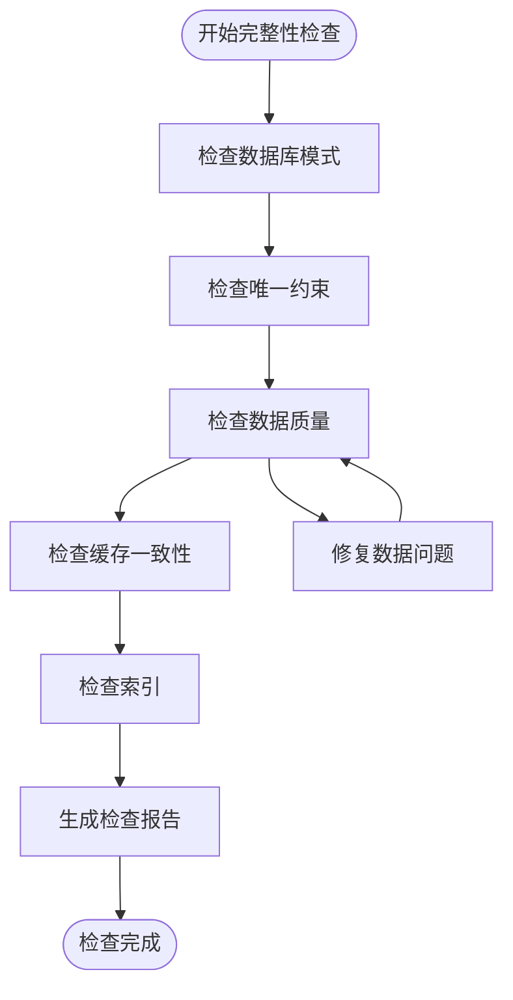

#### 修复策略-详细说明

##### 策略一：数据修复脚本

```python
def repair_kline_data(db):
    """修复K线数据问题"""

    # 1. 修复重复数据
    duplicates = db.query(KlineCache).group_by(
        KlineCache.stock_code,
        KlineCache.period,
        KlineCache.date
    ).having(func.count(KlineCache.id) > 1).all()

    for dup in duplicates:
        # 删除重复项，保留最新的
        db.query(KlineCache).filter(
            KlineCache.stock_code == dup.stock_code,
            KlineCache.period == dup.period,
            KlineCache.date == dup.date
        ).order_by(
            KlineCache.updated_at.desc()
        ).offset(1).delete(
            synchronize_session=False
        )

    db.commit()

    # 2. 修复缺失数据
    missing_dates = detect_missing_dates(db)
    for stock_code, period, date_range in missing_dates:
        fix_missing_dates(
            db, stock_code, period, date_range
        )

    db.commit()
```

##### 策略二：数据验证规则

```python
def validate_kline_record(record):
    """验证K线记录完整性"""
    errors = []

    # 检查必需字段
    required_fields = [
        "stock_code", "period", "date",
        "open", "close", "high", "low", "volume"
    ]
    for field in required_fields:
        if getattr(record, field) is None:
            errors.append(f"缺少字段: {field}")

    # 检查数值范围
    if record.open <= 0:
        errors.append("开盘价必须大于0")
    if record.close <= 0:
        errors.append("收盘价必须大于0")
    if record.high <= 0:
        errors.append("最高价必须大于0")
    if record.low <= 0:
        errors.append("最低价必须大于0")
    if record.volume < 0:
        errors.append("成交量不能为负数")

    # 检查价格逻辑
    if record.high < record.low:
        errors.append("最高价不能小于最低价")
    if record.high < record.open or record.high < record.close:
        errors.append("最高价必须大于等于开盘价和收盘价")
    if record.low > record.open or record.low > record.close:
        errors.append("最低价必须小于等于开盘价和收盘价")

    return errors
```

##### 数据完整性检查 - 章节来源

- [backend/app/models/models.py:58-75](file://backend/app/models/models.py#L58-L75)
- [backend/app/services/stock_service.py:200-237](file://backend/app/services/stock_service.py#L200-L237)

### 缓存失效处理、增量更新失败和数据同步问题

#### 缓存失效处理-详细说明

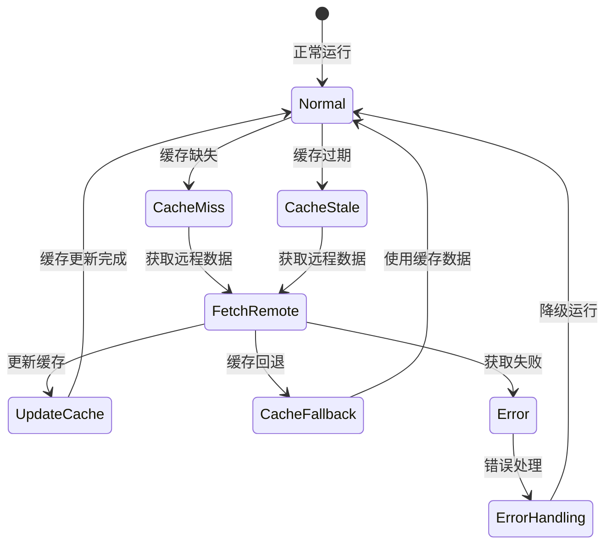

#### 增量更新失败处理

##### 方法一：增量更新策略

```python
def incremental_update_kline(
    stock_code: str, period: str, db
):
    """增量更新K线数据"""
    try:
        # 获取最后一条缓存记录
        last_cached = db.query(KlineCache).filter(
            KlineCache.stock_code == stock_code,
            KlineCache.period == period
        ).order_by(KlineCache.date.desc()).first()

        if not last_cached:
            return False

        # 计算需要获取的日期范围
        last_date = datetime.strptime(last_cached.date, "%Y-%m-%d")
        today = datetime.now()

        if (today - last_date).days <= 1:
            return True  # 已是最新的

        # 获取增量数据
        start_date = (
            last_date + timedelta(days=1)
        ).strftime("%Y%m%d")
        end_date = today.strftime("%Y%m%d")

        remote_data = _get_kline_akshare(
            stock_code, period, start_date, end_date
        )

        # 写入新数据
        new_rows = []
        for item in remote_data:
            if item["date"] not in cached_dates:
                new_rows.append(KlineCache(**item))

        if new_rows:
            db.add_all(new_rows)
            db.commit()

        return True

    except Exception as e:
        print(f"增量更新失败: {e}")
        return False
```

#### 数据同步问题解决

##### 方法二：数据同步监控

```python
def monitor_data_sync():
    """监控数据同步状态"""
    sync_status = {
        "last_sync_time": None,
        "sync_errors": [],
        "data_quality": {
            "missing_dates": 0,
            "duplicate_records": 0,
            "invalid_values": 0
        }
    }

    return sync_status

def sync_kline_data(
    stock_code: str, period: str, db
):
    """同步K线数据"""
    try:
        # 获取远程数据
        remote_data = _fetch_remote_kline(
            stock_code, period
        )

        # 获取本地缓存
        local_data = db.query(KlineCache).filter(
            KlineCache.stock_code == stock_code,
            KlineCache.period == period
        ).all()

        # 比较差异
        remote_dates = {
            item["date"] for item in remote_data
        }
        local_dates = {
            item.date for item in local_data
        }

        missing_dates = remote_dates - local_dates
        extra_dates = local_dates - remote_dates

        # 处理缺失数据
        if missing_dates:
            # 重新获取缺失数据
            pass

        # 处理多余数据
        if extra_dates:
            # 清理多余数据
            pass

        return True

    except Exception as e:
        log_error(f"数据同步失败: {e}")
        return False
```

##### 缓存失效处理 - 章节来源

- [backend/app/services/stock_service.py:178-237](file://backend/app/services/stock_service.py#L178-L237)

### 数据质量监控和异常数据处理机制

#### 数据质量监控

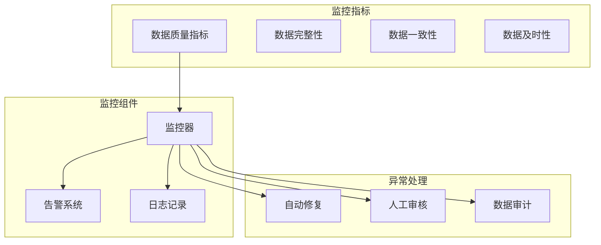

#### 异常数据处理机制

##### 方法一：异常检测

```python
def detect_anomalies(data):
    """检测异常数据"""
    anomalies = []

    # 检测价格异常
    prices = [item["close"] for item in data]
    mean_price = np.mean(prices)
    std_price = np.std(prices)

    for i, item in enumerate(data):
        z_score = abs(
            item["close"] - mean_price
        ) / std_price
        if z_score > 3:  # 3σ规则
            anomalies.append({
                "index": i,
                "type": "price_outlier",
                "value": item["close"],
                "z_score": z_score
            })

    # 检测成交量异常
    volumes = [item["volume"] for item in data]
    mean_volume = np.mean(volumes)
    std_volume = np.std(volumes)

    for i, item in enumerate(data):
        if item["volume"] > mean_volume + 5 * std_volume:
            anomalies.append({
                "index": i,
                "type": "volume_outlier",
                "value": item["volume"]
            })

    return anomalies
```

##### 方法二：异常数据修复

```python
def fix_anomalies(data, anomalies):
    """修复异常数据"""
    fixed_data = data.copy()

    for anomaly in anomalies:
        index = anomaly["index"]
        anomaly_type = anomaly["type"]

        if anomaly_type == "price_outlier":
            # 使用前后数据的移动平均修复
            if index > 0 and index < len(fixed_data) - 1:
                fixed_data[index]["close"] = (
                    fixed_data[index-1]["close"] +
                    fixed_data[index+1]["close"]
                ) / 2
                fixed_data[index]["high"] = max(
                    fixed_data[index]["close"],
                    fixed_data[index-1]["high"],
                    fixed_data[index+1]["high"]
                )
                fixed_data[index]["low"] = min(
                    fixed_data[index]["close"],
                    fixed_data[index-1]["low"],
                    fixed_data[index+1]["low"]
                )

        elif anomaly_type == "volume_outlier":
            # 使用5日平均成交量修复
            window_size = min(5, len(fixed_data))
            recent_volumes = [fixed_data[i]["volume"] for i in range(
                max(0, index-window_size), index+1
            )]
            fixed_data[index]["volume"] = np.mean(recent_volumes)

    return fixed_data
```

##### 方法三：监控仪表板

```python
def generate_data_quality_report():
    """生成数据质量报告"""
    report = {
        "timestamp": datetime.now().isoformat(),
        "metrics": {
            "total_records": 0,
            "missing_dates": 0,
            "duplicate_records": 0,
            "invalid_values": 0,
            "anomalies_detected": 0,
            "data_age_days": 0
        },
        "recommendations": []
    }

    return report
```

### 数据质量监控-章节来源

- [backend/app/services/stock_service.py:255-327](file://backend/app/services/stock_service.py#L255-L327)

## 结论

Stock Foker 应用的数据加载异常故障排除指南涵盖了从基础的网络连接问题到复杂的技术指标计算异常的全方位解决方案。通过实施本文提供的诊断步骤、修复方法和监控机制，可以显著提高系统的稳定性和可靠性。

关键要点包括：

1. **多层次的容错机制**：缓存优先、远程降级、异常回退

2. **完善的监控体系**：数据质量监控、异常检测、自动修复

3. **健壮的数据处理**：类型转换验证、异常值处理、数据完整性检查

4. **灵活的缓存策略**：增量更新、一致性检查、失效处理

建议在生产环境中实施以下最佳实践：

- 建立定期的数据质量检查机制

- 实施详细的日志记录和监控告警

- 建立数据备份和恢复策略

- 定期更新依赖包和修复已知漏洞

- 建立应急响应预案和故障演练

通过持续改进这些机制，Stock Foker 应用将能够为用户提供更加稳定可靠的数据分析服务。
