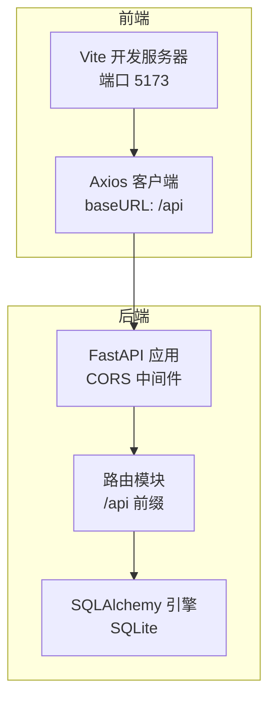
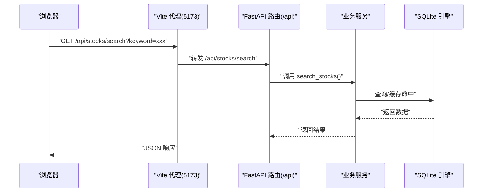
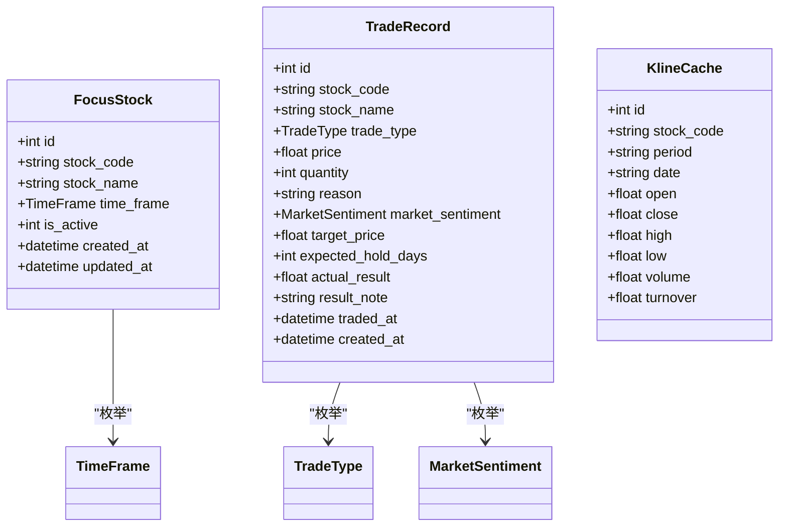
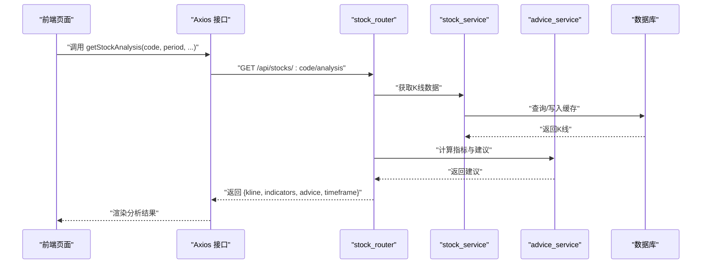
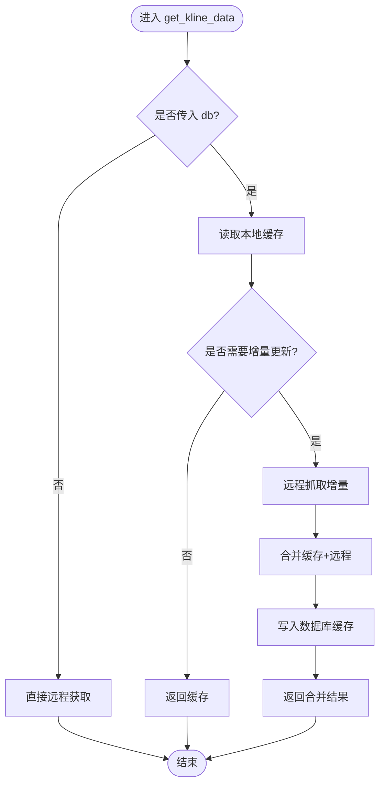

# 调试技巧与工具

<cite>
**本文引用的文件**

- [backend/app/main.py](file://backend/app/main.py)

- [backend/app/db/database.py](file://backend/app/db/database.py)

- [backend/app/routers/stock_router.py](file://backend/app/routers/stock_router.py)

- [backend/app/services/stock_service.py](file://backend/app/services/stock_service.py)

- [backend/app/services/advice_service.py](file://backend/app/services/advice_service.py)

- [backend/app/models/models.py](file://backend/app/models/models.py)

- [backend/app/models/schemas.py](file://backend/app/models/schemas.py)

- [backend/requirements.txt](file://backend/requirements.txt)

- [frontend/src/services/api.ts](file://frontend/src/services/api.ts)

- [frontend/vite.config.ts](file://frontend/vite.config.ts)

- [frontend/package.json](file://frontend/package.json)

- [start.sh](file://start.sh)

- [stop.sh](file://stop.sh)
</cite>

## 目录
1. [简介](#简介)

2. [项目结构](#项目结构)

3. [核心组件](#核心组件)

4. [架构总览](#架构总览)

5. [详细组件分析](#详细组件分析)

6. [依赖分析](#依赖分析)

7. [性能考虑](#性能考虑)

8. [故障排查指南](#故障排查指南)

9. [结论](#结论)

10. [附录](#附录)

## 简介
本指南面向 Stock Foker 应用的开发与调试，聚焦于前后端联调、断点调试、日志分析、网络请求调试、性能分析与常见问题定位。内容覆盖浏览器开发者工具、Node.js/React/Vite 调试、Python/FastAPI/Uvicorn 调试、数据库与外部数据源调试，并提供可复用的调试流程与最佳实践。

## 项目结构
应用采用前后端分离架构：

- 前端：Vite + React + TypeScript，通过代理将 /api 请求转发至后端

- 后端：FastAPI + Uvicorn，SQLite 数据库存储，集成 AkShare/新浪接口获取行情数据

- 启停脚本：统一管理前后端进程、日志输出与健康检查

图表来源

- [frontend/vite.config.ts:1-16](file://frontend/vite.config.ts#L1-L16)

- [frontend/src/services/api.ts:1-68](file://frontend/src/services/api.ts#L1-L68)

- [backend/app/main.py:1-28](file://backend/app/main.py#L1-L28)

- [backend/app/routers/stock_router.py:15](file://backend/app/routers/stock_router.py#L15)

- [backend/app/db/database.py:1-24](file://backend/app/db/database.py#L1-L24)

章节来源

- [frontend/vite.config.ts:1-16](file://frontend/vite.config.ts#L1-L16)

- [frontend/package.json:1-30](file://frontend/package.json#L1-L30)

- [backend/requirements.txt:1-10](file://backend/requirements.txt#L1-L10)

- [start.sh:1-113](file://start.sh#L1-L113)

- [stop.sh:1-56](file://stop.sh#L1-L56)

## 核心组件
- 前端 Axios 客户端封装了所有 API 方法，统一前缀 /api，便于代理转发与跨域处理

- 后端 FastAPI 应用启用 CORS 并挂载 /api 前缀路由；数据库初始化在 startup 事件执行

- 路由层负责参数校验、异常转换与业务服务编排

- 服务层负责数据获取、缓存策略、技术指标计算与买卖建议生成

- 模型与 Schema 定义数据结构与约束，支撑数据库与响应模型

章节来源

- [frontend/src/services/api.ts:1-68](file://frontend/src/services/api.ts#L1-L68)

- [backend/app/main.py:1-28](file://backend/app/main.py#L1-L28)

- [backend/app/routers/stock_router.py:15-197](file://backend/app/routers/stock_router.py#L15-L197)

- [backend/app/db/database.py:1-24](file://backend/app/db/database.py#L1-L24)

- [backend/app/models/models.py:1-75](file://backend/app/models/models.py#L1-L75)

- [backend/app/models/schemas.py:1-118](file://backend/app/models/schemas.py#L1-L118)

## 架构总览
下图展示从浏览器到后端服务的完整链路，包括代理、路由、数据库与外部数据源：

图表来源

- [frontend/vite.config.ts:6-14](file://frontend/vite.config.ts#L6-L14)

- [frontend/src/services/api.ts:29-31](file://frontend/src/services/api.ts#L29-L31)

- [backend/app/routers/stock_router.py:70-78](file://backend/app/routers/stock_router.py#L70-L78)

- [backend/app/db/database.py:14-23](file://backend/app/db/database.py#L14-L23)

## 详细组件分析

### 前端调试要点
- 代理与跨域

  - Vite 通过 server.proxy 将 /api 转发到后端地址，避免跨域问题

  - 建议在浏览器 Network 面板观察 /api 请求是否被正确代理

- Axios 封装

  - baseURL 设为 /api，确保与后端路由一致

  - 对每个 API 方法添加 try/catch 并打印错误上下文

- 页面与状态

  - 使用 React DevTools 检查组件树与 props/state

  - 在关键渲染逻辑处设置断点，观察数据流变化

章节来源

- [frontend/vite.config.ts:6-14](file://frontend/vite.config.ts#L6-L14)

- [frontend/src/services/api.ts:11-68](file://frontend/src/services/api.ts#L11-L68)

### 后端调试要点
- CORS 与根路径

  - 确认允许的源包含前端地址，根路径返回健康信息

- 路由与异常

  - 路由层对业务异常进行捕获并转换为 HTTP 异常，便于前端统一处理

- 数据库

  - startup 初始化数据库表；使用 get_db 依赖注入确保连接释放

- 服务层

  - 外部数据源访问具备重试机制；缓存策略减少重复抓取

章节来源

- [backend/app/main.py:9-27](file://backend/app/main.py#L9-L27)

- [backend/app/routers/stock_router.py:15-197](file://backend/app/routers/stock_router.py#L15-L197)

- [backend/app/db/database.py:14-23](file://backend/app/db/database.py#L14-L23)

- [backend/app/services/stock_service.py:22-32](file://backend/app/services/stock_service.py#L22-L32)

### 数据模型与序列化

图表来源

- [backend/app/models/models.py:25-75](file://backend/app/models/models.py#L25-L75)

- [backend/app/models/schemas.py:8-118](file://backend/app/models/schemas.py#L8-L118)

章节来源

- [backend/app/models/models.py:1-75](file://backend/app/models/models.py#L1-L75)

- [backend/app/models/schemas.py:1-118](file://backend/app/models/schemas.py#L1-L118)

### API 流程示例：获取股票分析

图表来源

- [frontend/src/services/api.ts:34-44](file://frontend/src/services/api.ts#L34-L44)

- [backend/app/routers/stock_router.py:98-131](file://backend/app/routers/stock_router.py#L98-L131)

- [backend/app/services/stock_service.py:131-200](file://backend/app/services/stock_service.py#L131-L200)

- [backend/app/services/advice_service.py:168-192](file://backend/app/services/advice_service.py#L168-L192)

章节来源

- [frontend/src/services/api.ts:34-44](file://frontend/src/services/api.ts#L34-L44)

- [backend/app/routers/stock_router.py:98-131](file://backend/app/routers/stock_router.py#L98-L131)

- [backend/app/services/stock_service.py:131-200](file://backend/app/services/stock_service.py#L131-L200)

- [backend/app/services/advice_service.py:168-192](file://backend/app/services/advice_service.py#L168-L192)

### 复杂逻辑：K线数据获取与缓存

图表来源

- [backend/app/services/stock_service.py:131-200](file://backend/app/services/stock_service.py#L131-L200)

- [backend/app/db/database.py:14-23](file://backend/app/db/database.py#L14-L23)

章节来源

- [backend/app/services/stock_service.py:131-200](file://backend/app/services/stock_service.py#L131-L200)

- [backend/app/db/database.py:14-23](file://backend/app/db/database.py#L14-L23)

## 依赖分析
- 前端依赖

  - React、Ant Design、ECharts、Axios、Vite、TypeScript

  - 通过 package.json 管理，Vite 提供热更新与代理能力

- 后端依赖

  - FastAPI、Uvicorn、SQLAlchemy、AkShare、Pandas/PandasTA、Pydantic、HTTPX

  - 通过 requirements.txt 管理，支持外部数据获取与技术分析

章节来源

- [frontend/package.json:1-30](file://frontend/package.json#L1-L30)

- [backend/requirements.txt:1-10](file://backend/requirements.txt#L1-L10)

## 性能考虑
- 前端

  - 使用 React DevTools 分析渲染次数与重渲染热点

  - 在 API 调用处增加超时与重试策略，避免长时间阻塞 UI

- 后端

  - 缓存策略优先命中本地 SQLite，减少对外部接口依赖

  - 对外部接口调用使用指数退避重试，避免雪崩

  - 使用分页与限制数量的查询，避免一次性返回大量数据

- 通用

  - 使用浏览器 Network 面板观察请求耗时与重定向

  - 使用浏览器 Performance 面板录制交互，定位长任务与布局抖动

## 故障排查指南

### 启动与进程管理
- 启动顺序

  - 后端：Uvicorn 在 127.0.0.1:8000 启动，日志输出到 .pids/backend.log

  - 前端：Vite 在 127.0.0.1:5173 启动，日志输出到 .pids/frontend.log

  - 脚本会等待后端/前端就绪后再提示完成

- 停止进程

  - 通过 PID 文件查找并终止进程，若端口仍被占用则强制清理

章节来源

- [start.sh:46-112](file://start.sh#L46-L112)

- [stop.sh:10-56](file://stop.sh#L10-L56)

### 跨域与代理问题
- 症状

  - 浏览器控制台出现跨域错误或 /api 请求 404

- 排查

  - 确认 Vite 代理配置指向后端地址

  - 确认后端 CORS 允许前端源

  - 确认前端 baseURL 为 /api

章节来源

- [frontend/vite.config.ts:6-14](file://frontend/vite.config.ts#L6-L14)

- [backend/app/main.py:9-15](file://backend/app/main.py#L9-L15)

- [frontend/src/services/api.ts:11](file://frontend/src/services/api.ts#L11)

### 数据库与缓存问题
- 症状

  - 首次访问报错或数据为空

- 排查

  - 确认 startup 已执行并创建表

  - 查看 SQLite 文件是否存在与权限是否正确

  - 观察缓存是否命中，必要时清空缓存重试

章节来源

- [backend/app/main.py:20-27](file://backend/app/main.py#L20-L27)

- [backend/app/db/database.py:4-23](file://backend/app/db/database.py#L4-L23)

### 外部数据源问题
- 症状

  - 搜索/分析接口偶发失败或超时

- 排查

  - 检查网络连通性与代理设置

  - 查看重试日志与异常栈，确认是否触发缓存回退

  - 适当增大超时与重试次数

章节来源

- [backend/app/services/stock_service.py:22-32](file://backend/app/services/stock_service.py#L22-L32)

- [backend/app/services/stock_service.py:192-200](file://backend/app/services/stock_service.py#L192-L200)

### 错误堆栈与异常处理
- 后端异常

  - 路由层捕获业务异常并转换为 HTTP 异常，携带明确 detail

  - 建议在日志中记录请求 ID 与用户上下文

- 前端异常

  - Axios 拦截器统一处理错误响应，提示用户并记录日志

  - 在关键回调中加入 try/catch 并上报错误

章节来源

- [backend/app/routers/stock_router.py:70-78](file://backend/app/routers/stock_router.py#L70-L78)

- [frontend/src/services/api.ts:14-67](file://frontend/src/services/api.ts#L14-L67)

### 日志分析策略
- 后端

  - 关注启动日志、路由访问日志、数据库初始化日志

  - 使用 uvicorn 的 access log 记录请求耗时与状态码

- 前端

  - 使用浏览器 Console 面板查看错误与警告

  - 使用 Network 面板查看请求头、响应体与耗时

章节来源

- [start.sh:46-50](file://start.sh#L46-L50)

- [start.sh:83-87](file://start.sh#L83-L87)

### 断点调试技巧
- 前端

  - 在 api.ts 的各方法入口设置断点，观察入参与返回值

  - 在页面组件中对关键渲染逻辑设置断点，检查 props/state 变化

- 后端

  - 在 stock_router 的路由处理函数入口设置断点

  - 在 stock_service 的数据获取与缓存逻辑处设置断点

- 数据库

  - 在 get_db 依赖处设置断点，验证连接生命周期

章节来源

- [frontend/src/services/api.ts:14-67](file://frontend/src/services/api.ts#L14-L67)

- [backend/app/routers/stock_router.py:20-53](file://backend/app/routers/stock_router.py#L20-L53)

- [backend/app/services/stock_service.py:153-200](file://backend/app/services/stock_service.py#L153-L200)

- [backend/app/db/database.py:14-19](file://backend/app/db/database.py#L14-L19)

### 性能分析工具使用
- 浏览器

  - 使用 Performance 面板录制交互，定位长任务与主线程阻塞

  - 使用 Memory 面板观察内存泄漏与峰值

- 后端

  - 使用 cProfile 或 py-spy 对热点函数采样

  - 结合日志统计慢请求与错误率

[本节为通用指导，无需特定文件引用]

### 网络请求调试
- 步骤

  - 打开浏览器 Network 面板，勾选 Disable cache

  - 发起请求，观察请求头、查询参数、响应体与状态码

  - 使用 Preserve log 与 copy as fetch 导出请求

- 常见问题

  - 参数未传递或类型不匹配

  - 未处理分页或数量限制导致数据不全

章节来源

- [frontend/src/services/api.ts:29-44](file://frontend/src/services/api.ts#L29-L44)

- [backend/app/routers/stock_router.py:98-131](file://backend/app/routers/stock_router.py#L98-L131)

### 调试环境配置与工具推荐
- 前端

  - VS Code + React DevTools 插件

  - 浏览器 DevTools：Network、Performance、Console、Sources

- 后端

  - VS Code + Python 扩展，配合断点与变量面板

  - uvicorn --log-level debug 启动以获得更详细日志

- 通用

  - 使用 curl 或 Postman 验证接口行为

  - 使用 jq 或在线 JSON 校验工具格式化响应

章节来源

- [backend/app/main.py:20-27](file://backend/app/main.py#L20-L27)

- [start.sh:46-50](file://start.sh#L46-L50)

## 结论
通过统一的调试流程与工具组合，可以高效定位 Stock Foker 的跨域、网络、数据库与外部数据源问题。建议在日常开发中坚持“先前端后端、先接口后数据库”的排查顺序，并结合日志与性能分析工具形成闭环。

## 附录

### 常见调试场景操作步骤
- 场景一：前端无法访问后端接口

  - 检查 Vite 代理配置与后端 CORS 设置

  - 使用 curl 验证 /api 前缀是否可达

- 场景二：搜索/分析接口不稳定

  - 查看后端日志与重试记录

  - 在 stock_service 中设置断点，观察缓存与远程分支

- 场景三：页面渲染异常或卡顿

  - 使用 React DevTools 检查组件重渲染

  - 使用 Performance 面板定位长任务

[本节为通用指导，无需特定文件引用]
