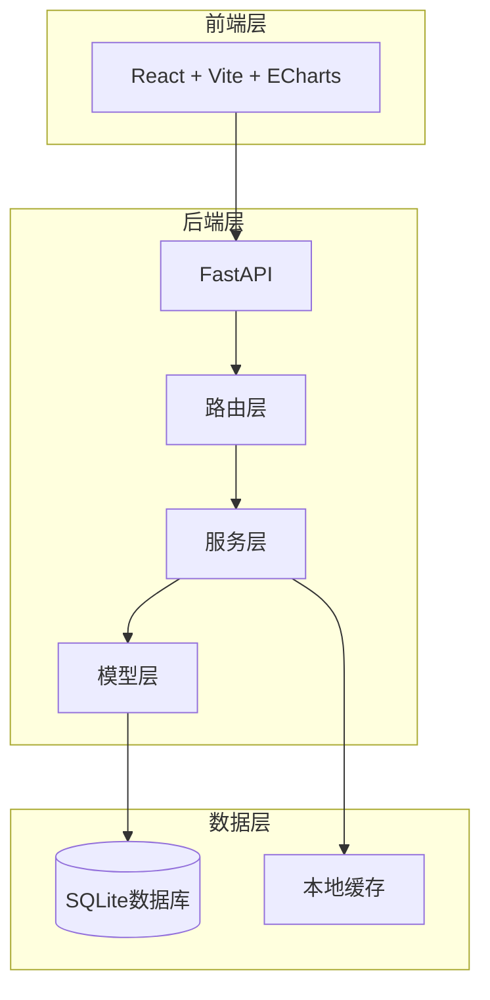
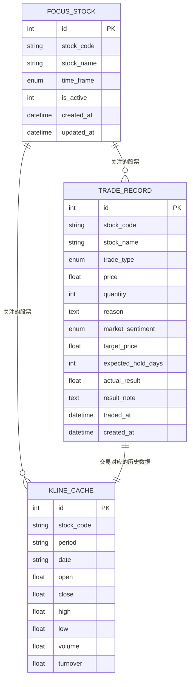
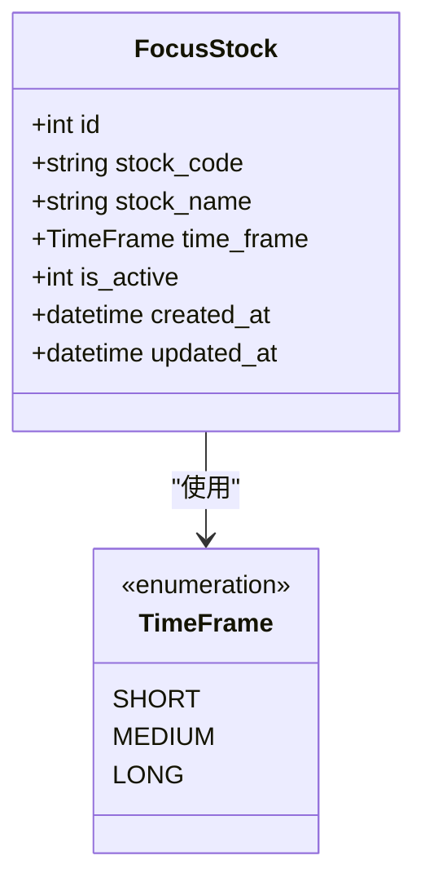
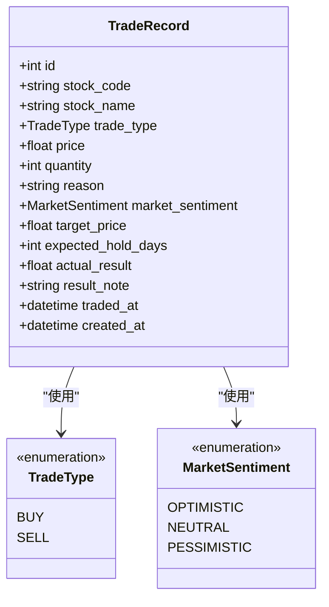
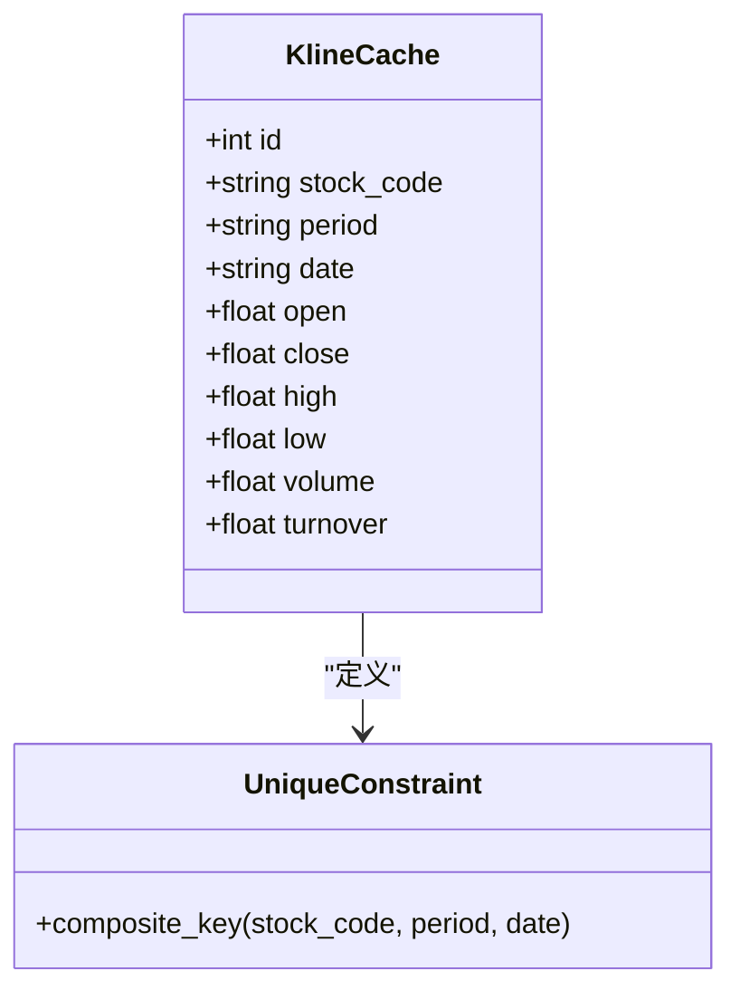
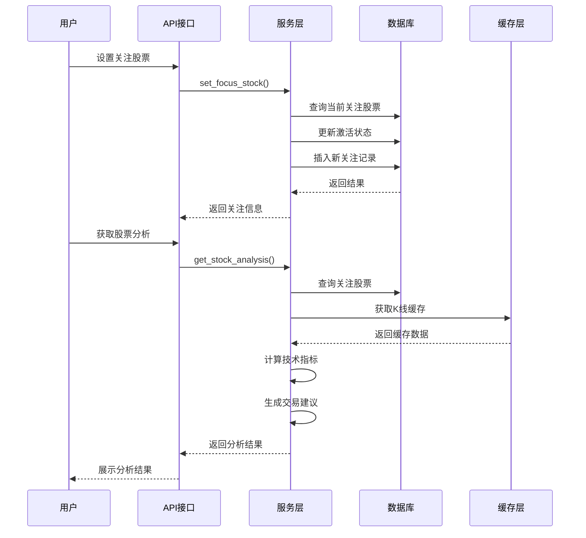
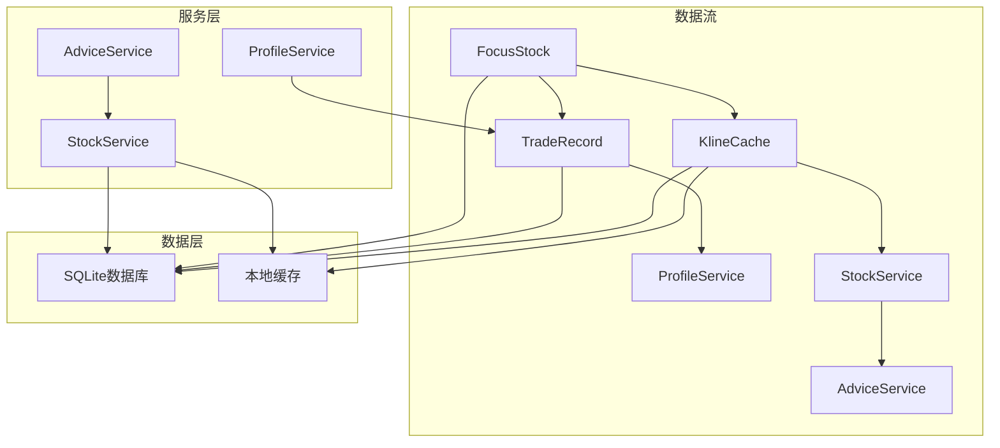
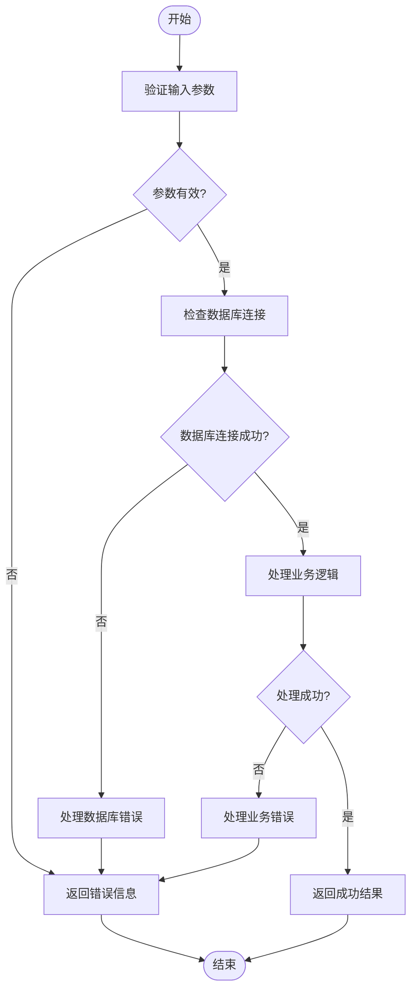

# 实体关系设计

<cite>
**本文档引用的文件**
- [models.py](file://backend/app/models/models.py)
- [schemas.py](file://backend/app/models/schemas.py)
- [database.py](file://backend/app/db/database.py)
- [stock_router.py](file://backend/app/routers/stock_router.py)
- [stock_service.py](file://backend/app/services/stock_service.py)
- [advice_service.py](file://backend/app/services/advice_service.py)
- [profile_service.py](file://backend/app/services/profile_service.py)
- [产品设计文档.md](file://doc/产品设计文档.md)
</cite>

## 目录
1. [简介](#简介)
2. [项目结构](#项目结构)
3. [核心组件](#核心组件)
4. [架构概览](#架构概览)
5. [详细组件分析](#详细组件分析)
6. [依赖关系分析](#依赖关系分析)
7. [性能考虑](#性能考虑)
8. [故障排除指南](#故障排除指南)
9. [结论](#结论)

## 简介

Stock Foker是一款面向个人投资者的股票分析应用，采用"深度聚焦、数据驱动、自我进化"的理念。本应用通过单股票聚焦模式，融合技术面、基本面、消息面数据，结合用户个人交易画像，提供个性化的辅助决策建议。

本文档专注于分析应用中的三个核心实体：FocusStock（关注股票）、TradeRecord（交易记录）、KlineCache（K线缓存）之间的实体关系设计，深入探讨它们的关联关系、一对多或多对多关系的设计思路，以及业务场景中的实体交互模式和数据流向。

## 项目结构

Stock Foker采用典型的三层架构设计，主要分为前端、后端和数据库层：

**图表来源**
- [stock_router.py:1-197](file://backend/app/routers/stock_router.py#L1-L197)
- [stock_service.py:1-327](file://backend/app/services/stock_service.py#L1-L327)
- [models.py:1-75](file://backend/app/models/models.py#L1-L75)
- [database.py:1-24](file://backend/app/db/database.py#L1-L24)

**章节来源**
- [stock_router.py:1-197](file://backend/app/routers/stock_router.py#L1-L197)
- [stock_service.py:1-327](file://backend/app/services/stock_service.py#L1-L327)
- [models.py:1-75](file://backend/app/models/models.py#L1-L75)
- [database.py:1-24](file://backend/app/db/database.py#L1-L24)

## 核心组件

### FocusStock（关注股票）

FocusStock实体代表用户当前关注的股票，是整个系统的核心焦点。它具有以下关键属性：

- **唯一标识**：自增主键id
- **股票标识**：stock_code（股票代码）、stock_name（股票名称）
- **时间框架**：time_frame（短线/中线/长线）
- **激活状态**：is_active（1表示当前关注）
- **时间戳**：created_at、updated_at

### TradeRecord（交易记录）

TradeRecord实体记录用户的每笔交易操作，包含完整的交易信息：

- **交易基本信息**：stock_code、stock_name、trade_type（买入/卖出）、price、quantity
- **决策信息**：reason（交易理由）、market_sentiment（市场情绪）
- **预期信息**：target_price、expected_hold_days
- **结果信息**：actual_result、result_note
- **时间信息**：traded_at、created_at

### KlineCache（K线缓存）

KlineCache实体用于本地缓存历史K线数据，提高数据访问性能：

- **复合主键**：stock_code + period + date（唯一约束）
- **时间标识**：period（日/周/月）、date（YYYY-MM-DD）
- **OHLCV数据**：open、close、high、low、volume
- **其他指标**：turnover（换手率）

**章节来源**
- [models.py:25-75](file://backend/app/models/models.py#L25-L75)
- [schemas.py:8-118](file://backend/app/models/schemas.py#L8-L118)

## 架构概览

Stock Foker的实体关系设计体现了清晰的业务逻辑分离和数据一致性保证：

**图表来源**
- [models.py:25-75](file://backend/app/models/models.py#L25-L75)

### 关系设计原则

1. **单一职责原则**：每个实体专注于特定的业务领域
2. **数据一致性**：通过外键约束保证引用完整性
3. **性能优化**：合理的索引设计和缓存策略
4. **业务合理性**：符合股票交易的实际业务流程

## 详细组件分析

### FocusStock实体分析

FocusStock实体采用单例模式设计，确保系统中只有一个当前关注的股票：

**图表来源**
- [models.py:25-36](file://backend/app/models/models.py#L25-L36)
- [models.py:8-12](file://backend/app/models/models.py#L8-L12)

#### 关键特性
- **激活状态管理**：通过is_active字段控制当前关注状态
- **时间框架配置**：支持短线、中线、长线三种交易模式
- **自动更新机制**：updated_at字段自动更新

### TradeRecord实体分析

TradeRecord实体设计体现了完整的交易生命周期管理：

**图表来源**
- [models.py:38-56](file://backend/app/models/models.py#L38-L56)
- [models.py:14-23](file://backend/app/models/models.py#L14-L23)

#### 业务流程
1. **交易决策**：用户基于技术分析和市场情绪做出买卖决策
2. **执行交易**：记录实际成交的价格、数量和时间
3. **结果追踪**：后续补充实际盈亏和交易笔记
4. **复盘分析**：基于历史交易生成个人交易画像

### KlineCache实体分析

KlineCache实体实现了高效的数据缓存机制：

**图表来源**
- [models.py:58-75](file://backend/app/models/models.py#L58-L75)

#### 缓存策略
- **增量更新**：仅同步缺失的数据
- **盘中更新**：实时更新当天的最新数据
- **索引优化**：对stock_code建立索引提高查询效率

### 实体关系交互流程

**图表来源**
- [stock_router.py:27-53](file://backend/app/routers/stock_router.py#L27-L53)
- [stock_router.py:98-131](file://backend/app/routers/stock_router.py#L98-L131)
- [stock_service.py:153-237](file://backend/app/services/stock_service.py#L153-L237)

**章节来源**
- [stock_router.py:18-131](file://backend/app/routers/stock_router.py#L18-L131)
- [stock_service.py:131-237](file://backend/app/services/stock_service.py#L131-L237)

## 依赖关系分析

### 数据流依赖关系

**图表来源**
- [stock_router.py:1-197](file://backend/app/routers/stock_router.py#L1-L197)
- [stock_service.py:1-327](file://backend/app/services/stock_service.py#L1-L327)
- [profile_service.py:1-114](file://backend/app/services/profile_service.py#L1-L114)

### 业务逻辑依赖

1. **关注管理依赖**：FocusStock是所有分析的基础
2. **交易记录依赖**：TradeRecord提供历史数据支撑
3. **技术分析依赖**：KlineCache提供数据源
4. **画像生成依赖**：TradeRecord是ProfileService的数据来源

**章节来源**
- [stock_router.py:1-197](file://backend/app/routers/stock_router.py#L1-L197)
- [profile_service.py:6-97](file://backend/app/services/profile_service.py#L6-L97)

## 性能考虑

### 数据库优化策略

1. **索引设计**
   - KlineCache.stock_code建立索引，提高查询效率
   - 复合唯一约束确保数据完整性

2. **缓存策略**
   - K线数据本地缓存，减少网络请求
   - 增量更新机制，避免全量数据同步

3. **查询优化**
   - 使用SQLAlchemy ORM进行高效的数据库操作
   - 合理的查询条件和排序策略

### 性能监控指标

- **响应时间**：< 3秒
- **并发处理**：支持多用户同时访问
- **内存使用**：合理控制缓存大小

## 故障排除指南

### 常见问题及解决方案

1. **数据不一致问题**
   - 检查数据库连接和事务处理
   - 验证唯一约束和外键关系

2. **性能问题**
   - 分析慢查询语句
   - 优化索引和查询条件

3. **缓存失效**
   - 检查缓存更新策略
   - 验证数据同步机制

### 错误处理机制

**图表来源**
- [stock_router.py:1-197](file://backend/app/routers/stock_router.py#L1-L197)

**章节来源**
- [stock_router.py:1-197](file://backend/app/routers/stock_router.py#L1-L197)

## 结论

Stock Foker的实体关系设计体现了以下核心特点：

1. **业务合理性**：FocusStock、TradeRecord、KlineCache三个实体紧密配合，形成了完整的股票分析闭环
2. **技术先进性**：采用现代Web技术栈，支持高性能的数据处理和分析
3. **扩展性强**：模块化设计便于功能扩展和维护
4. **用户体验**：简洁直观的操作界面，丰富的技术分析功能

该设计充分考虑了个人投资者的实际需求，通过数据驱动的方式帮助用户提升交易决策质量，实现"深度聚焦、数据驱动、自我进化"的产品目标。