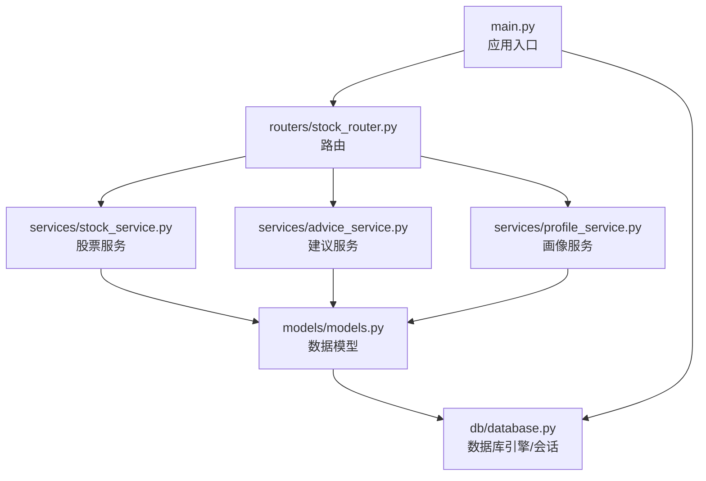
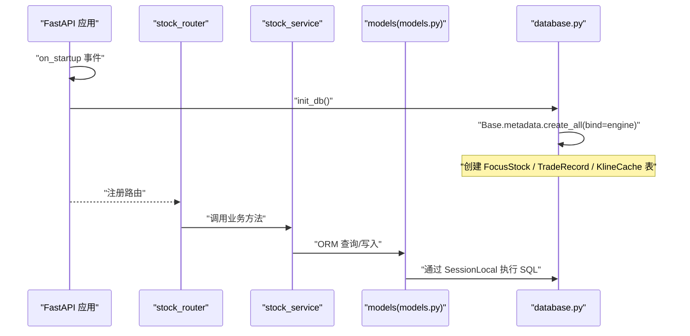
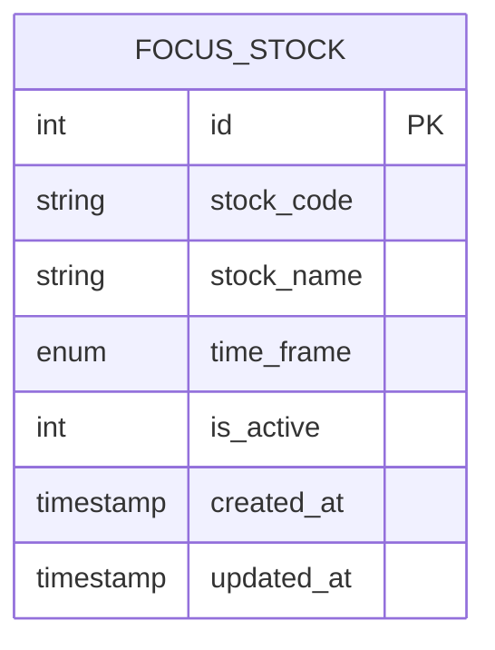
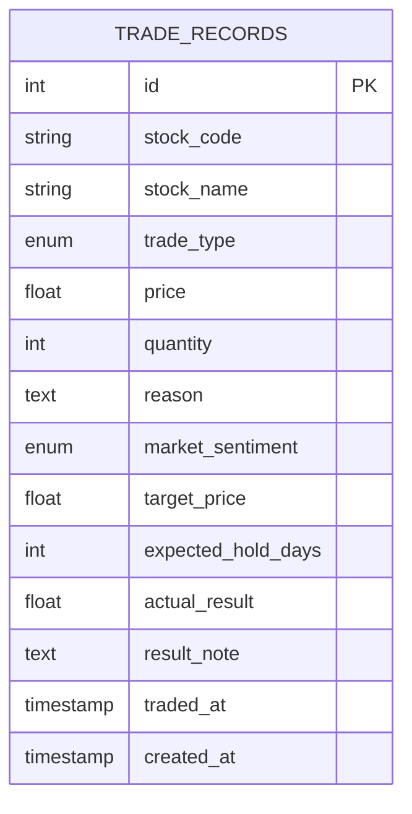
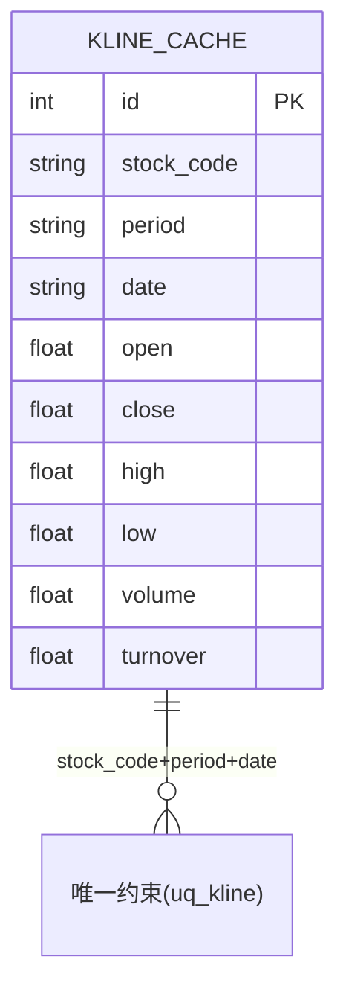
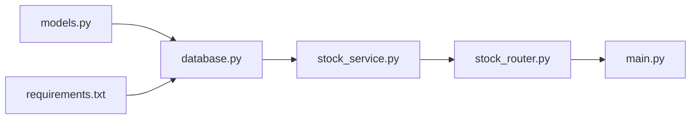

# 数据库表结构

<cite>
**本文引用的文件**

- [models.py](file://backend/app/models/models.py)

- [database.py](file://backend/app/db/database.py)

- [schemas.py](file://backend/app/models/schemas.py)

- [main.py](file://backend/app/main.py)

- [stock_router.py](file://backend/app/routers/stock_router.py)

- [stock_service.py](file://backend/app/services/stock_service.py)

- [advice_service.py](file://backend/app/services/advice_service.py)

- [profile_service.py](file://backend/app/services/profile_service.py)

- [requirements.txt](file://backend/requirements.txt)
</cite>

## 目录
1. [简介](#简介)

2. [项目结构](#项目结构)

3. [核心组件](#核心组件)

4. [架构总览](#架构总览)

5. [详细组件分析](#详细组件分析)

6. [依赖分析](#依赖分析)

7. [性能考虑](#性能考虑)

8. [故障排查指南](#故障排查指南)

9. [结论](#结论)

10. [附录](#附录)

## 简介
本文件系统化梳理 Stock Foker 应用的数据库表结构，重点覆盖以下三张表：

- FocusStock：当前关注的股票

- TradeRecord：交易操作记录

- KlineCache：K线数据本地缓存

内容涵盖字段定义、数据类型、约束条件、索引策略、主键/唯一/外键设计、业务含义与取值范围、DDL 语句与表结构图、数据库初始化流程与创建顺序、索引优化建议与查询性能考量。

## 项目结构
后端采用 FastAPI + SQLAlchemy ORM 的典型分层结构：

- models 层：定义数据模型与枚举

- db 层：数据库引擎与会话管理

- routers 层：API 路由与业务编排

- services 层：业务逻辑与外部数据集成

- main 入口：应用启动与初始化

图表来源

- [main.py:1-28](file://backend/app/main.py#L1-L28)

- [stock_router.py:1-197](file://backend/app/routers/stock_router.py#L1-L197)

- [stock_service.py:1-327](file://backend/app/services/stock_service.py#L1-L327)

- [advice_service.py:1-193](file://backend/app/services/advice_service.py#L1-L193)

- [profile_service.py:1-114](file://backend/app/services/profile_service.py#L1-L114)

- [models.py:1-75](file://backend/app/models/models.py#L1-L75)

- [database.py:1-24](file://backend/app/db/database.py#L1-L24)

章节来源

- [main.py:1-28](file://backend/app/main.py#L1-L28)

- [stock_router.py:1-197](file://backend/app/routers/stock_router.py#L1-L197)

- [models.py:1-75](file://backend/app/models/models.py#L1-L75)

- [database.py:1-24](file://backend/app/db/database.py#L1-L24)

## 核心组件
本节概述三张核心表的职责与关键字段。

- FocusStock（当前关注的股票）

  - 用途：记录用户当前关注的股票，支持切换与历史追踪

  - 关键字段：stock_code、stock_name、time_frame、is_active、created_at、updated_at

  - 主键：id（自增整型）

- TradeRecord（交易操作记录）

  - 用途：记录买入/卖出交易，支持补充实际结果与备注

  - 关键字段：stock_code、stock_name、trade_type、price、quantity、reason、market_sentiment、target_price、expected_hold_days、actual_result、result_note、traded_at、created_at

  - 主键：id（自增整型）

- KlineCache（K线数据本地缓存）

  - 用途：缓存从远程获取的K线数据，避免重复抓取

  - 关键字段：stock_code、period、date、open、close、high、low、volume、turnover

  - 主键：id（自增整型）

  - 唯一约束：stock_code + period + date（确保同一周期同一天的唯一性）

章节来源

- [models.py:25-75](file://backend/app/models/models.py#L25-L75)

## 架构总览
数据库初始化与表创建流程如下：

- 应用启动事件触发数据库初始化

- 初始化调用 ORM 元数据创建所有表

- 各路由在运行期通过 Session 访问表

图表来源

- [main.py:20-23](file://backend/app/main.py#L20-L23)

- [database.py:22-24](file://backend/app/db/database.py#L22-L24)

- [stock_router.py:1-197](file://backend/app/routers/stock_router.py#L1-L197)

- [stock_service.py:131-151](file://backend/app/services/stock_service.py#L131-L151)

- [models.py:25-75](file://backend/app/models/models.py#L25-L75)

## 详细组件分析

### FocusStock 表
- 表名：focus_stock

- 主键：id（整型，自增）

- 字段与约束

  - id：整型，主键，自增

  - stock_code：字符串，长度限制，非空

  - stock_name：字符串，长度限制，非空

  - time_frame：枚举，取值 short/medium/long，默认 short

  - is_active：整型，用于标记当前关注状态，默认 1

  - created_at：时间戳，默认服务器默认值（创建时间）

  - updated_at：时间戳，默认服务器默认值（创建时间），更新时自动更新

- 索引策略

  - 未显式声明索引；is_active 字段在路由查询中作为过滤条件出现，可考虑建立索引以提升查询效率

- 业务含义与取值范围

  - stock_code：股票代码，长度不超过 10

  - stock_name：股票名称，长度不超过 50

  - time_frame：时间框架，短/中/长

  - is_active：1 表示当前关注，0 表示历史关注

- DDL（示意）

  - 创建表时需包含主键与默认值约束；如需索引，可在创建后添加

- 外键关系

  - 无外键

图表来源

- [models.py:25-36](file://backend/app/models/models.py#L25-L36)

章节来源

- [models.py:25-36](file://backend/app/models/models.py#L25-L36)

- [stock_router.py:20-24](file://backend/app/routers/stock_router.py#L20-L24)

### TradeRecord 表
- 表名：trade_records

- 主键：id（整型，自增）

- 字段与约束

  - id：整型，主键，自增

  - stock_code：字符串，长度限制，非空

  - stock_name：字符串，长度限制，非空

  - trade_type：枚举，取值 buy/sell，非空

  - price：浮点数，非空

  - quantity：整型，非空

  - reason：文本，可选

  - market_sentiment：枚举，取值 optimistic/neutral/pessimistic，可选

  - target_price：浮点数，可选

  - expected_hold_days：整型，可选

  - actual_result：浮点数，可选

  - result_note：文本，可选

  - traded_at：时间戳，非空

  - created_at：时间戳，默认服务器默认值（创建时间）

- 索引策略

  - 未显式声明索引；按 stock_code 过滤与按 traded_at 排序的查询较为常见，可考虑在 stock_code 上建立索引，在 traded_at 上建立索引以优化排序与过滤

- 业务含义与取值范围

  - trade_type：买入/卖出

  - price/quantity：价格与数量

  - reason：交易原因

  - market_sentiment：市场情绪

  - target_price/expected_hold_days：目标价与预期持有天数

  - actual_result/result_note：实际盈亏与备注

  - traded_at：交易发生时间

- DDL（示意）

  - 创建表时需包含主键、非空约束与默认值

- 外键关系

  - 无外键

图表来源

- [models.py:38-56](file://backend/app/models/models.py#L38-L56)

章节来源

- [models.py:38-56](file://backend/app/models/models.py#L38-L56)

- [stock_router.py:136-146](file://backend/app/routers/stock_router.py#L136-L146)

- [stock_router.py:149-173](file://backend/app/routers/stock_router.py#L149-L173)

### KlineCache 表
- 表名：kline_cache

- 主键：id（整型，自增）

- 唯一约束

  - uq_kline：stock_code + period + date 唯一

- 字段与约束

  - id：整型，主键，自增

  - stock_code：字符串，长度限制，非空，已建立索引

  - period：字符串，长度限制，非空（daily/weekly/monthly）

  - date：字符串，长度限制，非空（YYYY-MM-DD）

  - open/close/high/low/volume：浮点数，非空

  - turnover：浮点数，默认 0

- 索引策略

  - 已在 stock_code 上建立索引；period + date 组合查询频繁，建议在 period 与 date 上分别建立索引或复合索引以提升查询性能

- 业务含义与取值范围

  - stock_code：股票代码

  - period：K线周期（日/周/月）

  - date：交易日日期

  - open/close/high/low/volume：开盘/收盘/最高/最低/成交量

  - turnover：换手率（可选）

- DDL（示意）

  - 创建表时需包含主键、唯一约束与索引

- 外键关系

  - 无外键

图表来源

- [models.py:58-75](file://backend/app/models/models.py#L58-L75)

章节来源

- [models.py:58-75](file://backend/app/models/models.py#L58-L75)

- [stock_service.py:153-237](file://backend/app/services/stock_service.py#L153-L237)

## 依赖分析
- 数据模型依赖

  - models.py 定义了三个表与三个枚举（TimeFrame、TradeType、MarketSentiment）

  - database.py 提供 Base 类、引擎与会话工厂，并暴露 init_db 方法

  - main.py 在应用启动时调用 init_db

  - routers 与 services 通过 SQLAlchemy ORM 与数据库交互

- 外部依赖

  - requirements.txt 明确了 SQLAlchemy 版本要求

  - stock_service 使用 akshare、pandas、pandas-ta 等库进行数据获取与指标计算

图表来源

- [models.py:1-75](file://backend/app/models/models.py#L1-L75)

- [database.py:1-24](file://backend/app/db/database.py#L1-L24)

- [stock_service.py:1-327](file://backend/app/services/stock_service.py#L1-L327)

- [stock_router.py:1-197](file://backend/app/routers/stock_router.py#L1-L197)

- [main.py:1-28](file://backend/app/main.py#L1-L28)

- [requirements.txt:1-10](file://backend/requirements.txt#L1-L10)

章节来源

- [models.py:1-75](file://backend/app/models/models.py#L1-L75)

- [database.py:1-24](file://backend/app/db/database.py#L1-L24)

- [stock_service.py:1-327](file://backend/app/services/stock_service.py#L1-L327)

- [stock_router.py:1-197](file://backend/app/routers/stock_router.py#L1-L197)

- [main.py:1-28](file://backend/app/main.py#L1-L28)

- [requirements.txt:1-10](file://backend/requirements.txt#L1-L10)

## 性能考虑
- 初始化与创建顺序

  - 由于 SQLAlchemy ORM 的元数据创建是幂等的，且 models.py 中未声明外键关系，因此无需考虑严格的建表顺序

  - 建议在应用启动时统一执行 create_all，确保表结构一致

- 索引优化建议

  - FocusStock：对 is_active 建立索引，以加速“当前关注”查询

  - TradeRecord：对 stock_code 建立索引，对 traded_at 建立索引，以优化按股票过滤与按时间排序

  - KlineCache：对 period 建立索引，对 date 建立索引，或建立 stock_code+period+date 的复合索引，以提升缓存查询与去重性能

- 查询性能考量

  - KlineCache 的唯一约束保证了同一周期同一天的唯一性，有利于增量写入与去重

  - stock_service 的缓存策略先查本地再拉取远程，减少网络开销

  - 对于高频查询的字段（如 stock_code、traded_at、date），建议结合业务场景评估是否增加索引

- 写入性能考量

  - KlineCache 的批量写入与按日期增量更新，有助于降低重复写入成本

  - TradeRecord 的实际结果补充更新采用按需更新字段的方式，减少不必要的写放大

[本节为通用性能指导，不直接分析具体文件，故无章节来源]

## 故障排查指南
- 表未创建

  - 确认应用启动事件已触发 init_db

  - 检查数据库连接 URL 是否正确

- 数据重复

  - KlineCache 的唯一约束应防止重复插入；若仍出现重复，检查唯一键组合与日期格式

- 查询缓慢

  - 为高频过滤与排序字段添加索引

  - 检查是否存在全表扫描的查询

- 数据异常

  - 关注 created_at/updated_at 默认值行为与数据库时区设置

  - 检查枚举字段取值是否符合定义范围

章节来源

- [main.py:20-23](file://backend/app/main.py#L20-L23)

- [database.py:22-24](file://backend/app/db/database.py#L22-L24)

- [models.py:58-75](file://backend/app/models/models.py#L58-L75)

- [stock_service.py:153-237](file://backend/app/services/stock_service.py#L153-L237)

## 结论
本文档系统化梳理了 Stock Foker 的三张核心表：FocusStock、TradeRecord、KlineCache。明确了字段定义、数据类型、约束与索引策略，解释了主键/唯一/外键设计与业务含义，并给出了数据库初始化流程、表创建顺序、索引优化建议与查询性能考量。建议在生产环境中根据实际查询模式进一步细化索引策略，并持续监控表结构与查询性能。

[本节为总结性内容，不直接分析具体文件，故无章节来源]

## 附录

### 数据库初始化流程与表创建顺序
- 应用启动时触发 on_startup 事件

- 调用 init_db，通过 ORM 元数据创建所有表

- 由于未声明外键关系，建表顺序不敏感

章节来源

- [main.py:20-23](file://backend/app/main.py#L20-L23)

- [database.py:22-24](file://backend/app/db/database.py#L22-L24)

### DDL 语句（示意）
- FocusStock

  - 主键：id

  - 非空：stock_code、stock_name、time_frame、is_active、created_at、updated_at

  - 可选：无

  - 建议索引：is_active

- TradeRecord

  - 主键：id

  - 非空：stock_code、stock_name、trade_type、price、quantity、traded_at

  - 可选：reason、market_sentiment、target_price、expected_hold_days、actual_result、result_note、created_at

  - 建议索引：stock_code、traded_at

- KlineCache

  - 主键：id

  - 非空：stock_code、period、date、open、close、high、low、volume

  - 可选：turnover

  - 唯一约束：stock_code + period + date

  - 建议索引：stock_code、period、date 或 stock_code+period+date 复合索引

[本节为示意性 DDL 描述，不直接分析具体文件，故无章节来源]
