# 数据模型

<cite>
**本文引用的文件**
- [models.py](file://backend/app/models/models.py)
- [schemas.py](file://backend/app/models/schemas.py)
- [database.py](file://backend/app/db/database.py)
- [main.py](file://backend/app/main.py)
- [stock_router.py](file://backend/app/routers/stock_router.py)
- [stock_service.py](file://backend/app/services/stock_service.py)
- [advice_service.py](file://backend/app/services/advice_service.py)
- [profile_service.py](file://backend/app/services/profile_service.py)
- [agent_router.py](file://backend/app/routers/agent_router.py)
- [snapshot_router.py](file://backend/app/routers/snapshot_router.py)
- [data_source_router.py](file://backend/app/routers/data_source_router.py)
- [data_source_service.py](file://backend/app/services/data_source_service.py)
- [base_agent.py](file://backend/app/agents/base_agent.py)
- [requirements.txt](file://backend/requirements.txt)
</cite>

## 目录
1. [简介](#简介)
2. [项目结构](#项目结构)
3. [核心组件](#核心组件)
4. [架构总览](#架构总览)
5. [详细组件分析](#详细组件分析)
6. [依赖分析](#依赖分析)
7. [性能考量](#性能考量)
8. [故障排查指南](#故障排查指南)
9. [结论](#结论)
10. [附录](#附录)

## 简介
本文件系统化梳理 Stock Foker 应用的数据模型，聚焦于数据库表结构设计与实体关系映射，涵盖以下核心实体：
- 关注股票（FocusStock）
- 交易记录（TradeRecord）
- K线缓存（KlineCache）
- Agent结果缓存（AgentResultCache）
- 每日Agent快照（DailyAgentSnapshot）
- 数据源缓存（DataSourceCache）
- 股票持仓（StockPosition）

文档将逐项说明字段的数据类型、约束条件与业务含义；解释主键、外键与索引策略；阐述数据验证规则与业务规则约束；提供数据模型图与 ER 关系图；并结合服务层实现说明数据生命周期管理、缓存策略与性能优化考虑，最后给出数据迁移与版本管理的最佳实践建议。

## 项目结构
后端采用 FastAPI + SQLAlchemy 的典型分层结构：
- models 层：定义 ORM 实体与 Pydantic 模型
- db 层：数据库引擎、会话与初始化
- routers 层：HTTP 接口路由
- services 层：业务逻辑（K线获取、技术指标计算、买卖建议、炒股画像、Agent分析）
- agents 层：智能Agent分析引擎
- main 入口：应用启动与数据库初始化

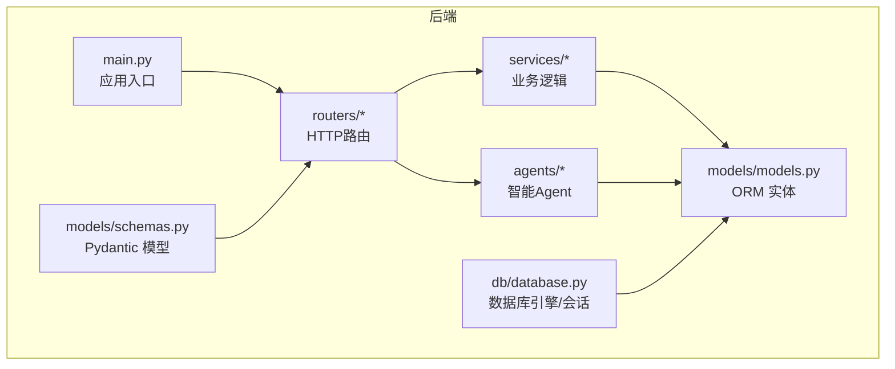

图表来源
- [main.py:1-28](file://backend/app/main.py#L1-L28)
- [agent_router.py:1-395](file://backend/app/routers/agent_router.py#L1-L395)
- [snapshot_router.py:1-84](file://backend/app/routers/snapshot_router.py#L1-L84)
- [data_source_router.py:1-68](file://backend/app/routers/data_source_router.py#L1-L68)
- [models.py:1-151](file://backend/app/models/models.py#L1-L151)
- [schemas.py:1-213](file://backend/app/models/schemas.py#L1-L213)
- [database.py:1-24](file://backend/app/db/database.py#L1-L24)

章节来源
- [main.py:1-28](file://backend/app/main.py#L1-L28)
- [database.py:1-24](file://backend/app/db/database.py#L1-L24)

## 核心组件
本节对七个核心实体进行深入分析，包括字段、约束、索引与业务规则。

### 关注股票（FocusStock）
- 表名：focus_stock
- 主键：id（自增整数）
- 字段与约束
  - stock_code：字符串，长度限制，非空，已建索引
  - stock_name：字符串，长度限制，非空
  - time_frame：枚举（short/medium/long），默认 short
  - is_active：整数，用于标记当前关注状态，默认 1，已建索引
  - created_at：时间戳，默认服务器默认值
  - updated_at：时间戳，默认服务器默认值，并在更新时自动刷新
- 业务含义
  - 记录用户当前关注的股票及时间框架偏好
  - 通过 is_active 控制"当前关注"唯一性（同一时刻仅一个关注有效）
- 索引策略
  - 已对 stock_code 和 is_active 建立索引，提升查询效率

### 交易记录（TradeRecord）
- 表名：trade_records
- 主键：id（自增整数）
- 字段与约束
  - stock_code / stock_name：字符串，非空，已建索引
  - trade_type：枚举（buy/sell），非空
  - price：浮点数，非空
  - quantity：整数，非空
  - reason：文本，可选
  - market_sentiment：枚举（optimistic/neutral/pessimistic），可选
  - target_price：浮点数，可选
  - expected_hold_days：整数，可选
  - actual_result：浮点数，可选
  - result_note：文本，可选
  - traded_at：时间戳，非空
  - record_mode：枚举（backfill/realtime），默认 realtime
  - created_at：时间戳，默认服务器默认值
- 业务含义
  - 记录每次交易的详细信息，支持后续"炒股画像"统计
  - 支持补充实际结果与备注，便于回测与复盘
  - 支持回填模式与实时模式两种记录方式
- 索引策略
  - 已对 stock_code 建立索引，建议对 traded_at 建立索引提升查询效率

### K线缓存（KlineCache）
- 表名：kline_cache
- 主键：id（自增整数）
- 唯一约束：stock_code + period + date
- 字段与约束
  - stock_code：字符串，非空，且建立普通索引
  - period：字符串，非空（daily/weekly/monthly）
  - date：字符串，非空（YYYY-MM-DD）
  - open/close/high/low/volume：浮点数，非空
  - turnover：浮点数，默认 0
- 业务含义
  - 缓存从外部数据源拉取的 K 线数据，避免重复请求
  - 通过唯一约束保证同周期同日期的 K 线唯一
- 索引策略
  - stock_code 已建索引，利于按股票快速检索

### Agent结果缓存（AgentResultCache）
- 表名：agent_result_cache
- 主键：id（自增整数）
- 唯一约束：agent_name + stock_code + cache_key
- 字段与约束
  - agent_name：字符串，长度限制，非空，已建索引
  - stock_code：字符串，长度限制，非空，已建索引
  - cache_key：字符串，长度限制，非空（如日期 "2026-04-06"）
  - status：字符串，长度限制，非空（success/degraded/error）
  - llm_used：整数，默认 0
  - data：文本，非空（JSON 序列化）
  - error_message：文本，可选
  - created_at：时间戳，默认服务器默认值
- 业务含义
  - 缓存各Agent分析结果，支持每日新鲜度检查与降级处理
  - 记录LLM使用状态，支持LLM可用时的缓存降级逻辑
- 索引策略
  - 已对 agent_name 和 stock_code 建立索引，建议对 cache_key 建立索引

### 每日Agent快照（DailyAgentSnapshot）
- 表名：daily_agent_snapshot
- 主键：id（自增整数）
- 唯一约束：agent_type + stock_code + date
- 字段与约束
  - agent_type：字符串，长度限制，非空，已建索引（sentiment/sector/macro/enhanced_advice）
  - stock_code：字符串，长度限制，非空，已建索引
  - date：字符串，长度限制，非空（YYYY-MM-DD）
  - snapshot_data：文本，非空（JSON 关键指标）
  - llm_used：整数，默认 0
  - created_at：时间戳，默认服务器默认值
  - updated_at：时间戳，默认服务器默认值，并在更新时自动刷新
- 业务含义
  - 存储每种Agent每天的关键指标快照，每种Agent每支股票每天仅保留最新一条
  - 支持按agent_type和stock_code进行快速查询
- 索引策略
  - 已对 agent_type 和 stock_code 建立索引，确保查询效率

### 数据源缓存（DataSourceCache）
- 表名：data_source_cache
- 主键：id（自增整数）
- 唯一约束：stock_code + source_type + cache_key
- 字段与约束
  - stock_code：字符串，长度限制，非空，已建索引
  - source_type：字符串，长度限制，非空，已建索引（如 hithink_news、announcements 等）
  - cache_key：字符串，长度限制，非空（日期 "2026-04-11"）
  - data：文本，非空（JSON）
  - created_at：时间戳
- 业务含义
  - 独立于Agent结果，存储原始hithink API响应数据
  - 以(stock_code, source_type, date)为粒度的缓存，与Agent缓存保持一致的新鲜度边界
- 索引策略
  - 已对 stock_code 和 source_type 建立索引，建议对 cache_key 建立索引

### 股票持仓（StockPosition）
- 表名：stock_positions
- 主键：id（自增整数）
- 唯一约束：stock_code
- 字段与约束
  - stock_code：字符串，长度限制，非空，已建索引
  - stock_name：字符串，长度限制，非空
  - cost_price：浮点数，非空
  - quantity：整数，非空
  - take_profit_price：浮点数，可选
  - stop_loss_price：浮点数，可选
  - first_buy_date：时间戳，非空
  - note：文本，可选
  - created_at：时间戳，默认服务器默认值
  - updated_at：时间戳，默认服务器默认值，并在更新时自动刷新
- 业务含义
  - 记录用户的股票持仓信息，支持止盈止损设置
  - 通过唯一约束确保每支股票仅有一个持仓记录
- 索引策略
  - 已对 stock_code 建立索引，确保按股票查询效率

章节来源
- [models.py:30-151](file://backend/app/models/models.py#L30-L151)

## 架构总览
下图展示数据模型与服务层之间的交互关系，以及数据流向。

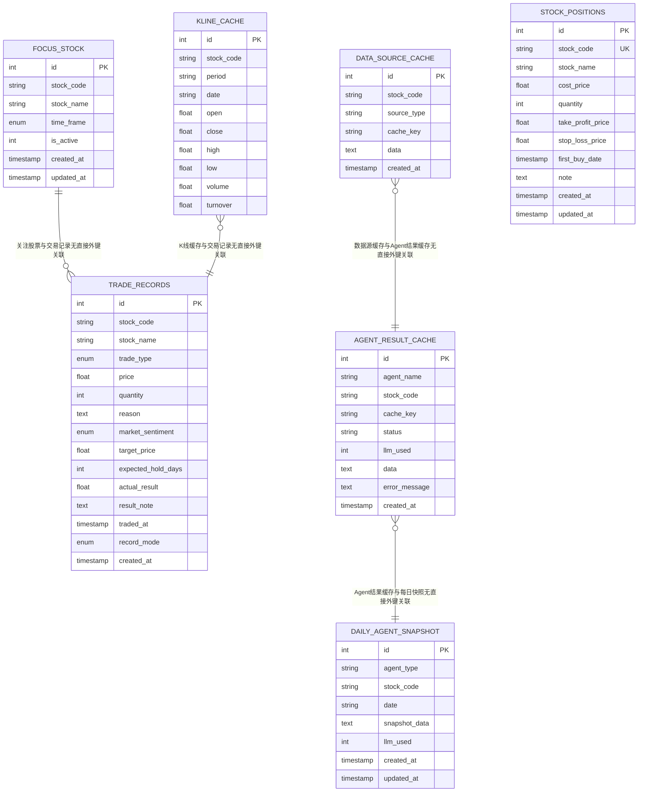

图表来源
- [models.py:30-151](file://backend/app/models/models.py#L30-L151)

## 详细组件分析

### 关注股票（FocusStock）
- 设计要点
  - 使用 is_active 字段控制"当前关注"的唯一性，设置新关注时会将之前的关注置为非激活
  - time_frame 与交易记录中的时间框架偏好配合，影响分析建议
- 查询与更新
  - 获取当前关注：按 is_active=1 查询
  - 更新时间框架：先查当前关注，再更新
- 索引建议
  - 已对 is_active 建立索引，提升"当前关注"查询效率
  - 已对 stock_code 建立索引，提升按股票筛选效率

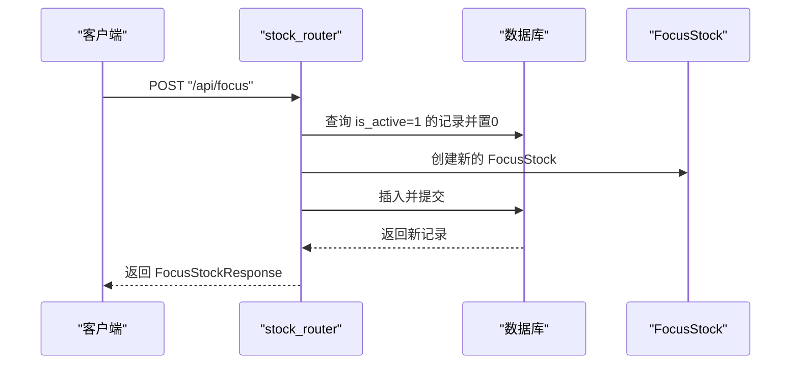

图表来源
- [stock_router.py:27-42](file://backend/app/routers/stock_router.py#L27-L42)
- [models.py:30-41](file://backend/app/models/models.py#L30-L41)

章节来源
- [stock_router.py:20-53](file://backend/app/routers/stock_router.py#L20-L53)
- [models.py:30-41](file://backend/app/models/models.py#L30-L41)

### 交易记录（TradeRecord）
- 设计要点
  - 交易类型、价格、数量、时间等关键字段均非空，确保交易记录完整性
  - 支持补充实际结果与备注，便于后续画像统计
  - 新增 record_mode 字段，支持回填模式与实时模式
- CRUD 操作
  - 列表：支持按 stock_code 过滤与按 traded_at 降序分页
  - 创建：接收 TradeRecordCreate，持久化后返回 TradeRecordResponse
  - 更新：仅允许更新实际结果与备注
  - 删除：按 id 删除
- 索引建议
  - 已对 stock_code 建立索引，建议对 traded_at 建立索引提升查询与排序性能

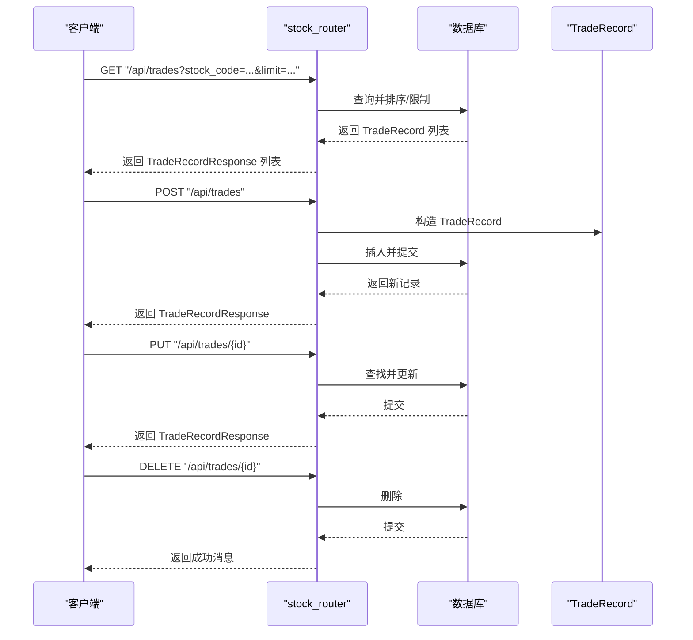

图表来源
- [stock_router.py:136-184](file://backend/app/routers/stock_router.py#L136-L184)
- [models.py:43-62](file://backend/app/models/models.py#L43-L62)
- [schemas.py:29-75](file://backend/app/models/schemas.py#L29-L75)

章节来源
- [stock_router.py:136-184](file://backend/app/routers/stock_router.py#L136-L184)
- [models.py:43-62](file://backend/app/models/models.py#L43-L62)
- [schemas.py:29-75](file://backend/app/models/schemas.py#L29-L75)

### K线缓存（KlineCache）
- 设计要点
  - 唯一约束：stock_code + period + date，确保同周期同日期的 K 线唯一
  - stock_code 建有普通索引，利于按股票检索
  - turnover 默认 0，兼容不同数据源的差异
- 生命周期与缓存策略
  - 本地缓存优先：先从 SQLite 读取已有缓存
  - 增量更新：判断最后缓存日期是否接近最近交易日，若需要则拉取远程数据并写入缓存
  - 盘中更新：对当天数据进行更新（因盘中数据可能变化）
  - 失败回退：远程拉取失败时，若已有缓存则返回缓存，否则抛出错误
- 性能优化
  - 通过唯一约束避免重复写入
  - 对 stock_code 建索引，减少查询成本
  - 增量拉取减少网络与存储开销

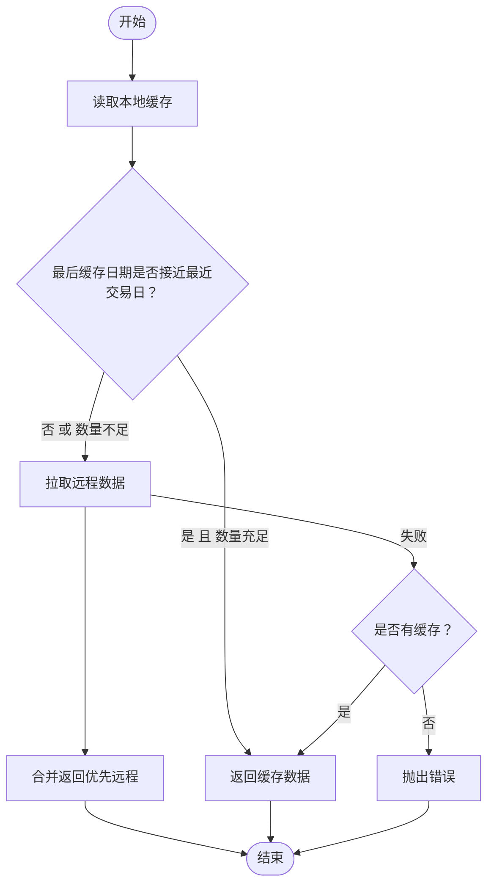

图表来源
- [stock_service.py:153-237](file://backend/app/services/stock_service.py#L153-L237)
- [models.py:64-81](file://backend/app/models/models.py#L64-L81)

章节来源
- [stock_service.py:131-237](file://backend/app/services/stock_service.py#L131-L237)
- [models.py:64-81](file://backend/app/models/models.py#L64-L81)

### Agent结果缓存（AgentResultCache）
- 设计要点
  - 唯一约束：agent_name + stock_code + cache_key，确保每日新鲜度检查
  - 支持三种状态：success（成功）、degraded（降级）、error（错误）
  - llm_used 字段记录是否使用了LLM，支持LLM可用时的缓存降级逻辑
  - data 字段存储JSON序列化的分析结果
- 生命周期与缓存策略
  - 新鲜度边界：以09:00为每日边界，09:00之后生成的缓存才视为新鲜
  - LLM降级：当LLM可用但缓存是未使用LLM的降级结果时，跳过缓存重新分析
  - 自动更新：同一天内多次访问同一Agent时，使用最新的缓存
- 性能优化
  - 通过唯一约束避免重复写入
  - 对 agent_name 和 stock_code 建索引，提升查询效率
  - JSON序列化存储，支持复杂数据结构

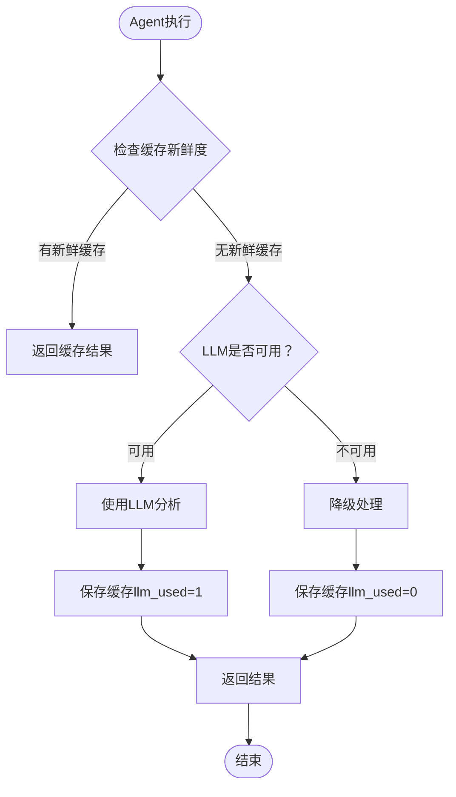

图表来源
- [agent_router.py:47-116](file://backend/app/routers/agent_router.py#L47-L116)
- [models.py:83-99](file://backend/app/models/models.py#L83-L99)

章节来源
- [agent_router.py:47-116](file://backend/app/routers/agent_router.py#L47-L116)
- [models.py:83-99](file://backend/app/models/models.py#L83-L99)

### 每日Agent快照（DailyAgentSnapshot）
- 设计要点
  - 唯一约束：agent_type + stock_code + date，确保每种Agent每支股票每天仅保留最新一条
  - 支持四种Agent类型：sentiment（消息面）、sector（板块）、macro（宏观）、enhanced_advice（增强建议）
  - snapshot_data 字段存储关键指标的JSON数据，便于快速查询和分析
  - llm_used 字段记录该快照是否使用了LLM
- 快照字段提取
  - sentiment：overall_sentiment、sentiment_label、raw_news_count、noise_ratio、analysis
  - sector：sector_name、sector_trend、relative_strength、sector_rotation_signal、industry_rank、analysis
  - macro：market_phase、market_sentiment、risk_level、impact_on_stock、analysis
  - enhanced_advice：signal、confidence、summary、position_advice、reasoning、risk_warnings、dimension_scores
- 生命周期管理
  - 每天自动覆盖，仅保留最新一条快照
  - 支持按agent_type和stock_code快速查询历史快照日期

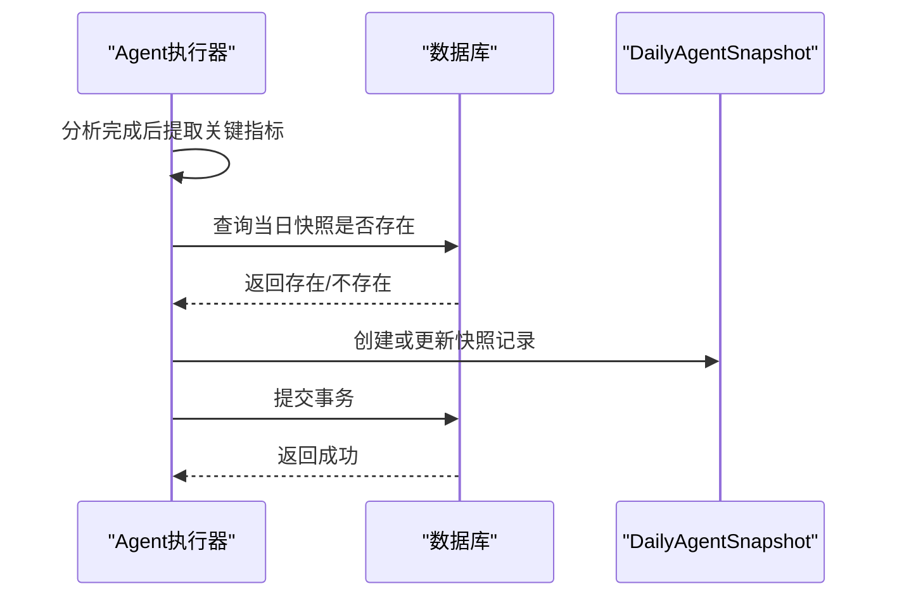

图表来源
- [agent_router.py:146-180](file://backend/app/routers/agent_router.py#L146-L180)
- [models.py:101-116](file://backend/app/models/models.py#L101-L116)

章节来源
- [agent_router.py:146-180](file://backend/app/routers/agent_router.py#L146-L180)
- [models.py:101-116](file://backend/app/models/models.py#L101-L116)

### 数据源缓存（DataSourceCache）
- 设计要点
  - 唯一约束：stock_code + source_type + cache_key，确保数据源粒度的缓存唯一性
  - 支持12种数据源类型：hithink_news、announcements、industry_valuation、market_data、industry_finance、industry_peers、hithink_index、reports、basicinfo、business、shareholders、concept_boards
  - cache_key 以日期为单位，与Agent缓存保持一致的新鲜度边界
  - data 字段存储原始API响应的JSON数据
- 缓存策略
  - 新鲜度边界：以09:00为每日边界，09:00之后生成的缓存才视为新鲜
  - 优先返回缓存：未强制刷新时优先返回缓存数据
  - 强制刷新：支持跳过缓存直接调用API
- 数据源注册表
  - 统一管理12种数据源，新增数据源只需添加一行注册
  - 支持需要股票名称和不需要股票名称两类数据源

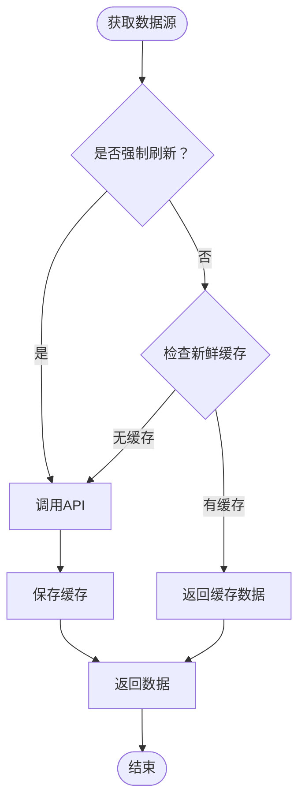

图表来源
- [data_source_router.py:22-68](file://backend/app/routers/data_source_router.py#L22-L68)
- [data_source_service.py:76-151](file://backend/app/services/data_source_service.py#L76-L151)
- [models.py:118-131](file://backend/app/models/models.py#L118-L131)

章节来源
- [data_source_router.py:22-68](file://backend/app/routers/data_source_router.py#L22-L68)
- [data_source_service.py:76-151](file://backend/app/services/data_source_service.py#L76-L151)
- [models.py:118-131](file://backend/app/models/models.py#L118-L131)

### 股票持仓（StockPosition）
- 设计要点
  - 唯一约束：stock_code，确保每支股票仅有一个持仓记录
  - 支持止盈止损价格设置，便于自动交易
  - first_buy_date 记录首次购买日期，支持持仓时间统计
  - 支持note字段记录持仓备注
- 业务含义
  - 记录用户的实际股票持仓情况
  - 支持止盈止损策略的实施
  - 为投资组合管理和风险控制提供基础数据

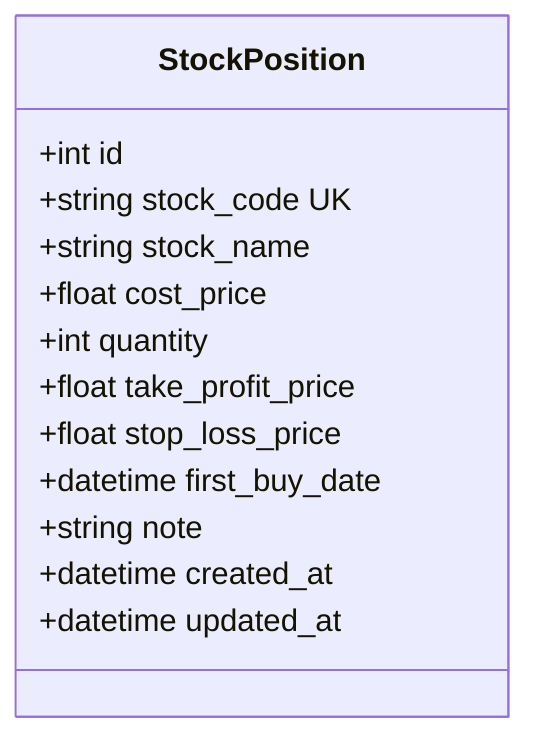

图表来源
- [models.py:133-151](file://backend/app/models/models.py#L133-L151)

章节来源
- [models.py:133-151](file://backend/app/models/models.py#L133-L151)

### 技术指标与买卖建议（间接依赖数据模型）
- 技术指标计算
  - 基于 K 线数据计算 MA、MACD、KDJ、RSI、布林带等指标
  - 输出标准化结构，供前端展示与建议生成
- 买卖建议
  - 综合多指标信号，输出"买入/卖出/持有"建议与置信度
  - 包含推理过程，便于用户理解建议依据
- 炒股画像
  - 基于交易记录统计胜率、平均盈亏、持仓周期、情绪准确率等
  - 支持按股票筛选，辅助用户自我评估

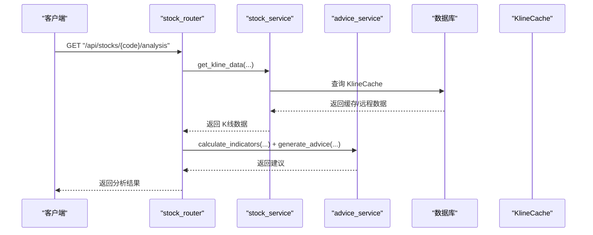

图表来源
- [stock_router.py:98-131](file://backend/app/routers/stock_router.py#L98-L131)
- [stock_service.py:255-326](file://backend/app/services/stock_service.py#L255-L326)
- [advice_service.py:4-173](file://backend/app/services/advice_service.py#L4-L173)

章节来源
- [stock_router.py:98-131](file://backend/app/routers/stock_router.py#L98-L131)
- [stock_service.py:255-326](file://backend/app/services/stock_service.py#L255-L326)
- [advice_service.py:4-173](file://backend/app/services/advice_service.py#L4-L173)

## 依赖分析
- 数据库层
  - 使用 SQLite 文件数据库，连接参数禁用线程检查，适配单进程开发环境
  - 初始化：应用启动时调用 create_all 创建所有表
- ORM 与 Pydantic
  - SQLAlchemy 定义 ORM 实体，Pydantic 定义请求/响应模型
  - 路由层通过依赖注入获取数据库会话，完成 CRUD 操作
- 外部依赖
  - AKShare、pandas、pandas-ta 用于获取与计算技术指标
  - FastAPI、Uvicorn 提供接口服务
  - LLM客户端用于智能Agent分析
- Agent系统
  - BaseAgent提供模板方法模式，子类只需实现4个抽象方法
  - 支持并行执行多个Agent，提高响应速度
  - 统一的错误处理和降级机制

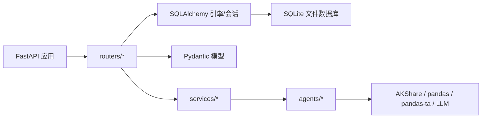

图表来源
- [main.py:1-28](file://backend/app/main.py#L1-L28)
- [database.py:1-24](file://backend/app/db/database.py#L1-L24)
- [agent_router.py:1-395](file://backend/app/routers/agent_router.py#L1-L395)
- [base_agent.py:1-119](file://backend/app/agents/base_agent.py#L1-L119)
- [requirements.txt:1-10](file://backend/requirements.txt#L1-L10)

章节来源
- [main.py:1-28](file://backend/app/main.py#L1-L28)
- [database.py:1-24](file://backend/app/db/database.py#L1-L24)
- [agent_router.py:1-395](file://backend/app/routers/agent_router.py#L1-L395)
- [base_agent.py:1-119](file://backend/app/agents/base_agent.py#L1-L119)
- [requirements.txt:1-10](file://backend/requirements.txt#L1-L10)

## 性能考量
- 索引策略
  - FocusStock：已对 is_active、stock_code 建索引
  - TradeRecord：已对 stock_code 建索引，建议对 traded_at 建索引
  - KlineCache：已对 stock_code 建索引
  - AgentResultCache：已对 agent_name、stock_code 建索引，建议对 cache_key 建索引
  - DailyAgentSnapshot：已对 agent_type、stock_code 建索引
  - DataSourceCache：已对 stock_code、source_type 建索引，建议对 cache_key 建索引
  - StockPosition：已对 stock_code 建索引
- 缓存与增量更新
  - K 线缓存通过唯一约束与增量更新减少重复写入与网络请求
  - Agent缓存通过每日新鲜度边界和LLM降级逻辑优化性能
  - 数据源缓存与Agent缓存保持一致的时间边界
  - 盘中数据更新避免长时间阻塞
- 查询优化
  - 列表接口限制返回条数（如 50），避免一次性返回过多数据
  - 按时间排序与过滤，建议配合索引
  - 快照查询支持按agent_type和stock_code快速定位
- 并发与事务
  - 使用 SQLAlchemy 会话管理事务，确保数据一致性
  - Agent并行执行使用独立线程和数据库会话，避免跨线程共享
  - 在高并发场景下，建议引入连接池与锁机制（如需要）

## 故障排查指南
- 数据库初始化失败
  - 确认 SQLite 文件路径与权限
  - 检查数据库引擎配置与连接参数
- K 线数据获取异常
  - 远程接口不可用时，检查网络与代理设置
  - 若仅有缓存可用，系统会回退使用缓存；若无缓存则抛出错误
- Agent执行异常
  - 检查LLM配置是否正确，包括API密钥、基础URL、模型等
  - 查看Agent缓存状态，确认是否为降级结果
  - 检查数据源缓存是否正常工作
- 交易记录更新失败
  - 确认 trade_id 存在，否则返回"记录不存在"
- 技术指标计算异常
  - 检查输入 K 线数据长度与字段类型
  - 确保 pandas、pandas-ta 版本满足要求
- 数据源获取异常
  - 检查数据源类型是否在注册表中
  - 确认API调用参数是否正确
  - 查看数据源缓存是否正常写入

章节来源
- [database.py:22-23](file://backend/app/db/database.py#L22-L23)
- [stock_service.py:193-199](file://backend/app/services/stock_service.py#L193-L199)
- [agent_router.py:361-378](file://backend/app/routers/agent_router.py#L361-L378)
- [data_source_router.py:30-43](file://backend/app/routers/data_source_router.py#L30-L43)
- [stock_router.py:166-173](file://backend/app/routers/stock_router.py#L166-L173)
- [requirements.txt:4-6](file://backend/requirements.txt#L4-L6)

## 结论
本数据模型围绕"关注股票—交易记录—K线缓存—Agent分析—数据源缓存—股票持仓"六类实体构建，通过唯一约束与索引策略保障数据完整性与查询效率。新增的Agent系统通过三层缓存（前端内存→后端DB→远程API）确保数据流一致性，支持并行执行多个智能Agent，提供消息面、板块、宏观等多维度的智能分析。建议在生产环境中进一步完善索引、引入连接池与事务控制，并制定数据迁移与版本管理方案，以提升稳定性与可维护性。

## 附录

### 字段与约束一览
- FocusStock
  - id：主键，自增
  - stock_code：非空，字符串，已建索引
  - stock_name：非空，字符串
  - time_frame：枚举，默认 short
  - is_active：整数，默认 1，已建索引
  - created_at / updated_at：时间戳，默认值与更新触发
- TradeRecord
  - id：主键，自增
  - stock_code / stock_name：非空，字符串，已建索引
  - trade_type：枚举，非空
  - price / quantity：非空，数值
  - reason / market_sentiment / target_price / expected_hold_days / actual_result / result_note：可选
  - traded_at：非空，时间戳
  - record_mode：枚举，默认 realtime
  - created_at：时间戳，默认值
- KlineCache
  - id：主键，自增
  - stock_code：非空，字符串，已建索引
  - period：非空，字符串（daily/weekly/monthly）
  - date：非空，字符串（YYYY-MM-DD）
  - open/close/high/low/volume：非空，浮点数
  - turnover：浮点数，默认 0
  - 唯一约束：stock_code + period + date
- AgentResultCache
  - id：主键，自增
  - agent_name：非空，字符串，已建索引
  - stock_code：非空，字符串，已建索引
  - cache_key：非空，字符串（如日期 "2026-04-06"）
  - status：非空，字符串（success/degraded/error）
  - llm_used：整数，默认 0
  - data：非空，文本（JSON 序列化）
  - error_message：文本，可选
  - created_at：时间戳，默认服务器默认值
  - 唯一约束：agent_name + stock_code + cache_key
- DailyAgentSnapshot
  - id：主键，自增
  - agent_type：非空，字符串，已建索引（sentiment/sector/macro/enhanced_advice）
  - stock_code：非空，字符串，已建索引
  - date：非空，字符串（YYYY-MM-DD）
  - snapshot_data：非空，文本（JSON 关键指标）
  - llm_used：整数，默认 0
  - created_at / updated_at：时间戳，默认值与更新触发
  - 唯一约束：agent_type + stock_code + date
- DataSourceCache
  - id：主键，自增
  - stock_code：非空，字符串，已建索引
  - source_type：非空，字符串，已建索引（如 hithink_news、announcements 等）
  - cache_key：非空，字符串（日期 "2026-04-11"）
  - data：非空，文本（JSON）
  - created_at：时间戳
  - 唯一约束：stock_code + source_type + cache_key
- StockPosition
  - id：主键，自增
  - stock_code：非空，字符串，唯一约束，已建索引
  - stock_name：非空，字符串
  - cost_price：非空，浮点数
  - quantity：非空，整数
  - take_profit_price / stop_loss_price：可选，浮点数
  - first_buy_date：非空，时间戳
  - note：文本，可选
  - created_at / updated_at：时间戳，默认值与更新触发

章节来源
- [models.py:30-151](file://backend/app/models/models.py#L30-L151)

### 数据模型图（代码级）
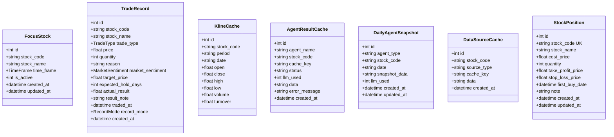

图表来源
- [models.py:30-151](file://backend/app/models/models.py#L30-L151)

### 数据迁移与版本管理最佳实践
- 版本化迁移
  - 使用 Alembic 进行数据库迁移，保留迁移脚本历史
  - 对新增字段与索引变更，编写正向/逆向迁移脚本
  - 新增的Agent相关表需要考虑数据迁移策略
- 兼容性
  - 新增可空字段时，确保默认值与业务逻辑兼容
  - 修改非空字段前，先填充现有数据或提供迁移策略
  - Agent缓存结构变更需要考虑历史数据的兼容性
- 索引与约束
  - 添加索引前评估查询模式，避免冗余索引
  - 唯一约束变更需考虑数据去重与迁移成本
  - 新增的唯一约束需要考虑现有数据的清理
- 回滚与备份
  - 迁移前备份数据库
  - 制定回滚计划，确保可快速恢复
- 验证
  - 迁移后执行数据完整性校验与关键查询回归测试
  - Agent缓存和快照数据的查询性能测试
  - 数据源缓存的时效性和准确性验证