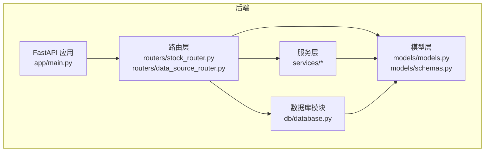
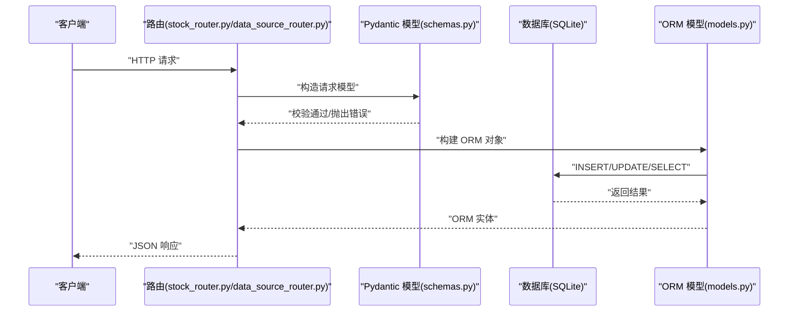
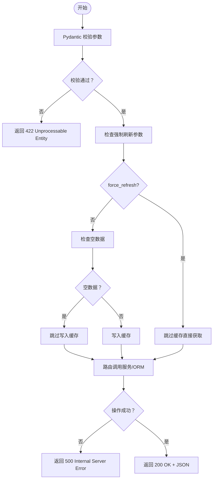
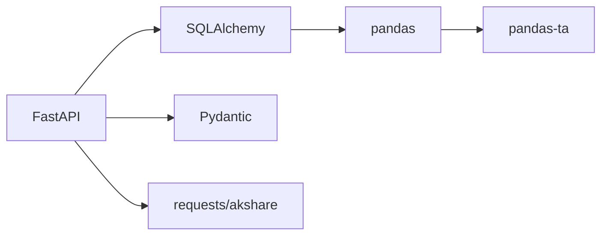

# 数据验证规则

<cite>
**本文引用的文件**
- [backend/app/db/database.py](file://backend/app/db/database.py)
- [backend/app/models/models.py](file://backend/app/models/models.py)
- [backend/app/models/schemas.py](file://backend/app/models/schemas.py)
- [backend/app/routers/stock_router.py](file://backend/app/routers/stock_router.py)
- [backend/app/routers/data_source_router.py](file://backend/app/routers/data_source_router.py)
- [backend/app/services/stock_service.py](file://backend/app/services/stock_service.py)
- [backend/app/services/data_source_service.py](file://backend/app/services/data_source_service.py)
- [backend/app/services/data_fetcher.py](file://backend/app/services/data_fetcher.py)
- [backend/app/services/advice_service.py](file://backend/app/services/advice_service.py)
- [backend/app/services/profile_service.py](file://backend/app/services/profile_service.py)
- [backend/requirements.txt](file://backend/requirements.txt)
</cite>

## 更新摘要
**变更内容**
- 新增空数据检测机制，统一处理{}、{"datas": []}、{"data": []}三种空数据格式
- 新增_force_refresh参数支持K线数据强制刷新
- 空数据不写入缓存避免污染
- 更新数据源缓存策略，增强错误处理和回退机制

## 目录
1. [简介](#简介)
2. [项目结构](#项目结构)
3. [核心组件](#核心组件)
4. [架构总览](#架构总览)
5. [详细组件分析](#详细组件分析)
6. [依赖分析](#依赖分析)
7. [性能考量](#性能考量)
8. [故障排查指南](#故障排查指南)
9. [结论](#结论)
10. [附录](#附录)

## 简介
本文件系统化梳理 Stock Foker 应用的数据验证规则，覆盖数据库层面的约束（非空、唯一、检查、默认值）、枚举类型业务规则（TimeFrame、TradeType、MarketSentiment）、数据类型选择的技术考量与业务适配性，并总结各层级（Pydantic 模型、SQLAlchemy 表定义、服务层与路由层）的验证实现方式及错误处理机制。目标是帮助开发者与使用者理解数据如何被约束与校验，确保数据完整性与业务一致性。

**更新** 本次更新重点加强了数据验证的健壮性，新增了空数据检测机制和强制刷新功能，进一步完善了数据缓存策略。

## 项目结构
后端采用 FastAPI + SQLAlchemy 的分层架构：
- 数据库连接与初始化位于数据库模块
- ORM 模型定义于 models，包含表结构与枚举类型
- Pydantic 模型用于请求/响应序列化与参数校验
- 路由层负责参数接收、异常转换与业务调用
- 服务层封装业务逻辑与外部数据获取

**图表来源**
- [backend/app/main.py:1-28](file://backend/app/main.py#L1-L28)
- [backend/app/routers/stock_router.py:1-197](file://backend/app/routers/stock_router.py#L1-L197)
- [backend/app/routers/data_source_router.py:1-68](file://backend/app/routers/data_source_router.py#L1-L68)
- [backend/app/db/database.py:1-24](file://backend/app/db/database.py#L1-L24)
- [backend/app/models/models.py:1-151](file://backend/app/models/models.py#L1-L151)
- [backend/app/models/schemas.py:1-118](file://backend/app/models/schemas.py#L1-L118)

**章节来源**
- [backend/app/main.py:1-28](file://backend/app/main.py#L1-L28)
- [backend/app/routers/stock_router.py:1-197](file://backend/app/routers/stock_router.py#L1-L197)
- [backend/app/routers/data_source_router.py:1-68](file://backend/app/routers/data_source_router.py#L1-L68)
- [backend/app/db/database.py:1-24](file://backend/app/db/database.py#L1-L24)

## 核心组件
- 数据库与会话管理：SQLite 引擎、会话工厂、Base 基类、依赖注入 get_db、初始化 create_all
- ORM 模型：FocusStock、TradeRecord、KlineCache、DataSourceCache 四张表，含主键、自增、索引、默认值、时间戳、唯一约束
- 枚举类型：TimeFrame、TradeType、MarketSentiment、RecordMode，作为 SQLAlchemy Enum 与 Pydantic 字段使用
- Pydantic 模型：请求/响应体，包含字段类型、可选性、默认值与 from_attributes 配置
- 路由层：对输入参数进行类型校验与异常转换，调用服务层并返回标准化响应
- 服务层：数据获取、缓存策略、技术指标计算、画像生成与建议生成

**更新** 新增 DataSourceCache 表用于独立管理原始数据源缓存，增强了数据源的验证和缓存能力。

**章节来源**
- [backend/app/db/database.py:1-24](file://backend/app/db/database.py#L1-L24)
- [backend/app/models/models.py:1-151](file://backend/app/models/models.py#L1-L151)
- [backend/app/models/schemas.py:1-118](file://backend/app/models/schemas.py#L1-L118)
- [backend/app/routers/stock_router.py:1-197](file://backend/app/routers/stock_router.py#L1-L197)
- [backend/app/routers/data_source_router.py:1-68](file://backend/app/routers/data_source_router.py#L1-L68)

## 架构总览
数据流从客户端请求进入 FastAPI 路由，经 Pydantic 模型进行参数校验，再由 SQLAlchemy ORM 写入数据库；查询时同样遵循相同路径，异常统一转换为 HTTP 异常返回。

**图表来源**
- [backend/app/routers/stock_router.py:1-197](file://backend/app/routers/stock_router.py#L1-L197)
- [backend/app/routers/data_source_router.py:1-68](file://backend/app/routers/data_source_router.py#L1-L68)
- [backend/app/models/schemas.py:1-118](file://backend/app/models/schemas.py#L1-L118)
- [backend/app/models/models.py:1-151](file://backend/app/models/models.py#L1-L151)
- [backend/app/db/database.py:1-24](file://backend/app/db/database.py#L1-L24)

## 详细组件分析

### 数据库约束与默认值
- 非空约束
  - 关注股票表：stock_code、stock_name
  - 交易记录表：stock_code、stock_name、trade_type、price、quantity、traded_at
  - K线缓存表：stock_code、period、date、open、close、high、low、volume
  - 数据源缓存表：stock_code、source_type、cache_key、data、created_at
- 默认值
  - 关注股票表：time_frame 默认为短周期，is_active 默认 1（激活状态），created_at/updated_at 使用服务器默认时间
  - K线缓存表：turnover 默认 0
  - 数据源缓存表：created_at 使用服务器默认时间
- 唯一性约束
  - K线缓存表：stock_code + period + date 组合唯一
  - 数据源缓存表：stock_code + source_type + cache_key 组合唯一
  - 股票持仓表：stock_code 唯一
  - 关注股票表：无唯一约束，允许多条历史记录
- 索引
  - K线缓存表：stock_code 建有索引，便于按股票快速检索
  - 数据源缓存表：stock_code 和 source_type 建有索引
- 时间戳
  - created_at 使用 server_default，updated_at 使用 server_default + onupdate

**更新** 新增数据源缓存表的唯一约束和索引，确保数据源缓存的完整性和查询效率。

**章节来源**
- [backend/app/models/models.py:64-151](file://backend/app/models/models.py#L64-L151)

### 枚举类型与业务规则
- TimeFrame（时间框架）
  - 取值：short、medium、long
  - 业务含义：影响分析窗口与建议权重
  - 默认：short
- TradeType（交易类型）
  - 取值：buy、sell
  - 业务含义：区分买卖行为
- MarketSentiment（市场情绪）
  - 取值：optimistic、neutral、pessimistic
  - 业务含义：用于画像统计情绪准确率与买卖理由归因
- RecordMode（记录模式）
  - 取值：backfill、realtime
  - 业务含义：区分回填数据和实时数据

**更新** 新增 RecordMode 枚举类型，用于区分数据记录的来源模式。

**章节来源**
- [backend/app/models/models.py:8-28](file://backend/app/models/models.py#L8-L28)
- [backend/app/models/schemas.py:8-41](file://backend/app/models/schemas.py#L8-L41)

### 数据类型选择与业务适配
- 字符串类型
  - 股票代码与名称使用 String(n)，限制长度并保证索引效率
  - 日期字符串使用 String(10)，格式化为 YYYY-MM-DD
- 浮点数类型
  - 价格、成交量、换手率等使用 Float，满足金融数值精度需求
- 整数类型
  - 数量、活跃标记等使用 Integer，布尔语义以 1/0 表示
- 文本类型
  - 备注、原因、JSON 数据等使用 Text，支持较长文本
- 日期时间类型
  - DateTime 存储交易时间与创建/更新时间，配合 server_default 与 onupdate
- 唯一约束
  - 通过组合唯一约束防止重复写入

**更新** 数据源缓存表使用 Text 类型存储 JSON 数据，支持灵活的数据结构。

**章节来源**
- [backend/app/models/models.py:64-151](file://backend/app/models/models.py#L64-L151)

### 各层级验证实现方式

#### Pydantic 层（请求/响应模型）
- 类型约束：字段类型与可选性控制输入合法性
- 默认值：未传入时使用模型默认值（如 time_frame）
- from_attributes：允许从 ORM 实体构造响应模型
- 示例路径
  - [FocusStockCreate:8-12](file://backend/app/models/schemas.py#L8-L12)
  - [TradeRecordCreate:30-41](file://backend/app/models/schemas.py#L30-L41)
  - [FocusStockResponse:14-22](file://backend/app/models/schemas.py#L14-L22)
  - [TradeRecordResponse:48-64](file://backend/app/models/schemas.py#L48-L64)

**章节来源**
- [backend/app/models/schemas.py:1-118](file://backend/app/models/schemas.py#L1-L118)

#### SQLAlchemy 层（表定义与约束）
- 显式约束：nullable、default、UniqueConstraint、Index
- 枚举绑定：SAEnum(TimeFrame/TradeType/MarketSentiment/RecordMode)
- 时间戳：server_default、onupdate
- 示例路径
  - [FocusStock:30-41](file://backend/app/models/models.py#L30-L41)
  - [TradeRecord:43-62](file://backend/app/models/models.py#L43-L62)
  - [KlineCache:64-81](file://backend/app/models/models.py#L64-L81)
  - [DataSourceCache:118-131](file://backend/app/models/models.py#L118-L131)

**更新** 新增数据源缓存表的 SQLAlchemy 定义，包含完整的约束和索引配置。

**章节来源**
- [backend/app/models/models.py:1-151](file://backend/app/models/models.py#L1-L151)

#### 路由层（参数接收与异常转换）
- FastAPI 自动校验路径/查询/请求体参数类型
- HTTP 异常转换：运行时错误统一转换为 HTTP 500，资源不存在转换为 404
- 示例路径
  - [搜索股票:78-86](file://backend/app/routers/stock_router.py#L78-L86)
  - [获取K线:90-105](file://backend/app/routers/stock_router.py#L90-L105)
  - [获取数据源:22-44](file://backend/app/routers/data_source_router.py#L22-L44)
  - [强制刷新数据源:46-68](file://backend/app/routers/data_source_router.py#L46-L68)

**更新** 新增数据源路由的强制刷新端点，支持_force_refresh参数。

**章节来源**
- [backend/app/routers/stock_router.py:1-200](file://backend/app/routers/stock_router.py#L1-L200)
- [backend/app/routers/data_source_router.py:1-68](file://backend/app/routers/data_source_router.py#L1-L68)

#### 服务层（业务逻辑与外部数据）
- 数据获取与缓存：优先本地缓存，缺失部分增量拉取，失败时回退策略
- 技术指标计算：对数值列进行类型转换与 NaN 处理
- 画像与建议：基于已验证数据进行统计与推断
- 空数据检测：统一处理{}、{"datas": []}、{"data": []}三种空数据格式
- 强制刷新：支持_force_refresh参数，跳过缓存直接获取最新数据
- 示例路径
  - [K线缓存与远程拉取:244-343](file://backend/app/services/stock_service.py#L244-L343)
  - [数据源缓存与回退:168-221](file://backend/app/services/data_source_service.py#L168-L221)
  - [空数据检测:155-166](file://backend/app/services/data_source_service.py#L155-L166)
  - [技术指标计算:255-326](file://backend/app/services/stock_service.py#L255-L326)

**更新** 新增空数据检测机制和强制刷新功能，增强数据验证的健壮性。

**章节来源**
- [backend/app/services/stock_service.py:1-538](file://backend/app/services/stock_service.py#L1-L538)
- [backend/app/services/data_source_service.py:1-273](file://backend/app/services/data_source_service.py#L1-L273)
- [backend/app/services/profile_service.py:1-114](file://backend/app/services/profile_service.py#L1-L114)
- [backend/app/services/advice_service.py:1-193](file://backend/app/services/advice_service.py#L1-L193)

### 错误处理与异常情况
- 参数校验失败：Pydantic 抛出校验错误，FastAPI 返回 422
- 资源不存在：更新/删除交易记录时，若记录不存在返回 404
- 运行时错误：服务层捕获外部接口异常并转换为 500
- 缓存回退：远程拉取失败且存在缓存时返回缓存数据
- 数据不足：技术分析建议在数据不足时返回"持有"信号与提示
- 空数据处理：统一检测并跳过空数据写入缓存
- 强制刷新：跳过缓存直接获取最新数据

**更新** 新增空数据处理和强制刷新的错误处理机制。

**图表来源**
- [backend/app/routers/stock_router.py:90-105](file://backend/app/routers/stock_router.py#L90-L105)
- [backend/app/routers/data_source_router.py:46-68](file://backend/app/routers/data_source_router.py#L46-L68)
- [backend/app/services/stock_service.py:244-343](file://backend/app/services/stock_service.py#L244-L343)
- [backend/app/services/data_source_service.py:155-221](file://backend/app/services/data_source_service.py#L155-L221)

**章节来源**
- [backend/app/routers/stock_router.py:90-105](file://backend/app/routers/stock_router.py#L90-L105)
- [backend/app/routers/data_source_router.py:46-68](file://backend/app/routers/data_source_router.py#L46-L68)
- [backend/app/services/stock_service.py:244-343](file://backend/app/services/stock_service.py#L244-L343)
- [backend/app/services/data_source_service.py:155-221](file://backend/app/services/data_source_service.py#L155-L221)

### 数据完整性保证措施
- 唯一约束：K线缓存表和数据源缓存表组合唯一，避免重复写入
- 默认值：关键字段设置合理默认，减少空值风险
- 枚举约束：强制合法取值，避免脏数据
- 时间戳：自动维护创建与更新时间，便于审计与排序
- 缓存一致性：增量写入与盘中更新，保证数据连续性与准确性
- 空数据过滤：统一检测并跳过空数据写入，避免污染缓存
- 强制刷新：支持_force_refresh参数，确保数据新鲜度

**更新** 新增空数据过滤和强制刷新机制，进一步提升数据完整性。

**章节来源**
- [backend/app/models/models.py:64-151](file://backend/app/models/models.py#L64-L151)
- [backend/app/services/data_source_service.py:155-221](file://backend/app/services/data_source_service.py#L155-L221)
- [backend/app/services/stock_service.py:244-343](file://backend/app/services/stock_service.py#L244-L343)

## 依赖分析
- FastAPI：提供路由、依赖注入、异常处理
- SQLAlchemy：ORM 映射、约束定义、会话管理
- Pydantic：数据模型、类型校验、序列化
- pandas/pandas-ta：技术指标计算
- akshare/requests：外部数据获取

**图表来源**
- [backend/requirements.txt:1-10](file://backend/requirements.txt#L1-L10)

**章节来源**
- [backend/requirements.txt:1-10](file://backend/requirements.txt#L1-L10)

## 性能考量
- 索引优化：K线缓存表和数据源缓存表 stock_code 建有索引，提升查询性能
- 唯一约束：组合唯一避免重复写入，减少存储冗余
- 缓存策略：本地缓存优先、增量更新，降低远程调用频率
- 类型转换：服务层对数值列进行显式类型转换，避免后续计算误差
- 空数据过滤：跳过空数据写入，减少无效缓存
- 强制刷新：按需使用，避免不必要的数据拉取

**更新** 新增空数据过滤和强制刷新的性能考量。

**章节来源**
- [backend/app/models/models.py:64-81](file://backend/app/models/models.py#L64-L81)
- [backend/app/services/stock_service.py:244-343](file://backend/app/services/stock_service.py#L244-L343)
- [backend/app/services/data_source_service.py:155-221](file://backend/app/services/data_source_service.py#L155-L221)

## 故障排查指南
- 参数校验失败（422）：检查请求体字段类型与必填项
- 资源不存在（404）：确认 ID 或查询条件是否正确
- 服务器内部错误（500）：查看服务层异常栈，确认外部接口可用性与网络状况
- 数据不一致：检查唯一约束冲突与缓存更新逻辑
- 性能问题：确认索引使用与查询条件，评估缓存命中率
- 空数据问题：检查 API 返回格式，确认是否为{}、{"datas": []}或{"data": []}
- 缓存污染：确认空数据是否被正确过滤，避免写入缓存
- 强制刷新失效：检查 force_refresh 参数传递和路由配置

**更新** 新增空数据和强制刷新相关的故障排查指南。

**章节来源**
- [backend/app/routers/stock_router.py:90-105](file://backend/app/routers/stock_router.py#L90-L105)
- [backend/app/routers/data_source_router.py:46-68](file://backend/app/routers/data_source_router.py#L46-L68)
- [backend/app/services/stock_service.py:244-343](file://backend/app/services/stock_service.py#L244-L343)
- [backend/app/services/data_source_service.py:155-221](file://backend/app/services/data_source_service.py#L155-L221)

## 结论
Stock Foker 的数据验证体系通过"Pydantic 类型约束 + SQLAlchemy 表约束 + 路由异常转换 + 服务层缓存与回退"的多层保障，实现了从输入到持久化的全链路数据质量控制。枚举类型与默认值确保了业务语义的一致性，唯一约束与索引提升了数据完整性与查询性能。新增的空数据检测机制和强制刷新功能进一步增强了系统的健壮性和数据新鲜度。建议在新增字段时同步完善模型与约束定义，并持续监控缓存命中率与外部接口稳定性。

**更新** 本次更新显著增强了数据验证的健壮性，通过空数据检测和强制刷新机制，有效避免了缓存污染和数据陈旧问题。

## 附录
- 关键实现路径参考
  - [数据库初始化与会话:22-24](file://backend/app/db/database.py#L22-L24)
  - [关注股票模型:30-41](file://backend/app/models/models.py#L30-L41)
  - [交易记录模型:43-62](file://backend/app/models/models.py#L43-L62)
  - [K线缓存模型:64-81](file://backend/app/models/models.py#L64-L81)
  - [数据源缓存模型:118-131](file://backend/app/models/models.py#L118-L131)
  - [关注股票请求模型:8-12](file://backend/app/models/schemas.py#L8-L12)
  - [交易记录请求模型:30-41](file://backend/app/models/schemas.py#L30-L41)
  - [路由异常处理:90-105](file://backend/app/routers/stock_router.py#L90-L105)
  - [数据源路由:22-68](file://backend/app/routers/data_source_router.py#L22-L68)
  - [K线缓存与远程拉取:244-343](file://backend/app/services/stock_service.py#L244-L343)
  - [数据源缓存与回退:168-221](file://backend/app/services/data_source_service.py#L168-L221)
  - [空数据检测:155-166](file://backend/app/services/data_source_service.py#L155-L166)
  - [技术指标计算:255-326](file://backend/app/services/stock_service.py#L255-L326)
  - [画像生成:6-97](file://backend/app/services/profile_service.py#L6-L97)
  - [买卖建议生成:4-173](file://backend/app/services/advice_service.py#L4-L173)