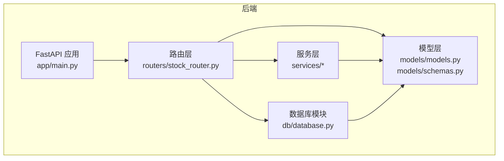
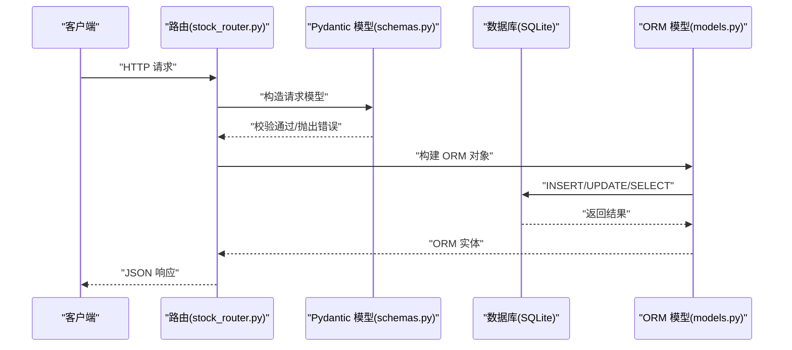
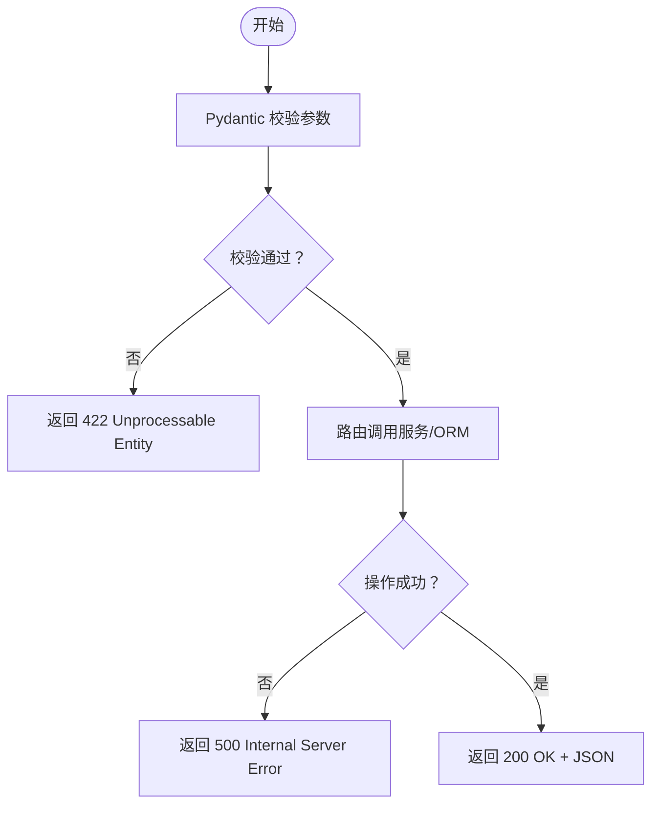
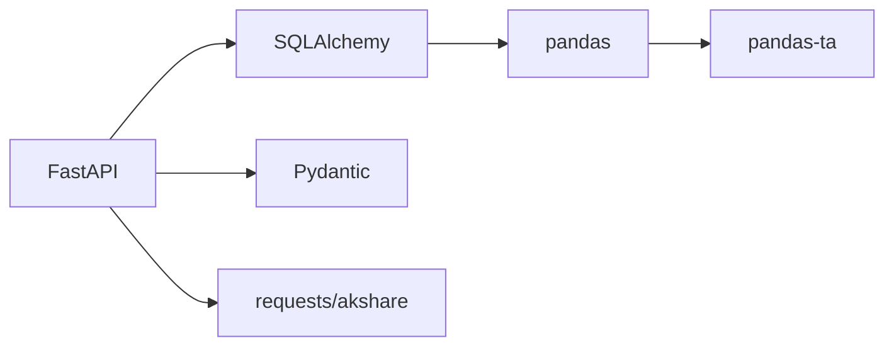

# 数据验证规则

<cite>
**本文引用的文件**
- [backend/app/db/database.py](file://backend/app/db/database.py)
- [backend/app/models/models.py](file://backend/app/models/models.py)
- [backend/app/models/schemas.py](file://backend/app/models/schemas.py)
- [backend/app/routers/stock_router.py](file://backend/app/routers/stock_router.py)
- [backend/app/services/stock_service.py](file://backend/app/services/stock_service.py)
- [backend/app/services/advice_service.py](file://backend/app/services/advice_service.py)
- [backend/app/services/profile_service.py](file://backend/app/services/profile_service.py)
- [backend/requirements.txt](file://backend/requirements.txt)
</cite>

## 目录
1. [简介](#简介)
2. [项目结构](#项目结构)
3. [核心组件](#核心组件)
4. [架构总览](#架构总览)
5. [详细组件分析](#详细组件分析)
6. [依赖分析](#依赖分析)
7. [性能考量](#性能考量)
8. [故障排查指南](#故障排查指南)
9. [结论](#结论)
10. [附录](#附录)

## 简介
本文件系统化梳理 Stock Foker 应用的数据验证规则，覆盖数据库层面的约束（非空、唯一、检查、默认值）、枚举类型业务规则（TimeFrame、TradeType、MarketSentiment）、数据类型选择的技术考量与业务适配性，并总结各层级（Pydantic 模型、SQLAlchemy 表定义、服务层与路由层）的验证实现方式及错误处理机制。目标是帮助开发者与使用者理解数据如何被约束与校验，确保数据完整性与业务一致性。

## 项目结构
后端采用 FastAPI + SQLAlchemy 的分层架构：
- 数据库连接与初始化位于数据库模块
- ORM 模型定义于 models，包含表结构与枚举类型
- Pydantic 模型用于请求/响应序列化与参数校验
- 路由层负责参数接收、异常转换与业务调用
- 服务层封装业务逻辑与外部数据获取

图表来源
- [backend/app/main.py:1-28](file://backend/app/main.py#L1-L28)
- [backend/app/routers/stock_router.py:1-197](file://backend/app/routers/stock_router.py#L1-L197)
- [backend/app/db/database.py:1-24](file://backend/app/db/database.py#L1-L24)
- [backend/app/models/models.py:1-75](file://backend/app/models/models.py#L1-L75)
- [backend/app/models/schemas.py:1-118](file://backend/app/models/schemas.py#L1-L118)

章节来源
- [backend/app/main.py:1-28](file://backend/app/main.py#L1-L28)
- [backend/app/routers/stock_router.py:1-197](file://backend/app/routers/stock_router.py#L1-L197)
- [backend/app/db/database.py:1-24](file://backend/app/db/database.py#L1-L24)

## 核心组件
- 数据库与会话管理：SQLite 引擎、会话工厂、Base 基类、依赖注入 get_db、初始化 create_all
- ORM 模型：FocusStock、TradeRecord、KlineCache 三张表，含主键、自增、索引、默认值、时间戳、唯一约束
- 枚举类型：TimeFrame、TradeType、MarketSentiment，作为 SQLAlchemy Enum 与 Pydantic 字段使用
- Pydantic 模型：请求/响应体，包含字段类型、可选性、默认值与 from_attributes 配置
- 路由层：对输入参数进行类型校验与异常转换，调用服务层并返回标准化响应
- 服务层：数据获取、缓存策略、技术指标计算、画像生成与建议生成

章节来源
- [backend/app/db/database.py:1-24](file://backend/app/db/database.py#L1-L24)
- [backend/app/models/models.py:1-75](file://backend/app/models/models.py#L1-L75)
- [backend/app/models/schemas.py:1-118](file://backend/app/models/schemas.py#L1-L118)
- [backend/app/routers/stock_router.py:1-197](file://backend/app/routers/stock_router.py#L1-L197)

## 架构总览
数据流从客户端请求进入 FastAPI 路由，经 Pydantic 模型进行参数校验，再由 SQLAlchemy ORM 写入数据库；查询时同样遵循相同路径，异常统一转换为 HTTP 异常返回。

图表来源
- [backend/app/routers/stock_router.py:1-197](file://backend/app/routers/stock_router.py#L1-L197)
- [backend/app/models/schemas.py:1-118](file://backend/app/models/schemas.py#L1-L118)
- [backend/app/models/models.py:1-75](file://backend/app/models/models.py#L1-L75)
- [backend/app/db/database.py:1-24](file://backend/app/db/database.py#L1-L24)

## 详细组件分析

### 数据库约束与默认值
- 非空约束
  - 关注股票表：stock_code、stock_name
  - 交易记录表：stock_code、stock_name、trade_type、price、quantity、traded_at
  - K线缓存表：stock_code、period、date、open、close、high、low、volume
- 默认值
  - 关注股票表：time_frame 默认为短周期，is_active 默认 1（激活状态），created_at/updated_at 使用服务器默认时间
  - K线缓存表：turnover 默认 0
- 唯一性约束
  - K线缓存表：stock_code + period + date 组合唯一
- 索引
  - K线缓存表：stock_code 建有索引，便于按股票快速检索
- 时间戳
  - created_at 使用 server_default，updated_at 使用 server_default + onupdate

章节来源
- [backend/app/models/models.py:25-75](file://backend/app/models/models.py#L25-L75)

### 枚举类型与业务规则
- TimeFrame（时间框架）
  - 取值：短、中、长
  - 业务含义：影响分析窗口与建议权重
  - 默认：短周期
- TradeType（交易类型）
  - 取值：买入、卖出
  - 业务含义：区分买卖行为
- MarketSentiment（市场情绪）
  - 取值：乐观、中性、悲观
  - 业务含义：用于画像统计情绪准确率与买卖理由归因
- 在模型与 Pydantic 中均以枚举类型约束，避免非法值进入数据库

章节来源
- [backend/app/models/models.py:8-23](file://backend/app/models/models.py#L8-L23)
- [backend/app/models/schemas.py:8-41](file://backend/app/models/schemas.py#L8-L41)

### 数据类型选择与业务适配
- 字符串类型
  - 股票代码与名称使用 String(n)，限制长度并保证索引效率
- 浮点数类型
  - 价格、成交量、换手率等使用 Float，满足金融数值精度需求
- 整数类型
  - 数量、活跃标记等使用 Integer，布尔语义以 1/0 表示
- 文本类型
  - 备注、原因等使用 Text，支持较长文本
- 日期时间类型
  - DateTime 存储交易时间与创建/更新时间，配合 server_default 与 onupdate
- 唯一约束
  - K线缓存表通过组合唯一约束防止重复写入

章节来源
- [backend/app/models/models.py:25-75](file://backend/app/models/models.py#L25-L75)

### 各层级验证实现方式

#### Pydantic 层（请求/响应模型）
- 类型约束：字段类型与可选性控制输入合法性
- 默认值：未传入时使用模型默认值（如 time_frame）
- from_attributes：允许从 ORM 实体构造响应模型
- 示例路径
  - [FocusStockCreate:8-12](file://backend/app/models/schemas.py#L8-L12)
  - [TradeRecordCreate:30-41](file://backend/app/models/schemas.py#L30-L41)
  - [FocusStockResponse:14-22](file://backend/app/models/schemas.py#L14-L22)
  - [TradeRecordResponse:48-64](file://backend/app/models/schemas.py#L48-L64)

章节来源
- [backend/app/models/schemas.py:1-118](file://backend/app/models/schemas.py#L1-L118)

#### SQLAlchemy 层（表定义与约束）
- 显式约束：nullable、default、UniqueConstraint、Index
- 枚举绑定：SAEnum(TimeFrame/TradeType/MarketSentiment)
- 时间戳：server_default、onupdate
- 示例路径
  - [FocusStock:25-36](file://backend/app/models/models.py#L25-L36)
  - [TradeRecord:38-56](file://backend/app/models/models.py#L38-L56)
  - [KlineCache:58-75](file://backend/app/models/models.py#L58-L75)

章节来源
- [backend/app/models/models.py:1-75](file://backend/app/models/models.py#L1-L75)

#### 路由层（参数接收与异常转换）
- FastAPI 自动校验路径/查询/请求体参数类型
- HTTP 异常转换：运行时错误统一转换为 HTTP 500，资源不存在转换为 404
- 示例路径
  - [搜索股票:70-78](file://backend/app/routers/stock_router.py#L70-L78)
  - [获取K线:82-96](file://backend/app/routers/stock_router.py#L82-L96)
  - [创建交易记录:149-156](file://backend/app/routers/stock_router.py#L149-L156)
  - [更新/删除交易记录:159-184](file://backend/app/routers/stock_router.py#L159-L184)

章节来源
- [backend/app/routers/stock_router.py:1-197](file://backend/app/routers/stock_router.py#L1-L197)

#### 服务层（业务逻辑与外部数据）
- 数据获取与缓存：优先本地缓存，缺失部分增量拉取，失败时回退策略
- 技术指标计算：对数值列进行类型转换与 NaN 处理
- 画像与建议：基于已验证数据进行统计与推断
- 示例路径
  - [K线缓存与远程拉取:131-237](file://backend/app/services/stock_service.py#L131-L237)
  - [技术指标计算:255-326](file://backend/app/services/stock_service.py#L255-L326)
  - [画像生成:6-97](file://backend/app/services/profile_service.py#L6-L97)
  - [买卖建议生成:4-173](file://backend/app/services/advice_service.py#L4-L173)

章节来源
- [backend/app/services/stock_service.py:1-327](file://backend/app/services/stock_service.py#L1-L327)
- [backend/app/services/profile_service.py:1-114](file://backend/app/services/profile_service.py#L1-L114)
- [backend/app/services/advice_service.py:1-193](file://backend/app/services/advice_service.py#L1-L193)

### 错误处理与异常情况
- 参数校验失败：Pydantic 抛出校验错误，FastAPI 返回 422
- 资源不存在：更新/删除交易记录时，若记录不存在返回 404
- 运行时错误：服务层捕获外部接口异常并转换为 500
- 缓存回退：远程拉取失败且存在缓存时返回缓存数据
- 数据不足：技术分析建议在数据不足时返回“持有”信号与提示

图表来源
- [backend/app/routers/stock_router.py:70-96](file://backend/app/routers/stock_router.py#L70-L96)
- [backend/app/services/stock_service.py:240-252](file://backend/app/services/stock_service.py#L240-L252)

章节来源
- [backend/app/routers/stock_router.py:70-96](file://backend/app/routers/stock_router.py#L70-L96)
- [backend/app/services/stock_service.py:240-252](file://backend/app/services/stock_service.py#L240-L252)

### 数据完整性保证措施
- 唯一约束：K线缓存表组合唯一，避免重复写入
- 默认值：关键字段设置合理默认，减少空值风险
- 枚举约束：强制合法取值，避免脏数据
- 时间戳：自动维护创建与更新时间，便于审计与排序
- 缓存一致性：增量写入与盘中更新，保证数据连续性与准确性

章节来源
- [backend/app/models/models.py:58-75](file://backend/app/models/models.py#L58-L75)

## 依赖分析
- FastAPI：提供路由、依赖注入、异常处理
- SQLAlchemy：ORM 映射、约束定义、会话管理
- Pydantic：数据模型、类型校验、序列化
- pandas/pandas-ta：技术指标计算
- akshare/requests：外部数据获取

图表来源
- [backend/requirements.txt:1-10](file://backend/requirements.txt#L1-L10)

章节来源
- [backend/requirements.txt:1-10](file://backend/requirements.txt#L1-L10)

## 性能考量
- 索引优化：K线缓存表 stock_code 建有索引，提升查询性能
- 唯一约束：组合唯一避免重复写入，减少存储冗余
- 缓存策略：本地缓存优先、增量更新，降低远程调用频率
- 类型转换：服务层对数值列进行显式类型转换，避免后续计算误差

章节来源
- [backend/app/models/models.py:66-66](file://backend/app/models/models.py#L66-L66)
- [backend/app/services/stock_service.py:153-237](file://backend/app/services/stock_service.py#L153-L237)

## 故障排查指南
- 参数校验失败（422）：检查请求体字段类型与必填项
- 资源不存在（404）：确认 ID 或查询条件是否正确
- 服务器内部错误（500）：查看服务层异常栈，确认外部接口可用性与网络状况
- 数据不一致：检查唯一约束冲突与缓存更新逻辑
- 性能问题：确认索引使用与查询条件，评估缓存命中率

章节来源
- [backend/app/routers/stock_router.py:70-96](file://backend/app/routers/stock_router.py#L70-L96)
- [backend/app/services/stock_service.py:240-252](file://backend/app/services/stock_service.py#L240-L252)

## 结论
Stock Foker 的数据验证体系通过“Pydantic 类型约束 + SQLAlchemy 表约束 + 路由异常转换 + 服务层缓存与回退”的多层保障，实现了从输入到持久化的全链路数据质量控制。枚举类型与默认值确保了业务语义的一致性，唯一约束与索引提升了数据完整性与查询性能。建议在新增字段时同步完善模型与约束定义，并持续监控缓存命中率与外部接口稳定性。

## 附录
- 关键实现路径参考
  - [数据库初始化与会话:22-24](file://backend/app/db/database.py#L22-L24)
  - [关注股票模型:25-36](file://backend/app/models/models.py#L25-L36)
  - [交易记录模型:38-56](file://backend/app/models/models.py#L38-L56)
  - [K线缓存模型:58-75](file://backend/app/models/models.py#L58-L75)
  - [关注股票请求模型:8-12](file://backend/app/models/schemas.py#L8-L12)
  - [交易记录请求模型:30-41](file://backend/app/models/schemas.py#L30-L41)
  - [路由异常处理:70-96](file://backend/app/routers/stock_router.py#L70-L96)
  - [K线缓存与远程拉取:131-237](file://backend/app/services/stock_service.py#L131-L237)
  - [技术指标计算:255-326](file://backend/app/services/stock_service.py#L255-L326)
  - [画像生成:6-97](file://backend/app/services/profile_service.py#L6-L97)
  - [买卖建议生成:4-173](file://backend/app/services/advice_service.py#L4-L173)