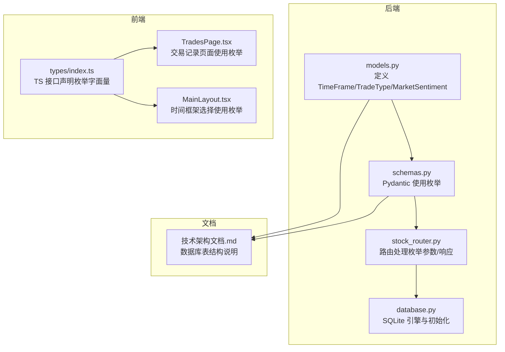
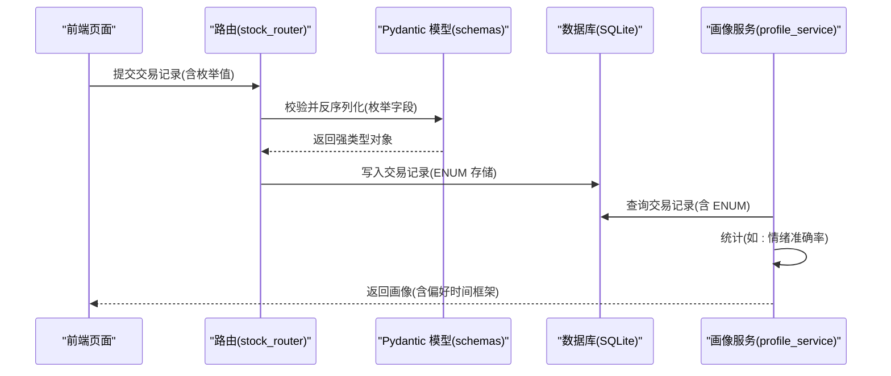
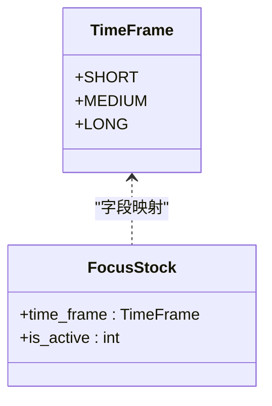
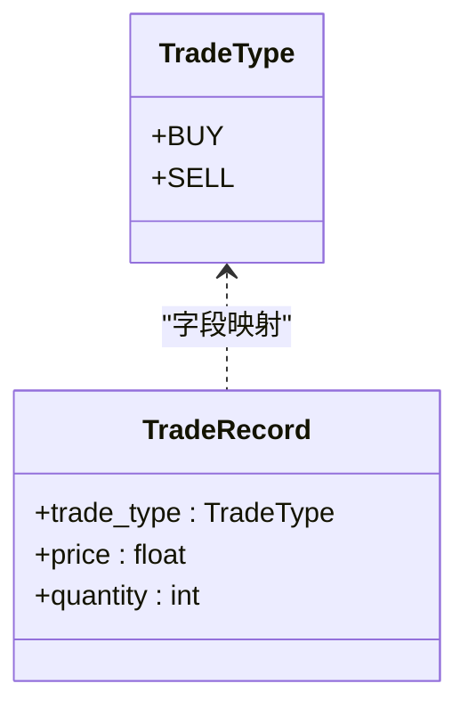
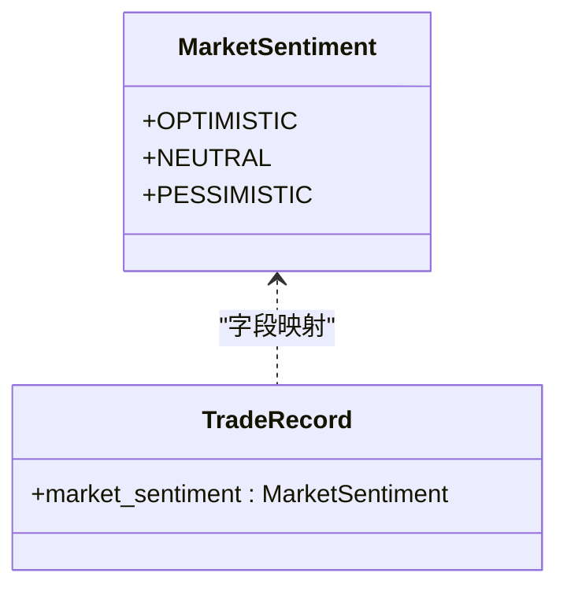
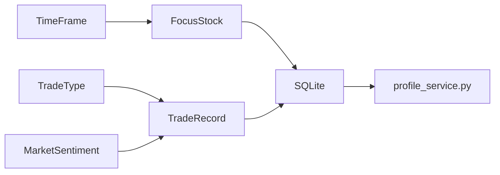

# 枚举类型定义

<cite>
**本文引用的文件**
- [models.py](file://backend/app/models/models.py)
- [schemas.py](file://backend/app/models/schemas.py)
- [stock_router.py](file://backend/app/routers/stock_router.py)
- [database.py](file://backend/app/db/database.py)
- [index.ts](file://frontend/src/types/index.ts)
- [TradesPage.tsx](file://frontend/src/pages/TradesPage.tsx)
- [MainLayout.tsx](file://frontend/src/components/MainLayout.tsx)
- [profile_service.py](file://backend/app/services/profile_service.py)
- [技术架构文档.md](file://doc/技术架构文档.md)
</cite>

## 目录
1. [简介](#简介)
2. [项目结构](#项目结构)
3. [核心组件](#核心组件)
4. [架构总览](#架构总览)
5. [详细组件分析](#详细组件分析)
6. [依赖分析](#依赖分析)
7. [性能考量](#性能考量)
8. [故障排查指南](#故障排查指南)
9. [结论](#结论)
10. [附录](#附录)

## 简介
本文件系统化梳理 Stock Foker 应用中的三类核心枚举类型：TimeFrame（时间框架）、TradeType（交易类型）、MarketSentiment（市场情绪），涵盖其设计意图、业务语义、数据库存储方式、查询优化、前后端展示与交互、扩展与兼容性策略，以及变更迁移的影响评估与最佳实践。

## 项目结构
围绕枚举类型的关键文件分布如下：
- 后端模型层：定义 Python 枚举并在 SQLAlchemy 中映射为数据库 ENUM 类型
- 后端序列化层：Pydantic 模型中使用枚举作为字段类型
- 后端路由层：接收/返回枚举值，驱动业务流程
- 前端类型层：TS 接口声明枚举值字面量
- 前端页面层：基于枚举值进行 UI 展示与交互
- 文档层：数据库表结构说明中体现枚举存储形态

图表来源
- [models.py:1-75](file://backend/app/models/models.py#L1-L75)
- [schemas.py:1-118](file://backend/app/models/schemas.py#L1-L118)
- [stock_router.py:1-197](file://backend/app/routers/stock_router.py#L1-L197)
- [database.py:1-24](file://backend/app/db/database.py#L1-L24)
- [index.ts:1-94](file://frontend/src/types/index.ts#L1-L94)
- [TradesPage.tsx:1-260](file://frontend/src/pages/TradesPage.tsx#L1-L260)
- [MainLayout.tsx:1-281](file://frontend/src/components/MainLayout.tsx#L1-L281)
- [技术架构文档.md:69-117](file://doc/技术架构文档.md#L69-L117)

章节来源
- [models.py:1-75](file://backend/app/models/models.py#L1-L75)
- [schemas.py:1-118](file://backend/app/models/schemas.py#L1-L118)
- [stock_router.py:1-197](file://backend/app/routers/stock_router.py#L1-L197)
- [database.py:1-24](file://backend/app/db/database.py#L1-L24)
- [index.ts:1-94](file://frontend/src/types/index.ts#L1-L94)
- [TradesPage.tsx:1-260](file://frontend/src/pages/TradesPage.tsx#L1-L260)
- [MainLayout.tsx:1-281](file://frontend/src/components/MainLayout.tsx#L1-L281)
- [技术架构文档.md:69-117](file://doc/技术架构文档.md#L69-L117)

## 核心组件
本节对三个枚举类型进行逐项说明，包括定义、业务含义、默认值、数据库映射、序列化与前端展示。

- TimeFrame（时间框架）
  - 定义：短、中、长三档
  - 默认值：短
  - 数据库映射：SQLAlchemy Enum 映射为字符串枚举
  - 业务用途：决定分析窗口与持有周期偏好；用于生成炒股画像中的“偏好时间框架”
  - 前端展示：下拉选择“短线/中线/长线”，与后端值一一对应

- TradeType（交易类型）
  - 定义：买入、卖出
  - 默认值：无（必填）
  - 数据库映射：SQLAlchemy Enum
  - 业务用途：记录交易方向；用于交易记录表与 UI 标签颜色区分
  - 前端展示：下拉选择“买入/卖出”，表格列渲染为彩色标签

- MarketSentiment（市场情绪）
  - 定义：乐观、中性、悲观
  - 默认值：可空
  - 数据库映射：SQLAlchemy Enum
  - 业务用途：记录交易时的主观市场判断；用于炒股画像中的“情绪准确率”计算
  - 前端展示：下拉选择“乐观/中性/悲观”，表格列渲染为彩色标签

章节来源
- [models.py:8-23](file://backend/app/models/models.py#L8-L23)
- [schemas.py:8-64](file://backend/app/models/schemas.py#L8-L64)
- [stock_router.py:27-53](file://backend/app/routers/stock_router.py#L27-L53)
- [index.ts:1-94](file://frontend/src/types/index.ts#L1-L94)
- [TradesPage.tsx:207-231](file://frontend/src/pages/TradesPage.tsx#L207-L231)
- [MainLayout.tsx:35-39](file://frontend/src/components/MainLayout.tsx#L35-L39)
- [技术架构文档.md:69-117](file://doc/技术架构文档.md#L69-L117)

## 架构总览
下图展示枚举类型在系统中的流转路径：从前端输入，经路由与序列化，持久化到数据库，再在画像服务中被消费与统计。

图表来源
- [stock_router.py:149-173](file://backend/app/routers/stock_router.py#L149-L173)
- [schemas.py:30-64](file://backend/app/models/schemas.py#L30-L64)
- [models.py:38-56](file://backend/app/models/models.py#L38-L56)
- [profile_service.py:42-97](file://backend/app/services/profile_service.py#L42-L97)

## 详细组件分析

### TimeFrame（时间框架）
- 设计要点
  - 采用字符串枚举，便于数据库存储为文本且可读性强
  - 默认值为“短”，确保新关注股票具备初始分析维度
- 数据库映射
  - 在模型中以 SQLAlchemy Enum 映射，对应数据库表结构中的 ENUM 字段
- 业务用途
  - 作为分析窗口与持有周期参考，参与画像计算中的“偏好时间框架”
- 前端交互
  - 下拉选择“短线/中线/长线”，与后端值一致
- 扩展与兼容
  - 新增枚举值需同步修改后端模型、序列化、路由与前端选项，并保证数据库迁移策略

图表来源
- [models.py:8-35](file://backend/app/models/models.py#L8-L35)

章节来源
- [models.py:8-35](file://backend/app/models/models.py#L8-L35)
- [schemas.py:8-27](file://backend/app/models/schemas.py#L8-L27)
- [stock_router.py:27-53](file://backend/app/routers/stock_router.py#L27-L53)
- [MainLayout.tsx:35-39](file://frontend/src/components/MainLayout.tsx#L35-L39)
- [技术架构文档.md:69-81](file://doc/技术架构文档.md#L69-L81)

### TradeType（交易类型）
- 设计要点
  - 二值枚举，简洁明确，便于 UI 标签与逻辑分支处理
- 数据库映射
  - 映射为 ENUM，约束取值范围
- 业务用途
  - 记录交易方向，支撑盈亏计算与统计
- 前端交互
  - 下拉选择“买入/卖出”，表格列渲染为红色/绿色标签

图表来源
- [models.py:14-49](file://backend/app/models/models.py#L14-L49)

章节来源
- [models.py:14-49](file://backend/app/models/models.py#L14-L49)
- [schemas.py:30-64](file://backend/app/models/schemas.py#L30-L64)
- [TradesPage.tsx:207-209](file://frontend/src/pages/TradesPage.tsx#L207-L209)

### MarketSentiment（市场情绪）
- 设计要点
  - 三值枚举，支持主观判断记录与后续统计
- 数据库映射
  - 映射为 ENUM，允许为空
- 业务用途
  - 用于画像统计“情绪准确率”，辅助交易决策回顾
- 前端交互
  - 下拉选择“乐观/中性/悲观”，表格列渲染为彩色标签

图表来源
- [models.py:19-49](file://backend/app/models/models.py#L19-L49)

章节来源
- [models.py:19-49](file://backend/app/models/models.py#L19-L49)
- [schemas.py:30-64](file://backend/app/models/schemas.py#L30-L64)
- [TradesPage.tsx:222-231](file://frontend/src/pages/TradesPage.tsx#L222-L231)
- [profile_service.py:42-71](file://backend/app/services/profile_service.py#L42-L71)

## 依赖分析
- 后端依赖链
  - 模型层定义枚举并映射到数据库
  - 序列化层使用枚举作为 Pydantic 字段类型
  - 路由层接收/返回枚举值，驱动业务逻辑
  - 画像服务从数据库读取枚举值并进行统计
- 前端依赖链
  - TS 接口声明枚举字面量
  - 页面组件使用枚举进行表单与展示
- 外部依赖
  - SQLite 作为存储引擎，支持 ENUM 字段

图表来源
- [models.py:25-56](file://backend/app/models/models.py#L25-L56)
- [schemas.py:8-64](file://backend/app/models/schemas.py#L8-L64)
- [stock_router.py:136-173](file://backend/app/routers/stock_router.py#L136-L173)
- [profile_service.py:42-97](file://backend/app/services/profile_service.py#L42-L97)

章节来源
- [models.py:1-75](file://backend/app/models/models.py#L1-L75)
- [schemas.py:1-118](file://backend/app/models/schemas.py#L1-L118)
- [stock_router.py:1-197](file://backend/app/routers/stock_router.py#L1-L197)
- [profile_service.py:42-97](file://backend/app/services/profile_service.py#L42-L97)

## 性能考量
- 数据库存储
  - 使用 SQLAlchemy Enum 将枚举值以字符串形式存储，占用空间小，查询效率高
  - 建议在涉及枚举字段的查询上建立合适的索引（如交易记录表的 stock_code、traded_at 等）
- 序列化与传输
  - Pydantic 对枚举字段进行严格校验，减少无效数据进入数据库
  - 前端 TS 接口限制枚举值集合，避免非法值进入后端
- 统计与画像
  - 画像服务对枚举字段进行聚合统计，注意批量查询与分页，避免一次性加载过多记录

[本节为通用性能建议，不直接分析具体文件]

## 故障排查指南
- 枚举值不合法
  - 症状：提交交易记录时报错或保存失败
  - 排查：检查前端选择的枚举值是否在允许集合内；后端 Pydantic 是否正确校验
- 枚举字段为空导致统计异常
  - 症状：画像中“情绪准确率”显示为 0 或异常
  - 排查：确认数据库中该字段是否为空；画像服务是否正确过滤空值
- 前后端枚举不一致
  - 症状：UI 显示与数据库存储不一致
  - 排查：核对前后端枚举值集合是否一致；迁移脚本是否同步更新

章节来源
- [TradesPage.tsx:207-231](file://frontend/src/pages/TradesPage.tsx#L207-L231)
- [schemas.py:30-64](file://backend/app/models/schemas.py#L30-L64)
- [profile_service.py:42-71](file://backend/app/services/profile_service.py#L42-L71)

## 结论
TimeFrame、TradeType、MarketSentiment 三类枚举在 Stock Foker 中承担了统一业务语义、保障数据质量与提升用户体验的关键角色。通过前后端一致的枚举定义、严格的序列化校验与合理的数据库映射，系统实现了稳定的业务闭环。未来扩展与变更应遵循统一的迁移策略与兼容性原则，确保数据一致性与功能连续性。

[本节为总结性内容，不直接分析具体文件]

## 附录

### 数据库存储与查询优化
- 存储方式
  - 枚举值以字符串形式存储于数据库 ENUM 字段
  - 对应表结构详见数据库设计文档
- 查询优化建议
  - 为常用过滤字段（如 stock_code、traded_at）建立索引
  - 在画像统计中使用分组与聚合，避免全表扫描
  - 对枚举字段的统计查询尽量限定时间范围

章节来源
- [技术架构文档.md:69-117](file://doc/技术架构文档.md#L69-L117)
- [models.py:25-56](file://backend/app/models/models.py#L25-L56)

### 前端展示与用户交互
- 交易记录页面
  - 交易类型列：根据值渲染为红色/绿色标签
  - 市场情绪列：根据值渲染为彩色标签
- 主布局
  - 时间框架下拉：提供“短线/中线/长线”选项
- 交互要点
  - 保持前后端枚举值集合一致
  - 对可空枚举字段提供“清空/默认”能力

章节来源
- [TradesPage.tsx:106-126](file://frontend/src/pages/TradesPage.tsx#L106-L126)
- [MainLayout.tsx:258-266](file://frontend/src/components/MainLayout.tsx#L258-L266)
- [index.ts:5-6](file://frontend/src/types/index.ts#L5-L6)

### 枚举扩展与向后兼容
- 扩展步骤
  - 后端：新增枚举值，更新模型与序列化
  - 前端：同步 TS 接口与 UI 选项
  - 路由：确保参数与响应体兼容
  - 数据库：执行迁移脚本，保证存量数据安全
- 兼容性策略
  - 保留旧值，避免破坏既有统计与展示
  - 对可空枚举字段提供默认回退逻辑
  - 在画像服务中对未知值进行安全处理

章节来源
- [models.py:8-23](file://backend/app/models/models.py#L8-L23)
- [schemas.py:8-64](file://backend/app/models/schemas.py#L8-L64)
- [index.ts:1-94](file://frontend/src/types/index.ts#L1-L94)

### 枚举变更迁移策略与影响评估
- 迁移策略
  - 预留过渡期：先在后端接受新旧值，逐步引导前端更新
  - 数据库迁移：使用 ALTER TABLE 添加新枚举值，必要时重建 ENUM
  - 影响评估：统计受影响的报表与画像指标，验证准确性
- 影响评估
  - 交易记录：新增枚举值不影响现有记录
  - 图像统计：新增值需纳入统计逻辑，避免偏差
  - 用户界面：确保 UI 选项与后端一致，避免误导

章节来源
- [stock_router.py:149-173](file://backend/app/routers/stock_router.py#L149-L173)
- [profile_service.py:42-97](file://backend/app/services/profile_service.py#L42-L97)