# 数据源服务增强

<cite>
**本文档引用的文件**
- [backend/app/main.py](file://backend/app/main.py)
- [backend/app/services/data_source_service.py](file://backend/app/services/data_source_service.py)
- [backend/app/routers/data_source_router.py](file://backend/app/routers/data_source_router.py)
- [backend/app/services/data_fetcher.py](file://backend/app/services/data_fetcher.py)
- [backend/app/models/models.py](file://backend/app/models/models.py)
- [backend/app/db/database.py](file://backend/app/db/database.py)
- [frontend/src/hooks/useDataSource.ts](file://frontend/src/hooks/useDataSource.ts)
- [frontend/src/services/api.ts](file://frontend/src/services/api.ts)
- [doc/产品设计文档.md](file://doc/产品设计文档.md)
- [doc/迭代记录/2026-04-15-agent-perf-optimization.md](file://doc/迭代记录/2026-04-15-agent-perf-optimization.md)
- [backend/app/agents/sentiment_agent.py](file://backend/app/agents/sentiment_agent.py)
- [backend/app/agents/sector_agent.py](file://backend/app/agents/sector_agent.py)
- [frontend/src/pages/SentimentPage.tsx](file://frontend/src/pages/SentimentPage.tsx)
- [frontend/src/pages/MacroPage.tsx](file://frontend/src/pages/MacroPage.tsx)
- [frontend/src/pages/SectorPage.tsx](file://frontend/src/pages/SectorPage.tsx)
</cite>

## 更新摘要
**变更内容**
- 新增问财API熔断机制章节，详细说明熔断状态管理和异常处理
- 更新三级缓存降级策略，包含当日缓存、API调用、历史缓存回退三层机制
- 新增并行数据获取优化章节，介绍统一并行接口和性能提升
- 完善空数据检测机制，统一处理多种空数据格式
- 更新Agent性能优化章节，包含Sentiment和Sector Agent的具体改进

## 目录
1. [简介](#简介)
2. [项目结构](#项目结构)
3. [核心组件](#核心组件)
4. [架构概览](#架构概览)
5. [详细组件分析](#详细组件分析)
6. [问财API熔断机制](#问财api熔断机制)
7. [三级缓存降级策略](#三级缓存降级策略)
8. [并行数据获取优化](#并行数据获取优化)
9. [空数据检测机制](#空数据检测机制)
10. [Agent性能优化](#agent性能优化)
11. [依赖关系分析](#依赖关系分析)
12. [性能考虑](#性能考虑)
13. [故障排除指南](#故障排除指南)
14. [结论](#结论)

## 简介

数据源服务增强项目是对 Stock Foker 股票分析应用的重要升级，专注于提供独立、可靠的数据源获取和缓存服务。该项目实现了完整的数据源管理系统，包括多种数据类型的统一获取、智能缓存策略、并行处理机制以及前后端协同的数据管理。

**更新** 本次重大更新引入了问财API熔断机制、三级缓存降级策略、并行数据获取优化等核心改进，显著提升了系统的稳定性、性能和用户体验。

该系统的核心目标是为上层 Agent 模块提供稳定、高效的数据基础，支持消息面、板块联动、宏观环境等多个维度的数据分析需求。通过独立的数据源服务，系统实现了数据获取与业务逻辑的解耦，提高了系统的可维护性和扩展性。

## 项目结构

项目采用典型的前后端分离架构，后端使用 Python FastAPI 框架，前端使用 React + TypeScript 技术栈。

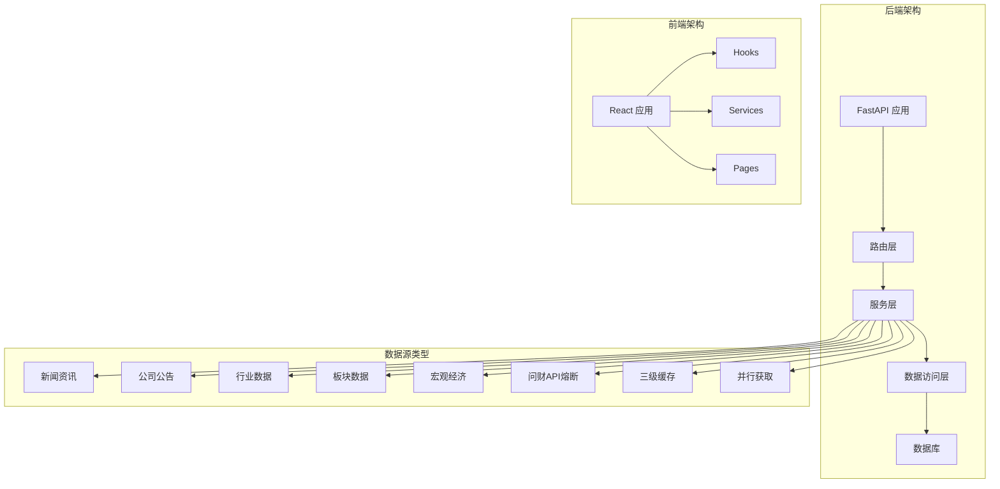

**图表来源**
- [backend/app/main.py:32-68](file://backend/app/main.py#L32-L68)
- [backend/app/services/data_source_service.py:130-169](file://backend/app/services/data_source_service.py#L130-L169)
- [frontend/src/hooks/useDataSource.ts:82-169](file://frontend/src/hooks/useDataSource.ts#L82-L169)

**章节来源**
- [backend/app/main.py:1-74](file://backend/app/main.py#L1-L74)
- [doc/产品设计文档.md:201-225](file://doc/产品设计文档.md#L201-L225)

## 核心组件

### 数据源服务架构

数据源服务采用模块化设计，包含三个核心层次：

1. **路由层**：处理 HTTP 请求和响应
2. **服务层**：实现业务逻辑和数据缓存管理
3. **数据获取层**：封装各种数据源的获取方法

### 支持的数据源类型

系统目前支持 16 种不同类型的数据源，涵盖股票分析的各个维度：

| 数据源类型 | 描述 | 是否需要股票名称 |
|-----------|------|-----------------|
| hithink_news | 同花顺财经资讯 | 是 |
| announcements | 公司公告 | 是 |
| industry_valuation | 行业估值数据 | 是 |
| market_data | 市场资金流向 | 是 |
| industry_finance | 行业财务概况 | 是 |
| industry_peers | 行业同行对比 | 是 |
| hithink_index | 主要指数行情 | 否 |
| reports | 研究报告 | 是 |
| basicinfo | 基本资料 | 是 |
| business | 经营数据 | 是 |
| shareholders | 股东股本信息 | 是 |
| concept_boards | 概念板块详情 | 是 |
| north_flow | 北向资金流向 | 否 |
| market_overview | 市场涨跌概况 | 否 |
| hithink_macro | 宏观经济指标 | 否 |
| hithink_events | 个股重要事件 | 是 |
| stock_news | 个股相关新闻 | 是 |

**更新** 新增stock_news缓存注册，完善了缓存体系的覆盖范围。

**章节来源**
- [backend/app/services/data_source_service.py:44-61](file://backend/app/services/data_source_service.py#L44-L61)
- [backend/app/services/data_fetcher.py:128-358](file://backend/app/services/data_fetcher.py#L128-L358)

## 架构概览

数据源服务采用分层架构设计，确保了良好的可维护性和扩展性。

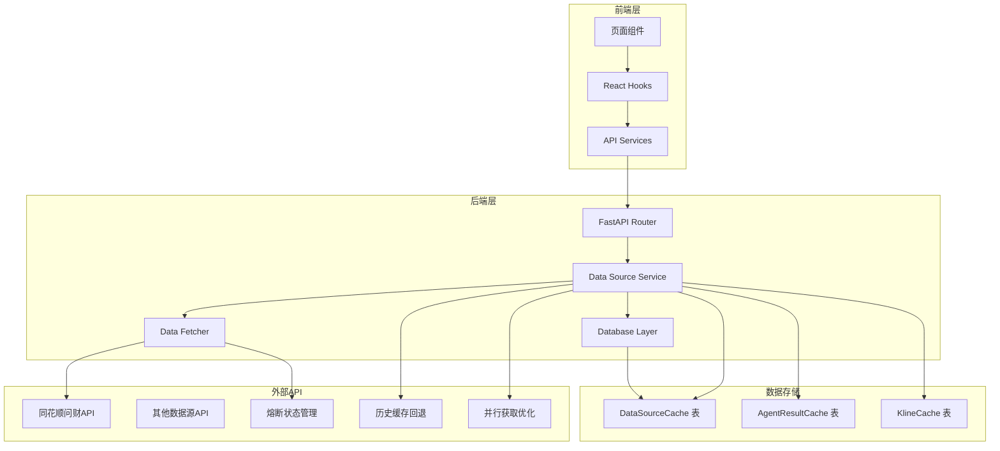

**图表来源**
- [backend/app/routers/data_source_router.py:19-68](file://backend/app/routers/data_source_router.py#L19-L68)
- [backend/app/services/data_source_service.py:130-169](file://backend/app/services/data_source_service.py#L130-L169)
- [backend/app/models/models.py:118-131](file://backend/app/models/models.py#L118-L131)

## 详细组件分析

### 数据源服务核心实现

数据源服务是整个系统的核心组件，负责管理所有数据源的获取、缓存和分发。

#### 缓存策略设计

系统实现了双重缓存机制：

1. **数据库缓存**：持久化存储，支持跨会话的数据共享
2. **前端内存缓存**：临时存储，提高页面间的响应速度

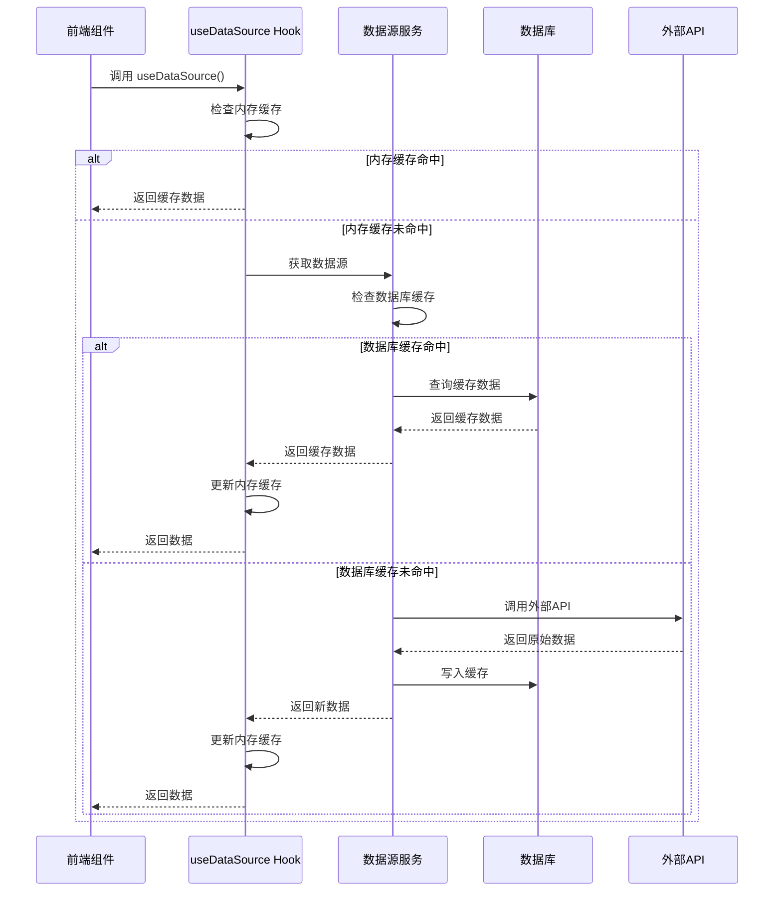

**图表来源**
- [frontend/src/hooks/useDataSource.ts:108-139](file://frontend/src/hooks/useDataSource.ts#L108-L139)
- [backend/app/services/data_source_service.py:130-159](file://backend/app/services/data_source_service.py#L130-L159)

#### 数据获取流程

数据获取采用延迟加载和并行处理策略：

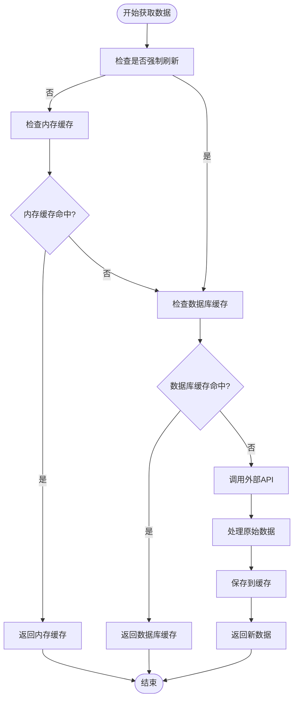

**图表来源**
- [backend/app/services/data_source_service.py:130-159](file://backend/app/services/data_source_service.py#L130-L159)
- [frontend/src/hooks/useDataSource.ts:108-139](file://frontend/src/hooks/useDataSource.ts#L108-L139)

**章节来源**
- [backend/app/services/data_source_service.py:130-169](file://backend/app/services/data_source_service.py#L130-L169)
- [frontend/src/hooks/useDataSource.ts:82-169](file://frontend/src/hooks/useDataSource.ts#L82-L169)

### 数据获取器实现

数据获取器封装了与外部 API 的交互逻辑，提供了统一的接口来获取不同类型的数据。

#### API 调用抽象

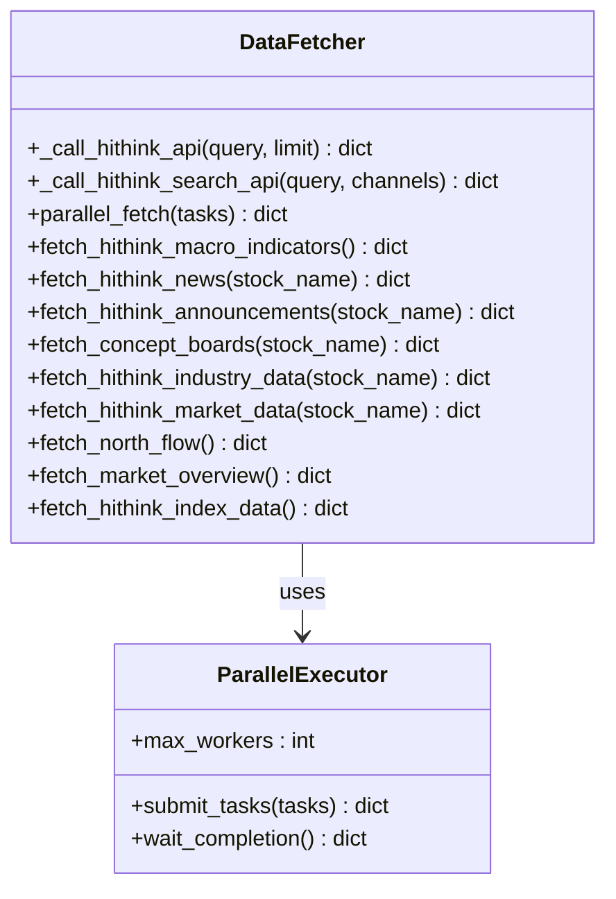

**图表来源**
- [backend/app/services/data_fetcher.py:24-125](file://backend/app/services/data_fetcher.py#L24-L125)
- [backend/app/services/data_fetcher.py:106-125](file://backend/app/services/data_fetcher.py#L106-L125)

#### 并行处理机制

系统采用 ThreadPoolExecutor 实现并行数据获取，提高了整体响应性能：

| 组件 | 功能描述 | 并行度限制 |
|------|----------|-----------|
| 概念板块查询 | 并行获取多个概念板块详情 | 最多 8 个并发 |
| 批量搜索任务 | 并行执行多个搜索查询 | 动态调整并发数 |
| API 调用 | 统一的 HTTP 请求处理 | 最多 8 个并发 |

**章节来源**
- [backend/app/services/data_fetcher.py:106-125](file://backend/app/services/data_fetcher.py#L106-L125)
- [backend/app/services/data_fetcher.py:24-64](file://backend/app/services/data_fetcher.py#L24-L64)

### 前端数据管理

前端实现了完整的数据管理机制，包括缓存、状态管理和错误处理。

#### Hook 设计模式

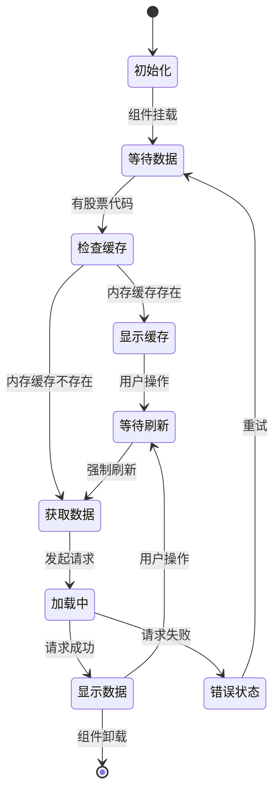

**图表来源**
- [frontend/src/hooks/useDataSource.ts:108-165](file://frontend/src/hooks/useDataSource.ts#L108-L165)

#### 缓存管理策略

前端实现了智能的缓存管理机制：

| 缓存类型 | 存储位置 | 生命周期 | 容量限制 |
|----------|----------|----------|----------|
| 内存缓存 | Map 对象 | 9:00 AM 边界 | 240 条记录 |
| 本地存储 | localStorage | 永久存储 | 无限制 |
| 会话缓存 | 组件状态 | 组件生命周期 | 无限制 |

**章节来源**
- [frontend/src/hooks/useDataSource.ts:23-78](file://frontend/src/hooks/useDataSource.ts#L23-L78)
- [frontend/src/hooks/useDataSource.ts:108-165](file://frontend/src/hooks/useDataSource.ts#L108-L165)

## 问财API熔断机制

**新增** 问财API熔断机制是本次更新的核心改进之一，旨在解决API额度耗尽导致的系统性超时问题。

### 熔断状态管理

系统实现了全局熔断状态管理，通过以下机制防止API超时：

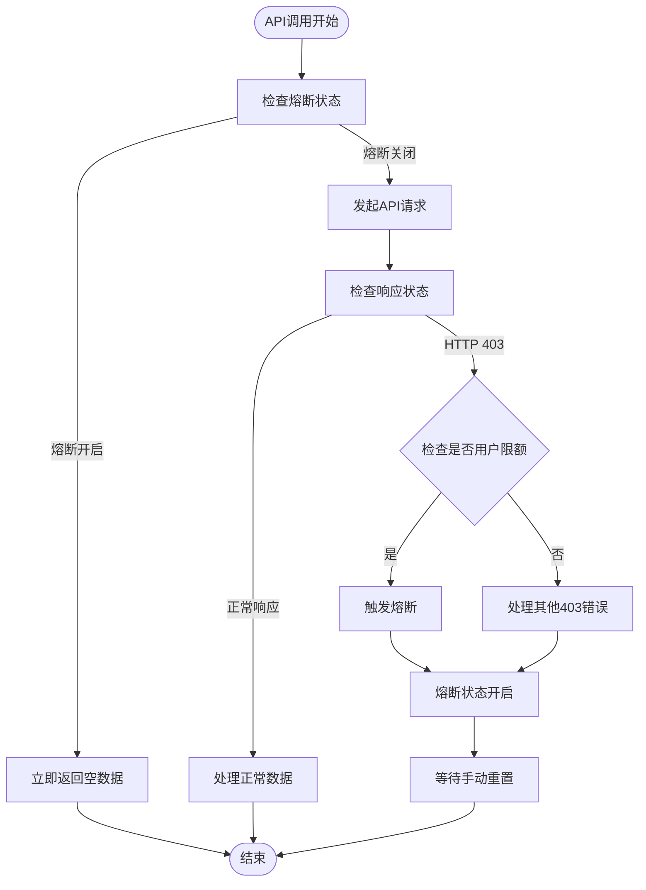

**图表来源**
- [backend/app/services/data_fetcher.py:31-65](file://backend/app/services/data_fetcher.py#L31-L65)

### 熔断检测逻辑

熔断机制通过以下方式检测问财API额度耗尽：

1. **HTTP 403检测**：识别用户限额错误
2. **错误内容解析**：检查响应体中的"user limit"关键词
3. **状态记录**：记录熔断原因和时间
4. **自动跳过**：熔断期间跳过所有后续API调用

### 熔断状态接口

系统提供了完整的熔断状态管理接口：

| 接口 | 功能 | 参数 | 返回值 |
|------|------|------|--------|
| `_check_iwencai_403()` | 检测403错误并触发熔断 | Exception | bool（是否为403错误） |
| `get_iwencai_status()` | 获取熔断状态 | 无 | dict（包含available和reason） |
| `reset_iwencai_circuit()` | 重置熔断状态 | 无 | 无 |

**章节来源**
- [backend/app/services/data_fetcher.py:31-65](file://backend/app/services/data_fetcher.py#L31-L65)

## 三级缓存降级策略

**新增** 三级缓存降级策略是本次更新的另一项重大改进，提供了更加稳健的数据获取机制。

### 降级策略架构

系统实现了三层缓存降级策略，确保在任何情况下都能提供有效的数据：

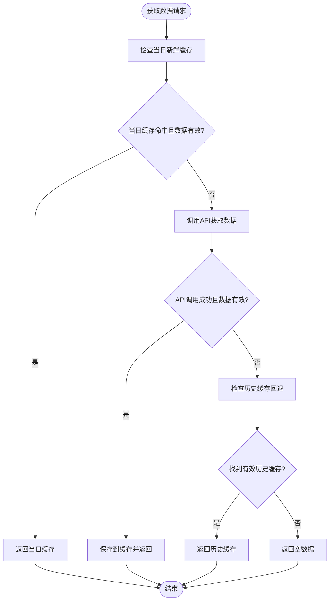

**图表来源**
- [backend/app/services/data_source_service.py:163-212](file://backend/app/services/data_source_service.py#L163-L212)

### 缓存层级详解

#### 当日新鲜缓存
- **检查条件**：`created_at >= _last_9am()`
- **数据有效性**：通过`_is_empty_data()`检查
- **优先级**：最高，直接返回

#### API实时调用
- **触发条件**：当日缓存未命中或数据为空
- **熔断处理**：熔断状态下立即返回空数据
- **数据保存**：成功获取的有效数据保存到缓存

#### 历史缓存回退
- **触发条件**：API返回空数据
- **查找策略**：最多扫描5条最近记录
- **过滤规则**：跳过空数据记录

**章节来源**
- [backend/app/services/data_source_service.py:163-212](file://backend/app/services/data_source_service.py#L163-L212)

## 并行数据获取优化

**新增** 并行数据获取优化统一了数据源获取接口，显著提升了系统性能。

### 统一并行接口

系统新增了`parallel_get_data_sources()`接口，提供统一的并行数据获取能力：

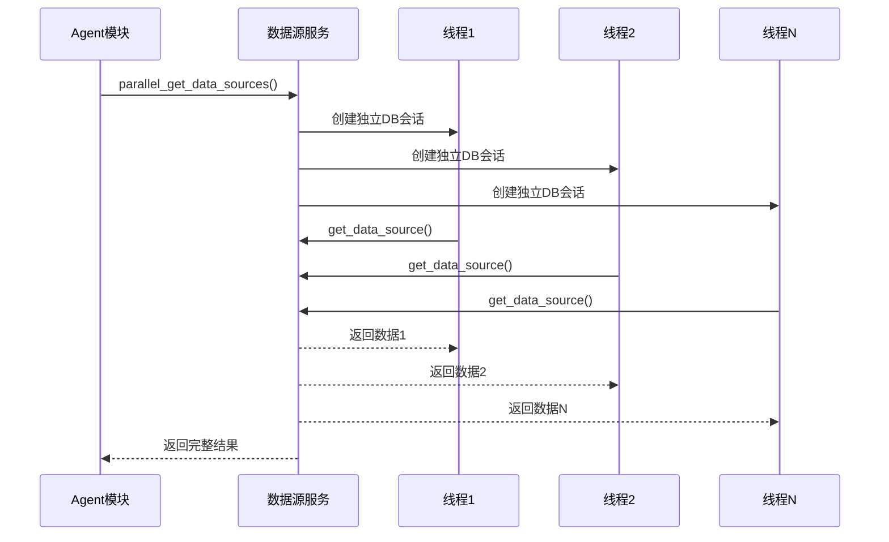

**图表来源**
- [backend/app/services/data_source_service.py:224-256](file://backend/app/services/data_source_service.py#L224-L256)

### 并行执行策略

#### 线程隔离
- **独立DB会话**：每个线程创建独立的数据库会话
- **异常隔离**：单个线程异常不影响其他线程
- **资源管理**：自动管理线程生命周期

#### 并发控制
- **最大并发数**：限制为8个线程
- **动态调整**：根据数据源数量动态调整
- **超时处理**：每个线程独立超时控制

### Agent集成优化

#### Sentiment Agent优化
- **统一并行获取**：8个数据源全部通过`parallel_get_data_sources`获取
- **去重优化**：`events_data`复用缓存`hithink_events`
- **性能提升**：从44秒优化到20.9秒

#### Sector Agent优化
- **缓存数据源并行**：4个缓存数据源统一并行获取
- **混合策略**：非缓存数据源仍使用`parallel_fetch`

**章节来源**
- [backend/app/services/data_source_service.py:224-256](file://backend/app/services/data_source_service.py#L224-L256)
- [backend/app/agents/sentiment_agent.py:33-52](file://backend/app/agents/sentiment_agent.py#L33-L52)
- [backend/app/agents/sector_agent.py:35-45](file://backend/app/agents/sector_agent.py#L35-L45)

## 空数据检测机制

**新增** 空数据检测机制统一了对不同格式空数据的判断逻辑。

### 统一空数据判断

系统实现了`_is_empty_data()`函数，统一处理以下空数据格式：

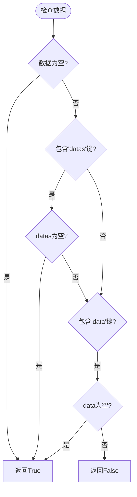

**图表来源**
- [backend/app/services/data_source_service.py:150-160](file://backend/app/services/data_source_service.py#L150-L160)

### 支持的空数据格式

| 数据格式 | 判断逻辑 | 示例 |
|----------|----------|------|
| `{}` | 空字典 | `{}` |
| `{"datas": []}` | datas为空数组 | `{"datas": []}` |
| `{"data": []}` | data为空数组 | `{"data": []}` |

### 空数据处理策略

1. **缓存检查**：当日缓存命中但数据为空时，继续降级处理
2. **历史回退**：API返回空数据时自动回退到历史缓存
3. **异常隔离**：空数据不会影响其他数据源的获取

**章节来源**
- [backend/app/services/data_source_service.py:150-160](file://backend/app/services/data_source_service.py#L150-L160)

## Agent性能优化

**更新** Agent性能优化章节反映了本次更新对Sentiment和Sector Agent的具体改进。

### Sentiment Agent优化

#### 性能提升
- **优化前**：44秒（8个数据源串行调用）
- **优化后**：20.9秒（统一并行获取）
- **提升幅度**：53%

#### 优化措施
1. **统一并行接口**：8个数据源全部通过`parallel_get_data_sources`获取
2. **去重优化**：`events_data`不再重复调用，复用缓存`hithink_events`
3. **缓存注册**：新增`stock_news`缓存注册，减少重复调用

### Sector Agent优化

#### 性能现状
- **优化前**：9.8秒
- **优化后**：11.7秒（受问财403干扰）
- **性能变化**：基本持平

#### 优化措施
1. **缓存数据源并行**：4个缓存数据源统一并行获取
2. **混合策略**：非缓存数据源仍使用`parallel_fetch`

### 性能对比

| Agent | 优化前（无缓存） | 优化后（无缓存） | 提升 |
|-------|------------------|------------------|------|
| Sentiment | 44.0s | 20.9s | -53% |
| Sector | 9.8s | 11.7s | 持平（403干扰） |
| Macro | 8.9s | 未改动 | - |

**章节来源**
- [doc/迭代记录/2026-04-15-agent-perf-optimization.md:39-45](file://doc/迭代记录/2026-04-15-agent-perf-optimization.md#L39-L45)
- [backend/app/agents/sentiment_agent.py:33-52](file://backend/app/agents/sentiment_agent.py#L33-L52)
- [backend/app/agents/sector_agent.py:35-45](file://backend/app/agents/sector_agent.py#L35-L45)

## 依赖关系分析

系统采用了清晰的依赖层次结构，确保了模块间的松耦合。

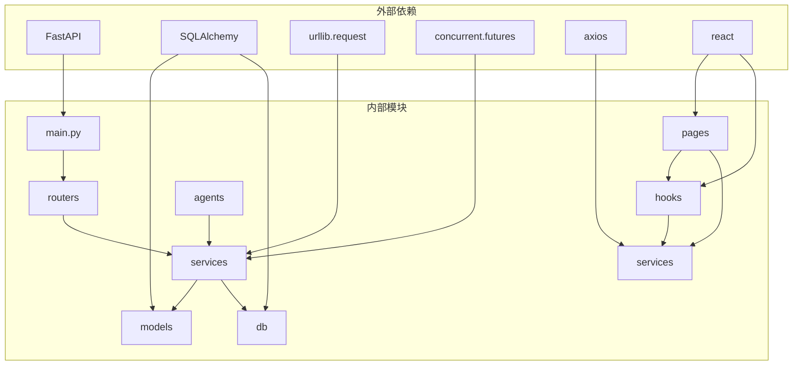

**图表来源**
- [backend/app/main.py:32-68](file://backend/app/main.py#L32-L68)
- [backend/app/services/data_source_service.py:16-34](file://backend/app/services/data_source_service.py#L16-L34)

### 数据库设计

系统使用 SQLite 作为本地数据库，设计了专门的数据源缓存表：

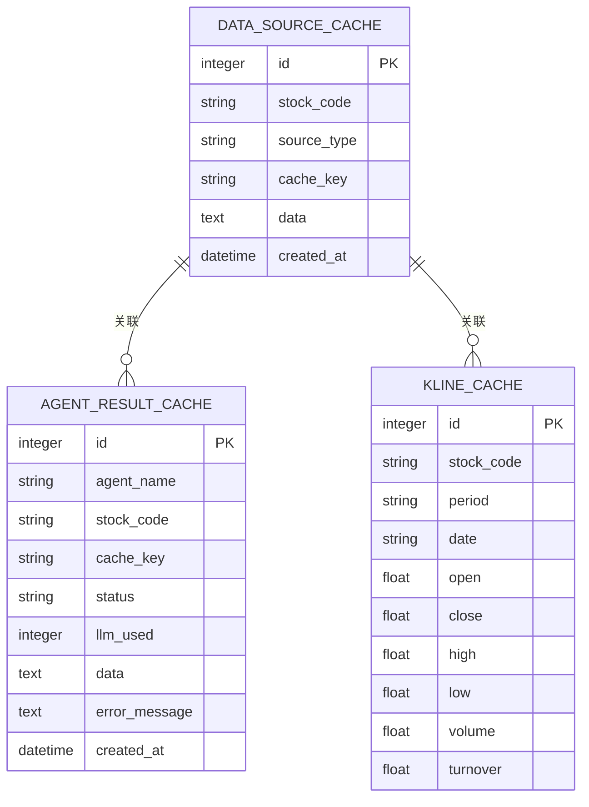

**图表来源**
- [backend/app/models/models.py:118-151](file://backend/app/models/models.py#L118-L151)

**章节来源**
- [backend/app/models/models.py:118-131](file://backend/app/models/models.py#L118-L131)
- [backend/app/db/database.py:1-34](file://backend/app/db/database.py#L1-L34)

## 性能考虑

### 缓存策略优化

系统实现了多层次的缓存策略来优化性能：

1. **时间边界缓存**：每天 09:00 作为缓存边界，确保数据的新鲜度
2. **内存缓存优先**：优先使用内存缓存减少数据库访问
3. **并行数据获取**：利用多线程并行处理提高响应速度
4. **熔断降级**：API超时情况下快速降级到历史缓存

### 并发控制

系统采用了合理的并发控制机制：

| 场景 | 并行限制 | 目的 |
|------|----------|------|
| 概念板块查询 | 8 个线程 | 避免 API 限流 |
| 批量搜索 | 动态调整 | 根据任务数量优化 |
| 数据库操作 | 1 个连接 | 保证数据一致性 |
| 并行数据获取 | 8 个线程 | 统一并行接口 |

### 错误处理机制

系统实现了完善的错误处理机制：

1. **API 调用异常**：捕获网络异常和超时，触发熔断
2. **数据库操作异常**：自动回滚事务
3. **前端状态管理**：优雅降级和错误提示
4. **历史缓存回退**：空数据时自动使用历史缓存

## 故障排除指南

### 常见问题诊断

#### 数据获取失败

**症状**：API 调用返回空数据或抛出异常

**可能原因**：
1. 网络连接问题
2. API Key 配置错误
3. 问财API额度耗尽（403错误）

**解决方案**：
1. 检查网络连接状态
2. 验证 IWENCAI_API_KEY 环境变量
3. 检查熔断状态：`get_iwencai_status()`
4. 等待额度重置或更换API Key

#### 缓存数据过期

**症状**：显示的数据不是最新的

**可能原因**：
1. 缓存边界已过期
2. 强制刷新未生效
3. 熔断状态下使用历史缓存

**解决方案**：
1. 等待到下一个 09:00 边界
2. 手动触发强制刷新
3. 检查熔断状态并等待恢复
4. 清除浏览器缓存

#### 前端数据不同步

**症状**：前端显示的数据与后端不一致

**可能原因**：
1. 内存缓存未及时更新
2. 网络请求冲突
3. 熔断状态影响

**解决方案**：
1. 刷新页面强制重新加载
2. 检查浏览器开发者工具中的网络请求
3. 清除本地存储数据
4. 检查熔断状态

#### 熔断状态异常

**症状**：API调用始终返回空数据

**可能原因**：
1. 问财API额度耗尽
2. 熔断状态未正确重置
3. API Key失效

**解决方案**：
1. 检查`get_iwencai_status()`返回的状态
2. 调用`reset_iwencai_circuit()`重置熔断
3. 验证API Key配置
4. 等待额度重置或更换Key

**章节来源**
- [backend/app/services/data_fetcher.py:31-65](file://backend/app/services/data_fetcher.py#L31-L65)
- [frontend/src/hooks/useDataSource.ts:108-139](file://frontend/src/hooks/useDataSource.ts#L108-L139)

## 结论

数据源服务增强项目成功实现了股票分析应用所需的核心数据基础设施。通过模块化的设计和智能的缓存策略，系统为上层 Agent 模块提供了稳定、高效的数据支持。

**更新** 本次重大更新引入了问财API熔断机制、三级缓存降级策略、并行数据获取优化等核心改进，显著提升了系统的稳定性、性能和用户体验。

### 主要成就

1. **完整的数据源管理**：支持 16 种不同类型的数据源
2. **智能缓存机制**：实现了多层缓存策略确保数据新鲜度
3. **高性能并行处理**：通过多线程技术提升数据获取效率
4. **稳健的熔断机制**：防止API超时导致的系统性故障
5. **三级降级策略**：确保在任何情况下都能提供有效数据
6. **统一并行接口**：简化Agent开发和提升性能
7. **前后端协同**：实现了完整的数据管理生命周期

### 未来发展方向

1. **扩展数据源类型**：增加更多数据源的支持
2. **优化缓存策略**：根据使用模式调整缓存策略
3. **增强监控能力**：添加更详细的性能监控和日志记录
4. **提升可扩展性**：支持多股票并行跟踪功能
5. **熔断自动恢复**：实现定时探测API可用性的自动恢复机制
6. **前端降级提示**：在前端展示熔断和降级状态

该系统为 Stock Foker 应用提供了坚实的数据基础，为后续的功能扩展和性能优化奠定了良好基础。通过引入熔断机制和三级降级策略，系统在面对外部API不稳定时表现出了更强的鲁棒性和用户体验保障。