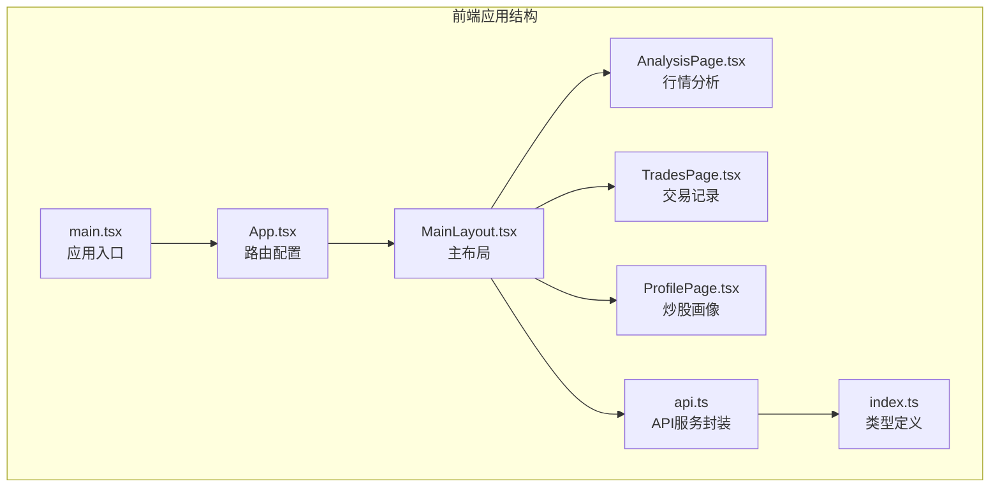
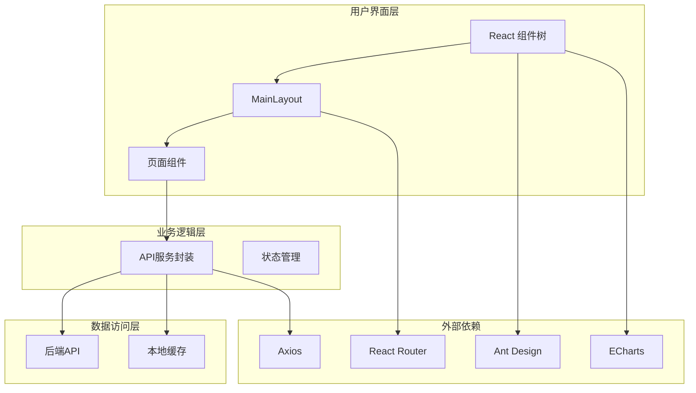
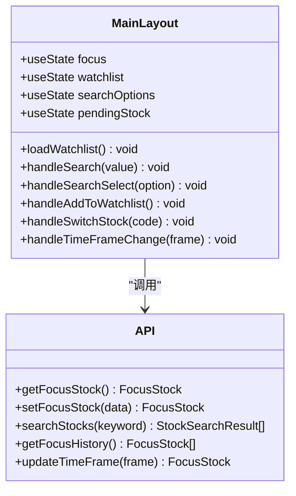
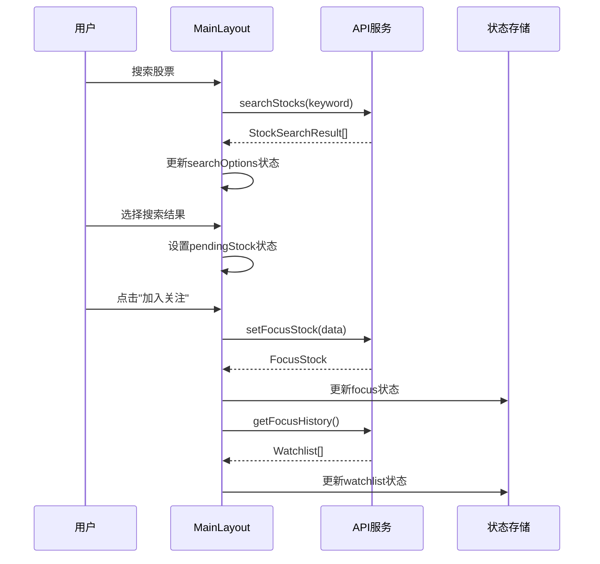
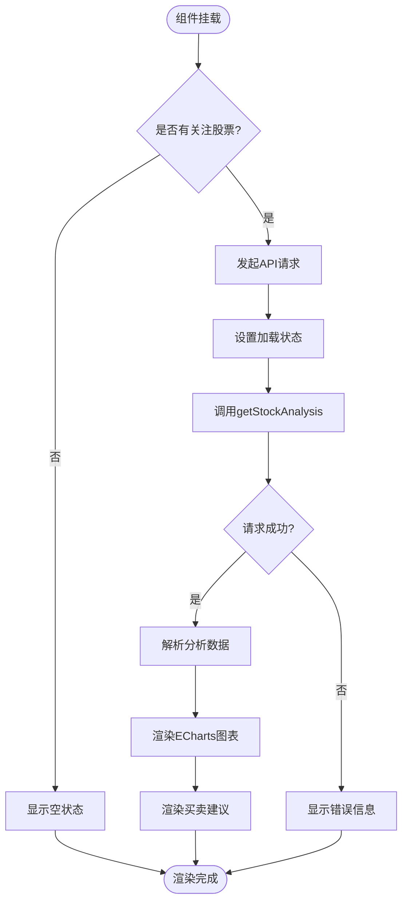
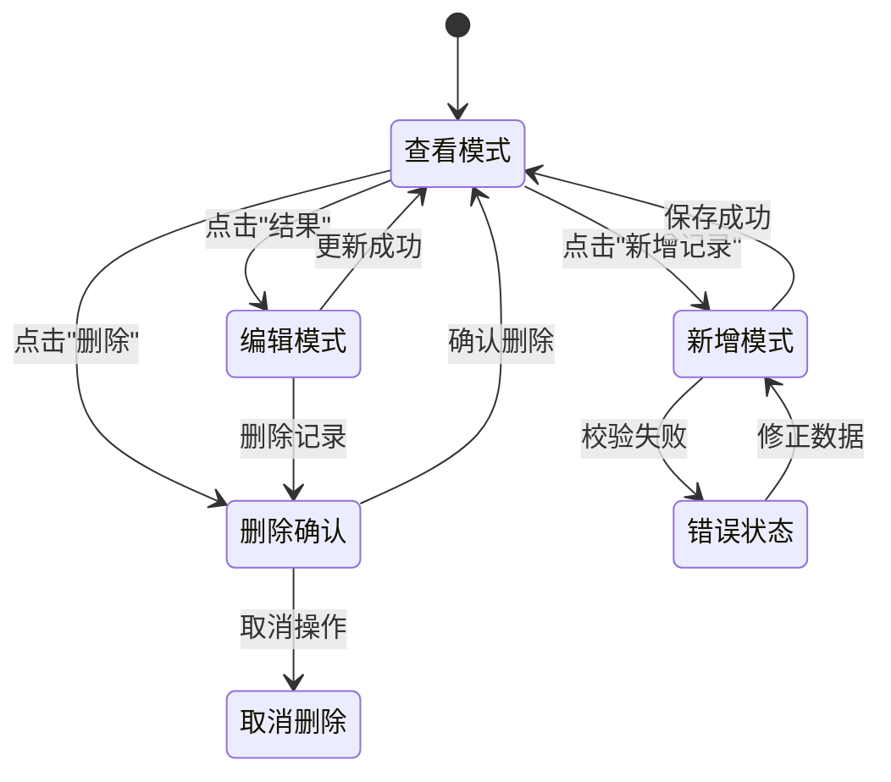
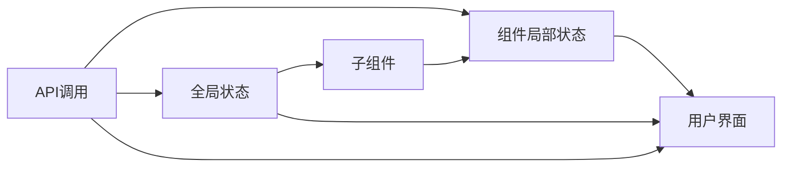
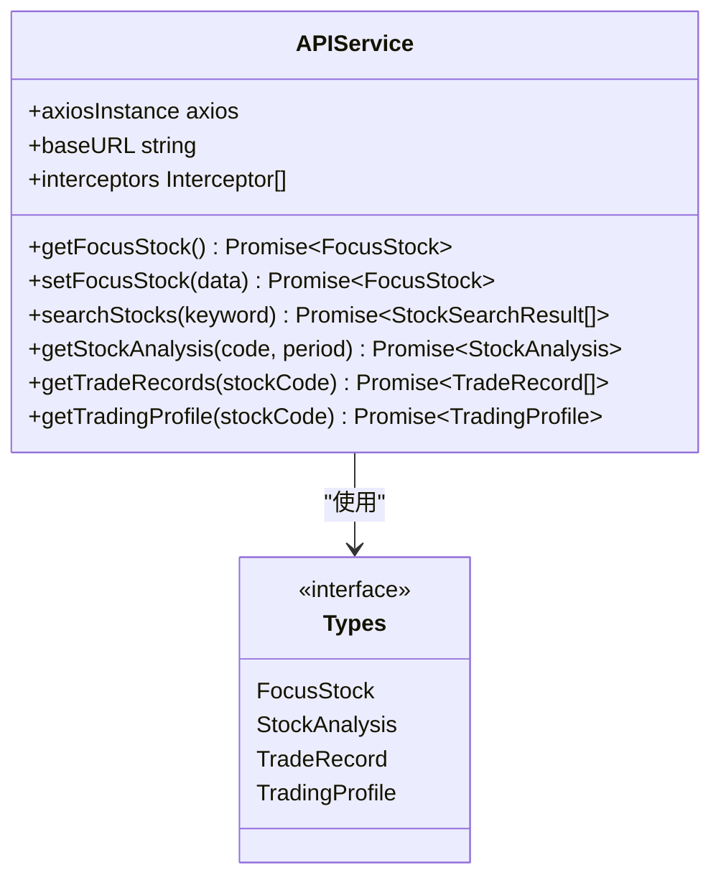
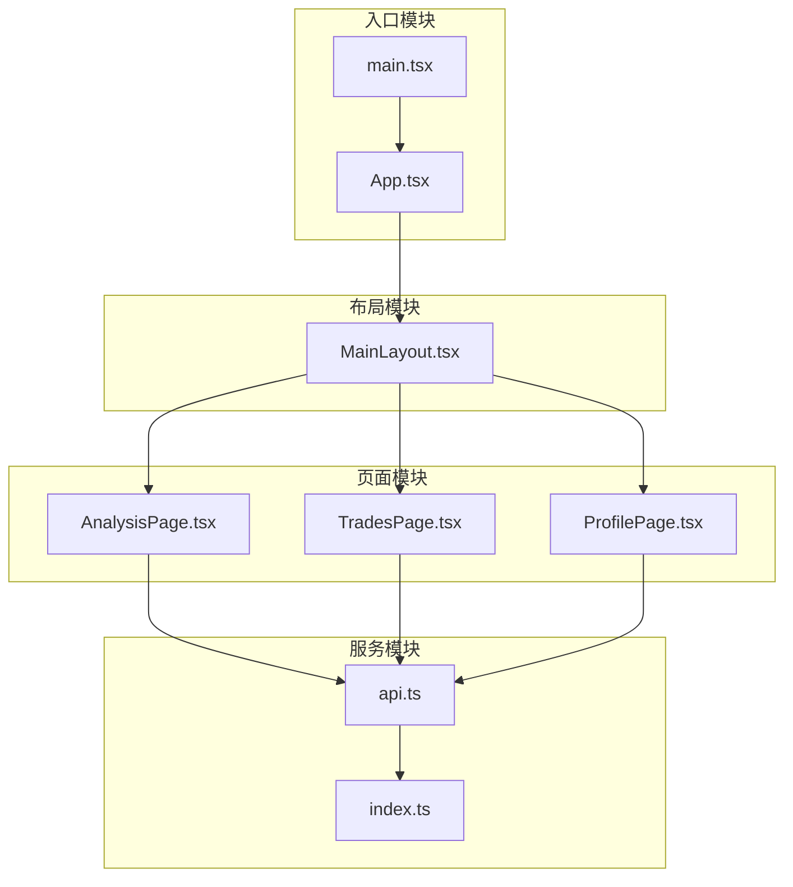

# 前端架构设计

<cite>
**本文档引用的文件**
- [package.json](file://frontend/package.json)
- [vite.config.ts](file://frontend/vite.config.ts)
- [main.tsx](file://frontend/src/main.tsx)
- [App.tsx](file://frontend/src/App.tsx)
- [MainLayout.tsx](file://frontend/src/components/MainLayout.tsx)
- [AnalysisPage.tsx](file://frontend/src/pages/AnalysisPage.tsx)
- [TradesPage.tsx](file://frontend/src/pages/TradesPage.tsx)
- [ProfilePage.tsx](file://frontend/src/pages/ProfilePage.tsx)
- [api.ts](file://frontend/src/services/api.ts)
- [index.ts](file://frontend/src/types/index.ts)
- [tsconfig.json](file://frontend/tsconfig.json)
- [vite-env.d.ts](file://frontend/src/vite-env.d.ts)
- [技术架构文档.md](file://doc/技术架构文档.md)
</cite>

## 目录
1. [简介](#简介)
2. [项目结构](#项目结构)
3. [核心组件](#核心组件)
4. [架构总览](#架构总览)
5. [详细组件分析](#详细组件分析)
6. [依赖关系分析](#依赖关系分析)
7. [性能考虑](#性能考虑)
8. [故障排除指南](#故障排除指南)
9. [结论](#结论)

## 简介
Stock Foker 是一个基于现代前端技术栈构建的股票分析与交易管理系统。本项目采用 React 19 + TypeScript + Vite 的组合，结合 Ant Design UI 库和 ECharts 图表库，为用户提供实时行情分析、交易记录管理和个人炒股画像统计功能。前端通过 Axios 封装统一的 API 服务层，配合 React Router 实现 SPA 路由管理，并通过 Vite 提供快速开发体验和高效的构建性能。

## 项目结构
前端项目采用清晰的功能模块化组织方式，主要分为以下层次：
- **入口层**: main.tsx 和 App.tsx 负责应用初始化和路由配置
- **布局层**: MainLayout.tsx 提供统一的页面布局和状态管理
- **页面层**: AnalysisPage、TradesPage、ProfilePage 分别对应三大核心功能页面
- **服务层**: api.ts 封装所有后端 API 调用，提供类型安全的接口
- **类型定义**: types/index.ts 定义完整的 TypeScript 类型系统
- **构建配置**: vite.config.ts 和 tsconfig.json 提供开发和生产环境配置



**图表来源**
- [main.tsx:1-10](file://frontend/src/main.tsx#L1-L10)
- [App.tsx:1-27](file://frontend/src/App.tsx#L1-L27)
- [MainLayout.tsx:1-281](file://frontend/src/components/MainLayout.tsx#L1-L281)

**章节来源**
- [package.json:1-30](file://frontend/package.json#L1-L30)
- [vite.config.ts:1-16](file://frontend/vite.config.ts#L1-L16)
- [tsconfig.json:1-22](file://frontend/tsconfig.json#L1-L22)

## 核心组件
本节深入分析前端架构中的核心组件及其职责分工。

### 技术栈选择与配置优化
项目选择了业界领先的现代化前端技术栈：
- **React 19**: 提供最新的并发特性和性能优化
- **TypeScript**: 强类型支持确保代码质量和开发体验
- **Vite 6**: 极速开发服务器和优化的构建工具
- **Ant Design 5.x**: 企业级 UI 设计系统，适合数据密集型应用
- **ECharts 5.x**: 专业图表库，支持复杂的金融图表需求

配置优化要点：
- 使用 ESNext 模块解析，提升打包效率
- 启用严格模式，减少运行时错误
- 配置 API 代理，解决开发环境跨域问题
- 优化构建输出，确保生产环境性能

### 组件化架构设计
采用分层组件架构，每个组件职责明确：
- **MainLayout**: 作为根布局组件，管理全局状态和导航
- **页面组件**: AnalysisPage、TradesPage、ProfilePage 各自负责特定功能域
- **服务组件**: api.ts 提供统一的数据访问层
- **类型系统**: 完整的 TypeScript 类型定义确保类型安全

**章节来源**
- [package.json:11-28](file://frontend/package.json#L11-L28)
- [vite.config.ts:4-15](file://frontend/vite.config.ts#L4-L15)
- [tsconfig.json:2-19](file://frontend/tsconfig.json#L2-L19)

## 架构总览
前端架构采用典型的三层分离模式，通过清晰的边界实现高内聚低耦合。



**图表来源**
- [MainLayout.tsx:47-281](file://frontend/src/components/MainLayout.tsx#L47-L281)
- [api.ts:1-68](file://frontend/src/services/api.ts#L1-L68)
- [App.tsx:1-27](file://frontend/src/App.tsx#L1-L27)

## 详细组件分析

### MainLayout 主布局组件
MainLayout 是整个应用的核心布局组件，承担着多重职责：

#### 状态管理架构
组件内部维护多个状态：
- **focus**: 当前关注的股票信息
- **watchlist**: 关注股票列表
- **searchOptions**: 搜索结果选项
- **pendingStock**: 待确认的股票（搜索后但未加入关注）

#### 核心功能模块
1. **股票关注管理**: 通过 setFocusStock API 实现关注切换
2. **搜索功能**: 支持股票代码和名称的智能搜索
3. **时间框架切换**: 支持短线、中线、长线三种分析周期
4. **关注列表管理**: 提供关注股票的快速切换



**图表来源**
- [MainLayout.tsx:47-281](file://frontend/src/components/MainLayout.tsx#L47-L281)
- [api.ts:14-27](file://frontend/src/services/api.ts#L14-L27)

#### 状态流转流程


**图表来源**
- [MainLayout.tsx:81-165](file://frontend/src/components/MainLayout.tsx#L81-L165)
- [api.ts:14-27](file://frontend/src/services/api.ts#L14-L27)

**章节来源**
- [MainLayout.tsx:47-281](file://frontend/src/components/MainLayout.tsx#L47-L281)

### 页面级组件设计模式

#### AnalysisPage 行情分析页面
该页面专注于股票行情分析，采用数据驱动的渲染模式：

**核心特性**:
- **动态图表**: 使用 ECharts 渲染 K 线图和各种技术指标
- **周期切换**: 支持日K、周K、月K三种时间周期
- **技术指标**: 展示 MA5/MA10/MA20/MA60 等移动平均线
- **买卖建议**: 基于多指标综合分析给出投资建议

**数据流架构**:


**图表来源**
- [AnalysisPage.tsx:28-213](file://frontend/src/pages/AnalysisPage.tsx#L28-L213)
- [api.ts:34-44](file://frontend/src/services/api.ts#L34-L44)

#### TradesPage 交易记录页面
交易记录页面采用表格驱动的 CRUD 操作模式：

**核心功能**:
- **记录管理**: 支持新增、编辑、删除交易记录
- **表单验证**: 使用 Ant Design 表单组件进行数据校验
- **结果追踪**: 支持补充交易结果和盈亏情况
- **数据展示**: 使用表格组件展示详细的交易信息

**交互流程**:


**图表来源**
- [TradesPage.tsx:28-260](file://frontend/src/pages/TradesPage.tsx#L28-L260)

#### ProfilePage 炒股画像页面
炒股画像页面专注于数据分析和统计展示：

**核心统计维度**:
- **交易表现**: 总交易次数、胜率、盈亏比、平均持仓天数
- **交易风格**: 交易频率、偏好时间框架、平均盈亏
- **情绪分析**: 情绪判断准确率
- **行为模式**: 常见买卖理由统计

**章节来源**
- [AnalysisPage.tsx:28-213](file://frontend/src/pages/AnalysisPage.tsx#L28-L213)
- [TradesPage.tsx:28-260](file://frontend/src/pages/TradesPage.tsx#L28-L260)
- [ProfilePage.tsx:26-173](file://frontend/src/pages/ProfilePage.tsx#L26-L173)

### 路由配置策略
应用采用嵌套路由设计，通过 React Router 7.5.0 实现灵活的页面导航：

#### 路由结构设计
```mermaid
graph TB
Root[根路由 "/"] --> Layout[MainLayout]
Layout --> Home[首页重定向 "/" -> "/analysis"]
Layout --> Analysis[分析页面 "/analysis"]
Layout --> Trades[交易页面 "/trades"]
Layout --> Profile[画像页面 "/profile"]
subgraph "嵌套Outlet"
Outlet[Outlet上下文]
Focus[focus状态传递]
end
Layout --> Outlet
Outlet --> Focus
```

**图表来源**
- [App.tsx:14-20](file://frontend/src/App.tsx#L14-L20)

#### 参数传递机制
通过 React Router 的 `useOutletContext` 实现父子组件间的状态传递：
- MainLayout 将当前关注的股票状态通过 `Outlet context` 传递给子页面
- 子页面通过 `useOutletContext` 获取并使用这些状态
- 实现了从布局到页面的单向数据流

**章节来源**
- [App.tsx:1-27](file://frontend/src/App.tsx#L1-L27)
- [MainLayout.tsx:275](file://frontend/src/components/MainLayout.tsx#L275)

### 状态管理模式
前端采用混合状态管理模式，结合 React 内置状态和组件间通信：

#### 组件内状态管理
- **局部状态**: 每个页面组件维护自己的局部状态（如 AnalysisPage 的 period、loading 状态）
- **表单状态**: 使用 Ant Design Form Hook 管理复杂表单数据
- **UI 状态**: 控制模态框、加载状态、错误提示等

#### 全局状态设计
- **焦点状态**: MainLayout 维护当前关注股票的全局状态
- **上下文传递**: 通过 React Context 在组件树中传递状态
- **状态同步**: API 调用成功后自动更新相关组件状态

#### 数据流控制


**图表来源**
- [MainLayout.tsx:50-79](file://frontend/src/components/MainLayout.tsx#L50-L79)
- [AnalysisPage.tsx:29](file://frontend/src/pages/AnalysisPage.tsx#L29)

**章节来源**
- [MainLayout.tsx:47-281](file://frontend/src/components/MainLayout.tsx#L47-L281)
- [AnalysisPage.tsx:28-48](file://frontend/src/pages/AnalysisPage.tsx#L28-L48)

### API 服务封装
API 服务层采用 Axios 封装，提供类型安全和统一的错误处理：

#### 服务架构设计


**图表来源**
- [api.ts:1-68](file://frontend/src/services/api.ts#L1-L68)
- [index.ts:1-94](file://frontend/src/types/index.ts#L1-L94)

#### 请求拦截器与响应处理
- **基础配置**: 统一设置 baseURL 为 `/api`，启用 CORS 支持
- **请求拦截**: 自动添加认证头（如有需要）
- **响应拦截**: 统一处理错误状态码和异常情况
- **超时处理**: 配置合理的请求超时时间

#### 错误处理策略
- **网络错误**: 显示友好的错误提示
- **业务错误**: 解析后端返回的详细错误信息
- **重试机制**: 对可恢复的错误提供重试选项
- **降级处理**: 在 API 不可用时提供基本功能

#### 缓存策略
虽然前端层面没有实现复杂的缓存逻辑，但可以通过以下方式优化：
- **请求去重**: 避免重复请求相同数据
- **状态缓存**: 利用 React 状态避免不必要的重新渲染
- **懒加载**: 按需加载图表数据和大体量数据

**章节来源**
- [api.ts:1-68](file://frontend/src/services/api.ts#L1-L68)

## 依赖关系分析

### 外部依赖关系
项目依赖关系清晰，各模块职责明确：

```mermaid
graph TB
subgraph "核心依赖"
React[react@^19.1.0]
Router[react-router-dom@^7.5.0]
AntD[antd@^5.25.0]
Axios[axios@^1.9.0]
end
subgraph "开发依赖"
Vite[vite@^6.3.2]
TS[typescript@~5.8.3]
ReactPlugin[@vitejs/plugin-react@^4.4.1]
end
subgraph "图表依赖"
ECharts[echarts@^5.6.0]
EChartsReact[echarts-for-react@^3.0.2]
end
subgraph "工具依赖"
DayJS[dayjs@^1.11.13]
Icons[@ant-design/icons@^5.6.1]
end
React --> Router
React --> AntD
AntD --> Icons
ECharts --> EChartsReact
```

**图表来源**
- [package.json:11-28](file://frontend/package.json#L11-L28)

### 内部模块依赖


**图表来源**
- [main.tsx:1-10](file://frontend/src/main.tsx#L1-L10)
- [App.tsx:1-27](file://frontend/src/App.tsx#L1-L27)
- [MainLayout.tsx:1-31](file://frontend/src/components/MainLayout.tsx#L1-L31)

**章节来源**
- [package.json:1-30](file://frontend/package.json#L1-L30)

## 性能考虑
基于当前架构，提出以下性能优化建议：

### 构建性能优化
- **模块解析**: 使用 ESNext 模块解析，提升打包速度
- **Tree Shaking**: 确保未使用的代码被正确移除
- **代码分割**: 对大型组件实现按需加载
- **压缩优化**: 生产环境启用代码压缩和资源优化

### 运行时性能优化
- **状态优化**: 使用 React.memo 和 useMemo 优化重渲染
- **图表性能**: 对 ECharts 实例进行复用和销毁管理
- **API 调用**: 实现请求去重和缓存策略
- **内存管理**: 及时清理事件监听器和定时器

### 开发体验优化
- **热重载**: 利用 Vite 的快速热重载功能
- **类型检查**: 在开发时启用严格的类型检查
- **错误边界**: 实现错误边界组件捕获渲染错误

## 故障排除指南

### 常见问题诊断
1. **API 请求失败**
   - 检查 Vite 代理配置是否正确
   - 验证后端服务是否正常运行
   - 查看浏览器网络面板的错误详情

2. **路由跳转异常**
   - 确认路由配置是否正确
   - 检查 Outlet 上下文传递是否正常
   - 验证路径参数是否匹配

3. **图表渲染问题**
   - 检查数据格式是否符合 ECharts 要求
   - 验证容器尺寸是否正确
   - 确认数据加载时机是否合适

### 调试技巧
- **React DevTools**: 使用组件树检查状态变化
- **网络面板**: 监控 API 请求和响应
- **控制台日志**: 添加必要的调试信息
- **错误边界**: 实现全局错误处理

**章节来源**
- [vite.config.ts:8-14](file://frontend/vite.config.ts#L8-L14)
- [api.ts:11](file://frontend/src/services/api.ts#L11)

## 结论
Stock Foker 前端架构展现了现代 React 应用的最佳实践。通过精心设计的组件层次、清晰的职责划分和完善的类型系统，实现了高可维护性和良好的用户体验。主要优势包括：

1. **架构清晰**: 分层设计使得代码结构易于理解和扩展
2. **类型安全**: 完整的 TypeScript 类型定义确保代码质量
3. **开发体验**: Vite 提供了优秀的开发体验和构建性能
4. **组件复用**: 主布局组件实现了功能复用和状态共享
5. **数据流清晰**: 单向数据流和状态管理模式便于调试和维护

未来可以考虑的改进方向：
- 实现更完善的错误处理和重试机制
- 添加单元测试和集成测试
- 优化图表渲染性能
- 实现更细粒度的代码分割
- 添加国际化支持