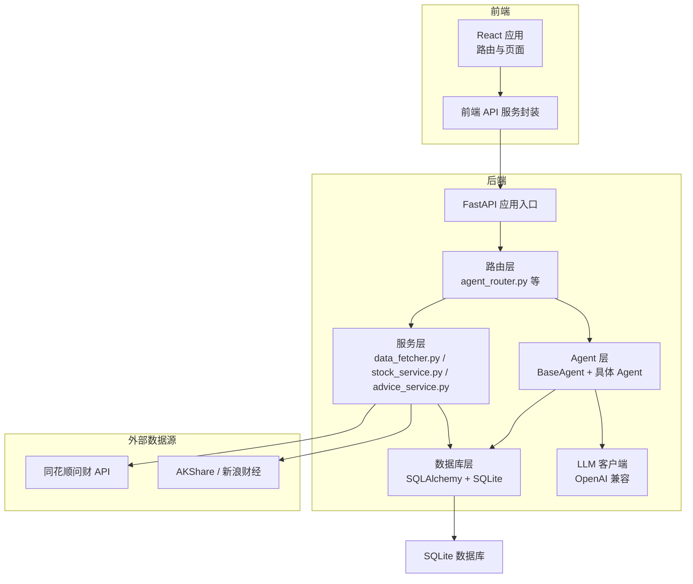
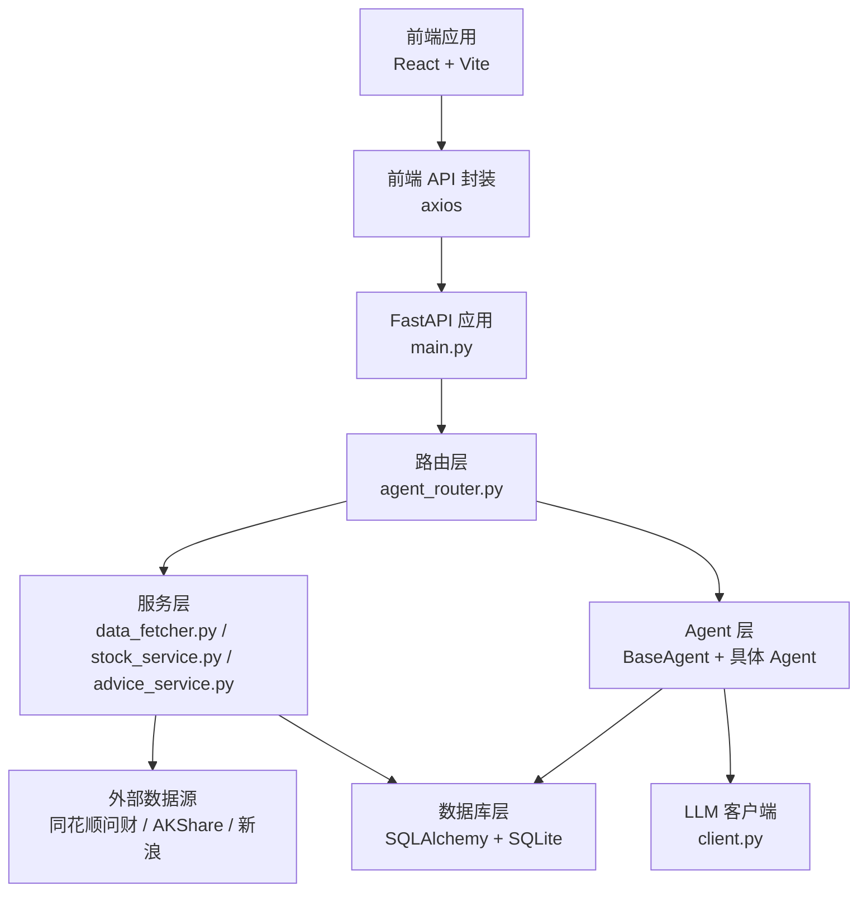
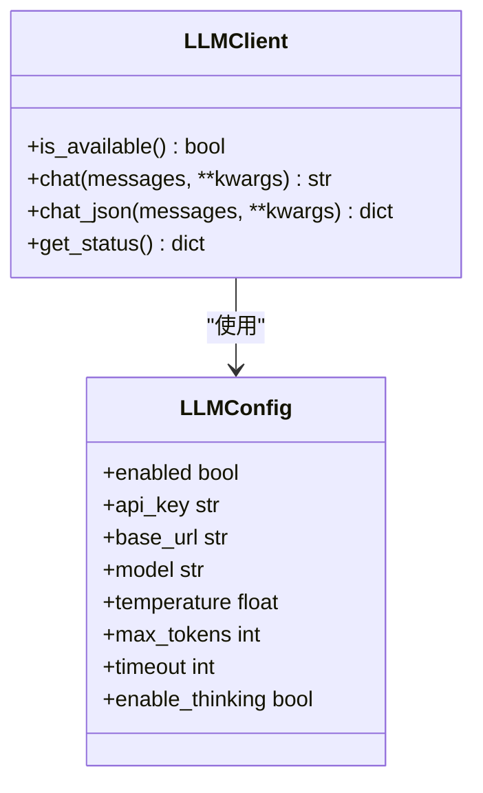
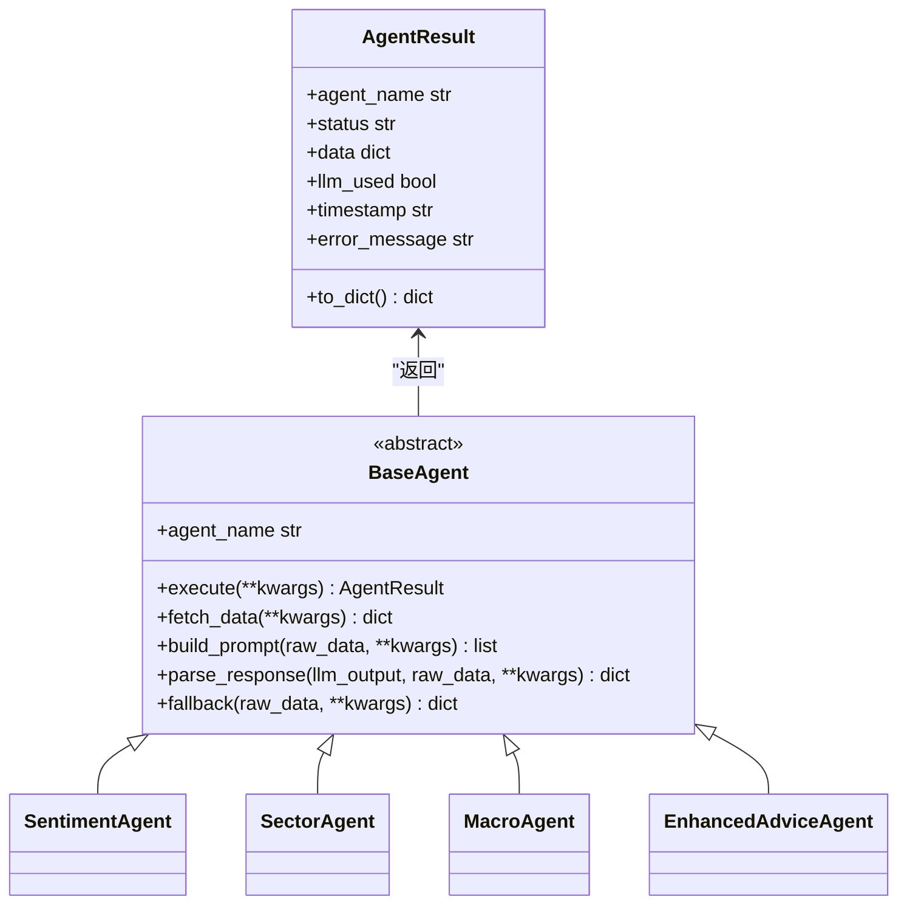
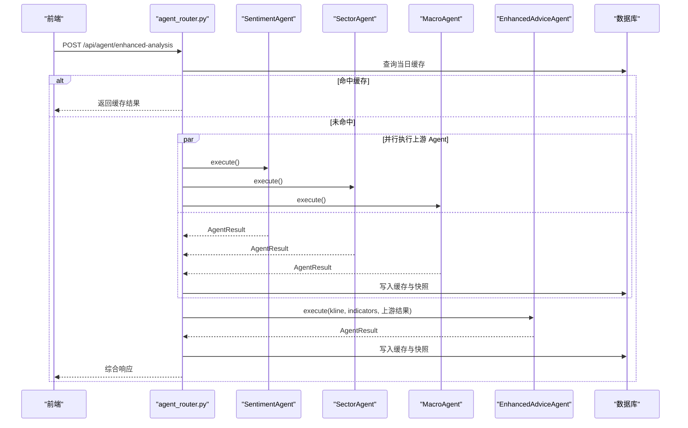
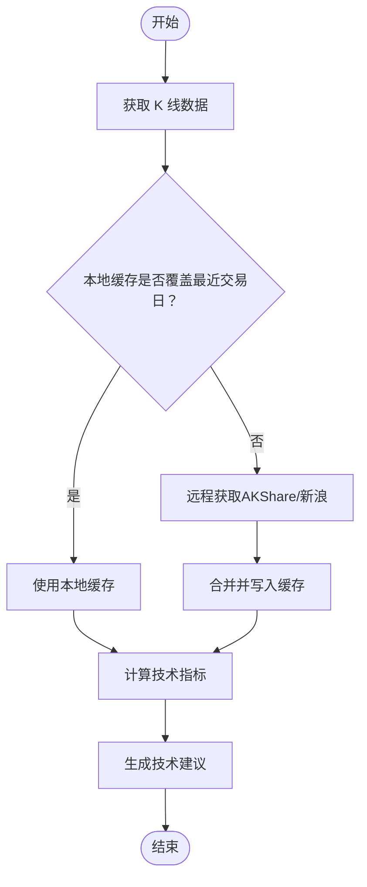
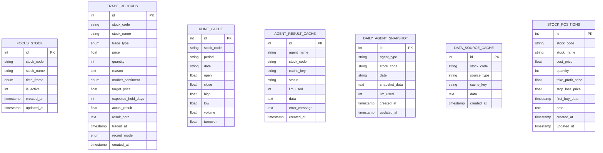
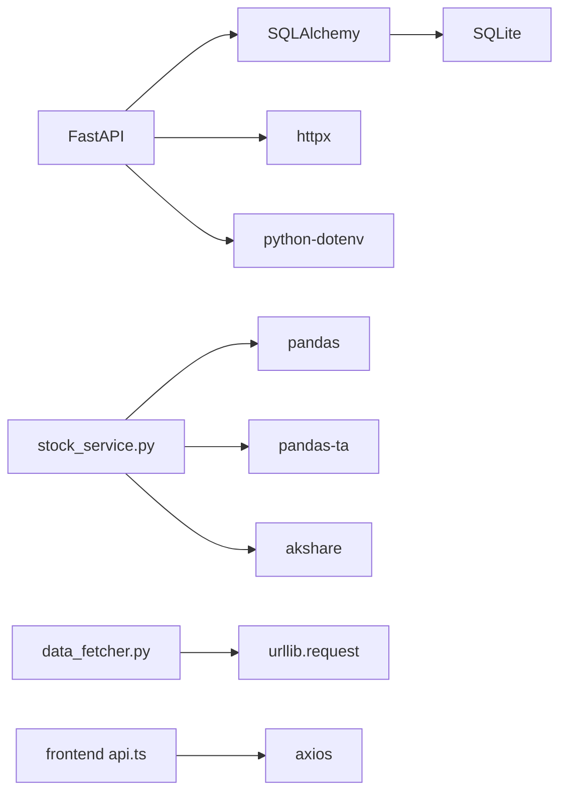

# 应用架构改进

<cite>
**本文档引用的文件**
- [backend/app/main.py](file://backend/app/main.py)
- [backend/app/db/database.py](file://backend/app/db/database.py)
- [backend/app/models/models.py](file://backend/app/models/models.py)
- [backend/app/llm/client.py](file://backend/app/llm/client.py)
- [backend/app/llm/prompts.py](file://backend/app/llm/prompts.py)
- [backend/app/routers/agent_router.py](file://backend/app/routers/agent_router.py)
- [backend/app/agents/base_agent.py](file://backend/app/agents/base_agent.py)
- [backend/app/agents/sentiment_agent.py](file://backend/app/agents/sentiment_agent.py)
- [backend/app/agents/sector_agent.py](file://backend/app/agents/sector_agent.py)
- [backend/app/agents/macro_agent.py](file://backend/app/agents/macro_agent.py)
- [backend/app/agents/enhanced_advice_agent.py](file://backend/app/agents/enhanced_advice_agent.py)
- [backend/app/services/data_fetcher.py](file://backend/app/services/data_fetcher.py)
- [backend/app/services/stock_service.py](file://backend/app/services/stock_service.py)
- [backend/app/services/advice_service.py](file://backend/app/services/advice_service.py)
- [frontend/src/services/api.ts](file://frontend/src/services/api.ts)
- [frontend/src/App.tsx](file://frontend/src/App.tsx)
- [doc/产品设计文档.md](file://doc/产品设计文档.md)
- [backend/requirements.txt](file://backend/requirements.txt)
</cite>

## 目录
1. [简介](#简介)
2. [项目结构](#项目结构)
3. [核心组件](#核心组件)
4. [架构总览](#架构总览)
5. [详细组件分析](#详细组件分析)
6. [依赖关系分析](#依赖关系分析)
7. [性能考量](#性能考量)
8. [故障排查指南](#故障排查指南)
9. [结论](#结论)
10. [附录](#附录)

## 简介
本项目是一个面向个人投资者的股票分析应用，采用前后端分离架构：后端基于 Python FastAPI，前端基于 React + Vite。系统通过 LLM Agent 链路融合技术面、消息面、板块联动与宏观环境四大维度，提供可解释的增强版买卖建议，并配套交易记录、炒股画像、风险控制等功能模块。

## 项目结构
项目采用按功能域划分的目录组织方式，后端按领域拆分 routers、services、agents、models、llm 等层次；前端按页面与功能模块组织；doc 目录存放产品设计与评审文档。

**图表来源**
- [backend/app/main.py:1-74](file://backend/app/main.py#L1-L74)
- [backend/app/routers/agent_router.py:1-395](file://backend/app/routers/agent_router.py#L1-L395)
- [backend/app/services/data_fetcher.py:1-358](file://backend/app/services/data_fetcher.py#L1-L358)
- [backend/app/services/stock_service.py:1-435](file://backend/app/services/stock_service.py#L1-L435)
- [backend/app/db/database.py:1-34](file://backend/app/db/database.py#L1-L34)

**章节来源**
- [backend/app/main.py:1-74](file://backend/app/main.py#L1-L74)
- [doc/产品设计文档.md:1-446](file://doc/产品设计文档.md#L1-L446)

## 核心组件
- 应用入口与生命周期：FastAPI 应用初始化、CORS 配置、数据库初始化、日志格式统一。
- 数据库与模型：基于 SQLAlchemy 的 ORM 模型，包含关注股票、交易记录、K线缓存、Agent 结果缓存、每日快照、数据源缓存、持仓信息等。
- LLM 客户端：统一的 OpenAI 兼容客户端，支持重试、JSON 解析与状态查询。
- Agent 抽象与具体实现：Template Method 模式，定义统一的执行流程（获取数据 → LLM 分析 → 降级处理），并提供消息面、板块、宏观、增强建议四个 Agent。
- 服务层：数据抓取（同花顺问财 API）、K线与指标计算（AKShare + pandas + pandas-ta）、技术建议生成。
- 路由层：Agent API 路由，支持并行执行上游 Agent、缓存与快照管理、LLM 状态查询与热重载、缓存清理。

**章节来源**
- [backend/app/db/database.py:1-34](file://backend/app/db/database.py#L1-L34)
- [backend/app/models/models.py:1-151](file://backend/app/models/models.py#L1-L151)
- [backend/app/llm/client.py:1-146](file://backend/app/llm/client.py#L1-L146)
- [backend/app/agents/base_agent.py:1-119](file://backend/app/agents/base_agent.py#L1-L119)
- [backend/app/services/data_fetcher.py:1-358](file://backend/app/services/data_fetcher.py#L1-L358)
- [backend/app/services/stock_service.py:1-435](file://backend/app/services/stock_service.py#L1-L435)
- [backend/app/services/advice_service.py:1-193](file://backend/app/services/advice_service.py#L1-L193)
- [backend/app/routers/agent_router.py:1-395](file://backend/app/routers/agent_router.py#L1-L395)

## 架构总览
系统采用分层架构：前端负责展示与交互，后端通过路由层协调服务层与 Agent 层，Agent 层通过 LLM 客户端调用大模型，服务层负责数据获取与计算，数据库层持久化结构化数据与缓存。

**图表来源**
- [backend/app/main.py:1-74](file://backend/app/main.py#L1-L74)
- [backend/app/routers/agent_router.py:1-395](file://backend/app/routers/agent_router.py#L1-L395)
- [backend/app/llm/client.py:1-146](file://backend/app/llm/client.py#L1-L146)
- [backend/app/services/data_fetcher.py:1-358](file://backend/app/services/data_fetcher.py#L1-L358)
- [backend/app/services/stock_service.py:1-435](file://backend/app/services/stock_service.py#L1-L435)
- [backend/app/db/database.py:1-34](file://backend/app/db/database.py#L1-L34)

## 详细组件分析

### LLM 客户端与配置
- 统一的 OpenAI 兼容客户端，支持超时、重试、JSON 解析与错误容错。
- 配置状态脱敏展示，支持热重载 .env 配置。
- 通过模块级单例管理，避免重复初始化。

**图表来源**
- [backend/app/llm/client.py:17-146](file://backend/app/llm/client.py#L17-L146)
- [backend/app/llm/prompts.py:1-366](file://backend/app/llm/prompts.py#L1-L366)

**章节来源**
- [backend/app/llm/client.py:1-146](file://backend/app/llm/client.py#L1-L146)
- [backend/app/llm/prompts.py:1-366](file://backend/app/llm/prompts.py#L1-L366)

### Agent 抽象与执行流程
- BaseAgent 定义模板方法：execute() 完成数据获取 → LLM 分析 → 降级处理 → 统一结果包装。
- 具体 Agent 实现 fetch_data/build_prompt/parse_response/fallback，分别对应消息面、板块、宏观、增强建议。

**图表来源**
- [backend/app/agents/base_agent.py:46-119](file://backend/app/agents/base_agent.py#L46-L119)
- [backend/app/agents/sentiment_agent.py:12-91](file://backend/app/agents/sentiment_agent.py#L12-L91)
- [backend/app/agents/sector_agent.py:12-85](file://backend/app/agents/sector_agent.py#L12-L85)
- [backend/app/agents/macro_agent.py:12-81](file://backend/app/agents/macro_agent.py#L12-L81)
- [backend/app/agents/enhanced_advice_agent.py:11-129](file://backend/app/agents/enhanced_advice_agent.py#L11-L129)

**章节来源**
- [backend/app/agents/base_agent.py:1-119](file://backend/app/agents/base_agent.py#L1-L119)
- [backend/app/agents/sentiment_agent.py:1-91](file://backend/app/agents/sentiment_agent.py#L1-L91)
- [backend/app/agents/sector_agent.py:1-85](file://backend/app/agents/sector_agent.py#L1-L85)
- [backend/app/agents/macro_agent.py:1-81](file://backend/app/agents/macro_agent.py#L1-L81)
- [backend/app/agents/enhanced_advice_agent.py:1-129](file://backend/app/agents/enhanced_advice_agent.py#L1-L129)

### Agent 路由与缓存策略
- 路由层支持单个 Agent 执行与增强建议链路（并行上游 Agent + 增强建议 Agent）。
- 缓存策略：按日期与 Agent 名称组合键缓存，消息面/板块/宏观当日有效，增强建议 1 小时有效；支持“新鲜度边界”（09:00）与降级结果跳过。
- 快照表：每日每种 Agent 每支股票保留最新关键指标，便于页面刷新恢复。

**图表来源**
- [backend/app/routers/agent_router.py:258-354](file://backend/app/routers/agent_router.py#L258-L354)
- [backend/app/agents/sentiment_agent.py:12-91](file://backend/app/agents/sentiment_agent.py#L12-L91)
- [backend/app/agents/sector_agent.py:12-85](file://backend/app/agents/sector_agent.py#L12-L85)
- [backend/app/agents/macro_agent.py:12-81](file://backend/app/agents/macro_agent.py#L12-L81)
- [backend/app/agents/enhanced_advice_agent.py:11-129](file://backend/app/agents/enhanced_advice_agent.py#L11-L129)

**章节来源**
- [backend/app/routers/agent_router.py:1-395](file://backend/app/routers/agent_router.py#L1-L395)

### 数据获取与缓存
- 同花顺问财 API 服务：统一的 HTTP 客户端，支持并行抓取、SSL 上下文配置、空代理绕过系统代理。
- K线与指标：优先 AKShare，失败降级到新浪财经；本地 SQLite 缓存增量更新，清理过旧记录。
- 技术建议：基于 pandas-ta 计算 MA、MACD、KDJ、RSI、布林带等指标。

**图表来源**
- [backend/app/services/stock_service.py:221-435](file://backend/app/services/stock_service.py#L221-L435)
- [backend/app/services/data_fetcher.py:24-103](file://backend/app/services/data_fetcher.py#L24-L103)

**章节来源**
- [backend/app/services/data_fetcher.py:1-358](file://backend/app/services/data_fetcher.py#L1-L358)
- [backend/app/services/stock_service.py:1-435](file://backend/app/services/stock_service.py#L1-L435)
- [backend/app/services/advice_service.py:1-193](file://backend/app/services/advice_service.py#L1-L193)

### 数据模型与缓存表
- 关注股票、交易记录、K线缓存、Agent 结果缓存、每日快照、数据源缓存、持仓信息等。
- 通过唯一约束保证缓存键的幂等性，避免重复写入。

**图表来源**
- [backend/app/models/models.py:30-151](file://backend/app/models/models.py#L30-L151)

**章节来源**
- [backend/app/models/models.py:1-151](file://backend/app/models/models.py#L1-L151)

## 依赖关系分析
- 后端依赖：FastAPI、SQLAlchemy、pandas、pandas-ta、httpx、python-dotenv 等。
- 前端依赖：axios、react-router、antd、echarts 等。
- 外部依赖：同花顺问财 API、AKShare、新浪财经。

**图表来源**
- [backend/requirements.txt:1-12](file://backend/requirements.txt#L1-L12)
- [backend/app/services/stock_service.py:1-10](file://backend/app/services/stock_service.py#L1-L10)
- [backend/app/services/data_fetcher.py:6-15](file://backend/app/services/data_fetcher.py#L6-L15)
- [frontend/src/services/api.ts:1-188](file://frontend/src/services/api.ts#L1-L188)

**章节来源**
- [backend/requirements.txt:1-12](file://backend/requirements.txt#L1-L12)
- [frontend/src/services/api.ts:1-188](file://frontend/src/services/api.ts#L1-L188)

## 性能考量
- 并行抓取：数据获取层广泛使用线程池并行执行多个任务，减少总等待时间。
- 缓存策略：K线与 Agent 结果缓存显著降低重复请求与 LLM 调用成本；快照表支持页面刷新恢复。
- 降级与容错：LLM 不可用时自动降级到规则引擎或原始数据；K线获取失败时优先使用缓存。
- 数据库优化：WAL 模式提升并发读写性能；唯一约束避免重复写入；定期清理过旧缓存。

**章节来源**
- [backend/app/services/data_fetcher.py:106-126](file://backend/app/services/data_fetcher.py#L106-L126)
- [backend/app/db/database.py:9-14](file://backend/app/db/database.py#L9-L14)
- [backend/app/routers/agent_router.py:47-116](file://backend/app/routers/agent_router.py#L47-L116)

## 故障排查指南
- LLM 配置问题：通过 /api/agent/llm-status 查看状态，必要时 POST /api/agent/reload-config 热重载配置。
- 缓存异常：使用 /api/agent/cache/{stock_code} 清理 Agent 与数据源缓存，确保重新生成。
- 数据获取失败：检查同花顺问财 API Key 是否配置，确认网络代理设置；观察日志中关于 SSL 与代理的警告。
- K线数据异常：确认 AKShare 与新浪财经接口可用性，检查本地缓存是否覆盖最近交易日。

**章节来源**
- [backend/app/routers/agent_router.py:361-395](file://backend/app/routers/agent_router.py#L361-L395)
- [backend/app/llm/client.py:104-127](file://backend/app/llm/client.py#L104-L127)

## 结论
该应用通过清晰的分层架构与缓存策略，实现了从数据获取、技术分析到多维融合建议的完整链路。Agent 抽象与 LLM 客户端提供了良好的扩展性，服务层与数据库层保证了性能与可靠性。建议在后续版本中进一步完善监控与可观测性、增强错误恢复能力，并持续优化缓存与并行策略以应对更高并发场景。

## 附录
- 前端路由与页面：React 应用通过路由组织页面，Agent 缓存上下文提供跨组件缓存共享。
- 产品设计：文档明确了功能模块、数据架构、技术选型与版本规划，指导架构演进方向。

**章节来源**
- [frontend/src/App.tsx:1-41](file://frontend/src/App.tsx#L1-L41)
- [doc/产品设计文档.md:1-446](file://doc/产品设计文档.md#L1-L446)