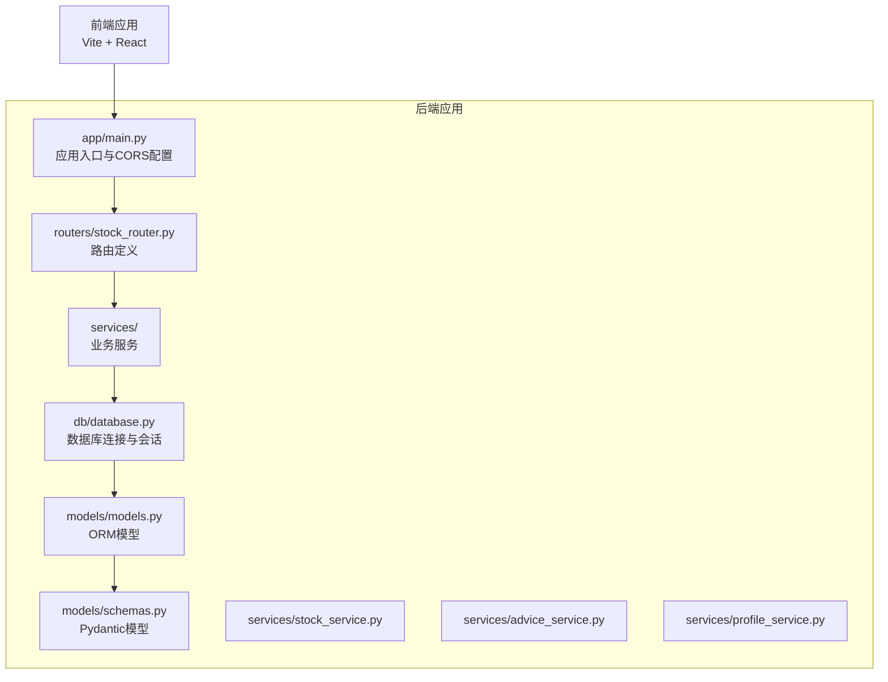
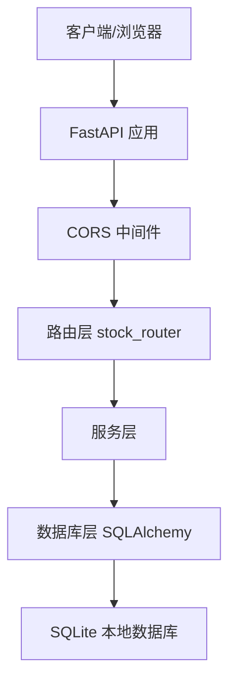
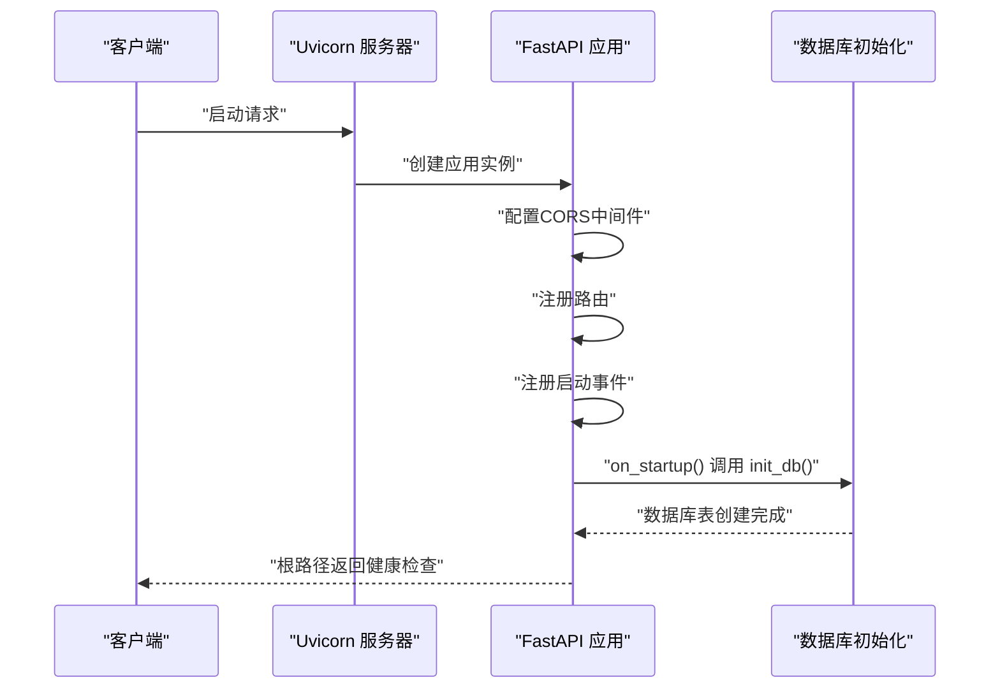
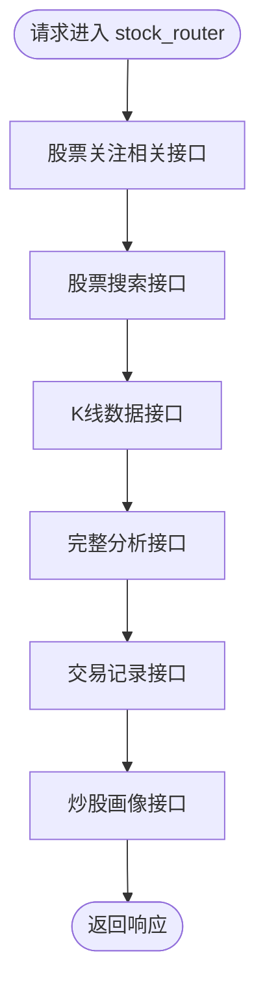
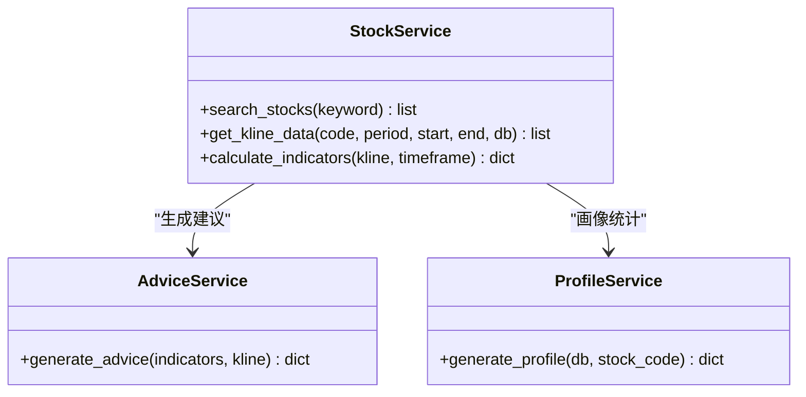
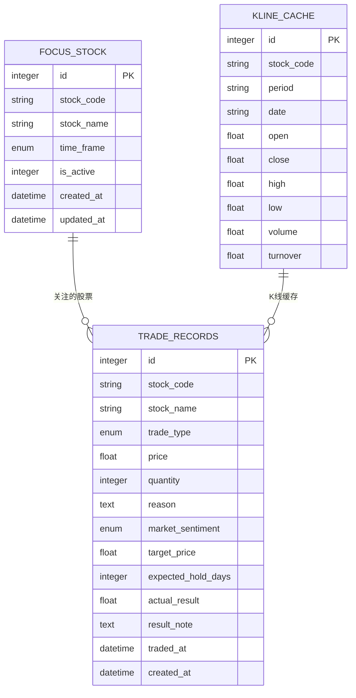
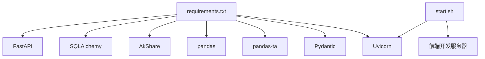

# 后端架构设计

<cite>
**本文档引用的文件**
- [main.py](file://backend/app/main.py)
- [stock_router.py](file://backend/app/routers/stock_router.py)
- [stock_service.py](file://backend/app/services/stock_service.py)
- [advice_service.py](file://backend/app/services/advice_service.py)
- [profile_service.py](file://backend/app/services/profile_service.py)
- [database.py](file://backend/app/db/database.py)
- [models.py](file://backend/app/models/models.py)
- [schemas.py](file://backend/app/models/schemas.py)
- [requirements.txt](file://backend/requirements.txt)
- [技术架构文档.md](file://doc/技术架构文档.md)
- [start.sh](file://start.sh)
- [stop.sh](file://stop.sh)
</cite>

## 目录
1. [简介](#简介)
2. [项目结构](#项目结构)
3. [核心组件](#核心组件)
4. [架构总览](#架构总览)
5. [详细组件分析](#详细组件分析)
6. [依赖关系分析](#依赖关系分析)
7. [性能考量](#性能考量)
8. [故障排查指南](#故障排查指南)
9. [结论](#结论)

## 简介
本项目为 Stock Foker 的后端服务，采用 FastAPI 构建高性能、类型安全的 RESTful API。系统围绕“路由层-服务层-数据访问层”的分层架构设计，结合 SQLAlchemy ORM 和 SQLite 数据库，提供股票关注、行情数据查询、技术指标计算、买卖建议生成以及交易画像分析等核心功能。后端通过 CORS 中间件支持前端跨域访问，并在启动事件中完成数据库初始化。

## 项目结构
后端采用按职责分层的目录组织方式：
- 应用入口与中间件：app/main.py
- 路由定义：app/routers/stock_router.py
- 业务服务：app/services/ 下的 stock_service.py、advice_service.py、profile_service.py
- 数据访问：app/db/database.py、app/models/models.py、app/models/schemas.py
- 依赖声明：backend/requirements.txt
- 启停脚本：start.sh、stop.sh
- 架构文档：doc/技术架构文档.md

图表来源
- [main.py:1-28](file://backend/app/main.py#L1-L28)
- [stock_router.py:1-197](file://backend/app/routers/stock_router.py#L1-L197)
- [database.py:1-24](file://backend/app/db/database.py#L1-L24)
- [models.py:1-75](file://backend/app/models/models.py#L1-L75)
- [schemas.py:1-118](file://backend/app/models/schemas.py#L1-L118)
- [stock_service.py:1-327](file://backend/app/services/stock_service.py#L1-L327)
- [advice_service.py:1-193](file://backend/app/services/advice_service.py#L1-L193)
- [profile_service.py:1-114](file://backend/app/services/profile_service.py#L1-L114)

章节来源
- [main.py:1-28](file://backend/app/main.py#L1-L28)
- [stock_router.py:1-197](file://backend/app/routers/stock_router.py#L1-L197)
- [database.py:1-24](file://backend/app/db/database.py#L1-L24)
- [models.py:1-75](file://backend/app/models/models.py#L1-L75)
- [schemas.py:1-118](file://backend/app/models/schemas.py#L1-L118)
- [stock_service.py:1-327](file://backend/app/services/stock_service.py#L1-L327)
- [advice_service.py:1-193](file://backend/app/services/advice_service.py#L1-L193)
- [profile_service.py:1-114](file://backend/app/services/profile_service.py#L1-L114)
- [技术架构文档.md:1-197](file://doc/技术架构文档.md#L1-L197)

## 核心组件
- 应用入口与中间件：定义 FastAPI 实例、CORS 中间件、根路径健康检查、启动事件初始化数据库。
- 路由层：集中定义所有 API 接口，包含股票关注、搜索、K线与分析、交易记录、炒股画像等。
- 服务层：封装业务逻辑，包括股票数据获取与缓存、技术指标计算、买卖建议生成、交易画像统计。
- 数据访问层：SQLAlchemy ORM 模型与会话管理，SQLite 本地存储，统一的数据库初始化与会话注入。

章节来源
- [main.py:1-28](file://backend/app/main.py#L1-L28)
- [stock_router.py:1-197](file://backend/app/routers/stock_router.py#L1-L197)
- [stock_service.py:1-327](file://backend/app/services/stock_service.py#L1-L327)
- [advice_service.py:1-193](file://backend/app/services/advice_service.py#L1-L193)
- [profile_service.py:1-114](file://backend/app/services/profile_service.py#L1-L114)
- [database.py:1-24](file://backend/app/db/database.py#L1-L24)
- [models.py:1-75](file://backend/app/models/models.py#L1-L75)
- [schemas.py:1-118](file://backend/app/models/schemas.py#L1-L118)

## 架构总览
系统采用“路由-服务-数据”三层架构，配合 FastAPI 的类型安全与自动文档生成功能，确保接口契约清晰、开发效率高。CORS 中间件允许前端本地开发环境访问，启动事件负责数据库初始化。

图表来源
- [main.py:1-28](file://backend/app/main.py#L1-L28)
- [stock_router.py:1-197](file://backend/app/routers/stock_router.py#L1-L197)
- [database.py:1-24](file://backend/app/db/database.py#L1-L24)

## 详细组件分析

### 应用初始化流程
- 创建 FastAPI 实例并设置标题与版本。
- 配置 CORS 中间件，允许前端本地开发地址访问。
- 注册路由模块。
- 在启动事件中调用数据库初始化函数，创建所有表结构。

图表来源
- [main.py:1-28](file://backend/app/main.py#L1-L28)
- [database.py:22-24](file://backend/app/db/database.py#L22-L24)

章节来源
- [main.py:1-28](file://backend/app/main.py#L1-L28)
- [database.py:1-24](file://backend/app/db/database.py#L1-L24)

### 路由层（stock_router）
- 股票关注：获取当前关注、设置新关注（自动取消旧关注）、更新时间框架、查询历史关注。
- 股票搜索：关键词搜索股票，返回匹配列表。
- K线与分析：获取 K 线数据（带本地缓存）、获取完整分析（K线+指标+建议）。
- 交易记录：列出、新增、更新（补充实际结果）、删除交易记录。
- 炒股画像：基于交易记录生成画像统计。

图表来源
- [stock_router.py:1-197](file://backend/app/routers/stock_router.py#L1-L197)

章节来源
- [stock_router.py:1-197](file://backend/app/routers/stock_router.py#L1-L197)

### 服务层
- 股票服务（stock_service）：提供股票搜索、K线数据获取与本地缓存、技术指标计算。
- 买卖建议服务（advice_service）：基于多技术指标综合评分生成买卖建议与推理过程。
- 炒股画像服务（profile_service）：统计交易记录生成画像指标。

图表来源
- [stock_service.py:1-327](file://backend/app/services/stock_service.py#L1-L327)
- [advice_service.py:1-193](file://backend/app/services/advice_service.py#L1-L193)
- [profile_service.py:1-114](file://backend/app/services/profile_service.py#L1-L114)

章节来源
- [stock_service.py:1-327](file://backend/app/services/stock_service.py#L1-L327)
- [advice_service.py:1-193](file://backend/app/services/advice_service.py#L1-L193)
- [profile_service.py:1-114](file://backend/app/services/profile_service.py#L1-L114)

### 数据访问层
- 数据库连接：SQLite 引擎、会话工厂、Base 基类。
- 会话注入：依赖注入 get_db 提供数据库会话。
- 初始化：init_db 创建所有表。
- 模型：FocusStock、TradeRecord、KlineCache。
- Schema：Pydantic 模型用于请求/响应校验与序列化。

图表来源
- [database.py:1-24](file://backend/app/db/database.py#L1-L24)
- [models.py:1-75](file://backend/app/models/models.py#L1-L75)
- [schemas.py:1-118](file://backend/app/models/schemas.py#L1-L118)

章节来源
- [database.py:1-24](file://backend/app/db/database.py#L1-L24)
- [models.py:1-75](file://backend/app/models/models.py#L1-L75)
- [schemas.py:1-118](file://backend/app/models/schemas.py#L1-L118)

### RESTful API 设计原则
- HTTP 方法映射：GET/POST/PUT/DELETE 对应资源的查询、创建、更新、删除。
- URL 设计规范：使用名词复数形式表示集合，路径参数标识具体资源；查询参数用于过滤与分页。
- 状态码使用：成功返回 2xx；未找到资源返回 404；内部错误返回 500；业务异常抛出 HTTPException 并附带详细信息。
- 类型安全与自动文档：Pydantic 模型提供请求/响应校验，FastAPI 自动生成 OpenAPI 文档。

章节来源
- [stock_router.py:1-197](file://backend/app/routers/stock_router.py#L1-L197)
- [schemas.py:1-118](file://backend/app/models/schemas.py#L1-L118)

## 依赖关系分析
- 外部依赖：FastAPI、SQLAlchemy、AkShare、pandas、pandas-ta、Pydantic、Uvicorn。
- 内部依赖：路由依赖服务，服务依赖数据库会话，模型依赖 SQLAlchemy 基类，Schema 依赖模型枚举。
- 启动流程：start.sh 自动创建虚拟环境、安装依赖、启动后端服务与前端开发服务器。

图表来源
- [requirements.txt:1-10](file://backend/requirements.txt#L1-L10)
- [start.sh:1-113](file://start.sh#L1-L113)

章节来源
- [requirements.txt:1-10](file://backend/requirements.txt#L1-L10)
- [start.sh:1-113](file://start.sh#L1-L113)

## 性能考量
- 异步处理：FastAPI 基于 Starlette，支持异步路由与中间件，适合 I/O 密集型场景。
- 类型安全：Pydantic 模型在运行时进行数据校验，减少无效请求带来的开销。
- 自动文档：OpenAPI/Swagger 自动生成，便于调试与集成测试。
- 数据缓存：K线数据本地缓存策略减少重复网络请求，提升响应速度。
- 指标计算：pandas-ta 在内存中进行向量化计算，适合中小规模数据集。

## 故障排查指南
- CORS 问题：确认前端开发地址已在 CORS 配置中允许。
- 数据库初始化：检查 init_db 是否在启动事件中执行，确认 SQLite 文件可写。
- 股票数据获取：若新浪接口失败，系统会降级至 AKShare；如仍失败，检查网络与超时设置。
- 交易记录不存在：路由层对不存在的资源返回 404，需先创建再更新或删除。
- 日志定位：后端日志输出到 start.sh 创建的日志文件，前端日志位于对应目录。

章节来源
- [main.py:1-28](file://backend/app/main.py#L1-L28)
- [stock_router.py:1-197](file://backend/app/routers/stock_router.py#L1-L197)
- [stock_service.py:1-327](file://backend/app/services/stock_service.py#L1-L327)
- [start.sh:1-113](file://start.sh#L1-L113)

## 结论
Stock Foker 后端以 FastAPI 为核心，结合 SQLAlchemy 与 SQLite，构建了简洁高效的分层架构。通过类型安全与自动文档，提升了开发与维护效率；通过本地缓存与双数据源容灾，保障了数据获取的稳定性与性能。建议后续可引入异步任务队列处理耗时指标计算，或扩展为多数据库支持以满足更大规模需求。