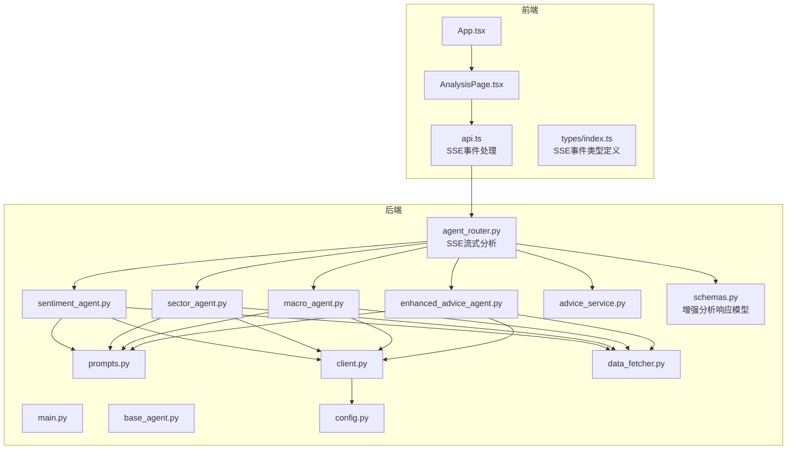
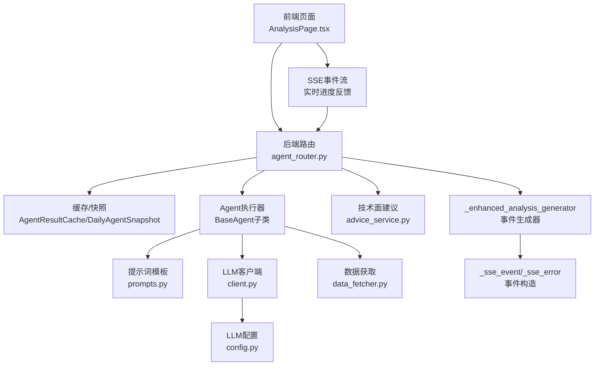
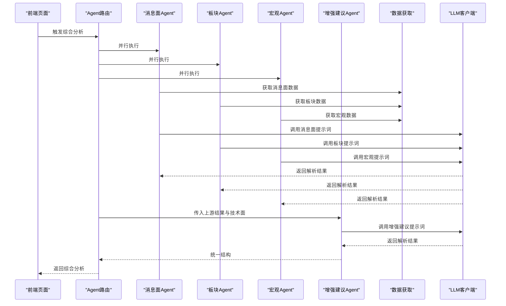
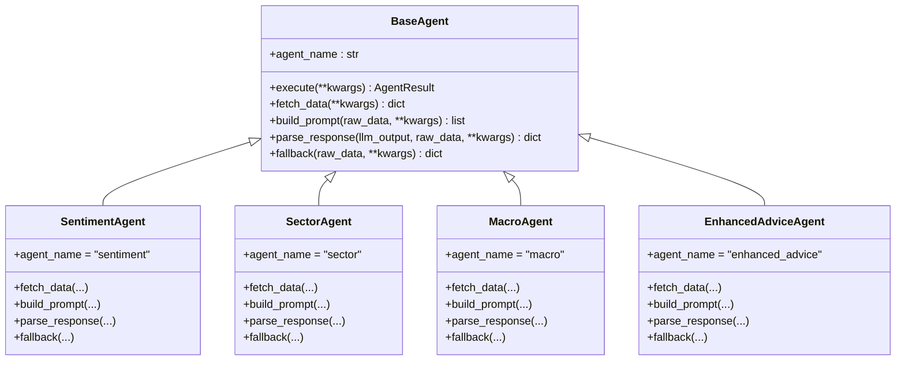
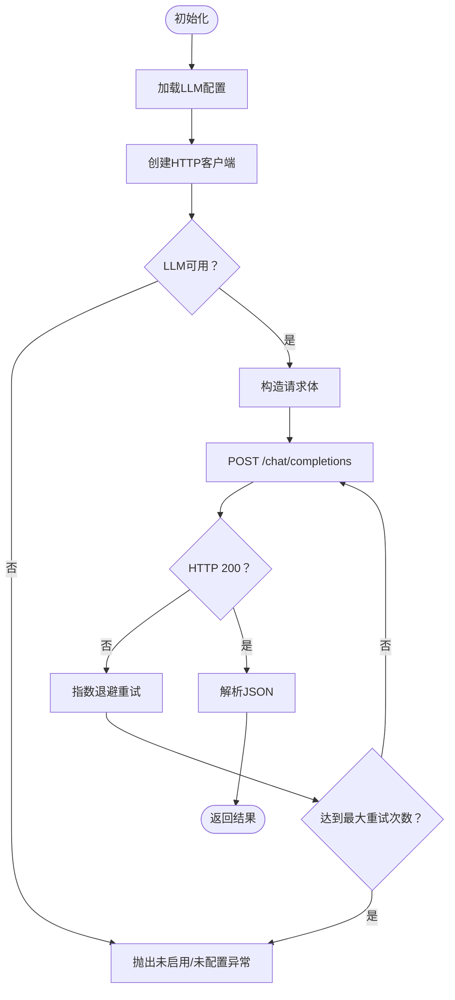
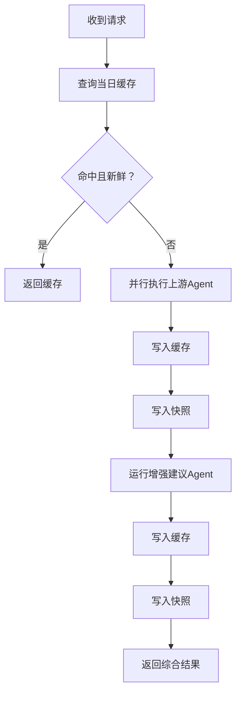
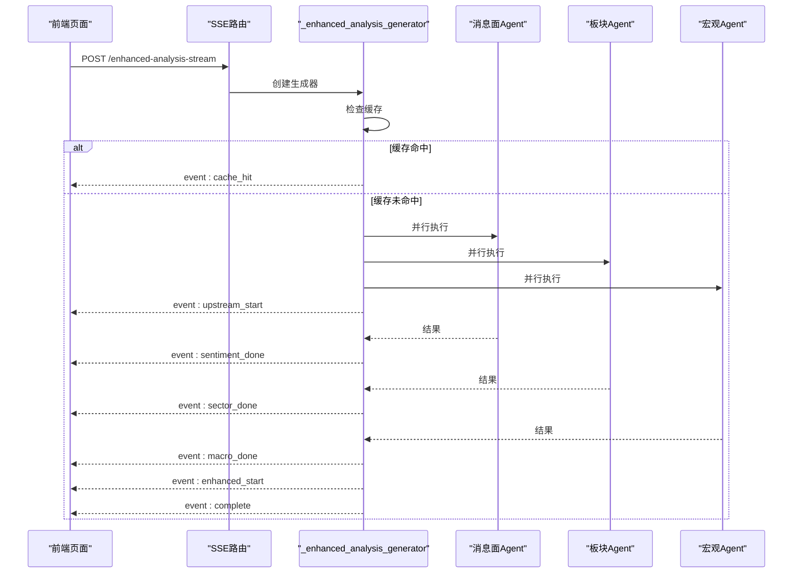
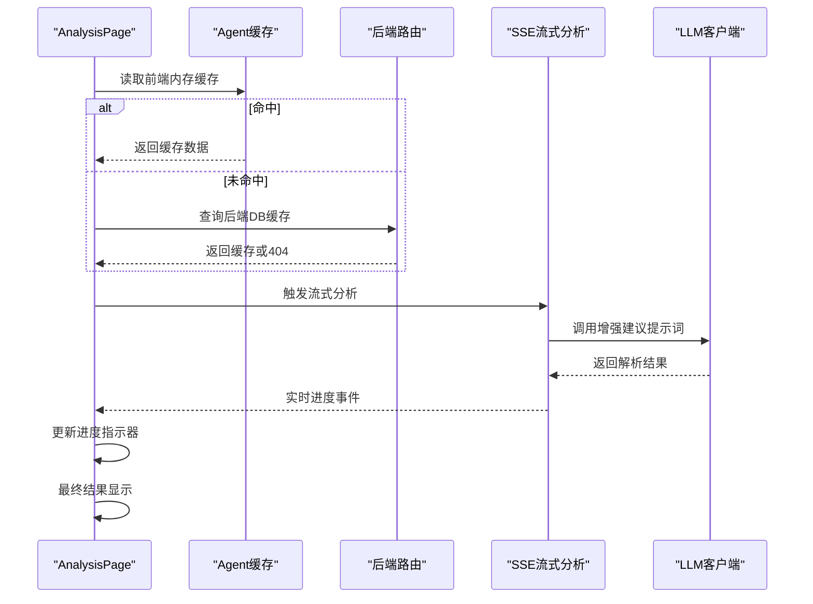
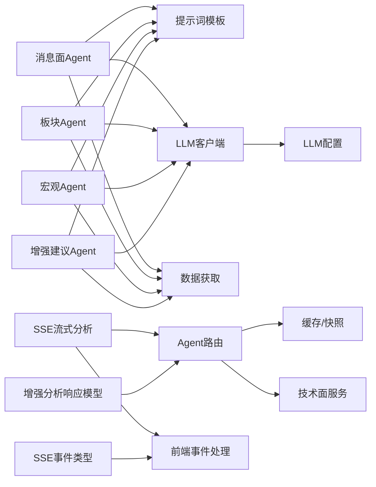

# AI提示词优化

<cite>
**本文档引用的文件**
- [backend/app/main.py](file://backend/app/main.py)
- [backend/app/llm/prompts.py](file://backend/app/llm/prompts.py)
- [backend/app/agents/base_agent.py](file://backend/app/agents/base_agent.py)
- [backend/app/agents/sentiment_agent.py](file://backend/app/agents/sentiment_agent.py)
- [backend/app/agents/sector_agent.py](file://backend/app/agents/sector_agent.py)
- [backend/app/agents/macro_agent.py](file://backend/app/agents/macro_agent.py)
- [backend/app/agents/enhanced_advice_agent.py](file://backend/app/agents/enhanced_advice_agent.py)
- [backend/app/llm/client.py](file://backend/app/llm/client.py)
- [backend/app/llm/config.py](file://backend/app/llm/config.py)
- [backend/app/routers/agent_router.py](file://backend/app/routers/agent_router.py)
- [backend/app/services/advice_service.py](file://backend/app/services/advice_service.py)
- [backend/app/services/data_fetcher.py](file://backend/app/services/data_fetcher.py)
- [frontend/src/App.tsx](file://frontend/src/App.tsx)
- [frontend/src/pages/AnalysisPage.tsx](file://frontend/src/pages/AnalysisPage.tsx)
- [frontend/src/services/api.ts](file://frontend/src/services/api.ts)
- [frontend/src/types/index.ts](file://frontend/src/types/index.ts)
- [backend/app/models/schemas.py](file://backend/app/models/schemas.py)
- [doc/产品设计文档.md](file://doc/产品设计文档.md)
</cite>

## 更新摘要
**变更内容**
- 新增流式分析系统集成，包括_sse_analysis_generator()函数实现
- 前端AnalysisPage.tsx中SSE事件处理的增强
- 新增实时进度指示器和用户反馈机制
- 更新路由与缓存策略以支持流式分析
- 新增SSE事件类型和前端事件处理逻辑

## 目录
1. [简介](#简介)
2. [项目结构](#项目结构)
3. [核心组件](#核心组件)
4. [架构总览](#架构总览)
5. [详细组件分析](#详细组件分析)
6. [依赖关系分析](#依赖关系分析)
7. [性能考量](#性能考量)
8. [故障排查指南](#故障排查指南)
9. [结论](#结论)
10. [附录](#附录)

## 简介
本项目围绕"AI提示词优化"展开，通过统一的提示词模板与Agent架构，实现消息面情绪、板块联动、宏观环境与技术面的多维度融合分析，并输出可解释的买卖建议。系统采用前后端分离架构，后端以FastAPI提供REST API，前端基于React+Ant Design构建可视化界面；数据层通过同花顺问财API获取市场与公司相关信息，同时具备缓存与快照能力，确保分析结果的可复现与高效访问。

**更新** 新增流式分析系统，支持实时进度反馈和增强的用户交互体验。系统现在提供SSE（Server-Sent Events）流式传输，用户可以在分析过程中实时看到各个Agent的执行状态和进度。

## 项目结构
项目采用分层与功能域划分：
- 后端（Python/FastAPI）
  - 应用入口与中间件配置
  - LLM提示词模板与客户端
  - Agent抽象与具体Agent实现
  - 数据获取与并行调度
  - 路由与缓存/快照管理
  - **新增** 流式分析与SSE事件处理
- 前端（React/Vite）
  - 页面与组件、主题与图标
  - API服务封装与状态管理
  - **新增** SSE事件处理与实时进度指示
- 技能（Skills）
  - 与同花顺问财对接的命令行工具集

**图表来源**
- [backend/app/main.py:1-74](file://backend/app/main.py#L1-L74)
- [backend/app/routers/agent_router.py:1-555](file://backend/app/routers/agent_router.py#L1-L555)
- [backend/app/agents/base_agent.py:1-119](file://backend/app/agents/base_agent.py#L1-L119)
- [backend/app/agents/sentiment_agent.py:1-91](file://backend/app/agents/sentiment_agent.py#L1-L91)
- [backend/app/agents/sector_agent.py:1-85](file://backend/app/agents/sector_agent.py#L1-L85)
- [backend/app/agents/macro_agent.py:1-81](file://backend/app/agents/macro_agent.py#L1-L81)
- [backend/app/agents/enhanced_advice_agent.py:1-129](file://backend/app/agents/enhanced_advice_agent.py#L1-L129)
- [backend/app/llm/prompts.py:1-366](file://backend/app/llm/prompts.py#L1-L366)
- [backend/app/llm/client.py:1-146](file://backend/app/llm/client.py#L1-L146)
- [backend/app/llm/config.py:1-36](file://backend/app/llm/config.py#L1-L36)
- [backend/app/services/data_fetcher.py:1-358](file://backend/app/services/data_fetcher.py#L1-L358)
- [backend/app/services/advice_service.py:1-193](file://backend/app/services/advice_service.py#L1-L193)
- [frontend/src/App.tsx:1-41](file://frontend/src/App.tsx#L1-L41)
- [frontend/src/pages/AnalysisPage.tsx:1-1027](file://frontend/src/pages/AnalysisPage.tsx#L1-L1027)
- [frontend/src/services/api.ts:1-303](file://frontend/src/services/api.ts#L1-L303)
- [frontend/src/types/index.ts:143-148](file://frontend/src/types/index.ts#L143-L148)
- [backend/app/models/schemas.py:182-186](file://backend/app/models/schemas.py#L182-L186)

**章节来源**
- [backend/app/main.py:1-74](file://backend/app/main.py#L1-L74)
- [frontend/src/App.tsx:1-41](file://frontend/src/App.tsx#L1-L41)

## 核心组件
- 提示词模板（prompts.py）
  - 面向消息面、板块联动、宏观环境与增强建议的标准化Prompt结构，统一输出JSON格式，便于LLM解析与前端渲染。
- Agent抽象（base_agent.py）
  - 模板方法模式定义Agent生命周期：数据获取→LLM分析→降级处理→结果封装，保证一致性与可扩展性。
- 具体Agent
  - 消息面情绪分析（sentiment_agent.py）
  - 板块联动分析（sector_agent.py）
  - 宏观环境分析（macro_agent.py）
  - 增强版买卖建议（enhanced_advice_agent.py）
- LLM客户端（client.py）
  - 统一封装OpenAI兼容接口，支持重试、JSON解析与配置注入。
- 路由与缓存（agent_router.py）
  - 提供单Agent与综合分析端点，内置缓存与快照机制，按日与9:00边界管理新鲜度。
  - **新增** SSE流式分析端点，支持实时事件推送。
- 数据获取（data_fetcher.py）
  - 统一调用同花顺问财API，支持并行请求与错误隔离，保障整体鲁棒性。
- 技术面建议（advice_service.py）
  - 基于MACD/KDJ/RSI/均线/布林带等指标生成纯技术面建议，作为增强建议的基线。
- **新增** 流式分析系统
  - 后端：_enhanced_analysis_generator()生成器函数，按阶段推送SSE事件
  - 前端：streamEnhancedAnalysis()函数处理SSE事件流，提供实时进度反馈
  - 类型定义：SSEEvent接口和SSEStage枚举类型

**章节来源**
- [backend/app/llm/prompts.py:1-366](file://backend/app/llm/prompts.py#L1-L366)
- [backend/app/agents/base_agent.py:1-119](file://backend/app/agents/base_agent.py#L1-L119)
- [backend/app/agents/sentiment_agent.py:1-91](file://backend/app/agents/sentiment_agent.py#L1-L91)
- [backend/app/agents/sector_agent.py:1-85](file://backend/app/agents/sector_agent.py#L1-L85)
- [backend/app/agents/macro_agent.py:1-81](file://backend/app/agents/macro_agent.py#L1-L81)
- [backend/app/agents/enhanced_advice_agent.py:1-129](file://backend/app/agents/enhanced_advice_agent.py#L1-L129)
- [backend/app/llm/client.py:1-146](file://backend/app/llm/client.py#L1-L146)
- [backend/app/routers/agent_router.py:366-493](file://backend/app/routers/agent_router.py#L366-L493)
- [backend/app/services/data_fetcher.py:1-358](file://backend/app/services/data_fetcher.py#L1-L358)
- [backend/app/services/advice_service.py:1-193](file://backend/app/services/advice_service.py#L1-L193)
- [frontend/src/services/api.ts:150-219](file://frontend/src/services/api.ts#L150-L219)
- [frontend/src/types/index.ts:143-148](file://frontend/src/types/index.ts#L143-L148)

## 架构总览
系统采用"前端页面—后端API—数据源"的三层架构。前端负责交互与可视化，后端提供统一的Agent分析能力与缓存策略，数据层通过同花顺问财API获取市场与公司信息。

**更新** 新增流式分析通道，支持实时事件推送与进度反馈。用户现在可以通过SSE事件流实时看到分析过程的各个阶段，包括缓存命中、上游Agent执行、增强建议生成等。

**图表来源**
- [frontend/src/pages/AnalysisPage.tsx:1-1027](file://frontend/src/pages/AnalysisPage.tsx#L1-L1027)
- [backend/app/routers/agent_router.py:366-493](file://backend/app/routers/agent_router.py#L366-L493)
- [backend/app/agents/base_agent.py:1-119](file://backend/app/agents/base_agent.py#L1-L119)
- [backend/app/llm/prompts.py:1-366](file://backend/app/llm/prompts.py#L1-L366)
- [backend/app/llm/client.py:1-146](file://backend/app/llm/client.py#L1-L146)
- [backend/app/llm/config.py:1-36](file://backend/app/llm/config.py#L1-L36)
- [backend/app/services/data_fetcher.py:1-358](file://backend/app/services/data_fetcher.py#L1-L358)
- [backend/app/services/advice_service.py:1-193](file://backend/app/services/advice_service.py#L1-L193)

## 详细组件分析

### 提示词模板与Agent执行流
- 提示词模板
  - 消息面：整合新闻、事件、财经资讯、公告、研报、基本资料、经营数据与股东信息，输出整体情绪、关键新闻与噪声比例。
  - 板块联动：整合行业基础、估值、资金流向、财务概况与概念板块，输出板块趋势、相对强度与轮动信号。
  - 宏观环境：整合指数、北向资金、涨跌停与宏观指标，输出市场阶段、风险等级与影响评估。
  - 增强建议：融合技术面、消息面、板块、宏观与基本面，输出信号、置信度、推理链与风险提示。
- Agent执行流
  - 数据获取→LLM分析→解析输出→降级回退→缓存与快照→返回统一结构。

**图表来源**
- [backend/app/routers/agent_router.py:258-354](file://backend/app/routers/agent_router.py#L258-L354)
- [backend/app/agents/sentiment_agent.py:1-91](file://backend/app/agents/sentiment_agent.py#L1-L91)
- [backend/app/agents/sector_agent.py:1-85](file://backend/app/agents/sector_agent.py#L1-L85)
- [backend/app/agents/macro_agent.py:1-81](file://backend/app/agents/macro_agent.py#L1-L81)
- [backend/app/agents/enhanced_advice_agent.py:1-129](file://backend/app/agents/enhanced_advice_agent.py#L1-L129)
- [backend/app/llm/client.py:1-146](file://backend/app/llm/client.py#L1-L146)
- [backend/app/services/data_fetcher.py:1-358](file://backend/app/services/data_fetcher.py#L1-L358)

**章节来源**
- [backend/app/llm/prompts.py:11-106](file://backend/app/llm/prompts.py#L11-L106)
- [backend/app/llm/prompts.py:113-180](file://backend/app/llm/prompts.py#L113-L180)
- [backend/app/llm/prompts.py:187-241](file://backend/app/llm/prompts.py#L187-L241)
- [backend/app/llm/prompts.py:248-365](file://backend/app/llm/prompts.py#L248-L365)
- [backend/app/agents/base_agent.py:62-102](file://backend/app/agents/base_agent.py#L62-L102)

### Agent类层次结构

**图表来源**
- [backend/app/agents/base_agent.py:46-119](file://backend/app/agents/base_agent.py#L46-L119)
- [backend/app/agents/sentiment_agent.py:12-91](file://backend/app/agents/sentiment_agent.py#L12-L91)
- [backend/app/agents/sector_agent.py:12-85](file://backend/app/agents/sector_agent.py#L12-L85)
- [backend/app/agents/macro_agent.py:12-81](file://backend/app/agents/macro_agent.py#L12-L81)
- [backend/app/agents/enhanced_advice_agent.py:11-129](file://backend/app/agents/enhanced_advice_agent.py#L11-L129)

**章节来源**
- [backend/app/agents/base_agent.py:1-119](file://backend/app/agents/base_agent.py#L1-L119)

### LLM客户端与配置
- LLM客户端
  - 支持可用性检测、文本与JSON两种回复模式、指数退避重试与JSON容错解析。
- 配置管理
  - 从.env加载LLM开关、提供商、密钥、URL、模型、温度、Token上限、超时与思考模式开关。

**图表来源**
- [backend/app/llm/client.py:30-103](file://backend/app/llm/client.py#L30-L103)
- [backend/app/llm/config.py:24-35](file://backend/app/llm/config.py#L24-L35)

**章节来源**
- [backend/app/llm/client.py:1-146](file://backend/app/llm/client.py#L1-L146)
- [backend/app/llm/config.py:1-36](file://backend/app/llm/config.py#L1-L36)

### 路由与缓存策略
- 端点设计
  - 单Agent端点：消息面、板块、宏观。
  - 综合分析端点：并行上游Agent，再运行增强建议Agent，返回完整链路结果。
  - **新增** SSE流式分析端点：实时推送分析进度事件。
- 缓存与快照
  - 按日缓存，9:00为新鲜度边界；LLM可用时跳过降级缓存；成功运行后写入每日快照表。

**图表来源**
- [backend/app/routers/agent_router.py:47-116](file://backend/app/routers/agent_router.py#L47-L116)
- [backend/app/routers/agent_router.py:282-354](file://backend/app/routers/agent_router.py#L282-L354)

**章节来源**
- [backend/app/routers/agent_router.py:1-555](file://backend/app/routers/agent_router.py#L1-L555)

### 流式分析系统与SSE事件处理
**新增** 系统实现了完整的流式分析架构，提供实时进度反馈和增强的用户体验。

- SSE事件类型
  - cache_hit：缓存命中，直接返回完整结果
  - upstream_start：上游Agent开始并行执行
  - sentiment_done：消息面分析完成
  - sector_done：板块分析完成
  - macro_done：宏观分析完成
  - enhanced_start：增强建议开始
  - complete：所有分析完成，返回最终结果
- 前端事件处理
  - streamEnhancedAnalysis()函数建立SSE连接
  - _handleSSEEvent()回调处理不同阶段的事件
  - 实时更新AI分析状态和进度指示器

**图表来源**
- [backend/app/routers/agent_router.py:378-483](file://backend/app/routers/agent_router.py#L378-L483)
- [frontend/src/services/api.ts:165-219](file://frontend/src/services/api.ts#L165-L219)
- [frontend/src/pages/AnalysisPage.tsx:181-204](file://frontend/src/pages/AnalysisPage.tsx#L181-L204)

**章节来源**
- [backend/app/routers/agent_router.py:366-493](file://backend/app/routers/agent_router.py#L366-L493)
- [frontend/src/services/api.ts:150-219](file://frontend/src/services/api.ts#L150-L219)
- [frontend/src/pages/AnalysisPage.tsx:181-204](file://frontend/src/pages/AnalysisPage.tsx#L181-L204)

### 前端集成与用户体验
- 页面逻辑
  - 首次进入时优先读取前端内存缓存，随后尝试后端DB缓存；支持手动刷新与清除缓存。
  - AI分析卡片显示信号、置信度、推理链、风险提示与仓位建议，并提供雷达图展示五维评分。
  - **新增** 实时进度指示器：显示各Agent执行状态（pending/running/done）。
- 主题与布局
  - Ant Design暗色主题，图表采用ECharts，支持触控板手势缩放与拖拽平移。

**图表来源**
- [frontend/src/pages/AnalysisPage.tsx:96-126](file://frontend/src/pages/AnalysisPage.tsx#L96-L126)
- [frontend/src/pages/AnalysisPage.tsx:128-161](file://frontend/src/pages/AnalysisPage.tsx#L128-L161)
- [frontend/src/pages/AnalysisPage.tsx:184-196](file://frontend/src/pages/AnalysisPage.tsx#L184-L196)
- [backend/app/routers/agent_router.py:486-493](file://backend/app/routers/agent_router.py#L486-L493)

**章节来源**
- [frontend/src/pages/AnalysisPage.tsx:1-1027](file://frontend/src/pages/AnalysisPage.tsx#L1-L1027)
- [frontend/src/App.tsx:1-41](file://frontend/src/App.tsx#L1-L41)

## 依赖关系分析
- 组件耦合
  - Agent依赖LLM客户端与提示词模板，数据获取通过data_fetcher模块统一入口。
  - 路由层协调Agent执行、缓存与快照，增强建议Agent依赖技术面服务与数据库中的持仓信息。
  - **新增** SSE流式分析依赖StreamingResponse和Generator机制。
- 外部依赖
  - 同花顺问财API：通过IWENCAI_API_KEY鉴权，支持并行查询与错误隔离。
  - LLM服务：OpenAI兼容接口，支持多种提供商与模型。

**图表来源**
- [backend/app/agents/sentiment_agent.py:1-91](file://backend/app/agents/sentiment_agent.py#L1-L91)
- [backend/app/agents/sector_agent.py:1-85](file://backend/app/agents/sector_agent.py#L1-L85)
- [backend/app/agents/macro_agent.py:1-81](file://backend/app/agents/macro_agent.py#L1-L81)
- [backend/app/agents/enhanced_advice_agent.py:1-129](file://backend/app/agents/enhanced_advice_agent.py#L1-L129)
- [backend/app/llm/prompts.py:1-366](file://backend/app/llm/prompts.py#L1-L366)
- [backend/app/llm/client.py:1-146](file://backend/app/llm/client.py#L1-L146)
- [backend/app/llm/config.py:1-36](file://backend/app/llm/config.py#L1-L36)
- [backend/app/services/data_fetcher.py:1-358](file://backend/app/services/data_fetcher.py#L1-L358)
- [backend/app/routers/agent_router.py:366-493](file://backend/app/routers/agent_router.py#L366-L493)
- [backend/app/services/advice_service.py:1-193](file://backend/app/services/advice_service.py#L1-L193)
- [frontend/src/services/api.ts:150-219](file://frontend/src/services/api.ts#L150-L219)
- [frontend/src/types/index.ts:143-148](file://frontend/src/types/index.ts#L143-L148)
- [backend/app/models/schemas.py:182-186](file://backend/app/models/schemas.py#L182-L186)

**章节来源**
- [backend/app/services/data_fetcher.py:1-358](file://backend/app/services/data_fetcher.py#L1-L358)
- [backend/app/llm/client.py:1-146](file://backend/app/llm/client.py#L1-L146)

## 性能考量
- 并行化
  - 上游Agent并行执行，减少端到端等待时间；数据获取层使用线程池并发请求。
- 缓存与快照
  - 按日缓存与9:00新鲜度边界，避免重复计算；增强建议端点优先命中缓存。
- LLM优化
  - 可配置超时与重试；可关闭深度思考模式以降低延迟；JSON解析具备容错提取。
- 前端体验
  - 图表支持触控板手势，提升浏览效率；内存缓存与后端DB缓存双层恢复，减少闪烁。
- **新增** 流式分析性能
  - SSE事件推送减少前端轮询开销，实时反馈分析进度。
  - 事件流式传输，避免大体积响应阻塞。
  - 前端AbortController支持中断SSE连接，避免内存泄漏。

[本节为通用指导，无需特定文件分析]

## 故障排查指南
- LLM不可用
  - 检查.env中LLM开关、提供商、密钥、URL与模型配置；通过LLM状态端点确认可用性。
  - 若提示词解析失败，查看客户端JSON容错日志与异常堆栈。
- 数据获取失败
  - 确认IWENCAI_API_KEY已设置；查看data_fetcher日志，定位具体API调用异常。
- 缓存与快照异常
  - 清除指定股票的Agent缓存与数据源缓存；检查数据库连接与权限。
- 前端显示异常
  - 检查路由与页面组件状态；确认缓存键与时间戳逻辑；必要时手动刷新。
- **新增** SSE流式分析故障排查
  - 检查SSE端点是否正确返回text/event-stream类型响应。
  - 确认前端streamEnhancedAnalysis()函数正确处理SSE事件流。
  - 验证事件格式符合SSE标准（event: 和data:行）。
  - 检查AbortController是否正确清理SSE连接。
  - 确认前端AI分析状态机正确处理各种事件类型。

**章节来源**
- [backend/app/llm/client.py:104-126](file://backend/app/llm/client.py#L104-L126)
- [backend/app/routers/agent_router.py:384-394](file://backend/app/routers/agent_router.py#L384-L394)
- [backend/app/services/data_fetcher.py:24-64](file://backend/app/services/data_fetcher.py#L24-L64)
- [frontend/src/services/api.ts:165-219](file://frontend/src/services/api.ts#L165-L219)

## 结论
本项目通过标准化提示词模板与Agent架构，实现了消息面、板块、宏观与技术面的多维度融合分析，并以缓存与快照机制保障性能与可复现性。前端提供直观的可视化与交互体验，后端以并行化与容错设计确保稳定性。

**更新** 新增的流式分析系统显著提升了用户体验，通过实时进度反馈和SSE事件推送，用户可以清晰地了解分析过程的各个阶段。系统采用前后端分离架构，后端以FastAPI提供REST API，前端基于React+Ant Design构建可视化界面；数据层通过同花顺问财API获取市场与公司相关信息，同时具备缓存与快照能力，确保分析结果的可复现与高效访问。

系统现在支持三种分析模式：
1. **传统模式**：一次性返回完整分析结果
2. **缓存模式**：直接返回缓存结果（如果可用）
3. **流式模式**：实时推送分析进度事件

建议持续优化提示词模板与Agent降级策略，进一步提升在复杂场景下的鲁棒性与可解释性。流式分析系统的集成为未来的性能优化和用户体验改进奠定了良好基础。

[本节为总结性内容，无需特定文件分析]

## 附录
- 技能工具
  - 公告搜索技能提供命令行工具，支持批量查询与多格式输出，便于离线验证与数据导出。
- **新增** SSE事件类型参考
  - cache_hit：缓存命中事件，包含完整的增强分析结果
  - upstream_start：上游Agent开始事件，包含并行执行的Agent列表
  - sentiment_done：消息面分析完成事件，包含结果和是否来自缓存的信息
  - sector_done：板块分析完成事件，包含结果和是否来自缓存的信息
  - macro_done：宏观分析完成事件，包含结果和是否来自缓存的信息
  - enhanced_start：增强建议开始事件，表示开始生成综合建议
  - complete：分析完成事件，包含完整的增强分析结果

**章节来源**
- [skills/公告搜索/announcement-search/scripts/__main__.py:141-223](file://skills/公告搜索/announcement-search/scripts/__main__.py#L141-L223)
- [frontend/src/types/index.ts:150-158](file://frontend/src/types/index.ts#L150-L158)
- [backend/app/models/schemas.py:182-186](file://backend/app/models/schemas.py#L182-L186)