# 数据流设计

<cite>
**本文引用的文件**
- [backend/app/main.py](file://backend/app/main.py)
- [backend/app/routers/stock_router.py](file://backend/app/routers/stock_router.py)
- [backend/app/routers/data_source_router.py](file://backend/app/routers/data_source_router.py)
- [backend/app/routers/agent_router.py](file://backend/app/routers/agent_router.py)
- [backend/app/db/database.py](file://backend/app/db/database.py)
- [backend/app/models/models.py](file://backend/app/models/models.py)
- [backend/app/models/schemas.py](file://backend/app/models/schemas.py)
- [backend/app/services/stock_service.py](file://backend/app/services/stock_service.py)
- [backend/app/services/advice_service.py](file://backend/app/services/advice_service.py)
- [backend/app/services/profile_service.py](file://backend/app/services/profile_service.py)
- [backend/app/services/data_fetcher.py](file://backend/app/services/data_fetcher.py)
- [backend/app/services/data_source_service.py](file://backend/app/services/data_source_service.py)
- [backend/app/agents/sentiment_agent.py](file://backend/app/agents/sentiment_agent.py)
- [backend/app/agents/enhanced_advice_agent.py](file://backend/app/agents/enhanced_advice_agent.py)
- [frontend/src/services/api.ts](file://frontend/src/services/api.ts)
- [frontend/src/types/index.ts](file://frontend/src/types/index.ts)
- [frontend/src/components/MainLayout.tsx](file://frontend/src/components/MainLayout.tsx)
- [frontend/src/pages/AnalysisPage.tsx](file://frontend/src/pages/AnalysisPage.tsx)
- [frontend/src/pages/TradesPage.tsx](file://frontend/src/pages/TradesPage.tsx)
- [frontend/src/pages/SentimentPage.tsx](file://frontend/src/pages/SentimentPage.tsx)
- [frontend/src/hooks/useDataSource.ts](file://frontend/src/hooks/useDataSource.ts)
- [doc/技术架构文档.md](file://doc/技术架构文档.md)
- [doc/产品设计文档.md](file://doc/产品设计文档.md)
- [doc/API实测/2026-04-14-hithink-api-test-report.md](file://doc/API实测/2026-04-14-hithink-api-test-report.md)
- [doc/API实测/2026-04-14-hithink-query-fix-record.md](file://doc/API实测/2026-04-14-hithink-query-fix-record.md)
</cite>

## 目录
1. [简介](#简介)
2. [项目结构](#项目结构)
3. [核心组件](#核心组件)
4. [架构总览](#架构总览)
5. [详细组件分析](#详细组件分析)
6. [依赖分析](#依赖分析)
7. [性能考量](#性能考量)
8. [故障排查指南](#故障排查指南)
9. [结论](#结论)
10. [附录](#附录)

## 简介
本文件为 Stock Foker 应用的"数据流设计"文档，系统性阐述从前端用户交互到后端数据处理的完整数据流向，覆盖用户输入捕获、API 请求发送、数据验证、业务逻辑处理、数据持久化与响应返回的全流程。同时，详细说明数据传输格式（请求参数结构、响应数据模型、错误信息格式与状态码规范），并解释数据缓存策略（前端缓存机制、后端缓存管理、增量更新算法与数据一致性保证）。最后，提供数据验证与安全措施（输入验证、权限控制、SQL 注入防护与 XSS 防护）以及典型用户操作（股票搜索、技术分析、交易记录、消息面分析）的数据流与时序图。

**更新** 本次更新重点反映了新增的独立数据源获取与缓存系统，提供稳定可靠的原始数据支撑，包含数据源路由、数据源服务、数据获取服务、前端Hook等组件的重大架构优化。

## 项目结构
项目采用前后端分离架构：前端使用 React + Vite + TypeScript，后端使用 FastAPI + SQLAlchemy + SQLite。前端通过 Axios 发起 /api 前缀的请求，Vite 将 /api 代理至后端；后端路由统一挂载在 /api 前缀下，通过服务层完成数据获取与计算，并持久化到 SQLite。

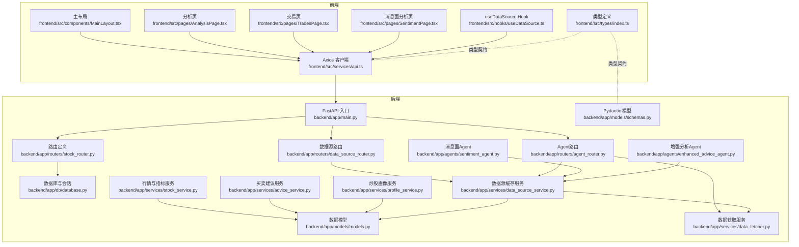

**图表来源**
- [backend/app/main.py:1-28](file://backend/app/main.py#L1-L28)
- [backend/app/routers/stock_router.py:1-197](file://backend/app/routers/stock_router.py#L1-L197)
- [backend/app/routers/data_source_router.py:1-68](file://backend/app/routers/data_source_router.py#L1-L68)
- [backend/app/routers/agent_router.py:1-200](file://backend/app/routers/agent_router.py#L1-L200)
- [backend/app/db/database.py:1-24](file://backend/app/db/database.py#L1-L24)
- [backend/app/models/models.py:1-151](file://backend/app/models/models.py#L1-L151)
- [backend/app/models/schemas.py:1-118](file://backend/app/models/schemas.py#L1-L118)
- [backend/app/services/stock_service.py:1-327](file://backend/app/services/stock_service.py#L1-L327)
- [backend/app/services/advice_service.py:1-193](file://backend/app/services/advice_service.py#L1-L193)
- [backend/app/services/profile_service.py:1-114](file://backend/app/services/profile_service.py#L1-L114)
- [backend/app/services/data_fetcher.py:1-356](file://backend/app/services/data_fetcher.py#L1-L356)
- [backend/app/services/data_source_service.py:1-169](file://backend/app/services/data_source_service.py#L1-L169)
- [frontend/src/services/api.ts:1-188](file://frontend/src/services/api.ts#L1-L188)
- [frontend/src/types/index.ts:1-94](file://frontend/src/types/index.ts#L1-L94)
- [frontend/src/hooks/useDataSource.ts:1-169](file://frontend/src/hooks/useDataSource.ts#L1-L169)

**章节来源**
- [doc/技术架构文档.md:19-67](file://doc/技术架构文档.md#L19-L67)
- [backend/app/main.py:1-28](file://backend/app/main.py#L1-L28)
- [frontend/src/services/api.ts:1-188](file://frontend/src/services/api.ts#L1-L188)

## 核心组件
- 前端 Axios 客户端：封装 /api 前缀的请求方法，统一处理参数与响应类型。
- 后端 FastAPI 应用：注册 CORS、挂载路由、启动数据库。
- 路由层：定义 /api 前缀下的各端点，负责参数解析、异常处理与调用服务层。
- 服务层：
  - 行情与指标服务：负责股票搜索、K线获取与技术指标计算、本地缓存与增量更新。
  - 买卖建议服务：基于技术指标生成带推理过程的建议。
  - 炒股画像服务：基于交易记录生成画像维度。
  - **数据获取服务**：统一管理 Hithink API 调用，包含并行处理和查询词优化。
  - **数据源缓存服务**：独立管理原始 Hithink API 数据的获取与缓存，支持每日新鲜度边界。
- 数据层：SQLAlchemy 模型与 SQLite 持久化，包含关注股票、交易记录、K线缓存、Agent 结果缓存、数据源缓存等多张表。

**更新** 新增数据源缓存服务和数据获取服务，提供独立于 Agent 的原始数据管理能力。

**章节来源**
- [frontend/src/services/api.ts:1-188](file://frontend/src/services/api.ts#L1-L188)
- [backend/app/routers/stock_router.py:1-197](file://backend/app/routers/stock_router.py#L1-L197)
- [backend/app/routers/data_source_router.py:1-68](file://backend/app/routers/data_source_router.py#L1-L68)
- [backend/app/routers/agent_router.py:1-200](file://backend/app/routers/agent_router.py#L1-L200)
- [backend/app/services/stock_service.py:1-327](file://backend/app/services/stock_service.py#L1-L327)
- [backend/app/services/advice_service.py:1-193](file://backend/app/services/advice_service.py#L1-L193)
- [backend/app/services/profile_service.py:1-114](file://backend/app/services/profile_service.py#L1-L114)
- [backend/app/services/data_fetcher.py:1-356](file://backend/app/services/data_fetcher.py#L1-L356)
- [backend/app/services/data_source_service.py:1-169](file://backend/app/services/data_source_service.py#L1-L169)
- [backend/app/models/models.py:1-151](file://backend/app/models/models.py#L1-L151)

## 架构总览
下图展示了从用户操作到数据返回的总体数据流，涵盖前端页面、API 调用、后端路由、服务层与数据库的协作关系。

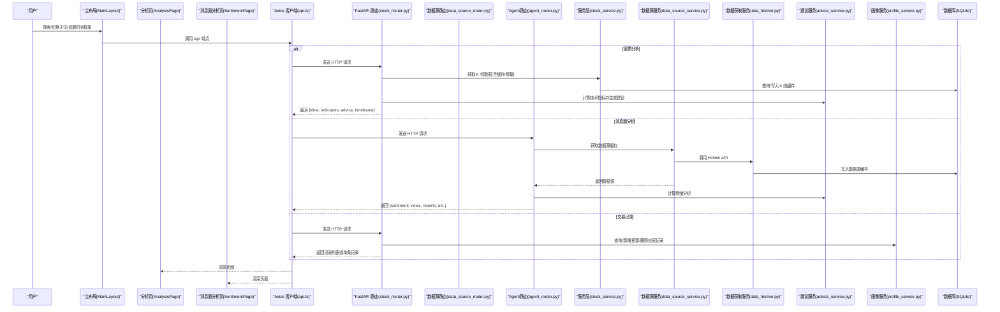

**图表来源**
- [frontend/src/components/MainLayout.tsx:1-281](file://frontend/src/components/MainLayout.tsx#L1-L281)
- [frontend/src/pages/AnalysisPage.tsx:1-213](file://frontend/src/pages/AnalysisPage.tsx#L1-L213)
- [frontend/src/pages/SentimentPage.tsx:1-535](file://frontend/src/pages/SentimentPage.tsx#L1-L535)
- [frontend/src/services/api.ts:1-188](file://frontend/src/services/api.ts#L1-L188)
- [backend/app/routers/stock_router.py:1-197](file://backend/app/routers/stock_router.py#L1-L197)
- [backend/app/routers/data_source_router.py:1-68](file://backend/app/routers/data_source_router.py#L1-L68)
- [backend/app/routers/agent_router.py:1-200](file://backend/app/routers/agent_router.py#L1-L200)
- [backend/app/services/stock_service.py:1-327](file://backend/app/services/stock_service.py#L1-L327)
- [backend/app/services/advice_service.py:1-193](file://backend/app/services/advice_service.py#L1-L193)
- [backend/app/services/profile_service.py:1-114](file://backend/app/services/profile_service.py#L1-L114)
- [backend/app/services/data_source_service.py:1-169](file://backend/app/services/data_source_service.py#L1-L169)
- [backend/app/services/data_fetcher.py:1-356](file://backend/app/services/data_fetcher.py#L1-L356)
- [backend/app/db/database.py:1-24](file://backend/app/db/database.py#L1-L24)

## 详细组件分析

### 前端数据流与类型契约
- Axios 客户端集中封装所有 /api 调用，统一 baseURL 为 /api，并导出 typed 方法用于股票关注、搜索、分析、交易记录、画像查询和数据源获取。
- 类型定义文件提供前后端一致的数据模型，确保请求/响应字段与枚举值保持一致。

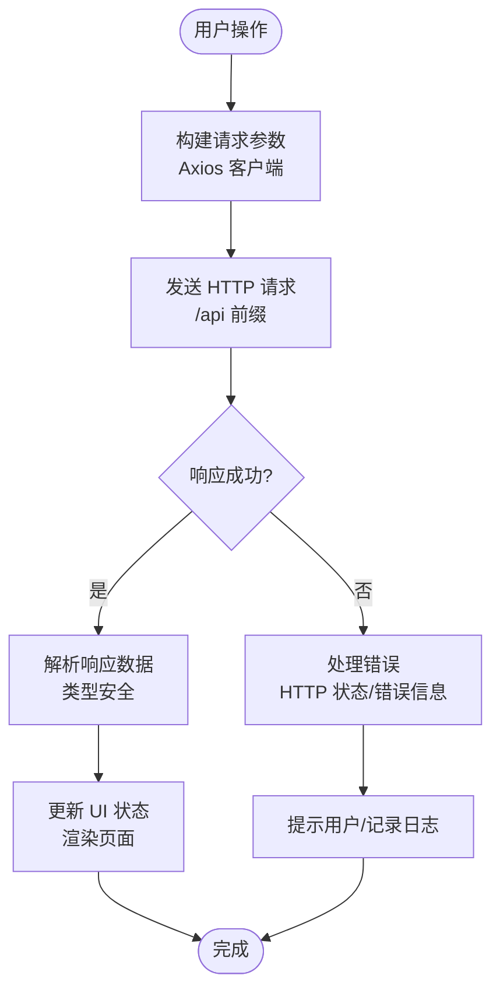

**图表来源**
- [frontend/src/services/api.ts:1-188](file://frontend/src/services/api.ts#L1-L188)
- [frontend/src/types/index.ts:1-94](file://frontend/src/types/index.ts#L1-L94)

**章节来源**
- [frontend/src/services/api.ts:1-188](file://frontend/src/services/api.ts#L1-L188)
- [frontend/src/types/index.ts:1-94](file://frontend/src/types/index.ts#L1-L94)

### 后端路由与数据验证
- 路由层统一挂载在 /api 前缀，使用 Pydantic 模型进行请求体与路径/查询参数的自动验证与序列化。
- 对外暴露关注管理、股票搜索、K线与分析、交易记录、炒股画像、数据源获取、Agent 分析等端点。

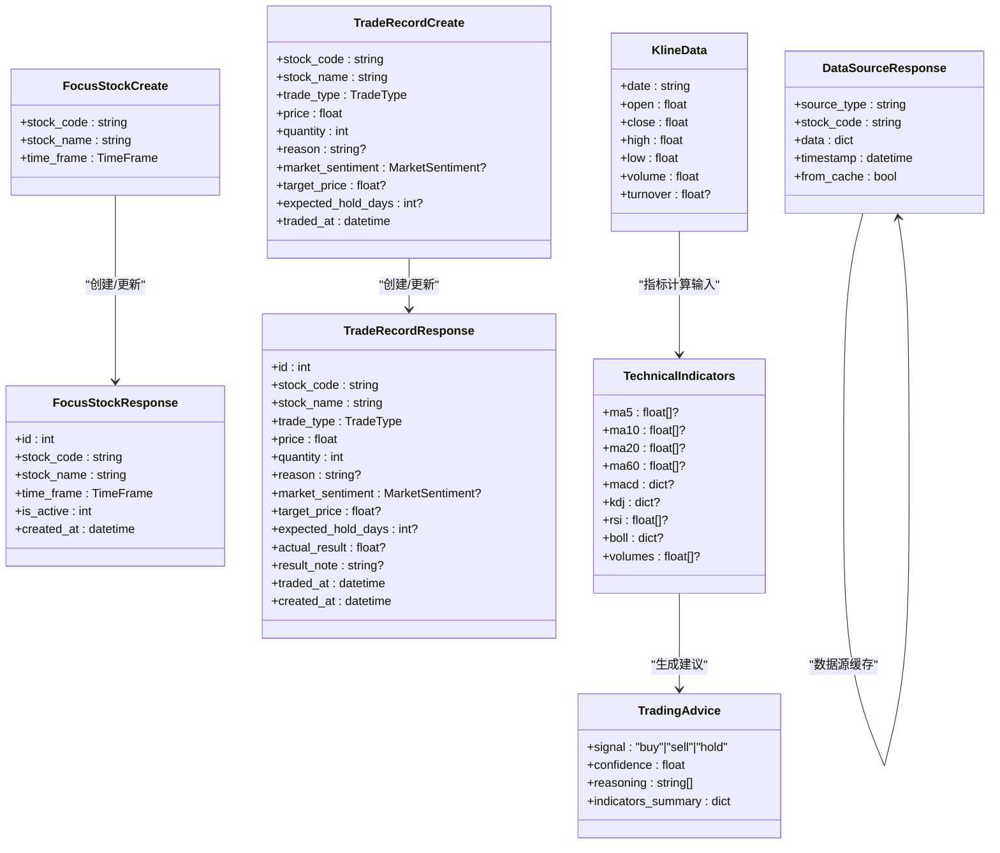

**图表来源**
- [backend/app/models/schemas.py:1-118](file://backend/app/models/schemas.py#L1-L118)
- [backend/app/models/models.py:1-151](file://backend/app/models/models.py#L1-L151)
- [frontend/src/services/api.ts:155-188](file://frontend/src/services/api.ts#L155-L188)

**章节来源**
- [backend/app/routers/stock_router.py:1-197](file://backend/app/routers/stock_router.py#L1-L197)
- [backend/app/routers/data_source_router.py:1-68](file://backend/app/routers/data_source_router.py#L1-L68)
- [backend/app/routers/agent_router.py:1-200](file://backend/app/routers/agent_router.py#L1-L200)
- [backend/app/models/schemas.py:1-118](file://backend/app/models/schemas.py#L1-L118)

### 数据库模型与关系
- 关注股票表：记录当前关注的股票与时间框架。
- 交易记录表：记录买入/卖出操作及结果。
- K线缓存表：按 stock_code + period + date 唯一键缓存历史 K 线，支持增量更新。
- **数据源缓存表**：独立存储原始 Hithink API 响应，按 stock_code + source_type + cache_key 唯一。
- **Agent 结果缓存表**：存储 Agent 分析结果，按 agent_name + stock_code + cache_key 唯一。
- **每日 Agent 快照表**：每种 Agent 每支股票每天保留一条最新关键指标快照。

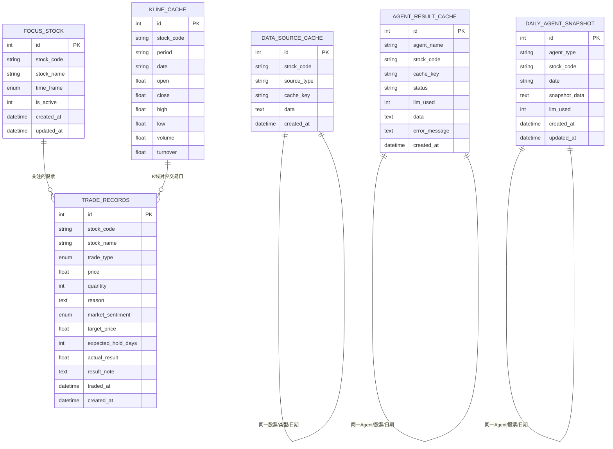

**图表来源**
- [backend/app/models/models.py:25-151](file://backend/app/models/models.py#L25-L151)

**章节来源**
- [backend/app/models/models.py:1-151](file://backend/app/models/models.py#L1-L151)

### 股票搜索与技术分析数据流
- 股票搜索：路由层调用服务层搜索函数，返回匹配结果列表。
- 技术分析：路由层组合 K 线获取、指标计算与建议生成，返回完整分析结果。

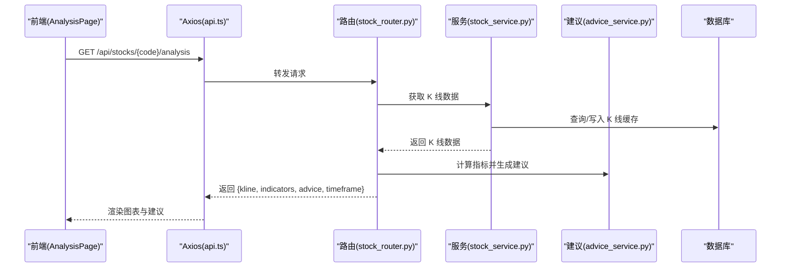

**图表来源**
- [frontend/src/pages/AnalysisPage.tsx:1-213](file://frontend/src/pages/AnalysisPage.tsx#L1-L213)
- [frontend/src/services/api.ts:1-188](file://frontend/src/services/api.ts#L1-L188)
- [backend/app/routers/stock_router.py:98-131](file://backend/app/routers/stock_router.py#L98-L131)
- [backend/app/services/stock_service.py:131-253](file://backend/app/services/stock_service.py#L131-L253)
- [backend/app/services/advice_service.py:4-173](file://backend/app/services/advice_service.py#L4-L173)

**章节来源**
- [backend/app/routers/stock_router.py:98-131](file://backend/app/routers/stock_router.py#L98-L131)
- [backend/app/services/stock_service.py:131-253](file://backend/app/services/stock_service.py#L131-L253)
- [backend/app/services/advice_service.py:4-173](file://backend/app/services/advice_service.py#L4-L173)

### 数据源获取与缓存系统
**更新** 新增独立的数据源获取与缓存系统，提供稳定可靠的原始数据支撑。

- 数据源路由：提供 /api/data-source/{stock_code}/{source_type} 端点，支持缓存查询和强制刷新。
- 数据源服务：管理 15 种数据源类型（新闻、公告、研报、基本资料、财务数据等），实现每日新鲜度边界缓存。
- 数据获取服务：统一调用 Hithink API，包含并行处理和查询词优化，解决 API 限制问题。
- 前端 Hook：useDataSource 提供模块级内存缓存，支持跨组件共享和批量清理。

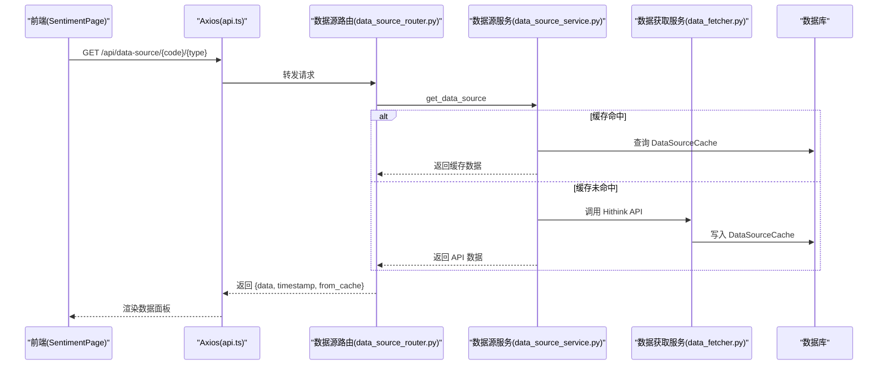

**图表来源**
- [frontend/src/pages/SentimentPage.tsx:70-269](file://frontend/src/pages/SentimentPage.tsx#L70-L269)
- [frontend/src/services/api.ts:155-188](file://frontend/src/services/api.ts#L155-L188)
- [frontend/src/hooks/useDataSource.ts:1-169](file://frontend/src/hooks/useDataSource.ts#L1-L169)
- [backend/app/routers/data_source_router.py:22-68](file://backend/app/routers/data_source_router.py#L22-L68)
- [backend/app/services/data_source_service.py:130-169](file://backend/app/services/data_source_service.py#L130-L169)
- [backend/app/services/data_fetcher.py:24-64](file://backend/app/services/data_fetcher.py#L24-L64)

**章节来源**
- [backend/app/routers/data_source_router.py:1-68](file://backend/app/routers/data_source_router.py#L1-L68)
- [backend/app/services/data_source_service.py:1-169](file://backend/app/services/data_source_service.py#L1-L169)
- [backend/app/services/data_fetcher.py:1-356](file://backend/app/services/data_fetcher.py#L1-L356)
- [frontend/src/hooks/useDataSource.ts:1-169](file://frontend/src/hooks/useDataSource.ts#L1-L169)

### Agent 分析与并行处理
**更新** Agent 分析现在可以利用独立的数据源缓存服务，支持并行获取多种数据源。

- 消息面分析：SentimentAgent 通过数据源服务获取新闻、公告、研报、基本资料、财务数据等。
- 增强分析：EnhancedAdviceAgent 并行获取研报、业务数据、基本资料、股东数据。
- 并行处理：使用 ThreadPoolExecutor 实现多数据源并发获取，提升响应速度。

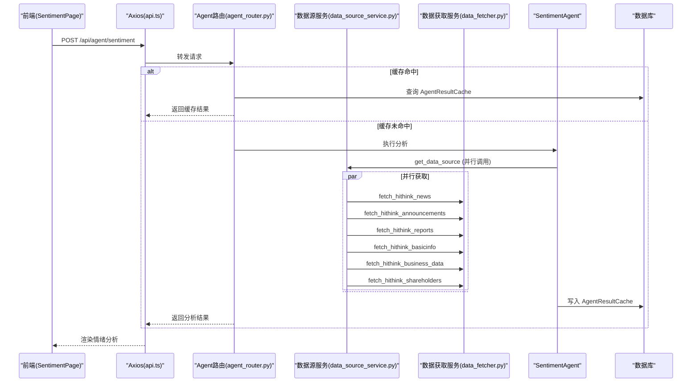

**图表来源**
- [frontend/src/pages/SentimentPage.tsx:70-269](file://frontend/src/pages/SentimentPage.tsx#L70-L269)
- [frontend/src/services/api.ts:117-120](file://frontend/src/services/api.ts#L117-L120)
- [backend/app/routers/agent_router.py:186-200](file://backend/app/routers/agent_router.py#L186-L200)
- [backend/app/agents/sentiment_agent.py:26-46](file://backend/app/agents/sentiment_agent.py#L26-L46)
- [backend/app/services/data_source_service.py:130-169](file://backend/app/services/data_source_service.py#L130-L169)
- [backend/app/services/data_fetcher.py:106-126](file://backend/app/services/data_fetcher.py#L106-L126)

**章节来源**
- [backend/app/routers/agent_router.py:1-200](file://backend/app/routers/agent_router.py#L1-L200)
- [backend/app/agents/sentiment_agent.py:1-46](file://backend/app/agents/sentiment_agent.py#L1-L46)
- [backend/app/agents/enhanced_advice_agent.py:1-74](file://backend/app/agents/enhanced_advice_agent.py#L1-L74)
- [backend/app/services/data_fetcher.py:106-126](file://backend/app/services/data_fetcher.py#L106-L126)

### 交易记录管理数据流
- 列表：按条件查询并限制数量返回。
- 新增：校验后写入数据库。
- 更新/删除：按 ID 查找并更新或删除。

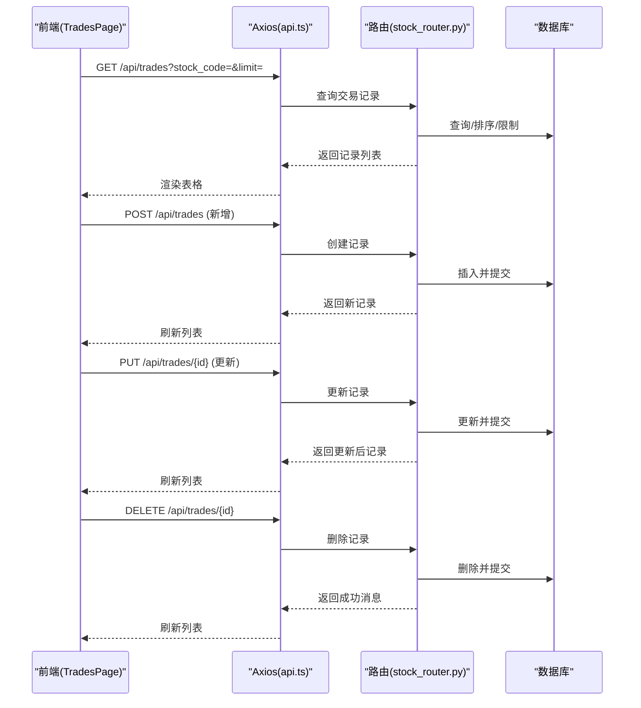

**图表来源**
- [frontend/src/pages/TradesPage.tsx:1-260](file://frontend/src/pages/TradesPage.tsx#L1-L260)
- [frontend/src/services/api.ts:47-67](file://frontend/src/services/api.ts#L47-L67)
- [backend/app/routers/stock_router.py:136-184](file://backend/app/routers/stock_router.py#L136-L184)
- [backend/app/db/database.py:14-23](file://backend/app/db/database.py#L14-L23)

**章节来源**
- [backend/app/routers/stock_router.py:136-184](file://backend/app/routers/stock_router.py#L136-L184)
- [frontend/src/pages/TradesPage.tsx:1-260](file://frontend/src/pages/TradesPage.tsx#L1-L260)

### 炒股画像数据流
- 路由层调用画像服务，服务层聚合交易记录并计算画像维度，返回结构化结果。

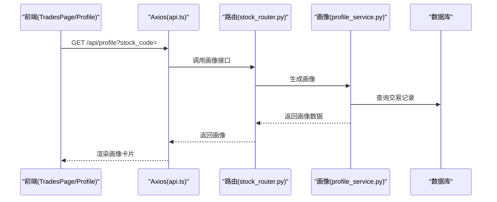

**图表来源**
- [frontend/src/pages/TradesPage.tsx:1-260](file://frontend/src/pages/TradesPage.tsx#L1-L260)
- [frontend/src/services/api.ts:63-67](file://frontend/src/services/api.ts#L63-L67)
- [backend/app/routers/stock_router.py:189-196](file://backend/app/routers/stock_router.py#L189-L196)
- [backend/app/services/profile_service.py:6-97](file://backend/app/services/profile_service.py#L6-L97)

**章节来源**
- [backend/app/routers/stock_router.py:189-196](file://backend/app/routers/stock_router.py#L189-L196)
- [backend/app/services/profile_service.py:6-97](file://backend/app/services/profile_service.py#L6-L97)

## 依赖分析
- 前端依赖：Axios、Ant Design、ECharts-for-React、Day.js、React Router。
- 后端依赖：FastAPI、SQLAlchemy、pandas、pandas-ta、AkShare、Requests。
- **新增依赖**：concurrent.futures 用于并行处理，urllib.request 用于 Hithink API 调用。
- 前端与后端通过 /api 前缀通信，Vite 配置将 /api 代理到后端，避免跨域问题。

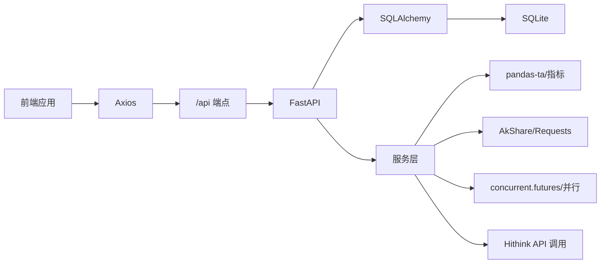

**图表来源**
- [doc/技术架构文档.md:3-18](file://doc/技术架构文档.md#L3-L18)
- [frontend/src/services/api.ts:1-188](file://frontend/src/services/api.ts#L1-L188)
- [backend/app/routers/stock_router.py:1-197](file://backend/app/routers/stock_router.py#L1-L197)
- [backend/app/services/stock_service.py:1-327](file://backend/app/services/stock_service.py#L1-L327)
- [backend/app/services/data_fetcher.py:14-15](file://backend/app/services/data_fetcher.py#L14-L15)

**章节来源**
- [doc/技术架构文档.md:3-18](file://doc/技术架构文档.md#L3-L18)
- [backend/app/main.py:1-28](file://backend/app/main.py#L1-L28)

## 性能考量
- 前端性能：ECharts 渲染 K 线与指标，支持缩放与滑条；Ant Design 表格分页加载，减少一次性渲染压力。
- 后端性能：K 线数据本地缓存与增量更新，避免重复拉取远程数据；pandas-ta 在内存中计算指标，返回前进行序列化。
- **新增性能优化**：
  - 并行处理：使用 ThreadPoolExecutor 并行获取多个数据源，最大并发数限制为 8。
  - 查询词优化：针对 Hithink API 的限制，将复合查询拆分为独立查询，避免数据缺失。
  - 缓存策略：数据源缓存按每日 09:00 为新鲜度边界，Agent 结果缓存同样遵循此规则。
  - 内存缓存：前端 useDataSource Hook 提供模块级内存缓存，支持跨组件共享和批量清理。
- 网络性能：Vite 代理减少跨域与额外握手；Axios 统一错误处理，避免重复请求。

**更新** 新增并行处理、查询词优化和多层缓存策略，显著提升数据获取性能和可靠性。

**章节来源**
- [backend/app/services/data_fetcher.py:106-126](file://backend/app/services/data_fetcher.py#L106-L126)
- [backend/app/services/data_source_service.py:70-78](file://backend/app/services/data_source_service.py#L70-L78)
- [frontend/src/hooks/useDataSource.ts:23-79](file://frontend/src/hooks/useDataSource.ts#L23-L79)
- [doc/API实测/2026-04-14-hithink-query-fix-record.md:1-92](file://doc/API实测/2026-04-14-hithink-query-fix-record.md#L1-L92)

## 故障排查指南
- 常见错误与状态码
  - 404：资源不存在（如交易记录不存在）。
  - 500：服务内部错误（如远程数据源不可用）。
  - 400：无效的数据源类型（如查询类型不在支持列表中）。
- 错误处理流程
  - 路由层捕获运行时异常并转换为 HTTPException。
  - 前端捕获响应错误并提示用户。
  - **新增**：数据源服务对 API 调用失败进行静默处理，返回空字典不阻断流程。

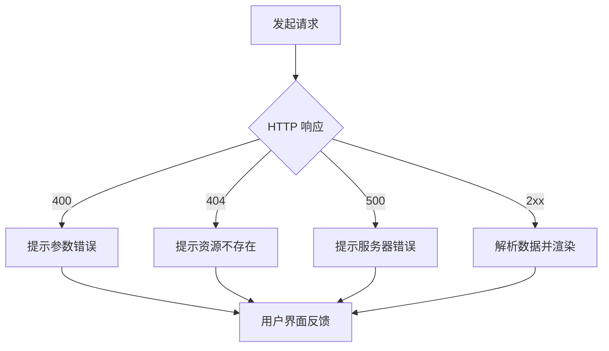

**图表来源**
- [backend/app/routers/stock_router.py:166-184](file://backend/app/routers/stock_router.py#L166-L184)
- [backend/app/routers/data_source_router.py:30-43](file://backend/app/routers/data_source_router.py#L30-L43)
- [frontend/src/pages/TradesPage.tsx:81-85](file://frontend/src/pages/TradesPage.tsx#L81-L85)

**章节来源**
- [backend/app/routers/stock_router.py:166-184](file://backend/app/routers/stock_router.py#L166-L184)
- [backend/app/routers/data_source_router.py:30-43](file://backend/app/routers/data_source_router.py#L30-L43)
- [frontend/src/pages/TradesPage.tsx:81-85](file://frontend/src/pages/TradesPage.tsx#L81-L85)

## 结论
本设计文档系统梳理了 Stock Foker 的数据流全链路：从前端用户交互、Axios 请求封装、FastAPI 路由与 Pydantic 验证、服务层的 K 线缓存与指标计算、再到 SQLite 持久化与响应返回。通过明确的数据传输格式、完善的错误处理与状态码规范、以及前后端一致的类型契约，确保了系统的可维护性与可扩展性。

**更新** 本次重大优化显著提升了数据获取系统的可靠性和性能：
- **Hithink API 集成改进**：通过查询词优化解决 API 限制问题，确保数据完整性。
- **并行处理实现**：ThreadPoolExecutor 实现多数据源并发获取，大幅提升响应速度。
- **独立数据源缓存**：新增数据源缓存服务，支持每日新鲜度边界和跨组件共享。
- **多层缓存策略**：前端内存缓存 + 后端数据库缓存 + Agent 结果缓存，形成完整的缓存体系。

这些改进使得系统能够稳定地处理复杂的金融数据获取需求，为消息面分析、技术分析等核心功能提供了坚实的数据基础。

## 附录

### 数据传输格式与状态码规范
- 请求参数结构
  - 股票搜索：查询参数 keyword。
  - 技术分析：路径参数 stock_code，查询参数 period、start_date、end_date。
  - 交易记录：查询参数 stock_code、limit。
  - 交易记录新增/更新：请求体为结构化对象。
  - **数据源获取**：路径参数 stock_code、source_type，查询参数 stock_name。
- 响应数据模型
  - 关注股票：FocusStockResponse。
  - 交易记录：TradeRecordResponse 列表或单条。
  - 技术分析：StockAnalysis（包含 K 线、指标、建议与时间框架）。
  - 炒股画像：TradingProfile。
  - **数据源响应**：DataSourceResponse（包含 data、timestamp、from_cache）。
- 错误信息格式
  - HTTPException.detail 作为错误详情返回。
  - 前端统一捕获并展示。

**章节来源**
- [backend/app/routers/stock_router.py:70-131](file://backend/app/routers/stock_router.py#L70-L131)
- [backend/app/routers/data_source_router.py:22-68](file://backend/app/routers/data_source_router.py#L22-L68)
- [backend/app/models/schemas.py:14-118](file://backend/app/models/schemas.py#L14-L118)
- [frontend/src/services/api.ts:14-188](file://frontend/src/services/api.ts#L14-L188)

### 数据缓存策略与一致性
- 后端缓存
  - K 线缓存表按 stock_code + period + date 唯一，避免重复写入。
  - 增量更新：若缓存覆盖到最近交易日且数据足够，则直接返回缓存；否则仅拉取缺失日期并写入。
  - 盘中更新：当日数据若存在则更新 open/close/high/low/volume。
  - **数据源缓存**：按 stock_code + source_type + cache_key 唯一，每日 09:00 为新鲜度边界。
  - **Agent 缓存**：与数据源缓存同步新鲜度边界，支持降级结果检测。
- 一致性保证
  - 使用 SQLAlchemy 事务提交，失败回滚。
  - 本地缓存优先，远程失败时回退使用缓存数据。
  - **并行安全**：数据源缓存写入使用唯一约束，避免并发冲突。
- **前端缓存**
  - useDataSource Hook 提供模块级内存缓存，支持跨组件共享。
  - 缓存上限控制（240 条），超过时批量清理最旧条目。
  - 每日 09:00 缓存边界同步，确保与后端一致。

**更新** 新增数据源缓存和前端内存缓存策略，形成完整的多层缓存体系。

**章节来源**
- [backend/app/services/stock_service.py:153-237](file://backend/app/services/stock_service.py#L153-L237)
- [backend/app/services/data_source_service.py:70-169](file://backend/app/services/data_source_service.py#L70-L169)
- [frontend/src/hooks/useDataSource.ts:23-79](file://frontend/src/hooks/useDataSource.ts#L23-L79)
- [backend/app/models/models.py:58-151](file://backend/app/models/models.py#L58-L151)

### 安全措施
- 输入验证
  - 使用 Pydantic 模型对请求体与查询参数进行类型与范围校验。
  - **新增**：数据源类型验证，防止非法数据源访问。
- 权限控制
  - 当前版本为本地应用，未实现鉴权；建议在生产环境引入认证与授权中间件。
- SQL 注入防护
  - 使用 SQLAlchemy ORM 查询，避免原生 SQL 拼接。
  - **新增**：数据源缓存写入使用唯一约束，防止重复数据。
- XSS 防护
  - 前端渲染文本内容，未进行二次编码；建议对用户输入的自由文本在渲染前进行白名单过滤或转义。
- **API 安全**
  - Hithink API 使用 Bearer Token 认证，密钥通过环境变量管理。
  - **新增**：API 调用使用 SSL 上下文，绕过系统代理直连。

**更新** 新增数据源类型验证和 API 认证安全措施。

**章节来源**
- [backend/app/models/schemas.py:1-118](file://backend/app/models/schemas.py#L1-L118)
- [backend/app/routers/stock_router.py:1-197](file://backend/app/routers/stock_router.py#L1-L197)
- [backend/app/routers/data_source_router.py:30-43](file://backend/app/routers/data_source_router.py#L30-L43)
- [backend/app/db/database.py:1-24](file://backend/app/db/database.py#L1-L24)
- [backend/app/services/data_fetcher.py:24-64](file://backend/app/services/data_fetcher.py#L24-L64)

### Hithink API 优化详情
**更新** 详细记录了针对 Hithink API 限制的查询词优化和并行处理改进。

- **查询词优化**：解决以下 API 限制问题
  - 概念板块查询：从复合查询 `{stock_name}所属概念板块 涨跌幅 成份股数量` 优化为独立查询 `{stock_name}所属概念板块`
  - 行业板块查询：从复杂复合查询优化为简化查询 `{stock_name}所属同花顺行业`
  - 事件数据查询：聚焦业绩预告获取详情字段，避免复合事件查询精度有限的问题
  - 北向资金查询：从汇总查询优化为 Top10 个股查询，适应 API 不提供汇总接口的限制
  - 宏观指标查询：将合并查询拆分为独立查询，解决多指标合并时数据缺失问题
- **并行处理实现**：使用 ThreadPoolExecutor 实现多数据源并发获取
  - 最大并发数限制为 8，避免过度占用系统资源
  - 每个数据源独立 try-except，失败不影响其他数据源获取
  - 支持概念板块的两步并行策略：先获取概念列表，再并行查询各概念详情
- **测试验证**：21/21 数据获取函数回归测试通过，无超时、无认证失败、无网络异常

**章节来源**
- [doc/API实测/2026-04-14-hithink-api-test-report.md:1-75](file://doc/API实测/2026-04-14-hithink-api-test-report.md#L1-L75)
- [doc/API实测/2026-04-14-hithink-query-fix-record.md:1-92](file://doc/API实测/2026-04-14-hithink-query-fix-record.md#L1-L92)
- [backend/app/services/data_fetcher.py:106-126](file://backend/app/services/data_fetcher.py#L106-L126)
- [backend/app/services/data_fetcher.py:244-289](file://backend/app/services/data_fetcher.py#L244-L289)