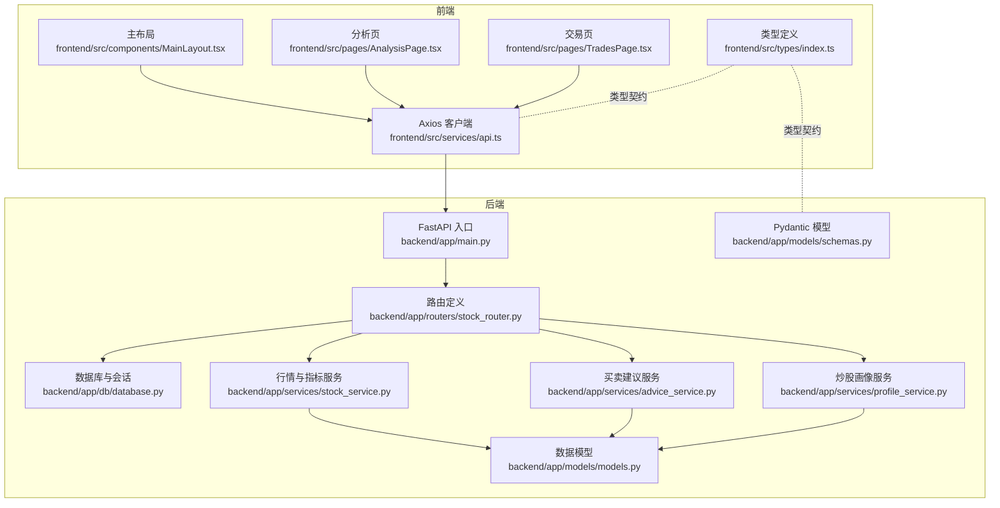
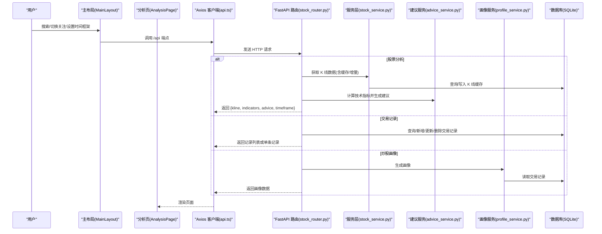
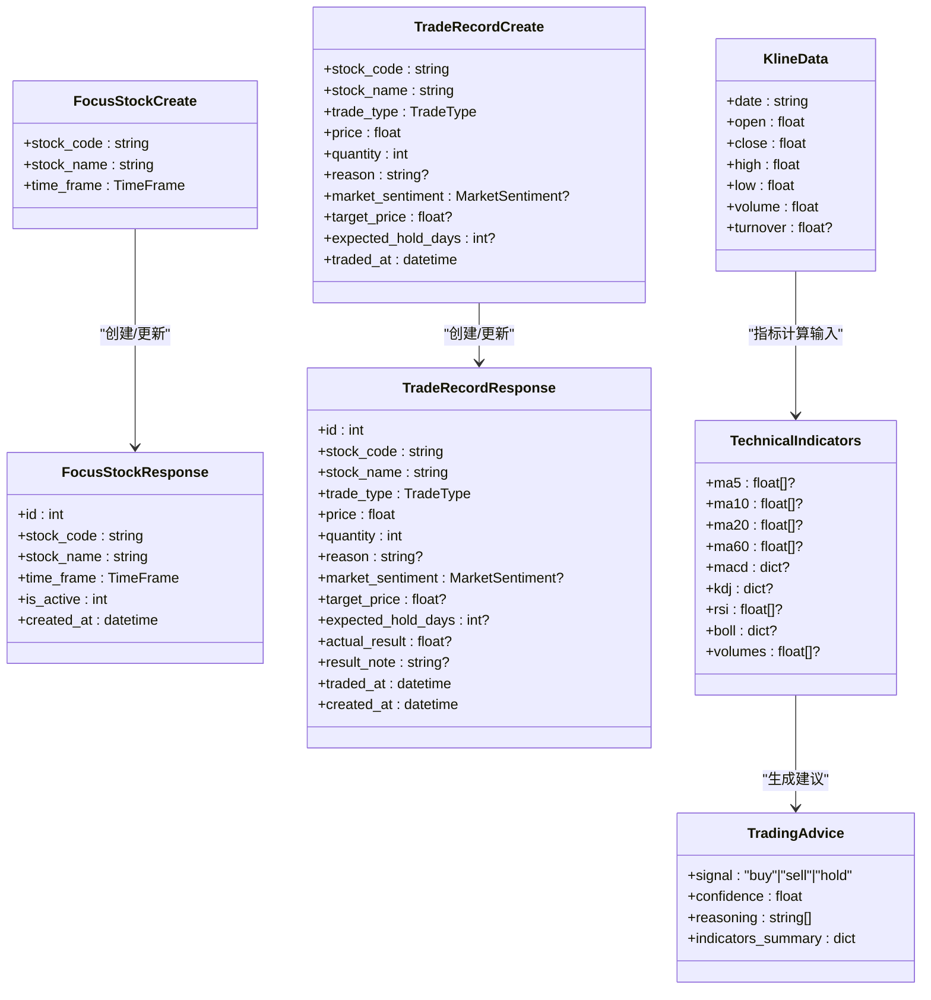
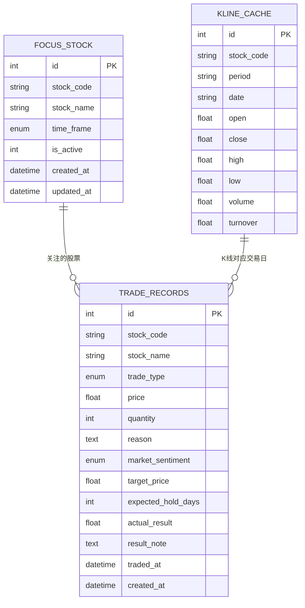
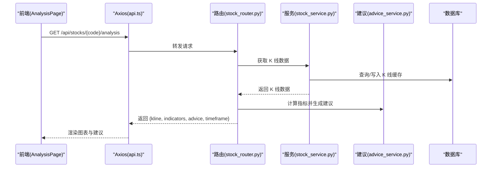
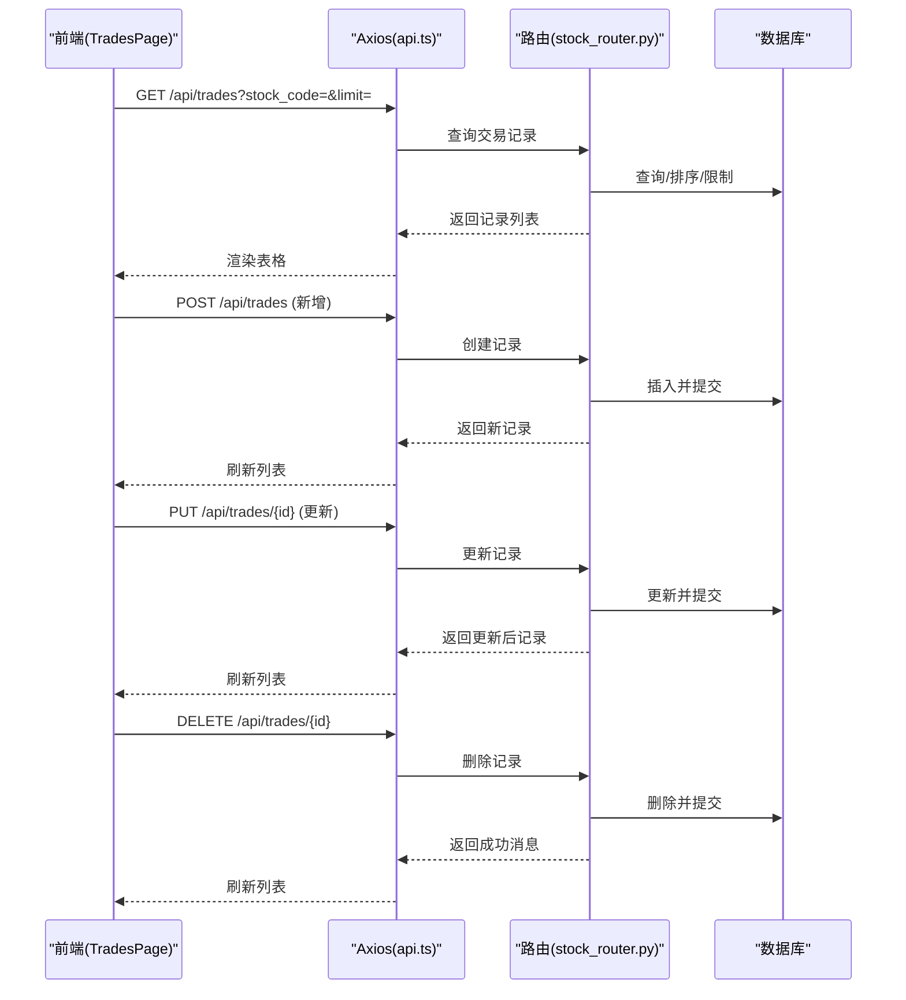
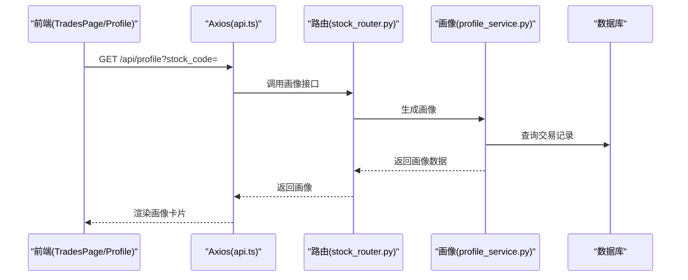
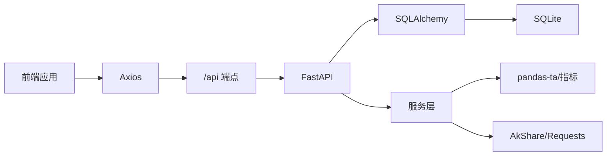
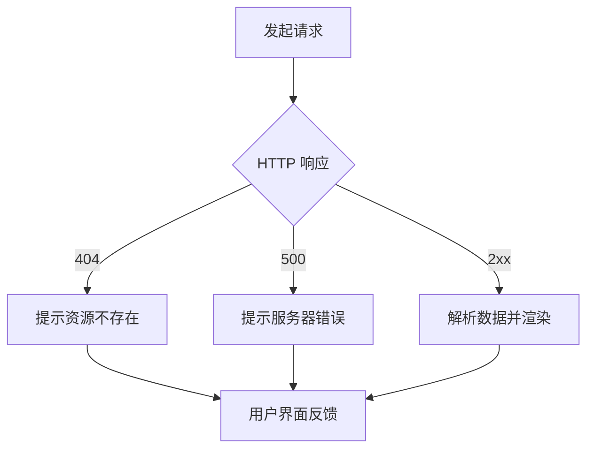

# 数据流设计

## 本文引用的文件

- [backend/app/main.py](file://backend/app/main.py)
- [backend/app/routers/stock_router.py](file://backend/app/routers/stock_router.py)
- [backend/app/db/database.py](file://backend/app/db/database.py)
- [backend/app/models/models.py](file://backend/app/models/models.py)
- [backend/app/models/schemas.py](file://backend/app/models/schemas.py)
- [backend/app/services/stock_service.py](file://backend/app/services/stock_service.py)
- [backend/app/services/advice_service.py](file://backend/app/services/advice_service.py)
- [backend/app/services/profile_service.py](file://backend/app/services/profile_service.py)
- [frontend/src/services/api.ts](file://frontend/src/services/api.ts)
- [frontend/src/types/index.ts](file://frontend/src/types/index.ts)
- [frontend/src/components/MainLayout.tsx](file://frontend/src/components/MainLayout.tsx)
- [frontend/src/pages/AnalysisPage.tsx](file://frontend/src/pages/AnalysisPage.tsx)
- [frontend/src/pages/TradesPage.tsx](file://frontend/src/pages/TradesPage.tsx)
- [doc/技术架构文档.md](file://doc/技术架构文档.md)
- [doc/产品设计文档.md](file://doc/产品设计文档.md)

## 目录

1. [简介](#简介)

2. [项目结构](#项目结构)

3. [核心组件](#核心组件)

4. [架构总览](#架构总览)

5. [详细组件分析](#详细组件分析)

6. [依赖分析](#依赖分析)

7. [性能考量](#性能考量)

8. [故障排查指南](#故障排查指南)

9. [结论](#结论)

10. [附录](#附录)

## 简介

本文件为 Stock Foker 应用的"数据流设计"文档,系统性阐述从前端用户交互到后端数据处理的完整数据流向,覆盖用户输入捕获、API 请求发送、数据验证、业务逻辑处理、数据持久化与响应返回的全流程。同时,详细说明数据传输格式(请求参数结构、响应数据模型、错误信息格式与状态码规范),并解释数据缓存策略(前端缓存机制、后端缓存管理、增量更新算法与数据一致性保证)。最后,提供数据验证与安全措施(输入验证、权限控制、SQL 注入防护与 XSS 防护)以及典型用户操作(股票搜索、技术分析、交易记录)的数据流与时序图。

## 项目结构

项目采用前后端分离架构:前端使用 React + Vite + TypeScript,后端使用 FastAPI + SQLAlchemy + SQLite。前端通过 Axios 发起 /api 前缀的请求,Vite 将 /api 代理至后端;后端路由统一挂载在 /api 前缀下,通过服务层完成数据获取与计算,并持久化到 SQLite。

图表来源

- [backend/app/main.py:1-28](file://backend/app/main.py#L1-L28)

- [backend/app/routers/stock_router.py:1-197](file://backend/app/routers/stock_router.py#L1-L197)

- [backend/app/db/database.py:1-24](file://backend/app/db/database.py#L1-L24)

- [backend/app/models/models.py:1-75](file://backend/app/models/models.py#L1-L75)

- [backend/app/models/schemas.py:1-118](file://backend/app/models/schemas.py#L1-L118)

- [backend/app/services/stock_service.py:1-327](file://backend/app/services/stock_service.py#L1-L327)

- [backend/app/services/advice_service.py:1-193](file://backend/app/services/advice_service.py#L1-L193)

- [backend/app/services/profile_service.py:1-114](file://backend/app/services/profile_service.py#L1-L114)

- [frontend/src/services/api.ts:1-68](file://frontend/src/services/api.ts#L1-L68)

- [frontend/src/types/index.ts:1-94](file://frontend/src/types/index.ts#L1-L94)

章节来源

- [doc/技术架构文档.md:19-67](file://doc/技术架构文档.md#L19-L67)

- [backend/app/main.py:1-28](file://backend/app/main.py#L1-L28)

- [frontend/src/services/api.ts:1-68](file://frontend/src/services/api.ts#L1-L68)

## 核心组件

- 前端 Axios 客户端:封装 /api 前缀的请求方法,统一处理参数与响应类型。

- 后端 FastAPI 应用：注册 CORS、挂载路由、启动数据库。

- 路由层：定义 /api 前缀下的各端点，负责参数解析、异常处理与调用服务层。

- 服务层：

  - 行情与指标服务：负责股票搜索、K线获取与技术指标计算、本地缓存与增量更新。

  - 买卖建议服务：基于技术指标生成带推理过程的建议。

  - 炒股画像服务：基于交易记录生成画像维度。

- 数据层：SQLAlchemy 模型与 SQLite 持久化，包含关注股票、交易记录、K线缓存三张表。

章节来源

- [frontend/src/services/api.ts:1-68](file://frontend/src/services/api.ts#L1-L68)

- [backend/app/routers/stock_router.py:1-197](file://backend/app/routers/stock_router.py#L1-L197)

- [backend/app/services/stock_service.py:1-327](file://backend/app/services/stock_service.py#L1-L327)

- [backend/app/services/advice_service.py:1-193](file://backend/app/services/advice_service.py#L1-L193)

- [backend/app/services/profile_service.py:1-114](file://backend/app/services/profile_service.py#L1-L114)

- [backend/app/models/models.py:1-75](file://backend/app/models/models.py#L1-L75)

## 架构总览

下图展示了从用户操作到数据返回的总体数据流,涵盖前端页面、API 调用、后端路由、服务层与数据库的协作关系。

图表来源

- [frontend/src/components/MainLayout.tsx:1-281](file://frontend/src/components/MainLayout.tsx#L1-L281)

- [frontend/src/pages/AnalysisPage.tsx:1-213](file://frontend/src/pages/AnalysisPage.tsx#L1-L213)

- [frontend/src/services/api.ts:1-68](file://frontend/src/services/api.ts#L1-L68)

- [backend/app/routers/stock_router.py:1-197](file://backend/app/routers/stock_router.py#L1-L197)

- [backend/app/services/stock_service.py:1-327](file://backend/app/services/stock_service.py#L1-L327)

- [backend/app/services/advice_service.py:1-193](file://backend/app/services/advice_service.py#L1-L193)

- [backend/app/services/profile_service.py:1-114](file://backend/app/services/profile_service.py#L1-L114)

- [backend/app/db/database.py:1-24](file://backend/app/db/database.py#L1-L24)

## 详细组件分析

### 前端数据流与类型契约

- Axios 客户端集中封装所有 /api 调用,统一 baseURL 为 /api,并导出 typed 方法用于股票关注、搜索、分析、交易记录与画像查询。

- 类型定义文件提供前后端一致的数据模型，确保请求/响应字段与枚举值保持一致。

图表来源

- [frontend/src/services/api.ts:1-68](file://frontend/src/services/api.ts#L1-L68)

- [frontend/src/types/index.ts:1-94](file://frontend/src/types/index.ts#L1-L94)

章节来源

- [frontend/src/services/api.ts:1-68](file://frontend/src/services/api.ts#L1-L68)

- [frontend/src/types/index.ts:1-94](file://frontend/src/types/index.ts#L1-L94)

### 后端路由与数据验证

- 路由层统一挂载在 /api 前缀,使用 Pydantic 模型进行请求体与路径/查询参数的自动验证与序列化。

- 对外暴露关注管理、股票搜索、K线与分析、交易记录、炒股画像等端点。

图表来源

- [backend/app/models/schemas.py:1-118](file://backend/app/models/schemas.py#L1-L118)

- [backend/app/models/models.py:1-75](file://backend/app/models/models.py#L1-L75)

章节来源

- [backend/app/routers/stock_router.py:1-197](file://backend/app/routers/stock_router.py#L1-L197)

- [backend/app/models/schemas.py:1-118](file://backend/app/models/schemas.py#L1-L118)

### 数据库模型与关系

- 关注股票表:记录当前关注的股票与时间框架。

- 交易记录表：记录买入/卖出操作及结果。

- K线缓存表：按 stock_code + period + date 唯一键缓存历史 K 线，支持增量更新。

图表来源

- [backend/app/models/models.py:25-75](file://backend/app/models/models.py#L25-L75)

章节来源

- [backend/app/models/models.py:1-75](file://backend/app/models/models.py#L1-L75)

### 股票搜索与技术分析数据流

- 股票搜索:路由层调用服务层搜索函数,返回匹配结果列表。

- 技术分析：路由层组合 K 线获取、指标计算与建议生成，返回完整分析结果。

图表来源

- [frontend/src/pages/AnalysisPage.tsx:1-213](file://frontend/src/pages/AnalysisPage.tsx#L1-L213)

- [frontend/src/services/api.ts:1-68](file://frontend/src/services/api.ts#L1-L68)

- [backend/app/routers/stock_router.py:98-131](file://backend/app/routers/stock_router.py#L98-L131)

- [backend/app/services/stock_service.py:131-253](file://backend/app/services/stock_service.py#L131-L253)

- [backend/app/services/advice_service.py:4-173](file://backend/app/services/advice_service.py#L4-L173)

章节来源

- [backend/app/routers/stock_router.py:98-131](file://backend/app/routers/stock_router.py#L98-L131)

- [backend/app/services/stock_service.py:131-253](file://backend/app/services/stock_service.py#L131-L253)

- [backend/app/services/advice_service.py:4-173](file://backend/app/services/advice_service.py#L4-L173)

### 交易记录管理数据流

- 列表:按条件查询并限制数量返回。

- 新增：校验后写入数据库。

- 更新/删除：按 ID 查找并更新或删除。

图表来源

- [frontend/src/pages/TradesPage.tsx:1-260](file://frontend/src/pages/TradesPage.tsx#L1-L260)

- [frontend/src/services/api.ts:47-67](file://frontend/src/services/api.ts#L47-L67)

- [backend/app/routers/stock_router.py:136-184](file://backend/app/routers/stock_router.py#L136-L184)

- [backend/app/db/database.py:14-23](file://backend/app/db/database.py#L14-L23)

章节来源

- [backend/app/routers/stock_router.py:136-184](file://backend/app/routers/stock_router.py#L136-L184)

- [frontend/src/pages/TradesPage.tsx:1-260](file://frontend/src/pages/TradesPage.tsx#L1-L260)

### 炒股画像数据流

- 路由层调用画像服务,服务层聚合交易记录并计算画像维度,返回结构化结果。

图表来源

- [frontend/src/pages/TradesPage.tsx:1-260](file://frontend/src/pages/TradesPage.tsx#L1-L260)

- [frontend/src/services/api.ts:63-67](file://frontend/src/services/api.ts#L63-L67)

- [backend/app/routers/stock_router.py:189-196](file://backend/app/routers/stock_router.py#L189-L196)

- [backend/app/services/profile_service.py:6-97](file://backend/app/services/profile_service.py#L6-L97)

章节来源

- [backend/app/routers/stock_router.py:189-196](file://backend/app/routers/stock_router.py#L189-L196)

- [backend/app/services/profile_service.py:6-97](file://backend/app/services/profile_service.py#L6-L97)

## 依赖分析

- 前端依赖:Axios、Ant Design、ECharts-for-React、Day.js、React Router。

- 后端依赖：FastAPI、SQLAlchemy、pandas、pandas-ta、AkShare、Requests。

- 前端与后端通过 /api 前缀通信，Vite 配置将 /api 代理到后端，避免跨域问题。

图表来源

- [doc/技术架构文档.md:3-18](file://doc/技术架构文档.md#L3-L18)

- [frontend/src/services/api.ts:1-68](file://frontend/src/services/api.ts#L1-L68)

- [backend/app/routers/stock_router.py:1-197](file://backend/app/routers/stock_router.py#L1-L197)

- [backend/app/services/stock_service.py:1-327](file://backend/app/services/stock_service.py#L1-L327)

章节来源

- [doc/技术架构文档.md:3-18](file://doc/技术架构文档.md#L3-L18)

- [backend/app/main.py:1-28](file://backend/app/main.py#L1-L28)

## 性能考量

- 前端性能:ECharts 渲染 K 线与指标,支持缩放与滑条;Ant Design 表格分页加载,减少一次性渲染压力。

- 后端性能：K 线数据本地缓存与增量更新，避免重复拉取远程数据；pandas-ta 在内存中计算指标，返回前进行序列化。

- 网络性能：Vite 代理减少跨域与额外握手；Axios 统一错误处理，避免重复请求。

[本节为通用性能指导,不直接分析具体文件,故无"章节来源"]

## 故障排查指南

- 常见错误与状态码

  - 404：资源不存在（如交易记录不存在）。

  - 500：服务内部错误（如远程数据源不可用）。

- 错误处理流程

  - 路由层捕获运行时异常并转换为 HTTPException。

  - 前端捕获响应错误并提示用户。

图表来源

- [backend/app/routers/stock_router.py:166-184](file://backend/app/routers/stock_router.py#L166-L184)

- [frontend/src/pages/TradesPage.tsx:81-85](file://frontend/src/pages/TradesPage.tsx#L81-L85)

章节来源

- [backend/app/routers/stock_router.py:166-184](file://backend/app/routers/stock_router.py#L166-L184)

- [frontend/src/pages/TradesPage.tsx:81-85](file://frontend/src/pages/TradesPage.tsx#L81-L85)

## 结论

本设计文档系统梳理了 Stock Foker 的数据流全链路:从前端用户交互、Axios 请求封装、FastAPI 路由与 Pydantic 验证、服务层的 K 线缓存与指标计算、再到 SQLite 持久化与响应返回。通过明确的数据传输格式、完善的错误处理与状态码规范、以及前后端一致的类型契约,确保了系统的可维护性与可扩展性。同时,K 线缓存与增量更新策略有效降低了外部依赖的耦合与网络开销,提升了用户体验。

[本节为总结性内容,不直接分析具体文件,故无"章节来源"]

## 附录

### 数据传输格式与状态码规范

- 请求参数结构

  - 股票搜索：查询参数 keyword。

  - 技术分析：路径参数 stock_code，查询参数 period、start_date、end_date。

  - 交易记录：查询参数 stock_code、limit。

  - 交易记录新增/更新：请求体为结构化对象。

- 响应数据模型

  - 关注股票：FocusStockResponse。

  - 交易记录：TradeRecordResponse 列表或单条。

  - 技术分析：StockAnalysis（包含 K 线、指标、建议与时间框架）。

  - 炒股画像：TradingProfile。

- 错误信息格式

  - HTTPException.detail 作为错误详情返回。

  - 前端统一捕获并展示。

章节来源

- [backend/app/routers/stock_router.py:70-131](file://backend/app/routers/stock_router.py#L70-L131)

- [backend/app/models/schemas.py:14-118](file://backend/app/models/schemas.py#L14-L118)

- [frontend/src/services/api.ts:14-67](file://frontend/src/services/api.ts#L14-L67)

### 数据缓存策略与一致性

- 后端缓存

  - K 线缓存表按 stock_code + period + date 唯一，避免重复写入。

  - 增量更新：若缓存覆盖到最近交易日且数据足够，则直接返回缓存；否则仅拉取缺失日期并写入。

  - 盘中更新：当日数据若存在则更新 open/close/high/low/volume。

- 一致性保证

  - 使用 SQLAlchemy 事务提交，失败回滚。

  - 本地缓存优先，远程失败时回退使用缓存数据。

章节来源

- [backend/app/services/stock_service.py:153-237](file://backend/app/services/stock_service.py#L153-L237)

- [backend/app/models/models.py:58-75](file://backend/app/models/models.py#L58-L75)

### 安全措施

- 输入验证

  - 使用 Pydantic 模型对请求体与查询参数进行类型与范围校验。

- 权限控制

  - 当前版本为本地应用，未实现鉴权；建议在生产环境引入认证与授权中间件。

- SQL 注入防护

  - 使用 SQLAlchemy ORM 查询，避免原生 SQL 拼接。

- XSS 防护

  - 前端渲染文本内容，未进行二次编码；建议对用户输入的自由文本在渲染前进行白名单过滤或转义。

章节来源

- [backend/app/models/schemas.py:1-118](file://backend/app/models/schemas.py#L1-L118)

- [backend/app/routers/stock_router.py:1-197](file://backend/app/routers/stock_router.py#L1-L197)

- [backend/app/db/database.py:1-24](file://backend/app/db/database.py#L1-L24)
