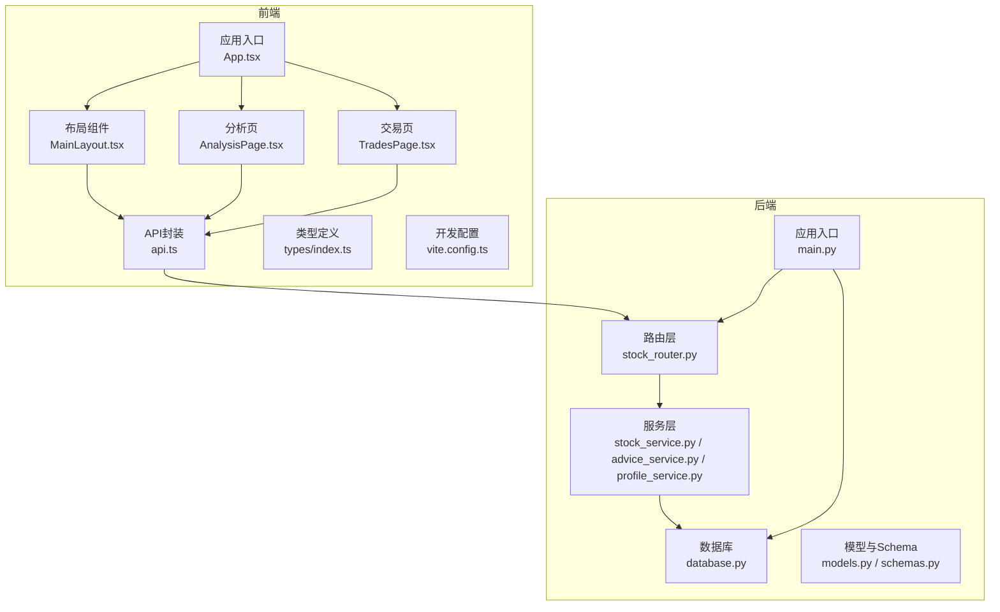
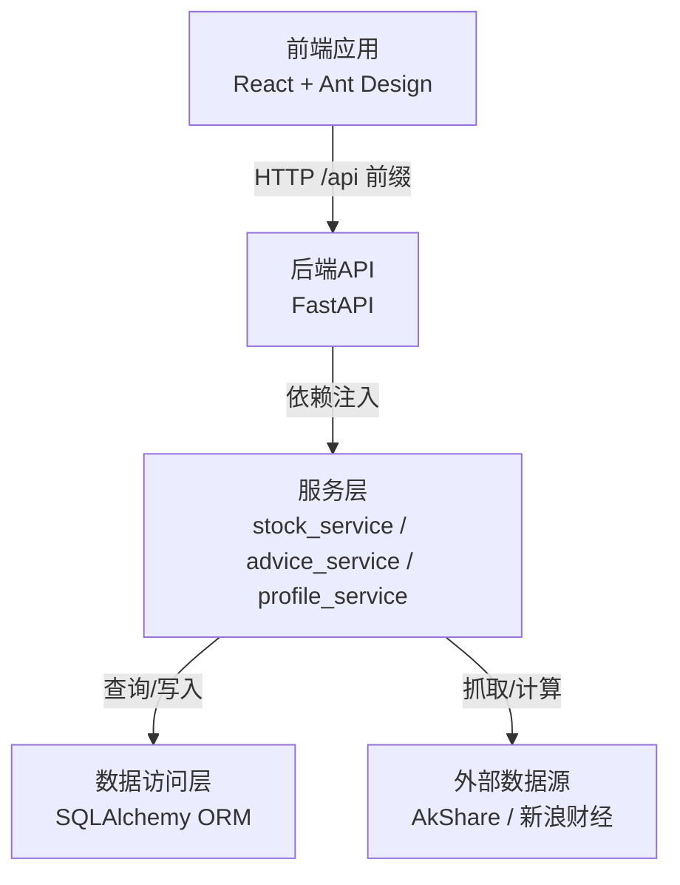
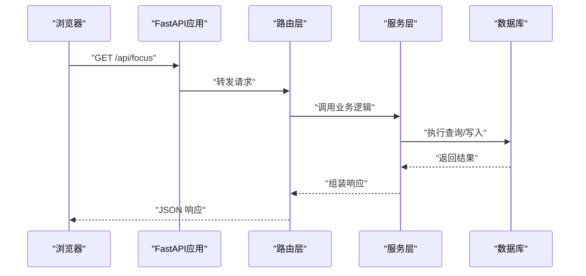
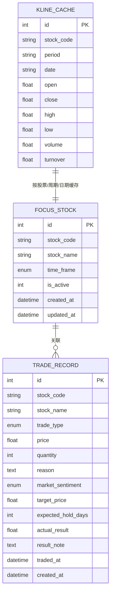
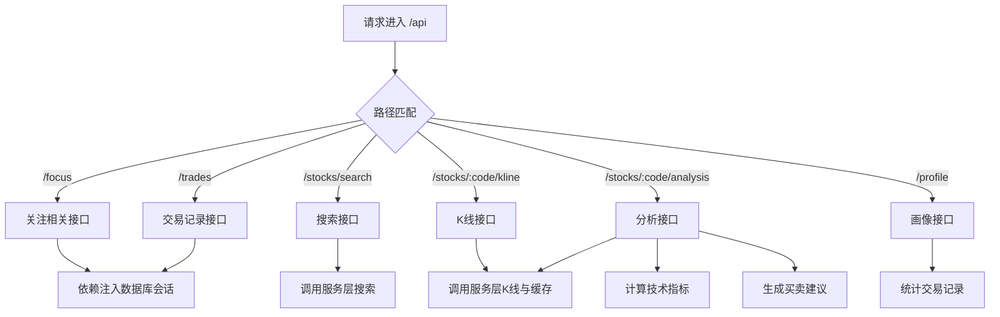
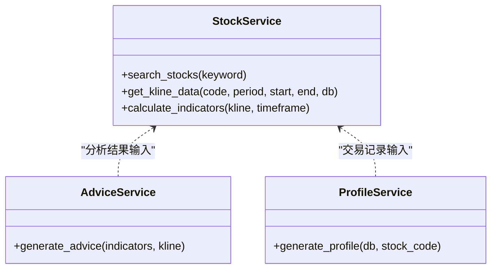
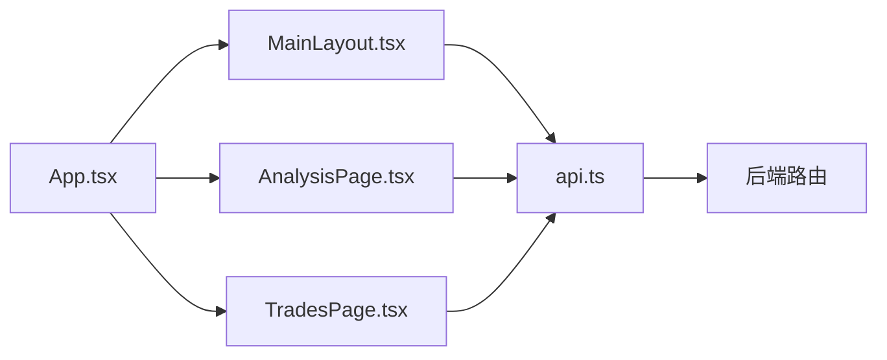
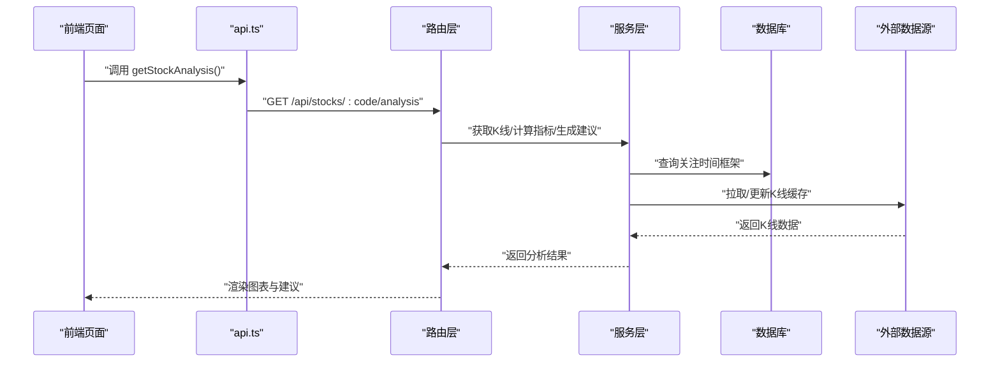
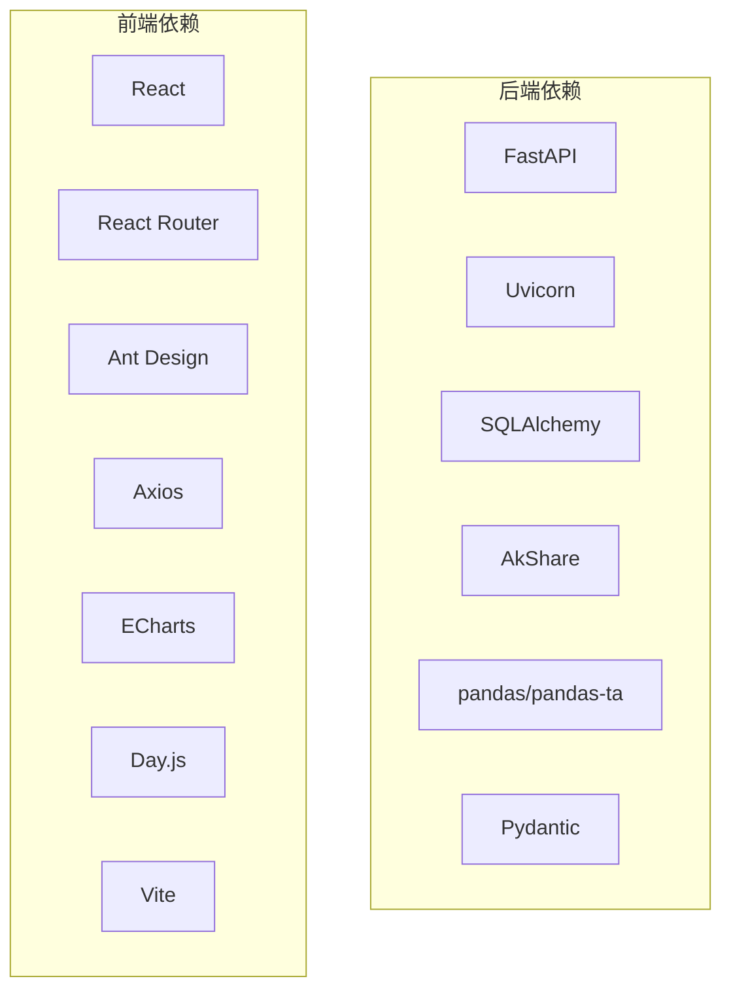

# 架构设计

> **本文档引用的文件**
>
> - [backend/app/main.py](file://backend/app/main.py)
>
> - [backend/app/db/database.py](file://backend/app/db/database.py)
>
> - [backend/app/routers/stock_router.py](file://backend/app/routers/stock_router.py)
>
> - [backend/app/models/models.py](file://backend/app/models/models.py)
>
> - [backend/app/models/schemas.py](file://backend/app/models/schemas.py)
>
> - [backend/app/services/stock_service.py](file://backend/app/services/stock_service.py)
>
> - [backend/app/services/advice_service.py](file://backend/app/services/advice_service.py)
>
> - [backend/app/services/profile_service.py](file://backend/app/services/profile_service.py)
>
> - [backend/requirements.txt](file://backend/requirements.txt)
>
> - [frontend/src/App.tsx](file://frontend/src/App.tsx)
>
> - [frontend/src/components/MainLayout.tsx](file://frontend/src/components/MainLayout.tsx)
>
> - [frontend/src/services/api.ts](file://frontend/src/services/api.ts)
>
> - [frontend/src/pages/AnalysisPage.tsx](file://frontend/src/pages/AnalysisPage.tsx)
>
> - [frontend/src/pages/TradesPage.tsx](file://frontend/src/pages/TradesPage.tsx)
>
> - [frontend/src/types/index.ts](file://frontend/src/types/index.ts)
>
> - [frontend/package.json](file://frontend/package.json)
>
> - [frontend/vite.config.ts](file://frontend/vite.config.ts)

## 目录

1. [引言](#引言)

2. [项目结构](#项目结构)

3. [核心组件](#核心组件)

4. [架构总览](#架构总览)

5. [详细组件分析](#详细组件分析)

6. [依赖分析](#依赖分析)

7. [性能考量](#性能考量)

8. [故障排查指南](#故障排查指南)

9. [结论](#结论)

10. [附录](#附录)

## 引言

本项目为"Stock Foker"股票分析与交易记录管理系统，采用前后端分离架构：后端使用 FastAPI 提供 REST API，前端使用 React + Ant Design 实现交互界面。系统围绕"关注股票、K线与技术分析、交易记录、炒股画像"四大功能域构建，强调清晰的分层设计与可扩展的服务化能力。

## 项目结构

- 后端（Python/FastAPI）

  - 应用入口与中间件配置

  - 数据库连接与模型定义

  - 路由组织与业务接口

  - 服务层（股票数据、技术分析、画像生成）

- 前端（TypeScript/React/Vite）

  - 路由与布局组件

  - 页面组件（分析页、交易页、画像页）

  - API 服务封装与类型定义

  - Vite 开发服务器与代理配置

图表来源

- [backend/app/main.py:1-28](file://backend/app/main.py#L1-L28)

- [backend/app/routers/stock_router.py:1-197](file://backend/app/routers/stock_router.py#L1-L197)

- [backend/app/db/database.py:1-24](file://backend/app/db/database.py#L1-L24)

- [backend/app/services/stock_service.py:1-327](file://backend/app/services/stock_service.py#L1-L327)

- [frontend/src/App.tsx:1-27](file://frontend/src/App.tsx#L1-L27)

- [frontend/src/components/MainLayout.tsx:1-159](file://frontend/src/components/MainLayout.tsx#L1-L159)

- [frontend/src/services/api.ts:1-65](file://frontend/src/services/api.ts#L1-L65)

章节来源

- [backend/app/main.py:1-28](file://backend/app/main.py#L1-L28)

- [frontend/src/App.tsx:1-27](file://frontend/src/App.tsx#L1-L27)

## 核心组件

- 后端应用入口与中间件

  - 初始化 FastAPI 应用，启用 CORS 并限制来源为前端开发地址

  - 注册路由与启动事件初始化数据库

- 数据库与模型

  - 使用 SQLAlchemy ORM 定义实体模型（关注股票、交易记录、K线缓存）

  - 提供会话工厂与基础类，统一依赖注入

- 路由层

  - 统一前缀“/api”，按功能域拆分接口（关注、搜索、K线与分析、交易、画像）

  - 通过依赖注入获取数据库会话，调用服务层完成业务处理

- 服务层

  - 股票服务：股票搜索、K线数据获取与缓存、技术指标计算

  - 建议服务：基于多指标合成生成买卖建议

  - 画像服务：基于交易记录统计生成炒股画像

- 前端应用

  - 路由与布局：主布局包含侧边菜单、头部搜索与时间框架切换

  - 页面组件：分析页（K线+指标+建议）、交易页（增删改查）

  - API 封装：统一前缀“/api”，与后端路由一一对应

  - 类型定义：对后端响应进行强类型约束

章节来源

- [backend/app/main.py:1-28](file://backend/app/main.py#L1-L28)

- [backend/app/db/database.py:1-24](file://backend/app/db/database.py#L1-L24)

- [backend/app/routers/stock_router.py:1-197](file://backend/app/routers/stock_router.py#L1-L197)

- [backend/app/models/models.py:1-75](file://backend/app/models/models.py#L1-L75)

- [backend/app/models/schemas.py:1-118](file://backend/app/models/schemas.py#L1-L118)

- [backend/app/services/stock_service.py:1-327](file://backend/app/services/stock_service.py#L1-L327)

- [backend/app/services/advice_service.py:1-193](file://backend/app/services/advice_service.py#L1-L193)

- [backend/app/services/profile_service.py:1-114](file://backend/app/services/profile_service.py#L1-L114)

- [frontend/src/components/MainLayout.tsx:1-159](file://frontend/src/components/MainLayout.tsx#L1-L159)

- [frontend/src/pages/AnalysisPage.tsx:1-213](file://frontend/src/pages/AnalysisPage.tsx#L1-L213)

- [frontend/src/pages/TradesPage.tsx:1-260](file://frontend/src/pages/TradesPage.tsx#L1-L260)

- [frontend/src/services/api.ts:1-65](file://frontend/src/services/api.ts#L1-L65)

- [frontend/src/types/index.ts:1-94](file://frontend/src/types/index.ts#L1-L94)

## 架构总览

系统采用典型的三层架构：

- 表现层（前端 React）

- 业务层（FastAPI 路由 + 服务层）

- 数据层（SQLAlchemy ORM + SQLite）

图表来源

- [backend/app/main.py:1-28](file://backend/app/main.py#L1-L28)

- [backend/app/routers/stock_router.py:1-197](file://backend/app/routers/stock_router.py#L1-L197)

- [backend/app/services/stock_service.py:1-327](file://backend/app/services/stock_service.py#L1-L327)

- [backend/app/db/database.py:1-24](file://backend/app/db/database.py#L1-L24)

## 详细组件分析

### 后端应用入口与CORS配置

- 应用初始化：设置标题与版本，注册路由

- CORS 配置：允许前端开发地址访问，支持凭据、通配方法与头

- 启动事件：应用启动时初始化数据库表结构

图表来源

- [backend/app/main.py:1-28](file://backend/app/main.py#L1-L28)

- [backend/app/routers/stock_router.py:1-197](file://backend/app/routers/stock_router.py#L1-L197)

章节来源

- [backend/app/main.py:1-28](file://backend/app/main.py#L1-L28)

### 数据库连接管理与模型设计

- 连接与会话

  - 使用 SQLite 文件数据库，连接参数适配多线程场景

  - 会话工厂与依赖注入函数，确保每个请求独立会话

- 模型与约束

  - 关注股票：唯一激活标记、时间框架枚举

  - 交易记录：买卖类型、情绪判断、盈亏与持有期等

  - K线缓存：唯一索引保证同周期同日期不重复

- 初始化

  - 应用启动时创建所有表

图表来源

- [backend/app/db/database.py:1-24](file://backend/app/db/database.py#L1-L24)

- [backend/app/models/models.py:1-75](file://backend/app/models/models.py#L1-L75)

章节来源

- [backend/app/db/database.py:1-24](file://backend/app/db/database.py#L1-L24)

- [backend/app/models/models.py:1-75](file://backend/app/models/models.py#L1-L75)

### API 路由组织与控制流

- 路由前缀与标签：统一"/api"，按功能域分组

- 关注股票：查询当前关注、设置新关注（自动取消旧关注）、更新时间框架、查看历史

- 股票搜索：调用服务层搜索，异常转换为HTTP错误

- K线与分析：支持指定周期与日期范围；分析接口整合K线、指标与建议

- 交易记录：分页查询、创建、更新（补充结果）、删除

- 炒股画像：聚合统计生成画像

图表来源

- [backend/app/routers/stock_router.py:1-197](file://backend/app/routers/stock_router.py#L1-L197)

章节来源

- [backend/app/routers/stock_router.py:1-197](file://backend/app/routers/stock_router.py#L1-L197)

### 服务层实现要点

- 股票服务

  - 股票列表缓存与关键词搜索

  - K线数据优先本地缓存，缺失部分增量拉取，支持远程降级

  - 技术指标计算：均线、MACD、KDJ、RSI、布林带

- 建议服务

  - 多指标融合打分，输出买卖建议与置信度及推理过程

- 画像服务

  - 基于交易记录统计胜率、平均盈亏、持有周期、情绪准确率、常用理由等

图表来源

- [backend/app/services/stock_service.py:1-327](file://backend/app/services/stock_service.py#L1-L327)

- [backend/app/services/advice_service.py:1-193](file://backend/app/services/advice_service.py#L1-L193)

- [backend/app/services/profile_service.py:1-114](file://backend/app/services/profile_service.py#L1-L114)

章节来源

- [backend/app/services/stock_service.py:1-327](file://backend/app/services/stock_service.py#L1-L327)

- [backend/app/services/advice_service.py:1-193](file://backend/app/services/advice_service.py#L1-L193)

- [backend/app/services/profile_service.py:1-114](file://backend/app/services/profile_service.py#L1-L114)

### 前端组件化架构

- 应用入口与路由

  - 使用 React Router 管理页面路由，Ant Design 国际化与主题配置

- 主布局组件

  - 侧边菜单导航、顶部搜索与时间框架切换，维护关注股票状态

  - 与 API 服务交互，实现关注设置与时间框架更新

- 页面组件

  - 分析页：K线图与技术指标可视化，买卖建议展示

  - 交易页：表格展示、新增/编辑/删除、补充结果

- API 封装

  - Axios 创建基础实例，统一前缀“/api”

  - 对应后端路由暴露方法，便于页面调用

- 类型定义

  - TypeScript 接口与联合类型，确保前后端数据契约一致

图表来源

- [frontend/src/App.tsx:1-27](file://frontend/src/App.tsx#L1-L27)

- [frontend/src/components/MainLayout.tsx:1-159](file://frontend/src/components/MainLayout.tsx#L1-L159)

- [frontend/src/pages/AnalysisPage.tsx:1-213](file://frontend/src/pages/AnalysisPage.tsx#L1-L213)

- [frontend/src/pages/TradesPage.tsx:1-260](file://frontend/src/pages/TradesPage.tsx#L1-L260)

- [frontend/src/services/api.ts:1-65](file://frontend/src/services/api.ts#L1-L65)

章节来源

- [frontend/src/App.tsx:1-27](file://frontend/src/App.tsx#L1-L27)

- [frontend/src/components/MainLayout.tsx:1-159](file://frontend/src/components/MainLayout.tsx#L1-L159)

- [frontend/src/pages/AnalysisPage.tsx:1-213](file://frontend/src/pages/AnalysisPage.tsx#L1-L213)

- [frontend/src/pages/TradesPage.tsx:1-260](file://frontend/src/pages/TradesPage.tsx#L1-L260)

- [frontend/src/services/api.ts:1-65](file://frontend/src/services/api.ts#L1-L65)

- [frontend/src/types/index.ts:1-94](file://frontend/src/types/index.ts#L1-L94)

### 数据流向与模块依赖

- 前端到后端

  - 前端通过 Axios 发起 /api 前缀请求，经路由层进入服务层，最终访问数据库

- 后端到外部

  - 股票服务在缓存不足时调用 AkShare 或新浪财经接口获取 K 线

- 前端到前端

  - 布局组件与页面组件通过状态共享与上下文传递关注信息

图表来源

- [frontend/src/services/api.ts:1-65](file://frontend/src/services/api.ts#L1-L65)

- [backend/app/routers/stock_router.py:98-131](file://backend/app/routers/stock_router.py#L98-L131)

- [backend/app/services/stock_service.py:131-253](file://backend/app/services/stock_service.py#L131-L253)

章节来源

- [frontend/src/services/api.ts:1-65](file://frontend/src/services/api.ts#L1-L65)

- [backend/app/routers/stock_router.py:98-131](file://backend/app/routers/stock_router.py#L98-L131)

- [backend/app/services/stock_service.py:131-253](file://backend/app/services/stock_service.py#L131-L253)

## 依赖分析

- 后端依赖

  - FastAPI、SQLAlchemy、Pydantic、AkShare、pandas、pandas-ta、Uvicorn

- 前端依赖

  - React、React Router、Ant Design、Axios、ECharts、Day.js、Vite

图表来源

- [backend/requirements.txt:1-10](file://backend/requirements.txt#L1-L10)

- [frontend/package.json:1-30](file://frontend/package.json#L1-L30)

章节来源

- [backend/requirements.txt:1-10](file://backend/requirements.txt#L1-L10)

- [frontend/package.json:1-30](file://frontend/package.json#L1-L30)

## 性能考量

- 缓存策略

  - K线数据本地缓存，避免重复抓取；仅增量更新，减少网络与计算开销

- 重试机制

  - 远程接口调用具备指数退避重试，提升稳定性

- 数据库优化

  - K线缓存建立唯一索引，加速查询与去重

- 前端渲染

  - 图表按需渲染，分段选择周期，避免一次性加载过多数据

## 故障排查指南

- CORS 跨域问题

  - 确认前端开发端口与后端允许来源一致；生产环境需调整允许来源

- 数据库连接

  - 启动时初始化失败检查数据库文件权限与路径

- API 错误

  - 路由层捕获运行时异常并转换为 HTTP 500；前端显示错误提示

- 股票搜索/分析失败

  - 检查外部数据源可用性与网络；服务层已做降级与异常抛出

章节来源

- [backend/app/main.py:9-15](file://backend/app/main.py#L9-L15)

- [backend/app/routers/stock_router.py:70-78](file://backend/app/routers/stock_router.py#L70-L78)

- [backend/app/services/stock_service.py:22-33](file://backend/app/services/stock_service.py#L22-L33)

## 结论

本项目以清晰的分层与模块化设计实现了股票关注、K线分析、交易记录与画像统计的核心能力。后端通过 FastAPI 的依赖注入与服务层解耦，前端通过组件化与类型约束保障一致性。CORS 与代理配置确保开发体验顺畅，缓存与重试机制提升系统稳定性与性能。

## 附录

- 开发与运行

  - 前端：Vite 开发服务器默认端口 5173，代理到后端 8000

  - 后端：Uvicorn 启动，应用入口位于 backend/app/main.py

章节来源

- [frontend/vite.config.ts:1-16](file://frontend/vite.config.ts#L1-L16)

- [backend/app/main.py:1-28](file://backend/app/main.py#L1-L28)
