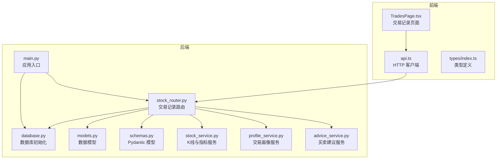
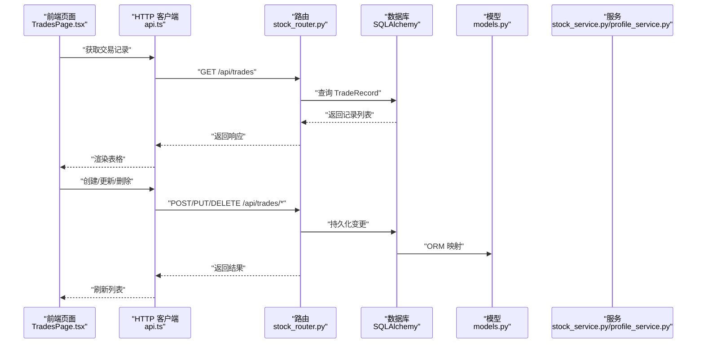
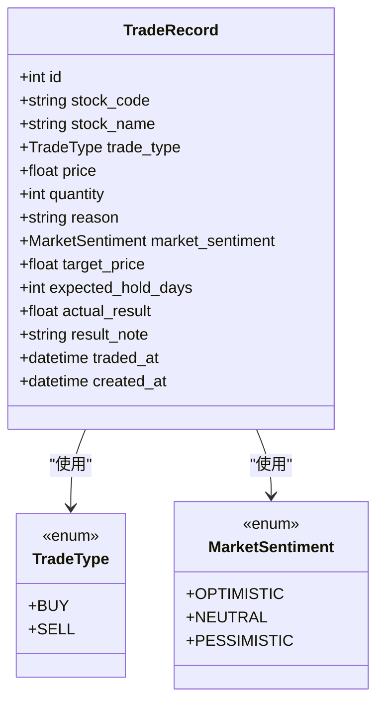
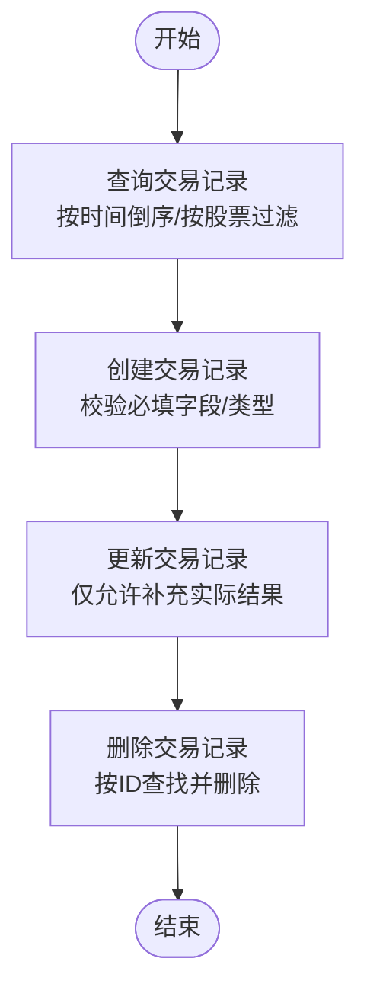
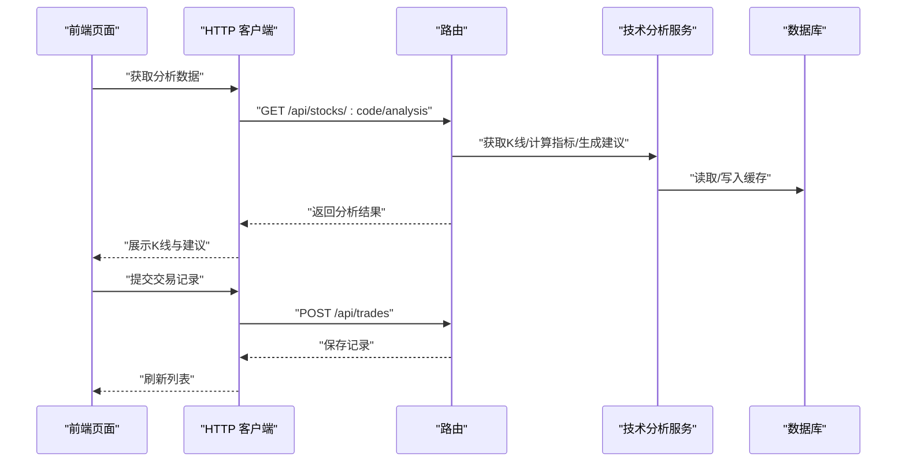
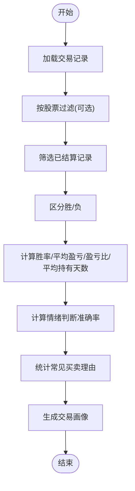
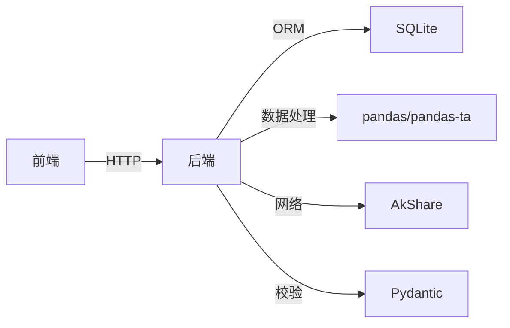

# 交易记录管理

<cite>
**本文引用的文件**
- [models.py](file://backend/app/models/models.py)
- [schemas.py](file://backend/app/models/schemas.py)
- [stock_router.py](file://backend/app/routers/stock_router.py)
- [stock_service.py](file://backend/app/services/stock_service.py)
- [profile_service.py](file://backend/app/services/profile_service.py)
- [advice_service.py](file://backend/app/services/advice_service.py)
- [database.py](file://backend/app/db/database.py)
- [main.py](file://backend/app/main.py)
- [TradesPage.tsx](file://frontend/src/pages/TradesPage.tsx)
- [api.ts](file://frontend/src/services/api.ts)
- [index.ts](file://frontend/src/types/index.ts)
- [产品设计文档.md](file://doc/产品设计文档.md)
- [requirements.txt](file://backend/requirements.txt)
</cite>

## 目录
1. [简介](#简介)
2. [项目结构](#项目结构)
3. [核心组件](#核心组件)
4. [架构概览](#架构概览)
5. [详细组件分析](#详细组件分析)
6. [依赖分析](#依赖分析)
7. [性能考量](#性能考量)
8. [故障排查指南](#故障排查指南)
9. [结论](#结论)
10. [附录](#附录)

## 简介
本文件系统化阐述交易记录管理功能的设计与实现，涵盖数据模型、增删改查流程、业务规则、与技术分析的关联、统计画像以及导入导出与回测能力的现状与扩展建议。目标是帮助开发者与使用者全面理解交易记录在系统中的角色与价值，并为后续的功能演进提供参考。

## 项目结构
后端采用 FastAPI + SQLAlchemy 的典型分层架构，前端使用 React + Ant Design。交易记录管理涉及后端模型与路由、服务层的数据处理与统计、前端页面与 API 交互。

**图表来源**
- [main.py:1-28](file://backend/app/main.py#L1-L28)
- [database.py:1-24](file://backend/app/db/database.py#L1-L24)
- [stock_router.py:1-197](file://backend/app/routers/stock_router.py#L1-L197)
- [models.py:1-75](file://backend/app/models/models.py#L1-L75)
- [schemas.py:1-118](file://backend/app/models/schemas.py#L1-L118)
- [stock_service.py:1-327](file://backend/app/services/stock_service.py#L1-L327)
- [profile_service.py:1-114](file://backend/app/services/profile_service.py#L1-L114)
- [advice_service.py:1-193](file://backend/app/services/advice_service.py#L1-L193)
- [TradesPage.tsx:1-260](file://frontend/src/pages/TradesPage.tsx#L1-L260)
- [api.ts:1-68](file://frontend/src/services/api.ts#L1-L68)
- [index.ts:1-94](file://frontend/src/types/index.ts#L1-L94)

**章节来源**
- [main.py:1-28](file://backend/app/main.py#L1-L28)
- [database.py:1-24](file://backend/app/db/database.py#L1-L24)
- [stock_router.py:1-197](file://backend/app/routers/stock_router.py#L1-L197)
- [models.py:1-75](file://backend/app/models/models.py#L1-L75)
- [schemas.py:1-118](file://backend/app/models/schemas.py#L1-L118)
- [stock_service.py:1-327](file://backend/app/services/stock_service.py#L1-L327)
- [profile_service.py:1-114](file://backend/app/services/profile_service.py#L1-L114)
- [advice_service.py:1-193](file://backend/app/services/advice_service.py#L1-L193)
- [TradesPage.tsx:1-260](file://frontend/src/pages/TradesPage.tsx#L1-L260)
- [api.ts:1-68](file://frontend/src/services/api.ts#L1-L68)
- [index.ts:1-94](file://frontend/src/types/index.ts#L1-L94)

## 核心组件
- 数据模型：交易记录实体包含交易类型、价格、数量、时间、情绪判断、目标价与持有天数等字段，以及用于回填实际结果的盈亏与备注字段。
- Pydantic 模型：用于请求/响应的数据校验与序列化，确保前后端一致的数据契约。
- 路由与控制器：提供交易记录的查询、创建、更新、删除接口。
- 服务层：K线与技术指标计算、买卖建议生成；交易画像统计分析。
- 前端页面：交易记录表格、新增/编辑弹窗、结果补充与删除确认。

**章节来源**
- [models.py:38-56](file://backend/app/models/models.py#L38-L56)
- [schemas.py:29-64](file://backend/app/models/schemas.py#L29-L64)
- [stock_router.py:136-184](file://backend/app/routers/stock_router.py#L136-L184)
- [profile_service.py:6-97](file://backend/app/services/profile_service.py#L6-L97)
- [TradesPage.tsx:28-260](file://frontend/src/pages/TradesPage.tsx#L28-L260)

## 架构概览
交易记录管理贯穿“前端页面 -> API 路由 -> 数据库模型 -> 服务层”的完整链路，同时与技术分析服务协同，形成“数据输入 -> 图像生成 -> 决策辅助 -> 复盘优化”的闭环。

**图表来源**
- [TradesPage.tsx:37-85](file://frontend/src/pages/TradesPage.tsx#L37-L85)
- [api.ts:47-61](file://frontend/src/services/api.ts#L47-L61)
- [stock_router.py:136-184](file://backend/app/routers/stock_router.py#L136-L184)
- [models.py:38-56](file://backend/app/models/models.py#L38-L56)

## 详细组件分析

### 数据模型设计与约束
- 交易类型：枚举值包含买入与卖出，确保语义清晰且便于统计。
- 价格与数量：价格为浮点数，数量为整数，满足交易最小单位与精度需求。
- 时间字段：包含交易时间与创建时间，便于排序与审计。
- 情绪判断与目标价：用于回测与画像分析，支持多维特征。
- 实际结果：用于回填盈亏金额与备注，形成闭环复盘。

**图表来源**
- [models.py:38-56](file://backend/app/models/models.py#L38-L56)
- [models.py:14-22](file://backend/app/models/models.py#L14-L22)

**章节来源**
- [models.py:38-56](file://backend/app/models/models.py#L38-L56)
- [schemas.py:29-64](file://backend/app/models/schemas.py#L29-L64)

### 增删改查操作与业务规则
- 查询：支持按股票代码过滤、按交易时间倒序、限制返回条数，满足快速检索与分页需求。
- 创建：接收结构化字段，自动填充创建时间，确保必填项与类型正确。
- 更新：仅允许补充实际结果与备注，避免误改交易关键信息。
- 删除：按 ID 删除，若不存在则返回错误。

**图表来源**
- [stock_router.py:136-184](file://backend/app/routers/stock_router.py#L136-L184)

**章节来源**
- [stock_router.py:136-184](file://backend/app/routers/stock_router.py#L136-L184)

### 与技术分析的关联
- 技术分析服务提供 K 线与指标，买卖建议服务基于指标生成信号与置信度，交易记录作为“输入上下文”参与画像与回测。
- 前端页面在交易记录表中展示“实际盈亏”，并与技术分析页面联动，便于对比策略与结果。

**图表来源**
- [stock_router.py:98-131](file://backend/app/routers/stock_router.py#L98-L131)
- [stock_service.py:131-253](file://backend/app/services/stock_service.py#L131-L253)
- [advice_service.py:4-173](file://backend/app/services/advice_service.py#L4-L173)

**章节来源**
- [stock_router.py:98-131](file://backend/app/routers/stock_router.py#L98-L131)
- [stock_service.py:131-253](file://backend/app/services/stock_service.py#L131-L253)
- [advice_service.py:4-173](file://backend/app/services/advice_service.py#L4-L173)

### 统计分析与交易画像
- 交易画像服务基于交易记录计算胜率、平均盈亏、盈亏比、平均持有天数、交易频率、情绪判断准确率及常见买卖理由等指标，形成可读性强的“炒股画像”。

**图表来源**
- [profile_service.py:6-97](file://backend/app/services/profile_service.py#L6-L97)

**章节来源**
- [profile_service.py:6-97](file://backend/app/services/profile_service.py#L6-L97)

### 导入导出与回测现状与建议
- 导入导出：当前代码库未提供交易记录的导入导出接口或功能。可在现有路由基础上扩展 CSV/Excel 导入导出端点，利用 Pandas 进行数据转换与校验。
- 回测：当前未实现基于历史交易记录的回测功能。可基于交易记录中的“交易类型、价格、数量、时间”与技术分析服务提供的指标，构建策略回测框架，输出收益曲线、胜率、最大回撤等指标。

**章节来源**
- [stock_router.py:136-184](file://backend/app/routers/stock_router.py#L136-L184)
- [product design doc:187-192](file://doc/产品设计文档.md#L187-L192)

## 依赖分析
- 后端依赖：FastAPI、SQLAlchemy、Pydantic、AkShare、pandas、pandas-ta 等，支撑 API、ORM、数据处理与技术指标计算。
- 前端依赖：React、Ant Design、Axios，负责页面渲染、表单校验与 API 通信。

**图表来源**
- [requirements.txt:1-10](file://backend/requirements.txt#L1-L10)
- [stock_service.py:1-327](file://backend/app/services/stock_service.py#L1-L327)

**章节来源**
- [requirements.txt:1-10](file://backend/requirements.txt#L1-L10)
- [stock_service.py:1-327](file://backend/app/services/stock_service.py#L1-L327)

## 性能考量
- 数据库：使用 SQLite，适合个人使用；建议对常用查询字段建立索引（如 stock_code、traded_at）以提升查询性能。
- 缓存：K线数据采用本地缓存与增量更新策略，减少远程请求开销。
- 前端：表格分页与按需加载，避免一次性渲染大量数据。

[本节为通用指导，不直接分析具体文件]

## 故障排查指南
- 404 错误：更新或删除交易记录时，若记录不存在会返回 404。请确认 ID 是否正确。
- 数据校验：前端表单与后端 Pydantic 模型共同进行校验，若出现校验失败，请检查必填字段与类型。
- 远程接口异常：K线数据获取依赖外部接口，若失败会抛出运行时错误。可检查网络与接口可用性。

**章节来源**
- [stock_router.py:166-184](file://backend/app/routers/stock_router.py#L166-L184)
- [stock_service.py:240-253](file://backend/app/services/stock_service.py#L240-L253)

## 结论
交易记录管理在本项目中承担着“数据输入与闭环复盘”的关键角色。通过结构化的数据模型、严格的增删改查流程与与技术分析的紧密耦合，形成了从“策略建议 -> 交易执行 -> 结果回填 -> 画像生成 -> 优化迭代”的完整闭环。当前尚未实现导入导出与回测功能，建议在现有架构基础上扩展，以进一步提升数据驱动能力与策略验证效率。

[本节为总结性内容，不直接分析具体文件]

## 附录
- 产品设计文档中明确了交易记录字段与炒股画像维度，可作为功能扩展的参考依据。
- 前端类型定义与后端模型保持一致，确保跨端一致性。

**章节来源**
- [产品设计文档.md:93-119](file://doc/产品设计文档.md#L93-L119)
- [index.ts:51-66](file://frontend/src/types/index.ts#L51-L66)