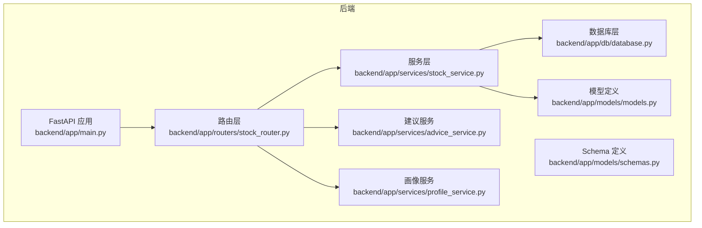
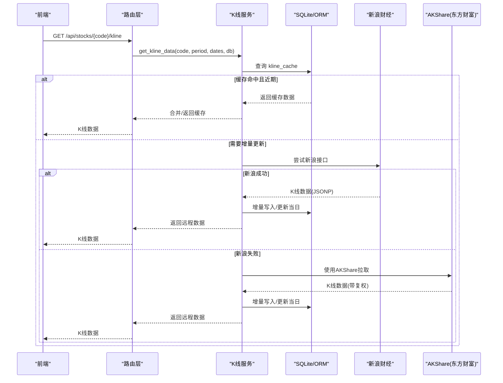
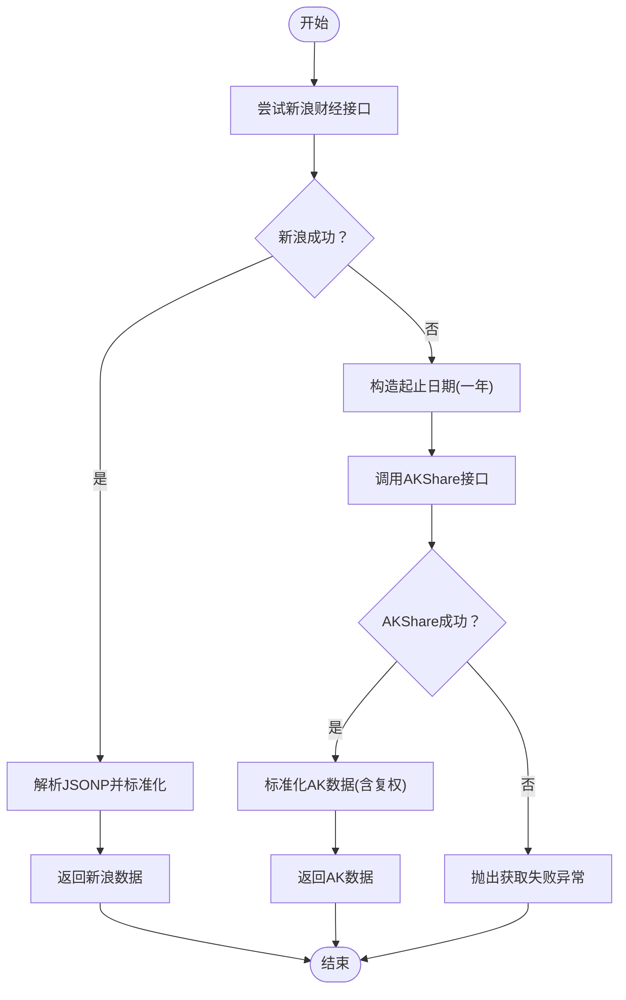
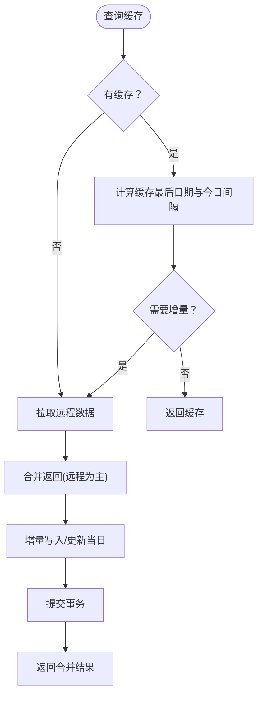
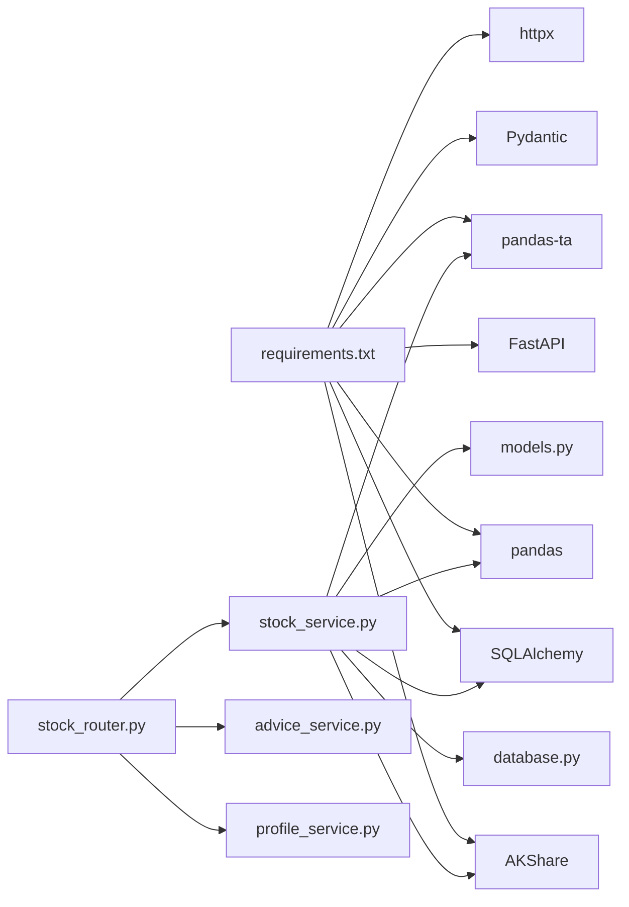

# K线数据获取

<cite>
**本文引用的文件**
- [backend/app/main.py](file://backend/app/main.py)
- [backend/app/routers/stock_router.py](file://backend/app/routers/stock_router.py)
- [backend/app/services/stock_service.py](file://backend/app/services/stock_service.py)
- [backend/app/db/database.py](file://backend/app/db/database.py)
- [backend/app/models/models.py](file://backend/app/models/models.py)
- [backend/app/models/schemas.py](file://backend/app/models/schemas.py)
- [backend/app/services/advice_service.py](file://backend/app/services/advice_service.py)
- [backend/app/services/profile_service.py](file://backend/app/services/profile_service.py)
- [doc/技术架构文档.md](file://doc/技术架构文档.md)
- [doc/产品设计文档.md](file://doc/产品设计文档.md)
- [backend/requirements.txt](file://backend/requirements.txt)
</cite>

## 目录
1. [简介](#简介)
2. [项目结构](#项目结构)
3. [核心组件](#核心组件)
4. [架构总览](#架构总览)
5. [详细组件分析](#详细组件分析)
6. [依赖分析](#依赖分析)
7. [性能考量](#性能考量)
8. [故障排查指南](#故障排查指南)
9. [结论](#结论)
10. [附录](#附录)

## 简介
本文件聚焦“K线数据获取模块”，系统性阐述多数据源获取策略（新浪财经 Sina 与 AKShare 东方财富）、本地缓存策略（读取、增量更新、一致性保障）、重试与超时处理、错误恢复、K线数据格式标准化与时间周期转换、以及技术指标计算与建议生成的实现路径。文档同时提供流程图与时序图，帮助读者快速理解从接口调用到前端可视化的完整链路。

## 项目结构
后端采用 FastAPI + SQLAlchemy + SQLite 的轻量架构，K线数据获取位于服务层，路由层负责对外暴露接口，数据库层负责本地缓存与业务数据持久化。

**图表来源**
- [backend/app/main.py:1-28](file://backend/app/main.py#L1-L28)
- [backend/app/routers/stock_router.py:1-197](file://backend/app/routers/stock_router.py#L1-L197)
- [backend/app/services/stock_service.py:1-327](file://backend/app/services/stock_service.py#L1-L327)
- [backend/app/db/database.py:1-24](file://backend/app/db/database.py#L1-L24)
- [backend/app/models/models.py:1-75](file://backend/app/models/models.py#L1-L75)
- [backend/app/models/schemas.py:1-118](file://backend/app/models/schemas.py#L1-L118)
- [backend/app/services/advice_service.py:1-193](file://backend/app/services/advice_service.py#L1-L193)
- [backend/app/services/profile_service.py:1-114](file://backend/app/services/profile_service.py#L1-L114)

**章节来源**
- [backend/app/main.py:1-28](file://backend/app/main.py#L1-L28)
- [backend/app/routers/stock_router.py:1-197](file://backend/app/routers/stock_router.py#L1-L197)
- [doc/技术架构文档.md:19-67](file://doc/技术架构文档.md#L19-L67)

## 核心组件
- K线数据服务：负责多数据源获取、本地缓存、增量更新、格式标准化与异常处理。
- 路由层：对外提供 /api/stocks/{code}/kline 与 /api/stocks/{code}/analysis 等接口。
- 数据库层：SQLite + SQLAlchemy，本地缓存表 kline_cache 与业务表 focus_stock、trade_records。
- 技术指标与建议：基于 pandas-ta 计算指标，基于多因子综合评分生成买卖建议。

**章节来源**
- [backend/app/services/stock_service.py:131-327](file://backend/app/services/stock_service.py#L131-L327)
- [backend/app/routers/stock_router.py:80-131](file://backend/app/routers/stock_router.py#L80-L131)
- [backend/app/db/database.py:1-24](file://backend/app/db/database.py#L1-L24)
- [backend/app/models/models.py:58-75](file://backend/app/models/models.py#L58-L75)
- [backend/app/services/advice_service.py:4-193](file://backend/app/services/advice_service.py#L4-L193)

## 架构总览
K线数据获取的端到端流程如下：前端发起请求 → 路由层解析参数 → 服务层先查本地缓存，再按策略拉取远程数据，写入缓存并返回；随后可选地计算技术指标与生成建议。

**图表来源**
- [backend/app/routers/stock_router.py:82-96](file://backend/app/routers/stock_router.py#L82-L96)
- [backend/app/services/stock_service.py:131-253](file://backend/app/services/stock_service.py#L131-L253)
- [backend/app/db/database.py:22-24](file://backend/app/db/database.py#L22-L24)

## 详细组件分析

### 多数据源获取策略（Sina 与 AKShare）
- 数据源优先级：默认优先使用新浪财经接口，失败后降级到 AKShare（东方财富）。
- 新浪接口特点：返回 JSONP，需解析包裹体；周期映射为分钟数，日K对应 240。
- AKShare 接口特点：支持日/周/月周期，提供前复权（qfq）字段，便于长期趋势分析。
- 降级逻辑：新浪失败捕获异常后，构造起止日期（一年跨度），调用 AKShare 获取完整历史范围数据。

**图表来源**
- [backend/app/services/stock_service.py:240-253](file://backend/app/services/stock_service.py#L240-L253)
- [backend/app/services/stock_service.py:74-104](file://backend/app/services/stock_service.py#L74-L104)
- [backend/app/services/stock_service.py:106-128](file://backend/app/services/stock_service.py#L106-L128)

**章节来源**
- [backend/app/services/stock_service.py:74-128](file://backend/app/services/stock_service.py#L74-L128)
- [backend/app/services/stock_service.py:19-20](file://backend/app/services/stock_service.py#L19-L20)

### 本地缓存策略（读取、增量更新、一致性）
- 读取：按 stock_code + period 查询 kline_cache，按日期升序返回。
- 增量判定：若缓存最后日期距离当前日期不超过 1 天，且缓存长度≥60，则直接返回缓存。
- 增量写入：仅插入未存在的日期；若当日数据已存在则更新当日的开/收/高/低/成交量（盘中更新）。
- 一致性：写入采用批量新增 + commit；若远程拉取失败但已有缓存，则返回缓存，避免中断。

**图表来源**
- [backend/app/services/stock_service.py:153-237](file://backend/app/services/stock_service.py#L153-L237)
- [backend/app/models/models.py:58-75](file://backend/app/models/models.py#L58-L75)

**章节来源**
- [backend/app/services/stock_service.py:153-237](file://backend/app/services/stock_service.py#L153-L237)
- [backend/app/models/models.py:58-75](file://backend/app/models/models.py#L58-L75)

### 数据格式标准化与时间周期转换
- 标准化字段：date、open、close、high、low、volume、turnover。
- 时间周期映射：日K→240 分钟，周K→1200 分钟，月K→7200 分钟。
- 周期转换：AKShare 返回的周期字符串（daily/weekly/monthly）直接用于接口调用；新浪通过 scale 参数转换为分钟数。
- 复权处理：AKShare 提供 qfq（前复权），有助于长期趋势一致性。

**章节来源**
- [backend/app/services/stock_service.py:18-20](file://backend/app/services/stock_service.py#L18-L20)
- [backend/app/services/stock_service.py:106-128](file://backend/app/services/stock_service.py#L106-L128)
- [backend/app/services/stock_service.py:74-104](file://backend/app/services/stock_service.py#L74-L104)

### 重试机制、超时处理与错误恢复
- 重试包装：统一的 _retry_call 函数，支持重试次数与延迟（递增）。
- 超时控制：请求新浪接口设置超时时间；AKShare 通过外部库控制。
- 错误恢复：新浪失败后降级 AKShare；若两者都失败，抛出运行时异常；若仅有缓存，优先返回缓存以保证可用性。

**章节来源**
- [backend/app/services/stock_service.py:22-33](file://backend/app/services/stock_service.py#L22-L33)
- [backend/app/services/stock_service.py:83-84](file://backend/app/services/stock_service.py#L83-L84)
- [backend/app/services/stock_service.py:240-253](file://backend/app/services/stock_service.py#L240-L253)

### 技术指标计算与建议生成
- 指标计算：基于 pandas-ta 计算 MA、MACD、KDJ、RSI、布林带，并将 Series 转为列表（NaN 转 None）。
- 建议生成：综合 MACD、KDJ、RSI、均线、布林带等信号，给出“买入/卖出/持有”及置信度与推理过程。
- 与 K线数据的关系：分析接口返回 K线数据后立即计算指标并生成建议，形成“K线+指标+建议”的完整输出。

**章节来源**
- [backend/app/services/stock_service.py:255-327](file://backend/app/services/stock_service.py#L255-L327)
- [backend/app/services/advice_service.py:4-193](file://backend/app/services/advice_service.py#L4-L193)

## 依赖分析
- 外部库：FastAPI、SQLAlchemy、AKShare、pandas、pandas-ta、Pydantic、httpx。
- 数据库：SQLite，ORM 初始化在应用启动时完成。
- 路由与服务：路由层依赖服务层；服务层依赖数据库层与第三方数据源。

**图表来源**
- [backend/requirements.txt:1-10](file://backend/requirements.txt#L1-L10)
- [backend/app/services/stock_service.py:1-12](file://backend/app/services/stock_service.py#L1-L12)
- [backend/app/db/database.py:1-24](file://backend/app/db/database.py#L1-L24)
- [backend/app/models/models.py:1-75](file://backend/app/models/models.py#L1-L75)
- [backend/app/routers/stock_router.py:1-197](file://backend/app/routers/stock_router.py#L1-L197)
- [backend/app/services/advice_service.py:1-2](file://backend/app/services/advice_service.py#L1-L2)
- [backend/app/services/profile_service.py:1-3](file://backend/app/services/profile_service.py#L1-L3)

**章节来源**
- [backend/requirements.txt:1-10](file://backend/requirements.txt#L1-L10)
- [backend/app/db/database.py:22-24](file://backend/app/db/database.py#L22-L24)

## 性能考量
- 缓存命中优先：当缓存覆盖到最近交易日且长度充足时，直接返回缓存，避免网络请求。
- 增量更新：仅写入缺失日期，减少数据库写入与网络传输。
- 批量写入：新增记录采用 add_all + commit，降低事务开销。
- 指标计算：pandas-ta 在内存中进行向量化计算，适合中小规模序列；若数据量进一步扩大，可考虑分段计算或缓存中间结果。
- 网络请求：统一重试与超时，避免阻塞；新浪接口超时短、AKShare 接口超时较长，合理设置以平衡稳定性与响应速度。

[本节为通用性能建议，不直接分析具体文件]

## 故障排查指南
- 新浪接口失败：检查网络连通性与反爬策略；确认 User-Agent 与 Referer 是否正确；适当增加重试次数与延迟。
- AKShare 接口失败：确认周期参数与日期格式；检查 qfq 复权字段是否存在；必要时缩短时间跨度重试。
- 缓存不一致：确认唯一约束 (stock_code, period, date) 是否生效；检查当日更新逻辑是否覆盖到最新交易日。
- 指标为空：确认输入数据长度是否满足指标计算阈值；检查 NaN 值处理逻辑。
- 路由异常：核对路由参数（period、start_date、end_date）是否传入；查看 HTTP 异常码与错误信息。

**章节来源**
- [backend/app/services/stock_service.py:22-33](file://backend/app/services/stock_service.py#L22-L33)
- [backend/app/services/stock_service.py:153-237](file://backend/app/services/stock_service.py#L153-L237)
- [backend/app/routers/stock_router.py:82-96](file://backend/app/routers/stock_router.py#L82-L96)

## 结论
该 K线数据获取模块通过“本地缓存优先 + 多数据源降级”的策略，在保证数据可用性的前提下兼顾性能与稳定性。标准化的数据格式与清晰的周期映射为后续技术指标计算与建议生成打下坚实基础。建议在生产环境中进一步完善监控与告警，针对不同数据源的可用性与延迟进行动态调整，并对大体量数据场景进行分页与缓存优化。

[本节为总结性内容，不直接分析具体文件]

## 附录

### 接口定义与调用路径
- 获取 K 线数据：GET /api/stocks/{stock_code}/kline
- 获取完整分析：GET /api/stocks/{stock_code}/analysis

上述接口由路由层转发至服务层，服务层负责缓存读取、远程拉取、增量写入与返回。

**章节来源**
- [backend/app/routers/stock_router.py:82-131](file://backend/app/routers/stock_router.py#L82-L131)

### 数据模型与缓存表
- kline_cache：按 stock_code + period + date 唯一约束，字段包含 OHLCV 与换手率。
- focus_stock、trade_records：用于关注股票与交易记录的业务数据。

**章节来源**
- [backend/app/models/models.py:58-75](file://backend/app/models/models.py#L58-L75)
- [backend/app/models/models.py:25-56](file://backend/app/models/models.py#L25-L56)