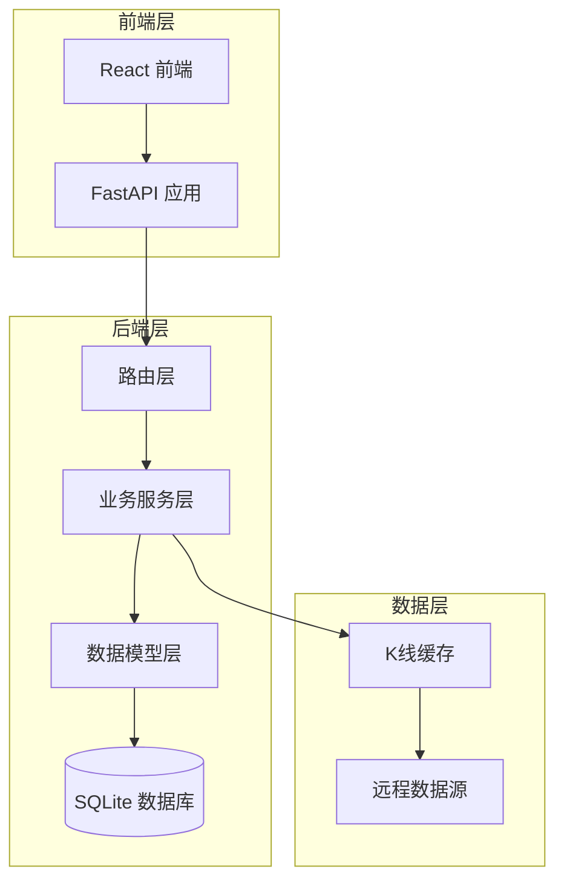
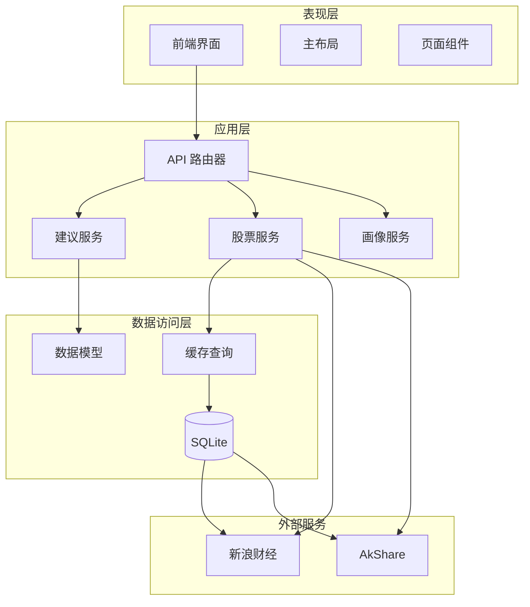
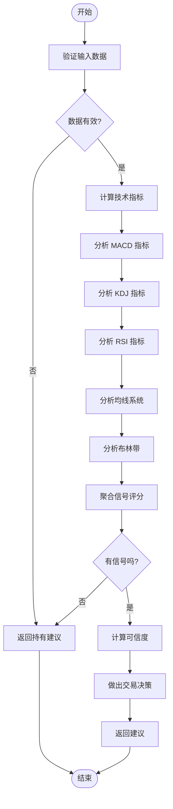
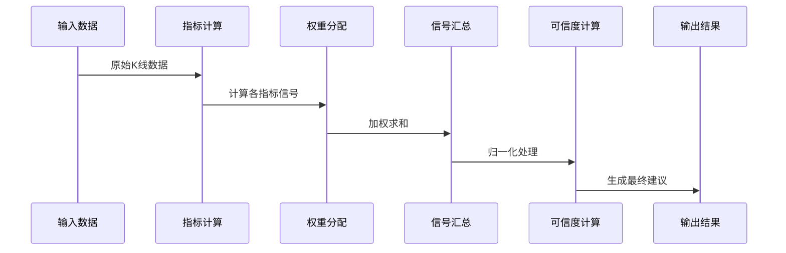
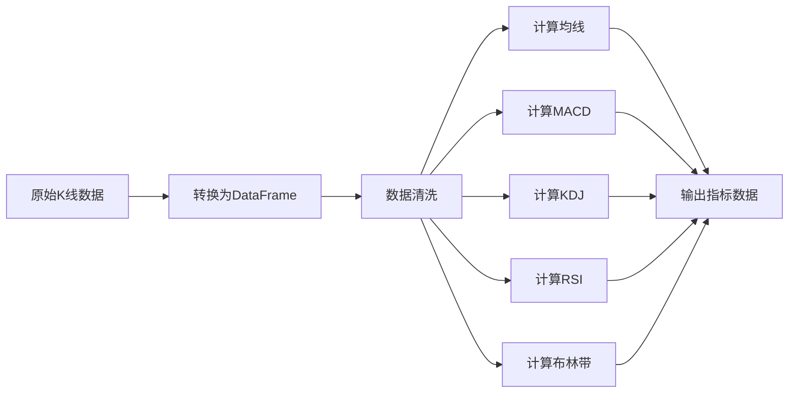
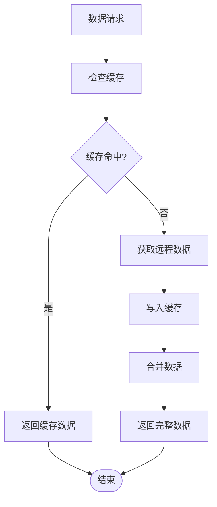
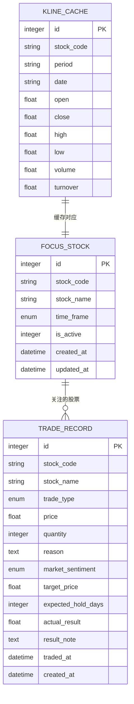
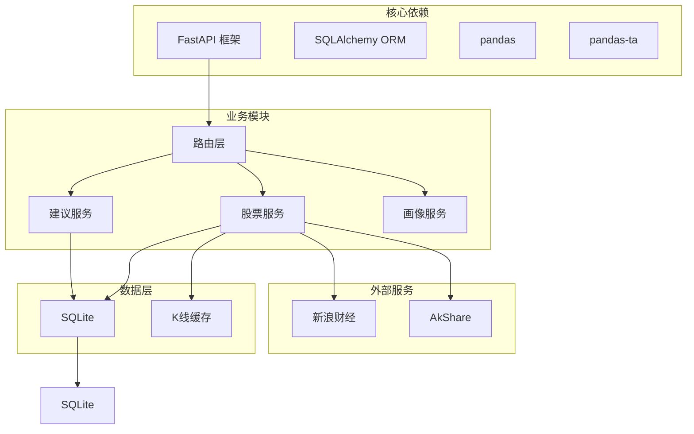

# 买卖建议生成

<cite>
**本文档引用的文件**
- [advice_service.py](file://backend/app/services/advice_service.py)
- [stock_service.py](file://backend/app/services/stock_service.py)
- [stock_router.py](file://backend/app/routers/stock_router.py)
- [models.py](file://backend/app/models/models.py)
- [database.py](file://backend/app/db/database.py)
- [main.py](file://backend/app/main.py)
- [技术架构文档.md](file://doc/技术架构文档.md)
- [MVP实现说明.md](file://doc/MVP实现说明.md)
</cite>

## 目录
1. [简介](#简介)
2. [项目结构](#项目结构)
3. [核心组件](#核心组件)
4. [架构概览](#架构概览)
5. [详细组件分析](#详细组件分析)
6. [依赖关系分析](#依赖关系分析)
7. [性能考量](#性能考量)
8. [故障排除指南](#故障排除指南)
9. [结论](#结论)
10. [附录](#附录)

## 简介

Stock Foker 是一个基于技术指标的智能买卖建议生成系统。该系统通过综合分析多种技术指标，为用户提供客观、可验证的交易建议。本文档深入解释了基于技术指标组合的决策逻辑，包括多指标共振判断和交叉信号识别机制。

系统的核心功能包括：
- 多指标技术分析：MACD、KDJ、RSI、均线、布林带
- 买卖建议生成：基于指标共振的综合评分系统
- 风险评估：可信度评分和动态调整策略
- 交易记录管理：完整的交易生命周期跟踪

## 项目结构

Stock Foker 采用前后端分离的架构设计，后端使用 FastAPI 提供 RESTful API，前端使用 React 构建用户界面。

**图表来源**
- [技术架构文档.md: 19-67:19-67](file://doc/技术架构文档.md#L19-L67)
- [main.py: 1-28:1-28](file://backend/app/main.py#L1-L28)

**章节来源**
- [技术架构文档.md: 1-197:1-197](file://doc/技术架构文档.md#L1-L197)
- [main.py: 1-28:1-28](file://backend/app/main.py#L1-L28)

## 核心组件

系统的核心组件包括技术指标计算、买卖建议生成、数据缓存和交易管理四个主要模块。

### 技术指标计算模块
负责从原始K线数据中计算各种技术指标，包括：
- 移动平均线（MA5、MA10、MA20、MA60）
- MACD 指标（DIF、DEA、柱状图）
- KDJ 指标（K、D、J 值）
- RSI 相对强弱指数
- 布林带（上轨、中轨、下轨）

### 买卖建议生成模块
基于技术指标的综合评分系统，采用多指标共振判断机制：
- 信号权重分配：MACD 1.5分，KDJ 1.0分，RSI 1.0分，均线 1.0分，布林带 0.8分
- 综合评分阈值：>0.3 买入，<-0.3 卖出，其他持有
- 可信度计算：基于信号强度和一致性

### 数据缓存模块
实现本地 SQLite 缓存机制，支持：
- 缓存粒度：按股票代码和周期划分
- 增量更新：仅获取缺失数据
- 双数据源容灾：新浪和 AKShare 双重备份

### 交易管理模块
完整的交易生命周期管理：
- 交易记录存储
- 炒股画像生成
- 交易结果跟踪

**章节来源**
- [stock_service.py: 255-327:255-327](file://backend/app/services/stock_service.py#L255-L327)
- [advice_service.py: 4-193:4-193](file://backend/app/services/advice_service.py#L4-L193)
- [models.py: 25-75:25-75](file://backend/app/models/models.py#L25-L75)

## 架构概览

系统采用分层架构设计，确保各层职责清晰、耦合度低。

**图表来源**
- [stock_router.py: 1-197:1-197](file://backend/app/routers/stock_router.py#L1-L197)
- [stock_service.py: 131-237:131-237](file://backend/app/services/stock_service.py#L131-L237)
- [advice_service.py: 4-193:4-193](file://backend/app/services/advice_service.py#L4-L193)

## 详细组件分析

### 买卖建议生成算法

#### 核心算法流程

**图表来源**
- [advice_service.py: 4-193:4-193](file://backend/app/services/advice_service.py#L4-L193)

#### 指标分析逻辑

##### MACD 指标分析
MACD（Moving Average Convergence Divergence）是衡量股价动量的重要指标，包含三个组成部分：
- DIF（快线）：短期移动平均线与长期移动平均线的差值
- DEA（慢线）：DIF 的移动平均线
- 柱状图（Histogram）：DIF 与 DEA 的差值

**金叉死叉识别机制**：
- 金叉（买入信号）：当 DIF 从下向上穿越 DEA，且柱状图从负值转正值
- 死叉（卖出信号）：当 DIF 从上向下穿越 DEA，且柱状图从正值转负值
- 多头排列：DIF > DEA，市场处于上升趋势
- 空头排列：DIF < DEA，市场处于下降趋势

##### KDJ 指标分析
KDJ 是随机指标的一种变体，包含三个参数：
- K 值：快速随机指标
- D 值：K 值的移动平均
- J 值：3K - 2D

**超买超卖判断**：
- 超买区域：K、D 值均大于 80
- 超卖区域：K、D 值均小于 20
- 偏多判断：K 值大于 D 值
- 偏空判断：K 值小于 D 值

##### RSI 指标分析
RSI（Relative Strength Index）是衡量股价相对强弱的技术指标：
- 超买区域：RSI > 70
- 超卖区域：RSI < 30
- 中性区域：30 ≤ RSI ≤ 70

##### 均线系统分析
均线系统通过多个不同周期的移动平均线组合分析趋势：
- 多头排列：价格 > MA5 > MA10 > MA20 > MA60
- 空头排列：价格 < MA5 < MA10 < MA20 < MA60
- 交织状态：均线相互交错，趋势不明朗

##### 布林带分析
布林带由三条平行线组成：
- 上轨：价格的上限压力位
- 中轨：移动平均线
- 下轨：价格的下限支撑位

**支撑阻力识别**：
- 股价触及上轨：短期回调压力
- 股价触及下轨：短期支撑机会

#### 信号权重分配

系统为不同技术指标分配不同的信号权重，以反映其重要性和可靠性：

| 指标类型 | 买入权重 | 卖出权重 | 说明 |
|---------|---------|---------|------|
| MACD金叉 | +1.5 | -1.5 | 最重要的趋势反转信号 |
| MACD多头排列 | +0.5 | -0.5 | 趋势确认信号 |
| KDJ超卖反弹 | +1.0 | -1.0 | 强反转信号 |
| KDJ偏多 | +0.3 | -0.3 | 中等强度信号 |
| RSI超卖反弹 | +1.0 | -1.0 | 强反转信号 |
| 均线多头排列 | +1.0 | -1.0 | 趋势确认信号 |
| 布林带支撑 | +0.8 | -0.8 | 技术面支撑信号 |

#### 综合评分算法

**图表来源**
- [advice_service.py: 140-173:140-173](file://backend/app/services/advice_service.py#L140-L173)

**可信度评分算法**：
- 基础公式：`confidence = min(|average_signal| / 1.5, 1.0)`
- 信号范围：-1.5 到 +1.5
- 决策阈值：>0.3 买入，<-0.3 卖出，其他持有

**章节来源**
- [advice_service.py: 4-193:4-193](file://backend/app/services/advice_service.py#L4-L193)
- [MVP实现说明.md: 27-42:27-42](file://doc/MVP实现说明.md#L27-L42)

### 技术指标计算模块

#### 数据预处理
技术指标计算前需要对原始数据进行预处理：
- 数据类型转换：将字符串转换为浮点数
- 数据完整性检查：确保所有必需字段存在
- 数据排序：按日期升序排列

#### 指标计算流程

**图表来源**
- [stock_service.py: 255-327:255-327](file://backend/app/services/stock_service.py#L255-L327)

**章节来源**
- [stock_service.py: 255-327:255-327](file://backend/app/services/stock_service.py#L255-L327)

### 数据缓存机制

#### 缓存策略
系统采用智能缓存策略，平衡数据新鲜度和性能：

**图表来源**
- [stock_service.py: 153-237:153-237](file://backend/app/services/stock_service.py#L153-L237)

**缓存更新策略**：
- 缓存有效期：超过1天重新获取
- 增量更新：仅获取缺失日期的数据
- 盘中更新：当日数据允许覆盖更新
- 双数据源容灾：主数据源失败时自动切换

**章节来源**
- [stock_service.py: 131-237:131-237](file://backend/app/services/stock_service.py#L131-L237)

### 交易记录管理系统

#### 数据模型设计

**图表来源**
- [models.py: 25-75:25-75](file://backend/app/models/models.py#L25-L75)

**交易记录字段说明**：
- 基本信息：股票代码、名称、交易类型
- 价格数量：成交价格、数量
- 分析信息：买卖理由、市场情绪
- 目标管理：目标价位、预期持有天数
- 结果跟踪：实际盈亏、结果备注
- 时间戳：交易时间和创建时间

**章节来源**
- [models.py: 25-75:25-75](file://backend/app/models/models.py#L25-L75)

## 依赖关系分析

系统采用模块化设计，各组件之间保持松耦合。

**图表来源**
- [技术架构文档.md: 3-18:3-18](file://doc/技术架构文档.md#L3-L18)
- [stock_router.py: 1-197:1-197](file://backend/app/routers/stock_router.py#L1-L197)

**依赖特点**：
- 明确的层次分离：表现层、应用层、数据访问层
- 最小化外部依赖：仅使用必要的第三方库
- 渐进式扩展：支持未来功能的添加
- 错误处理：完善的异常处理和降级策略

**章节来源**
- [技术架构文档.md: 3-18:3-18](file://doc/技术架构文档.md#L3-L18)
- [stock_router.py: 1-197:1-197](file://backend/app/routers/stock_router.py#L1-L197)

## 性能考量

### 响应时间优化

系统在多个层面进行了性能优化：

**数据库查询优化**：
- 使用索引：股票代码建立索引
- 唯一约束：防止重复数据
- 分页查询：限制返回记录数量

**缓存策略优化**：
- 本地缓存：减少网络请求
- 增量更新：避免全量数据传输
- 内存缓存：股票列表缓存

**API 响应优化**：
- 数据压缩：返回精简的指标数据
- 错误快速失败：及时返回错误信息
- 超时控制：防止长时间阻塞

### 并发处理能力

系统支持高并发场景：
- 异步处理：Future API 支持
- 连接池：数据库连接复用
- 缓存共享：多实例共享缓存

## 故障排除指南

### 常见问题及解决方案

**数据获取失败**：
- 检查网络连接
- 验证股票代码格式
- 查看数据源可用性

**指标计算异常**：
- 确认数据完整性
- 检查数据类型转换
- 验证计算参数

**缓存问题**：
- 清理过期缓存
- 检查磁盘空间
- 重启缓存服务

**API 调用错误**：
- 检查请求参数
- 验证认证信息
- 查看服务器日志

### 调试工具

系统提供多种调试工具：
- 日志记录：详细的执行日志
- 性能监控：响应时间和资源使用
- 错误追踪：异常堆栈信息

**章节来源**
- [stock_service.py: 22-33:22-33](file://backend/app/services/stock_service.py#L22-L33)
- [MVP实现说明.md: 80-86:80-86](file://doc/MVP实现说明.md#L80-L86)

## 结论

Stock Foker 的买卖建议生成系统通过科学的多指标分析方法，为投资者提供了可靠的交易决策支持。系统的主要优势包括：

**技术优势**：
- 多指标融合：综合考虑趋势、动量、超买超卖等因素
- 动态权重：根据信号强度自动调整权重
- 可验证性：提供完整的推理过程和指标数值

**架构优势**：
- 模块化设计：各组件职责明确，易于维护
- 缓存机制：保证数据获取的高效性
- 错误处理：完善的异常处理和降级策略

**实用性优势**：
- 实时数据：支持盘中数据更新
- 历史回溯：支持长期数据分析
- 交易闭环：完整的交易生命周期管理

## 附录

### API 接口规范

系统提供完整的 RESTful API 接口：

**股票关注接口**：
- GET `/api/focus` - 获取当前关注股票
- POST `/api/focus` - 设置关注股票
- PUT `/api/focus/timeframe` - 更新时间框架

**数据分析接口**：
- GET `/api/stocks/{code}/analysis` - 获取完整分析报告
- GET `/api/stocks/{code}/kline` - 获取K线数据

**交易管理接口**：
- GET `/api/trades` - 获取交易记录
- POST `/api/trades` - 创建交易记录
- PUT `/api/trades/{id}` - 更新交易结果

### 风险评估机制

系统目前的风险控制机制相对简单，主要体现在：

**止损位设置**：系统未实现自动止损功能，需要用户自行设置
**仓位控制**：系统不涉及具体的仓位管理逻辑
**趋势判断**：通过均线系统判断趋势方向，但不提供趋势强度量化

### 算法优化建议

基于当前实现，建议的优化方向：

**指标权重优化**：
- 引入机器学习算法优化指标权重
- 基于历史数据回测调整权重
- 考虑不同市场的适应性调整

**信号过滤机制**：
- 添加信号确认机制，避免假突破
- 引入成交量验证信号有效性
- 考虑时间框架的一致性

**风险控制增强**：
- 实现动态止损和止盈
- 添加仓位管理和资金管理
- 引入市场情绪分析

**性能优化**：
- 实现指标计算的增量更新
- 优化数据库查询性能
- 添加分布式缓存支持

**章节来源**
- [stock_router.py: 119-131:119-131](file://backend/app/routers/stock_router.py#L119-L131)
- [MVP实现说明.md: 64-79:64-79](file://doc/MVP实现说明.md#L64-L79)