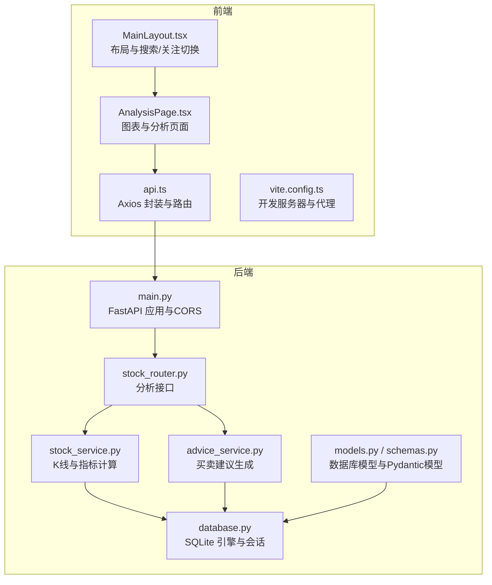
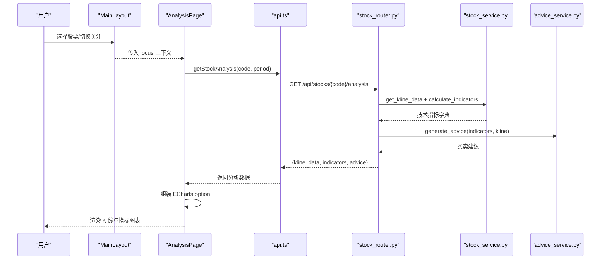
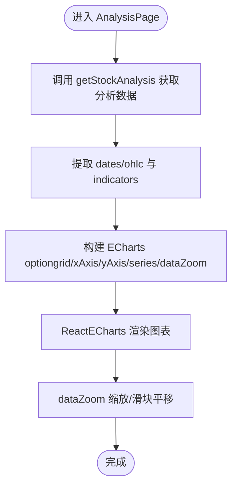
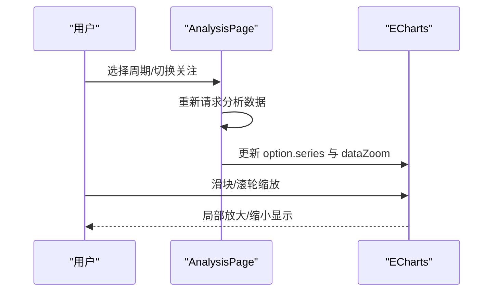
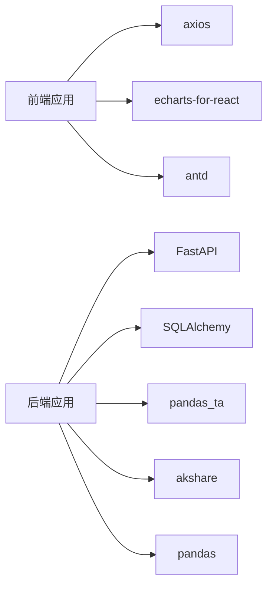

# 图表展示集成

<cite>
**本文引用的文件**

- [AnalysisPage.tsx](file://frontend/src/pages/AnalysisPage.tsx)

- [MainLayout.tsx](file://frontend/src/components/MainLayout.tsx)

- [api.ts](file://frontend/src/services/api.ts)

- [index.ts](file://frontend/src/types/index.ts)

- [vite.config.ts](file://frontend/vite.config.ts)

- [package.json](file://frontend/package.json)

- [stock_router.py](file://backend/app/routers/stock_router.py)

- [stock_service.py](file://backend/app/services/stock_service.py)

- [advice_service.py](file://backend/app/services/advice_service.py)

- [models.py](file://backend/app/models/models.py)

- [schemas.py](file://backend/app/models/schemas.py)

- [database.py](file://backend/app/db/database.py)

- [main.py](file://backend/app/main.py)
</cite>

## 目录
1. [简介](#简介)

2. [项目结构](#项目结构)

3. [核心组件](#核心组件)

4. [架构总览](#架构总览)

5. [详细组件分析](#详细组件分析)

6. [依赖关系分析](#依赖关系分析)

7. [性能考量](#性能考量)

8. [故障排查指南](#故障排查指南)

9. [结论](#结论)

10. [附录](#附录)

## 简介
本文件围绕“图表展示集成”目标，系统化梳理前端 ECharts 图表与后端技术指标计算的协同实现，重点覆盖：

- K线图绘制与 ECharts 配置

- 数据格式转换与指标叠加显示（MACD、KDJ、布林带）

- 用户交互（缩放、平移、指标切换、数据钻取）

- 性能优化（大数据量渲染、虚拟滚动、懒加载）

- 主题定制、响应式与移动端适配

- 前端组件封装与状态管理最佳实践

## 项目结构
前端采用 React + Vite + Ant Design + ECharts 的组合；后端使用 FastAPI + SQLAlchemy + pandas_ta 实现技术指标计算与买卖建议生成。前端通过代理访问后端 API，后端提供统一的分析接口，返回 K 线、技术指标与买卖建议。



**图表来源**

- [MainLayout.tsx:47-281](file://frontend/src/components/MainLayout.tsx#L47-L281)

- [AnalysisPage.tsx:28-231](file://frontend/src/pages/AnalysisPage.tsx#L28-L231)

- [api.ts:1-68](file://frontend/src/services/api.ts#L1-L68)

- [vite.config.ts:1-16](file://frontend/vite.config.ts#L1-L16)

- [main.py:1-28](file://backend/app/main.py#L1-L28)

- [stock_router.py:1-197](file://backend/app/routers/stock_router.py#L1-L197)

- [stock_service.py:1-327](file://backend/app/services/stock_service.py#L1-L327)

- [advice_service.py:1-193](file://backend/app/services/advice_service.py#L1-L193)

- [models.py:1-75](file://backend/app/models/models.py#L1-L75)

- [schemas.py:1-118](file://backend/app/models/schemas.py#L1-L118)

- [database.py:1-24](file://backend/app/db/database.py#L1-L24)

**章节来源**

- [package.json:1-30](file://frontend/package.json#L1-L30)

- [vite.config.ts:1-16](file://frontend/vite.config.ts#L1-L16)

- [main.py:1-28](file://backend/app/main.py#L1-L28)

## 核心组件
- 前端图表容器与配置：AnalysisPage 中的 ECharts 选项与 series 定义，支持 K 线、均线、成交量叠加显示，并内置 dataZoom 缩放与滑块。

- 技术指标计算：后端 stock_service 使用 pandas_ta 计算 MA、MACD、KDJ、RSI、布林带等指标，返回统一格式。

- 买卖建议：advice_service 基于多指标综合打分，输出信号、置信度与推理过程。

- 数据类型定义：前端 types/index.ts 定义了 KlineData、TechnicalIndicators、StockAnalysis 等接口，确保前后端数据契约一致。

- API 服务封装：api.ts 提供 getStockAnalysis 等方法，统一请求路径与参数传递。

- 前端布局与交互：MainLayout 提供搜索、关注切换、时间框架选择等交互入口，AnalysisPage 基于上下文 focus 渲染图表。

**章节来源**

- [AnalysisPage.tsx:28-231](file://frontend/src/pages/AnalysisPage.tsx#L28-L231)

- [stock_service.py:255-327](file://backend/app/services/stock_service.py#L255-L327)

- [advice_service.py:4-173](file://backend/app/services/advice_service.py#L4-L173)

- [index.ts:15-49](file://frontend/src/types/index.ts#L15-L49)

- [api.ts:34-44](file://frontend/src/services/api.ts#L34-L44)

- [MainLayout.tsx:47-281](file://frontend/src/components/MainLayout.tsx#L47-L281)

## 架构总览
前端通过 AnalysisPage 发起分析请求，后端在 stock_router 中整合 K 线查询、指标计算与建议生成，最终返回包含 K 线、指标与建议的结构化数据。前端据此渲染 ECharts 图表。



**图表来源**

- [AnalysisPage.tsx:35-43](file://frontend/src/pages/AnalysisPage.tsx#L35-L43)

- [api.ts:34-44](file://frontend/src/services/api.ts#L34-L44)

- [stock_router.py:98-131](file://backend/app/routers/stock_router.py#L98-L131)

- [stock_service.py:131-253](file://backend/app/services/stock_service.py#L131-L253)

- [advice_service.py:4-173](file://backend/app/services/advice_service.py#L4-L173)

## 详细组件分析

### K线图绘制与 ECharts 配置
- 数据准备：从分析接口获取 kline_data，提取日期数组与 OHLC 四列，用于 K 线 series。

- 图表网格：双 grid 设计，上方为主图（K 线+均线），下方为成交量图，分别绑定不同坐标轴。

- 交互控件：dataZoom 内置缩放与滑块，支持 shift 鼠标滚轮缩放、鼠标拖动平移。

- 样式与颜色：K 线涨跌颜色区分；均线平滑曲线；成交量柱状图按涨跌着色。

- 指标叠加：条件渲染 MA5/10/20/60；后续可扩展至 MACD、KDJ、布林带等。



**图表来源**

- [AnalysisPage.tsx:54-175](file://frontend/src/pages/AnalysisPage.tsx#L54-L175)

**章节来源**

- [AnalysisPage.tsx:54-175](file://frontend/src/pages/AnalysisPage.tsx#L54-L175)

### 技术指标叠加显示
- 指标来源：后端 calculate_indicators 返回 ma5/10/20/60、macd、kdj、rsi、boll、volumes 等。

- 前端叠加：K 线主图叠加 MA 系列；成交量子图叠加成交量柱状图。

- 扩展点：可在前端 series 中增加 MACD 柱状图与 KDJ 曲线，以及布林带区域填充（需在 option 中配置 areaStyle 或辅助 series）。

```mermaid
classDiagram
class TechnicalIndicators {
+ma5 : number[]|null[]
+ma10 : number[]|null[]
+ma20 : number[]|null[]
+ma60 : number[]|null[]
+macd : {dif, dea, histogram}
+kdj : {k, d, j}
+rsi : number[]|null[]
+boll : {upper, middle, lower}
+volumes : number[]
}
class StockAnalysis {
+kline_data : KlineData[]
+indicators : TechnicalIndicators
+advice : TradingAdvice
}
StockAnalysis --> TechnicalIndicators : "包含"
```

**图表来源**

- [index.ts:25-49](file://frontend/src/types/index.ts#L25-L49)

- [stock_service.py:255-319](file://backend/app/services/stock_service.py#L255-L319)

**章节来源**

- [index.ts:25-49](file://frontend/src/types/index.ts#L25-L49)

- [stock_service.py:255-319](file://backend/app/services/stock_service.py#L255-L319)

### 用户交互功能
- 缩放与平移：dataZoom 内置模式，支持 shift 鼠标滚轮缩放与鼠标拖动平移。

- 指标切换：前端通过条件渲染 MA 系列；可扩展为动态切换 MA 参数或显示其他指标。

- 数据钻取：通过 dataZoom 的 slider 和 inside 控件，用户可自由选择时间区间进行深入观察。

- 关注与时间框架：MainLayout 支持切换关注股票与时间框架，影响后端分析维度。



**图表来源**

- [AnalysisPage.tsx:28-43](file://frontend/src/pages/AnalysisPage.tsx#L28-L43)

- [MainLayout.tsx:142-165](file://frontend/src/components/MainLayout.tsx#L142-L165)

**章节来源**

- [AnalysisPage.tsx:69-90](file://frontend/src/pages/AnalysisPage.tsx#L69-L90)

- [MainLayout.tsx:142-165](file://frontend/src/components/MainLayout.tsx#L142-L165)

### 图表性能优化策略
- 大数据量渲染：后端对 K 线进行本地缓存与增量更新，减少重复抓取；前端 dataZoom 内置缩放，避免一次性渲染全部数据。

- 虚拟滚动与懒加载：当前未实现虚拟滚动；可在 ECharts 外层容器结合虚拟列表组件实现“按需渲染”，仅渲染可视窗口内的数据片段。

- 指标计算优化：pandas_ta 已在后端完成批量化计算；前端可按需请求指标，避免冗余传输。

- 缓存与去重：后端缓存 K 线，避免频繁网络请求；前端可对相同请求进行去重与节流。

**章节来源**

- [stock_service.py:153-237](file://backend/app/services/stock_service.py#L153-L237)

- [AnalysisPage.tsx:69-90](file://frontend/src/pages/AnalysisPage.tsx#L69-L90)

### 主题定制、响应式与移动端适配
- 主题定制：ECharts option 中可配置颜色、字体、边距等样式；建议在全局样式中统一主题变量。

- 响应式：通过 Ant Design 的 Grid 布局与卡片自适应，图表容器设置固定高度；可进一步在 option 中启用自适应宽高。

- 移动端适配：建议在移动端使用更紧凑的 dataZoom 设置与较小的字体；必要时降低 series 数量以提升性能。

**章节来源**

- [AnalysisPage.tsx:186-188](file://frontend/src/pages/AnalysisPage.tsx#L186-L188)

### 前端组件封装与状态管理最佳实践
- 组件职责分离：MainLayout 负责全局交互与上下文，AnalysisPage 专注图表渲染与数据处理。

- 状态管理：使用 React hooks 管理图表周期、加载状态与错误信息；通过 useOutletContext 在路由间传递 focus。

- API 封装：api.ts 统一封装请求方法，便于测试与替换实现。

- 类型安全：types/index.ts 明确数据结构，前后端契约清晰，减少运行时错误。

**章节来源**

- [MainLayout.tsx:47-281](file://frontend/src/components/MainLayout.tsx#L47-L281)

- [AnalysisPage.tsx:28-43](file://frontend/src/pages/AnalysisPage.tsx#L28-L43)

- [api.ts:1-68](file://frontend/src/services/api.ts#L1-L68)

- [index.ts:1-94](file://frontend/src/types/index.ts#L1-L94)

## 依赖关系分析
- 前端依赖：React、Ant Design、ECharts、echarts-for-react、axios、dayjs、react-router-dom。

- 后端依赖：FastAPI、SQLAlchemy、pandas_ta、akshare、requests、pandas。

- 开发工具：Vite、TypeScript、@vitejs/plugin-react。



**图表来源**

- [package.json:11-21](file://frontend/package.json#L11-L21)

- [main.py:1-28](file://backend/app/main.py#L1-L28)

- [stock_service.py:1-10](file://backend/app/services/stock_service.py#L1-L10)

**章节来源**

- [package.json:1-30](file://frontend/package.json#L1-L30)

## 性能考量
- 后端缓存与增量更新：减少网络请求与计算开销，提升响应速度。

- 前端 dataZoom：局部缩放，避免全量渲染。

- 指标计算：后端批量化处理，前端仅接收结果。

- 建议优化：引入虚拟滚动与懒加载、指标按需请求、option 自适应与移动端优化。

[本节为通用性能讨论，无需具体文件来源]

## 故障排查指南
- 请求失败：检查前端代理配置与后端 CORS 设置；确认 /api 前缀与端口一致。

- 数据为空：确认 focus 是否存在、period 是否正确、后端是否成功返回指标。

- 图表异常：检查 series 数据格式是否符合 ECharts 要求（OHLC、时间序列）。

- 时间框架：确认后端时间框架字段与前端枚举一致。

**章节来源**

- [vite.config.ts:8-13](file://frontend/vite.config.ts#L8-L13)

- [main.py:9-15](file://backend/app/main.py#L9-L15)

- [AnalysisPage.tsx:35-43](file://frontend/src/pages/AnalysisPage.tsx#L35-L43)

## 结论
该图表展示集成以 React + ECharts 为核心，配合后端 pandas_ta 技术指标计算与建议生成，实现了从数据获取、指标计算到可视化呈现的完整链路。当前已具备 K 线、均线与成交量的叠加显示及基础交互能力；后续可在前端扩展 MACD/KDJ/布林带叠加与区域填充，在后端引入更丰富的指标与预测模型，并在前端引入虚拟滚动与移动端优化，以进一步提升性能与用户体验。

[本节为总结性内容，无需具体文件来源]

## 附录
- 数据类型定义参考：KlineData、TechnicalIndicators、StockAnalysis、TradingAdvice。

- 接口定义参考：AnalysisPage 中的 getStockAnalysis 调用与后端 /api/stocks/{code}/analysis。

**章节来源**

- [index.ts:15-49](file://frontend/src/types/index.ts#L15-L49)

- [api.ts:34-44](file://frontend/src/services/api.ts#L34-L44)

- [stock_router.py:98-131](file://backend/app/routers/stock_router.py#L98-L131)
